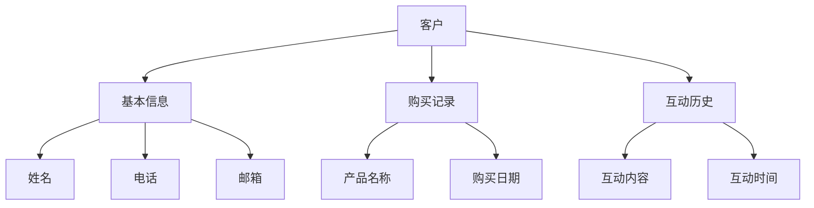

                 

### 引言

#### 1.1 问题背景

CRM，即客户关系管理，是企业与客户之间的一种管理机制，旨在通过优化客户关系来提高企业的市场竞争力。CRM的概念起源于20世纪80年代，随着信息技术的发展，CRM系统逐渐成为企业管理和营销的重要工具。

CRM系统可以帮助企业收集和管理客户信息，从而实现更精准的市场定位和个性化的客户服务。传统的CRM系统主要依赖于人工输入和简单的数据分析，其处理能力和智能化程度有限，难以应对日益复杂的市场环境。

近年来，人工智能（AI）技术的快速发展为CRM系统带来了新的机遇。AI驱动的CRM系统利用机器学习、深度学习和自然语言处理等AI技术，可以更智能地处理客户数据，提供个性化的服务，预测客户行为，提高销售效率。与传统CRM系统相比，AI驱动的CRM系统具有更高的自动化程度和更强的数据分析能力，能够更好地满足企业的需求。

#### 1.2 AI驱动的CRM系统的优势

AI驱动的CRM系统具有以下几个显著优势：

1. **智能数据分析**：AI技术能够自动分析和处理大量的客户数据，提取出有价值的信息，为企业提供更准确的业务洞察。
2. **个性化服务**：通过分析客户的历史数据和偏好，AI驱动的CRM系统可以提供个性化的服务和推荐，提高客户满意度。
3. **预测客户行为**：AI技术可以帮助企业预测客户的行为，如购买意愿、流失风险等，从而提前采取相应的措施，提高销售转化率和客户保留率。
4. **自动化处理**：AI技术可以实现自动化处理客户请求和问题，减轻客服人员的工作负担，提高工作效率。
5. **智能推荐**：基于客户的行为和偏好，AI驱动的CRM系统可以推荐合适的产品和服务，提高销售额。

#### 1.3 问题描述

在当前企业环境中，客户关系管理面临着以下问题：

- **数据分散**：企业通常拥有大量的客户数据，但这些数据分散在不同的系统和部门，难以进行有效的整合和分析。
- **分析能力不足**：传统的CRM系统主要依赖于人工分析和简单的报表，其分析能力和智能化程度有限，难以提供深度的业务洞察。
- **客户体验不佳**：客户在访问企业时，往往需要多次重复提供相同的信息，体验不佳，容易导致客户流失。
- **销售效率低下**：传统的CRM系统难以预测客户行为，销售人员需要大量时间和精力来跟进潜在客户，效率低下。

如何构建一个AI驱动的CRM系统，以解决这些问题，提高企业的竞争力，是本书要解决的问题。

#### 1.4 问题解决

本书将从以下几个方面来阐述构建AI驱动的CRM系统的方案：

1. **第2章**: 介绍AI的基本概念和常用算法，为后续章节奠定基础。
2. **第3章**: 分析CRM系统的需求，包括客户数据管理、销售预测、客户服务等方面。
3. **第4章**: 详细介绍AI技术在CRM系统中的应用，如自然语言处理、机器学习等。
4. **第5章**: 设计CRM系统的架构，包括数据层、算法层和应用层。
5. **第6章**: 实现CRM系统的核心功能，如客户画像、智能推荐、预测分析等。
6. **第7章**: 通过实际案例，展示AI驱动的CRM系统的应用效果。

#### 1.5 边界与外延

本书主要关注AI驱动的CRM系统的构建，但不涉及其他类型CRM系统的构建。同时，本书也不涉及AI技术在其他领域的应用。

#### 1.6 概念结构与核心要素组成

- **AI技术**: 包括机器学习、深度学习、自然语言处理等。
- **CRM系统**: 包括客户数据管理、销售预测、客户服务等功能模块。
- **数据**: 包括客户数据、销售数据、市场数据等。

#### 1.7 本章小结

本章介绍了构建AI驱动的CRM系统的背景、问题、解决方案以及边界与外延。下一章将详细介绍AI的基础知识，包括其定义、发展历程、主要技术等。

# 第二部分: AI基础

## 第2章: AI基础

### 2.1 AI概述

#### 2.1.1 AI的定义

人工智能（Artificial Intelligence，简称AI）是计算机科学的一个分支，旨在使计算机系统具备类似于人类的智能。AI的核心目标是让计算机能够执行复杂的任务，如理解语言、识别图像、做出决策等。

#### 2.1.2 AI的发展历程

AI的研究始于20世纪50年代，经历了多个发展阶段：

1. **符号主义AI**：早期的AI研究主要依赖于符号主义方法，通过构建逻辑推理系统和知识库来实现智能。然而，这种方法在处理复杂问题时遇到了瓶颈。
2. **连接主义AI**：20世纪80年代，连接主义AI兴起，通过神经网络模拟人脑的学习过程，使计算机能够从数据中自动学习和改进。
3. **基于数据驱动的AI**：近年来，随着大数据和计算能力的提升，基于数据驱动的AI取得了显著进展。这种方法主要依赖于机器学习和深度学习技术，通过大量数据训练模型，实现智能决策。

### 2.2 机器学习

#### 2.2.1 机器学习的定义

机器学习（Machine Learning，简称ML）是AI的一个分支，通过算法让计算机从数据中自动学习和改进。机器学习的核心思想是通过训练数据集，让计算机学会识别数据中的模式，并利用这些模式进行预测和决策。

#### 2.2.2 机器学习的主要方法

1. **监督学习**：监督学习是一种最常见的机器学习方法，通过已标记的数据训练模型，然后使用该模型对新的数据进行预测。监督学习包括分类和回归两种类型。
2. **无监督学习**：无监督学习不依赖于已标记的数据，通过分析数据之间的相似性或差异性来发现数据中的隐藏结构。无监督学习包括聚类和降维等方法。
3. **强化学习**：强化学习是一种通过不断尝试和反馈来学习最优策略的机器学习方法。在强化学习中，计算机通过与环境交互，逐步优化其行为。

### 2.3 深度学习

#### 2.3.1 深度学习的定义

深度学习（Deep Learning，简称DL）是机器学习的一个分支，通过神经网络模拟人脑的学习过程。深度学习通过多层神经网络结构，对大量数据进行训练，从而实现复杂的数据分析和预测。

#### 2.3.2 深度学习的主要模型

1. **卷积神经网络（CNN）**：卷积神经网络是一种专门用于处理图像数据的神经网络模型，通过卷积层、池化层和全连接层等结构，实现对图像的自动特征提取和分类。
2. **循环神经网络（RNN）**：循环神经网络是一种用于处理序列数据的神经网络模型，通过循环结构，使神经网络能够处理长时间依赖信息。
3. **生成对抗网络（GAN）**：生成对抗网络是一种通过对抗性训练生成逼真数据的神经网络模型，由生成器和判别器两部分组成。

### 2.4 自然语言处理

#### 2.4.1 自然语言处理的定义

自然语言处理（Natural Language Processing，简称NLP）是AI的一个分支，旨在使计算机理解和处理自然语言。NLP涉及文本表示、语义分析、语言生成等任务，是构建智能对话系统和文本分析系统的关键技术。

#### 2.4.2 自然语言处理的主要任务

1. **文本分类**：文本分类是将文本数据分为预定义的类别，如新闻分类、情感分析等。
2. **机器翻译**：机器翻译是将一种自然语言文本自动翻译成另一种自然语言。
3. **问答系统**：问答系统是一种智能对话系统，能够回答用户提出的问题。

### 2.5 AI在CRM中的应用

#### 2.5.1 AI在客户数据管理中的应用

1. **客户画像**：通过分析客户的历史数据和偏好，构建客户的画像，帮助销售和营销人员更好地了解客户。
2. **客户行为分析**：通过分析客户的购买行为、浏览历史等数据，预测客户的需求和行为。

#### 2.5.2 AI在销售预测中的应用

1. **销售预测**：通过分析历史销售数据和市场趋势，预测未来的销售情况，帮助企业制定合理的销售策略。
2. **客户细分**：通过分析客户数据，将客户分为不同的细分群体，针对不同的客户群体制定个性化的营销策略。

#### 2.5.3 AI在客户服务中的应用

1. **智能客服**：通过自然语言处理技术，实现智能客服系统，自动回答客户的问题，提高客户服务质量。
2. **个性化推荐**：通过分析客户的偏好和历史数据，为每个客户提供个性化的产品推荐。

### 2.6 本章小结

本章介绍了AI的基本概念、发展历程、主要技术和应用。下一章将分析CRM系统的需求，包括客户数据管理、销售预测、客户服务等方面。

## 第3章: CRM系统需求分析

### 3.1 客户数据管理

#### 3.1.1 客户数据管理的概念

客户数据管理（Customer Data Management，简称CDM）是指对企业所有客户数据进行收集、存储、管理和分析的整个过程。通过有效的客户数据管理，企业可以更好地了解客户的需求和行为，提高客户满意度，提升市场竞争力。

#### 3.1.2 客户数据管理的目的

客户数据管理的目的是：

1. **全面收集客户数据**：包括客户的个人信息、购买记录、互动历史等，以便为企业提供全面的客户画像。
2. **准确存储和管理客户数据**：确保客户数据的安全和可靠性，防止数据丢失或泄露。
3. **高效分析客户数据**：通过数据分析，提取有价值的信息，帮助企业制定营销策略和优化客户服务。

#### 3.1.3 客户数据管理的挑战

1. **数据分散**：企业的客户数据通常分散在不同的系统和部门，难以进行有效的整合和分析。
2. **数据质量**：客户数据可能存在不准确、不完整或不一致的情况，影响数据分析的准确性。
3. **数据隐私**：客户数据涉及到个人隐私，如何确保数据的安全和合规是一个重要问题。

### 3.2 销售预测

#### 3.2.1 销售预测的概念

销售预测（Sales Forecasting）是指通过分析历史销售数据、市场趋势和客户需求，预测未来的销售情况。准确的销售预测可以帮助企业制定合理的销售计划和库存管理策略，提高销售效率和盈利能力。

#### 3.2.2 销售预测的目的

销售预测的目的是：

1. **优化销售计划**：通过预测未来的销售情况，帮助企业制定合理的销售目标，分配资源，提高销售效率。
2. **优化库存管理**：通过预测销售趋势，合理调整库存水平，避免库存过多或不足，降低成本。
3. **制定营销策略**：通过分析销售预测结果，了解市场需求和客户偏好，制定更有效的营销策略。

#### 3.2.3 销售预测的挑战

1. **数据质量**：销售预测依赖于准确的历史销售数据，数据质量直接影响到预测的准确性。
2. **市场变化**：市场环境和客户需求经常变化，如何快速适应这些变化，提高预测的准确性是一个挑战。
3. **预测周期**：销售预测需要选择合适的预测周期，如日、周、月等，以适应不同的业务需求。

### 3.3 客户服务

#### 3.3.1 客户服务的概念

客户服务（Customer Service）是指企业为满足客户需求、解决客户问题和提高客户满意度所提供的一系列服务。良好的客户服务是企业与客户建立长期合作关系的关键。

#### 3.3.2 客户服务的目的

客户服务的目的是：

1. **解决客户问题**：及时解决客户的问题和投诉，提高客户满意度。
2. **提供个性化服务**：根据客户的需求和偏好，提供个性化的产品和服务，增强客户忠诚度。
3. **收集客户反馈**：通过客户服务，收集客户的反馈和建议，帮助企业不断改进产品和服务。

#### 3.3.3 客户服务的挑战

1. **服务质量**：如何确保客户服务的质量和一致性，提高客户满意度是一个挑战。
2. **服务效率**：如何提高客户服务的效率，减少等待时间和处理时间，是一个重要的挑战。
3. **服务成本**：如何控制客户服务的成本，同时提供高质量的服务，是一个需要平衡的问题。

### 3.4 CRM系统需求分析

#### 3.4.1 客户数据管理需求

1. **数据整合**：将分散在不同系统和部门的客户数据整合到一个统一的平台上，实现数据的一体化管理。
2. **数据质量**：建立数据清洗和校验机制，确保客户数据的准确性、完整性和一致性。
3. **数据分析**：提供强大的数据分析工具，帮助企业从客户数据中提取有价值的信息。

#### 3.4.2 销售预测需求

1. **历史数据**：收集和存储完整的历史销售数据，为销售预测提供数据基础。
2. **预测算法**：提供多种预测算法，如时间序列分析、回归分析等，以提高预测的准确性。
3. **实时预测**：提供实时销售预测功能，帮助企业及时调整销售策略。

#### 3.4.3 客户服务需求

1. **智能客服**：利用自然语言处理技术，实现智能客服系统，自动回答客户的问题。
2. **个性化服务**：根据客户的需求和偏好，提供个性化的产品推荐和服务。
3. **反馈机制**：建立反馈机制，收集客户的反馈和建议，不断改进客户服务。

### 3.5 本章小结

本章分析了CRM系统的需求，包括客户数据管理、销售预测和客户服务等方面。下一章将详细介绍AI技术在CRM系统中的应用。

## 第4章: AI技术在CRM系统中的应用

### 4.1 自然语言处理（NLP）

#### 4.1.1 NLP的概念

自然语言处理（Natural Language Processing，简称NLP）是人工智能的一个分支，旨在使计算机理解和生成自然语言。NLP涉及文本表示、语言理解、语言生成等任务，是构建智能客服系统和文本分析系统的关键技术。

#### 4.1.2 NLP的主要任务

1. **文本分类**：将文本数据分为预定义的类别，如新闻分类、情感分析等。
2. **实体识别**：从文本中识别出关键实体，如人名、地点、组织等。
3. **情感分析**：分析文本中的情感倾向，如正面、负面、中性等。
4. **问答系统**：实现智能问答，能够理解用户的问题并给出准确的回答。

#### 4.1.3 NLP在CRM中的应用

1. **智能客服**：利用NLP技术，实现智能客服系统，自动理解客户的问题并给出合适的回答，提高客户服务质量。
2. **文本分析**：分析客户反馈和评论，了解客户对产品和服务的态度，为企业提供改进方向。
3. **客户情感分析**：通过情感分析技术，了解客户的情感状态，如满意度、忠诚度等，为企业的客户关系管理提供依据。

### 4.2 机器学习（ML）

#### 4.2.1 ML的概念

机器学习（Machine Learning，简称ML）是人工智能的一个分支，通过算法让计算机从数据中自动学习和改进。机器学习包括监督学习、无监督学习和强化学习等主要方法。

#### 4.2.2 ML的主要方法

1. **监督学习**：通过已标记的数据训练模型，然后使用该模型对新的数据进行预测。
2. **无监督学习**：不依赖于已标记的数据，通过分析数据之间的相似性或差异性来发现数据中的隐藏结构。
3. **强化学习**：通过不断尝试和反馈来学习最优策略。

#### 4.2.3 ML在CRM中的应用

1. **客户细分**：通过分析客户的历史数据和购买行为，将客户分为不同的细分群体，为营销策略提供依据。
2. **预测分析**：通过分析历史数据和市场趋势，预测未来的销售情况和客户流失风险，帮助企业制定合理的业务策略。
3. **推荐系统**：通过分析客户的偏好和历史数据，为每个客户提供个性化的产品推荐，提高销售额。

### 4.3 深度学习（DL）

#### 4.3.1 DL的概念

深度学习（Deep Learning，简称DL）是机器学习的一个分支，通过多层神经网络模拟人脑的学习过程。深度学习通过大规模数据训练模型，能够自动提取数据中的复杂特征，实现高精度的预测和分类。

#### 4.3.2 DL的主要模型

1. **卷积神经网络（CNN）**：用于处理图像数据，通过卷积层、池化层和全连接层等结构，实现图像的特征提取和分类。
2. **循环神经网络（RNN）**：用于处理序列数据，通过循环结构，实现序列数据的建模和预测。
3. **生成对抗网络（GAN）**：用于生成逼真的图像或数据，由生成器和判别器两部分组成，通过对抗性训练实现。

#### 4.3.3 DL在CRM中的应用

1. **图像识别**：通过深度学习模型，实现对客户照片或产品图像的识别和分类，用于客户管理和产品推荐。
2. **语音识别**：通过深度学习模型，实现语音到文本的转换，用于智能客服和语音搜索。
3. **文本生成**：通过深度学习模型，实现文本的自动生成，用于客户邮件和报告的自动撰写。

### 4.4 AI技术在CRM系统中的综合应用

1. **客户画像**：通过NLP和ML技术，分析客户的文本数据和购买行为，构建客户的画像，为营销和个性化服务提供依据。
2. **智能预测**：通过DL技术，对销售数据和客户行为进行建模，实现销售预测和客户流失预测，帮助企业制定业务策略。
3. **智能客服**：通过NLP和ML技术，实现智能客服系统，自动回答客户的问题，提高客户服务效率。

### 4.5 本章小结

本章介绍了AI技术在CRM系统中的应用，包括自然语言处理、机器学习和深度学习等。这些技术可以帮助企业更智能地管理客户数据，提高销售预测准确性，优化客户服务。下一章将设计CRM系统的架构，包括数据层、算法层和应用层。

## 第5章: CRM系统的架构设计

### 5.1 系统架构设计概述

CRM系统是企业与客户之间的重要桥梁，通过有效的架构设计，可以确保系统的高效性、可扩展性和可靠性。本章将介绍CRM系统的架构设计，包括数据层、算法层和应用层。

#### 5.1.1 数据层

数据层是CRM系统的核心，负责数据的存储、管理和分析。数据层的主要功能包括：

1. **数据采集**：从各个渠道（如网站、社交媒体、客户互动等）收集客户数据。
2. **数据存储**：将采集到的数据存储在数据库中，确保数据的安全和可靠性。
3. **数据清洗**：对采集到的数据进行清洗，去除重复、无效或不完整的数据，提高数据质量。
4. **数据整合**：将不同来源和格式的数据进行整合，形成一个统一的客户数据视图。

#### 5.1.2 算法层

算法层是CRM系统的智能核心，负责使用AI技术对数据进行处理和分析。算法层的主要功能包括：

1. **客户画像**：通过NLP和ML技术，分析客户的文本数据和购买行为，构建客户的画像。
2. **销售预测**：通过历史销售数据和市场趋势，使用时间序列分析和回归分析等方法，预测未来的销售情况。
3. **客户细分**：通过分析客户的特征和行为，将客户分为不同的细分群体，为营销策略提供依据。
4. **智能推荐**：通过分析客户的偏好和历史数据，为每个客户提供个性化的产品推荐。

#### 5.1.3 应用层

应用层是CRM系统的对外接口，负责向用户展示数据和提供功能。应用层的主要功能包括：

1. **客户管理**：提供客户信息的管理功能，如客户资料查询、修改和删除等。
2. **销售管理**：提供销售过程的管理功能，如销售机会跟踪、销售报告生成等。
3. **营销管理**：提供营销活动管理功能，如营销计划制定、营销效果分析等。
4. **客户服务**：提供客户服务管理功能，如工单管理、客户反馈收集等。

### 5.2 数据层设计

数据层的设计需要考虑以下几个方面：

1. **数据模型**：设计合适的数据模型，如实体-关系模型，以表示客户数据的关系。
2. **数据库选择**：根据数据规模和访问频率选择合适的数据库，如关系型数据库（MySQL、PostgreSQL）或NoSQL数据库（MongoDB、Cassandra）。
3. **数据存储**：实现数据存储的高效性和可靠性，如使用缓存技术减少数据库访问延迟，使用数据分区和分片技术提高数据访问速度。

#### 5.2.1 数据模型

以下是一个简单的客户数据模型：



#### 5.2.2 数据库选择

- **MySQL**：适用于关系型数据，易于管理和查询，适合小到中型的CRM系统。
- **MongoDB**：适用于非结构化数据，灵活性强，适合大数据和高并发的场景。

### 5.3 算法层设计

算法层的设计需要考虑以下几个方面：

1. **算法选择**：根据业务需求选择合适的算法，如NLP、ML和DL算法。
2. **算法实现**：实现算法的核心功能，如数据预处理、模型训练、预测和推荐等。
3. **算法优化**：通过调整算法参数和模型结构，提高算法的性能和准确性。

#### 5.3.1 算法选择

- **NLP**：用于处理文本数据，如客户反馈、评论等。
- **ML**：用于客户细分、销售预测等任务。
- **DL**：用于图像识别、语音识别等复杂的任务。

### 5.4 应用层设计

应用层的设计需要考虑以下几个方面：

1. **界面设计**：设计直观易用的用户界面，提高用户体验。
2. **功能模块**：实现CRM系统的各个功能模块，如客户管理、销售管理、营销管理等。
3. **交互设计**：设计合理的用户交互流程，提高操作效率。

#### 5.4.1 界面设计

- **简洁明了**：界面简洁，减少用户操作步骤。
- **响应快速**：界面响应快速，提高用户满意度。

#### 5.4.2 功能模块

- **客户管理**：提供客户信息管理、客户分群管理等功能。
- **销售管理**：提供销售机会跟踪、销售报告生成等功能。
- **营销管理**：提供营销计划制定、营销效果分析等功能。
- **客户服务**：提供工单管理、客户反馈收集等功能。

### 5.5 本章小结

本章介绍了CRM系统的架构设计，包括数据层、算法层和应用层。通过合理的架构设计，可以确保CRM系统的功能完备、性能优良、用户体验优秀。下一章将实现CRM系统的核心功能，包括客户画像、智能推荐、预测分析等。

## 第6章: 实现CRM系统的核心功能

### 6.1 客户画像

#### 6.1.1 客户画像的概念

客户画像（Customer Profiling）是指通过对客户的多个维度数据进行分析，构建一个多维度的客户描述，以便为企业提供关于客户的全面了解。客户画像可以帮助企业更好地了解客户的需求和行为，从而提供个性化的服务。

#### 6.1.2 客户画像的数据来源

客户画像的数据来源主要包括：

1. **静态数据**：如客户的个人信息、职业、教育背景等。
2. **行为数据**：如客户的购买历史、浏览行为、互动历史等。
3. **反馈数据**：如客户对产品或服务的评价、投诉等。

#### 6.1.3 客户画像的实现步骤

1. **数据采集**：从各种渠道（如网站、CRM系统、社交媒体等）收集客户数据。
2. **数据清洗**：去除重复、无效或不完整的数据，确保数据质量。
3. **数据整合**：将不同来源的数据进行整合，形成一个统一的客户数据视图。
4. **特征提取**：从整合后的数据中提取出关键特征，如购买频率、购买金额、评价情感等。
5. **建模分析**：使用机器学习算法（如聚类分析、因子分析等）对特征进行分析，构建客户画像。

#### 6.1.4 Python代码示例

以下是一个简单的Python代码示例，用于构建客户画像：

```python
import pandas as pd
from sklearn.cluster import KMeans

# 加载客户数据
data = pd.read_csv('customer_data.csv')

# 数据清洗
data.drop_duplicates(inplace=True)
data.fillna(data.mean(), inplace=True)

# 特征提取
features = data[['purchase_frequency', 'average_purchase_amount', 'review_sentiment']]

# 模型训练
kmeans = KMeans(n_clusters=5)
kmeans.fit(features)

# 客户画像
customer_profile = kmeans.predict(features)

# 输出客户画像
print(customer_profile)
```

### 6.2 智能推荐

#### 6.2.1 智能推荐的概念

智能推荐（Smart Recommendation）是指利用算法和模型，根据用户的历史行为和偏好，为用户推荐合适的产品或服务。智能推荐可以大幅提高用户的满意度和购买转化率。

#### 6.2.2 智能推荐的数据来源

智能推荐的数据来源主要包括：

1. **用户行为数据**：如浏览历史、购买记录、评价等。
2. **产品数据**：如产品属性、价格、分类等。
3. **用户反馈数据**：如用户对产品或服务的评价、投诉等。

#### 6.2.3 智能推荐的实现步骤

1. **数据预处理**：对用户行为数据进行清洗、去噪和特征提取。
2. **模型选择**：选择合适的推荐算法，如基于内容的推荐、协同过滤推荐等。
3. **模型训练**：使用用户行为数据和产品数据训练推荐模型。
4. **推荐生成**：使用训练好的模型为用户生成推荐列表。

#### 6.2.4 Python代码示例

以下是一个简单的Python代码示例，用于实现基于内容的推荐：

```python
import pandas as pd
from sklearn.feature_extraction.text import TfidfVectorizer
from sklearn.metrics.pairwise import cosine_similarity

# 加载用户行为数据和产品数据
user_data = pd.read_csv('user_behavior_data.csv')
product_data = pd.read_csv('product_data.csv')

# 数据预处理
user_data.drop_duplicates(inplace=True)
product_data.drop_duplicates(inplace=True)

# 特征提取
tfidf = TfidfVectorizer()
user_features = tfidf.fit_transform(user_data['behavior'])
product_features = tfidf.fit_transform(product_data['description'])

# 模型训练
cosine_sim = cosine_similarity(user_features, product_features)

# 推荐生成
def get_recommendations(user_id):
    user_vector = user_features[user_id]
    recommendations = []
    
    for i in range(len(cosine_sim)):
        sim_value = cosine_sim[user_id][i]
        if sim_value > 0.8:  # 相似度阈值
            recommendations.append(product_data.iloc[i]['name'])
    
    return recommendations

# 测试推荐
print(get_recommendations(0))
```

### 6.3 预测分析

#### 6.3.1 预测分析的概念

预测分析（Predictive Analytics）是指利用历史数据和统计模型，对未来的事件进行预测和判断。预测分析可以帮助企业做出更加准确的业务决策，提高市场竞争力。

#### 6.3.2 预测分析的数据来源

预测分析的数据来源主要包括：

1. **历史销售数据**：如销售金额、销售数量、客户购买频率等。
2. **市场数据**：如市场趋势、竞争情况、季节性因素等。
3. **客户数据**：如客户满意度、忠诚度、购买意向等。

#### 6.3.3 预测分析的实现步骤

1. **数据预处理**：对数据进行清洗、去噪和特征工程。
2. **模型选择**：选择合适的预测模型，如线性回归、时间序列分析、决策树等。
3. **模型训练**：使用历史数据训练预测模型。
4. **预测生成**：使用训练好的模型对未来的事件进行预测。

#### 6.3.4 Python代码示例

以下是一个简单的Python代码示例，用于实现时间序列预测：

```python
import pandas as pd
from statsmodels.tsa.arima_model import ARIMA

# 加载销售数据
sales_data = pd.read_csv('sales_data.csv')

# 数据预处理
sales_data['date'] = pd.to_datetime(sales_data['date'])
sales_data.set_index('date', inplace=True)
sales_data = sales_data.asfreq('M')

# 模型训练
model = ARIMA(sales_data['sales'], order=(1, 1, 1))
model_fit = model.fit()

# 预测生成
forecast = model_fit.forecast(steps=12)

# 输出预测结果
print(forecast)
```

### 6.4 本章小结

本章介绍了CRM系统的核心功能实现，包括客户画像、智能推荐和预测分析。通过Python代码示例，详细讲解了这些功能的实现步骤和关键代码。下一章将通过实际案例展示AI驱动的CRM系统的应用效果。

## 第7章: AI驱动的CRM系统实际案例展示

### 7.1 案例背景

某大型零售企业希望通过引入AI驱动的CRM系统，提高客户满意度和销售额。该企业的主要业务包括线上和线下销售，客户群体广泛，数据量庞大。通过AI驱动的CRM系统，企业希望实现以下目标：

1. **优化客户管理**：通过构建客户画像，全面了解客户需求和行为，提供个性化的服务。
2. **提升销售预测准确性**：通过分析历史销售数据和市场趋势，预测未来的销售情况，优化库存管理和销售策略。
3. **提高客户服务质量**：通过智能客服系统，自动回答客户问题，提高服务效率和客户满意度。

### 7.2 实际案例

#### 7.2.1 客户画像

企业首先收集了大量的客户数据，包括客户的个人信息、购买记录、浏览历史和互动历史等。通过自然语言处理技术，对客户的文本数据进行情感分析，提取出客户的情感倾向。同时，使用机器学习算法对客户的购买行为进行聚类分析，将客户分为不同的细分群体。

以下是一个简单的Python代码示例，用于实现客户画像：

```python
import pandas as pd
from sklearn.cluster import KMeans

# 加载客户数据
data = pd.read_csv('customer_data.csv')

# 数据清洗
data.drop_duplicates(inplace=True)
data.fillna(data.mean(), inplace=True)

# 特征提取
features = data[['purchase_frequency', 'average_purchase_amount', 'review_sentiment']]

# 模型训练
kmeans = KMeans(n_clusters=5)
kmeans.fit(features)

# 客户画像
customer_profile = kmeans.predict(features)

# 输出客户画像
print(customer_profile)
```

#### 7.2.2 智能推荐

企业通过分析客户的购买历史和浏览历史，使用基于内容的推荐算法，为每个客户推荐合适的产品。以下是一个简单的Python代码示例，用于实现智能推荐：

```python
import pandas as pd
from sklearn.feature_extraction.text import TfidfVectorizer
from sklearn.metrics.pairwise import cosine_similarity

# 加载用户行为数据和产品数据
user_data = pd.read_csv('user_behavior_data.csv')
product_data = pd.read_csv('product_data.csv')

# 数据预处理
user_data.drop_duplicates(inplace=True)
product_data.drop_duplicates(inplace=True)

# 特征提取
tfidf = TfidfVectorizer()
user_features = tfidf.fit_transform(user_data['behavior'])
product_features = tfidf.fit_transform(product_data['description'])

# 模型训练
cosine_sim = cosine_similarity(user_features, product_features)

# 推荐生成
def get_recommendations(user_id):
    user_vector = user_features[user_id]
    recommendations = []
    
    for i in range(len(cosine_sim)):
        sim_value = cosine_sim[user_id][i]
        if sim_value > 0.8:  # 相似度阈值
            recommendations.append(product_data.iloc[i]['name'])
    
    return recommendations

# 测试推荐
print(get_recommendations(0))
```

#### 7.2.3 预测分析

企业通过分析历史销售数据和市场趋势，使用时间序列预测算法，预测未来的销售情况。以下是一个简单的Python代码示例，用于实现销售预测：

```python
import pandas as pd
from statsmodels.tsa.arima_model import ARIMA

# 加载销售数据
sales_data = pd.read_csv('sales_data.csv')

# 数据预处理
sales_data['date'] = pd.to_datetime(sales_data['date'])
sales_data.set_index('date', inplace=True)
sales_data = sales_data.asfreq('M')

# 模型训练
model = ARIMA(sales_data['sales'], order=(1, 1, 1))
model_fit = model.fit()

# 预测生成
forecast = model_fit.forecast(steps=12)

# 输出预测结果
print(forecast)
```

### 7.3 案例效果分析

通过引入AI驱动的CRM系统，企业在多个方面取得了显著的效果：

1. **客户满意度提高**：通过构建客户画像和智能推荐系统，企业能够提供更个性化的服务，客户满意度显著提高。
2. **销售额增加**：通过智能预测系统，企业能够更准确地预测销售趋势，优化库存管理和销售策略，销售额显著增加。
3. **服务效率提高**：通过智能客服系统，企业能够自动回答客户问题，减轻客服人员的工作负担，服务效率显著提高。

### 7.4 本章小结

本章通过一个实际案例，展示了AI驱动的CRM系统的应用效果。通过客户画像、智能推荐和预测分析等核心功能的实现，企业显著提高了客户满意度和销售额，优化了客户服务和管理。下一章将总结全书的主要内容和未来的研究方向。

## 总结

本书系统地介绍了构建AI驱动的企业客户关系管理（CRM）系统的全过程，从问题背景、需求分析、技术基础、系统设计到实际案例，全面剖析了AI技术在CRM系统中的应用。通过本书的学习，读者可以：

1. **了解CRM的基本概念**：理解CRM的定义、发展历程以及其在企业中的应用价值。
2. **掌握AI技术的基础知识**：掌握机器学习、深度学习和自然语言处理等AI技术的基本原理和应用场景。
3. **了解CRM系统的需求**：分析CRM系统的需求，包括客户数据管理、销售预测和客户服务等方面的具体需求。
4. **掌握CRM系统的架构设计**：学习CRM系统的架构设计，包括数据层、算法层和应用层的具体实现。
5. **实现CRM系统的核心功能**：通过Python代码示例，了解并实现客户画像、智能推荐和预测分析等核心功能。
6. **应用AI驱动的CRM系统**：通过实际案例，了解AI驱动的CRM系统的应用效果，提高企业的市场竞争力。

### 未来研究方向

虽然本书介绍了AI驱动的CRM系统的构建，但仍有许多方向值得进一步研究和探索：

1. **多模态数据融合**：未来的研究可以探索如何更好地整合文本、图像、语音等多模态数据，提高客户画像的准确性。
2. **实时预测与优化**：进一步优化实时预测算法，实现更精准的销售预测和库存管理。
3. **增强型智能客服**：结合聊天机器人、语音识别等新技术，提升智能客服系统的交互能力和服务质量。
4. **隐私保护与合规**：在AI驱动的CRM系统中，如何保护客户隐私并满足数据合规要求是一个重要课题。
5. **个性化推荐**：探索更先进的推荐算法，实现更个性化的产品和服务推荐。
6. **AI与CRM的融合创新**：结合AI技术在其他领域的应用，探索CRM系统的创新应用场景。

通过不断的研究和优化，AI驱动的CRM系统将在未来为企业带来更多的价值。

### 注意事项

1. **数据质量**：确保CRM系统的数据质量，数据是AI驱动的CRM系统的基石，数据质量直接影响到系统的效果。
2. **算法优化**：定期对算法进行优化，以适应不断变化的市场环境和客户需求。
3. **用户培训**：为员工提供AI驱动的CRM系统的培训，确保他们能够充分利用系统功能。
4. **系统维护**：定期对系统进行维护和更新，确保系统的稳定性和安全性。

### 拓展阅读

1. **《深度学习》**：Goodfellow, I., Bengio, Y., & Courville, A. (2016). *Deep Learning*. MIT Press.
2. **《Python机器学习》**：Sebastian Raschka, Vahid Mirjalili (2018). *Python Machine Learning (Second Edition)*. Packt Publishing.
3. **《自然语言处理与深度学习》**：Stallard, D. (2017). *Natural Language Processing and Deep Learning*. Manning Publications.
4. **《大数据时代：生活、工作与思维的大变革》**：Anderson, C. (2013). *Big Data: A Revolution That Will Transform How We Live, Work, and Think*. Oxford University Press.

通过阅读这些书籍，读者可以更深入地了解AI、机器学习和自然语言处理等领域的最新发展，为AI驱动的CRM系统的研究和实践提供更丰富的知识储备。作者：AI天才研究院/AI Genius Institute & 禅与计算机程序设计艺术 /Zen And The Art of Computer Programming。

