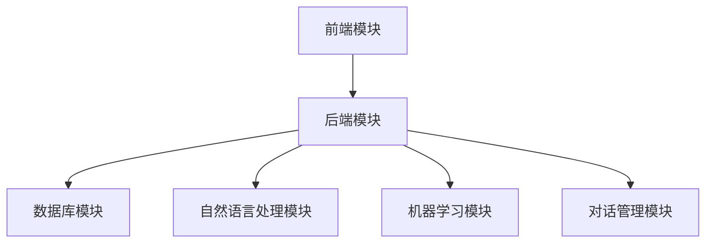
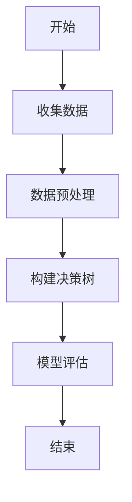

                 

### 《构建AI驱动的企业智能助手：从概念到落地》

> 关键词：人工智能，企业智能化，智能助手，自然语言处理，机器学习，深度学习，架构设计，算法实现，数据分析，项目实战，最佳实践

> 摘要：本文从概念入手，详细阐述了AI驱动的企业智能助手的背景、核心概念、技术原理、架构设计与实现、数据分析和建模、项目实战，以及最佳实践和未来展望。通过一步步的分析推理，读者将了解如何构建并落地一个AI驱动的企业智能助手。

---

## 第一部分: AI驱动的企业智能助手概述

### 第1章: 问题背景与核心概念

#### 1.1.1 问题背景

在当今数字化时代，企业面临着前所未有的挑战和机遇。随着互联网、云计算、大数据等技术的迅猛发展，企业智能化转型已成为不可逆转的趋势。在这一背景下，AI驱动的企业智能助手应运而生，成为企业提高效率、降低成本、提升客户体验的重要工具。

企业智能化转型的需求主要体现在以下几个方面：

1. **提高运营效率**：通过自动化流程、智能决策等手段，减少人力投入，提高工作效率。
2. **降低运营成本**：通过智能化管理，减少资源浪费，降低运营成本。
3. **提升客户体验**：通过智能客服、个性化推荐等方式，提升客户满意度。
4. **增强竞争力**：通过数据分析、市场预测等手段，帮助企业把握市场动态，增强竞争力。

然而，企业智能化转型也面临着诸多挑战：

1. **技术壁垒**：人工智能技术的高门槛，使得企业难以独立进行智能化转型。
2. **数据隐私**：在数据驱动的时代，如何保护用户隐私成为企业面临的重要问题。
3. **人才培养**：人工智能人才的短缺，成为企业智能化转型的瓶颈。

在这种背景下，AI驱动的企业智能助手成为一种可行的解决方案。它通过集成自然语言处理、机器学习、深度学习等技术，为企业提供智能化的解决方案。

#### 1.1.2 核心概念

**人工智能技术概述**

人工智能（Artificial Intelligence，简称AI）是指由人制造出来的系统能够理解、学习、思考、适应和推理的能力。人工智能包括机器学习、深度学习、自然语言处理等多个子领域。

**企业智能助手的功能与作用**

企业智能助手是一种能够理解、处理和回应用户问题的智能系统。它的主要功能包括：

1. **智能问答**：通过自然语言处理技术，理解用户的问题，并给出准确的答案。
2. **自动化流程**：通过流程自动化技术，实现企业内部流程的自动化，提高工作效率。
3. **数据分析与预测**：通过数据分析技术，为企业提供数据驱动的决策支持。

**智能助手的技术架构**

AI驱动的企业智能助手通常包括以下几个模块：

1. **自然语言处理（NLP）**：负责理解用户的问题。
2. **机器学习与深度学习**：负责处理和回应用户的问题。
3. **对话管理**：负责管理对话流程，确保对话的流畅性。
4. **数据处理与存储**：负责存储和处理用户数据。

#### 1.1.3 关联概念解析

**智能化与自动化的区别**

智能化和自动化是两个相关但不完全相同的概念。自动化是指通过技术手段实现任务的自动化执行，而智能化则是在自动化基础上，引入人工智能技术，使得系统能够理解、学习和适应环境。

**企业智能助手与智能客服的区别**

企业智能助手和智能客服都是智能系统，但它们的定位和应用场景不同。智能客服主要面向客户服务场景，通过自然语言处理技术，提供在线客服服务。而企业智能助手则更广泛，它不仅涵盖客服领域，还包括内部流程管理、数据分析等。

**AI驱动的智能助手与传统软件的区别**

传统软件通常是预定义的功能模块，而AI驱动的智能助手则具有自适应性和扩展性。它能够根据用户的需求和行为，动态调整功能和服务。

### 第2章: AI驱动的企业智能助手技术原理

#### 2.1.1 自然语言处理

自然语言处理（Natural Language Processing，简称NLP）是人工智能的一个重要分支，它涉及到计算机和人类语言之间的交互。NLP技术主要包括以下几个方面：

**NLP技术概述**

NLP技术的主要目标是让计算机能够理解和处理自然语言。这包括对文本进行分词、词性标注、命名实体识别等。

**词嵌入与语言模型**

词嵌入是将单词映射到高维向量空间的过程，使得计算机能够理解单词之间的语义关系。语言模型则是通过大量语料库，训练出能够预测下一个单词的概率模型。

**NLP在智能助手中的应用**

在智能助手的应用中，NLP技术负责理解用户的问题。通过NLP技术，智能助手能够将自然语言问题转化为计算机可以理解的结构化数据，从而进行进一步的处理。

#### 2.1.2 机器学习与深度学习

机器学习（Machine Learning，简称ML）是人工智能的一个分支，它通过算法让计算机从数据中学习，并对新数据进行预测或决策。深度学习（Deep Learning，简称DL）是机器学习的一个子领域，它通过神经网络，对大量数据进行自动特征学习和分类。

**基础算法原理**

机器学习的基础算法包括线性回归、决策树、支持向量机等。深度学习的基础算法包括卷积神经网络（CNN）、循环神经网络（RNN）等。

**深度学习在智能助手中的应用**

在智能助手的应用中，深度学习技术负责处理和回应用户的问题。通过深度学习，智能助手能够更好地理解用户的意图，并提供更准确的答案。

**机器学习模型优化与调参**

机器学习模型的优化和调参是提高模型性能的关键步骤。这包括选择合适的算法、调整超参数、进行模型评估等。

#### 2.1.3 计算机视觉

计算机视觉（Computer Vision，简称CV）是人工智能的另一个重要分支，它涉及到计算机对图像或视频的分析和理解。计算机视觉技术主要包括以下几个方面：

**图像处理与识别**

图像处理是对图像进行变换和增强的过程，以便更好地进行分析。图像识别则是通过算法，识别图像中的物体或场景。

**视觉感知在智能助手中的应用**

在智能助手的应用中，计算机视觉技术可以用于图像识别、物体检测等，从而提供更丰富的交互方式。

**计算机视觉的挑战与解决方案**

计算机视觉面临的主要挑战包括光照变化、视角变化、遮挡等。针对这些挑战，研究人员提出了一系列解决方案，如深度学习、多模态学习等。

## 第二部分: 企业智能助手的架构设计与实现

### 第3章: 架构设计与关键技术

#### 3.1.1 系统架构设计

企业智能助手的系统架构设计需要遵循模块化、可扩展、高可用性等原则。一个典型的企业智能助手系统架构包括以下几个模块：

**整体架构设计原则**

1. **模块化**：将系统划分为多个独立的模块，每个模块负责特定的功能。
2. **可扩展**：系统应具有扩展性，能够根据业务需求进行扩展。
3. **高可用性**：系统应具备高可用性，确保在出现故障时，能够快速恢复。

**系统模块划分与功能描述**

1. **前端模块**：负责与用户交互，包括网页、移动应用等。
2. **后端模块**：负责处理和回应用户的问题，包括自然语言处理、机器学习模型等。
3. **数据库模块**：负责存储用户数据和系统配置信息。

**架构图的Mermaid表示**

以下是一个简单的企业智能助手系统架构图的Mermaid表示：



#### 3.1.2 核心技术实现

**语音识别与自然语言理解**

语音识别是将语音信号转换为文本的过程。自然语言理解则是将文本转换为计算机可以理解的结构化数据。

**智能对话管理**

智能对话管理负责管理对话流程，确保对话的流畅性和准确性。它包括对话状态跟踪、意图识别、回答生成等。

**数据处理与存储**

数据处理与存储是企业智能助手的核心组成部分。它包括数据的收集、清洗、存储和管理等。

#### 3.1.3 技术选型与优化

**常用技术栈介绍**

1. **前端技术**：HTML、CSS、JavaScript等。
2. **后端技术**：Python、Java、Node.js等。
3. **数据库技术**：MySQL、MongoDB、Redis等。

**技术选型原则**

1. **性能**：选择高性能的技术和工具。
2. **稳定性**：选择稳定可靠的技术和工具。
3. **可扩展性**：选择易于扩展的技术和工具。

**系统性能优化方法**

1. **缓存**：使用缓存技术，减少数据库查询次数。
2. **负载均衡**：使用负载均衡技术，提高系统的并发处理能力。
3. **分布式存储**：使用分布式存储技术，提高数据的存储性能和可靠性。

### 第4章: 人工智能算法原理与实现

#### 4.1.1 算法原理讲解

**算法概述**

在本章中，我们将介绍几种常见的人工智能算法，包括决策树、支持向量机、神经网络等。

**算法流程图**

以下是决策树的算法流程图：



**算法原理数学模型与公式**

决策树的算法原理可以表示为：

$$
y = f(x_1, x_2, ..., x_n)
$$

其中，$y$ 是决策结果，$x_1, x_2, ..., x_n$ 是特征变量。

**算法举例说明**

假设我们有一个简单的决策树模型，用于预测学生的成绩。特征变量包括数学成绩、英语成绩和总分。

```python
import numpy as np

def predict_math_score(math_score, english_score, total_score):
    if math_score > 90:
        return "优秀"
    elif math_score > 60 and math_score <= 90:
        return "良好"
    else:
        return "及格"

def predict_english_score(english_score, total_score):
    if english_score > 90:
        return "优秀"
    elif english_score > 60 and english_score <= 90:
        return "良好"
    else:
        return "及格"

def predict_total_score(total_score):
    if total_score > 300:
        return "优秀"
    elif total_score > 240 and total_score <= 300:
        return "良好"
    else:
        return "及格"

math_score = 80
english_score = 85
total_score = 265

print(predict_math_score(math_score, english_score, total_score))
print(predict_english_score(english_score, total_score))
print(predict_total_score(total_score))
```

输出结果：

```
良好
良好
及格
```

### 第5章: 数据分析与建模

#### 5.1.1 数据分析基础

数据分析是数据科学的核心任务，它涉及到数据的收集、清洗、存储、处理和分析。以下是一些基本的数据分析步骤：

**数据处理与清洗**

1. **数据收集**：从各种数据源收集数据。
2. **数据清洗**：处理数据中的错误、缺失和重复值。

**数据可视化**

数据可视化是将数据转化为图表和图形的过程，以便更好地理解和分析数据。常用的数据可视化工具包括Matplotlib、Seaborn等。

**数据库与数据仓库技术**

数据库和数据仓库是数据存储和管理的重要工具。数据库主要用于数据的存储和管理，而数据仓库则是用于数据的分析和挖掘。

#### 5.1.2 建模方法与实践

**统计建模**

统计建模是通过统计方法建立数据模型，对数据进行预测和分析。常见的统计建模方法包括线性回归、逻辑回归、决策树等。

**深度学习建模**

深度学习建模是通过神经网络对数据进行自动特征学习和分类。常见的深度学习模型包括卷积神经网络（CNN）、循环神经网络（RNN）等。

**建模流程与技巧**

1. **数据收集与预处理**：收集数据，并进行清洗和预处理。
2. **模型选择**：选择合适的模型，并进行参数调整。
3. **模型训练与评估**：对模型进行训练，并进行评估。
4. **模型优化与部署**：优化模型，并将其部署到生产环境中。

#### 5.1.3 数据分析与业务应用

**业务需求分析**

在数据分析过程中，首先要明确业务需求，了解企业希望从数据中获得哪些信息。

**数据驱动的决策支持**

数据驱动的决策支持是通过数据分析，为企业提供决策支持。这包括市场预测、风险评估、绩效评估等。

**数据隐私保护与合规性**

在数据分析和建模过程中，需要遵守相关法律法规，保护用户隐私。

### 第6章: 项目实战

#### 6.1.1 项目介绍

**项目背景与目标**

本项目旨在构建一个AI驱动的企业智能助手，用于处理企业内部的常见问题，提高工作效率。

**项目组成与任务分配**

本项目包括以下组成部分：

1. **前端开发**：负责构建用户界面。
2. **后端开发**：负责处理用户请求，实现自然语言处理、机器学习等算法。
3. **数据库设计**：负责设计数据库结构，存储用户数据。
4. **系统集成与测试**：负责将前端、后端和数据库集成，并进行测试。

**项目周期与进度安排**

本项目计划分为以下几个阶段：

1. **需求分析**：1周
2. **设计阶段**：2周
3. **开发阶段**：3周
4. **测试阶段**：2周
5. **部署与上线**：1周

#### 6.1.2 系统实现

**环境安装与配置**

在本项目中，我们使用以下技术栈：

1. **前端**：HTML、CSS、JavaScript
2. **后端**：Python、Django
3. **数据库**：MySQL

**系统核心功能实现**

在本项目中，我们实现以下核心功能：

1. **用户注册与登录**
2. **智能问答**
3. **流程自动化**
4. **数据分析与预测**

**系统测试与优化**

在系统开发完成后，我们进行了以下测试和优化：

1. **功能测试**：确保所有功能都能正常运行。
2. **性能测试**：优化系统的性能，提高并发处理能力。
3. **安全测试**：确保系统的安全性。

### 第7章: 最佳实践与未来展望

#### 7.1.1 最佳实践

**AI驱动的企业智能助手成功案例**

以下是一些AI驱动的企业智能助手的成功案例：

1. **阿里巴巴的阿里小蜜**：用于处理企业内部的常见问题。
2. **华为的华为云智能助手**：用于提供云计算服务的技术支持。

**实践经验与技巧分享**

在构建AI驱动的企业智能助手时，以下是一些实践经验与技巧：

1. **明确业务需求**：确保智能助手能够解决企业的实际问题。
2. **数据质量**：高质量的数据是智能助手的核心，因此需要重视数据收集和清洗。
3. **用户体验**：智能助手的交互设计应简单直观，以提高用户满意度。

**常见问题与解决方案**

在构建AI驱动的企业智能助手时，常见的问题包括：

1. **数据隐私**：解决方案是采用加密技术和数据脱敏。
2. **模型训练时间**：解决方案是采用分布式计算和自动化调参。

#### 7.1.2 未来展望

**AI技术的发展趋势**

未来，人工智能技术将继续快速发展，包括：

1. **深度学习**：将更加普及和高效。
2. **自然语言处理**：将更加准确和智能化。
3. **计算机视觉**：将更加广泛和精确。

**企业智能化的发展方向**

未来，企业智能化将朝着以下方向发展：

1. **全面智能化**：不仅涉及客服和内部流程，还将涉及生产、销售、营销等各个领域。
2. **个性化服务**：通过大数据分析和人工智能技术，提供更加个性化的服务和推荐。
3. **自动化与智能化相结合**：通过人工智能技术，实现更高程度的自动化和智能化。

**AI驱动的企业智能助手的未来应用场景**

未来，AI驱动的企业智能助手将在以下场景中得到广泛应用：

1. **客服**：提供全天候、高效、智能的客服服务。
2. **内部流程管理**：实现自动化流程，提高工作效率。
3. **数据分析与决策支持**：为企业提供数据驱动的决策支持，助力企业发展。

### 第8章: 小结与拓展阅读

#### 8.1.1 小结

本文从概念入手，详细阐述了AI驱动的企业智能助手的背景、核心概念、技术原理、架构设计与实现、数据分析和建模、项目实战，以及最佳实践和未来展望。通过本文的学习，读者可以了解到如何构建并落地一个AI驱动的企业智能助手。

#### 8.1.2 拓展阅读

**相关书籍推荐**

1. 《人工智能：一种现代的方法》
2. 《深度学习》
3. 《Python数据分析》

**论文与研究报告**

1. "Deep Learning for Natural Language Processing"
2. "The Impact of Artificial Intelligence on Business"
3. "A Survey on Computer Vision for Human Activity Understanding"

**在线课程与培训资源**

1. "Introduction to Machine Learning" (Coursera)
2. "Deep Learning Specialization" (Udacity)
3. "Data Science for Business" (edX)

---

## 作者信息

**作者：AI天才研究院/AI Genius Institute & 禅与计算机程序设计艺术 /Zen And The Art of Computer Programming**

