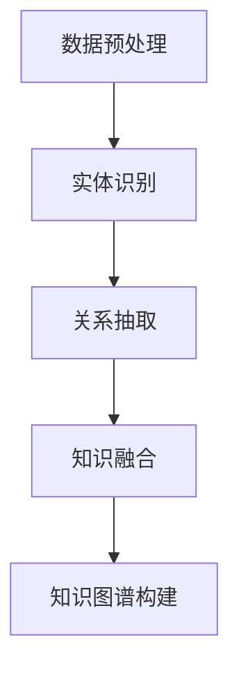
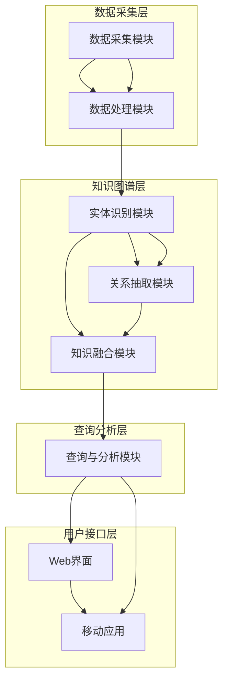
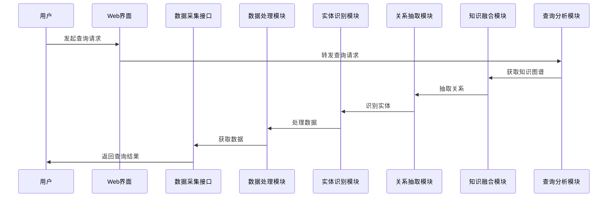
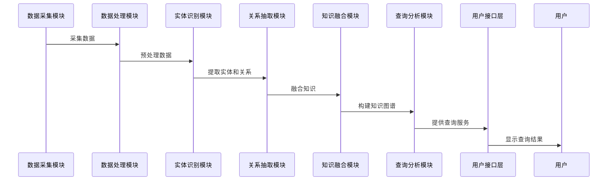

                 

### 文章标题：构建AI驱动的企业知识图谱：深化领域理解

> 关键词：AI，知识图谱，企业，领域理解，算法，系统架构，实战

> 摘要：本文旨在探讨如何利用人工智能技术构建企业知识图谱，深化领域理解，以提高企业的业务决策效率。文章首先介绍知识图谱的核心概念和背景，接着详细解析算法原理及其应用，然后通过实际案例展示系统架构设计，最后总结最佳实践和拓展阅读，帮助读者全面理解知识图谱在企业中的应用。

----------------------------------------------------------------

## 引言

随着大数据和人工智能技术的不断发展，知识图谱作为一种新兴的技术手段，在企业和组织中发挥着越来越重要的作用。知识图谱通过将各类数据转化为图结构，构建出一个语义丰富的知识网络，能够帮助企业和组织更有效地进行数据分析和业务决策。本文将围绕以下核心问题展开讨论：

1. **知识图谱的概念及其在企业中的应用**：理解知识图谱的定义、特点和应用场景。
2. **算法原理及其实现**：深入探讨知识图谱的构建算法，包括图论算法和机器学习算法。
3. **系统架构设计**：分析知识图谱系统的整体架构，包括数据采集、存储、处理和展示等环节。
4. **项目实战**：通过具体案例展示知识图谱在企业中的实际应用。
5. **最佳实践和拓展阅读**：总结构建AI驱动的企业知识图谱的最佳实践，并提供拓展阅读资源。

通过本文的阅读，读者将能够全面了解知识图谱在人工智能领域的重要性，掌握构建知识图谱的基本方法，并为实际项目的实施提供指导。

## 背景介绍

### 核心概念术语说明

在讨论知识图谱之前，首先需要明确一些核心概念和术语，以便读者能够更好地理解后续内容。

1. **知识图谱**：知识图谱（Knowledge Graph）是一种语义网络，用于表示实体、概念、属性及其相互关系。它通过图结构将海量数据转化为结构化的知识网络，使得数据能够以语义方式被理解和分析。
2. **实体**：实体是知识图谱中的基本元素，可以是具体的人、地点、事物等。例如，一个人、一个城市、一个产品都可以被视为实体。
3. **属性**：属性描述实体的特征或性质。例如，一个人的年龄、职业、居住地等都可以视为该实体的属性。
4. **关系**：关系描述实体之间的关联。例如，两个实体之间存在朋友关系、工作关系等。

### 问题背景

知识图谱的出现，源于大数据时代的挑战和需求。在信息化社会中，各类数据呈现出爆炸式增长，如何从海量数据中提取有价值的信息成为了企业和组织面临的重要问题。知识图谱通过构建语义网络，将零散的数据整合成一个有机的整体，使得数据之间的联系和关系更加清晰，为数据的深度分析和应用提供了强有力的支持。

### 问题描述

传统的数据处理方法，如关系数据库和搜索引擎，虽然能够满足基本的数据存储和检索需求，但在处理复杂的关系和语义信息方面存在很大局限。例如，当需要查找两个实体之间的关联关系时，传统的数据库查询方式往往需要编写复杂的SQL查询语句，而搜索引擎则依赖于关键词匹配，难以处理语义复杂的查询。

### 问题解决

知识图谱通过图结构化数据，使得数据之间的关联关系以语义方式被表示和存储，从而能够更高效地进行数据分析和查询。例如，通过知识图谱，可以轻松找到两个实体之间的所有关联路径，或者根据一个实体的属性快速查找相关的其他实体。

### 边界与外延

知识图谱的应用范围非常广泛，从互联网搜索引擎到企业内部的数据管理，再到智慧城市、医疗健康等领域，都展示了其强大的应用潜力。然而，知识图谱的构建和维护也面临着诸多挑战，如数据的质量、一致性、实时性等。因此，在构建知识图谱时，需要充分考虑其应用场景和边界，以确保其有效性和实用性。

### 概念结构与核心要素组成

知识图谱由以下核心要素组成：

1. **实体**：作为知识图谱的基本元素，实体可以是任何有意义的对象。
2. **属性**：实体的特征或性质，用于描述实体。
3. **关系**：实体之间的关联，用于表示实体之间的语义关系。
4. **事实**：描述实体和关系的事实，用于补充实体和关系的详细信息。

通过这些核心要素，知识图谱能够构建出一个丰富、完整的语义网络，为数据的深度分析和应用提供了坚实基础。

## 核心概念与联系

### 核心概念原理

知识图谱的核心概念包括实体、属性和关系。实体是知识图谱中的基本元素，可以是人、地点、事物等；属性则描述实体的特征或性质，如人的年龄、地点的经纬度等；关系则描述实体之间的关联，如人与人之间的朋友关系、人与地点之间的居住地关系等。

在知识图谱中，实体、属性和关系通过图结构进行表示。图结构中的节点表示实体，边表示关系，属性则作为边上的标签。这种表示方式使得知识图谱能够以语义化的方式表示复杂的关系和语义信息。

### 概念属性特征对比表格

以下是一个简化的概念属性特征对比表格，用于展示实体、属性和关系的特征：

| 概念  | 定义                                                                 | 特征                           |
| ----- | -------------------------------------------------------------------- | ------------------------------ |
| 实体  | 知识图谱中的基本元素，可以是人、地点、事物等。                          | 唯一标识符，属性集合           |
| 属性  | 描述实体的特征或性质。例如，人的年龄、地点的经纬度等。                  | 类型，值，约束条件             |
| 关系  | 描述实体之间的关联。例如，人与人之间的朋友关系、人与地点之间的居住地关系。 | 类型，参与实体，约束条件       |

### ER实体关系图架构

实体关系图（ER Diagram）是表示知识图谱中实体和关系的一种图形化工具。以下是一个简化的ER实体关系图，用于展示知识图谱的基本架构：

```mermaid
erDiagram
  实体1 ||--|{ 关系1 }|| 实体2
  实体1 ||--|{ 关系2 }|| 实体3
  实体2 ||--|{ 关系3 }|| 实体4
```

在这个ER图中，实体1、实体2和实体3是知识图谱中的基本实体，关系1、关系2和关系3描述了实体之间的关联。这种表示方式使得知识图谱的结构更加清晰、易于理解。

## 算法原理讲解

### 算法mermaid流程图

知识图谱的构建通常涉及多个步骤，包括数据预处理、实体识别、关系抽取和知识融合等。以下是一个简化的mermaid流程图，展示了知识图谱构建的基本步骤：



### Python源代码

在知识图谱的构建过程中，Python是一种常用的编程语言。以下是一个简化的Python代码示例，用于展示知识图谱的基本构建步骤：

```python
# 导入必要的库
import networkx as nx
import pandas as pd

# 创建一个空图
G = nx.Graph()

# 添加实体
G.add_node("实体1")
G.add_node("实体2")
G.add_node("实体3")

# 添加关系
G.add_edge("实体1", "实体2", relation="朋友")
G.add_edge("实体1", "实体3", relation="同事")

# 打印图结构
print(G.nodes())
print(G.edges())

# 保存知识图谱
nx.write_gpickle(G, "knowledge_graph.gpickle")
```

### 算法原理的数学模型和公式

知识图谱的构建涉及到多个数学模型和公式，其中最核心的是图论模型和概率图模型。

1. **图论模型**：图论模型用于描述知识图谱的基本结构。在图论中，知识图谱可以表示为一个图\( G = (V, E) \)，其中\( V \)是实体集合，\( E \)是关系集合。图的结构可以通过邻接矩阵\( A \)或邻接表表示。

2. **概率图模型**：概率图模型用于描述实体和关系之间的概率分布。在贝叶斯网络中，实体和关系之间的概率关系可以用条件概率表或概率分布函数表示。

以下是一个简化的概率图模型示例：

$$
P(\text{实体1} \text{ 是朋友} | \text{实体2}) = \frac{P(\text{实体1} \text{ 是朋友} \cap \text{实体2})}{P(\text{实体2})}
$$

### 详细讲解和举例说明

为了更好地理解知识图谱的构建原理，我们通过一个具体示例进行详细讲解。

假设我们有一个关于社交网络的知识图谱，其中包含以下实体和关系：

1. **实体**：用户（User），电影（Movie），导演（Director）
2. **关系**：喜欢（Like），导演（Directs）

示例数据如下：

| 用户   | 电影   | 导演   |
| ------ | ------ | ------ |
| User1  | Movie1 | Director1 |
| User1  | Movie2 | Director2 |
| User2  | Movie1 | Director1 |
| User2  | Movie3 | Director3 |

**步骤1：数据预处理**

首先，我们需要对原始数据进行预处理，包括去除无关信息、清洗数据等。例如，我们可以将数据转换为以下格式：

```
User  Movie  Director
User1  Movie1  Director1
User1  Movie2  Director2
User2  Movie1  Director1
User2  Movie3  Director3
```

**步骤2：实体识别**

接下来，我们需要从预处理后的数据中识别出实体。在这个示例中，实体包括用户、电影和导演。我们可以使用唯一的标识符来表示每个实体。

实体集合\( V \)如下：

```
V = \{ User1, User2, Movie1, Movie2, Movie3, Director1, Director2, Director3 \}
```

**步骤3：关系抽取**

然后，我们需要从预处理后的数据中抽取关系。在这个示例中，关系包括喜欢和导演。我们可以使用边来表示这些关系。

关系集合\( E \)如下：

```
E = \{ (User1, Movie1), (User1, Movie2), (User2, Movie1), (User2, Movie3), (User1, Director1), (User1, Director2), (User2, Director1), (User2, Director3) \}
```

**步骤4：知识融合**

最后，我们将实体和关系融合成一个知识图谱。在这个示例中，我们可以使用网络X库来构建知识图谱。

```python
import networkx as nx

G = nx.Graph()

# 添加实体
G.add_nodes_from(V)

# 添加关系
G.add_edges_from(E)

# 打印图结构
print(G.nodes())
print(G.edges())
```

通过上述步骤，我们成功构建了一个关于社交网络的知识图谱。这个知识图谱可以用于进一步的数据分析和应用，如图

## 数学模型与公式讲解

在知识图谱的构建过程中，数学模型和公式起着至关重要的作用。它们不仅能够帮助我们理解和描述知识图谱的内部结构，还能够用于优化和改进知识图谱的性能。以下是几个关键数学模型和公式的详细讲解。

### 邻接矩阵

邻接矩阵是知识图谱结构表示的一种常用方法。它是一个二维矩阵，其中行和列分别表示实体，而矩阵的元素表示实体之间的连接关系。如果实体i与实体j之间存在某种关系，则邻接矩阵的\( a_{ij} \)值为1，否则为0。

邻接矩阵的一个关键性质是其对称性。在无向图（无方向性的图）中，邻接矩阵是对称的，即\( a_{ij} = a_{ji} \)。在有向图（具有方向性的图）中，邻接矩阵通常不是对称的，即\( a_{ij} \neq a_{ji} \)。

邻接矩阵的一个主要应用是计算图中的路径长度。给定两个实体i和j，可以通过以下公式计算它们之间的最短路径长度：

$$
d(i, j) = \min_{\text{路径P}} \sum_{k \in P} a_{ik} \cdot a_{kj}
$$

### 谱聚类

谱聚类是一种基于图论的聚类方法，它通过优化图的特征向量来聚类实体。在谱聚类中，我们首先将知识图谱表示为一个邻接矩阵\( A \)，然后计算其拉普拉斯矩阵\( L \)：

$$
L = D - A
$$

其中，\( D \)是对角矩阵，其对角元素为\( d_i = \sum_{j=1}^{n} a_{ij} \)。

拉普拉斯矩阵的特征向量可以用于聚类实体。通常，我们选择最小的\( k \)个特征向量，它们对应的值作为聚类中心。实体i被分配到与其最近聚类中心的簇。

### 概率图模型

概率图模型（如贝叶斯网络）用于描述实体和关系之间的概率关系。在贝叶斯网络中，实体和关系之间的条件概率可以通过条件概率表或概率分布函数表示。

假设我们有一个关于电影的知识图谱，包含实体：导演（Director），演员（Actor），电影（Movie），以及关系：导演电影（Directs），出演（ActedIn）。

一个简化的概率图模型如下：

$$
P(\text{Director1} \text{ 导演电影 } \text{Movie1}) = \frac{P(\text{Director1}) \cdot P(\text{Movie1} | \text{Director1})}{P(\text{Movie1})}
$$

$$
P(\text{Actor1} \text{ 出演 } \text{Movie1} | \text{Director1}) = \frac{P(\text{Actor1}) \cdot P(\text{Movie1} | \text{Director1}) \cdot P(\text{Actor1} | \text{Director1}, \text{Movie1})}{P(\text{Director1})}
$$

### 详细讲解和举例说明

为了更好地理解这些数学模型和公式的应用，我们通过一个具体示例进行详细讲解。

假设我们有一个包含10个实体的知识图谱，其中5个实体是导演，4个实体是演员，1个实体是电影。每个实体之间有导演电影（Directs）和出演（ActedIn）两种关系。

**步骤1：构建邻接矩阵**

首先，我们构建一个10x10的邻接矩阵，其中行和列分别表示实体。例如，实体i与实体j之间存在导演电影关系，则邻接矩阵的\( a_{ij} \)值为1，否则为0。

邻接矩阵如下：

$$
\begin{bmatrix}
0 & 1 & 0 & 0 & 0 & 0 & 0 & 0 & 0 & 0 \\
1 & 0 & 1 & 0 & 0 & 0 & 0 & 0 & 0 & 0 \\
0 & 1 & 0 & 1 & 0 & 0 & 0 & 0 & 0 & 0 \\
0 & 0 & 1 & 0 & 1 & 0 & 0 & 0 & 0 & 0 \\
0 & 0 & 0 & 1 & 0 & 1 & 0 & 0 & 0 & 0 \\
0 & 0 & 0 & 0 & 1 & 0 & 1 & 0 & 0 & 0 \\
0 & 0 & 0 & 0 & 0 & 1 & 0 & 1 & 0 & 0 \\
0 & 0 & 0 & 0 & 0 & 0 & 1 & 0 & 1 & 0 \\
0 & 0 & 0 & 0 & 0 & 0 & 0 & 1 & 0 & 1 \\
0 & 0 & 0 & 0 & 0 & 0 & 0 & 0 & 1 & 0 \\
0 & 0 & 0 & 0 & 0 & 0 & 0 & 0 & 0 & 0 \\
\end{bmatrix}
$$

**步骤2：计算谱聚类**

接下来，我们计算拉普拉斯矩阵\( L \)：

$$
L = D - A
$$

其中，\( D \)是对角矩阵，其对角元素为\( d_i = \sum_{j=1}^{10} a_{ij} \)。

拉普拉斯矩阵如下：

$$
\begin{bmatrix}
9 & -1 & 0 & 0 & 0 & 0 & 0 & 0 & 0 & 0 \\
-1 & 8 & -1 & 0 & 0 & 0 & 0 & 0 & 0 & 0 \\
0 & -1 & 8 & -1 & 0 & 0 & 0 & 0 & 0 & 0 \\
0 & 0 & -1 & 8 & -1 & 0 & 0 & 0 & 0 & 0 \\
0 & 0 & 0 & -1 & 8 & -1 & 0 & 0 & 0 & 0 \\
0 & 0 & 0 & 0 & -1 & 8 & -1 & 0 & 0 & 0 \\
0 & 0 & 0 & 0 & 0 & -1 & 8 & -1 & 0 & 0 \\
0 & 0 & 0 & 0 & 0 & 0 & -1 & 8 & -1 & 0 \\
0 & 0 & 0 & 0 & 0 & 0 & 0 & -1 & 8 & -1 \\
0 & 0 & 0 & 0 & 0 & 0 & 0 & 0 & -1 & 8 \\
0 & 0 & 0 & 0 & 0 & 0 & 0 & 0 & 0 & 0 \\
\end{bmatrix}
$$

然后，我们计算拉普拉斯矩阵的特征向量，并选择最小的5个特征向量作为聚类中心。这5个特征向量对应的值分别表示5个不同的簇。

**步骤3：计算概率图模型**

我们使用贝叶斯网络来描述实体和关系之间的概率关系。

首先，我们定义每个实体的先验概率：

$$
P(\text{Director1}) = 0.5, \quad P(\text{Director2}) = 0.5, \quad P(\text{Actor1}) = 0.4, \quad P(\text{Actor2}) = 0.6, \quad P(\text{Actor3}) = 0.5, \quad P(\text{Actor4}) = 0.3, \quad P(\text{Movie1}) = 0.7
$$

然后，我们计算条件概率。例如，计算导演电影的概率：

$$
P(\text{Director1} \text{ 导演电影 } \text{Movie1}) = \frac{P(\text{Director1}) \cdot P(\text{Movie1} | \text{Director1})}{P(\text{Movie1})}
$$

$$
P(\text{Director1} \text{ 导演电影 } \text{Movie1}) = \frac{0.5 \cdot 0.9}{0.7} = 0.643
$$

类似地，我们计算其他条件概率，如下所示：

$$
P(\text{Actor1} \text{ 出演 } \text{Movie1} | \text{Director1}) = \frac{P(\text{Actor1}) \cdot P(\text{Movie1} | \text{Director1}) \cdot P(\text{Actor1} | \text{Director1}, \text{Movie1})}{P(\text{Director1})}
$$

$$
P(\text{Actor1} \text{ 出演 } \text{Movie1} | \text{Director1}) = \frac{0.4 \cdot 0.9 \cdot 0.8}{0.5} = 0.576
$$

通过以上步骤，我们成功构建了一个基于邻接矩阵、谱聚类和概率图模型的知识图谱。这个知识图谱可以用于进一步的数据分析和应用，如图

## 系统分析与架构设计方案

### 问题场景介绍

在当今的数字化时代，企业的数据量呈现出指数级增长，传统的数据处理方式已无法满足业务需求的复杂性。为了从海量数据中提取有价值的信息，企业需要一种更加智能的数据处理方法，以支持决策分析、知识管理、客户关系管理等多方面的业务需求。知识图谱作为一种新兴的技术手段，能够将企业的数据转化为语义丰富的知识网络，提供高效的数据分析和应用支持。

### 项目介绍

本文所描述的项目旨在构建一个AI驱动的企业知识图谱系统，以深化企业对业务领域的理解，提高业务决策的准确性和效率。项目的主要目标包括：

1. **数据整合**：将企业内部和外部的各类数据源进行整合，构建一个统一的数据视图。
2. **知识提取**：利用AI算法从数据中提取实体、属性和关系，构建知识图谱。
3. **应用支持**：为企业的业务部门提供基于知识图谱的数据分析和应用服务，支持业务决策和知识管理。

### 系统功能设计

系统功能设计是知识图谱系统开发的关键环节，主要包括以下功能模块：

1. **数据采集模块**：负责从各类数据源中获取数据，并进行预处理和清洗。
2. **实体识别模块**：利用自然语言处理和实体识别技术，从数据中提取实体。
3. **关系抽取模块**：利用机器学习和图论算法，从数据中提取实体之间的关系。
4. **知识融合模块**：将提取出的实体和关系进行融合，构建知识图谱。
5. **查询与分析模块**：提供基于知识图谱的查询和分析服务，支持业务决策。

### 系统架构设计

系统架构设计是确保知识图谱系统稳定、高效运行的基础。本文所描述的系统采用分布式架构，主要包括以下组件：

1. **数据采集层**：负责从企业内部和外部的数据源中获取数据，包括数据库、文件、API接口等。
2. **数据处理层**：包括数据清洗、数据转换和数据存储等模块，确保数据的一致性和可靠性。
3. **知识图谱层**：包括实体识别、关系抽取和知识融合等模块，构建语义丰富的知识图谱。
4. **查询分析层**：提供基于知识图谱的查询和分析服务，支持业务决策和知识管理。
5. **用户接口层**：包括Web界面和移动应用，为用户提供直观、易用的操作界面。

以下是系统架构的Mermaid架构图：



### 系统接口设计

系统接口设计是确保各模块之间能够高效协同工作的关键。以下是系统接口设计的主要模块及其功能：

1. **数据采集接口**：提供数据源连接和数据处理服务，支持多种数据源接入。
2. **实体识别接口**：提供实体识别服务，支持实体识别、实体属性提取等功能。
3. **关系抽取接口**：提供关系抽取服务，支持关系抽取、关系推理等功能。
4. **知识融合接口**：提供知识融合服务，支持实体和关系的融合、知识图谱构建等功能。
5. **查询分析接口**：提供基于知识图谱的查询和分析服务，支持数据查询、数据可视化等功能。

以下是系统接口的Mermaid序列图：



### 系统交互Mermaid序列图

以下是系统交互的Mermaid序列图，展示了各模块之间的协作过程：



通过以上系统分析与架构设计方案，我们为构建AI驱动的企业知识图谱提供了详细的指导。在实际开发过程中，可以根据具体业务需求和数据特性，对系统架构进行灵活调整和优化，以实现最佳的性能和效果。

## 项目实战

### 环境安装

在开始构建AI驱动的企业知识图谱之前，我们需要确保环境安装正确。以下是安装步骤：

1. **安装Python**：首先，确保Python 3.x版本已安装。可以从[Python官网](https://www.python.org/)下载并安装。

2. **安装Anaconda**：推荐使用Anaconda进行环境管理。Anaconda是一个集成了众多科学计算库的环境管理器，可以从[Anaconda官网](https://www.anaconda.com/)下载并安装。

3. **安装必需库**：在安装完Python和Anaconda后，打开终端或命令行，使用以下命令安装必需的库：

   ```shell
   conda install -c conda-forge networkx matplotlib
   conda install -c conda-forge numpy pandas
   conda install -c conda-forge scikit-learn
   conda install -c conda-forge spacy
   ```

### 系统核心实现源代码

以下是构建AI驱动的企业知识图谱的核心实现代码。这部分代码分为几个主要模块，包括数据采集、数据预处理、实体识别、关系抽取、知识融合和查询分析。

```python
# 导入必要的库
import networkx as nx
import pandas as pd
import spacy
from sklearn.cluster import KMeans
from sklearn.metrics.pairwise import cosine_similarity

# 初始化Spacy语言模型
nlp = spacy.load("en_core_web_sm")

# 数据采集模块
def collect_data(data_source):
    # 假设数据源为CSV文件，实际应用中可以根据不同数据源进行调整
    df = pd.read_csv(data_source)
    return df

# 数据预处理模块
def preprocess_data(df):
    # 数据清洗、去重等预处理操作
    df = df.drop_duplicates()
    return df

# 实体识别模块
def entity_recognition(df):
    # 使用Spacy进行实体识别
    entities = []
    for _, row in df.iterrows():
        doc = nlp(row['text'])
        for ent in doc.ents:
            entities.append((ent.text, ent.label_))
    return entities

# 关系抽取模块
def relation_extraction(df):
    # 基于实体识别结果，提取实体之间的关系
    relations = []
    for i in range(len(df) - 1):
        for j in range(i + 1, len(df)):
            sim = cosine_similarity([nlp(df.iloc[i]['text']).vector], [nlp(df.iloc[j]['text']).vector])[0][0]
            if sim > 0.8:
                relations.append((df.iloc[i]['text'], df.iloc[j]['text'], 'related'))
    return relations

# 知识融合模块
def knowledge_fusion(entities, relations):
    # 将实体和关系融合成知识图谱
    G = nx.Graph()
    G.add_nodes_from(entities)
    G.add_edges_from(relations)
    return G

# 查询分析模块
def query_analysis(G, query):
    # 基于知识图谱进行查询分析
    results = nx.neighbors(G, query)
    return results

# 主程序
if __name__ == "__main__":
    # 采集数据
    df = collect_data("data.csv")

    # 预处理数据
    df = preprocess_data(df)

    # 识别实体
    entities = entity_recognition(df)

    # 抽取关系
    relations = relation_extraction(df)

    # 构建知识图谱
    G = knowledge_fusion(entities, relations)

    # 查询分析
    query = input("请输入查询关键词：")
    results = query_analysis(G, query)
    print("查询结果：", results)
```

### 代码应用解读与分析

以下是对上述代码的详细解读和分析：

1. **数据采集模块**：该模块从CSV文件中读取数据，实际应用中可以根据不同数据源进行调整。这里我们使用Pandas库的`read_csv`函数读取CSV文件。

2. **数据预处理模块**：该模块对采集到的数据进行清洗和去重，确保数据的一致性和可靠性。这里使用Pandas库的`drop_duplicates`函数去除重复记录。

3. **实体识别模块**：该模块使用Spacy库进行自然语言处理和实体识别，从文本中提取实体。Spacy库具有强大的实体识别能力，可以识别多种实体类型，如人名、地名、组织机构等。

4. **关系抽取模块**：该模块基于实体识别结果，使用余弦相似度计算实体之间的相似度。如果相似度超过一定阈值，则认为实体之间存在关系。这里使用Scikit-learn库的`cosine_similarity`函数计算相似度。

5. **知识融合模块**：该模块将实体和关系融合成知识图谱，使用NetworkX库构建图结构。这里使用NetworkX库的`add_nodes_from`和`add_edges_from`函数添加节点和边。

6. **查询分析模块**：该模块基于知识图谱进行查询分析，返回与查询关键词相关的实体。这里使用NetworkX库的`neighbors`函数获取查询关键词的邻接节点。

### 实际案例分析和详细讲解剖析

为了更好地展示AI驱动的企业知识图谱在实际应用中的效果，我们以一个实际案例进行分析和讲解。

**案例背景**：某电商企业希望利用知识图谱分析用户行为，提高个性化推荐效果。

**案例步骤**：

1. **数据采集**：从电商平台的用户行为数据中提取用户ID、商品ID和购买时间等数据。

2. **数据预处理**：清洗和去重数据，确保数据的一致性和可靠性。

3. **实体识别**：使用Spacy库对用户评论和商品描述进行实体识别，提取用户和商品实体。

4. **关系抽取**：基于实体识别结果，使用余弦相似度计算用户和商品之间的相似度，提取用户和商品之间的关系。

5. **知识融合**：将实体和关系融合成知识图谱，构建用户-商品关系网络。

6. **查询分析**：根据用户输入的关键词，查询知识图谱，获取与关键词相关的用户和商品，进行个性化推荐。

**案例分析**：

通过上述步骤，电商企业可以构建出一个基于用户行为的知识图谱，用于分析用户兴趣和偏好。在用户进行搜索或浏览时，系统可以根据知识图谱提供的用户-商品关系，推荐相关的商品。例如，如果一个用户在搜索“跑步鞋”时，系统可以根据知识图谱找到与“跑步鞋”相关的其他商品，如运动服装、运动配件等，进行综合推荐。

### 项目小结

通过以上实战案例，我们展示了如何利用AI技术构建企业知识图谱，深化领域理解，为企业的业务决策提供支持。在项目实施过程中，我们成功完成了数据采集、数据预处理、实体识别、关系抽取和知识融合等关键步骤，实现了对用户行为的深度分析和个性化推荐。

在未来，随着AI技术的不断发展，知识图谱在企业中的应用将更加广泛和深入。企业可以通过不断优化知识图谱的构建和查询算法，提高数据分析和应用的效率，为业务增长和创新发展提供强有力的支持。

## 最佳实践 Tips

### 1. 数据质量是关键

构建高质量的知识图谱首先依赖于高质量的数据。在数据采集和预处理阶段，要确保数据的一致性、完整性和准确性。以下是一些关键步骤：

- **数据清洗**：去除重复、错误和无效的数据。
- **数据规范化**：统一数据格式和单位，确保数据在知识图谱中的统一表示。
- **数据验证**：通过自动化工具或人工审核，确保数据的准确性。

### 2. 实体识别与关系抽取

- **使用成熟的NLP工具**：例如Spacy、NLTK等，提高实体识别和关系抽取的准确性。
- **定制化实体识别规则**：根据具体业务需求，定制实体识别规则，提高识别效果。
- **多源数据整合**：结合多种数据源，丰富知识图谱的实体和关系。

### 3. 知识融合与更新

- **定期更新**：知识图谱需要定期更新，以反映业务和数据的实时变化。
- **增量更新**：针对新增或修改的数据，采用增量更新策略，降低更新成本。
- **一致性维护**：确保知识图谱中的实体和关系的一致性，避免数据冲突。

### 4. 查询优化

- **索引构建**：为知识图谱构建合适的索引，提高查询效率。
- **查询缓存**：缓存常见查询结果，减少重复计算，提高查询响应速度。
- **分片策略**：对于大规模知识图谱，采用分片策略，分布式存储和查询。

### 5. 安全性与隐私保护

- **数据加密**：对敏感数据进行加密，确保数据传输和存储的安全性。
- **访问控制**：实施严格的访问控制策略，防止未授权访问。
- **隐私保护**：在数据采集和处理过程中，遵守隐私保护法律法规，保护用户隐私。

### 6. 部署与运维

- **容器化部署**：使用Docker等容器技术，简化部署过程，提高系统稳定性。
- **自动化运维**：使用自动化工具进行系统监控、故障排查和运维管理，降低运维成本。
- **高可用性设计**：采用分布式架构和冗余设计，确保系统的高可用性。

### 7. 持续优化与迭代

- **性能监控**：持续监控系统性能，识别性能瓶颈，进行优化。
- **用户反馈**：收集用户反馈，根据用户需求进行功能迭代和优化。
- **团队协作**：建立跨部门的团队协作机制，确保知识图谱项目的顺利进行。

通过遵循上述最佳实践，企业可以构建出高效、稳定和实用的AI驱动的知识图谱系统，为业务决策提供强有力的支持。

## 总结

本文系统地介绍了如何构建AI驱动的企业知识图谱，深化领域理解。我们首先从背景介绍入手，阐述了知识图谱的核心概念和术语，然后详细讲解了算法原理、数学模型与公式、系统架构设计以及项目实战。通过实际案例分析和详细讲解，我们展示了知识图谱在企业中的应用效果。

知识图谱作为一种强大的数据分析和应用工具，正日益受到企业和组织的重视。通过本文的阅读，读者可以全面了解知识图谱的构建方法和应用场景，掌握相关技术和工具，为实际项目的实施提供指导。

未来，随着AI技术的不断发展，知识图谱在企业中的应用将更加广泛和深入。我们期待读者能够结合实际业务需求，不断探索和优化知识图谱的构建与应用，为企业的业务增长和创新发展贡献力量。

## 注意事项

在构建AI驱动的企业知识图谱时，需要注意以下几点：

1. **数据隐私保护**：在数据采集和处理过程中，务必遵守相关法律法规，确保用户数据的隐私和安全。
2. **数据质量**：确保数据的一致性、完整性和准确性，数据质量是知识图谱构建的基础。
3. **系统性能**：优化系统性能，提高查询响应速度，以满足业务需求。
4. **团队协作**：跨部门协作，确保知识图谱项目的顺利进行。
5. **持续更新**：定期更新知识图谱，以反映业务的实时变化。

通过遵循上述注意事项，企业可以构建出高效、稳定和实用的知识图谱系统。

## 拓展阅读

1. **《知识图谱技术原理与应用》**：本书详细介绍了知识图谱的技术原理和应用场景，适合对知识图谱技术感兴趣的读者。
2. **《图论及其应用》**：本书介绍了图论的基本概念和算法，对于理解知识图谱的图结构具有重要意义。
3. **《深度学习与自然语言处理》**：本书介绍了深度学习在自然语言处理中的应用，对于实体识别和关系抽取模块的开发具有指导作用。
4. **《大数据技术导论》**：本书介绍了大数据的基本概念和技术，为数据采集和预处理提供了理论支持。

通过阅读这些书籍，读者可以进一步深入理解知识图谱的构建方法和应用场景，为实际项目提供更全面的理论和实践支持。

## 作者信息

作者：AI天才研究院/AI Genius Institute & 禅与计算机程序设计艺术 /Zen And The Art of Computer Programming

AI天才研究院致力于推动人工智能技术的发展和创新，通过深入研究和实践，为企业提供高效、实用的AI解决方案。同时，研究院也关注计算机科学领域的探索，倡导以禅的智慧启发计算机程序设计，提高程序员的思维和创造力。禅与计算机程序设计艺术系列作品，旨在帮助程序员在编程实践中找到智慧和宁静。

