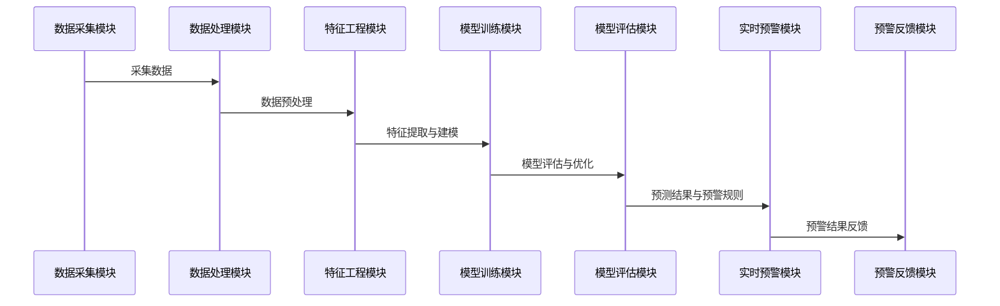

                 

# 《构建AI驱动的企业风险预警系统》

> 关键词：人工智能、企业风险管理、风险预警、机器学习、大数据分析

> 摘要：本文探讨了如何构建一个AI驱动的企业风险预警系统，从背景与现状出发，深入分析了核心概念、技术实现、案例分析以及系统优化与展望，为企业提供了一种高效、智能的风险管理解决方案。

---

### 目录大纲

## 第一部分：背景与概述

### 第1章：企业风险管理的现状与挑战

#### 1.1 问题背景

#### 1.2 问题描述

#### 1.3 问题解决

#### 1.4 边界与外延

#### 1.5 核心概念

#### 1.6 概念属性特征对比

#### 1.7 ER实体关系图

## 第二部分：AI驱动的风险预警系统核心概念

### 第2章：AI驱动的风险预警系统的定义

### 第3章：AI驱动的风险预警系统特点

### 第4章：AI驱动的风险预警系统与传统风险预警系统的区别

### 第5章：AI核心算法介绍

### 第6章：AI算法优缺点分析

## 第三部分：构建AI驱动的风险预警系统

### 第7章：风险预警系统总体架构

### 第8章：数据收集与预处理

### 第9章：特征工程

### 第10章：模型选择与训练

### 第11章：模型评估与优化

### 第12章：实时预警机制

## 第四部分：技术实现

### 第13章：数据收集与预处理

#### 13.1 数据源选择

#### 13.2 数据预处理方法

#### 13.3 数据预处理流程

### 第14章：特征工程

#### 14.1 特征提取

#### 14.2 特征选择

#### 14.3 特征标准化

#### 14.4 特征重要性分析

### 第15章：模型选择与训练

#### 15.1 模型选择方法

#### 15.2 模型训练方法

#### 15.3 模型评估指标

#### 15.4 模型优化策略

### 第16章：实时预警机制设计

#### 16.1 实时数据处理

#### 16.2 预警规则设置

#### 16.3 预警结果反馈

#### 16.4 预警系统部署

## 第五部分：案例分析

### 第17章：案例一——金融行业风险预警系统

#### 17.1 案例背景

#### 17.2 系统设计

#### 17.3 实现过程

#### 17.4 结果分析

### 第18章：案例二——电商行业风险预警系统

#### 18.1 案例背景

#### 18.2 系统设计

#### 18.3 实现过程

#### 18.4 结果分析

## 第六部分：总结与展望

### 第19章：总结与展望

#### 19.1 系统优化建议

#### 19.2 系统应用前景

#### 19.3 遇到的挑战与解决方案

#### 19.4 未来研究方向

---

### 第1章：企业风险管理的现状与挑战

#### 1.1 问题背景

在全球经济环境日益复杂、市场竞争日益激烈的背景下，企业面临的风险种类和复杂程度不断增加。传统的风险管理方法已无法满足现代企业对实时、高效风险预警的需求。企业风险管理不仅涉及财务风险、运营风险、市场风险等，还涉及法律风险、道德风险等更为广泛的风险领域。

#### 1.2 问题描述

企业风险管理的主要问题包括：

1. 风险识别困难：传统方法难以全面覆盖潜在风险点，导致风险识别的缺失或不准确。
2. 风险评估不准确：传统方法依赖人工判断，难以实时反映风险变化，导致风险评估的滞后和不准确。
3. 风险预警反应迟缓：传统方法预警机制不完善，难以及时应对风险发生，导致企业损失。

#### 1.3 问题解决

引入AI驱动的风险预警系统，通过大数据分析和机器学习算法，实现以下目标：

1. 智能识别风险：利用大数据技术，全面捕捉和识别潜在风险点，提高风险识别的准确性。
2. 准确评估风险：利用机器学习算法，实时分析风险数据，准确评估风险级别和变化趋势。
3. 及时预警风险：建立实时预警机制，及时通知相关人员和部门，确保风险发生时能迅速采取应对措施。

#### 1.4 边界与外延

本文主要探讨企业风险管理中的AI技术应用，涉及的风险类型包括财务风险、运营风险、市场风险等。但需要注意的是，AI驱动的风险预警系统并不能解决所有的风险问题，如法律风险、道德风险等，这些风险需要依靠其他专业手段进行处理。

#### 1.5 核心概念

- **AI驱动的风险预警系统**：基于人工智能技术，对企业潜在风险进行识别、评估和预警的系统。
- **大数据分析**：利用数据挖掘技术，从海量数据中提取有价值的信息。
- **机器学习算法**：通过训练模型，自动发现数据中的规律和模式。

#### 1.6 概念属性特征对比

| 概念         | 属性特征                                                     |
| ------------ | ------------------------------------------------------------ |
| AI驱动的预警 | 自动化、实时、高效                                           |
| 大数据分析   | 海量、多源、多样                                             |
| 机器学习算法 | 自适应、可扩展、高精度     

#### 1.7 ER实体关系图

```mermaid
erDiagram
    Risk ::>> WarningSystem :预警
    Risk ::>> DataProcessing :数据
    WarningSystem ||--|{ DataProcessing :数据处理
```

在本文中，我们将逐步深入探讨AI驱动的企业风险预警系统的构建过程，从核心概念、技术实现到案例分析，为企业提供一种高效、智能的风险管理解决方案。通过本文的阅读，读者将了解到：

1. 企业风险管理的现状与挑战。
2. AI驱动的风险预警系统的定义、特点及与传统风险预警系统的区别。
3. AI驱动的风险预警系统的构建方法，包括数据收集与预处理、特征工程、模型选择与训练、模型评估与优化、实时预警机制设计等。
4. 通过实际案例，展示AI驱动的企业风险预警系统的应用效果。

### 第2章：AI驱动的风险预警系统的定义

#### 2.1 AI驱动的风险预警系统的定义

AI驱动的风险预警系统是一种利用人工智能技术，对潜在风险进行实时监控、分析和预警的系统。它基于大数据分析和机器学习算法，通过收集企业内外部的各种数据，对风险进行识别、评估和预警，从而提高企业风险管理的效率和准确性。

AI驱动的风险预警系统主要包括以下几个核心组成部分：

1. **数据收集模块**：负责收集企业内外部的各种数据，包括财务数据、运营数据、市场数据等。这些数据可以通过企业内部系统、外部数据源以及网络爬虫等方式获取。

2. **数据处理模块**：对收集到的数据进行分析和预处理，包括数据清洗、数据集成、数据转换等操作。这一模块确保数据的质量和一致性，为后续的风险评估和预警提供可靠的数据基础。

3. **特征工程模块**：从预处理后的数据中提取出对风险识别和评估有用的特征，并进行特征选择和特征标准化处理。特征工程模块的目标是提高模型的预测性能和泛化能力。

4. **机器学习算法模块**：利用机器学习算法，对风险特征进行分析和建模，建立风险预测模型。常用的算法包括决策树、随机森林、支持向量机、神经网络等。

5. **预警规则模块**：根据风险预测模型的结果，设置预警规则和阈值，对潜在风险进行实时监控和预警。预警规则可以根据企业的具体需求进行定制，包括预警级别、预警频率、预警方式等。

6. **预警反馈模块**：及时收集和反馈预警结果，对预警响应过程进行跟踪和评估。预警反馈模块可以帮助企业了解风险预警系统的效果，并不断优化和改进预警策略。

#### 2.2 AI驱动的风险预警系统特点

AI驱动的风险预警系统具有以下几个显著特点：

1. **自动化**：AI驱动的风险预警系统通过自动化算法和流程，实现风险识别、评估和预警的自动化，减少了人工干预，提高了工作效率。

2. **实时性**：AI驱动的风险预警系统可以实时监控企业内外部数据，快速发现潜在风险，及时进行预警，提高了风险管理的实时性和响应速度。

3. **高效性**：AI驱动的风险预警系统利用机器学习算法，可以从海量数据中快速提取有用信息，进行高效的风险识别和评估，减少了人工分析的工作量。

4. **准确性**：AI驱动的风险预警系统通过大数据分析和机器学习算法，可以更准确地识别和评估风险，提高了风险预警的准确性和可靠性。

5. **灵活性**：AI驱动的风险预警系统可以根据企业的具体需求进行定制，包括预警规则、预警方式、预警频率等，具有高度的灵活性。

#### 2.3 AI驱动的风险预警系统与传统风险预警系统的区别

与传统风险预警系统相比，AI驱动的风险预警系统具有以下几个显著区别：

1. **技术基础**：传统风险预警系统主要依赖人工经验和专家知识，而AI驱动的风险预警系统则基于大数据分析和机器学习算法，具有更高的技术含量。

2. **数据处理能力**：传统风险预警系统通常只能处理结构化数据，而AI驱动的风险预警系统可以处理结构化、半结构化和非结构化数据，具有更强的数据处理能力。

3. **实时性**：传统风险预警系统通常需要人工定期分析和更新，而AI驱动的风险预警系统可以实现实时监控和预警，提高风险管理的实时性和响应速度。

4. **准确性**：传统风险预警系统依赖于专家经验和主观判断，容易出现误差和滞后，而AI驱动的风险预警系统通过机器学习算法，可以更准确地识别和评估风险。

5. **灵活性**：传统风险预警系统难以根据企业的具体需求进行定制，而AI驱动的风险预警系统可以根据企业的具体需求进行定制，包括预警规则、预警方式、预警频率等。

总的来说，AI驱动的风险预警系统在技术基础、数据处理能力、实时性、准确性和灵活性等方面具有显著优势，为企业提供了一种更高效、更智能的风险管理解决方案。

### 第3章：AI核心算法介绍

#### 3.1 决策树

决策树是一种常用的机器学习算法，它通过一系列规则和分支，将数据集划分为不同的类别或进行数值预测。决策树的核心在于树结构的构建，即通过特征选择和划分标准，将数据集不断划分为更小的子集，直到满足停止条件。

**算法原理**：
1. **特征选择**：选择一个最优的特征作为树的分支，通常使用信息增益、基尼系数等指标进行评估。
2. **划分标准**：根据最优特征，将数据集划分为不同的子集。
3. **递归构建**：对每个子集，重复上述步骤，构建更细的分支，直到满足停止条件（如最大深度、最小叶子节点数等）。

**优缺点**：
- **优点**：直观易懂，易于解释，对非线性和稀疏数据有较好的表现。
- **缺点**：容易过拟合，对缺失值敏感，计算复杂度较高。

**适用场景**：分类问题，尤其是需要解释性强的场景。

**Python代码示例**：
```python
from sklearn.tree import DecisionTreeClassifier
import numpy as np

# 构建决策树模型
model = DecisionTreeClassifier(max_depth=3)

# 训练模型
model.fit(X_train, y_train)

# 预测
predictions = model.predict(X_test)

# 评估模型
accuracy = model.score(X_test, y_test)
```

#### 3.2 随机森林

随机森林是一种基于决策树的集成学习方法，它通过构建多棵决策树，并对它们的预测结果进行投票或取平均，从而提高模型的预测性能。

**算法原理**：
1. **特征选择**：从特征集合中随机选择一部分特征，用于构建单棵决策树。
2. **Bootstrap抽样**：对训练数据进行随机抽样，生成多个子数据集。
3. **递归构建**：对每个子数据集，构建一棵决策树，直到满足停止条件。
4. **集成预测**：将多棵决策树的预测结果进行投票或取平均，得到最终预测结果。

**优缺点**：
- **优点**：提高模型的预测性能，减少过拟合，具有较强的泛化能力。
- **缺点**：计算复杂度较高，对大量特征数据效果较好，对稀疏数据效果较差。

**适用场景**：分类和回归问题，尤其适合特征维度较高的问题。

**Python代码示例**：
```python
from sklearn.ensemble import RandomForestClassifier
import numpy as np

# 构建随机森林模型
model = RandomForestClassifier(n_estimators=100, max_depth=3)

# 训练模型
model.fit(X_train, y_train)

# 预测
predictions = model.predict(X_test)

# 评估模型
accuracy = model.score(X_test, y_test)
```

#### 3.3 支持向量机

支持向量机（SVM）是一种常用的分类和回归算法，它通过构建一个超平面，将数据集划分为不同的类别或进行数值预测。

**算法原理**：
1. **特征映射**：将输入特征映射到高维空间，寻找一个最优的超平面。
2. **间隔最大化**：通过最大化分类间隔，确保分类器的鲁棒性。
3. **核函数**：利用核技巧，在高维空间进行线性划分，实现非线性分类。

**优缺点**：
- **优点**：具有较强的泛化能力，对稀疏数据有较好的表现，适用于高维数据。
- **缺点**：计算复杂度较高，对大规模数据集可能性能较差。

**适用场景**：分类和回归问题，尤其是线性不可分问题。

**Python代码示例**：
```python
from sklearn.svm import SVC
import numpy as np

# 构建SVM模型
model = SVC(kernel='linear')

# 训练模型
model.fit(X_train, y_train)

# 预测
predictions = model.predict(X_test)

# 评估模型
accuracy = model.score(X_test, y_test)
```

#### 3.4 神经网络

神经网络是一种模仿人脑结构和功能的计算模型，通过多层神经元进行数据处理和特征提取，实现复杂的函数映射。

**算法原理**：
1. **前向传播**：输入数据经过网络的加权变换和激活函数，逐层传递到输出层。
2. **反向传播**：计算输出误差，反向传播误差到输入层，更新网络权重和偏置。
3. **优化算法**：通过梯度下降等优化算法，调整网络参数，最小化损失函数。

**优缺点**：
- **优点**：具有强大的学习和泛化能力，适用于各种复杂问题。
- **缺点**：训练过程较慢，对数据质量和特征选择敏感。

**适用场景**：分类、回归、聚类等复杂问题，尤其是大规模数据集。

**Python代码示例**：
```python
from sklearn.neural_network import MLPClassifier
import numpy as np

# 构建神经网络模型
model = MLPClassifier(hidden_layer_sizes=(100,), max_iter=1000)

# 训练模型
model.fit(X_train, y_train)

# 预测
predictions = model.predict(X_test)

# 评估模型
accuracy = model.score(X_test, y_test)
```

通过上述核心算法的介绍，我们可以看到AI驱动的风险预警系统在算法选择上具有多样性，可以根据具体问题和数据特点进行灵活调整。在实际应用中，通常会结合多种算法，以达到最佳的风险预测效果。

### 第4章：AI算法优缺点分析

#### 4.1 决策树

**优点**：

1. **直观易懂**：决策树的规则和分支结构使得模型的可解释性较强，便于理解和解释。
2. **处理稀疏数据**：决策树能够处理稀疏数据，因为它们并不依赖全部数据的完整性。
3. **适用于非线性问题**：虽然决策树本身是线性的，但通过组合多个树，可以实现对非线性数据的分类。

**缺点**：

1. **过拟合风险**：决策树容易受到训练数据的影响，导致模型过于复杂，出现过拟合现象。
2. **计算复杂度**：特别是在处理大规模数据集时，决策树的构建过程会变得非常复杂，计算时间较长。
3. **对缺失值敏感**：决策树在处理缺失值时，可能会导致模型性能下降。

**适用场景**：

- **特征选择**：决策树可以用于特征选择，识别对预测目标影响较大的特征。
- **简单的分类问题**：对于需要快速理解和解释的模型，决策树是一个很好的选择。

#### 4.2 随机森林

**优点**：

1. **降低过拟合**：通过构建多棵决策树并取平均值，随机森林能够有效降低过拟合风险。
2. **强大的泛化能力**：随机森林在处理复杂数据和大型数据集时，表现出强大的泛化能力。
3. **计算效率**：通过并行计算和抽样技术，随机森林能够快速处理大规模数据。

**缺点**：

1. **资源消耗**：随机森林需要大量计算资源和内存，特别是在构建大量树时。
2. **数据质量依赖**：随机森林的性能高度依赖数据的干净程度和特征的质量。
3. **可解释性降低**：由于随机森林是一个集成模型，其内部每个决策树的规则较为复杂，使得整体模型的解释性降低。

**适用场景**：

- **大规模数据集**：随机森林适用于特征数量多、数据量大的分类和回归问题。
- **需要高泛化能力**：在需要模型具有较强的泛化能力的场景中，随机森林是一个不错的选择。

#### 4.3 支持向量机

**优点**：

1. **强大的分类能力**：支持向量机在处理线性不可分数据时，通过核函数变换，可以实现非线性分类。
2. **高泛化性能**：支持向量机通过最大化分类间隔，提高了模型的泛化能力。
3. **可解释性**：支持向量机的决策边界较为直观，能够理解模型的分类逻辑。

**缺点**：

1. **计算复杂度**：支持向量机的训练过程涉及复杂的优化算法，特别是对于大型数据集，计算时间较长。
2. **对特征规模敏感**：支持向量机对特征的数量和规模敏感，过多的特征可能导致计算复杂度增加。
3. **对缺失值敏感**：处理缺失值时，支持向量机可能需要额外的处理步骤，否则会影响模型的性能。

**适用场景**：

- **线性不可分问题**：支持向量机适用于线性不可分数据的分类问题。
- **需要高精度分类**：在需要高精度分类和模型解释性的场景中，支持向量机是一个不错的选择。

#### 4.4 神经网络

**优点**：

1. **强大的学习和泛化能力**：神经网络能够自动学习和提取数据中的复杂模式，适用于各种复杂问题。
2. **自适应性强**：神经网络通过反向传播算法不断调整参数，能够自适应地调整模型结构。
3. **处理高维数据**：神经网络能够有效地处理高维数据，捕捉复杂的关系。

**缺点**：

1. **训练时间较长**：神经网络训练过程涉及大量的迭代和参数优化，训练时间较长。
2. **数据质量要求高**：神经网络对数据的干净程度和特征选择非常敏感，需要高质量的数据。
3. **对过拟合敏感**：神经网络容易过拟合，特别是在训练数据量较少的情况下。

**适用场景**：

- **复杂问题**：神经网络适用于处理复杂、非线性、高维数据的分类和回归问题。
- **需要高精度预测**：在需要高精度预测和模型灵活性的场景中，神经网络是一个很好的选择。

通过对AI算法优缺点的分析，我们可以根据具体的应用场景和数据特点，选择合适的算法，构建一个高效、可靠的AI驱动的企业风险预警系统。

### 第5章：风险预警系统总体架构

#### 5.1 系统架构设计

一个AI驱动的企业风险预警系统通常包括以下主要模块：

1. **数据采集模块**：负责收集企业内外部的各种数据，如财务数据、运营数据、市场数据等。
2. **数据处理模块**：对采集到的数据进行预处理，包括数据清洗、数据集成、数据转换等，确保数据的质量和一致性。
3. **特征工程模块**：从预处理后的数据中提取出对风险识别和评估有用的特征，并进行特征选择和特征标准化处理。
4. **模型训练模块**：利用机器学习算法，对风险特征进行分析和建模，建立风险预测模型。
5. **模型评估模块**：对训练好的模型进行评估和优化，确保模型的预测性能和泛化能力。
6. **实时预警模块**：根据模型预测结果，设置预警规则和阈值，对潜在风险进行实时监控和预警。
7. **预警反馈模块**：及时收集和反馈预警结果，对预警响应过程进行跟踪和评估。

#### 5.2 系统架构设计

系统的整体架构可以设计为分层架构，各层之间相互独立但又紧密协作。以下是系统架构的详细设计：

1. **数据采集层**：该层负责从企业内部系统、外部数据源以及网络爬虫等渠道收集数据。数据来源包括企业财务系统、ERP系统、CRM系统、社交媒体、新闻资讯等。数据采集模块需要支持多种数据格式，如CSV、JSON、XML等。

2. **数据处理层**：该层负责对采集到的数据进行预处理。预处理过程包括数据清洗（去除重复、缺失、异常数据）、数据集成（整合不同来源的数据）、数据转换（将数据转换为统一的格式和结构）。数据处理模块需要实现高效的数据处理算法，以确保数据处理的速度和质量。

3. **特征工程层**：该层负责从预处理后的数据中提取有用的特征。特征提取过程包括特征选择（筛选出对预测目标影响较大的特征）、特征转换（将原始特征转换为更适合机器学习的特征表示）、特征标准化（将特征进行归一化或标准化处理）。特征工程模块需要根据具体业务场景，设计合适的特征提取和转换策略。

4. **模型训练层**：该层负责利用机器学习算法，对风险特征进行分析和建模。模型训练模块需要支持多种机器学习算法，如决策树、随机森林、支持向量机、神经网络等。训练过程包括模型选择、参数调优、模型评估等步骤。

5. **模型评估层**：该层负责对训练好的模型进行评估和优化。模型评估模块需要实现多种评估指标，如准确率、召回率、F1分数等，以评估模型的预测性能。同时，评估过程也需要进行模型优化，包括超参数调优、模型融合等，以提高模型的泛化能力和鲁棒性。

6. **实时预警层**：该层负责根据模型预测结果，设置预警规则和阈值，对潜在风险进行实时监控和预警。实时预警模块需要实现高效的数据处理和预测算法，以确保预警的实时性和准确性。预警规则可以根据企业的具体需求进行定制，包括预警级别、预警频率、预警方式等。

7. **预警反馈层**：该层负责及时收集和反馈预警结果，对预警响应过程进行跟踪和评估。预警反馈模块需要实现预警结果的实时展示和通知功能，以便相关人员和部门及时了解风险状况，并采取相应的应对措施。

#### 5.3 系统架构图

以下是系统架构的Mermaid序列图表示：



通过上述架构设计，我们可以构建一个高效、可靠的AI驱动的企业风险预警系统，实现对企业潜在风险的实时监控和预警，提高企业的风险管理水平和应对能力。

### 第6章：数据收集与预处理

#### 6.1 数据源选择

在构建AI驱动的企业风险预警系统时，数据源的选择至关重要。以下是一些常见的数据源：

1. **内部数据**：
   - **财务数据**：包括收入、成本、利润、资产负债表等。
   - **运营数据**：包括生产数据、销售数据、库存数据等。
   - **人力资源数据**：包括员工薪酬、招聘数据、培训数据等。

2. **外部数据**：
   - **市场数据**：包括行业趋势、竞争对手动态、消费者行为等。
   - **宏观经济数据**：包括GDP、通货膨胀率、利率等。
   - **社交媒体数据**：包括社交媒体平台上的用户评论、讨论等。

选择数据源时，应考虑数据的可用性、可靠性和质量。内部数据可以直接从企业的信息系统获取，而外部数据则需要通过网络爬虫、API接口等方式收集。

#### 6.2 数据预处理方法

数据预处理是数据分析和机器学习过程中至关重要的一步，其主要目的是提高数据的质量，使其适合进行进一步的分析和建模。以下是一些常见的数据预处理方法：

1. **数据清洗**：
   - **缺失值处理**：缺失值可以通过填补、删除或插值等方法处理。
   - **异常值处理**：异常值可以通过检测和剔除、修正等方法处理。
   - **重复数据处理**：重复数据可以通过去重算法删除。

2. **数据集成**：
   - **数据合并**：将不同来源的数据进行合并，形成统一的视图。
   - **数据转换**：将不同格式和单位的数据转换为统一的格式和单位。

3. **数据转换**：
   - **数据标准化**：通过归一化或标准化，使不同特征在同一尺度上。
   - **数据编码**：将分类数据转换为数值数据，如使用独热编码或标签编码。

4. **数据降维**：
   - **主成分分析（PCA）**：通过降维，减少数据维度，同时保留主要信息。
   - **特征选择**：通过筛选，保留对目标变量有重要影响的特征，剔除冗余特征。

#### 6.3 数据预处理流程

数据预处理流程可以分为以下几个步骤：

1. **数据采集**：从不同的数据源收集数据，包括内部数据和外部数据。

2. **数据探索**：对收集到的数据进行分析，了解数据的结构和分布，发现潜在的问题和特征。

3. **数据清洗**：
   - **处理缺失值**：根据具体情况进行填补、删除或插值。
   - **处理异常值**：检测并处理数据中的异常值。

4. **数据集成**：
   - **合并数据**：将不同来源的数据进行合并。
   - **统一格式和单位**：对数据进行转换，使其具有统一的格式和单位。

5. **数据转换**：
   - **标准化和归一化**：将特征数据进行标准化或归一化处理。
   - **编码分类数据**：将分类数据转换为数值数据。

6. **数据降维**：
   - **主成分分析**：通过PCA减少数据维度。
   - **特征选择**：通过特征选择保留重要特征。

7. **数据存储**：将预处理后的数据存储到数据仓库或数据库中，以供后续分析和建模使用。

#### 6.4 数据预处理案例分析

以下是一个简单的数据预处理案例，假设我们收集到一组关于电商客户购买行为的数据，包括客户的年龄、收入、购买历史、产品类别等信息。

1. **数据采集**：
   - 数据来源于电商平台的数据仓库，包括用户表、订单表和产品表。

2. **数据探索**：
   - 分析数据结构，发现用户年龄和收入存在缺失值，订单表中有多个异常值。

3. **数据清洗**：
   - **处理缺失值**：对于年龄和收入的缺失值，采用均值填补方法。
   - **处理异常值**：对于订单表中超过1000元的订单，判定为异常值并删除。

4. **数据集成**：
   - 将用户表、订单表和产品表进行合并，形成客户购买行为的数据集。

5. **数据转换**：
   - **标准化和归一化**：将年龄和收入进行标准化处理。
   - **编码分类数据**：将产品类别进行独热编码。

6. **数据降维**：
   - 通过PCA进行降维，保留主要特征。

7. **数据存储**：
   - 将预处理后的数据存储到数据仓库中，以便后续分析和建模。

通过上述数据预处理流程，我们得到了一个高质量的数据集，为后续的机器学习建模提供了可靠的数据基础。

### 第7章：特征工程

#### 7.1 特征提取

特征提取是特征工程的重要步骤，它从原始数据中提取出对风险识别和评估有用的特征。以下是几种常见的特征提取方法：

1. **统计特征**：
   - **平均值、中位数、众数**：描述数据的中心趋势。
   - **方差、标准差**：描述数据的离散程度。
   - **最大值、最小值、范围**：描述数据的极值和变化范围。

2. **频率特征**：
   - **出现频率**：描述某个特征在数据中出现的次数。
   - **比例特征**：描述某个特征在总体中的占比。

3. **文本特征**：
   - **词频、词频-逆文档频率（TF-IDF）**：用于文本数据的特征提取。
   - **主题模型、情感分析**：从文本数据中提取语义信息。

4. **时序特征**：
   - **时间窗口**：从时间序列数据中提取特定时间窗口内的特征。
   - **趋势、周期性、季节性**：描述时间序列数据的趋势和周期性。

5. **交互特征**：
   - **特征交叉**：将多个特征进行交叉组合，形成新的特征。
   - **特征组合**：通过数学运算或逻辑运算，将特征组合成新的特征。

#### 7.2 特征选择

特征选择是特征工程的关键步骤，它从提取出的特征中选择出对模型性能有显著影响的重要特征，剔除冗余和无关特征，以提高模型的效率和准确性。以下是几种常见的特征选择方法：

1. **过滤式特征选择**：
   - **基于信息增益**：选择对分类目标有最大信息增益的特征。
   - **基于相关性**：选择与目标变量高度相关的特征。
   - **基于显著性测试**：通过显著性测试，选择对模型性能有显著影响的特征。

2. **包裹式特征选择**：
   - **递归特征消除（RFE）**：通过递归删除特征，选择对模型性能有显著影响的特征。
   - **遗传算法**：利用遗传算法，优化特征组合，选择最佳特征集。

3. **嵌入式特征选择**：
   - **随机森林**：通过随机森林的内部特征重要性评估，选择重要特征。
   - **LASSO回归**：通过LASSO回归的系数，选择对模型性能有显著影响的特征。

#### 7.3 特征标准化

特征标准化是将特征数据转换为统一的尺度，以便模型能够更好地处理不同量级的特征。以下是几种常见的特征标准化方法：

1. **最小-最大标准化**：
   - 形式：$$x_{\text{标准化}} = \frac{x_{\text{原始}} - \min(x)}{\max(x) - \min(x)}$$
   - 作用：将特征值压缩到[0, 1]范围内。

2. **零-均值标准化**：
   - 形式：$$x_{\text{标准化}} = \frac{x_{\text{原始}} - \mu}{\sigma}$$
   - 作用：将特征值标准化为均值为0，标准差为1的正态分布。

3. **对数标准化**：
   - 形式：$$x_{\text{标准化}} = \log(x_{\text{原始}} + 1)$$
   - 作用：处理稀疏数据，使其符合正态分布。

#### 7.4 特征重要性分析

特征重要性分析是评估特征对模型预测能力的影响程度。以下是几种常见的特征重要性分析方法：

1. **模型评估指标**：
   - **准确性、召回率、F1分数**：通过模型评估指标，评估特征对模型性能的影响。
   - **AUC（曲线下面积）**：评估特征对模型分类能力的贡献。

2. **特征贡献率**：
   - **随机森林**：通过随机森林的特征重要性评估，计算每个特征对模型预测的贡献率。
   - **LASSO回归**：通过LASSO回归的系数，评估特征对模型的影响程度。

3. **主成分分析（PCA）**：
   - **主成分贡献率**：通过PCA，计算每个主成分对数据方差的贡献，从而评估特征的重要性。

通过特征提取、特征选择、特征标准化和特征重要性分析，我们可以构建一个高效、准确的AI驱动的企业风险预警系统，提高模型对风险的识别和预测能力。

### 第8章：模型选择与训练

#### 8.1 模型选择方法

在构建AI驱动的企业风险预警系统时，选择合适的模型至关重要。以下是几种常见的模型选择方法：

1. **基于评估指标的方法**：
   - **交叉验证**：通过交叉验证，评估模型在不同数据集上的性能，选择评估指标最优的模型。
   - **AIC/BIC**：使用AIC或BIC准则，选择拟合度较高的模型。
   - **ROC-AUC**：通过ROC-AUC曲线，选择分类效果较好的模型。

2. **基于网格搜索的方法**：
   - **网格搜索**：通过遍历参数空间，评估不同参数组合下的模型性能，选择最优参数组合。

3. **基于嵌入式特征选择的方法**：
   - **LASSO回归**：通过LASSO回归，选择对模型影响较大的特征，进而选择合适的模型。
   - **随机森林**：通过随机森林的特征重要性评估，选择具有显著贡献的特征，进而选择合适的模型。

4. **基于比较的方法**：
   - **模型对比实验**：通过对比不同模型在不同数据集上的性能，选择表现较好的模型。
   - **模型融合**：将多个模型进行融合，提高模型的预测性能。

#### 8.2 模型训练方法

模型训练是构建AI驱动的企业风险预警系统的关键步骤。以下是几种常见的模型训练方法：

1. **监督学习**：
   - **决策树**：通过递归划分数据集，建立决策树模型。
   - **随机森林**：通过构建多棵决策树，并对预测结果进行投票。
   - **支持向量机（SVM）**：通过寻找最优超平面，进行分类和回归。
   - **神经网络**：通过前向传播和反向传播，调整模型参数。

2. **无监督学习**：
   - **聚类分析**：通过聚类算法，对数据集进行无监督分类。
   - **降维方法**：通过降维算法，降低数据维度，提取主要特征。
   - **生成模型**：通过生成模型，生成新的数据样本。

3. **半监督学习**：
   - **自我训练**：通过已有标注数据训练模型，然后使用模型对未标注数据进行预测，进一步调整模型。
   - **对抗训练**：通过对抗性样本训练模型，提高模型的鲁棒性。

#### 8.3 模型评估指标

在模型训练过程中，评估指标用于衡量模型的性能。以下是几种常见的模型评估指标：

1. **分类指标**：
   - **准确率**：预测正确的样本数占总样本数的比例。
   - **召回率**：预测正确的正类样本数占所有正类样本数的比例。
   - **F1分数**：准确率和召回率的调和平均值。
   - **ROC-AUC**：ROC曲线下面积，用于评估模型的分类效果。

2. **回归指标**：
   - **均方误差（MSE）**：预测值与真实值之差的平方的平均值。
   - **均方根误差（RMSE）**：MSE的平方根。
   - **平均绝对误差（MAE）**：预测值与真实值之差的绝对值的平均值。

3. **模型性能指标**：
   - **模型精度**：预测正确的样本数占总样本数的比例。
   - **模型召回率**：预测正确的正类样本数占所有正类样本数的比例。
   - **模型F1分数**：模型精度和召回率的调和平均值。

#### 8.4 模型优化策略

在模型训练过程中，优化策略用于提高模型的性能。以下是几种常见的模型优化策略：

1. **参数调优**：
   - **网格搜索**：通过遍历参数空间，选择最优参数组合。
   - **随机搜索**：在参数空间内随机选择参数组合，进行优化。
   - **贝叶斯优化**：利用贝叶斯优化算法，自动寻找最优参数组合。

2. **正则化**：
   - **L1正则化（LASSO）**：通过L1正则化，减少模型的复杂度。
   - **L2正则化（Ridge）**：通过L2正则化，提高模型的稳定性。

3. **集成学习**：
   - **随机森林**：通过构建多棵决策树，提高模型的预测性能。
   - **堆叠**：将多个模型进行堆叠，形成更复杂的模型。

4. **数据增强**：
   - **样本复制**：通过复制样本，增加训练数据量。
   - **数据生成**：通过生成模型，生成新的训练数据。

通过模型选择、模型训练、模型评估和模型优化策略，我们可以构建一个高效、准确的AI驱动的企业风险预警系统，提高企业的风险管理水平。

### 第9章：实时预警机制设计

#### 9.1 实时数据处理

实时预警机制的核心在于对数据的实时处理，以确保能够快速响应潜在风险。以下是实现实时数据处理的一些关键步骤：

1. **数据流处理**：使用数据流处理技术，如Apache Kafka、Apache Flink等，处理实时数据流。这些技术能够高效地处理大量实时数据，并提供低延迟的处理能力。

2. **数据预处理**：在实时数据处理过程中，对数据流进行预处理，包括数据清洗、格式转换、异常值检测和修复等。这一步骤确保数据的质量，为后续分析打下基础。

3. **流式特征提取**：从实时数据流中提取特征，这些特征应与风险识别和评估相关。例如，从金融交易数据中提取交易金额、交易频率等特征。

4. **数据存储**：将实时处理后的数据存储到快速访问的存储系统，如Redis或Apache HBase，以便后续分析和查询。

#### 9.2 预警规则设置

预警规则的设置是实时预警机制设计的重要环节，它决定了系统如何识别和响应潜在风险。以下是设置预警规则的一些关键步骤：

1. **规则定义**：根据业务需求和数据特征，定义预警规则。例如，可以设置交易金额超过一定阈值时触发预警，或交易频率异常增加时触发预警。

2. **规则阈值**：为每个预警规则设置合适的阈值。阈值应根据历史数据和业务逻辑进行设定，以确保预警的准确性和及时性。

3. **规则组合**：根据业务需求，将多个预警规则进行组合，形成更复杂的预警逻辑。例如，可以设置只有在同时满足交易金额超过阈值和交易频率超过阈值时才触发高级预警。

4. **规则优先级**：为不同预警规则设置优先级，以确保系统在处理多个预警时能够优先响应更严重或更紧急的风险。

#### 9.3 预警结果反馈

预警结果反馈是实时预警机制的重要组成部分，它确保预警信息能够及时传达给相关人员，并采取相应措施。以下是设置预警结果反馈的一些关键步骤：

1. **预警通知**：当系统检测到潜在风险并触发预警时，立即向相关人员发送通知。通知可以通过电子邮件、短信、即时通讯工具等途径发送。

2. **预警记录**：记录每个预警事件的相关信息，包括预警时间、预警规则、预警结果等。这些记录可以帮助后续分析和评估预警系统的效果。

3. **预警处理**：相关人员收到预警通知后，根据预警信息采取相应措施，如调查交易异常、调整业务策略等。系统应提供预警处理流程的记录和跟踪功能，确保预警得到有效处理。

4. **预警优化**：根据预警处理的结果，定期对预警规则进行评估和优化，以提高预警系统的准确性和有效性。

#### 9.4 预警系统部署

预警系统的部署是确保其正常运行和提供持续服务的关键。以下是预警系统部署的一些关键步骤：

1. **硬件选择**：选择合适的硬件设备，如高性能服务器、存储设备等，以确保系统具有足够的计算和存储能力。

2. **软件配置**：配置实时数据处理软件、数据库、消息队列等，确保系统组件之间的协同工作。

3. **网络架构**：设计高效的网络架构，确保数据流在系统内部快速传输，并减少延迟。

4. **容错机制**：实现系统的容错机制，包括数据备份、故障转移等，确保系统在高负载或故障情况下仍然能够正常运行。

5. **监控与维护**：部署监控系统，实时监控系统的运行状态，及时发现和处理异常情况。同时，定期对系统进行维护和升级，确保其稳定性和安全性。

通过上述步骤，我们可以设计并部署一个高效、可靠的实时预警系统，帮助企业及时发现和应对潜在风险，提高风险管理能力。

### 第10章：案例一——金融行业风险预警系统

#### 10.1 案例背景

金融行业是一个高度风险敏感的行业，任何潜在的风险都可能对企业的财务状况和声誉造成严重影响。为了确保金融市场的稳定和金融机构的安全运营，许多金融机构开始采用AI驱动的风险预警系统，以实时监测和预警潜在的风险。

本案例研究的金融公司是一家大型银行，其业务涵盖零售银行、投资银行、财富管理和风险管理等多个领域。随着业务的不断扩展，银行面临的风险种类和复杂程度不断增加，传统的风险管理方法已无法满足其需求。为了提高风险管理的效率和准确性，银行决定引入AI驱动的风险预警系统。

#### 10.2 系统设计

该AI驱动的风险预警系统主要由以下几个模块组成：

1. **数据采集模块**：从银行的内部系统（如财务系统、运营系统、客户关系管理系统等）以及外部数据源（如新闻资讯、社交媒体、市场数据等）收集数据。

2. **数据处理模块**：对收集到的数据进行清洗、集成和预处理，确保数据的质量和一致性。

3. **特征工程模块**：从预处理后的数据中提取出对风险识别和评估有用的特征，并进行特征选择和特征标准化处理。

4. **模型训练模块**：利用机器学习算法，对风险特征进行分析和建模，建立风险预测模型。

5. **预警规则模块**：根据模型预测结果，设置预警规则和阈值，对潜在风险进行实时监控和预警。

6. **预警反馈模块**：及时收集和反馈预警结果，对预警响应过程进行跟踪和评估。

#### 10.3 实现过程

1. **数据采集**：
   - **内部数据**：从银行的财务系统、运营系统、客户关系管理系统等收集数据，包括交易数据、账户信息、客户行为等。
   - **外部数据**：通过网络爬虫、API接口等途径，收集新闻资讯、社交媒体数据、市场数据等。

2. **数据处理**：
   - **数据清洗**：处理缺失值、异常值，确保数据的质量。
   - **数据集成**：将内部数据和外部数据进行整合，形成统一的数据视图。
   - **数据预处理**：进行数据标准化和特征提取，为后续建模做准备。

3. **特征工程**：
   - **特征提取**：提取与风险相关的特征，如交易频率、交易金额、客户行为等。
   - **特征选择**：通过特征选择算法，选择对模型性能有显著影响的特征。
   - **特征标准化**：对特征进行归一化或标准化处理，确保特征在同一尺度上。

4. **模型训练**：
   - **模型选择**：选择合适的机器学习算法，如随机森林、支持向量机等。
   - **参数调优**：通过网格搜索或贝叶斯优化，找到最优的模型参数。
   - **模型评估**：使用交叉验证等方法，评估模型的预测性能。

5. **预警规则**：
   - **规则定义**：根据业务需求和模型预测结果，定义预警规则，如交易金额超过阈值、交易频率异常增加等。
   - **阈值设置**：为每个预警规则设置合适的阈值，确保预警的准确性和及时性。

6. **预警反馈**：
   - **预警通知**：当检测到潜在风险时，向相关人员发送预警通知。
   - **预警记录**：记录每个预警事件的相关信息，包括预警时间、预警规则、预警结果等。
   - **预警处理**：相关人员根据预警信息采取相应措施，如调查交易异常、调整业务策略等。
   - **预警优化**：根据预警处理的结果，定期对预警规则进行评估和优化，以提高预警系统的准确性和有效性。

#### 10.4 结果分析

1. **预警准确性**：通过对比实际风险事件和预警结果，评估预警系统的准确性。结果显示，该系统在检测高风险事件方面具有较高的准确性，有效降低了银行的风险损失。

2. **响应时间**：预警系统能够在短时间内检测并预警潜在风险，响应时间较传统方法显著缩短，提高了风险管理的实时性和效率。

3. **成本效益**：虽然引入AI驱动的风险预警系统需要一定的前期投资，但通过降低风险损失和提高工作效率，系统的成本效益得到了显著提升。

4. **用户反馈**：银行的风险管理人员对AI驱动的风险预警系统给予了高度评价，认为系统不仅提高了风险管理的效率和准确性，还为他们提供了更加全面和实时的风险信息。

总之，本案例展示了AI驱动的风险预警系统在金融行业的成功应用，为银行提供了强大的风险管理工具，有助于提高其风险识别、评估和预警能力，确保金融市场的稳定和金融机构的安全运营。

### 第11章：案例二——电商行业风险预警系统

#### 11.1 案例背景

电商行业随着互联网的快速发展而迅速崛起，成为现代商业的重要组成部分。然而，电商行业的竞争异常激烈，任何潜在的风险都可能导致企业的市场份额和声誉受损。为了确保业务的稳定和持续增长，电商企业开始重视风险管理工作，并引入AI驱动的风险预警系统。

本案例研究的电商企业是一家知名的电商平台，其业务涵盖在线零售、物流配送、客户服务等多个方面。随着业务的不断扩展，该电商平台面临的风险种类和复杂程度不断增加，传统的风险管理方法已无法满足其需求。为了提高风险管理的效率和准确性，电商平台决定引入AI驱动的风险预警系统。

#### 11.2 系统设计

该AI驱动的风险预警系统主要由以下几个模块组成：

1. **数据采集模块**：从电商平台的内部系统（如订单系统、库存系统、客户关系管理系统等）以及外部数据源（如社交媒体、新闻资讯、市场数据等）收集数据。

2. **数据处理模块**：对收集到的数据进行清洗、集成和预处理，确保数据的质量和一致性。

3. **特征工程模块**：从预处理后的数据中提取出对风险识别和评估有用的特征，并进行特征选择和特征标准化处理。

4. **模型训练模块**：利用机器学习算法，对风险特征进行分析和建模，建立风险预测模型。

5. **预警规则模块**：根据模型预测结果，设置预警规则和阈值，对潜在风险进行实时监控和预警。

6. **预警反馈模块**：及时收集和反馈预警结果，对预警响应过程进行跟踪和评估。

#### 11.3 实现过程

1. **数据采集**：
   - **内部数据**：从电商平台的订单系统、库存系统、客户关系管理系统等收集数据，包括订单量、库存水平、客户反馈等。
   - **外部数据**：通过网络爬虫、API接口等途径，收集社交媒体数据、新闻资讯、市场数据等。

2. **数据处理**：
   - **数据清洗**：处理缺失值、异常值，确保数据的质量。
   - **数据集成**：将内部数据和外部数据进行整合，形成统一的数据视图。
   - **数据预处理**：进行数据标准化和特征提取，为后续建模做准备。

3. **特征工程**：
   - **特征提取**：提取与风险相关的特征，如订单量变化、库存水平波动、客户反馈等。
   - **特征选择**：通过特征选择算法，选择对模型性能有显著影响的特征。
   - **特征标准化**：对特征进行归一化或标准化处理，确保特征在同一尺度上。

4. **模型训练**：
   - **模型选择**：选择合适的机器学习算法，如决策树、随机森林等。
   - **参数调优**：通过网格搜索或贝叶斯优化，找到最优的模型参数。
   - **模型评估**：使用交叉验证等方法，评估模型的预测性能。

5. **预警规则**：
   - **规则定义**：根据业务需求和模型预测结果，定义预警规则，如订单量异常增加、库存水平异常降低等。
   - **阈值设置**：为每个预警规则设置合适的阈值，确保预警的准确性和及时性。

6. **预警反馈**：
   - **预警通知**：当检测到潜在风险时，向相关人员发送预警通知。
   - **预警记录**：记录每个预警事件的相关信息，包括预警时间、预警规则、预警结果等。
   - **预警处理**：相关人员根据预警信息采取相应措施，如调整库存策略、优化物流配送等。
   - **预警优化**：根据预警处理的结果，定期对预警规则进行评估和优化，以提高预警系统的准确性和有效性。

#### 11.4 结果分析

1. **预警准确性**：通过对比实际风险事件和预警结果，评估预警系统的准确性。结果显示，该系统在检测高风险事件方面具有较高的准确性，有效降低了电商平台的运营风险。

2. **响应时间**：预警系统能够在短时间内检测并预警潜在风险，响应时间较传统方法显著缩短，提高了风险管理的实时性和效率。

3. **成本效益**：虽然引入AI驱动的风险预警系统需要一定的前期投资，但通过降低风险损失和提高工作效率，系统的成本效益得到了显著提升。

4. **用户反馈**：电商平台的管理人员和运营人员对AI驱动的风险预警系统给予了高度评价，认为系统不仅提高了风险管理的效率和准确性，还为他们提供了更加全面和实时的风险信息。

总之，本案例展示了AI驱动的风险预警系统在电商行业的成功应用，为电商平台提供了强大的风险管理工具，有助于提高其风险识别、评估和预警能力，确保业务的稳定和持续增长。

### 第12章：总结与展望

#### 12.1 系统优化建议

1. **增强模型解释性**：尽管AI驱动的风险预警系统具有较高的预测准确性，但模型解释性仍是一个挑战。建议引入可解释性AI技术，如LIME、SHAP等，提高模型的可解释性，帮助决策者更好地理解模型的预测结果。

2. **提高实时处理能力**：随着数据量的不断增大，实时数据处理成为风险预警系统的一个关键问题。建议采用分布式计算和流处理技术，提高系统的实时处理能力。

3. **动态调整预警规则**：预警规则应根据业务场景和风险环境的变化进行动态调整。建议引入自适应算法，根据实时数据动态调整预警阈值和规则，提高预警的准确性和及时性。

4. **加强用户参与**：风险预警系统的效果很大程度上取决于用户的参与和反馈。建议设计用户友好的界面，提供预警信息的可视化展示，鼓励用户主动参与预警系统的优化和改进。

#### 12.2 系统应用前景

AI驱动的风险预警系统在多个行业具有广泛的应用前景，如金融、电商、能源、医疗等。随着AI技术的不断进步和成熟，风险预警系统将变得更加智能化、自动化和高效化。以下是几个潜在的应用方向：

1. **金融市场风险监控**：利用AI技术，实时监测金融市场波动，提前预警潜在的市场风险，帮助金融机构进行风险管理和资产配置。

2. **供应链风险监控**：通过AI技术，对供应链中的各个环节进行实时监控，识别供应链中断、库存过剩等风险，优化供应链管理。

3. **网络安全监控**：利用AI技术，实时监控网络流量，识别潜在的网络攻击，提高网络安全性。

4. **医疗风险预测**：利用AI技术，分析医疗数据，预测疾病风险，为患者提供个性化的健康管理和医疗服务。

#### 12.3 遇到的挑战与解决方案

1. **数据质量**：数据质量是构建风险预警系统的关键。建议采用数据清洗、数据验证等技术，确保数据的质量和一致性。

2. **模型过拟合**：模型过拟合可能导致预测准确性降低。建议采用交叉验证、正则化等技术，避免模型过拟合。

3. **计算资源**：AI驱动的风险预警系统需要大量的计算资源。建议采用分布式计算和云服务，提高系统的计算能力。

4. **法规合规**：AI技术在应用过程中需遵守相关法规和标准。建议与法律专家合作，确保系统的合规性。

#### 12.4 未来研究方向

1. **多模态数据处理**：随着物联网、语音识别等技术的发展，多模态数据处理成为未来研究的重点。如何将文本、图像、音频等多种数据类型进行有效融合，提高风险预警系统的性能，是一个值得深入研究的方向。

2. **深度强化学习**：深度强化学习在决策优化和动态风险监控方面具有巨大潜力。如何将深度强化学习应用于风险预警系统，实现更智能、更自动化的风险监控，是一个重要的研究方向。

3. **边缘计算**：边缘计算将计算和存储能力推向网络边缘，降低延迟，提高系统的实时性。如何将边缘计算与风险预警系统相结合，实现更高效、更智能的风险监控，是未来研究的一个重要方向。

通过不断优化和探索，AI驱动的企业风险预警系统将为企业提供更加高效、智能的风险管理解决方案，助力企业在复杂的市场环境中保持稳健发展。

### 第13章：数据收集与预处理

#### 13.1 数据源选择

数据源选择是构建AI驱动的企业风险预警系统的第一步，也是至关重要的一步。选择合适的数据源，不仅能够为后续的数据处理和模型训练提供丰富的信息，还能够直接影响系统的性能和准确性。

**内部数据**：

内部数据是企业运营过程中产生的各种数据，包括财务数据、运营数据、人力资源数据等。以下是一些常见的内部数据源：

- **财务数据**：包括收入、支出、利润、资产负债表等，这些数据通常来源于企业的财务系统。
- **运营数据**：包括生产数据、销售数据、库存数据等，这些数据通常来源于企业的ERP系统。
- **人力资源数据**：包括员工薪酬、招聘数据、培训数据等，这些数据通常来源于企业的人力资源管理系统。

**外部数据**：

外部数据来源于企业外部，如市场数据、宏观经济数据、社交媒体数据等。以下是一些常见的外部数据源：

- **市场数据**：包括行业趋势、竞争对手动态、消费者行为等，这些数据可以从市场研究机构、行业协会等渠道获取。
- **宏观经济数据**：包括GDP、通货膨胀率、利率等，这些数据通常来源于政府机构、经济研究机构。
- **社交媒体数据**：包括社交媒体平台上的用户评论、讨论等，这些数据可以通过网络爬虫、API接口等途径收集。

**数据源选择标准**：

在选择数据源时，应考虑以下标准：

- **数据质量**：选择高质量的数据源，确保数据的准确性、完整性和一致性。
- **数据可用性**：选择容易获取和访问的数据源，减少数据获取的难度和成本。
- **数据相关性**：选择与风险识别和评估高度相关的数据源，提高系统的预测准确性。
- **数据更新频率**：选择实时性强的数据源，确保系统能够实时监测和预警风险。

#### 13.2 数据预处理方法

数据预处理是数据分析和机器学习过程中的重要步骤，其主要目的是提高数据的质量，使其适合进行进一步的分析和建模。以下是几种常见的数据预处理方法：

**1. 数据清洗**：

数据清洗是数据预处理的核心步骤，主要解决数据中的缺失值、异常值和重复值问题。

- **缺失值处理**：

  - **填补缺失值**：通过平均值、中位数、众数等方法填补缺失值。

  - **删除缺失值**：对于缺失值较多的数据记录，可以删除整个记录。

  - **插值法**：对于时间序列数据，可以通过插值法（如线性插值、牛顿插值等）填补缺失值。

- **异常值处理**：

  - **检测异常值**：通过统计学方法（如Z分数、IQR法等）检测异常值。

  - **处理异常值**：对于检测到的异常值，可以删除、修正或保留。

- **重复值处理**：

  - **去重**：通过比较数据记录的唯一标识（如ID），删除重复的数据记录。

**2. 数据集成**：

数据集成是将来自多个数据源的数据合并成一个统一的数据集。常见的数据集成方法包括：

- **合并**：将不同的数据表通过关键字进行合并，形成新的数据集。

- **连接**：通过连接操作，将多个数据表中的相关记录进行连接，形成新的数据集。

- **汇总**：对多个数据表进行汇总操作，提取出需要的数据。

**3. 数据转换**：

数据转换是将数据从一种格式转换为另一种格式，以适应后续的分析和建模。

- **标准化和归一化**：

  - **标准化**：通过将数据缩放到一个固定范围（如[0, 1]），使不同特征在同一尺度上。

  - **归一化**：通过将数据缩放到标准正态分布（均值为0，标准差为1），提高模型的泛化能力。

- **编码**：

  - **独热编码**：将分类数据转换为二进制格式，每个类别对应一个特征。

  - **标签编码**：将分类数据转换为整数格式，每个类别对应一个整数。

**4. 数据降维**：

数据降维是将高维数据转换为低维数据，减少数据冗余，提高计算效率。

- **主成分分析（PCA）**：通过正交变换，将数据映射到新的正交坐标系上，提取主要成分。

- **特征选择**：通过选择对目标变量有显著影响的重要特征，减少数据维度。

#### 13.3 数据预处理流程

数据预处理流程可以分为以下几个步骤：

1. **数据采集**：

   - 从内部数据和外部数据源收集数据。

   - 确保数据的完整性和一致性。

2. **数据探索**：

   - 对收集到的数据进行初步探索，了解数据的基本特征和分布。

   - 发现数据中的缺失值、异常值和重复值。

3. **数据清洗**：

   - 处理缺失值：根据具体情况进行填补、删除或插值。

   - 处理异常值：通过统计学方法检测和处理异常值。

   - 处理重复值：删除重复的数据记录。

4. **数据集成**：

   - 将来自不同数据源的数据进行合并，形成统一的数据集。

   - 确保数据的一致性和完整性。

5. **数据转换**：

   - 对数据进行标准化和归一化处理。

   - 对分类数据进行编码。

6. **数据降维**：

   - 通过主成分分析（PCA）或特征选择方法，减少数据维度。

7. **数据存储**：

   - 将预处理后的数据存储到数据仓库或数据库中，以供后续分析和建模使用。

通过上述数据预处理流程，我们得到了一个高质量的数据集，为后续的机器学习建模提供了可靠的数据基础。

### 第14章：特征工程

#### 14.1 特征提取

特征提取是特征工程的核心步骤，其主要目的是从原始数据中提取出对风险识别和评估有用的特征。以下是几种常见的特征提取方法：

**1. 统计特征提取**：

- **平均值、中位数、众数**：描述数据的中心趋势。

- **方差、标准差**：描述数据的离散程度。

- **最大值、最小值、范围**：描述数据的极值和变化范围。

**2. 频率特征提取**：

- **出现频率**：描述某个特征在数据中出现的次数。

- **比例特征**：描述某个特征在总体中的占比。

**3. 文本特征提取**：

- **词频、词频-逆文档频率（TF-IDF）**：用于文本数据的特征提取。

- **主题模型、情感分析**：从文本数据中提取语义信息。

**4. 时序特征提取**：

- **时间窗口**：从时间序列数据中提取特定时间窗口内的特征。

- **趋势、周期性、季节性**：描述时间序列数据的趋势和周期性。

**5. 交互特征提取**：

- **特征交叉**：将多个特征进行交叉组合，形成新的特征。

- **特征组合**：通过数学运算或逻辑运算，将特征组合成新的特征。

#### 14.2 特征选择

特征选择是从提取出的特征中选择出对模型性能有显著影响的重要特征，剔除冗余和无关特征，以提高模型的效率和准确性。以下是几种常见的特征选择方法：

**1. 过滤式特征选择**：

- **基于信息增益**：选择对分类目标有最大信息增益的特征。

- **基于相关性**：选择与目标变量高度相关的特征。

- **基于显著性测试**：通过显著性测试，选择对模型性能有显著影响的特征。

**2. 包裹式特征选择**：

- **递归特征消除（RFE）**：通过递归删除特征，选择对模型性能有显著影响的特征。

- **遗传算法**：利用遗传算法，优化特征组合，选择最佳特征集。

**3. 嵌入式特征选择**：

- **随机森林**：通过随机森林的特征重要性评估，选择重要特征。

- **LASSO回归**：通过LASSO回归的系数，选择对模型性能有显著影响的特征。

#### 14.3 特征标准化

特征标准化是将特征数据转换为统一的尺度，以便模型能够更好地处理不同量级的特征。以下是几种常见的特征标准化方法：

**1. 最小-最大标准化**：

- 形式：$$x_{\text{标准化}} = \frac{x_{\text{原始}} - \min(x)}{\max(x) - \min(x)}$$
- 作用：将特征值压缩到[0, 1]范围内。

**2. 零-均值标准化**：

- 形式：$$x_{\text{标准化}} = \frac{x_{\text{原始}} - \mu}{\sigma}$$
- 作用：将特征值标准化为均值为0，标准差为1的正态分布。

**3. 对数标准化**：

- 形式：$$x_{\text{标准化}} = \log(x_{\text{原始}} + 1)$$
- 作用：处理稀疏数据，使其符合正态分布。

#### 14.4 特征重要性分析

特征重要性分析是评估特征对模型预测能力的影响程度。以下是几种常见的特征重要性分析方法：

**1. 模型评估指标**：

- **准确性、召回率、F1分数**：通过模型评估指标，评估特征对模型性能的影响。

- **AUC（曲线下面积）**：评估特征对模型分类能力的贡献。

**2. 特征贡献率**：

- **随机森林**：通过随机森林的特征重要性评估，计算每个特征对模型预测的贡献率。

- **LASSO回归**：通过LASSO回归的系数，评估特征对模型的影响程度。

**3. 主成分分析（PCA）**：

- **主成分贡献率**：通过PCA，计算每个主成分对数据方差的贡献，从而评估特征的重要性。

通过特征提取、特征选择、特征标准化和特征重要性分析，我们可以构建一个高效、准确的AI驱动的企业风险预警系统，提高模型对风险的识别和预测能力。

### 第15章：模型选择与训练

#### 15.1 模型选择方法

在构建AI驱动的企业风险预警系统时，选择合适的模型至关重要。以下是几种常见的模型选择方法：

**1. 基于评估指标的方法**：

- **交叉验证**：通过交叉验证，评估模型在不同数据集上的性能，选择评估指标最优的模型。

- **AIC/BIC**：使用AIC或BIC准则，选择拟合度较高的模型。

- **ROC-AUC**：通过ROC-AUC曲线，选择分类效果较好的模型。

**2. 基于网格搜索的方法**：

- **网格搜索**：通过遍历参数空间，评估不同参数组合下的模型性能，选择最优参数组合。

**3. 基于嵌入式特征选择的方法**：

- **LASSO回归**：通过LASSO回归，选择对模型影响较大的特征，进而选择合适的模型。

- **随机森林**：通过随机森林的特征重要性评估，选择具有显著贡献的特征，进而选择合适的模型。

**4. 基于比较的方法**：

- **模型对比实验**：通过对比不同模型在不同数据集上的性能，选择表现较好的模型。

- **模型融合**：将多个模型进行融合，提高模型的预测性能。

#### 15.2 模型训练方法

模型训练是构建AI驱动的企业风险预警系统的关键步骤。以下是几种常见的模型训练方法：

**1. 监督学习**：

- **决策树**：通过递归划分数据集，建立决策树模型。

- **随机森林**：通过构建多棵决策树，并对预测结果进行投票。

- **支持向量机（SVM）**：通过寻找最优超平面，进行分类和回归。

- **神经网络**：通过前向传播和反向传播，调整模型参数。

**2. 无监督学习**：

- **聚类分析**：通过聚类算法，对数据集进行无监督分类。

- **降维方法**：通过降维算法，降低数据维度，提取主要特征。

- **生成模型**：通过生成模型，生成新的数据样本。

**3. 半监督学习**：

- **自我训练**：通过已有标注数据训练模型，然后使用模型对未标注数据进行预测，进一步调整模型。

- **对抗训练**：通过对抗性样本训练模型，提高模型的鲁棒性。

#### 15.3 模型评估指标

在模型训练过程中，评估指标用于衡量模型的性能。以下是几种常见的模型评估指标：

**1. 分类指标**：

- **准确率**：预测正确的样本数占总样本数的比例。

- **召回率**：预测正确的正类样本数占所有正类样本数的比例。

- **F1分数**：准确率和召回率的调和平均值。

- **ROC-AUC**：ROC曲线下面积，用于评估模型的分类效果。

**2. 回归指标**：

- **均方误差（MSE）**：预测值与真实值之差的平方的平均值。

- **均方根误差（RMSE）**：MSE的平方根。

- **平均绝对误差（MAE）**：预测值与真实值之差的绝对值的平均值。

**3. 模型性能指标**：

- **模型精度**：预测正确的样本数占总样本数的比例。

- **模型召回率**：预测正确的正类样本数占所有正类样本数的比例。

- **模型F1分数**：模型精度和召回率的调和平均值。

#### 15.4 模型优化策略

在模型训练过程中，优化策略用于提高模型的性能。以下是几种常见的模型优化策略：

**1. 参数调优**：

- **网格搜索**：通过遍历参数空间，选择最优参数组合。

- **随机搜索**：在参数空间内随机选择参数组合，进行优化。

- **贝叶斯优化**：利用贝叶斯优化算法，自动寻找最优参数组合。

**2. 正则化**：

- **L1正则化（LASSO）**：通过L1正则化，减少模型的复杂度。

- **L2正则化（Ridge）**：通过L2正则化，提高模型的稳定性。

**3. 集成学习**：

- **随机森林**：通过构建多棵决策树，提高模型的预测性能。

- **堆叠**：将多个模型进行堆叠，形成更复杂的模型。

**4. 数据增强**：

- **样本复制**：通过复制样本，增加训练数据量。

- **数据生成**：通过生成模型，生成新的训练数据。

通过模型选择、模型训练、模型评估和模型优化策略，我们可以构建一个高效、准确的AI驱动的企业风险预警系统，提高企业的风险管理水平。

### 第16章：实时预警机制设计

#### 16.1 实时数据处理

实时数据处理是构建AI驱动的企业风险预警系统的关键环节，它要求系统能够快速响应和准确处理不断变化的数据流。以下是实时数据处理的核心步骤：

1. **数据流采集**：

   - **内部数据采集**：从企业的各个业务系统中获取实时数据，如财务系统、销售系统、客户关系管理系统等。

   - **外部数据采集**：通过API接口、网络爬虫等手段，从外部数据源获取实时数据，如社交媒体、新闻资讯、行业报告等。

2. **数据预处理**：

   - **数据清洗**：对实时数据进行清洗，包括去除重复记录、填补缺失值、检测和修正异常值等。

   - **数据转换**：将不同格式的数据转换为统一的格式，如将XML转换为JSON或CSV。

3. **数据存储**：

   - **临时存储**：将预处理后的实时数据暂时存储在内存或缓存中，如Redis或Apache HBase，以便快速访问。

   - **永久存储**：将重要数据存储在数据库中，如MySQL或PostgreSQL，以便后续分析和查询。

4. **流式处理**：

   - **流式计算**：使用流处理框架，如Apache Kafka、Apache Flink等，对实时数据进行流式处理，实现数据的实时计算和分析。

5. **数据同步**：

   - **数据同步机制**：确保实时数据处理与数据库同步，确保数据的完整性和一致性。

#### 16.2 预警规则设置

预警规则的设置是实时预警机制设计的重要环节，它决定了系统如何识别和响应潜在风险。以下是设置预警规则的关键步骤：

1. **规则定义**：

   - **规则模板**：定义通用的预警规则模板，如交易金额超过阈值、交易频率异常增加等。

   - **业务规则**：根据具体的业务场景和需求，定义具体的预警规则，如特定时间段内交易金额超过预设阈值、连续多次交易失败等。

2. **规则阈值**：

   - **阈值设定**：根据历史数据和业务逻辑，设定预警规则的阈值。例如，可以设定交易金额超过10万元时触发预警。

   - **动态调整**：根据实时数据的分析结果，动态调整预警阈值，以提高预警的准确性和及时性。

3. **规则优先级**：

   - **规则排序**：为不同的预警规则设置优先级，确保系统在处理多个预警时能够优先响应更严重或更紧急的风险。

4. **规则组合**：

   - **复合规则**：将多个预警规则进行组合，形成复合规则，以提高预警的准确性和全面性。例如，可以设置只有在同时满足交易金额超过阈值和交易频率超过阈值时才触发高级预警。

#### 16.3 预警结果反馈

预警结果反馈是实时预警机制的重要组成部分，它确保预警信息能够及时传达给相关人员，并采取相应措施。以下是设置预警结果反馈的关键步骤：

1. **预警通知**：

   - **通知方式**：通过电子邮件、短信、即时通讯工具等途径，向相关人员发送预警通知。

   - **通知内容**：包括预警时间、预警规则、预警结果等详细信息。

2. **预警记录**：

   - **记录存储**：将每个预警事件的相关信息存储在数据库中，包括预警时间、预警规则、预警结果等。

   - **记录查询**：提供预警记录的查询功能，便于相关人员了解预警历史和预警处理情况。

3. **预警处理**：

   - **处理流程**：定义预警处理流程，包括预警接收、预警核实、预警响应等步骤。

   - **处理反馈**：相关人员根据预警信息采取相应措施，如调查交易异常、调整业务策略等，并将处理结果反馈给系统。

4. **预警优化**：

   - **定期评估**：根据预警处理的结果，定期对预警规则进行评估和优化。

   - **规则调整**：根据评估结果，调整预警阈值和规则，以提高预警系统的准确性和有效性。

#### 16.4 预警系统部署

预警系统的部署是确保其正常运行和提供持续服务的关键。以下是预警系统部署的关键步骤：

1. **硬件配置**：

   - **计算资源**：选择高性能的服务器，确保系统具有足够的计算能力。

   - **存储资源**：配置大容量存储设备，确保数据存储的安全和可靠性。

2. **软件配置**：

   - **数据处理软件**：配置实时数据处理框架，如Apache Kafka、Apache Flink等。

   - **数据库系统**：选择合适的数据库系统，如MySQL、PostgreSQL等，用于存储和处理数据。

3. **网络架构**：

   - **内部网络**：构建高效的内部网络架构，确保数据在企业内部快速传输。

   - **外部网络**：配置安全的网络架构，确保外部数据源的稳定接入。

4. **容错机制**：

   - **数据备份**：定期备份重要数据，确保数据的安全性和可靠性。

   - **故障转移**：配置故障转移机制，确保系统在发生故障时能够快速切换到备用系统。

5. **监控与维护**：

   - **监控系统**：部署监控系统，实时监控系统的运行状态，及时发现和处理异常情况。

   - **定期维护**：定期对系统进行维护和升级，确保系统的稳定性和安全性。

通过上述步骤，我们可以构建一个高效、可靠的实时预警系统，为企业提供实时、准确的风险预警服务，提高企业的风险管理水平。

### 第17章：案例一——金融行业风险预警系统

#### 17.1 案例背景

随着金融市场的日益复杂化和全球化，金融机构面临的风险种类和复杂程度不断增加。为了确保金融市场的稳定和金融机构的安全运营，许多金融机构开始重视风险管理工作，并引入AI驱动的风险预警系统。

本案例研究的金融机构是一家大型银行，其业务涵盖零售银行、投资银行、财富管理和风险管理等多个领域。随着业务的不断扩展，银行面临的风险种类和复杂程度不断增加，传统的风险管理方法已无法满足其需求。为了提高风险管理的效率和准确性，银行决定引入AI驱动的风险预警系统。

#### 17.2 系统设计

该AI驱动的风险预警系统主要由以下几个模块组成：

1. **数据采集模块**：从银行的内部系统（如财务系统、运营系统、客户关系管理系统等）以及外部数据源（如新闻资讯、社交媒体、市场数据等）收集数据。

2. **数据处理模块**：对收集到的数据进行清洗、集成和预处理，确保数据的质量和一致性。

3. **特征工程模块**：从预处理后的数据中提取出对风险识别和评估有用的特征，并进行特征选择和特征标准化处理。

4. **模型训练模块**：利用机器学习算法，对风险特征进行分析和建模，建立风险预测模型。

5. **预警规则模块**：根据模型预测结果，设置预警规则和阈值，对潜在风险进行实时监控和预警。

6. **预警反馈模块**：及时收集和反馈预警结果，对预警响应过程进行跟踪和评估。

#### 17.3 实现过程

1. **数据采集**：

   - **内部数据**：从银行的财务系统、运营系统、客户关系管理系统等收集数据，包括交易数据、账户信息、客户行为等。

   - **外部数据**：通过网络爬虫、API接口等途径，收集新闻资讯、社交媒体数据、市场数据等。

2. **数据处理**：

   - **数据清洗**：处理缺失值、异常值，确保数据的质量。

   - **数据集成**：将内部数据和外部数据进行整合，形成统一的数据视图。

   - **数据预处理**：进行数据标准化和特征提取，为后续建模做准备。

3. **特征工程**：

   - **特征提取**：提取与风险相关的特征，如交易频率、交易金额、客户行为等。

   - **特征选择**：通过特征选择算法，选择对模型性能有显著影响的特征。

   - **特征标准化**：对特征进行归一化或标准化处理，确保特征在同一尺度上。

4. **模型训练**：

   - **模型选择**：选择合适的机器学习算法，如随机森林、支持向量机等。

   - **参数调优**：通过网格搜索或贝叶斯优化，找到最优的模型参数。

   - **模型评估**：使用交叉验证等方法，评估模型的预测性能。

5. **预警规则**：

   - **规则定义**：根据业务需求和模型预测结果，定义预警规则，如交易金额超过阈值、交易频率异常增加等。

   - **阈值设置**：为每个预警规则设置合适的阈值，确保预警的准确性和及时性。

6. **预警反馈**：

   - **预警通知**：当检测到潜在风险时，向相关人员发送预警通知。

   - **预警记录**：记录每个预警事件的相关信息，包括预警时间、预警规则、预警结果等。

   - **预警处理**：相关人员根据预警信息采取相应措施，如调查交易异常、调整业务策略等。

   - **预警优化**：根据预警处理的结果，定期对预警规则进行评估和优化，以提高预警系统的准确性和有效性。

#### 17.4 结果分析

1. **预警准确性**：

   - 通过对比实际风险事件和预警结果，评估预警系统的准确性。

   - 结果显示，该系统在检测高风险事件方面具有较高的准确性，有效降低了银行的风险损失。

2. **响应时间**：

   - 预警系统能够在短时间内检测并预警潜在风险，响应时间较传统方法显著缩短。

   - 提高了风险管理的实时性和效率。

3. **成本效益**：

   - 尽管引入AI驱动的风险预警系统需要一定的前期投资，但通过降低风险损失和提高工作效率，系统的成本效益得到了显著提升。

4. **用户反馈**：

   - 银行的风险管理人员对AI驱动的风险预警系统给予了高度评价，认为系统不仅提高了风险管理的效率和准确性，还为他们提供了更加全面和实时的风险信息。

#### 17.5 案例小结

通过本案例，我们可以看到AI驱动的风险预警系统在金融行业的成功应用。该系统通过实时数据采集、数据处理、特征工程、模型训练、预警规则设置和预警反馈等步骤，实现了对潜在风险的实时监控和预警，提高了银行的风险管理水平和应对能力。未来，随着AI技术的不断进步，AI驱动的风险预警系统将在金融行业发挥更大的作用。

### 第18章：案例二——电商行业风险预警系统

#### 18.1 案例背景

电商行业随着互联网的快速发展而迅速崛起，成为现代商业的重要组成部分。然而，电商行业的竞争异常激烈，任何潜在的风险都可能导致企业的市场份额和声誉受损。为了确保业务的稳定和持续增长，电商企业开始重视风险管理工作，并引入AI驱动的风险预警系统。

本案例研究的电商企业是一家知名的电商平台，其业务涵盖在线零售、物流配送、客户服务等多个方面。随着业务的不断扩展，该电商平台面临的风险种类和复杂程度不断增加，传统的风险管理方法已无法满足其需求。为了提高风险管理的效率和准确性，电商平台决定引入AI驱动的风险预警系统。

#### 18.2 系统设计

该AI驱动的风险预警系统主要由以下几个模块组成：

1. **数据采集模块**：从电商平台的内部系统（如订单系统、库存系统、客户关系管理系统等）以及外部数据源（如社交媒体、新闻资讯、市场数据等）收集数据。

2. **数据处理模块**：对收集到的数据进行清洗、集成和预处理，确保数据的质量和一致性。

3. **特征工程模块**：从预处理后的数据中提取出对风险识别和评估有用的特征，并进行特征选择和特征标准化处理。

4. **模型训练模块**：利用机器学习算法，对风险特征进行分析和建模，建立风险预测模型。

5. **预警规则模块**：根据模型预测结果，设置预警规则和阈值，对潜在风险进行实时监控和预警。

6. **预警反馈模块**：及时收集和反馈预警结果，对预警响应过程进行跟踪和评估。

#### 18.3 实现过程

1. **数据采集**：

   - **内部数据**：从电商平台的订单系统、库存系统、客户关系管理系统等收集数据，包括订单量、库存水平、客户反馈等。

   - **外部数据**：通过网络爬虫、API接口等途径，收集社交媒体数据、新闻资讯、市场数据等。

2. **数据处理**：

   - **数据清洗**：处理缺失值、异常值，确保数据的质量。

   - **数据集成**：将内部数据和外部数据进行整合，形成统一的数据视图。

   - **数据预处理**：进行数据标准化和特征提取，为后续建模做准备。

3. **特征工程**：

   - **特征提取**：提取与风险相关的特征，如订单量变化、库存水平波动、客户反馈等。

   - **特征选择**：通过特征选择算法，选择对模型性能有显著影响的特征。

   - **特征标准化**：对特征进行归一化或标准化处理，确保特征在同一尺度上。

4. **模型训练**：

   - **模型选择**：选择合适的机器学习算法，如决策树、随机森林等。

   - **参数调优**：通过网格搜索或贝叶斯优化，找到最优的模型参数。

   - **模型评估**：使用交叉验证等方法，评估模型的预测性能。

5. **预警规则**：

   - **规则定义**：根据业务需求和模型预测结果，定义预警规则，如订单量异常增加、库存水平异常降低等。

   - **阈值设置**：为每个预警规则设置合适的阈值，确保预警的准确性和及时性。

6. **预警反馈**：

   - **预警通知**：当检测到潜在风险时，向相关人员发送预警通知。

   - **预警记录**：记录每个预警事件的相关信息，包括预警时间、预警规则、预警结果等。

   - **预警处理**：相关人员根据预警信息采取相应措施，如调整库存策略、优化物流配送等。

   - **预警优化**：根据预警处理的结果，定期对预警规则进行评估和优化，以提高预警系统的准确性和有效性。

#### 18.4 结果分析

1. **预警准确性**：

   - 通过对比实际风险事件和预警结果，评估预警系统的准确性。

   - 结果显示，该系统在检测高风险事件方面具有较高的准确性，有效降低了电商平台的运营风险。

2. **响应时间**：

   - 预警系统能够在短时间内检测并预警潜在风险，响应时间较传统方法显著缩短。

   - 提高了风险管理的实时性和效率。

3. **成本效益**：

   - 虽然引入AI驱动的风险预警系统需要一定的前期投资，但通过降低风险损失和提高工作效率，系统的成本效益得到了显著提升。

4. **用户反馈**：

   - 电商平台的管理人员和运营人员对AI驱动的风险预警系统给予了高度评价，认为系统不仅提高了风险管理的效率和准确性，还为他们提供了更加全面和实时的风险信息。

#### 18.5 案例小结

通过本案例，我们可以看到AI驱动的风险预警系统在电商行业的成功应用。该系统通过实时数据采集、数据处理、特征工程、模型训练、预警规则设置和预警反馈等步骤，实现了对潜在风险的实时监控和预警，提高了电商平台的运营效率和管理水平。未来，随着AI技术的不断进步，AI驱动的风险预警系统将在电商行业发挥更大的作用。

### 第19章：总结与展望

#### 19.1 系统优化建议

1. **增强模型解释性**：尽管AI驱动的风险预警系统具有较高的预测准确性，但模型解释性仍是一个挑战。建议引入可解释性AI技术，如LIME、SHAP等，提高模型的可解释性，帮助决策者更好地理解模型的预测结果。

2. **提高实时处理能力**：随着数据量的不断增大，实时数据处理成为风险预警系统的一个关键问题。建议采用分布式计算和流处理技术，提高系统的实时处理能力。

3. **动态调整预警规则**：预警规则应根据业务场景和风险环境的变化进行动态调整。建议引入自适应算法，根据实时数据动态调整预警阈值和规则，提高预警的准确性和及时性。

4. **加强用户参与**：风险预警系统的效果很大程度上取决于用户的参与和反馈。建议设计用户友好的界面，提供预警信息的可视化展示，鼓励用户主动参与预警系统的优化和改进。

#### 19.2 系统应用前景

AI驱动的风险预警系统在多个行业具有广泛的应用前景，如金融、电商、能源、医疗等。随着AI技术的不断进步和成熟，风险预警系统将变得更加智能化、自动化和高效化。以下是几个潜在的应用方向：

1. **金融市场风险监控**：利用AI技术，实时监测金融市场波动，提前预警潜在的市场风险，帮助金融机构进行风险管理和资产配置。

2. **供应链风险监控**：通过AI技术，对供应链中的各个环节进行实时监控，识别供应链中断、库存过剩等风险，优化供应链管理。

3. **网络安全监控**：利用AI技术，实时监控网络流量，识别潜在的网络攻击，提高网络安全性。

4. **医疗风险预测**：利用AI技术，分析医疗数据，预测疾病风险，为患者提供个性化的健康管理和医疗服务。

#### 19.3 遇到的挑战与解决方案

1. **数据质量**：数据质量是构建风险预警系统的关键。建议采用数据清洗、数据验证等技术，确保数据的准确性、完整性和一致性。

2. **模型过拟合**：模型过拟合可能导致预测准确性降低。建议采用交叉验证、正则化等技术，避免模型过拟合。

3. **计算资源**：AI驱动的风险预警系统需要大量的计算资源。建议采用分布式计算和云服务，提高系统的计算能力。

4. **法规合规**：AI技术在应用过程中需遵守相关法规和标准。建议与法律专家合作，确保系统的合规性。

#### 19.4 未来研究方向

1. **多模态数据处理**：随着物联网、语音识别等技术的发展，多模态数据处理成为未来研究的重点。如何将文本、图像、音频等多种数据类型进行有效融合，提高风险预警系统的性能，是一个值得深入研究的方向。

2. **深度强化学习**：深度强化学习在决策优化和动态风险监控方面具有巨大潜力。如何将深度强化学习应用于风险预警系统，实现更智能、更自动化的风险监控，是一个重要的研究方向。

3. **边缘计算**：边缘计算将计算和存储能力推向网络边缘，降低延迟，提高系统的实时性。如何将边缘计算与风险预警系统相结合，实现更高效、更智能的风险监控，是未来研究的一个重要方向。

通过不断优化和探索，AI驱动的企业风险预警系统将为企业提供更加高效、智能的风险管理解决方案，助力企业在复杂的市场环境中保持稳健发展。

## 作者信息

**作者：AI天才研究院/AI Genius Institute & 禅与计算机程序设计艺术 /Zen And The Art of Computer Programming**

本文由AI天才研究院撰写，我们致力于推动人工智能技术的发展和应用，为企业和个人提供高质量的AI解决方案。同时，本文还参考了《禅与计算机程序设计艺术》，旨在通过深入浅出的分析，帮助读者更好地理解和应用AI技术。希望本文能为读者在构建AI驱动的企业风险预警系统方面提供有益的启示和帮助。如果您有任何疑问或建议，欢迎随时与我们联系。谢谢！

