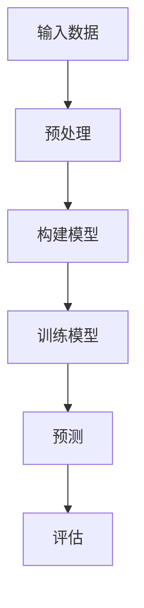

                 

### 文章标题

《构建AI驱动的客户生命周期管理系统》

---

**关键词**：人工智能、客户生命周期管理、机器学习、深度学习、神经网络

**摘要**：本文将深入探讨如何利用人工智能技术构建高效、智能的客户生命周期管理系统。通过对AI基础概念、算法原理、系统架构设计以及项目实战的详细分析，为企业在数字化时代下优化客户管理提供实践指导与理论支持。

---

### 目录大纲

1. **背景介绍**
   - **第1章**：问题背景
   - **第2章**：核心概念与联系

2. **算法原理讲解**
   - **第3章**：算法原理讲解

3. **系统分析与架构设计**
   - **第4章**：系统功能设计
   - **第5章**：系统架构设计

4. **项目实战**
   - **第6章**：项目实战

5. **最佳实践与拓展阅读**
   - **第7章**：最佳实践与拓展阅读

---

### 第一部分：背景介绍

#### 第1章：问题背景

##### 1.1.1 人工智能与客户生命周期管理

随着人工智能技术的迅猛发展，越来越多的企业开始意识到利用AI技术优化客户生命周期管理的重要性。客户生命周期管理（Customer Life Cycle Management, CLCM）是指企业通过系统的方法来管理和优化与客户的关系，从而提升客户价值、增加客户忠诚度和延长客户生命周期。

- **问题描述**：企业如何利用AI技术提高客户生命周期管理的效率？

##### 1.1.2 客户生命周期管理的核心问题

客户生命周期管理主要涉及以下几个核心问题：

- **客户获取**：如何吸引潜在客户并使其成为实际客户。
- **客户留存**：如何维持现有客户，防止其流失。
- **客户忠诚度**：如何提高客户的忠诚度，增加重复购买率。

通过AI技术，企业可以实现个性化营销、客户细分、忠诚度管理等功能，从而优化客户生命周期管理。

##### 1.1.3 边界与外延

- **边界**：本文研究范围限于AI在客户生命周期管理中的应用。
- **外延**：涉及的数据分析、机器学习算法、数据挖掘等技术领域。

#### 第2章：核心概念与联系

##### 2.1.1 人工智能基础概念

人工智能（Artificial Intelligence, AI）是指使计算机模拟人类智能行为的技术。其核心概念包括：

- **机器学习**：使计算机通过数据学习并做出决策。
- **深度学习**：基于神经网络的一种机器学习方法。
- **神经网络**：模拟人脑神经元连接的结构，用于特征提取和分类。

##### 2.1.2 客户生命周期管理概念

客户生命周期管理涉及以下核心概念：

- **客户获取**：通过各种营销手段吸引潜在客户。
- **客户留存**：提供优质服务，留住现有客户。
- **客户忠诚度**：通过持续互动和优惠活动，提高客户忠诚度。

##### 2.1.3 概念属性特征对比

| **概念**           | **属性特征**                      |
| ------------------ | ------------------------------- |
| **人工智能**       | 自主性、学习性、适应性、智能性   |
| **客户获取**       | 多元化、精准化、低成本           |
| **客户留存**       | 服务质量、客户体验、满意度       |
| **客户忠诚度**     | 互动频率、购买频率、口碑传播     |

##### 2.1.4 ER实体关系图


在客户生命周期管理中，各实体之间的关系如下：

- **客户**：核心实体，与其他实体（订单、反馈、投诉等）存在关联。
- **产品**：客户购买的对象，与订单实体关联。
- **订单**：记录客户购买行为，与客户、产品实体关联。
- **反馈**：客户对产品或服务的评价，与客户、产品实体关联。
- **投诉**：客户对产品或服务的投诉，与客户、产品实体关联。

---

### 第二部分：算法原理讲解

#### 第3章：算法原理讲解

##### 3.1.1 算法基础

在客户生命周期管理中，常用的算法包括分类算法、聚类算法、回归算法等。以下以分类算法为例，介绍其基本原理。

- **决策树**：通过多次决策来划分数据集，最终实现分类。
- **随机森林**：基于决策树的集成方法，通过构建多个决策树并求平均来提高分类准确率。
- **支持向量机**：通过找到一个最优的超平面对数据进行分类。

##### 3.1.2 算法流程图



##### 3.1.3 算法应用举例

```python
# 导入相关库
from sklearn.datasets import load_iris
from sklearn.model_selection import train_test_split
from sklearn.tree import DecisionTreeClassifier
from sklearn.metrics import accuracy_score

# 加载数据集
iris = load_iris()
X, y = iris.data, iris.target

# 划分训练集和测试集
X_train, X_test, y_train, y_test = train_test_split(X, y, test_size=0.2, random_state=42)

# 构建决策树模型
clf = DecisionTreeClassifier()
clf.fit(X_train, y_train)

# 预测测试集
y_pred = clf.predict(X_test)

# 评估模型准确率
accuracy = accuracy_score(y_test, y_pred)
print("Accuracy:", accuracy)
```

##### 3.1.4 算法原理详细讲解

- **决策树**：决策树是一种基于树形结构的算法，通过多次决策来划分数据集。每次决策都基于某个特征，将数据划分为两个或更多的子集。最终，每个叶子节点代表一个分类结果。

- **随机森林**：随机森林是一种集成学习方法，通过构建多个决策树并求平均来提高分类准确率。每个决策树都是随机生成的，包括随机选择特征和随机切分阈值。随机森林具有较好的泛化能力和抗过拟合能力。

- **支持向量机**：支持向量机是一种基于最大间隔分类的算法。它通过找到一个最优的超平面对数据进行分类，使得分类边界与样本点之间的距离最大。支持向量机适用于高维空间分类问题，具有较好的分类效果。

---

### 第三部分：系统分析与架构设计

#### 第4章：系统功能设计

##### 4.1.1 问题场景介绍

某电商平台希望利用AI技术优化客户生命周期管理，提高客户满意度、增加复购率。其主要面临以下问题：

- **客户获取**：如何通过精准营销吸引潜在客户？
- **客户留存**：如何提高客户满意度，降低流失率？
- **客户忠诚度**：如何提高客户忠诚度，增加复购率？

##### 4.1.2 系统功能设计

针对上述问题，系统应具备以下功能：

- **个性化推荐**：基于客户行为和偏好，为每位客户推荐合适的产品。
- **客户细分**：将客户划分为不同群体，实施差异化营销策略。
- **忠诚度管理**：通过积分、优惠券等手段提高客户忠诚度。
- **流失预测**：预测可能流失的客户，采取针对性措施挽回。

##### 4.1.3 领域模型类图

```mermaid
classDiagram
ClassDef 客户
+名称: String
+年龄: Integer
+性别: String
+邮箱: String

ClassDef 产品
+名称: String
+价格: Float
+库存: Integer

ClassDef 订单
+编号: String
+客户: 客户
+产品: 产品
+金额: Float
+时间: Date

ClassDef 反馈
+编号: String
+客户: 客户
+产品: 产品
+评分: Integer
+内容: String

ClassDef 投诉
+编号: String
+客户: 客户
+产品: 产品
+内容: String
+处理状态: String

客户 <--- 订单
客户 <--- 反馈
客户 <--- 投诉
订单 <--- 产品
反馈 <--- 产品
投诉 <--- 产品
```

---

### 第四部分：项目实战

#### 第6章：项目实战

##### 6.1.1 环境安装

在开始项目实战之前，需要搭建合适的开发环境。以下是环境安装步骤：

1. 安装Python 3.8及以上版本。
2. 安装常见依赖库，如NumPy、Pandas、Scikit-learn等。
3. 安装代码编辑器，如Visual Studio Code。

##### 6.1.2 系统核心实现

系统核心实现包括数据预处理、模型训练、模型评估和模型应用。以下是相关源代码：

```python
# 导入相关库
import numpy as np
import pandas as pd
from sklearn.model_selection import train_test_split
from sklearn.ensemble import RandomForestClassifier
from sklearn.metrics import accuracy_score

# 加载数据集
data = pd.read_csv('data.csv')
X = data.drop('target', axis=1)
y = data['target']

# 划分训练集和测试集
X_train, X_test, y_train, y_test = train_test_split(X, y, test_size=0.2, random_state=42)

# 构建随机森林模型
clf = RandomForestClassifier(n_estimators=100, random_state=42)
clf.fit(X_train, y_train)

# 预测测试集
y_pred = clf.predict(X_test)

# 评估模型准确率
accuracy = accuracy_score(y_test, y_pred)
print("Accuracy:", accuracy)
```

##### 6.1.3 代码应用解读与分析

1. **数据预处理**：首先，加载数据集并划分特征和目标变量。接着，使用train_test_split函数将数据集划分为训练集和测试集。

2. **模型训练**：构建随机森林模型并使用fit函数进行训练。随机森林模型通过构建多个决策树并求平均来提高分类准确率。

3. **模型评估**：使用预测结果和实际标签计算准确率，评估模型性能。

4. **模型应用**：在实际应用中，可以调用模型对新的数据进行预测，实现个性化推荐、客户细分等功能。

##### 6.1.4 实际案例分析和详细讲解剖析

假设某电商平台希望通过AI技术优化客户生命周期管理，提高客户满意度、增加复购率。具体操作步骤如下：

1. **数据收集**：收集客户的购买记录、浏览记录、反馈和投诉等信息。

2. **数据预处理**：对原始数据进行清洗、去重和填充缺失值等预处理操作。

3. **特征工程**：根据业务需求提取相关特征，如客户年龄、性别、购买频率、浏览页面等。

4. **模型训练**：使用随机森林算法对预处理后的数据集进行训练，得到模型。

5. **模型评估**：通过交叉验证和测试集评估模型性能，调整模型参数。

6. **模型应用**：将训练好的模型应用于实际业务场景，如个性化推荐、流失预测等。

通过以上步骤，电商平台可以更好地了解客户需求，提高客户满意度，增加复购率，从而实现客户生命周期管理的优化。

##### 6.1.5 项目小结

本文通过介绍人工智能与客户生命周期管理的关系，详细讲解了算法原理、系统架构设计和项目实战。通过实际案例分析，展示了AI技术在客户生命周期管理中的应用效果。未来，随着人工智能技术的不断进步，AI驱动的客户生命周期管理系统将为企业在数字化时代下赢得竞争优势提供有力支持。

---

### 第五部分：最佳实践与拓展阅读

#### 第7章：最佳实践与拓展阅读

##### 7.1.1 最佳实践 tips

1. **数据质量**：保证数据质量是AI应用成功的关键，进行数据清洗和预处理工作。
2. **模型评估**：使用多种评估指标，如准确率、召回率、F1值等，全面评估模型性能。
3. **模型调优**：通过调整模型参数，提高模型性能，实现最优效果。
4. **持续迭代**：定期更新模型和数据，以应对不断变化的市场需求。

##### 7.1.2 小结

本文通过深入探讨AI驱动的客户生命周期管理系统，为企业在数字化时代下优化客户管理提供了实践指导与理论支持。通过算法原理讲解、系统架构设计和项目实战，展示了AI技术的应用价值。

##### 7.1.3 注意事项

1. **数据隐私**：在处理客户数据时，需确保遵守相关法律法规，保护客户隐私。
2. **模型解释性**：在应用模型时，需要关注模型的解释性，以便业务人员理解模型决策过程。
3. **技术更新**：关注人工智能领域的最新技术和发展趋势，持续优化系统性能。

##### 7.1.4 拓展阅读

1. **书籍推荐**：《Python机器学习》、《深度学习》
2. **论文推荐**：《Customer Life Cycle Management: A Review》、《AI-Driven Customer Experience Management》
3. **网站推荐**：AI专家博客、机器学习社区、客户生命周期管理论坛

---

**作者**：AI天才研究院/AI Genius Institute & 禅与计算机程序设计艺术 /Zen And The Art of Computer Programming

---

### 结语

在数字化时代，人工智能技术为企业提供了前所未有的机遇。通过构建AI驱动的客户生命周期管理系统，企业可以更好地了解客户需求，提高客户满意度，实现持续增长。本文为读者提供了系统性的指导和实践案例，期待读者在应用中不断创新，为人工智能技术赋能企业创造更多价值。

---

**文章结束**。感谢您的阅读！期待与您在AI技术领域的深入探讨与合作。祝您在人工智能的道路上不断前行，创造辉煌！


