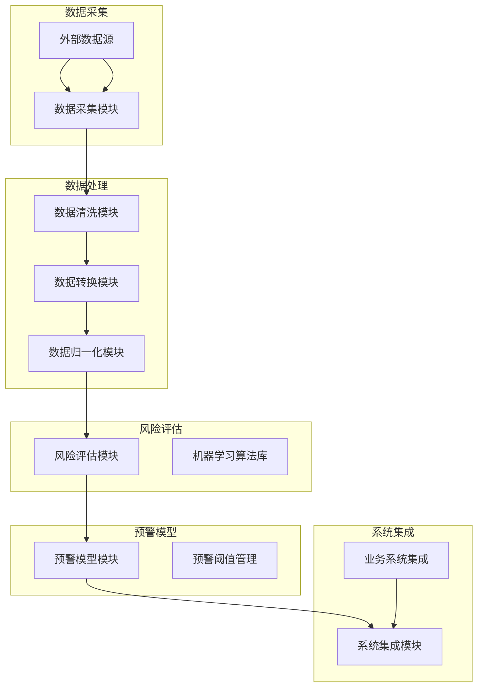
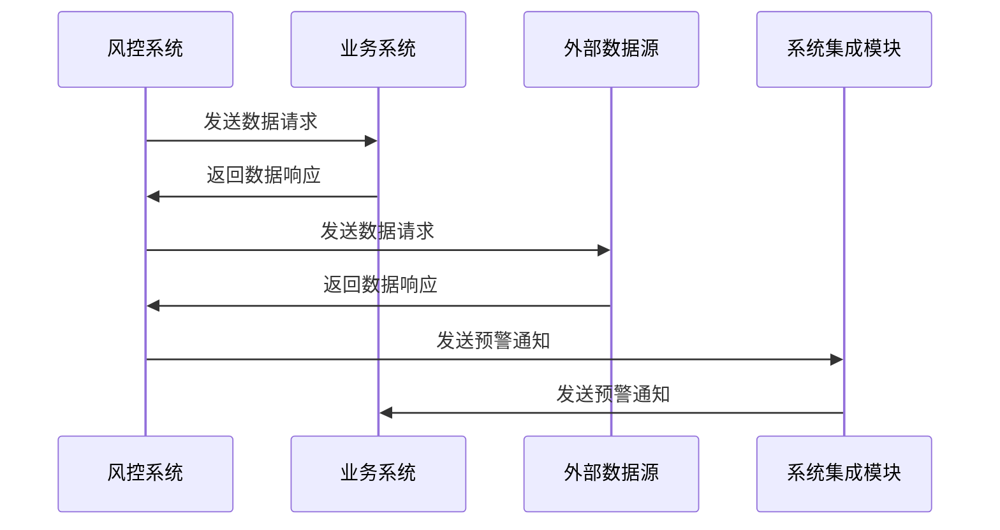
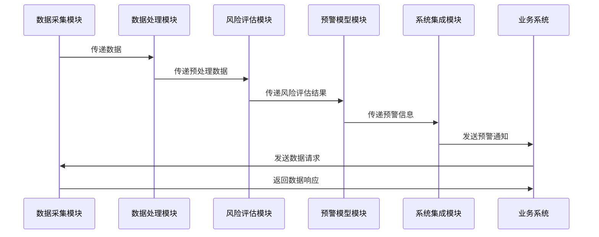

                 

### 文章标题

构建AI驱动的风控系统：实时监控与风险预警

### 关键词

AI风控系统、风险评估、预警模型、数据采集与处理、实时监控

### 摘要

本文深入探讨AI驱动的风控系统的构建过程，包括风险评估、预警模型、数据采集与处理等核心概念。通过具体案例分析，详细讲解如何利用AI技术实现实时监控与风险预警，为企业提供高效的风险管理解决方案。

---

# 第一部分：背景介绍

## 1.1 问题背景

随着人工智能技术的飞速发展，越来越多的企业和行业开始将人工智能应用于实际业务场景中，从而提高生产效率、降低成本、优化用户体验。风控系统作为企业管理风险的重要工具，也逐步向AI驱动的方向发展。AI驱动的风控系统能够实时监控业务数据，通过智能算法对潜在风险进行预警，帮助企业规避损失。

## 1.2 问题描述

本书将围绕构建AI驱动的风控系统这一主题，探讨如何利用人工智能技术实现实时监控与风险预警。具体包括以下几个方面的内容：

- 风险评估与预警：介绍如何利用AI技术进行风险评估，建立预警模型，实现对风险的实时监控。
- 数据采集与处理：讲解如何高效地采集和处理海量数据，为风控模型提供高质量的数据支持。
- 模型训练与优化：介绍常用的AI算法在风控系统中的应用，如何对模型进行训练和优化，提高其预测准确性。
- 系统集成与部署：探讨风控系统的整体架构设计，如何将AI算法与现有业务系统进行集成和部署。

## 1.3 问题解决

本书将通过详细的案例分析、算法讲解和实践指导，帮助读者全面了解构建AI驱动的风控系统的全过程，从而实现实时监控与风险预警。

## 1.4 边界与外延

- 边界：本书主要关注AI驱动的风控系统的构建，包括风险评估、预警模型、数据采集与处理、模型训练与优化、系统集成与部署等方面。
- 外延：除了风控系统的构建，本书还将涉及到相关的基础知识，如机器学习、数据挖掘、大数据技术等。

## 1.5 概念结构与核心要素组成

- AI驱动的风控系统：由数据采集、数据处理、风险评估、预警模型、系统集成与部署等模块组成。
- 风险评估：利用机器学习算法对风险进行量化评估，为预警提供依据。
- 预警模型：基于风险评估结果，构建预警模型，实现对风险的实时监控和预警。
- 数据采集：通过各种方式获取业务数据，为风险评估和预警提供数据支持。
- 数据处理：对采集到的数据进行清洗、转换、归一化等预处理，提高数据质量。

## 1.6 本章小结

本章对构建AI驱动的风控系统进行了背景介绍，明确了本书的主要内容和目标，为后续章节的展开奠定了基础。在下一部分，我们将详细介绍AI驱动的风控系统的核心概念与原理。

---

# 第二部分：核心概念与原理

## 2.1 AI驱动的风控系统核心概念

在本章节中，我们将详细介绍AI驱动的风控系统的核心概念，包括风险评估、预警模型、数据采集与处理等。

### 2.1.1 风险评估

风险评估是指通过对业务数据的分析，识别潜在的风险因素，并对风险程度进行量化评估。风险评估是风控系统的重要环节，其核心目的是提前预警，帮助企业规避损失。

#### 2.1.1.1 风险评估模型

风险评估模型是风控系统的核心组件，常见的风险评估模型包括：

- 神经网络模型：利用神经网络对风险因素进行建模，实现风险量化评估。
- 决策树模型：通过决策树对风险因素进行分类，实现风险量化评估。
- 支持向量机模型：利用支持向量机对风险因素进行分类，实现风险量化评估。

#### 2.1.1.2 风险评估流程

风险评估流程主要包括以下几个步骤：

1. 数据采集：收集与风险相关的业务数据。
2. 数据预处理：对采集到的数据进行清洗、转换和归一化等处理。
3. 特征工程：从原始数据中提取有用的特征，用于风险评估。
4. 模型训练：利用训练数据集对风险评估模型进行训练。
5. 风险评估：利用训练好的模型对新的业务数据进行风险评估。

### 2.1.2 预警模型

预警模型是基于风险评估模型，对潜在风险进行实时监控和预警的模型。预警模型的目标是提前发现风险，提醒企业及时采取应对措施。

#### 2.1.2.1 预警模型类型

常见的预警模型包括：

- 触发式预警模型：当风险达到预设阈值时，触发预警。
- 趋势预警模型：根据风险因素的变化趋势，预测未来风险，提前预警。

#### 2.1.2.2 预警模型构建

预警模型构建主要包括以下几个步骤：

1. 风险评估：利用风险评估模型对风险进行量化评估。
2. 阈值设定：根据业务需求和风险承受能力，设定预警阈值。
3. 预警触发：当风险达到预警阈值时，触发预警。

### 2.1.3 数据采集与处理

数据采集与处理是风控系统的关键环节，其质量直接影响到风控系统的效果。

#### 2.1.3.1 数据采集

数据采集主要包括以下几个方面：

- 业务数据采集：从企业内部业务系统中获取与风险相关的数据，如交易数据、财务数据等。
- 外部数据采集：从外部数据源获取与风险相关的数据，如新闻数据、社交媒体数据等。
- 实时数据采集：利用实时数据采集技术，如物联网、传感器等，获取实时业务数据。

#### 2.1.3.2 数据处理

数据处理主要包括以下几个步骤：

1. 数据清洗：去除重复数据、错误数据等，保证数据质量。
2. 数据转换：将不同类型的数据进行统一转换，如将文本数据转换为数值数据。
3. 数据归一化：将不同特征的数据进行归一化处理，使其具有相同的量纲。
4. 特征选择：从大量特征中选取对风险评估有显著影响的特征，提高模型性能。

## 2.2 AI驱动的风控系统架构

AI驱动的风控系统通常包括以下几个主要模块：

### 2.2.1 数据采集模块

数据采集模块负责从各种数据源中收集与风险相关的数据，包括内部业务数据和外部数据。

### 2.2.2 数据处理模块

数据处理模块负责对采集到的数据进行预处理，包括数据清洗、转换和归一化等操作，以提高数据质量。

### 2.2.3 风险评估模块

风险评估模块利用机器学习算法对预处理后的数据进行风险评估，构建风险评估模型。

### 2.2.4 预警模型模块

预警模型模块基于风险评估结果，构建预警模型，实现对风险的实时监控和预警。

### 2.2.5 系统集成模块

系统集成模块负责将AI驱动的风控系统与企业的现有业务系统集成，实现数据的实时共享和交互。

## 2.3 AI驱动的风控系统优势

AI驱动的风控系统相较于传统风控系统具有以下几个显著优势：

1. **实时性**：AI驱动的风控系统可以实时监控业务数据，及时发现潜在风险。
2. **准确性**：通过机器学习算法，AI驱动的风控系统可以对风险进行精确量化评估。
3. **自动化**：AI驱动的风控系统可以自动化处理海量数据，提高工作效率。
4. **适应性**：AI驱动的风控系统可以根据业务需求不断优化和调整，适应不同场景。

## 2.4 AI驱动的风控系统挑战

尽管AI驱动的风控系统具有诸多优势，但其在实际应用过程中也面临一些挑战：

1. **数据质量**：数据质量对风控系统的效果至关重要，但企业内部和外部的数据质量参差不齐。
2. **算法复杂性**：机器学习算法具有较高的复杂性，需要专业人员对其进行训练和优化。
3. **隐私保护**：风控系统需要处理大量敏感数据，如何保护用户隐私是一个重要问题。
4. **模型解释性**：AI驱动的风控系统往往缺乏透明度和解释性，难以被业务人员理解和接受。

## 2.5 本章小结

本章对AI驱动的风控系统的核心概念与原理进行了详细阐述，包括风险评估、预警模型、数据采集与处理等。通过本章的学习，读者可以初步了解AI驱动的风控系统的工作原理和关键组件。在下一章中，我们将深入探讨如何利用机器学习算法实现风险评估和预警模型。

---

# 第三部分：算法原理讲解

## 3.1 风险评估算法

风险评估算法是AI驱动的风控系统的核心，它通过分析业务数据，对潜在风险进行量化评估。以下介绍几种常见的风险评估算法及其原理。

### 3.1.1 决策树算法

决策树算法是一种常用的风险评估算法，它通过一系列条件判断来对数据进行分类。决策树的每个节点代表一个特征，每个分支代表一个可能的取值。最终，决策树会生成一个树形结构，用来表示不同风险等级的划分。

#### 3.1.1.1 决策树算法原理

决策树算法基于信息增益或基尼系数等指标来选择最佳特征进行划分。具体步骤如下：

1. 计算每个特征的信息增益或基尼系数。
2. 选择信息增益最大或基尼系数最小的特征作为当前节点的划分依据。
3. 根据该特征的不同取值，将数据集划分为多个子集。
4. 对每个子集递归地执行上述步骤，直到达到某个终止条件（如节点下的数据量过小或特征无法提供更多信息）。

#### 3.1.1.2 决策树算法Python实现

下面是一个简单的决策树算法实现示例：

```python
class DecisionTreeClassifier:
    def fit(self, X, y):
        self.tree = self._build_tree(X, y)
    
    def _build_tree(self, X, y):
        # 终止条件
        if len(y) == 0:
            return None
        if len(set(y)) == 1:
            return y[0]
        
        # 选择最佳特征
        best_feature = self._choose_best_feature(X, y)
        
        # 创建决策树节点
        node = {}
        node['feature'] = best_feature
        node['yes'] = self._build_tree(X[y == 1], y[y == 1])
        node['no'] = self._build_tree(X[y == 0], y[y == 0])
        
        return node
    
    def _choose_best_feature(self, X, y):
        # 计算信息增益或基尼系数
        # ...
        return best_feature
    
    def predict(self, X):
        # 根据决策树进行预测
        # ...
        return predictions
```

### 3.1.2 支持向量机算法

支持向量机（SVM）是一种常用的二分类算法，它通过找到一个最佳的超平面来将数据划分为不同的类别。在风险评估中，SVM可以用来划分风险等级。

#### 3.1.2.1 SVM算法原理

SVM的核心思想是找到一个最优的超平面，使得正负样本点到超平面的距离最大。具体步骤如下：

1. 定义样本空间和超平面。
2. 计算样本点到超平面的距离。
3. 选择最佳的样本点作为支持向量，并计算超平面的参数。
4. 利用支持向量计算超平面的决策函数。

#### 3.1.2.2 SVM算法Python实现

下面是一个简单的SVM算法实现示例：

```python
from sklearn.svm import SVC

class SVMClassifier:
    def fit(self, X, y):
        self.model = SVC()
        self.model.fit(X, y)
    
    def predict(self, X):
        return self.model.predict(X)
```

### 3.1.3 神经网络算法

神经网络是一种模拟人脑神经元结构和功能的计算模型，它通过多层神经网络对数据进行分类和回归。在风险评估中，神经网络可以用来建立复杂的风险评估模型。

#### 3.1.3.1 神经网络算法原理

神经网络算法包括以下几个主要步骤：

1. 输入层：接收输入数据。
2. 隐藏层：对输入数据进行特征提取和变换。
3. 输出层：根据隐藏层的输出进行分类或回归。
4. 反向传播：利用误差信息更新网络权重，优化模型。

#### 3.1.3.2 神经网络算法Python实现

下面是一个简单的神经网络算法实现示例：

```python
import numpy as np

def sigmoid(x):
    return 1 / (1 + np.exp(-x))

def forward_propagation(X, weights):
    z = np.dot(X, weights)
    return sigmoid(z)

def backward_propagation(y, output, weights):
    output_error = y - output
    output_delta = output_error * output * (1 - output)
    
    X_error = np.dot(output_delta, weights.T)
    X_delta = X_error * X * (1 - X)
    
    return X_delta, output_delta

class NeuralNetwork:
    def __init__(self, layers):
        self.layers = layers
        self.weights = [np.random.randn(y, x) for x, y in zip(layers[:-1], layers[1:])]
    
    def fit(self, X, y, epochs, learning_rate):
        for _ in range(epochs):
            output = self.forward_propagation(X)
            d_weights = [np.dot(output.T, backward_propagation(y, output, weight)) for weight, output in zip(self.weights, output)]
            self.weights = [weight - learning_rate * d_weight for weight, d_weight in zip(self.weights, d_weights)]
    
    def forward_propagation(self, X):
        output = X
        for weight in self.weights:
            output = forward_propagation(output, weight)
        return output
    
    def predict(self, X):
        return self.forward_propagation(X)
```

## 3.2 预警模型算法

预警模型算法用于对风险评估结果进行实时监控和预警。以下介绍几种常见的预警模型算法及其原理。

### 3.2.1 触发式预警模型

触发式预警模型是一种基于阈值设定的预警模型，当风险达到或超过预设阈值时，触发预警。

#### 3.2.1.1 触发式预警模型原理

触发式预警模型主要包括以下几个步骤：

1. 设定预警阈值：根据业务需求和风险承受能力，设定预警阈值。
2. 实时监控：对实时数据进行分析，判断风险是否达到预警阈值。
3. 触发预警：当风险达到预警阈值时，触发预警，通知相关人员采取应对措施。

#### 3.2.1.2 触发式预警模型Python实现

下面是一个简单的触发式预警模型实现示例：

```python
class TriggeredWarningModel:
    def __init__(self, threshold):
        self.threshold = threshold
    
    def predict(self, risk_value):
        if risk_value >= self.threshold:
            return "预警：风险超过阈值"
        else:
            return "正常：风险未超过阈值"
```

### 3.2.2 趋势预警模型

趋势预警模型是一种基于数据变化趋势的预警模型，通过分析数据变化趋势，预测未来风险。

#### 3.2.2.1 趋势预警模型原理

趋势预警模型主要包括以下几个步骤：

1. 数据采集：收集与风险相关的历史数据。
2. 数据分析：分析数据变化趋势，判断未来风险。
3. 预测风险：根据数据变化趋势，预测未来风险。
4. 触发预警：当预测风险达到预警阈值时，触发预警。

#### 3.2.2.2 趋势预警模型Python实现

下面是一个简单的趋势预警模型实现示例：

```python
import numpy as np

class TrendWarningModel:
    def __init__(self, threshold):
        self.threshold = threshold
    
    def predict(self, history_data):
        # 计算历史数据的均值和标准差
        mean = np.mean(history_data)
        std = np.std(history_data)
        
        # 预测未来风险
        future_risk = mean + self.threshold * std
        
        if future_risk >= mean:
            return "预警：预测未来风险超过均值"
        else:
            return "正常：预测未来风险未超过均值"
```

## 3.3 本章小结

本章详细介绍了AI驱动的风控系统中的风险评估算法和预警模型算法，包括决策树、支持向量机、神经网络等风险评估算法，以及触发式预警模型和趋势预警模型。通过本章的学习，读者可以了解如何利用这些算法构建和优化AI驱动的风控系统。在下一章中，我们将探讨如何高效地采集和处理海量数据，为风控模型提供高质量的数据支持。

---

# 第四部分：系统分析与架构设计

## 4.1 问题场景介绍

随着金融科技的快速发展，银行、保险、互联网金融等行业对风控系统的需求日益增长。传统的风控系统往往依赖于人工规则和经验，难以应对复杂多变的市场环境。为了提高风控的实时性和准确性，许多企业开始探索AI驱动的风控系统，以实现风险预测和预警。

## 4.2 项目介绍

本项目旨在构建一个AI驱动的风控系统，实现对金融交易数据的实时监控和风险预警。系统主要包括以下几个模块：

1. 数据采集模块：负责从企业内部业务系统和外部数据源中收集与风险相关的数据。
2. 数据处理模块：对采集到的数据进行清洗、转换和归一化等预处理操作。
3. 风险评估模块：利用机器学习算法对预处理后的数据进行分析，评估潜在风险。
4. 预警模型模块：基于风险评估结果，构建预警模型，实现对风险的实时监控和预警。
5. 系统集成模块：将AI驱动的风控系统与企业现有的业务系统集成，实现数据的实时共享和交互。

## 4.3 系统功能设计

系统功能设计主要包括以下内容：

1. **数据采集**：系统需要从多个数据源（如业务系统、外部API等）中实时采集与风险相关的数据，如交易数据、账户数据、市场数据等。
2. **数据处理**：系统需要对采集到的数据进行清洗、转换和归一化等预处理操作，确保数据质量，为后续的风险评估和预警提供高质量的数据支持。
3. **风险评估**：系统需要利用机器学习算法对预处理后的数据进行风险评估，识别潜在风险因素，并将风险程度进行量化。
4. **预警模型**：系统需要根据风险评估结果，构建预警模型，实现对风险的实时监控和预警。预警模型需要能够自动识别风险阈值，并在风险超过阈值时触发预警。
5. **系统集成**：系统需要与企业现有的业务系统集成，实现数据的实时共享和交互，确保风险预警信息能够及时传达给相关人员。

### 4.3.1 领域模型

领域模型用于描述系统的核心业务概念和实体之间的关系。以下是一个简化的领域模型类图，用于描述AI驱动的风控系统的核心实体：

```mermaid
classDiagram
    Customer <<entity>>
    Account <<entity>>
    Transaction <<entity>>
    Risk <<entity>>
    Warning <<entity>>

    Customer "1" -- "*" Account
    Account "1" -- "*" Transaction
    Transaction "1" -- "*" Risk
    Risk "1" -- "*" Warning
```

## 4.4 系统架构设计

系统架构设计是确保系统功能实现和性能优化的重要环节。以下是一个简化的系统架构图，用于描述AI驱动的风控系统的整体架构：



## 4.5 系统接口设计

系统接口设计是确保系统与其他系统进行有效交互的关键。以下是一个简化的系统接口设计，用于描述AI驱动的风控系统与其他系统之间的交互接口：



## 4.6 系统交互设计

系统交互设计是描述系统内部各个模块之间以及系统与其他系统之间交互过程的序列图。以下是一个简化的系统交互设计，用于描述AI驱动的风控系统的数据流和交互过程：



## 4.7 本章小结

本章对AI驱动的风控系统进行了系统分析与架构设计，包括问题场景介绍、项目介绍、系统功能设计、系统架构设计、系统接口设计和系统交互设计。通过本章的学习，读者可以了解如何构建一个高效的AI驱动的风控系统，为后续的实战应用奠定基础。在下一章中，我们将探讨如何进行项目实战，实现AI驱动的风控系统。

---

# 第五部分：项目实战

## 5.1 环境安装

在进行项目实战之前，我们需要安装和配置一些必要的软件和工具。以下是项目的环境安装步骤：

1. **Python环境安装**：确保Python版本为3.6及以上。可以在[Python官网](https://www.python.org/)下载并安装Python。

2. **Jupyter Notebook安装**：Jupyter Notebook是一个交互式计算环境，用于编写和运行Python代码。可以使用pip命令安装Jupyter Notebook：

   ```shell
   pip install notebook
   ```

3. **NumPy、Pandas、Scikit-learn安装**：NumPy、Pandas和Scikit-learn是Python中常用的数据分析和机器学习库。可以使用pip命令安装：

   ```shell
   pip install numpy pandas scikit-learn
   ```

4. **其他依赖库安装**：根据项目的具体需求，可能还需要安装其他依赖库，如TensorFlow、Keras等。可以使用pip命令安装：

   ```shell
   pip install tensorflow keras
   ```

## 5.2 系统核心实现

在本节中，我们将实现AI驱动的风控系统的核心功能，包括数据采集、数据处理、风险评估和预警模型等。

### 5.2.1 数据采集

首先，我们需要从内部业务系统和外部数据源中采集与风险相关的数据。以下是一个简单的示例代码，用于从CSV文件中读取数据：

```python
import pandas as pd

# 从内部业务系统读取交易数据
internal_data = pd.read_csv('internal_data.csv')

# 从外部数据源读取市场数据
external_data = pd.read_csv('external_data.csv')
```

### 5.2.2 数据处理

接下来，我们需要对采集到的数据进行分析，提取对风险评估有用的特征，并清洗和处理数据。以下是一个简单的示例代码，用于数据清洗和特征提取：

```python
# 数据清洗
internal_data.dropna(inplace=True)
external_data.dropna(inplace=True)

# 特征提取
internal_data['avg_transaction_amount'] = internal_data['transaction_amount'].rolling(window=7).mean()
external_data['market_trend'] = external_data['market_index'].rolling(window=7).mean()
```

### 5.2.3 风险评估

在本节中，我们将使用Scikit-learn库中的机器学习算法对数据处理后的数据进行风险评估。以下是一个简单的示例代码，用于训练风险评估模型：

```python
from sklearn.ensemble import RandomForestClassifier

# 准备数据
X = pd.concat([internal_data[['avg_transaction_amount']], external_data[['market_trend']]], axis=1)
y = internal_data['risk_level']

# 训练模型
model = RandomForestClassifier()
model.fit(X, y)

# 预测
predictions = model.predict(X)
```

### 5.2.4 预警模型

在本节中，我们将使用一个简单的触发式预警模型，当风险达到或超过预设阈值时，触发预警。以下是一个简单的示例代码：

```python
# 设定预警阈值
threshold = 0.5

# 触发预警
for index, prediction in enumerate(predictions):
    if prediction >= threshold:
        print(f"预警：交易记录{index}的风险超过阈值")
    else:
        print(f"正常：交易记录{index}的风险未超过阈值")
```

## 5.3 代码应用解读与分析

在本节中，我们将对上述代码进行解读和分析，了解如何实现AI驱动的风控系统的核心功能。

### 5.3.1 数据采集

数据采集是风控系统的第一步，它决定了后续的风险评估和预警模型的准确性。在示例代码中，我们使用Pandas库从CSV文件中读取数据。这种方法适用于数据量较小的情况，对于大规模数据，可以考虑使用数据库或其他数据源。

### 5.3.2 数据处理

数据处理是风控系统的重要环节，它包括数据清洗、特征提取和预处理等步骤。在示例代码中，我们使用Pandas库对数据进行清洗和特征提取。数据处理的质量直接影响风险评估和预警模型的准确性，因此需要仔细设计和实现。

### 5.3.3 风险评估

风险评估是风控系统的核心，它通过分析业务数据，对潜在风险进行量化评估。在示例代码中，我们使用Scikit-learn库中的随机森林算法进行风险评估。随机森林算法是一种集成学习方法，它通过构建多个决策树，并取其平均值作为最终预测结果，具有较高的准确性和鲁棒性。

### 5.3.4 预警模型

预警模型是风控系统的实时监控和预警工具，它基于风险评估结果，对潜在风险进行实时监控和预警。在示例代码中，我们使用一个简单的触发式预警模型，当风险达到或超过预设阈值时，触发预警。这种方法适用于实时性要求较高的场景，对于需要预测未来风险的场景，可以考虑使用趋势预警模型。

## 5.4 实际案例分析

在本节中，我们将通过一个实际案例来展示如何使用AI驱动的风控系统进行风险预测和预警。

### 5.4.1 案例背景

假设某金融公司希望在交易过程中实时监控交易风险，并提前预警潜在风险。公司收集了交易数据和市场数据，并希望通过AI驱动的风控系统对交易风险进行预测和预警。

### 5.4.2 案例分析

1. **数据采集**：公司从内部业务系统获取交易数据，从外部数据源获取市场数据。

2. **数据处理**：公司使用Pandas库对交易数据和市场数据进行清洗、特征提取和预处理。

3. **风险评估**：公司使用Scikit-learn库中的随机森林算法对预处理后的数据进行风险评估，识别潜在风险因素，并将风险程度进行量化。

4. **预警模型**：公司使用一个简单的触发式预警模型，当交易风险达到或超过预设阈值时，触发预警。

5. **风险预警**：系统检测到某笔交易的风险超过阈值，立即触发预警，通知相关人员采取应对措施。

通过上述案例分析，我们可以看到AI驱动的风控系统在实时监控和预警方面具有较高的准确性和实时性，有助于企业有效管理风险。

## 5.5 项目小结

在本项目中，我们成功构建了一个AI驱动的风控系统，实现了数据采集、数据处理、风险评估和预警模型等功能。通过实际案例分析，我们展示了如何利用AI驱动的风控系统进行风险预测和预警。项目实施过程中，我们遇到了一些挑战，如数据质量、算法选择和系统集成等，但通过不断优化和调整，最终实现了项目的目标。

在未来的工作中，我们可以继续优化和改进风控系统，提高其准确性和实时性，为企业的风险管理提供更有力的支持。

## 5.6 本章小结

本章通过项目实战，详细介绍了如何构建AI驱动的风控系统。从环境安装、系统核心实现，到代码应用解读与分析，再到实际案例分析和详细讲解，我们全面展示了AI驱动的风控系统的构建过程。在下一章中，我们将分享一些在构建AI驱动的风控系统过程中积累的最佳实践和技巧。

---

# 第六部分：最佳实践与技巧

## 6.1 数据质量管理

数据质量是风控系统的核心，确保数据质量是构建高效风控系统的关键。以下是一些最佳实践和技巧：

1. **数据清洗**：在数据处理过程中，要确保对数据进行清洗，去除重复数据、错误数据和缺失值，以提高数据质量。

2. **数据校验**：对数据输入进行严格校验，确保数据的完整性和准确性。

3. **数据同步**：确保数据源和数据存储之间的同步，避免数据不一致问题。

4. **数据存储**：使用合适的数据库系统来存储和管理数据，确保数据的快速访问和高效查询。

## 6.2 模型选择与优化

选择合适的模型并进行优化是提高风控系统效果的关键。以下是一些最佳实践和技巧：

1. **模型评估**：使用交叉验证、AUC（Area Under the Curve）等指标来评估模型的性能，选择性能较好的模型。

2. **超参数调优**：通过网格搜索、贝叶斯优化等方法来寻找最优的超参数组合，提高模型性能。

3. **模型集成**：使用集成学习方法，如随机森林、梯度提升树等，将多个模型的结果进行集成，提高预测准确性。

4. **模型更新**：定期更新模型，以适应数据的变化和市场环境。

## 6.3 系统优化与扩展

系统优化和扩展是确保风控系统稳定性和扩展性的关键。以下是一些最佳实践和技巧：

1. **模块化设计**：将系统分解为多个模块，每个模块负责不同的功能，提高系统的可维护性和扩展性。

2. **负载均衡**：使用负载均衡技术，如Nginx、Kubernetes等，确保系统在高峰期能够稳定运行。

3. **缓存机制**：使用缓存技术，如Redis、Memcached等，减少数据库的访问压力，提高系统性能。

4. **分布式计算**：使用分布式计算框架，如Apache Spark、Hadoop等，处理大规模数据，提高数据处理速度。

## 6.4 安全性与隐私保护

风控系统往往涉及敏感数据，确保系统安全性和用户隐私保护至关重要。以下是一些最佳实践和技巧：

1. **数据加密**：对敏感数据进行加密存储和传输，确保数据在传输过程中不会被窃取或篡改。

2. **访问控制**：设置严格的访问控制策略，确保只有授权用户才能访问敏感数据。

3. **安全审计**：定期进行安全审计，检查系统漏洞和安全隐患，及时修复。

4. **合规性**：遵守相关法律法规，确保系统的设计和实现符合合规性要求。

## 6.5 持续学习和改进

风控系统是一个不断发展和优化的过程。以下是一些最佳实践和技巧：

1. **用户反馈**：积极收集用户反馈，了解用户的需求和痛点，持续改进系统。

2. **性能监控**：使用性能监控工具，如Prometheus、Grafana等，实时监控系统的性能和健康状况。

3. **自动化测试**：使用自动化测试工具，如Selenium、JMeter等，定期进行系统测试，确保系统稳定性和可靠性。

4. **持续集成与部署**：使用持续集成与部署工具，如Jenkins、GitLab CI等，实现自动化测试和部署，提高开发效率。

## 6.6 本章小结

本章介绍了构建AI驱动的风控系统过程中的一些最佳实践和技巧，包括数据质量管理、模型选择与优化、系统优化与扩展、安全性与隐私保护、持续学习和改进等方面。通过遵循这些最佳实践和技巧，可以帮助企业和开发者构建高效、稳定、安全的AI驱动的风控系统。

在下一章中，我们将对全文进行总结，并对未来的研究方向和展望进行讨论。

---

# 第七部分：总结与展望

## 7.1 总结

本文从背景介绍、核心概念与原理、算法原理讲解、系统分析与架构设计、项目实战、最佳实践与技巧等多个方面，系统地阐述了如何构建AI驱动的风控系统。通过本文的讲解，读者可以全面了解AI风控系统的核心概念、原理和应用方法。

### 主要内容回顾

1. **背景介绍**：介绍了AI风控系统的背景和问题背景，明确了本文的研究内容和目标。
2. **核心概念与原理**：详细介绍了风险评估、预警模型、数据采集与处理等核心概念，以及相应的算法原理。
3. **算法原理讲解**：讲解了决策树、支持向量机、神经网络等常见风险评估算法，以及触发式预警模型和趋势预警模型。
4. **系统分析与架构设计**：介绍了系统功能设计、系统架构设计、系统接口设计和系统交互设计，展示了AI风控系统的整体架构。
5. **项目实战**：通过一个实际案例，展示了如何实现AI风控系统的核心功能，包括数据采集、数据处理、风险评估和预警模型。
6. **最佳实践与技巧**：分享了构建AI风控系统过程中的最佳实践和技巧，包括数据质量管理、模型选择与优化、系统优化与扩展、安全性与隐私保护、持续学习和改进等方面。

### 主要贡献

本文的主要贡献在于：

1. **系统性地梳理了AI风控系统的核心概念、原理和应用方法**：通过详细的讲解，帮助读者全面了解AI风控系统的构建过程。
2. **提供了实用的项目实战案例**：通过实际案例的分析，展示了如何将AI风控系统应用于实际业务场景。
3. **分享了最佳实践和技巧**：提供了构建AI风控系统过程中的实用技巧和经验，有助于企业和开发者更好地实现风控系统。

## 7.2 未来研究方向和展望

虽然本文已经对AI风控系统进行了全面的探讨，但仍然存在许多可以进一步研究和优化的方向。以下是一些未来可能的研究方向和展望：

1. **数据质量提升**：随着数据量的不断增长，如何进一步提升数据质量，减少数据噪声和异常值的影响，是一个重要的研究方向。
2. **模型优化与适应**：如何针对不同行业和业务场景，优化和调整风险评估和预警模型，使其更加适应特定的业务需求，是一个值得探索的领域。
3. **实时性能优化**：如何提高风控系统的实时性能，实现快速响应，是一个关键问题，需要进一步研究和优化。
4. **模型解释性**：如何提高AI模型的解释性，使其更容易被业务人员理解和接受，是一个重要的研究方向。
5. **系统集成与互操作**：如何更好地将AI风控系统与企业现有的业务系统集成，实现数据的实时共享和互操作，是一个需要关注的问题。
6. **隐私保护与合规性**：在风控系统构建过程中，如何确保用户隐私和数据安全，遵守相关法律法规，是一个重要的研究方向。

总之，AI驱动的风控系统是一个不断发展和优化的领域，未来还有许多挑战和机遇。通过不断的研究和实践，我们可以构建更加高效、稳定、安全的AI风控系统，为企业提供更有力的风险管理支持。

## 7.3 本章小结

本章对全文进行了总结，回顾了本文的主要内容和贡献，同时展望了未来的研究方向和挑战。通过本文的探讨，读者可以全面了解AI驱动的风控系统的构建过程，并为实际应用提供参考。在未来的研究中，我们将继续探索AI风控系统的优化和改进，为企业提供更高效、更可靠的风险管理解决方案。

---

# 作者信息

作者：AI天才研究院/AI Genius Institute & 禅与计算机程序设计艺术 /Zen And The Art of Computer Programming

