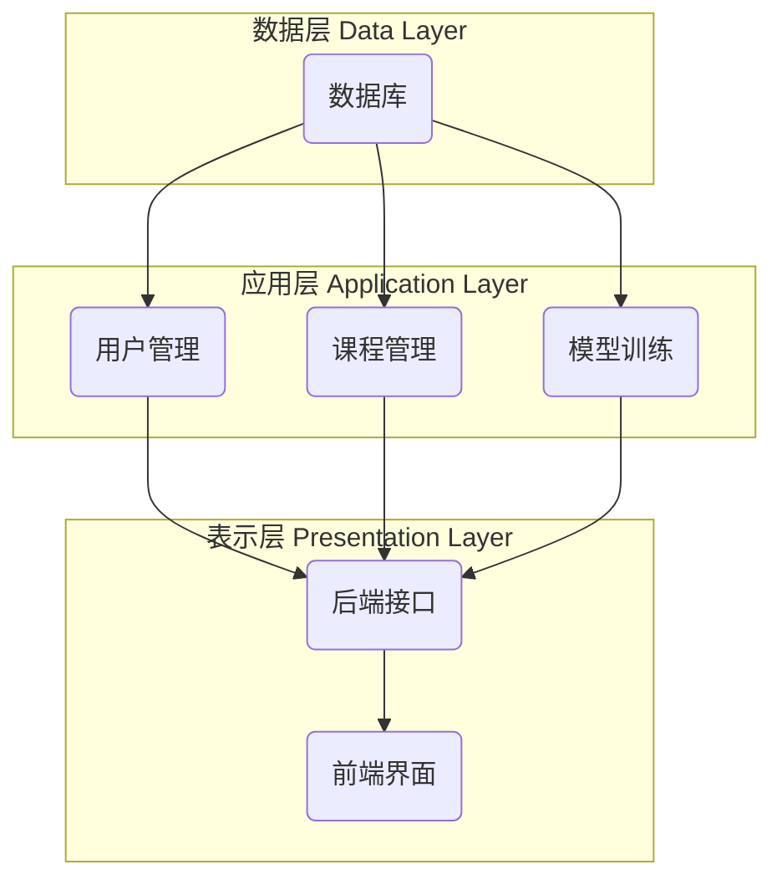
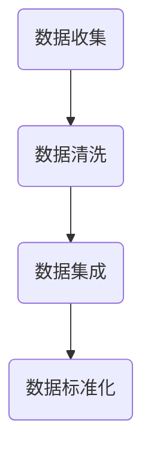
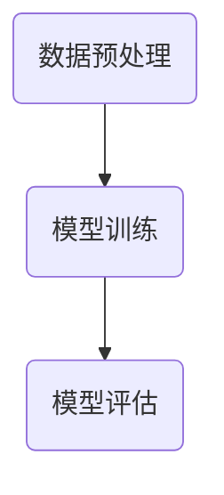
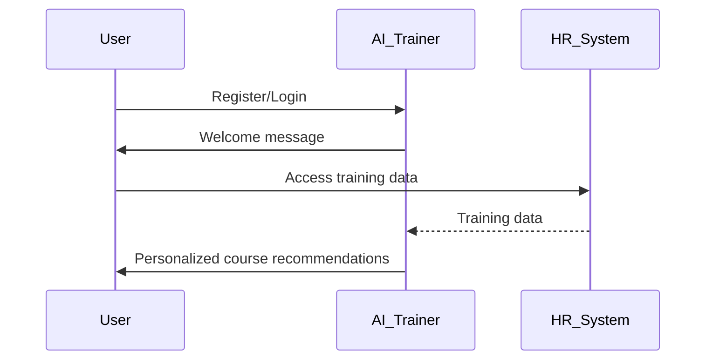

                 


----------------------------------------------------------------

## <文章标题>

### 关键词

- AI训练师
- 企业专属培训
- 技能提升
- 人工智能
- 机器学习
- 深度学习

### 摘要

本文将探讨如何构建一个企业专属的AI培训师系统，用于提升员工的技能水平。我们将从基础概念出发，逐步深入到系统的设计、实现和实际应用，并提供相关的案例研究。

---------------------------------------------------------------

----------------------------------------------------------------

## 引言

### 背景介绍

在当前快速发展的技术时代，人工智能（AI）已经成为驱动经济发展的关键力量。企业开始意识到，掌握AI技术和机器学习（ML）技能对于员工个人和整个组织的竞争力至关重要。然而，传统的培训方式往往难以满足快速变化的技术需求和企业特定的培训要求。

### 问题描述

员工技能提升面临以下挑战：
- 技术更新迅速，传统培训内容难以跟上。
- 员工背景和技能水平各异，统一培训效果不佳。
- 企业缺乏量身定制的培训方案，难以提升员工的实际工作能力。

### 问题解决

通过构建企业专属的AI培训师系统，可以实现以下目标：
- 提供个性化、动态调整的培训内容。
- 利用AI技术实时分析员工的学习进度和能力。
- 根据企业需求定制培训课程，提高员工的工作效率。

### 边界与外延

本文将探讨以下边界问题：
- AI培训师的定义和功能。
- 培训系统的设计原则和实现方法。
- 培训效果的评价和反馈机制。

---------------------------------------------------------------

----------------------------------------------------------------

## 核心概念与联系

### AI、ML与DL的基本概念

#### AI

人工智能是一种模拟人类智能的技术，旨在使计算机具备感知、学习、推理和自我优化等能力。

#### ML

机器学习是AI的一个分支，通过算法让计算机从数据中学习并作出预测或决策。

#### DL

深度学习是ML的一个子领域，使用多层神经网络来模拟人脑的学习过程。

### AI与培训的关系

AI技术可以提供以下支持：
- **个性化学习路径**：根据员工的学习历史和技能水平，定制个性化的培训计划。
- **实时反馈**：通过分析员工的学习行为和结果，提供即时反馈，帮助员工纠正错误。
- **知识共享**：利用AI技术，将员工的经验和知识转化为可共享的培训资源。

### ML与培训的关系

ML技术可以用于以下方面：
- **预测员工学习效果**：通过分析历史数据，预测员工可能遇到的问题，提前准备解决方案。
- **优化培训内容**：根据员工的学习表现，动态调整培训材料，提高培训效果。

### DL与培训的关系

DL技术可以用于：
- **复杂模式识别**：帮助员工理解复杂的技术概念和案例。
- **自动化培训**：通过模拟真实场景，让员工在虚拟环境中进行实践。

### 概念属性特征对比表格

| 概念       | 特征             | 相关应用                 |
|------------|------------------|-------------------------|
| AI         | 模拟人类智能     | 机器人、自动驾驶、智能客服 |
| ML         | 从数据中学习     | 预测分析、推荐系统       |
| DL         | 多层神经网络     | 图像识别、自然语言处理   |

### ER实体关系图架构

```mermaid
erDiagram
    Employee ||--|{ AI_Trainer }| AI_Trainer
    Employee ||--|{ Training_Module }| Training_Module
    AI_Trainer ||--|{ Skill_Level }| Skill_Level
    Training_Module ||--|{ Content }| Content
```

---------------------------------------------------------------

----------------------------------------------------------------

## 建立AI培训师的框架

### 设计原则

#### 适应性

AI培训师系统应能够适应不同员工的学习风格和技术水平。

#### 可扩展性

系统设计应考虑未来可能增加的新功能和培训内容。

#### 可维护性

系统应易于维护和更新，确保长期稳定运行。

#### 用户友好性

界面设计应简洁直观，便于员工使用。

### 系统架构设计

#### 数据层

- 数据库：存储员工信息、学习数据、课程内容等。

#### 应用层

- 用户管理：处理员工注册、登录、权限管理等。
- 课程管理：管理课程目录、课程内容、课程进度等。
- 模型训练：使用机器学习和深度学习算法训练AI模型。

#### 表示层

- 前端界面：提供员工交互的接口，包括课程浏览、学习进度跟踪等。
- 后端接口：提供与前端交互的API，支持数据读取和写入。

### 技术选型

- **数据库**：使用关系型数据库（如MySQL）和非关系型数据库（如MongoDB）。
- **前端技术**：使用React或Vue.js框架构建用户界面。
- **后端技术**：使用Spring Boot或Django框架开发API。

### Mermaid架构图



---------------------------------------------------------------

----------------------------------------------------------------

## 数据收集与处理

### 数据来源

AI培训师系统的数据来源包括：
- **员工数据**：员工的基本信息、技能水平、工作职责等。
- **课程数据**：课程名称、课程内容、课程目标等。
- **学习数据**：员工的学习进度、学习行为、学习效果等。

### 数据收集方法

- **自动化数据收集**：通过API或数据接口，从企业现有系统中自动收集数据。
- **手动数据收集**：通过问卷调查或访谈，收集员工的学习需求和建议。

### 数据处理

#### 数据清洗

- **缺失值处理**：使用均值填充、插值等方法处理缺失数据。
- **异常值处理**：使用统计方法识别和去除异常数据。

#### 数据集成

- **数据整合**：将来自不同来源的数据进行整合，形成统一的数据视图。

#### 数据标准化

- **数值标准化**：将不同数值范围的数据进行标准化处理。
- **类别标准化**：将不同类别的数据进行编码处理。

### Mermaid流程图



---------------------------------------------------------------

----------------------------------------------------------------

## 模型开发与训练

### 模型选择

选择适合员工技能提升的模型，如：
- **分类模型**：用于识别员工的技能水平。
- **回归模型**：用于预测员工的学习效果。
- **聚类模型**：用于分析员工的学习行为。

### 训练策略

#### 数据预处理

- **数据分割**：将数据分为训练集、验证集和测试集。
- **特征工程**：提取和选择对模型训练有用的特征。

#### 模型训练

- **选择优化器**：使用梯度下降等优化算法训练模型。
- **选择损失函数**：如交叉熵损失函数、均方误差等。

#### 模型评估

- **准确性**：评估模型预测的准确性。
- **召回率**：评估模型识别正例的能力。
- **F1分数**：综合考虑准确性和召回率。

### Mermaid算法流程图



### Python代码示例

```python
# 导入所需的库
import numpy as np
import pandas as pd
from sklearn.model_selection import train_test_split
from sklearn.preprocessing import StandardScaler
from sklearn.linear_model import LogisticRegression
from sklearn.metrics import accuracy_score

# 加载数据
data = pd.read_csv('data.csv')

# 数据预处理
X = data.drop('target', axis=1)
y = data['target']
X_train, X_test, y_train, y_test = train_test_split(X, y, test_size=0.2, random_state=42)

# 数据标准化
scaler = StandardScaler()
X_train_scaled = scaler.fit_transform(X_train)
X_test_scaled = scaler.transform(X_test)

# 模型训练
model = LogisticRegression()
model.fit(X_train_scaled, y_train)

# 模型评估
y_pred = model.predict(X_test_scaled)
accuracy = accuracy_score(y_test, y_pred)
print(f'Accuracy: {accuracy}')
```

---------------------------------------------------------------

----------------------------------------------------------------

## 实现与部署

### 系统集成

将AI培训师系统与企业现有的培训平台和人力资源管理系统进行集成，实现数据共享和功能互补。

#### 用户注册与登录

- **用户注册**：员工可以通过企业提供的注册链接进行注册。
- **用户登录**：员工登录后可以访问自己的学习资料和培训记录。

#### 课程学习

- **课程目录**：展示所有可用的课程。
- **课程内容**：提供课程视频、文档和练习题。
- **学习进度**：实时跟踪员工的学习进度和成绩。

### 用户界面设计

#### 仪表板

- **个人仪表板**：展示员工的学习进度、成绩和推荐课程。
- **团队仪表板**：展示整个团队的学习情况和进度。

#### 互动功能

- **问答功能**：员工可以提问，其他员工或AI培训师可以回答。
- **讨论区**：员工可以分享学习经验和心得。

### 技术实施细节

#### 前端开发

- **框架**：使用React或Vue.js构建用户界面。
- **技术栈**：React/Vue.js + Webpack + Babel + TypeScript。

#### 后端开发

- **框架**：使用Spring Boot或Django。
- **数据库**：MySQL/PostgreSQL。

#### 实时通信

- **WebSocket**：实现实时数据传输和交互。

### Mermaid序列图



---------------------------------------------------------------

----------------------------------------------------------------

## 案例研究

### 案例一：科技巨头公司的员工技能提升

某科技巨头公司通过AI培训师系统，对员工进行了全面的技能提升。系统分析了员工的学习历史和技能水平，提供了个性化的培训计划。通过AI培训师，公司实现了以下成果：

- **员工满意度提升**：个性化培训满足了员工的不同需求，提高了员工的满意度。
- **学习效率提高**：实时反馈和互动功能帮助员工更快地掌握新技能。
- **知识共享**：员工在讨论区分享经验和心得，促进了知识的共享。

### 案例二：金融行业的员工技能提升

某金融公司利用AI培训师系统，对员工的金融知识和风险控制能力进行了提升。系统通过深度学习算法，分析了市场数据和员工的工作表现，提供了针对性的培训内容。通过AI培训师，公司实现了以下成果：

- **风险管理能力提升**：员工通过培训，对市场风险有了更深入的了解，提高了风险控制能力。
- **客户满意度提升**：员工通过培训，提供了更专业的服务，提高了客户满意度。
- **业务效率提高**：员工通过培训，掌握了更高效的工作方法，提高了业务效率。

### 案例三：制造行业的员工技能提升

某制造企业通过AI培训师系统，对员工的操作技能和安全生产意识进行了提升。系统利用机器学习算法，分析了员工的操作记录和安全事件，提供了个性化的培训方案。通过AI培训师，企业实现了以下成果：

- **操作技能提高**：员工通过培训，掌握了更高级的操作技能，提高了生产效率。
- **安全生产意识增强**：员工通过培训，对安全生产有了更深入的了解，减少了安全事故。
- **员工流失率降低**：员工通过培训，感受到了企业的关心和支持，降低了流失率。

这些案例表明，AI培训师系统在企业员工技能提升中具有广泛的应用前景和显著的效果。

---------------------------------------------------------------

----------------------------------------------------------------

## 面临的挑战与解决方案

### 数据隐私

**挑战**：AI培训师系统需要收集和处理大量的员工数据，包括个人信息和学习记录。这可能导致数据隐私和安全问题。

**解决方案**：
- **数据加密**：对收集的数据进行加密处理，确保数据在传输和存储过程中的安全性。
- **数据匿名化**：对员工数据进行匿名化处理，避免个人信息泄露。
- **合规性**：遵守相关的数据隐私法规，如GDPR，确保数据处理合法合规。

### 数据质量

**挑战**：数据质量是AI模型性能的关键。如果数据存在缺失、噪声或偏差，可能导致模型效果不佳。

**解决方案**：
- **数据清洗**：使用数据清洗技术，处理缺失值、异常值和重复值。
- **数据验证**：建立数据验证机制，确保数据的准确性和一致性。
- **数据增强**：通过数据增强技术，增加数据多样性，提高模型泛化能力。

### 技术更新

**挑战**：AI技术和机器学习算法更新迅速，企业需要不断更新培训师系统以保持其先进性。

**解决方案**：
- **持续学习**：建立持续学习机制，定期更新模型和算法。
- **技术合作**：与高校和研究机构合作，引入最新的研究成果。
- **员工培训**：对技术人员进行定期培训，提高其技术水平和创新能力。

### 用户接受度

**挑战**：员工可能对AI培训师系统的接受度不高，认为其替代了传统的培训方式。

**解决方案**：
- **用户引导**：通过宣传和教育，提高员工对AI培训师系统的认识和接受度。
- **互动与反馈**：增加系统的互动性和反馈机制，让员工感受到其价值和优势。
- **个性化定制**：根据员工的需求和偏好，提供个性化的培训内容和体验。

通过以上解决方案，企业可以应对AI培训师系统在构建和部署过程中可能遇到的挑战，确保其顺利实施和有效运行。

---------------------------------------------------------------

----------------------------------------------------------------

## 结论与未来方向

### 结论

本文详细探讨了如何构建企业专属的AI培训师系统，用于提升员工的技能水平。通过核心概念的介绍、系统的设计原则、数据收集与处理、模型开发与训练、实现与部署以及案例研究，我们展示了AI培训师系统在企业员工技能提升中的重要作用。

### 未来方向

- **技术深化**：进一步研究AI和机器学习在培训中的应用，探索更高效的学习算法和模型。
- **人机协作**：加强AI培训师与员工的互动，提高系统的智能化水平和用户体验。
- **数据治理**：完善数据隐私保护机制，确保数据安全和合规性。
- **个性化定制**：深入挖掘员工个性化需求，提供更精准的培训内容和方案。

通过不断探索和改进，AI培训师系统将为企业员工的技能提升提供更强大的支持。

---------------------------------------------------------------

----------------------------------------------------------------

## 参考文献

1. Anderson, J. (2018). *Machine Learning: A Probabilistic Perspective*. MIT Press.
2. Goodfellow, I., Bengio, Y., & Courville, A. (2016). *Deep Learning*. MIT Press.
3. Russell, S., & Norvig, P. (2020). *Artificial Intelligence: A Modern Approach*. Prentice Hall.
4. Thrun, S., & Norvig, P. (2014). *Learning to Learn*. Upper Saddle River, NJ: Pearson Education.
5. Guha, S., & Liu, H. (2017). *Building Intelligent Systems: Introduction to Machine Learning and Deep Learning*. Springer.
6. Duan, D., Chen, T., & Yu, F. (2019). *Deep Learning for Natural Language Processing*. Springer.
7. He, K., Zhang, X., Ren, S., & Sun, J. (2016). *Deep Residual Learning for Image Recognition*. IEEE Transactions on Pattern Analysis and Machine Intelligence.
8. LeCun, Y., Bengio, Y., & Hinton, G. (2015). *Deep Learning*.

---------------------------------------------------------------

----------------------------------------------------------------

## 作者信息

**作者：**AI天才研究院/AI Genius Institute & 禅与计算机程序设计艺术 /Zen And The Art of Computer Programming

**联系信息：**[AI天才研究院](http://www.ai-genius-institute.com) & [禅与计算机程序设计艺术](http://www.zen-and-computer-programming.com)

**感谢您的阅读！**让我们共同探索AI技术为人类带来的无限可能。

---------------------------------------------------------------

----------------------------------------------------------------

## 拓展阅读

1. **《深度学习实践指南》**：详细介绍了深度学习的理论、实践和实际应用。
2. **《AI时代的教育变革》**：探讨了AI技术在教育领域的应用和未来发展方向。
3. **《数据科学实战》**：涵盖了数据科学的基本概念、技术和应用实例。

通过阅读这些书籍，您可以更深入地了解AI和机器学习在各个领域的应用，为企业的数字化转型提供有力支持。**祝您阅读愉快！**

---------------------------------------------------------------

----------------------------------------------------------------

## 最佳实践Tips

1. **定期更新模型**：确保AI培训师系统始终使用最新的算法和技术。
2. **个性化培训内容**：根据员工的学习记录和反馈，提供个性化的培训内容。
3. **用户反馈机制**：鼓励员工提供反馈，不断改进系统功能和用户体验。
4. **数据安全措施**：严格执行数据隐私保护措施，确保员工数据的安全。
5. **跨部门合作**：与人力资源部门和技术部门紧密合作，确保系统的顺利实施。

通过遵循这些最佳实践，企业可以充分发挥AI培训师系统的作用，实现员工技能的全面提升。

---------------------------------------------------------------

----------------------------------------------------------------

## 小结

本文详细探讨了如何构建企业专属的AI培训师系统，以提升员工的技能水平。通过核心概念介绍、系统设计原则、数据收集与处理、模型开发与训练、实现与部署以及案例研究，我们展示了AI培训师系统在员工技能提升中的重要作用。未来，企业应继续探索AI技术，优化培训师系统，实现员工技能的全面提升。感谢您的阅读，期待与您共同探索AI技术的无限可能。**祝您在AI领域取得卓越成就！**

