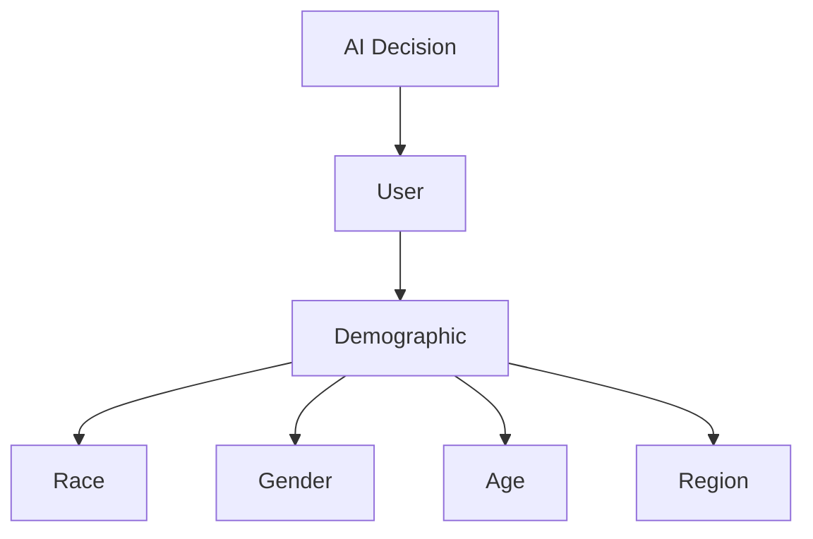
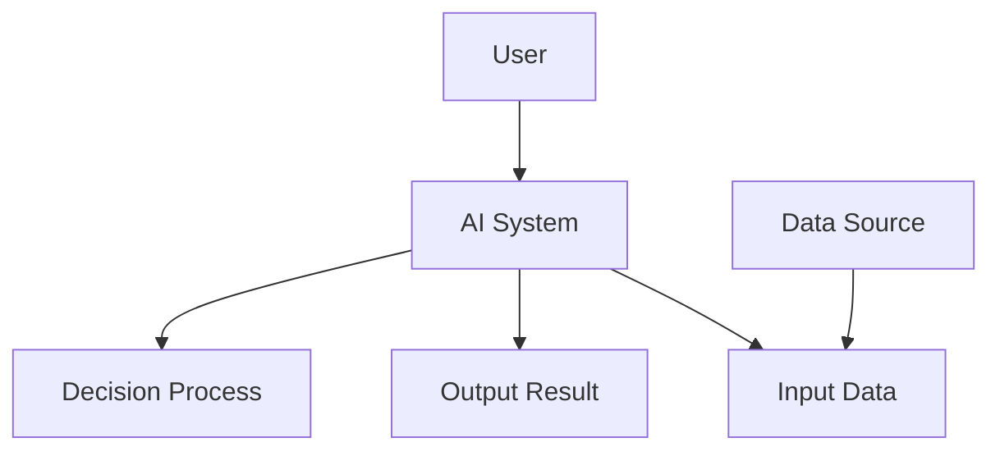

                 

### 文章标题

# 构建企业级AI伦理审核框架：确保AI应用的公平性与透明度

### 文章关键词

- AI伦理审核
- 公平性
- 透明度
- 企业级AI应用
- 法规遵从

### 文章摘要

本文深入探讨了构建企业级AI伦理审核框架的重要性，以确保AI应用的公平性和透明度。通过分析AI伦理审核的核心概念、设计与实施原则、以及在不同领域中的应用，本文为企业和组织提供了全面的技术指南，帮助他们在AI技术应用中遵循伦理规范，规避潜在风险，实现可持续发展。文章还总结了AI伦理审核的最佳实践，并提出了未来研究和发展的方向。

----------------------------------------------------------------

## 第一部分：引言与背景

### 1.1 问题背景

随着人工智能（AI）技术的飞速发展，AI在各个领域的应用已经变得愈发普遍。从智能制造到医疗诊断，从金融分析到自动驾驶，AI技术的应用极大地提升了生产效率和服务质量。然而，AI技术的广泛应用也引发了一系列伦理问题，尤其是公平性和透明度的问题。这些问题不仅关系到个人隐私和安全，更可能对社会的公平性和社会的信任产生深远的影响。

**伦理问题**：AI技术的决策过程通常是基于大量数据进行的，而这些数据往往包含了历史偏见。例如，在招聘系统中，如果训练数据中包含了性别或种族偏见，那么系统可能会在无意中产生性别或种族歧视。这种情况不仅违反了伦理原则，也可能触犯法律。

**透明度问题**：许多AI系统是黑箱操作，即其内部决策过程对用户和开发者都不可见。这种情况下，用户无法了解AI系统的决策依据，导致信任危机。此外，企业内部对于AI系统的审核和监管也面临困难，缺乏透明度的AI系统容易导致滥用和错误决策。

**监管与法规**：随着AI技术的发展，各国政府和国际组织开始关注AI伦理问题，并出台了相应的法规和指导原则。例如，欧盟的《通用数据保护条例》（GDPR）和美国的一些州已经制定了关于AI伦理的法律法规。企业如果不遵守这些法规，可能会面临严重的法律后果。

### 1.2 问题描述

本文旨在解决以下核心问题：

- **公平性问题**：如何确保AI系统在决策过程中不会产生不公平的结果，尤其是在招聘、金融信贷、医疗诊断等关键领域。
- **透明度问题**：如何提高AI系统的透明度，使决策过程更加可解释和可追溯。
- **合规性问题**：如何确保企业遵守相关法规，规避法律风险。

为了解决这些问题，我们需要构建一个企业级的AI伦理审核框架，这个框架应包括以下关键组成部分：

1. **核心概念与原则**：明确AI伦理审核的基本概念和原则，如公平性、透明度、责任等。
2. **审核流程**：设计一个系统化的审核流程，从需求分析到应用，确保AI系统的每个环节都符合伦理标准。
3. **工具与技术**：开发和应用各种工具和技术，如数据清洗、算法优化、可解释AI等，以提高AI系统的公平性和透明度。
4. **实施案例**：通过实际案例研究，展示如何在不同领域实施AI伦理审核框架。
5. **最佳实践**：总结和分享AI伦理审核的最佳实践经验，为其他企业提供参考。

### 1.3 问题解决

构建企业级AI伦理审核框架的目的是为了在AI技术应用中实现以下目标：

- **公平性**：确保AI系统在决策过程中不会对特定群体产生不公平待遇。
- **透明度**：提高AI系统的可解释性，使用户和开发者能够理解AI系统的决策依据。
- **合规性**：确保企业遵守相关法律法规，降低法律风险。
- **信任**：增强用户对AI系统的信任，促进AI技术的广泛应用。

通过实施AI伦理审核框架，企业不仅可以规避潜在的法律风险，还可以提升品牌形象和社会责任，从而在竞争激烈的市场中获得更大的优势。

### 1.4 边界与外延

在构建AI伦理审核框架时，需要明确其边界和适用范围。以下是一些关键点：

- **边界**：AI伦理审核框架主要针对AI系统在关键业务场景中的应用，如招聘、金融、医疗等。对于其他类型的AI应用（如娱乐、社交媒体等），可能需要根据具体情况调整审核框架。
- **外延**：AI伦理审核框架不仅适用于企业内部，也可以应用于公共部门和学术机构。此外，不同国家和地区的法规和标准可能有所不同，需要根据具体情况进行调整。

### 1.5 概念结构与核心要素组成

AI伦理审核框架的核心概念和要素包括：

- **公平性**：确保AI系统在决策过程中不会对特定群体产生不公平待遇。
- **透明度**：提高AI系统的可解释性，使决策过程透明。
- **责任**：明确AI系统开发者和使用者的责任，确保在出现问题时能够追究责任。
- **隐私**：保护用户隐私，避免数据泄露和滥用。
- **安全**：确保AI系统的安全性和稳定性，防止恶意攻击和数据泄露。

这些核心概念和要素相互关联，共同构成了一个完整的AI伦理审核框架。

----------------------------------------------------------------

## 第二部分：AI伦理审核框架核心概念

### 2.1 AI伦理审核的定义与重要性

**定义**：AI伦理审核是一种系统性的过程，旨在评估和确保人工智能系统的设计、开发、部署和应用符合伦理原则和法律法规。它涉及对AI系统的公平性、透明度、责任、隐私、安全等多个方面的审查。

**重要性**：随着AI技术的广泛应用，AI伦理审核的重要性日益凸显。以下是AI伦理审核的重要理由：

1. **法律遵从**：许多国家和地区已经出台了与AI伦理相关的法律法规，如欧盟的GDPR、美国的《公平信用报告法》等。进行AI伦理审核可以帮助企业确保合规性，避免法律风险。
2. **公平性**：AI系统可能在无意中放大历史偏见，导致对特定群体的不公平待遇。通过伦理审核，可以识别和纠正这些问题，确保AI系统的公平性。
3. **透明度**：提高AI系统的透明度，使用户和开发者能够理解AI系统的决策依据，增强系统的可信度。
4. **社会责任**：作为技术领先企业，进行AI伦理审核可以树立良好的企业形象，展现企业的社会责任感。
5. **可持续发展**：通过伦理审核，可以确保AI技术的可持续发展，避免因伦理问题导致的商业失败。

### 2.2 公平性：AI伦理审核的关键要素

**概念**：公平性是指AI系统在处理数据和应用时，不会因性别、种族、年龄、地域等因素产生不公平的决策结果。

**特征对比表格**：

| 特征 | 描述 | 公平性影响 |
| --- | --- | --- |
| 种族 | 不同的种族在数据集中可能被赋予不同的权重 | 种族偏见可能导致种族歧视 |
| 性别 | 男性与女性在决策过程中可能受到不同的待遇 | 性别偏见可能导致性别歧视 |
| 年龄 | 年轻人与老年人可能被赋予不同的权重 | 年龄偏见可能导致年龄歧视 |
| 地域 | 不同地域的用户可能受到不同的待遇 | 地域偏见可能导致地域歧视 |

**ER实体关系图架构**：

### 2.3 透明度：AI伦理审核的核心

**概念**：透明度是指AI系统的决策过程和结果对用户和开发者是可理解、可追溯和可验证的。

**特征对比表格**：

| 特征 | 描述 | 透明度影响 |
| --- | --- | --- |
| 决策过程 | AI系统如何处理数据并做出决策 | 决策过程不透明可能导致用户不信任 |
| 结果解释 | 如何解释AI系统的决策结果 | 结果解释不清晰可能导致误解和疑虑 |
| 数据来源 | AI系统使用的数据来源和数据处理过程 | 数据来源不明确可能导致数据偏见和隐私泄露 |

**ER实体关系图架构**：

### 2.4 其他关键概念：责任、隐私、安全等

**责任**：责任是指AI系统开发者、部署者和用户在AI系统应用过程中应承担的伦理和法律义务。包括对系统错误决策的纠正、对数据隐私的保护、以及对系统安全性的保障。

**隐私**：隐私是指个人数据不被未经授权的第三方访问和使用。AI伦理审核需要确保AI系统在处理个人数据时遵循隐私保护原则，避免数据泄露和滥用。

**安全**：安全是指AI系统在运行过程中不受恶意攻击和数据泄露的风险。AI伦理审核需要评估AI系统的安全性，并采取措施保障系统的稳定性和安全性。

这些关键概念相互关联，共同构成了一个完整的AI伦理审核框架。通过明确这些概念，企业可以更好地设计和实施AI伦理审核流程，确保AI系统的公平性、透明度和合规性。

----------------------------------------------------------------

## 第3章：AI伦理审核框架设计与实施

### 3.1 AI伦理审核框架的设计原则

设计AI伦理审核框架时，需要遵循以下原则，以确保框架的有效性和实用性：

**1. 全生命周期覆盖**：AI伦理审核框架应覆盖AI系统的全生命周期，包括需求分析、设计、开发、测试、部署、运维等各个阶段。这样可以确保AI系统在各个环节都符合伦理要求。

**2. 客观性与公正性**：AI伦理审核应保持客观性和公正性，不受商业利益和外部压力的影响。审核过程应基于科学的方法和客观的数据，确保审核结果的准确性和可信度。

**3. 可定制性**：AI伦理审核框架应具备一定的灵活性，能够根据不同企业的需求和行业特点进行定制化调整。这样可以确保框架适用于各种不同的AI应用场景。

**4. 透明度与参与性**：AI伦理审核过程应具备透明度，确保相关方能够了解审核的内容和结果。同时，应鼓励用户和开发者参与审核过程，提供反馈和建议，提高审核的实效性。

**5. 法规遵从**：AI伦理审核框架应遵循相关的法律法规和标准，如GDPR、CCPA等，确保企业的AI应用符合法律要求，降低法律风险。

### 3.2 AI伦理审核流程：从需求分析到应用

AI伦理审核流程可以分为以下几个主要阶段：

**1. 需求分析**：在AI项目启动之初，进行需求分析，明确AI系统将涉及的数据类型、应用场景和预期结果。这一阶段需要识别潜在的伦理问题，如数据隐私、决策公平性等。

**2. 伦理风险评估**：基于需求分析的结果，对AI系统进行伦理风险评估。评估内容包括数据质量、算法设计、决策过程、潜在偏见等。通过风险评估，识别和分类潜在的风险点。

**3. 制定审核计划**：根据伦理风险评估的结果，制定详细的审核计划。审核计划应包括审核的范围、时间表、责任分配、审核方法等。

**4. 审核执行**：按照审核计划，对AI系统进行审查。审核过程可以包括数据审计、算法审查、决策路径分析、透明度评估等。审核过程应确保全面覆盖AI系统的各个层面。

**5. 审核结果分析与反馈**：对审核结果进行分析，识别和分类发现的问题。对问题进行分类后，制定相应的整改措施。同时，向相关方提供反馈，包括用户、开发者、管理层等。

**6. 整改与跟踪**：根据审核结果，对AI系统进行整改。整改过程中，应跟踪整改措施的执行情况，确保问题得到有效解决。在整改结束后，对AI系统进行再次审核，确保整改措施的有效性。

**7. 文档记录与报告**：记录整个审核过程和结果，形成完整的审核报告。审核报告应包括审核发现、整改措施、审核结论等，为后续的AI伦理审核提供参考。

### 3.3 AI伦理审核工具和技术

为了提高AI伦理审核的效率和准确性，可以采用以下工具和技术：

**1. 数据审计工具**：用于审计AI系统所使用的数据集，识别数据质量问题和潜在的偏见。常见的数据审计工具包括OpenAI的Gym、Google的TensorFlow Data Validation等。

**2. 可解释性工具**：用于提高AI系统的可解释性，帮助用户和开发者理解AI系统的决策过程。常见的可解释性工具包括LIME、SHAP、 interpretML等。

**3. 偏见检测工具**：用于检测AI系统在决策过程中是否存在偏见。常见的偏见检测工具包括AI Fairness 360、Google的What-if Tool等。

**4. 伦理评估工具**：用于评估AI系统的伦理风险，提供定量的评估结果。常见的伦理评估工具包括IEEE的AI Ethics Framework、NIST的AI Risk Management Framework等。

**5. 自动化审核工具**：通过自动化工具实现AI伦理审核的自动化，提高审核效率。常见的自动化审核工具包括AI Ethics Review Assistant、EthicalSys等。

### 3.4 实施案例研究

以下是一个企业级AI伦理审核的实施案例：

**案例背景**：某大型金融机构计划部署一款AI驱动的信贷风险评估系统，以自动评估客户的信用风险。然而，该金融机构在过去曾因数据质量问题和偏见导致信用风险评估不准确，引发了客户投诉和法律纠纷。

**伦理审核过程**：

1. **需求分析**：在项目启动阶段，进行详细的需求分析，明确AI系统所需的数据集、预期结果和应用场景。

2. **伦理风险评估**：对现有数据集进行审计，发现数据中存在性别和地域偏见。同时，对算法设计、决策过程进行了详细审查，发现算法在处理某些特殊人群时可能出现偏差。

3. **制定审核计划**：根据风险评估结果，制定了详细的审核计划，包括审核范围、时间表、责任分配等。

4. **审核执行**：执行审核计划，对数据集、算法、决策过程、透明度等方面进行了全面审查。

5. **审核结果分析与反馈**：识别出多个风险点，包括数据质量问题、算法偏差、决策过程不透明等。向相关方提供了详细的反馈，包括数据科学家、管理层、客户代表等。

6. **整改与跟踪**：根据反馈结果，对数据集进行了清洗和调整，对算法进行了优化，增加了决策过程的透明度。对整改措施的执行情况进行跟踪，确保问题得到有效解决。

7. **文档记录与报告**：记录整个审核过程和结果，形成完整的审核报告，为后续的AI伦理审核提供参考。

通过这个案例，我们可以看到AI伦理审核框架在企业级AI应用中的重要作用。通过系统的审核和整改，该金融机构成功解决了潜在的问题，提高了AI系统的公平性和透明度，增强了客户信任，降低了法律风险。

----------------------------------------------------------------

## 第三部分：AI伦理审核框架具体领域应用

### 4.1 人力资源领域

在人力资源领域，AI技术的应用日益广泛，从招聘、绩效评估到员工发展，AI系统正在改变传统的人力资源管理模式。然而，这种改变也带来了一系列伦理问题，特别是在公平性和透明度方面。

**4.1.1 人才招聘中的AI伦理问题**

在招聘过程中，AI系统通过分析简历和面试表现来筛选候选人。然而，如果训练数据中包含了性别、种族、年龄等偏见，AI系统可能会在无意中放大这些偏见，导致不公平的招聘决策。例如，如果AI系统使用的数据集中男性简历占据了较大比例，那么系统可能会更倾向于选择男性候选人，从而忽略其他性别背景的优秀人才。

**4.1.2 人才选拔的公平性保障**

为了保障人才选拔的公平性，AI伦理审核框架需要在招聘过程中进行以下措施：

1. **数据清洗**：在训练AI招聘模型之前，对数据集进行清洗，删除或标记可能包含偏见的数据。

2. **算法透明性**：提高AI算法的可解释性，使招聘人员能够理解AI的决策过程。

3. **多元代表性**：确保训练数据具有广泛的代表性，涵盖不同性别、种族、年龄等特征，减少偏见。

4. **监督和审核**：建立监督和审核机制，定期对AI招聘模型进行评估，确保其公平性和有效性。

**4.1.3 人才发展的AI伦理审核**

在员工发展方面，AI技术可以用于绩效评估、职业规划等。然而，AI系统在评估员工表现时，也可能存在偏见。例如，如果AI系统依赖于员工的绩效数据，可能会放大历史偏见，导致对某些群体的发展机会受限。

为了确保人才发展的公平性，可以采取以下措施：

1. **绩效评估模型**：设计多元和客观的绩效评估模型，减少偏见和主观因素。

2. **定期反馈**：对AI绩效评估系统进行定期反馈和调整，确保评估结果公平、准确。

3. **员工参与**：鼓励员工参与绩效评估过程，提供反馈和建议，提高评估系统的透明度。

**4.1.4 案例分析**

某公司引入了AI招聘系统，用于筛选简历和评估候选人。在系统上线初期，公司发现女性和少数族裔的候选人被筛选通过的比率显著低于男性和白人候选人。经过伦理审核，发现数据集中存在性别和种族偏见。

为了解决这个问题，公司采取了以下措施：

1. **数据清洗**：对数据集进行清洗，删除或标记可能包含偏见的数据。

2. **算法优化**：重新训练AI招聘模型，确保模型具有更好的公平性和准确性。

3. **多元代表性**：在数据集中增加女性和少数族裔的代表性，提高模型的代表性。

4. **监督和审核**：建立监督和审核机制，定期对AI招聘系统进行评估，确保其公平性和有效性。

通过这些措施，该公司的AI招聘系统显著提高了女性和少数族裔候选人的通过率，实现了更公平的人才选拔。

### 4.2 营销与广告领域

在营销与广告领域，AI技术被广泛应用于客户分析、广告投放、用户行为预测等。然而，这些应用也带来了伦理问题，特别是在数据隐私、广告公平性和透明度方面。

**4.2.1 AI广告的伦理问题**

AI广告系统通过分析用户行为和偏好，自动投放个性化广告。然而，这种个性化广告可能会导致用户隐私泄露，同时，AI系统可能在无意中放大广告偏见，导致对某些群体的不公平待遇。

**4.2.2 营销活动的公平性**

为了确保营销活动的公平性，AI伦理审核框架需要采取以下措施：

1. **数据隐私保护**：确保用户数据在收集、存储和使用过程中受到严格保护，避免数据泄露。

2. **算法透明性**：提高AI广告系统的可解释性，使广告主和用户能够了解广告投放的依据。

3. **多元代表性**：在广告投放中，确保不同群体都能获得公平的机会，避免对特定群体的歧视。

4. **监管与合规**：遵守相关法律法规，确保AI广告系统的合规性。

**4.2.3 透明度在营销中的应用**

提高营销活动的透明度是确保公平性的关键。以下措施可以帮助实现透明度：

1. **广告披露**：在广告中明确标注“由AI投放”，使用户了解广告的来源。

2. **用户反馈**：鼓励用户对AI广告提出反馈，提高系统的透明度和灵活性。

3. **广告追踪**：提供广告追踪工具，使广告主和用户能够了解广告的效果和影响。

**4.2.4 营销案例研究**

某互联网公司使用AI广告系统进行用户行为分析，以优化广告投放。然而，用户发现该公司在广告投放中存在明显的性别偏见，女性用户接收到的广告内容与男性用户不同。

在伦理审核过程中，公司发现了以下问题：

1. **数据隐私**：用户数据在存储和使用过程中存在隐私泄露的风险。

2. **广告偏见**：AI广告系统在投放广告时，对女性用户进行了不公平的待遇。

为了解决这些问题，公司采取了以下措施：

1. **数据隐私保护**：加强对用户数据的保护，确保数据安全。

2. **算法优化**：重新训练AI广告系统，确保广告投放的公平性。

3. **广告披露**：在广告中明确标注“由AI投放”，提高透明度。

4. **用户反馈**：鼓励用户对AI广告提出反馈，提高系统的透明度和灵活性。

通过这些措施，该公司的AI广告系统显著提高了用户满意度，减少了性别偏见，实现了更公平和透明的营销活动。

### 4.3 金融与保险领域

在金融与保险领域，AI技术的应用极大地提升了风险评估、欺诈检测和客户服务的效率。然而，AI系统在决策过程中可能存在的偏见和透明度问题，使得伦理审核变得尤为重要。

**4.3.1 金融风险评估中的伦理问题**

金融风险评估是金融与保险领域的核心任务。然而，AI系统在评估客户信用风险时，可能会受到历史数据偏见的影响。例如，如果训练数据集中包含了种族、年龄等偏见，AI系统可能会在无意中放大这些偏见，导致对特定群体的不公平待遇。

**4.3.2 保险产品的公平性保障**

为了保障保险产品的公平性，AI伦理审核框架需要在以下几个方面进行努力：

1. **数据质量**：确保训练数据的质量，避免包含偏见的数据。

2. **算法透明性**：提高AI系统的可解释性，使决策过程透明，便于用户理解。

3. **多元代表性**：在数据集中增加不同群体的代表性，减少偏见。

4. **监管与合规**：遵守相关法律法规，确保AI系统的合规性。

**4.3.3 金融与保险领域中的透明度**

提高透明度是金融与保险领域AI伦理审核的关键。以下措施可以帮助实现透明度：

1. **决策披露**：在向客户传达风险评估结果时，明确说明AI系统的决策依据。

2. **用户反馈**：鼓励客户对AI系统的决策提出反馈，提高系统的透明度和灵活性。

3. **审计与监督**：定期对AI系统进行审计和监督，确保其透明度和合规性。

**4.3.4 金融与保险案例研究**

某保险公司引入了AI风险评估系统，用于评估客户信用风险。然而，客户投诉称，系统在评估过程中存在种族偏见，导致某些种族的客户被高估了信用风险。

在伦理审核过程中，公司发现了以下问题：

1. **数据偏见**：训练数据集中包含了种族偏见，导致AI系统在评估过程中放大了这些偏见。

2. **算法不透明**：AI系统的决策过程不透明，客户无法了解评估依据。

为了解决这些问题，公司采取了以下措施：

1. **数据质量**：对训练数据集进行清洗，删除或标记包含偏见的数据。

2. **算法优化**：重新训练AI风险评估系统，确保评估结果的公平性。

3. **决策披露**：在向客户传达评估结果时，明确说明AI系统的决策依据。

4. **用户反馈**：鼓励客户对AI系统的决策提出反馈，提高系统的透明度和灵活性。

5. **审计与监督**：定期对AI系统进行审计和监督，确保其透明度和合规性。

通过这些措施，该保险公司的AI风险评估系统显著提高了透明度，减少了种族偏见，增强了客户信任。

### 4.4 医疗保健领域

在医疗保健领域，AI技术的应用正在改变疾病的诊断、治疗和患者管理。然而，AI系统在决策过程中可能存在的偏见和透明度问题，使得伦理审核变得尤为重要。

**4.4.1 AI在医疗保健中的应用**

AI技术在医疗保健领域的主要应用包括疾病诊断、治疗方案推荐、患者监护等。通过分析大量医疗数据，AI系统可以帮助医生做出更准确的诊断和治疗方案，提高医疗服务的质量和效率。

**4.4.2 医疗保健中的伦理挑战**

1. **数据隐私**：医疗数据包含敏感个人信息，如何确保数据在收集、存储和使用过程中的隐私保护，是医疗保健AI应用面临的重要挑战。

2. **决策偏见**：如果训练数据中存在偏见，AI系统可能会在诊断和治疗过程中产生不公平的决策，影响患者的健康和生命。

3. **算法透明度**：医疗保健领域的决策往往关系到患者的生死，如何确保AI系统的决策过程透明，使医生和患者能够理解和信任AI系统，是伦理审核的重要内容。

**4.4.3 公平性与透明度在医疗保健中的应用**

为了确保医疗保健AI应用的公平性和透明度，可以采取以下措施：

1. **数据隐私保护**：加强医疗数据的安全管理，确保数据在传输、存储和使用过程中的隐私保护。

2. **算法透明性**：提高AI系统的可解释性，使医生和患者能够了解AI系统的决策过程。

3. **多元代表性**：确保训练数据具有广泛的代表性，涵盖不同性别、年龄、种族等特征，减少偏见。

4. **监管与合规**：遵守相关法律法规，确保AI系统的合规性。

**4.4.4 医疗保健案例研究**

某医院引入了AI诊断系统，用于辅助医生诊断疾病。然而，医院发现该系统在某些种族和性别的患者诊断中存在准确性差异。

在伦理审核过程中，医院发现了以下问题：

1. **数据偏见**：训练数据集中包含了性别和种族偏见，导致AI系统在诊断过程中放大了这些偏见。

2. **算法不透明**：AI系统的决策过程不透明，医生和患者无法了解诊断依据。

为了解决这些问题，医院采取了以下措施：

1. **数据质量**：对训练数据集进行清洗，删除或标记包含偏见的数据。

2. **算法优化**：重新训练AI诊断系统，确保诊断结果的公平性。

3. **决策披露**：在向医生和患者传达诊断结果时，明确说明AI系统的决策依据。

4. **用户反馈**：鼓励医生和患者对AI系统的诊断结果提出反馈，提高系统的透明度和灵活性。

5. **审计与监督**：定期对AI系统进行审计和监督，确保其透明度和合规性。

通过这些措施，该医院的AI诊断系统显著提高了透明度和公平性，增强了医生和患者的信任。

### 4.5 企业级AI伦理审核框架的应用总结

通过在人力资源、营销与广告、金融与保险、医疗保健等领域的应用，我们可以看到企业级AI伦理审核框架的重要性。无论是保障人才选拔的公平性，提高营销活动的透明度，还是确保金融和医疗保健领域的AI应用合规，AI伦理审核框架都发挥了关键作用。

企业级AI伦理审核框架不仅有助于解决AI应用中的伦理问题，还可以提高企业的社会责任感和品牌形象。通过系统的审核和整改，企业可以确保AI系统的公平性、透明度和合规性，从而在竞争激烈的市场中赢得用户的信任和支持。

总之，企业级AI伦理审核框架是确保AI技术可持续发展的重要手段。随着AI技术的不断进步和应用范围的扩大，企业需要不断更新和完善伦理审核框架，以应对不断变化的挑战。

----------------------------------------------------------------

## 第四部分：AI伦理审核最佳实践

### 8.1 国际经验与标准

全球范围内，许多国家和地区已经制定了关于AI伦理审核的法律法规和标准，为企业和组织提供了指导。以下是一些国际经验与标准：

**1. 欧盟的《通用数据保护条例》（GDPR）**：GDPR对个人数据的收集、存储和使用进行了严格的规范，强调了数据隐私保护的重要性。GDPR的许多原则也适用于AI伦理审核，如数据最小化、目的限制等。

**2. 美国的《公平信用报告法》（FCRA）**：FCRA主要规范了信用报告的使用，确保信用报告的准确性、公平性和透明度。FCRA的原则可以应用于金融领域AI伦理审核，确保信用评分系统的公正性。

**3. 国际标准化组织（ISO）的ISO/IEC 27001**：ISO/IEC 27001是关于信息安全管理的国际标准，涵盖了信息安全管理体系的设计、实施、维护和改进。ISO/IEC 27001的原则可以用于确保AI系统的安全性。

**4. 美国国家标准与技术研究所（NIST）的AI风险管理框架**：NIST的AI风险管理框架提供了AI系统全生命周期的风险管理方法，包括风险评估、风险管理、合规性评估等。该框架为AI伦理审核提供了全面的指导。

**5. 国际人工智能治理倡议（IAIGI）**：IAIGI是由全球人工智能专家组成的联盟，致力于制定全球AI伦理标准。IAIGI的《全球人工智能伦理指南》为AI伦理审核提供了广泛的原则和建议。

### 8.2 企业AI伦理审核实践

企业在实施AI伦理审核时，可以参考以下最佳实践：

**1. 制定AI伦理准则**：企业应制定明确的AI伦理准则，明确AI系统的设计、开发、部署和应用应遵循的伦理原则和标准。

**2. 设立AI伦理委员会**：设立独立的AI伦理委员会，负责监督和指导AI伦理审核过程，确保审核的公正性和有效性。

**3. 进行全生命周期审核**：在AI系统的全生命周期中，从需求分析到部署，进行持续的伦理审核，确保每个阶段都符合伦理要求。

**4. 数据隐私保护**：加强对用户数据的保护，确保数据在收集、存储和使用过程中的隐私安全。

**5. 多元代表性**：在数据集和AI系统中增加多元代表性，减少偏见和歧视。

**6. 提高算法透明性**：提高AI系统的可解释性，使开发者、用户和监管机构能够理解AI系统的决策过程。

**7. 监管与合规**：遵守相关法律法规和行业标准，确保AI系统的合规性。

### 8.3 公共部门和学术界的贡献

公共部门和学术界在AI伦理审核方面也做出了重要贡献：

**1. 政府监管**：政府通过制定法律法规和指导原则，规范AI系统的设计、开发和应用，确保其符合伦理要求。例如，欧盟的GDPR和美国的《公平信用报告法》等。

**2. 学术研究**：学术界通过研究AI伦理问题，提出了许多有价值的理论和模型，为AI伦理审核提供了理论支持。例如，关于算法偏见、透明度和责任的研究。

**3. 培训与教育**：公共部门和学术界还通过培训和教育，提高公众和从业者对AI伦理问题的认识，促进AI伦理审核的普及和应用。

### 8.4 最佳实践案例分析

以下是一个企业级AI伦理审核的最佳实践案例：

**案例背景**：某大型金融机构计划部署一款AI驱动的信用风险评估系统，用于评估客户的信用风险。然而，公司担心系统可能会存在偏见和透明度问题。

**解决方案**：

1. **制定AI伦理准则**：公司制定了《AI伦理准则》，明确AI系统的设计、开发和应用应遵循的伦理原则和标准。

2. **设立AI伦理委员会**：公司设立了独立的AI伦理委员会，负责监督和指导AI伦理审核过程。

3. **全生命周期审核**：在AI系统的全生命周期中，从需求分析到部署，进行持续的伦理审核，确保每个阶段都符合伦理要求。

4. **数据隐私保护**：公司加强对用户数据的保护，确保数据在收集、存储和使用过程中的隐私安全。

5. **多元代表性**：在数据集和AI系统中增加多元代表性，减少偏见和歧视。

6. **算法透明性**：提高AI系统的可解释性，使开发者、用户和监管机构能够理解AI系统的决策过程。

7. **监管与合规**：公司遵守相关法律法规和行业标准，确保AI系统的合规性。

**结果**：

通过上述措施，公司的AI信用风险评估系统显著提高了透明度和公平性，减少了偏见，增强了客户信任。此外，公司还通过内部培训和外部合作，提高了员工和合作伙伴对AI伦理问题的认识。

### 8.5 总结与展望

通过总结和分析国际经验、企业实践和公共部门的贡献，我们可以看到AI伦理审核的最佳实践包括制定AI伦理准则、设立AI伦理委员会、全生命周期审核、数据隐私保护、多元代表性、算法透明性和监管与合规等。

未来，随着AI技术的不断发展和应用范围的扩大，AI伦理审核将面临更多的挑战和机遇。企业和组织需要不断更新和完善AI伦理审核框架，以应对不断变化的伦理问题。同时，政府、学术界和公众也应当积极参与，共同推动AI伦理审核的普及和应用，确保AI技术的可持续发展。

----------------------------------------------------------------

## 第五部分：建立和维护AI伦理审核框架

### 9.1 建立AI伦理审核框架的步骤

建立企业级的AI伦理审核框架是一个系统性工程，涉及多个步骤和环节。以下是建立AI伦理审核框架的主要步骤：

**1. 制定AI伦理准则**：首先，企业应制定一份AI伦理准则，明确AI系统的设计、开发、部署和应用应遵循的伦理原则和标准。这些准则应涵盖公平性、透明度、责任、隐私、安全等多个方面。

**2. 设立AI伦理委员会**：其次，企业应设立一个独立的AI伦理委员会，负责监督和指导AI伦理审核过程。伦理委员会应由来自不同领域的专家组成，确保审核的公正性和专业性。

**3. 明确责任与角色**：明确各个部门和个人在AI伦理审核过程中的责任和角色。例如，数据科学家、算法工程师、产品经理、法务团队等。

**4. 制定审核流程**：设计一个系统化的AI伦理审核流程，从需求分析、数据收集、模型训练、模型部署到后续监控，确保每个阶段都符合伦理要求。

**5. 培训与教育**：对相关人员进行AI伦理培训，提高他们对伦理问题的认识和敏感性。同时，建立持续的教育机制，确保员工能够不断更新知识。

**6. 实施伦理审核**：按照制定的审核流程，对AI系统进行全面的伦理审核，包括数据质量评估、算法透明性评估、决策过程评估等。

**7. 反馈与整改**：根据审核结果，向相关方提供反馈，包括发现的问题、整改建议等。对发现的问题进行整改，并跟踪整改措施的执行情况。

**8. 记录与报告**：记录整个审核过程和结果，形成完整的审核报告。报告应包括审核发现、整改措施、审核结论等，为后续的AI伦理审核提供参考。

### 9.2 维护和更新AI伦理审核框架

AI伦理审核框架并非一成不变，随着AI技术的不断发展和应用场景的扩大，企业需要不断维护和更新AI伦理审核框架，确保其持续有效。

**1. 定期评估**：定期对AI伦理审核框架进行评估，确保其仍然符合当前的技术和法律环境。评估内容包括伦理准则的适用性、审核流程的效率、审核工具的有效性等。

**2. 跟踪最新发展**：关注AI领域的最新研究、法规和最佳实践，及时更新AI伦理审核框架，确保其与时俱进。

**3. 用户反馈**：收集用户对AI系统的反馈，了解其在实际应用中的伦理问题，为框架的更新提供依据。

**4. 持续培训**：对员工进行持续的AI伦理培训，提高他们的伦理意识和能力，确保他们能够正确应用AI伦理审核框架。

**5. 案例研究**：通过实际案例研究，总结和分享AI伦理审核的经验和教训，不断完善框架。

### 9.3 伦理审核框架与法律法规的关系

AI伦理审核框架与法律法规之间存在密切的关系。企业需要在遵循法律法规的基础上，构建和维护AI伦理审核框架。

**1. 遵守相关法律法规**：企业应严格遵守相关法律法规，如GDPR、FCRA等。这些法律法规为AI系统的设计、开发、部署和应用提供了明确的规范。

**2. 确保合规性**：在AI伦理审核过程中，企业应确保AI系统的合规性，避免因违反法律法规而面临法律风险。

**3. 合规性与伦理审核的融合**：将合规性要求纳入AI伦理审核框架，确保审核过程不仅关注伦理问题，也关注法律法规的遵守。

**4. 法规动态跟踪**：关注法律法规的动态变化，及时更新AI伦理审核框架，确保其与最新法规保持一致。

### 9.4 面对未来的挑战

随着AI技术的不断发展，企业将面临更多的伦理挑战。以下是一些可能的挑战和应对策略：

**1. 数据隐私与安全**：随着AI系统对大量个人数据的依赖，数据隐私和安全将成为重大挑战。企业应采取严格的数据保护措施，确保数据在收集、存储和使用过程中的安全。

**2. 算法透明性与解释性**：提高AI系统的透明性和解释性，使决策过程更加透明和可追溯，是未来的一大挑战。企业可以采用可解释AI技术，提高算法的可解释性。

**3. 持续监管与合规**：随着AI技术的不断进步，企业需要不断更新和优化AI伦理审核框架，确保其持续有效。同时，企业应加强内部监管，确保AI系统始终符合法律法规的要求。

**4. 多元代表性**：确保AI系统的设计、开发和部署具有多元代表性，减少偏见和歧视，是未来的一大挑战。企业应在数据集、团队和决策过程中增加多元代表性，提高系统的公平性。

通过建立和维护一个全面的AI伦理审核框架，企业可以更好地应对未来的挑战，确保AI技术的公平性、透明度和合规性。

----------------------------------------------------------------

## 第10章：总结与展望

### 10.1 本书总结

本文详细探讨了构建企业级AI伦理审核框架的重要性，从背景介绍、核心概念、设计与实施原则，到具体领域应用和最佳实践，全面分析了AI伦理审核的各个方面。通过本章的总结，我们可以得出以下结论：

1. **AI伦理审核的必要性**：随着AI技术的广泛应用，AI伦理审核变得愈发重要。它不仅关系到个人隐私和安全，也影响社会的公平性和信任。

2. **核心概念与原则**：公平性、透明度、责任、隐私、安全等是AI伦理审核的核心概念和原则。明确这些概念和原则，有助于构建一个全面的AI伦理审核框架。

3. **设计与实施原则**：全生命周期覆盖、客观性与公正性、可定制性、透明度与参与性、法规遵从等原则，是设计AI伦理审核框架的重要指导。

4. **具体领域应用**：在人力资源、营销与广告、金融与保险、医疗保健等领域，AI伦理审核框架的应用具有重要意义，有助于提高公平性和透明度。

5. **最佳实践**：通过国际经验、企业实践和公共部门的贡献，我们总结了AI伦理审核的最佳实践，为其他企业和组织提供了参考。

### 10.2 AI伦理审核的发展趋势

展望未来，AI伦理审核将在以下趋势中不断发展：

1. **技术进步**：随着AI技术的进步，特别是可解释AI、隐私保护AI等领域的发展，AI伦理审核将变得更加精细和高效。

2. **法律法规完善**：随着各国政府和国际组织对AI伦理问题的关注，更多的法律法规和标准将出台，为AI伦理审核提供更明确的规范。

3. **行业标准化**：不同行业将逐步建立统一的AI伦理审核标准和流程，提高行业的整体合规性和透明度。

4. **公众参与**：随着公众对AI伦理问题的关注度提高，公众参与AI伦理审核的过程将变得更加普遍，推动AI伦理审核的民主化和透明化。

### 10.3 研究与未来方向

未来，AI伦理审核的研究方向包括：

1. **算法透明性**：研究如何提高算法的透明性，使其决策过程更加可解释和可追溯。

2. **隐私保护**：研究如何在AI应用中保护用户隐私，同时确保系统的性能和效果。

3. **偏见检测与消除**：研究如何检测和消除AI系统中的偏见，提高系统的公平性。

4. **跨领域合作**：推动不同领域、不同组织和不同学科之间的合作，共同推进AI伦理审核的研究和应用。

### 10.4 附录：资源与参考资料

为了便于读者进一步了解AI伦理审核的相关内容，以下是本文引用的主要资源与参考资料：

- **欧盟的《通用数据保护条例》（GDPR）**
- **美国的《公平信用报告法》（FCRA）**
- **国际标准化组织（ISO）的ISO/IEC 27001**
- **美国国家标准与技术研究所（NIST）的AI风险管理框架**
- **国际人工智能治理倡议（IAIGI）的《全球人工智能伦理指南》**
- **大量关于AI伦理审核的研究论文和报告**

通过这些资源，读者可以更深入地了解AI伦理审核的理论和实践，为自己的研究和工作提供参考。

### 总结

构建企业级AI伦理审核框架是确保AI应用公平性和透明度的重要手段。随着AI技术的不断发展，企业需要不断更新和完善伦理审核框架，以应对不断变化的挑战。通过遵循本文提出的核心概念、设计原则、具体领域应用和最佳实践，企业可以确保AI技术的可持续发展，赢得用户的信任和支持。希望本文能为您提供有价值的参考和启示。

### 作者信息

- **作者：AI天才研究院/AI Genius Institute & 禅与计算机程序设计艺术 /Zen And The Art of Computer Programming**  

----------------------------------------------------------------

[本文完]

