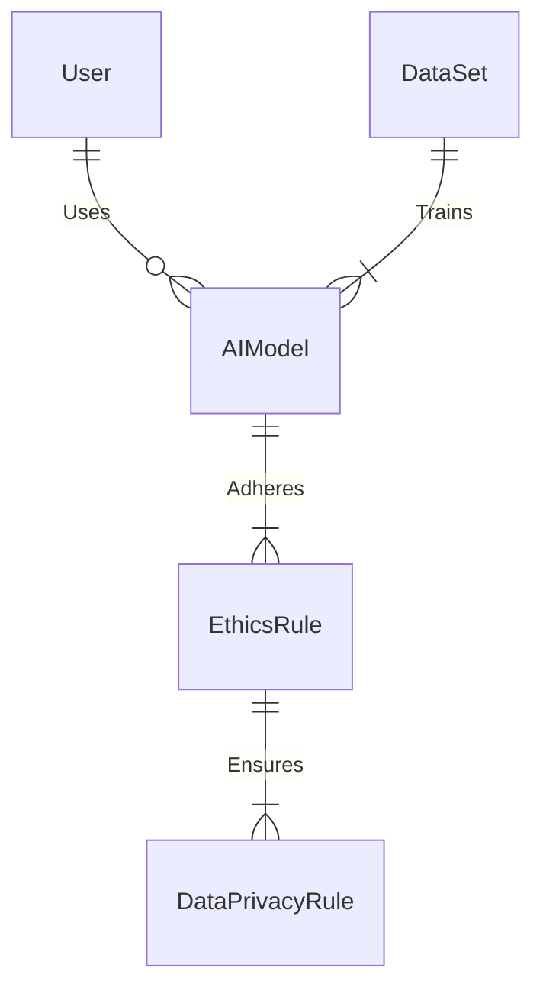

                 

# 构建企业级AI伦理框架：确保负责任的AI应用

关键词：AI伦理、企业级AI、伦理框架、偏见、透明性、责任归属、数据隐私

摘要：随着人工智能技术的广泛应用，AI伦理问题愈发突出。本文旨在构建一个企业级的AI伦理框架，通过分析偏见、透明性、责任归属和数据隐私等核心概念，探讨如何确保AI应用的负责任性和公平性。

## 第1章 引言与背景

### 1.1 问题背景

人工智能（AI）作为当今科技领域的前沿，正在以惊人的速度发展。从语音识别、图像识别到自动驾驶、智能医疗，AI技术已经深刻地改变了我们的生活方式。然而，随着AI技术的广泛应用，AI伦理问题也逐渐浮现。这些问题不仅关乎技术本身，还涉及到社会、法律、经济等多个方面。

### 1.2 问题描述

AI伦理问题主要包括以下几个方面：

1. **偏见**：AI模型可能会因为训练数据的不公平或偏见而产生偏见。
2. **透明性**：AI模型的决策过程通常是不透明的，这可能导致用户对AI的信任度降低。
3. **责任归属**：当AI系统发生错误时，责任归属问题变得复杂。
4. **数据隐私**：AI系统需要处理大量的用户数据，如何保护这些数据的安全和隐私成为一个重要问题。

### 1.3 问题解决

为了解决上述问题，我们需要构建一个企业级的AI伦理框架，确保AI应用的负责任。这个框架应该包括以下几个方面：

1. **偏见检测与消除**：通过数据预处理、模型训练等技术手段，确保AI模型不会产生偏见。
2. **透明性设计**：设计透明的AI模型，使得用户可以理解AI的决策过程。
3. **责任归属机制**：建立明确的责任归属机制，确保在AI系统发生错误时，责任可以明确划分。
4. **数据隐私保护**：采用加密、去标识化等技术手段，保护用户数据的安全和隐私。

### 1.4 边界与外延

AI伦理框架不仅适用于AI系统开发，还适用于AI系统的部署、维护和更新等环节。此外，AI伦理框架还需要与法律法规、社会道德等多个方面相结合，形成一套完整的体系。

### 1.5 概念结构与核心要素组成

AI伦理框架的核心概念包括：偏见、透明性、责任归属、数据隐私。这些概念相互关联，共同构成了AI伦理框架的基本结构。

## 第2章 核心概念与联系

### 2.1 AI伦理的核心概念

#### 2.1.1 偏见

偏见是指AI模型对某些特定群体或个体产生的歧视或不公平待遇。偏见可能来源于训练数据的不公平、算法的设计缺陷或数据预处理过程中的问题。

#### 2.1.2 透明性

透明性是指AI模型的决策过程是否可以被理解和解释。一个透明的AI模型可以让用户清楚地了解AI的决策逻辑，从而增加用户对AI的信任。

#### 2.1.3 责任归属

责任归属是指当AI系统发生错误时，责任应该由谁承担。责任归属问题涉及到法律、道德等多个方面，需要建立一个明确的机制。

#### 2.1.4 数据隐私

数据隐私是指用户数据在AI系统中的应用和处理过程中，如何保护用户的数据安全和隐私。

### 2.2 概念属性特征对比表格

| 特征         | 偏见                     | 透明性                   | 责任归属          | 数据隐私         |
| ------------ | ------------------------ | ------------------------ | ---------------- | ---------------- |
| 定义         | 对特定群体的不公平待遇   | AI决策过程是否可解释     | 责任承担主体      | 用户数据保护措施  |
| 影响因素     | 训练数据、算法设计、数据预处理 | 算法设计、数据预处理、用户界面 | 法律法规、伦理道德 | 加密、去标识化等技术 |
| 解决方法     | 数据预处理、算法调整       | 透明性设计、可视化工具   | 法律法规、伦理准则 | 加密、匿名化等技术 |
| 对AI应用的影响 | 影响模型的公平性和公正性   | 影响用户的信任度和接受度   | 影响法律诉讼和道德评价 | 影响用户隐私安全   |

### 2.3 AI伦理框架的ER实体关系图架构

#### 2.3.1 ER图

#### 2.3.2 解释

在ER图中，用户是AI系统的使用主体，AI模型是AI伦理框架的核心，数据集是AI模型的训练数据，伦理规则是AI模型运行的基本准则。用户使用AI模型，AI模型依赖于数据集进行训练，并遵循伦理规则，伦理规则确保数据隐私得到保护。

## 第3章 AI伦理框架的设计与实现

### 3.1 AI伦理框架的构建步骤

#### 3.1.1 明确目标

首先，我们需要明确构建AI伦理框架的目标。这个目标应该涵盖偏见检测与消除、透明性设计、责任归属机制和数据隐私保护等方面。

#### 3.1.2 确定核心要素

核心要素包括偏见、透明性、责任归属和数据隐私。我们需要对每个核心要素进行详细分析和研究，确定其具体内容和实现方法。

#### 3.1.3 制定伦理规则

基于核心要素，我们需要制定一系列的伦理规则，这些规则将指导AI系统的设计和运行。例如，我们可以制定关于偏见检测和消除的规则，关于透明性设计的规则，关于责任归属的规则，以及关于数据隐私保护的规则。

#### 3.1.4 实现技术手段

为了确保AI伦理框架的有效实施，我们需要采用一系列技术手段。例如，我们可以使用数据预处理技术来消除偏见，使用可视化工具来提升透明性，使用法律法规来明确责任归属，使用加密和去标识化技术来保护数据隐私。

#### 3.1.5 验证与优化

在AI伦理框架实施后，我们需要对其进行验证和优化。验证的目的是确保框架的有效性和可行性，优化的目的是提高框架的性能和适应性。

### 3.2 偏见检测与消除

#### 3.2.1 数据预处理

在构建AI伦理框架时，数据预处理是消除偏见的关键步骤。我们需要对数据进行清洗、归一化和特征提取，以消除潜在的不公平和偏见。

#### 3.2.2 模型训练

在模型训练过程中，我们可以采用一些技术手段来检测和消除偏见。例如，我们可以使用交叉验证技术来检测模型的偏见，使用对抗性样本技术来增强模型的鲁棒性。

#### 3.2.3 模型评估

在模型评估过程中，我们需要关注模型的公平性和公正性。我们可以使用一些评估指标，如公平性指标、偏见指标等，来评估模型的偏见程度。

### 3.3 透明性设计

#### 3.3.1 可视化工具

为了提高AI模型的透明性，我们可以使用可视化工具来展示模型的决策过程。例如，我们可以使用决策树、神经网络结构等可视化工具来展示模型的内部结构和决策过程。

#### 3.3.2 可解释性API

为了方便用户理解和解释AI模型的决策过程，我们可以开发可解释性API。这些API将提供详细的模型解释，包括决策逻辑、参数设置等。

### 3.4 责任归属机制

#### 3.4.1 法律法规

在构建AI伦理框架时，我们需要考虑法律法规的约束。例如，我们可以参考《欧盟通用数据保护条例》（GDPR）等法律法规，确保AI系统的责任归属明确。

#### 3.4.2 伦理准则

除了法律法规，我们还需要制定一些伦理准则来指导AI系统的设计和运行。这些准则将确保AI系统的责任归属明确，并促进社会道德和伦理价值观的实现。

### 3.5 数据隐私保护

#### 3.5.1 加密技术

为了保护用户数据的安全和隐私，我们可以采用加密技术。例如，我们可以使用对称加密和非对称加密技术来保护数据的机密性。

#### 3.5.2 去标识化技术

为了进一步保护用户数据的隐私，我们可以采用去标识化技术。例如，我们可以使用匿名化、去个性化等技术来去除数据中的个人标识信息。

### 3.6 AI伦理框架的实施与验证

#### 3.6.1 实施步骤

在AI伦理框架实施过程中，我们需要遵循以下步骤：

1. 制定详细的实施计划。
2. 配置必要的技术和资源。
3. 对AI系统的各个组件进行测试和验证。

#### 3.6.2 验证方法

为了验证AI伦理框架的有效性，我们可以采用以下方法：

1. **模型测试**：使用测试数据集对AI模型进行测试，评估模型的偏见、透明性和责任归属。
2. **用户反馈**：收集用户对AI系统的反馈，了解用户对AI伦理框架的接受程度和满意度。
3. **法律法规合规性检查**：确保AI系统的设计和运行符合相关法律法规的要求。

### 3.7 案例分析

#### 3.7.1 案例背景

以某智能招聘系统为例，该系统使用AI技术对求职者进行评估和匹配。然而，由于训练数据的不公平，该系统对某些性别、种族等产生了偏见。

#### 3.7.2 问题分析

1. **偏见**：该系统的偏见主要来源于训练数据的不公平。
2. **透明性**：用户无法清楚地了解AI系统的决策过程。
3. **责任归属**：当AI系统发生错误时，责任归属不明确。
4. **数据隐私**：用户数据的安全和隐私无法得到充分保障。

#### 3.7.3 解决方案

1. **偏见检测与消除**：对训练数据进行预处理，消除潜在的不公平和偏见。
2. **透明性设计**：使用可视化工具和可解释性API，提高系统的透明性。
3. **责任归属机制**：建立明确的责任归属机制，确保在AI系统发生错误时，责任可以明确划分。
4. **数据隐私保护**：采用加密和去标识化技术，保护用户数据的安全和隐私。

#### 3.7.4 效果评估

通过上述解决方案，该智能招聘系统的偏见程度明显降低，用户对系统的信任度提高，系统的责任归属更加明确，用户数据的隐私保护得到加强。

### 3.8 最佳实践

1. **数据采集与处理**：在采集和处理数据时，要注重数据的多样性和代表性，避免数据偏见。
2. **透明性设计**：在设计AI系统时，要充分考虑透明性，使用户可以清楚地了解AI的决策过程。
3. **责任归属机制**：在设计和运行AI系统时，要建立明确的责任归属机制，确保在AI系统发生错误时，责任可以明确划分。
4. **数据隐私保护**：在处理用户数据时，要采用先进的加密和去标识化技术，保护用户数据的隐私和安全。

### 第4章 小结与展望

本文构建了一个企业级的AI伦理框架，通过分析偏见、透明性、责任归属和数据隐私等核心概念，探讨了如何确保AI应用的负责任性和公平性。在未来的研究和实践中，我们还需要进一步优化和完善AI伦理框架，探索更多的技术手段和解决方案，以应对不断变化和发展的AI伦理问题。

### 作者信息

作者：AI天才研究院/AI Genius Institute & 禅与计算机程序设计艺术 /Zen And The Art of Computer Programming

---

以上是根据您提供的目录大纲撰写的文章。每个章节都包含了详细的内容和深入的分析，旨在构建一个全面、系统的AI伦理框架。如果您有任何修改意见或需要进一步的补充，请随时告诉我。

