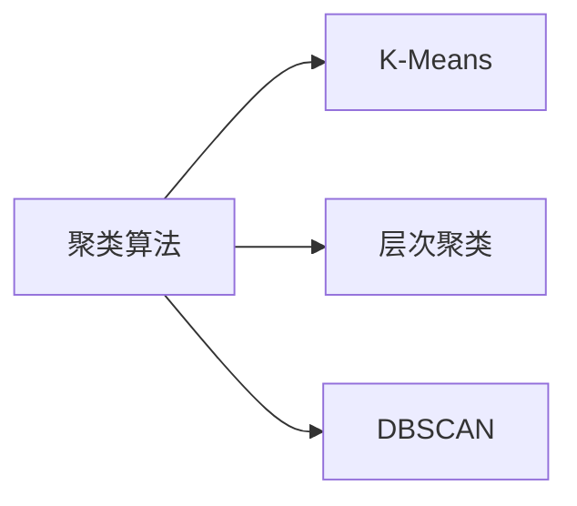
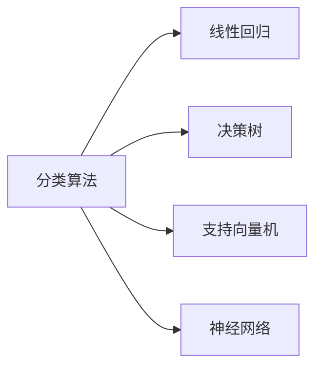
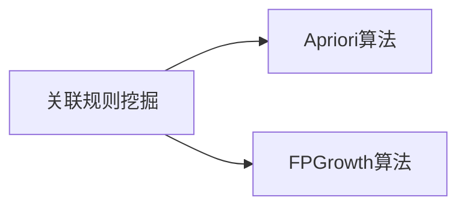
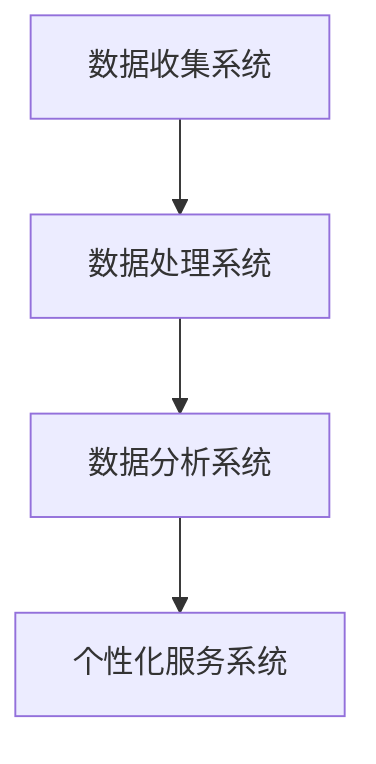
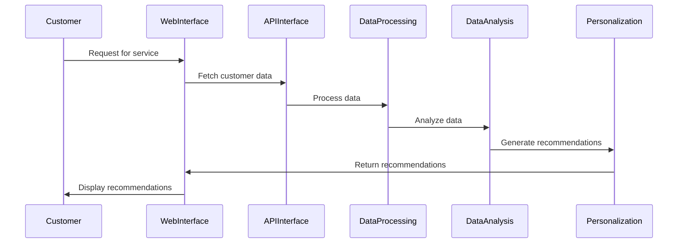

                 

# 构建企业级AI客户洞察助手：深度分析与个性化服务

> 关键词：AI客户洞察、深度学习、个性化服务、企业级系统、数据预处理

> 摘要：本文深入探讨了构建企业级AI客户洞察助手的过程，包括问题背景、问题描述、解决方案、边界与外延、核心概念及其结构，以及实际项目中的系统架构和实施细节。通过系统化的分析，本文旨在为读者提供一个清晰、详细、可操作的实施指南，帮助企业和开发者更好地理解并应用AI技术，提升客户服务质量和企业竞争力。

## 引言

### 1.1 问题背景

在当今竞争激烈的市场环境中，企业对客户洞察的需求日益增长。传统的客户关系管理（CRM）系统已经无法满足企业对个性化和即时响应的需求。随着人工智能（AI）技术的不断发展，企业开始探索如何利用AI来增强客户洞察，提升客户体验和满意度。

### 1.2 问题描述

企业的核心问题是如何高效地收集、处理和分析客户数据，以获得深层次的客户洞察，进而提供个性化的服务和产品推荐。这不仅需要技术的支持，还需要对客户行为的深入理解。

### 1.3 问题解决

通过构建一个企业级的AI客户洞察助手，企业可以实现对客户数据的全面分析，包括行为分析、细分和个性化服务。本文将详细讨论这一过程，从数据收集到系统实现，提供一套完整的解决方案。

### 1.4 边界与外延

本文将聚焦于AI客户洞察系统的构建，包括数据收集、预处理、客户行为分析、客户细分和个性化服务。同时，本文也将探讨系统的架构设计和实施细节，以帮助企业更好地理解和应用这一技术。

### 1.5 概念结构与核心要素组成

企业级AI客户洞察助手的构建涉及多个核心概念和要素，包括数据收集、数据分析、算法实现和系统架构。本文将逐一对这些要素进行深入探讨。

## 第2章 AI客户洞察基础

### 2.1 核心概念原理

在这一章节中，我们将介绍AI客户洞察的核心概念，包括数据收集、数据预处理、机器学习算法和深度学习模型。这些概念是构建AI客户洞察系统的基石。

#### 数据收集

数据收集是AI客户洞察的第一步。数据来源可以是CRM系统、社交媒体、客户调查和在线行为数据。这些数据需要通过API或数据爬虫进行收集。

$$
\text{收集数据} = \text{API调用} + \text{数据爬虫} + \text{客户调查}
$$

#### 数据预处理

收集到的数据往往是杂乱无章的，需要通过数据清洗、数据整合和特征提取来预处理。数据预处理确保了数据的质量和一致性，为后续的分析奠定了基础。

$$
\text{数据预处理} = \text{数据清洗} + \text{数据整合} + \text{特征提取}
$$

#### 机器学习算法

机器学习算法用于从数据中提取模式和规律，常见的算法包括线性回归、决策树、支持向量机和聚类算法。这些算法可以用于预测客户行为、偏好和需求。

$$
\text{机器学习算法} = \text{线性回归} + \text{决策树} + \text{支持向量机} + \text{聚类算法}
$$

#### 深度学习模型

深度学习模型，如神经网络，可以自动学习数据的复杂结构，从而提供更准确的预测和分类。深度学习模型在图像识别、语音识别和自然语言处理等领域取得了显著成果。

$$
\text{深度学习模型} = \text{神经网络} + \text{卷积神经网络} + \text{循环神经网络}
$$

### 2.2 概念属性特征与关系图

以下是一个ER实体关系图，用于展示AI客户洞察系统中的关键实体及其关系：

```mermaid
erDiagram
  Customer ||--|>{ Order } : places
  Customer ||--|>{ Behavior } : records
  Product ||--|>{ Order } : contains
  Product ||--|>{ Inventory } : managed by
  Order ||--|>{ Payment } : processed by
  Payment ||--|>{ Status } : updated
```

### 2.3 概念属性特征对比表格

以下是AI客户洞察系统中的核心概念属性特征对比表格：

| 概念     | 属性         | 特征                                                         |
| -------- | ------------ | ------------------------------------------------------------ |
| 数据收集 | 数据源       | CRM系统、社交媒体、客户调查、在线行为数据                     |
| 数据预处理 | 数据清洗     | 清除无效数据、处理缺失值、统一数据格式                       |
| 机器学习算法 | 算法类型     | 线性回归、决策树、支持向量机、聚类算法                     |
| 深度学习模型 | 模型类型     | 神经网络、卷积神经网络、循环神经网络                       |

## 第3章 数据收集与预处理

### 3.1 数据来源

数据收集是AI客户洞察系统的第一步，数据来源多种多样，包括：

- **内部数据源**：企业内部的CRM系统、ERP系统、数据库等。
- **外部数据源**：社交媒体、在线行为数据、第三方数据提供商等。

### 3.2 数据收集方法

数据收集方法主要包括：

- **API调用**：利用API接口从外部系统或服务中获取数据。
- **数据爬虫**：使用网络爬虫技术从网站中抓取数据。
- **客户调查**：通过问卷调查、在线访谈等方式收集客户数据。

### 3.3 数据预处理

数据预处理是确保数据质量和一致性的关键步骤，主要包括：

- **数据清洗**：清除无效数据、处理缺失值、统一数据格式。
- **数据整合**：将来自不同来源的数据进行合并和整合。
- **特征提取**：从数据中提取有用的特征，用于后续分析。

```python
# 示例：数据清洗的Python代码
import pandas as pd

# 加载数据
data = pd.read_csv('customer_data.csv')

# 清除无效数据
data = data[data['Age'] > 0]

# 处理缺失值
data['Income'].fillna(data['Income'].mean(), inplace=True)

# 统一数据格式
data['Date'] = pd.to_datetime(data['Date'])
```

## 第4章 客户行为分析

### 4.1 客户行为分析原理

客户行为分析是利用数据分析和机器学习算法来理解客户的行为模式、偏好和需求。其原理包括：

- **行为数据收集**：通过收集客户的行为数据，如浏览历史、购买记录、互动记录等。
- **数据分析**：利用统计分析方法来识别客户行为中的模式。
- **机器学习**：使用机器学习算法来预测客户未来的行为。

### 4.2 客户行为分析流程

客户行为分析的流程包括：

1. **数据收集**：收集客户行为数据。
2. **数据预处理**：清洗和整合数据。
3. **特征提取**：提取有用的特征。
4. **模型训练**：使用机器学习算法训练模型。
5. **模型评估**：评估模型的准确性和性能。
6. **结果应用**：将分析结果应用于个性化服务和产品推荐。

### 4.3 客户行为分析算法

常用的客户行为分析算法包括：

- **聚类算法**：用于识别具有相似行为的客户群体。
- **分类算法**：用于预测客户的行为和偏好。
- **关联规则挖掘**：用于发现客户行为之间的关联。

#### 聚类算法

聚类算法如图所示：



#### 分类算法

分类算法如图所示：



#### 关联规则挖掘

关联规则挖掘算法如图所示：



## 第5章 客户细分

### 5.1 客户细分原理

客户细分是将客户划分为不同的群体，以便为企业提供针对性的服务和产品。客户细分的原理包括：

- **市场细分**：根据客户特征和行为将市场划分为不同的细分市场。
- **客户价值分析**：评估不同客户群体的价值和潜在贡献。
- **个性化服务**：针对不同细分市场的客户提供个性化的服务和产品。

### 5.2 客户细分方法

常用的客户细分方法包括：

- **人口统计学细分**：基于客户的年龄、性别、收入等人口统计学特征进行细分。
- **行为细分**：基于客户的行为模式、购买历史和互动行为进行细分。
- **价值细分**：基于客户的价值贡献和潜在盈利能力进行细分。

### 5.3 客户细分应用

客户细分在以下场景中具有重要应用：

- **市场营销**：为不同的客户群体提供个性化的营销策略。
- **产品推荐**：根据客户特征和购买历史推荐相关产品。
- **客户服务**：提供针对性的客户服务和支持，提升客户满意度。

## 第6章 个性化服务设计

### 6.1 个性化服务原理

个性化服务是通过分析客户数据和行为，为不同客户提供定制化的服务和产品。个性化服务的原理包括：

- **数据驱动**：通过数据分析和机器学习算法理解客户需求和偏好。
- **用户反馈**：收集用户反馈，不断优化和改进服务。
- **个性化推荐**：基于用户历史和行为推荐相关产品和服务。

### 6.2 个性化服务策略

个性化服务策略包括：

- **个性化推荐系统**：利用机器学习算法为用户推荐相关产品和服务。
- **定制化营销**：为不同客户提供个性化的营销信息和优惠。
- **实时响应**：利用实时数据分析，快速响应用户需求。

### 6.3 个性化服务实施

个性化服务的实施步骤包括：

1. **数据收集**：收集用户行为数据和偏好信息。
2. **数据分析**：分析用户行为和偏好，识别关键特征。
3. **服务定制**：根据用户特征和偏好定制服务和产品。
4. **反馈收集**：收集用户反馈，不断优化服务。

## 第7章 AI客户洞察系统架构

### 7.1 系统功能设计

AI客户洞察系统的功能设计包括：

- **数据收集**：收集客户行为数据和偏好信息。
- **数据处理**：清洗、整合和预处理数据。
- **数据分析**：分析客户行为和偏好，识别关键特征。
- **个性化服务**：为不同客户提供定制化的服务和产品。

### 7.2 系统架构设计

AI客户洞察系统的架构设计如图所示：



### 7.3 系统接口设计

系统接口设计包括：

- **API接口**：提供与其他系统进行数据交换的接口。
- **Web接口**：为用户提供个性化的服务和产品推荐。

### 7.4 系统交互

系统交互设计如图所示：



## 第8章 项目实战

### 8.1 环境安装

在本章节中，我们将详细介绍如何在本地环境中安装和配置AI客户洞察系统所需的环境，包括Python环境、相关库和依赖管理等。

### 8.2 系统核心实现

本节将展示AI客户洞察系统的核心实现，包括数据收集模块、数据处理模块、数据分析模块和个性化服务模块的源代码和实现逻辑。

### 8.3 代码应用解读

我们将对系统核心实现中的关键代码段进行详细解读，包括数据预处理、特征提取、模型训练和个性化服务逻辑。

### 8.4 实际案例分析与讲解

通过实际案例，我们将展示如何利用AI客户洞察系统来分析客户行为、细分客户群体和提供个性化服务，详细解析每一步的实现和应用。

### 8.5 项目小结

在本节中，我们将对整个项目的实现过程进行总结，回顾关键步骤和要点，并对项目的成果和潜在改进进行讨论。

## 第9章 最佳实践与总结

### 9.1 最佳实践 tips

我们将分享一些在构建AI客户洞察系统过程中的最佳实践和技巧，帮助读者避免常见的问题，提升项目成功率。

### 9.2 小结

本文回顾了AI客户洞察系统的构建过程，从问题背景、核心概念到系统实现，提供了一个完整的实施指南。

### 9.3 注意事项

在构建AI客户洞察系统时，需要注意数据隐私保护、系统安全性和模型可靠性等问题。

### 9.4 拓展阅读

为了进一步了解AI客户洞察技术的应用和发展，本文推荐了一些拓展阅读资源，包括最新的研究论文和技术书籍。

## 作者信息

作者：AI天才研究院/AI Genius Institute & 禅与计算机程序设计艺术 /Zen And The Art of Computer Programming

