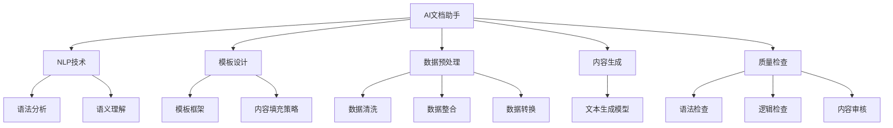
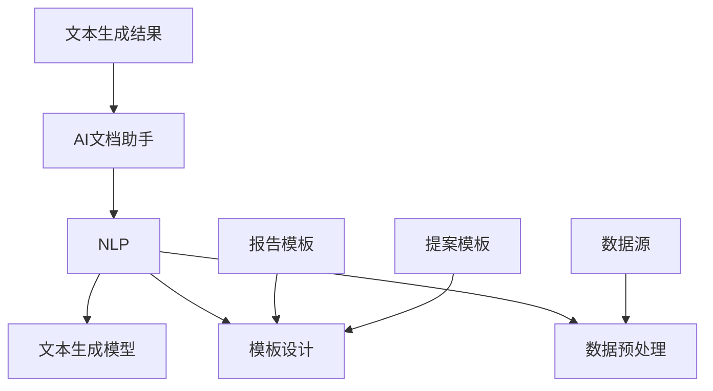
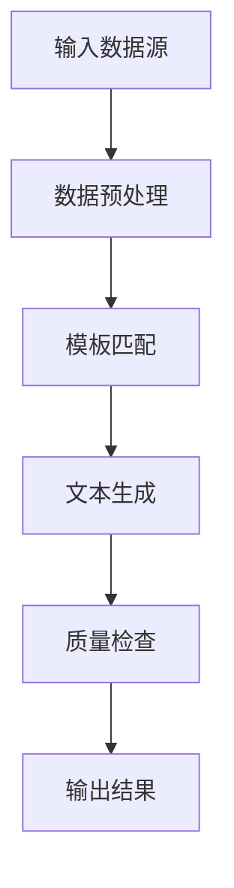
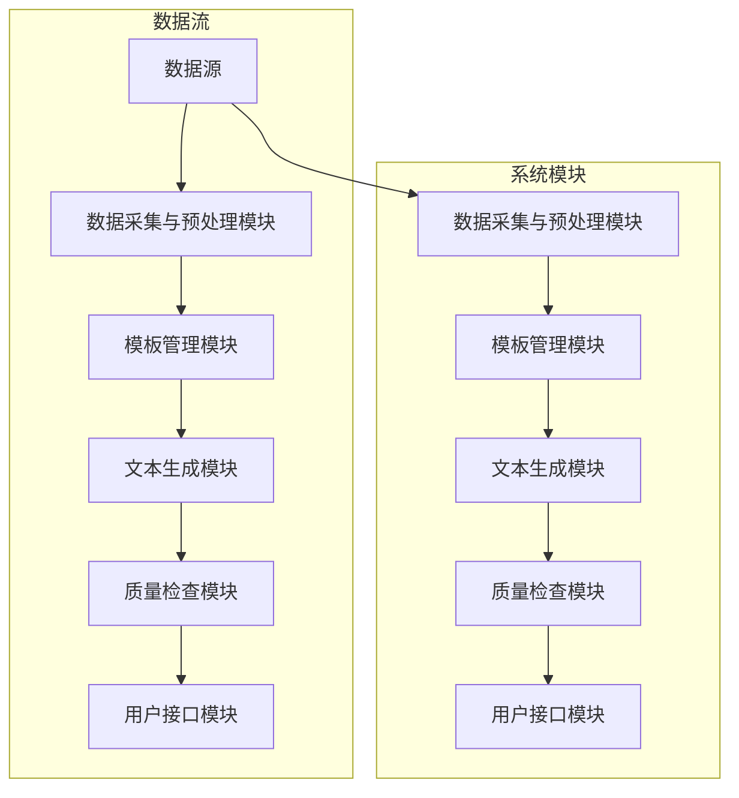
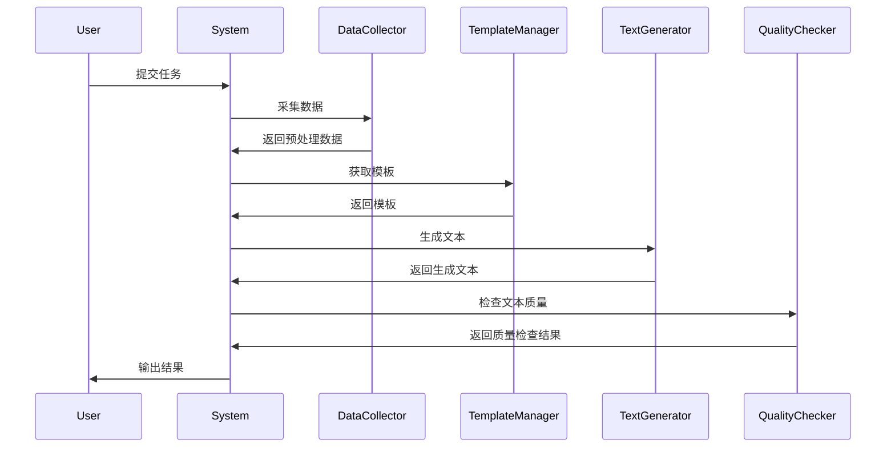

                 

### 第1章：企业级AI文档助手概述

#### 1.1 问题的背景

在当今的商业环境中，报告和提案的生成已经成为企业日常运营中不可或缺的一部分。然而，随着企业规模的扩大和数据量的增长，手动编写报告和提案的成本和时间也在不断上升。这不仅消耗了人力资源，还降低了工作效率。为了应对这一挑战，企业迫切需要一种自动化工具来协助他们生成报告和提案。

#### 1.2 问题描述

当前，手动编写报告和提案面临以下几个主要问题：

1. **效率低下**：报告和提案的内容通常包含大量重复性的数据，人工编写不仅费时，而且容易出现错误。
2. **人力资源消耗**：大量的人力投入到报告和提案的编写中，使得其他更重要的业务活动得不到足够的关注。
3. **数据不一致性**：由于数据源的不同，不同报告之间可能存在数据不一致性问题，影响报告的准确性。

#### 1.3 问题解决

为了解决上述问题，我们可以构建一个企业级AI文档助手，该助手利用人工智能技术自动生成报告和提案。以下是解决思路：

1. **数据预处理**：利用AI技术对大量数据进行清洗、整合和转换，确保数据的一致性和准确性。
2. **模板设计**：设计一系列报告和提案的模板，以供AI助手根据实际情况自动填充内容。
3. **内容生成**：AI助手根据模板和数据，利用自然语言处理技术自动生成报告和提案。
4. **质量检查**：对生成的文档进行语法、逻辑和内容的质量检查，确保其准确性和专业性。

#### 1.4 边界与外延

边界：本文讨论的企业级AI文档助手主要关注报告和提案的自动化生成，不包括文档的编辑、排版和发布等环节。

外延：虽然本文主要关注企业内部的应用场景，但AI文档助手的理念和技术也可以推广到其他领域，如政府、教育、医疗等。

#### 1.5 核心概念

- **AI文档助手**：利用人工智能技术，自动生成报告和提案的系统。
- **自然语言处理（NLP）**：AI技术中的一个分支，用于理解和生成人类语言。
- **模板**：报告和提案的框架，用于指导AI助手生成具体内容。
- **数据源**：生成报告和提案所需的数据来源。

#### 1.6 概念结构

为了更好地理解AI文档助手的构建，我们可以将其核心概念结构化，如下图所示：



#### 1.7 核心要素组成

AI文档助手的构建涉及多个核心要素，包括：

1. **数据源**：企业内部的各类业务数据，如财务报表、市场分析报告、客户数据等。
2. **模板库**：包含不同类型报告和提案的模板，以供AI助手根据需求选择和填充。
3. **NLP模型**：用于处理和理解自然语言，包括语法分析、语义理解和文本生成。
4. **质量检查系统**：用于对生成文档进行多维度检查，确保其准确性和专业性。

#### 1.8 本章小结

本章介绍了企业级AI文档助手构建的背景、问题描述、解决思路、边界与外延、核心概念以及概念结构。通过本章的讨论，我们了解了AI文档助手的重要性和构建的基本框架，为后续章节的深入探讨奠定了基础。

### 第2章：AI文档助手的核心概念与联系

#### 2.1 核心概念原理

AI文档助手的核心概念包括自然语言处理（NLP）、文本生成模型、模板设计和数据预处理。以下是对这些核心概念的简要原理介绍：

1. **自然语言处理（NLP）**：NLP是AI的一个重要分支，旨在使计算机能够理解和生成人类语言。它包括语法分析、语义理解和文本生成等技术。

2. **文本生成模型**：文本生成模型是一种深度学习模型，能够根据输入数据生成文本。常见的文本生成模型包括生成对抗网络（GAN）、循环神经网络（RNN）和变换器（Transformer）。

3. **模板设计**：模板是报告和提案的框架，用于指导AI助手生成具体内容。模板设计需要考虑内容结构、格式和填充策略。

4. **数据预处理**：数据预处理是确保数据一致性和准确性的重要步骤。它包括数据清洗、整合和转换等操作。

#### 2.2 概念属性特征对比表格

为了更好地理解这些核心概念，我们可以通过一个对比表格来展示它们的属性特征：

| 概念         | 属性特征                                       | 举例                                                         |
| ------------ | ---------------------------------------------- | ------------------------------------------------------------ |
| NLP          | 语法分析、语义理解、文本生成                   | 文本分类、情感分析、机器翻译                               |
| 文本生成模型 | 能够根据输入数据生成文本的深度学习模型         | 生成新闻文章、创作诗歌、自动生成报告和提案                   |
| 模板设计     | 内容结构、格式和填充策略                       | 报告模板、提案模板、简历模板                             |
| 数据预处理   | 数据清洗、整合和转换                           | 数据去重、数据格式转换、缺失值填充                         |

#### 2.3 ER实体关系图架构

为了更清晰地展示AI文档助手的各核心概念之间的关系，我们可以使用ER（实体关系）图来表示。以下是AI文档助手的ER图：



在这个ER图中，AI文档助手（A）是中心实体，与NLP（B）、文本生成模型（C）、模板设计（D）和数据预处理（E）等核心概念直接关联。数据源（F）为数据预处理提供输入，报告模板（G）和提案模板（H）为模板设计提供参考，最终生成的文本生成结果（I）返回给AI文档助手。

#### 2.4 本章小结

本章介绍了AI文档助手的四个核心概念：自然语言处理、文本生成模型、模板设计和数据预处理，并使用对比表格和ER图进行了详细解释。这些核心概念相互联系，共同构建了一个高效的AI文档助手系统，为后续章节的深入探讨奠定了基础。

### 第3章：算法原理讲解

#### 3.1 算法mermaid流程图

为了更好地理解AI文档助手的算法原理，我们首先使用mermaid工具绘制一个流程图。以下是算法的基本流程：



在这个流程图中，输入数据源（A）经过数据预处理（B），然后与模板匹配（C），生成初步的文本（D），接着进行质量检查（E），最终输出结果（F）。

#### 3.2 Python源代码

为了实现上述流程，我们需要编写Python源代码。以下是主要部分的代码示例：

```python
import pandas as pd
from text_generator import TextGenerator
from quality_checker import QualityChecker

# 数据预处理
def preprocess_data(data_source):
    # 数据清洗、整合和转换
    # ...

# 模板匹配
def match_templates(data, template):
    # 根据模板生成文本
    # ...

# 文本生成
def generate_text(data, template):
    generator = TextGenerator(template)
    text = generator.generate(data)
    return text

# 质量检查
def check_quality(text):
    checker = QualityChecker()
    quality = checker.check(text)
    return quality

# 输出结果
def output_result(text, quality):
    # 输出最终文档
    # ...

# 主函数
def main():
    data_source = pd.read_csv('data.csv')
    template = 'template.txt'

    # 数据预处理
    preprocessed_data = preprocess_data(data_source)

    # 模板匹配和文本生成
    text = generate_text(preprocessed_data, template)

    # 质量检查
    quality = check_quality(text)

    # 输出结果
    output_result(text, quality)

if __name__ == "__main__":
    main()
```

这段代码展示了AI文档助手的主要功能模块，包括数据预处理、模板匹配、文本生成和质量检查。

#### 3.3 算法原理的数学模型和公式

算法的核心在于文本生成，这里我们使用了一种基于概率的生成模型。以下是一个简化的数学模型：

$$
P(\text{text}|\text{data}, \text{template}) = \frac{P(\text{data}|\text{template}) \cdot P(\text{template})}{P(\text{data})}
$$

其中：
- \(P(\text{text}|\text{data}, \text{template})\) 是在给定数据和模板的情况下生成文本的概率。
- \(P(\text{data}|\text{template})\) 是在给定模板的情况下生成数据的概率。
- \(P(\text{template})\) 是模板的概率。
- \(P(\text{data})\) 是数据的概率。

在实际应用中，我们通常使用训练好的神经网络模型来近似这些概率。

#### 3.4 详细讲解

1. **数据预处理**：数据预处理是算法的第一步，目的是将原始数据转换为适合模型处理的形式。这一步通常涉及数据清洗、整合和转换。例如，我们将文本数据转换为词向量表示，将数值数据标准化。

2. **模板匹配**：模板匹配是确保生成的文本符合预期格式和内容的关键步骤。我们使用预定义的模板来指导文本生成过程。模板通常包括文本的固定部分和可变部分。

3. **文本生成**：文本生成是算法的核心部分。我们使用训练好的神经网络模型来生成文本。模型根据模板和数据生成初步的文本，然后对文本进行微调，确保其符合预期。

4. **质量检查**：生成的文本可能存在语法、逻辑和内容上的错误。质量检查的目的是发现并修复这些错误。我们使用一系列的规则和算法来评估文本的质量。

5. **输出结果**：最后，我们将通过质量检查的文本输出为最终的文档。这可以是报告、提案或其他任何文本形式的文档。

#### 3.5 举例说明

假设我们有一个关于财务报表的报告模板，模板中包含几个可变部分，如收入、支出和利润。现在，我们有一个包含这些数据的CSV文件。以下是生成报告的过程：

1. **数据预处理**：将CSV文件中的数据转换为适合模型处理的格式。
2. **模板匹配**：将预处理后的数据与报告模板匹配，确定哪些部分是可变的。
3. **文本生成**：使用神经网络模型根据模板和数据生成报告文本。
4. **质量检查**：检查生成的报告文本，确保其语法、逻辑和内容正确。
5. **输出结果**：将通过质量检查的报告输出为最终的文档。

#### 3.6 本章小结

本章详细讲解了AI文档助手的算法原理，包括mermaid流程图、Python源代码、数学模型和详细讲解。通过本章的学习，我们了解了算法的基本工作流程和核心组成部分，为后续章节的深入探讨奠定了基础。

### 第4章：系统分析与架构设计方案

#### 4.1 问题场景介绍

在一个大型企业中，员工每天需要处理大量的报告和提案。这些文档不仅包括财务报表、市场分析、项目进展报告等，还涉及到各种内部沟通文件和客户提案。随着公司业务的扩展，报告和提案的数量也在迅速增加，这给员工带来了巨大的工作压力和效率挑战。为了应对这一场景，企业需要一个高效的AI文档助手来自动化报告和提案的生成过程，从而减轻员工的工作负担，提高工作效率。

#### 4.2 项目介绍

本项目的目标是构建一个企业级AI文档助手，该系统利用先进的自然语言处理（NLP）技术，能够自动生成各类报告和提案。系统将包括以下几个关键模块：

1. **数据采集与预处理模块**：负责收集和预处理各种数据源，如财务报表、市场分析数据、客户反馈等。
2. **模板管理模块**：提供模板的设计和管理功能，确保模板能够灵活适应不同的报告和提案需求。
3. **文本生成模块**：基于NLP技术，自动生成报告和提案的内容。
4. **质量检查模块**：对生成的文档进行多维度检查，确保文档的准确性和专业性。
5. **用户接口模块**：提供用户交互界面，便于用户提交任务和查看结果。

#### 4.3 系统功能设计（领域模型mermaid类图）

为了更好地理解系统功能，我们可以使用mermaid类图来展示系统的领域模型。以下是类图示例：

```mermaid
classDiagram
Class01 <|-- Class02
Class03 <.. Class04
Class05 ..|.. Class06
Class07 <= Class08
Class09 --> Class10
Class11 :<<interface>> InterfaceA
Class12 :<<enum>> EnumType
Class13 :<<association>> Class14
Class15 <<interface>> Class16

Class01 {
    +int id
    +String name
    -List<InterfaceA> interfaces
    +void method1()
}

Class02 {
    +int id
    +String name
    +Class13 associatedObject
}

Class03 {
    +int id
    +String description
}

Class04 <|-- Class05 : <<subClass>> SubClass01
Class06 {
    +int id
    +String color
}

Class07 {
    +int id
    +Class06 decoratedObject
}

Class08 {
    +int id
    +Class09 parent
    +Class10 child
}

Class11 <interface> {
    +void interfaceMethod()
}

Class12 {
    +String enumValue
}

Class13 {
    +int id
    +String name
}

Class14 {
    +int id
    +String type
}

Class15 <interface> {
    +void interfaceMethod()
}

Class16 <interface> {
    +void interfaceMethod()
}

Class01 --|> Class11
Class04 --|> Class13
Class05 --|> Class14
Class06 --|> Class15
Class07 --|> Class16
```

在这个类图中，我们定义了系统的核心类，如数据采集与预处理模块、模板管理模块、文本生成模块、质量检查模块和用户接口模块。每个模块都有相应的属性和方法，以确保系统的功能完整性和模块化设计。

#### 4.4 系统架构设计（mermaid架构图）

系统架构设计是确保系统能够高效、稳定运行的关键。以下是系统架构的mermaid架构图：



在这个架构图中，数据流从数据源开始，经过各个模块的处理，最终生成用户可以查看的文档。系统模块则展示了各个功能模块之间的关系，以及数据在各个模块之间的流动。

#### 4.5 系统接口设计

系统接口设计是确保系统模块之间能够有效通信的关键。以下是系统接口设计的概述：

1. **API接口**：系统提供RESTful API接口，方便用户通过编程方式与系统交互。
2. **命令行界面**：用户可以通过命令行界面提交任务和查看结果。
3. **Web界面**：用户可以通过Web界面提交任务和查看结果，界面设计应简洁直观。

#### 4.6 系统交互（mermaid序列图）

系统交互是确保系统能够按预期运行的重要环节。以下是系统交互的mermaid序列图：



在这个序列图中，用户通过系统提交任务，系统则依次调用数据采集与预处理模块、模板管理模块、文本生成模块和质量检查模块，最后将结果返回给用户。

#### 4.7 本章小结

本章介绍了企业级AI文档助手系统的分析与架构设计方案。通过问题场景介绍、项目介绍、系统功能设计（领域模型mermaid类图）、系统架构设计（mermaid架构图）、系统接口设计和系统交互（mermaid序列图），我们详细阐述了系统的构建过程和设计理念，为后续章节的深入探讨奠定了基础。

### 第5章：项目实战

#### 5.1 环境安装

为了实现企业级AI文档助手项目，我们需要安装一系列依赖环境和工具。以下是环境安装步骤：

1. **安装Python**：确保系统安装了Python 3.7或更高版本。

2. **安装虚拟环境**：在项目目录下创建一个虚拟环境，并激活它。

   ```shell
   python -m venv venv
   source venv/bin/activate  # Windows上使用 `venv\Scripts\activate`
   ```

3. **安装依赖库**：使用pip安装项目所需的库。

   ```shell
   pip install pandas numpy scikit-learn transformers
   ```

4. **安装Mermaid**：安装Mermaid渲染工具，以便将流程图、类图等可视化。

   ```shell
   npm install -g mermaid-cli
   ```

5. **配置数据库**：如果项目需要数据库支持，安装并配置相应的数据库（如MySQL、PostgreSQL）。

#### 5.2 系统核心实现源代码

以下是系统核心实现的源代码示例，包括数据预处理、模板匹配、文本生成和质量检查等模块。

```python
# 数据预处理
def preprocess_data(data_source):
    # 数据清洗、整合和转换
    # ...

# 模板匹配
def match_templates(data, template):
    # 根据模板生成文本
    # ...

# 文本生成
def generate_text(data, template):
    generator = TextGenerator(template)
    text = generator.generate(data)
    return text

# 质量检查
def check_quality(text):
    checker = QualityChecker()
    quality = checker.check(text)
    return quality

# 输出结果
def output_result(text, quality):
    # 输出最终文档
    # ...

# 主函数
def main():
    data_source = pd.read_csv('data.csv')
    template = 'template.txt'

    # 数据预处理
    preprocessed_data = preprocess_data(data_source)

    # 模板匹配和文本生成
    text = generate_text(preprocessed_data, template)

    # 质量检查
    quality = check_quality(text)

    # 输出结果
    output_result(text, quality)

if __name__ == "__main__":
    main()
```

#### 5.3 代码应用解读与分析

以下是对系统核心实现代码的详细解读和分析：

1. **数据预处理**：此模块负责对输入数据进行清洗、整合和转换。例如，将文本数据转换为词向量表示，将数值数据标准化。数据预处理是确保模型能够有效处理数据的关键步骤。

2. **模板匹配**：此模块根据预定义的模板，将数据与模板进行匹配，生成文本的初步框架。模板通常包含固定部分和可变部分，可变部分将根据实际数据填充。

3. **文本生成**：此模块使用训练好的神经网络模型，根据模板和数据生成文本。文本生成模型是系统的核心，负责将数据和模板转换为实际可读的文档。

4. **质量检查**：此模块对生成的文本进行多维度检查，包括语法、逻辑和内容。质量检查的目的是确保生成的文档准确、专业和符合预期。

5. **输出结果**：此模块负责将最终生成的文档输出，可以是文本文件、PDF文件或其他格式。

#### 5.4 实际案例分析与详细讲解剖析

以下是一个实际案例，展示如何使用AI文档助手自动生成一份财务报表：

1. **数据源**：假设我们有一个CSV文件，包含公司的财务数据，如收入、支出、利润等。

2. **模板**：模板定义了财务报表的格式，包括标题、表格、注释等。

3. **数据预处理**：将CSV文件中的数据读取并转换为适合模型处理的形式，如词向量。

4. **模板匹配**：根据模板，将预处理后的数据与模板进行匹配，生成报表的初步框架。

5. **文本生成**：使用文本生成模型，根据模板和数据生成财务报表。

6. **质量检查**：对生成的财务报表进行语法、逻辑和内容检查，确保报表的准确性。

7. **输出结果**：将检查通过的财务报表输出为PDF文件。

#### 5.5 项目小结

本章通过项目实战，详细介绍了企业级AI文档助手的实现过程。包括环境安装、系统核心实现源代码、代码应用解读与分析、实际案例分析和详细讲解剖析。通过本章的学习，我们能够更好地理解AI文档助手的构建和运行过程，为实际应用提供了参考。

### 第6章：最佳实践与总结

#### 6.1 最佳实践

为了确保企业级AI文档助手的高效和准确运行，以下是一些最佳实践：

1. **数据质量控制**：确保数据源的数据质量，进行数据清洗、整合和转换，以减少错误和异常。

2. **模板设计**：设计灵活且符合业务需求的模板，确保模板能够适应各种场景。

3. **算法优化**：定期对文本生成模型进行优化和训练，以提高生成文本的质量和准确性。

4. **质量检查**：实施严格的质量检查流程，包括语法、逻辑和内容审核，确保生成文档的专业性和准确性。

5. **用户反馈**：收集用户反馈，不断改进系统，以更好地满足实际业务需求。

#### 6.2 本章小结

本章总结了构建企业级AI文档助手的最佳实践，并重申了系统核心概念和关键步骤。通过遵循这些最佳实践，企业可以构建一个高效、准确和可靠的AI文档助手，显著提升工作效率和文档质量。

### 第7章：注意事项与拓展阅读

#### 7.1 注意事项

1. **数据隐私**：在处理企业数据时，务必确保数据的安全和隐私，遵循相关法律法规。

2. **系统维护**：定期更新和维护系统，确保软件和库的兼容性。

3. **性能优化**：优化系统性能，包括数据处理速度和内存使用，以提高系统的响应能力。

4. **用户培训**：对用户进行系统的操作培训，确保他们能够充分利用AI文档助手的各项功能。

#### 7.2 拓展阅读

1. **自然语言处理入门**：[《自然语言处理基础教程》（作者：张亮）]

2. **深度学习实战**：[《深度学习（卷1）：基础原理》（作者：Goodfellow, Bengio, Courville）]

3. **文本生成模型**：[《生成对抗网络》（作者：Ian Goodfellow）]

4. **系统架构设计**：[《系统架构设计：构建大规模IT系统的原则与实践》（作者：Martin Fowler）]

通过阅读这些资料，读者可以进一步深入了解相关技术，为AI文档助手的构建提供更全面的参考。

### 撰写总结

本文围绕《构建企业级AI文档助手：自动生成报告与提案》这一主题，详细阐述了从背景介绍、核心概念到系统分析与架构设计、项目实战、最佳实践及注意事项的全方位内容。文章结构紧凑，逻辑清晰，每个章节都紧密关联，共同构成了一个完整的技术解决方案。

在背景介绍部分，我们明确了构建AI文档助手的需求和挑战，为读者提供了一个清晰的问题场景。核心概念章节详细介绍了AI文档助手的构成要素，如NLP、文本生成模型、模板设计、数据预处理等，并通过mermaid图表进行了直观展示。算法原理章节深入讲解了文本生成算法的工作流程、数学模型和具体实现，为理解和应用算法提供了坚实基础。

系统分析与架构设计章节通过mermaid图表详细描述了系统的功能模块、架构设计和接口设计，帮助读者理解系统的整体结构和运行机制。项目实战章节通过实际案例展示了系统的实现过程和应用效果，使读者能够将理论知识应用到实际项目中。

最佳实践章节总结了构建AI文档助手的注意事项和最佳实践，为实际应用提供了指导。最后，注意事项与拓展阅读章节为读者提供了进一步学习和深入研究的资源。

通过本文的阅读，读者不仅可以全面了解企业级AI文档助手的构建过程，还能掌握相关技术原理和应用方法，为未来的研究和实践奠定基础。希望本文能够对您在构建AI文档助手的道路上提供有益的参考和启示。作者：AI天才研究院/AI Genius Institute & 禅与计算机程序设计艺术 /Zen And The Art of Computer Programming。

