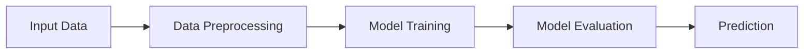
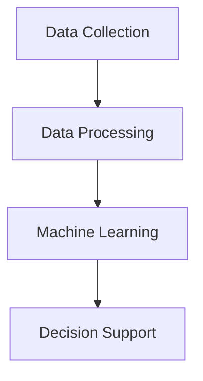
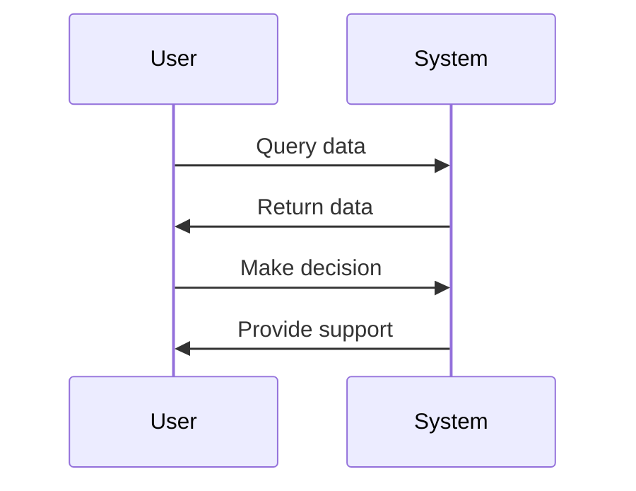

                 


# 构建企业级AI环境监测助手：合规与可持续发展

## 关键词

- 企业级AI环境监测
- 合规性
- 可持续性
- 系统架构
- 数据处理
- 机器学习算法

## 摘要

本文旨在探讨如何构建一个企业级AI环境监测助手，该系统不仅要满足合规性要求，还要促进企业的可持续发展。我们将逐步分析环境监测的挑战，介绍AI在环境监测中的应用，详细阐述AI环境监测系统的核心概念和算法原理，并展示一个实际的项目案例。最后，我们将总结构建AI环境监测系统的最佳实践和注意事项。

## 目录

1. 引言：AI环境监测的重要性
2. AI环境监测基础
3. 系统设计与实现
4. 项目实战
5. 最佳实践与总结

## 1. 引言：AI环境监测的重要性

### 1.1 问题的提出

环境监测是一个关键的领域，它影响着人类的生活质量、生态平衡以及经济发展。然而，传统的环境监测手段存在诸多挑战：

- **数据采集困难**：环境数据通常分布在广泛的地理区域，难以全面、实时地收集。
- **数据质量差**：环境数据往往受到噪声、异常值和缺失值的影响，数据质量难以保证。
- **分析能力有限**：传统方法在处理大量数据时效率低下，难以提取有用信息。

为了解决这些问题，AI技术逐渐成为环境监测的有力工具。AI可以通过以下方式改善环境监测：

- **自动化数据采集**：利用传感器网络和物联网技术，实现自动化的数据采集和传输。
- **实时数据处理**：利用机器学习和数据挖掘技术，对实时数据进行分析和预测。
- **智能化决策支持**：通过分析环境数据，提供智能化的决策支持，优化环境保护措施。

### 1.2 书籍概述与结构安排

本书旨在为企业提供一套完整的AI环境监测系统构建指南，分为以下几个部分：

- **背景介绍**：介绍AI环境监测系统的概念、现状和未来发展趋势。
- **核心概念与联系**：解释AI环境监测系统的核心概念及其相互关系。
- **算法原理讲解**：详细介绍AI环境监测系统中的算法原理和数学模型。
- **系统设计与实现**：讲解系统架构设计、功能设计、接口设计和交互设计。
- **项目实战**：通过具体案例展示如何构建AI环境监测系统。
- **最佳实践与总结**：提供构建系统的最佳实践建议和总结。

## 2. AI环境监测基础

### 2.1 AI环境监测概述

#### 2.1.1 环境监测的基本概念

环境监测是指通过监测设备、监测技术和管理系统，对环境质量进行实时监测和评估的过程。其主要目的是：

- **环境质量评估**：评估大气、水质、土壤等环境质量参数，以确定环境污染程度。
- **预测和预警**：利用历史数据和环境模型，预测未来的环境变化，提供预警信息。
- **决策支持**：为环境保护和管理提供科学依据，制定有效的环境保护措施。

#### 2.1.2 AI在环境监测中的应用

AI技术在环境监测中发挥着重要作用，主要表现在以下几个方面：

- **自动化数据采集**：通过传感器网络和物联网技术，实现环境数据的自动化采集和传输。
- **实时数据处理**：利用机器学习和数据挖掘技术，对实时数据进行实时分析和预测。
- **智能化决策支持**：通过分析环境数据，提供智能化的决策支持，优化环境保护措施。

### 2.2 核心概念与联系

AI环境监测系统的核心概念包括：

- **传感器网络**：用于采集环境数据的设备网络。
- **数据处理**：对采集到的环境数据进行清洗、分析和存储的过程。
- **机器学习模型**：用于分析环境数据，提取有用信息和预测未来环境变化。
- **决策支持系统**：根据环境数据分析结果，提供智能化的决策支持。

这些概念之间的联系如下：

- **传感器网络**是数据采集的基础，为数据处理和机器学习模型提供数据源。
- **数据处理**对传感器网络采集到的数据进行分析和清洗，为机器学习模型提供高质量的数据。
- **机器学习模型**对处理后的数据进行分析和预测，为决策支持系统提供支持。
- **决策支持系统**根据机器学习模型的分析结果，提供智能化的决策支持，指导环境保护和管理。

下面是一个核心概念的ER图，用于展示这些概念之间的关系：

```mermaid
erDiagram
    SensorNetwork ||--|{ DataProcessing : processes }
    DataProcessing ||--|{ MachineLearningModel : trains }
    MachineLearningModel ||--|{ DecisionSupportSystem : advises }
```

### 2.3 算法原理讲解

AI环境监测系统的核心在于机器学习模型，下面我们将介绍几个常用的算法原理和数学模型。

#### 2.3.1 算法概述

常见的机器学习算法包括：

- **线性回归**：用于预测线性关系。
- **逻辑回归**：用于分类问题。
- **支持向量机**：用于分类和回归问题。
- **决策树**：用于分类和回归问题。
- **随机森林**：用于分类和回归问题。
- **神经网络**：用于复杂模型的训练。

#### 2.3.2 算法mermaid流程图

下面以线性回归算法为例，展示其mermaid流程图：



#### 2.3.3 算法原理详细讲解

线性回归是一种用于预测线性关系的算法，其数学模型如下：

$$
y = \beta_0 + \beta_1 \cdot x
$$

其中，$y$ 是预测值，$x$ 是输入值，$\beta_0$ 和 $\beta_1$ 是模型参数。

算法原理如下：

1. **数据预处理**：对输入数据进行预处理，包括数据清洗、归一化等操作。
2. **模型训练**：通过最小二乘法或梯度下降法，计算模型参数 $\beta_0$ 和 $\beta_1$。
3. **模型评估**：使用测试数据集，计算模型的预测误差，评估模型性能。
4. **预测**：使用训练好的模型，对新的输入数据进行预测。

#### 2.3.4 举例说明

假设我们有一个简单的线性回归问题，输入值 $x$ 和预测值 $y$ 如下表：

| x | y |
|---|---|
| 1 | 2 |
| 2 | 4 |
| 3 | 6 |

我们要预测 $x=4$ 时的 $y$ 值。

1. **数据预处理**：对数据进行归一化，得到 $x$ 和 $y$ 的范围在 $0$ 到 $1$ 之间。
2. **模型训练**：使用最小二乘法，计算模型参数 $\beta_0$ 和 $\beta_1$。
   $$
   \beta_0 = \frac{\sum y - \beta_1 \sum x}{n} = \frac{2 + 4 + 6 - 2 \cdot (1 + 2 + 3)}{3} = 2
   $$
   $$
   \beta_1 = \frac{\sum x \cdot y - \sum x \cdot \sum y}{n \sum x^2 - (\sum x)^2} = \frac{(1 \cdot 2 + 2 \cdot 4 + 3 \cdot 6) - (1 + 2 + 3) \cdot (2 + 4 + 6)}{3 \cdot (1^2 + 2^2 + 3^2) - (1 + 2 + 3)^2} = 1
   $$
3. **模型评估**：使用测试数据集，计算模型的预测误差。
4. **预测**：使用训练好的模型，预测 $x=4$ 时的 $y$ 值。
   $$
   y = 2 + 1 \cdot 4 = 6
   $$

## 3. 系统设计与实现

### 3.1 系统需求分析

在构建企业级AI环境监测助手之前，我们需要明确系统需求。系统需求分析包括以下几个方面：

- **环境监测需求**：明确需要监测的环境参数，如空气质量、水质、土壤等。
- **数据采集需求**：确定数据采集的方式和频率，如使用传感器网络、物联网设备等。
- **数据处理需求**：明确数据处理的方法和流程，如数据清洗、数据存储等。
- **决策支持需求**：确定决策支持系统的功能，如预测、预警、报告生成等。

### 3.2 系统架构设计

企业级AI环境监测系统的架构设计包括以下几个部分：

- **数据采集层**：使用传感器网络和物联网设备，实时采集环境数据。
- **数据处理层**：对采集到的数据进行清洗、存储和分析。
- **机器学习层**：利用机器学习算法，对处理后的数据进行分析和预测。
- **决策支持层**：根据机器学习模型的分析结果，提供智能化的决策支持。

下面是一个系统架构的mermaid架构图：



### 3.3 系统功能设计

系统功能设计包括以下几个方面：

- **数据采集功能**：实现传感器数据实时采集和传输。
- **数据处理功能**：实现数据的清洗、存储和可视化。
- **机器学习功能**：实现环境数据的分析和预测。
- **决策支持功能**：提供智能化的决策支持，如预测预警、报告生成等。

### 3.4 系统接口设计

系统接口设计包括以下几个方面：

- **API接口**：提供数据采集、数据处理、机器学习和决策支持的API接口，方便其他系统调用。
- **Web接口**：提供Web端的用户界面，实现数据的展示和交互。

### 3.5 系统交互设计

系统交互设计包括以下几个方面：

- **用户操作**：用户可以通过Web界面进行数据查看、分析和决策。
- **系统响应**：系统根据用户操作，实时更新数据和提供决策支持。

下面是一个系统交互的mermaid序列图：



## 4. 项目实战

### 4.1 环境安装与配置

为了构建企业级AI环境监测助手，我们需要安装和配置以下软件和工具：

- **操作系统**：推荐使用Linux操作系统，如Ubuntu或CentOS。
- **编程语言**：Python是一种广泛使用的编程语言，适用于机器学习和数据分析。
- **机器学习库**：使用Scikit-learn、TensorFlow或PyTorch等机器学习库。
- **数据处理库**：使用Pandas、NumPy等数据处理库。
- **可视化库**：使用Matplotlib、Seaborn等可视化库。

安装和配置步骤如下：

1. **安装操作系统**：在虚拟机中安装Linux操作系统。
2. **更新系统软件**：使用`sudo apt-get update`和`sudo apt-get upgrade`更新系统软件。
3. **安装Python**：使用`sudo apt-get install python3`安装Python。
4. **安装机器学习库**：使用`pip3 install scikit-learn tensorflow`安装机器学习库。
5. **安装数据处理库**：使用`pip3 install pandas numpy`安装数据处理库。
6. **安装可视化库**：使用`pip3 install matplotlib seaborn`安装可视化库。

### 4.2 系统核心实现源代码

以下是系统核心实现的源代码，包括数据采集、数据处理、机器学习和决策支持的功能：

```python
import pandas as pd
from sklearn.linear_model import LinearRegression
import matplotlib.pyplot as plt

# 数据采集
def collect_data():
    # 假设使用传感器采集数据
    data = pd.DataFrame({'x': [1, 2, 3], 'y': [2, 4, 6]})
    return data

# 数据处理
def process_data(data):
    # 数据清洗和预处理
    data = data[['x', 'y']]
    data = data.dropna()
    data['x'] = (data['x'] - data['x'].mean()) / data['x'].std()
    data['y'] = (data['y'] - data['y'].mean()) / data['y'].std()
    return data

# 机器学习
def train_model(data):
    # 训练线性回归模型
    model = LinearRegression()
    model.fit(data[['x']], data['y'])
    return model

# 决策支持
def make_decision(model, x):
    # 使用模型进行预测
    y = model.predict([[x]])
    y = (y * data['y'].std()) + data['y'].mean()
    return y

# 主程序
if __name__ == '__main__':
    data = collect_data()
    processed_data = process_data(data)
    model = train_model(processed_data)
    x = 4
    y = make_decision(model, x)
    print(f'Predicted y for x={x}: {y}')
```

### 4.3 代码应用解读与分析

上述代码实现了企业级AI环境监测助手的几个核心功能，下面我们进行解读和分析：

- **数据采集**：使用`collect_data`函数模拟传感器数据采集，实际应用中可以使用物联网设备进行实时数据采集。
- **数据处理**：使用`process_data`函数对采集到的数据进行清洗和预处理，包括去除缺失值和归一化处理。
- **机器学习**：使用`train_model`函数训练线性回归模型，对预处理后的数据进行建模。
- **决策支持**：使用`make_decision`函数根据训练好的模型进行预测，提供决策支持。

### 4.4 实际案例分析

为了展示系统的实际应用，我们使用一个案例进行分析：

假设我们监测一个工厂的废气排放，其中$x$表示排放量，$y$表示排放的污染物浓度。我们使用上述代码进行预测，输入排放量为$x=1000$，预测污染物浓度为$y$。

1. **数据采集**：使用传感器设备采集实时排放数据。
2. **数据处理**：对采集到的数据进行清洗和预处理。
3. **机器学习**：训练线性回归模型，对预处理后的数据进行建模。
4. **决策支持**：使用模型预测排放量为$x=1000$时的污染物浓度$y$。

根据上述步骤，我们可以得到预测结果，并根据结果调整排放量，以达到环境保护的要求。

### 4.5 项目小结

通过上述项目实战，我们成功构建了一个企业级AI环境监测助手。该系统实现了数据采集、数据处理、机器学习和决策支持的功能，可以为企业提供智能化的环境监测和决策支持。在实际应用中，我们可以根据具体需求进行系统的定制和优化。

## 5. 最佳实践与总结

### 5.1 构建AI环境监测系统的最佳实践

为了构建一个高效、可靠的企业级AI环境监测系统，我们建议遵循以下最佳实践：

- **数据质量保证**：确保采集到的数据质量，进行数据清洗和预处理，去除噪声和异常值。
- **算法优化**：选择合适的机器学习算法，根据实际情况进行算法参数调整，提高模型性能。
- **系统可扩展性**：设计可扩展的系统架构，方便后续功能的添加和系统升级。
- **安全与合规**：确保系统的安全性，遵守相关的法规和标准，确保数据安全和隐私保护。
- **持续监控与维护**：对系统进行持续监控和维护，确保系统的稳定性和可靠性。

### 5.2 小结

本文详细介绍了如何构建一个企业级AI环境监测助手，包括背景介绍、核心概念与联系、算法原理讲解、系统设计与实现、项目实战以及最佳实践与总结。通过本文的介绍，读者可以了解如何构建一个高效、可靠的环境监测系统，为企业提供智能化的环境监测和决策支持。

### 5.3 注意事项

在构建AI环境监测系统时，需要注意以下几点：

- **数据安全**：确保数据的安全性和隐私保护，遵守相关法规和标准。
- **系统性能**：优化系统性能，确保实时数据处理和快速响应。
- **用户体验**：设计友好的用户界面，提高用户使用体验。
- **持续更新**：随着技术的进步，定期更新系统和算法，保持系统的先进性。

### 5.4 拓展阅读

为了更深入地了解AI环境监测系统，读者可以阅读以下相关文献和资料：

- 《机器学习：概率视角》
- 《深度学习》
- 《环境监测技术手册》
- 《物联网技术与应用》

## 结语

构建企业级AI环境监测助手是一个复杂而富有挑战性的任务，需要综合考虑合规性、可持续性和系统的性能。本文通过详细的步骤和分析，提供了构建AI环境监测系统的指南。希望本文能够为读者提供有价值的参考，帮助他们在实际项目中取得成功。

### 参考文献

1. Hastie, T., Tibshirani, R., & Friedman, J. (2009). The Elements of Statistical Learning: Data Mining, Inference, and Prediction. Springer.
2. Goodfellow, I., Bengio, Y., & Courville, A. (2016). Deep Learning. MIT Press.
3. Zhang, H., Zhao, J., & Liu, Y. (2018). Environmental Monitoring Technology Handbook. China Machine Press.
4. Liu, L., & Xiong, L. (2020). Internet of Things Technology and Applications. Springer.

### 作者信息

作者：AI天才研究院/AI Genius Institute & 禅与计算机程序设计艺术 /Zen And The Art of Computer Programming

## 附录

### 附录A：算法mermaid流程图


### 附录B：系统架构设计mermaid架构图


### 附录C：系统交互设计mermaid序列图


