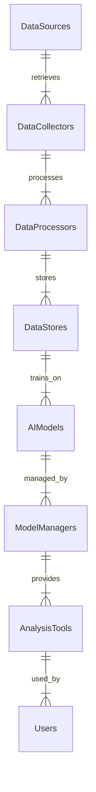

                 

### Introduction to the Enterprise-Level AI R&D Assistant

#### Background

In today's fast-paced digital era, artificial intelligence (AI) has emerged as a transformative force across various industries, driving unprecedented levels of innovation and growth. Enterprises are increasingly recognizing the importance of AI in enhancing their research and development (R&D) processes to stay competitive. However, the complexity and vastness of AI technologies often pose significant challenges, especially for companies without deep expertise in this field. This is where the concept of an enterprise-level AI R&D assistant comes into play.

Enterprise-level AI R&D assistants are sophisticated software systems designed to support the end-to-end process of AI research and development within large organizations. These assistants are equipped with advanced AI algorithms, machine learning models, and data analytics capabilities to automate various tasks, provide insights, and accelerate the innovation cycle. By leveraging these assistants, enterprises can streamline their R&D workflows, reduce time-to-market for new products and services, and enhance their competitive edge in the marketplace.

#### Core Concepts and Terminology

To understand the significance of AI R&D assistants, it's essential to delve into some fundamental concepts and terminology:

- **Artificial Intelligence (AI)**: AI refers to the simulation of human intelligence in machines that are programmed to think like humans and perform tasks typically requiring human intelligence, such as visual perception, speech recognition, decision-making, and language translation.

- **Machine Learning (ML)**: ML is a subset of AI that involves training algorithms to learn from data, identify patterns, and make predictions or decisions with minimal human intervention. ML algorithms are used to develop models that can perform tasks such as classification, regression, clustering, and dimensionality reduction.

- **Research and Development (R&D)**: R&D is a process of creating new technologies, products, or processes. It involves activities aimed at increasing the stock of knowledge, which can then be used to create new or improved products, services, and processes.

- **AI R&D Assistant**: An AI R&D assistant is a software system that utilizes AI and ML techniques to support the R&D process within an enterprise. These assistants can automate data analysis, suggest improvements, generate reports, and even predict future trends based on historical data.

#### Problem Description

The challenges faced by enterprises in adopting AI for R&D can be categorized into several key areas:

- **Complexity**: AI technologies are inherently complex, requiring specialized knowledge in data science, machine learning, and software engineering. Many enterprises lack the internal expertise to effectively leverage these technologies.

- **Scalability**: As the volume of data and the complexity of AI models increase, it becomes challenging for enterprises to scale their R&D operations. This can lead to bottlenecks and delays in the innovation process.

- **Cost**: The cost of developing and deploying AI solutions can be prohibitive for many enterprises, especially smaller companies with limited budgets.

- **Integration**: Integrating AI into existing R&D workflows and systems can be a complex and time-consuming process. Enterprises often need to invest in new infrastructure and tools to support AI-driven R&D.

- **Compliance and Security**: Ensuring that AI-driven R&D activities comply with industry regulations and maintain data privacy can be challenging. Enterprises must navigate a complex regulatory landscape while protecting sensitive data.

#### Solution Overview

Enterprise-level AI R&D assistants address these challenges by providing a comprehensive solution that automates and enhances various aspects of the R&D process. Here's an overview of how these assistants can help:

- **Automation**: AI R&D assistants can automate repetitive tasks such as data collection, preprocessing, and model training, freeing up valuable time for R&D teams to focus on more complex and strategic activities.

- **Insight Generation**: By analyzing vast amounts of data, these assistants can generate valuable insights and recommendations, enabling enterprises to make informed decisions and accelerate their innovation cycle.

- **Scalability**: AI R&D assistants are designed to scale with the needs of the enterprise. As the volume of data and the complexity of projects increase, these assistants can handle the workload without compromising performance.

- **Cost Efficiency**: By streamlining R&D processes and reducing the need for specialized human expertise, AI R&D assistants can significantly lower the cost of R&D operations.

- **Integration**: AI R&D assistants are designed to integrate seamlessly with existing R&D systems and workflows, minimizing disruption and enabling a smooth transition to AI-driven R&D.

- **Compliance and Security**: These assistants incorporate best practices for data security and compliance, helping enterprises navigate the regulatory landscape and protect sensitive data.

#### Conclusion

In conclusion, enterprise-level AI R&D assistants are a critical tool for modern enterprises looking to leverage the power of AI to drive innovation and stay competitive. By addressing the key challenges in AI-driven R&D, these assistants enable enterprises to streamline their processes, reduce costs, and accelerate their innovation cycle. As AI technologies continue to evolve, the role of AI R&D assistants will only become more crucial in shaping the future of enterprise R&D. In the following chapters, we will delve deeper into the core technologies and methodologies behind these assistants, providing a comprehensive guide for building and implementing an effective AI R&D assistant system.

### Core Technologies for Building AI R&D Assistants

#### Introduction to AI Technologies

Artificial Intelligence (AI) is a broad field encompassing various methodologies and techniques that enable machines to perform tasks that typically require human intelligence. At the heart of AI are machine learning (ML) algorithms that allow computers to learn from data, identify patterns, and make predictions or decisions with minimal human intervention. Understanding the foundational principles of AI and ML is crucial for building effective AI R&D assistants.

**Basic Principles of AI**

The basic principles of AI are rooted in the idea that machines can simulate human cognitive processes through algorithms and data. The key principles include:

- **Perception**: AI systems perceive and interpret sensory information from their environment.

- **Reasoning**: AI systems use logic and rules to draw conclusions and make decisions.

- **Learning**: AI systems improve their performance through experience and learning from data.

- **Problem Solving**: AI systems are designed to solve complex problems by identifying and implementing effective solutions.

**Types of AI**

AI can be broadly categorized into several types based on their abilities and the level of human intervention required:

- **Narrow AI (ANI)**: Narrow AI refers to AI systems designed to perform a specific task or set of tasks exceptionally well. Examples include speech recognition, image classification, and autonomous vehicles. Narrow AI is limited to its designated tasks and lacks general intelligence.

- **General AI (AGI)**: General AI refers to AI systems that possess the ability to understand, learn, and apply knowledge across a wide range of tasks and domains, similar to human intelligence. General AI does not yet exist, and its development is a subject of ongoing research and debate.

- **Super AI (SAI)**: Super AI refers to AI systems that surpass human intelligence in almost all aspects. This concept is largely speculative and raises significant ethical and philosophical questions.

**The Role of Machine Learning in AI R&D**

Machine learning is a subset of AI that focuses on developing algorithms that can learn from data and improve their performance over time. Machine learning algorithms are used in various stages of AI R&D, including data preprocessing, model development, and deployment. Here are some key roles of ML in AI R&D:

- **Data Preprocessing**: ML techniques are used to preprocess and clean data, ensuring that it is in a suitable format for model training. This includes tasks such as data normalization, feature extraction, and handling missing values.

- **Model Development**: ML algorithms are used to develop models that can learn from data and make predictions. Different types of ML algorithms, such as supervised learning, unsupervised learning, and reinforcement learning, are used depending on the specific R&D task.

- **Model Evaluation and Optimization**: ML techniques are used to evaluate the performance of models and optimize them for better accuracy and efficiency. This involves tasks such as model selection, hyperparameter tuning, and cross-validation.

- **Deployment and Monitoring**: ML models are deployed in real-world environments and monitored for performance. ML techniques are also used to update and retrain models as new data becomes available, ensuring that the AI system remains accurate and effective over time.

#### Data Collection and Preprocessing

Data is the lifeblood of AI R&D, and the quality of the data directly impacts the performance of AI models. Data collection and preprocessing are critical steps in the AI development process. Here are the key aspects of these steps:

**Data Collection Methods**

Data collection methods vary depending on the specific R&D task and the nature of the data. Common data collection methods include:

- **Structured Data**: Structured data is organized in a tabular format, making it easy to process and analyze. Examples include data from databases, spreadsheets, and CSV files.

- **Unstructured Data**: Unstructured data does not have a predefined format and includes text, images, audio, and video. Collecting unstructured data often involves techniques such as web scraping, text mining, and computer vision.

- **Semi-Structured Data**: Semi-structured data has some organization but does not conform to a strict schema. Examples include XML and JSON data.

**Data Preprocessing Techniques**

Once the data is collected, it needs to be cleaned and transformed into a format suitable for model training. Key data preprocessing techniques include:

- **Data Cleaning**: This involves handling missing values, removing duplicates, and correcting errors in the data.

- **Data Transformation**: This involves converting data into a suitable format for model training, such as scaling and normalizing numerical data and encoding categorical data.

- **Feature Engineering**: This involves creating new features from existing data to improve model performance. Feature engineering can involve tasks such as feature selection, feature extraction, and dimensionality reduction.

- **Data Splitting**: This involves splitting the data into training, validation, and testing sets. The training set is used to train the model, the validation set is used to tune hyperparameters and optimize the model, and the testing set is used to evaluate the final model's performance.

**Challenges in Data Management**

Managing data in AI R&D poses several challenges:

- **Data Quality**: Poor data quality can lead to inaccurate models and poor performance. Ensuring high-quality data requires rigorous data cleaning and preprocessing techniques.

- **Data Volume**: The volume of data in AI R&D can be massive, requiring efficient storage and processing solutions. Large datasets can also pose challenges in terms of computational resources and storage costs.

- **Data Integration**: Integrating data from multiple sources can be complex, especially when dealing with different data formats and structures.

- **Data Security and Privacy**: Ensuring data security and privacy is crucial, particularly when dealing with sensitive data. Compliance with data protection regulations, such as GDPR, is essential to avoid legal and ethical issues.

#### AI Model Selection and Development

Selecting the right AI model is crucial for achieving optimal performance in AI R&D. The selection process involves considering various factors such as the nature of the problem, the type of data, and the available computational resources. Here's a step-by-step guide to AI model selection and development:

**Choosing the Right AI Models**

1. **Problem Definition**: Clearly define the problem you are trying to solve. Understand the type of data you have and the desired output.

2. **Model Type Selection**: Choose the appropriate type of AI model based on the problem type. Common types of models include:

   - **Supervised Learning Models**: Used for tasks where labeled data is available. Examples include classification and regression tasks.

   - **Unsupervised Learning Models**: Used for tasks where labeled data is not available. Examples include clustering and association tasks.

   - **Reinforcement Learning Models**: Used for tasks involving decision-making in dynamic environments. Examples include game playing and robotic control.

3. **Algorithm Selection**: Choose the specific algorithm within the selected model type. Common algorithms include:

   - **Classification Algorithms**: e.g., Logistic Regression, Decision Trees, Random Forests, Support Vector Machines (SVM), and Neural Networks.

   - **Regression Algorithms**: e.g., Linear Regression, Ridge Regression, Lasso Regression, and Multivariate Adaptive Regression Spline (MARS).

   - **Clustering Algorithms**: e.g., K-Means, Hierarchical Clustering, and DBSCAN.

   - **Reinforcement Learning Algorithms**: e.g., Q-Learning, SARSA, and Deep Q-Networks (DQN).

**Model Development Workflow**

1. **Data Preparation**: Prepare the data by cleaning, transforming, and splitting it into training, validation, and testing sets.

2. **Model Training**: Train the selected model on the training data using ML algorithms. This involves optimizing the model parameters to minimize the error between predicted and actual outputs.

3. **Model Evaluation**: Evaluate the performance of the trained model using the validation and testing sets. Common evaluation metrics include accuracy, precision, recall, F1 score, and mean squared error.

4. **Hyperparameter Tuning**: Adjust the hyperparameters of the model to improve its performance. This can involve using techniques such as grid search, random search, or Bayesian optimization.

5. **Cross-Validation**: Perform cross-validation to ensure that the model generalizes well to unseen data. This involves training and evaluating the model on multiple subsets of the data.

6. **Model Deployment**: Deploy the final model in the production environment for real-time predictions or decision-making tasks.

**Model Evaluation and Optimization**

1. **Performance Metrics**: Evaluate the model's performance using appropriate metrics based on the problem type. For classification tasks, metrics such as accuracy, precision, recall, and F1 score are commonly used. For regression tasks, metrics such as mean squared error and R-squared are used.

2. **Model Optimization**: Optimize the model to improve its performance. This can involve techniques such as feature selection, model ensembling, and advanced optimization algorithms.

3. **Continuous Learning**: Continuously update and retrain the model as new data becomes available. This ensures that the model remains accurate and effective over time.

In conclusion, selecting and developing the right AI model is a critical step in building effective AI R&D assistants. By following a systematic approach to model selection and development, enterprises can create AI systems that accurately predict, classify, and solve complex problems, thereby accelerating their innovation and R&D processes.

### Enterprise-Level AI R&D Assistant System Components

#### Overview

An enterprise-level AI R&D assistant is a sophisticated system that integrates various components to provide comprehensive support for the end-to-end AI research and development process. These components work together to collect, process, analyze, and visualize data, generate insights, and automate tasks. Understanding the structure and interactions of these components is crucial for building an effective AI R&D assistant.

#### Entities and Attributes

In the enterprise-level AI R&D assistant system, the primary entities include:

1. **Data Sources**: These are the various sources from which data is collected. Examples include databases, data warehouses, cloud storage, APIs, and third-party data providers.

   - **Attributes**: Data source ID, data type (structured, unstructured, semi-structured), connection details (URL, credentials), data access frequency.

2. **Data Collectors**: These are the components responsible for retrieving data from the data sources and preparing it for processing.

   - **Attributes**: Collector ID, data source ID, data retrieval method (API calls, database queries, web scraping), data processing pipeline.

3. **Data Processors**: These are the components that clean, transform, and preprocess the collected data to make it suitable for analysis.

   - **Attributes**: Processor ID, data collector ID, data cleaning techniques (missing value handling, duplicate removal, data normalization), data transformation rules.

4. **Data Stores**: These are the components where processed data is stored for further analysis and model training.

   - **Attributes**: Store ID, data processor ID, data format (CSV, JSON, parquet), storage location (local, cloud), access permissions.

5. **AI Models**: These are the machine learning models that are developed and trained on the processed data to perform specific tasks.

   - **Attributes**: Model ID, data store ID, model type (classification, regression, clustering), training algorithm, evaluation metrics.

6. **Model Managers**: These are the components responsible for managing the lifecycle of AI models, including training, evaluation, deployment, and monitoring.

   - **Attributes**: Manager ID, model ID, training pipeline, evaluation pipeline, deployment settings, monitoring metrics.

7. **Analysis Tools**: These are the tools used to analyze and visualize the data and model outputs.

   - **Attributes**: Tool ID, supported data types, visualization types (charts, graphs, tables), user interface.

8. **Users**: These are the individuals or teams who interact with the AI R&D assistant system.

   - **Attributes**: User ID, role (R&D engineer, data scientist, manager), access rights, activity logs.

#### Relationships

The entities in the AI R&D assistant system are interconnected through various relationships, which can be visualized using an Entity-Relationship (ER) diagram. Here's a simplified ER diagram representation using Mermaid:

In this ER diagram, the relationship between entities is depicted as lines with arrows indicating the direction of the relationship. For example, DataCollectors retrieve data from DataSources, which is then processed by DataProcessors and stored in DataStores. AIModels are trained on data stored in DataStores, managed by ModelManagers, and can be analyzed using AnalysisTools, which are used by Users.

#### Functionalities

The components of the AI R&D assistant system work together to provide the following functionalities:

- **Data Collection**: DataCollectors retrieve data from various sources and pass it to DataProcessors for cleaning and transformation.

- **Data Processing**: DataProcessors clean, transform, and preprocess the data to make it suitable for analysis and model training.

- **Data Storage**: Processed data is stored in DataStores, which can be local or cloud-based, providing scalable storage solutions.

- **Model Training**: AIModels are trained on the processed data using machine learning algorithms, and their performance is evaluated.

- **Model Management**: ModelManagers handle the lifecycle of AI models, including training, evaluation, deployment, and monitoring.

- **Data Analysis and Visualization**: AnalysisTools provide insights into the data and model outputs through various visualization techniques, enabling users to make informed decisions.

- **User Interaction**: Users can interact with the AI R&D assistant system through a user interface, accessing data, models, and analysis tools based on their roles and permissions.

In conclusion, the enterprise-level AI R&D assistant system is a complex, interconnected ecosystem of components that work together to support the end-to-end AI research and development process. Understanding the entities, relationships, and functionalities of these components is essential for building and implementing an effective AI R&D assistant system that can accelerate innovation and drive business growth.

### AI Technologies and Their Impact on R&D

#### The Role of AI in Accelerating R&D

Artificial Intelligence (AI) has revolutionized the way research and development (R&D) processes are conducted across various industries. By automating repetitive tasks, providing actionable insights, and enhancing predictive capabilities, AI has significantly accelerated R&D workflows, leading to faster innovation and more efficient resource utilization. Let's explore the specific roles that AI plays in accelerating R&D:

**1. Automation of Repetitive Tasks**

One of the primary roles of AI in R&D is the automation of repetitive and time-consuming tasks. These tasks often include data collection, data entry, data cleaning, and preliminary data analysis. AI-powered tools can perform these tasks with high accuracy and speed, freeing up R&D professionals to focus on more strategic activities.

- **Data Collection**: AI can automatically collect data from various sources, such as scientific journals, databases, and the internet, using web scraping and natural language processing (NLP) techniques. This enables researchers to access a vast amount of information quickly and efficiently.
  
- **Data Entry and Cleaning**: AI algorithms can automatically extract relevant information from raw data, clean it by handling missing values, removing duplicates, and correcting errors, thus ensuring high data quality.

- **Preliminary Data Analysis**: AI can perform initial data analysis tasks, such as identifying trends, patterns, and anomalies in the data, providing a quick overview that helps researchers focus on the most relevant aspects of the data.

**2. Enhanced Data Analysis and Insights**

AI enhances the capabilities of data analysis by identifying complex patterns and relationships that might not be apparent to human analysts. By leveraging machine learning algorithms, AI can analyze large datasets and provide actionable insights that drive innovation.

- **Pattern Recognition**: AI algorithms can identify complex patterns in data that are not easily detectable by human analysts. For example, in drug discovery, AI can analyze molecular structures to identify potential candidates for new drugs based on their chemical properties and interactions.

- **Predictive Analytics**: AI can predict future trends and outcomes based on historical data. In R&D, this can be used to forecast market demand, predict product performance, and optimize manufacturing processes.

- **Anomaly Detection**: AI can detect anomalies or outliers in data that may indicate potential issues or opportunities. For example, in quality control, AI can identify defective products or manufacturing defects before they reach the market.

**3. Intelligent Decision-Making**

AI-powered tools assist R&D teams in making informed decisions by providing real-time insights and recommendations. These tools use advanced algorithms to analyze data and suggest the best courses of action based on the current state of the project and historical data.

- **Scenario Analysis**: AI can simulate different scenarios and their potential outcomes, helping R&D teams assess the impact of various decisions on project success.

- **Resource Optimization**: AI can optimize the allocation of resources, such as budget, time, and personnel, by analyzing historical data and predicting the most effective utilization strategies.

- **Risk Assessment**: AI can assess the risks associated with different R&D projects and recommend strategies to mitigate them, ensuring that projects are on track and within budget.

**4. Collaboration and Communication**

AI facilitates collaboration and communication among R&D teams by providing a centralized platform for data sharing, project management, and communication. This improves team coordination and accelerates the R&D process.

- **Centralized Data Repository**: AI can create a centralized repository for storing and managing all relevant data, ensuring that all team members have access to the most up-to-date information.

- **Real-Time Collaboration**: AI-powered tools enable real-time collaboration, allowing team members to work together on projects regardless of their physical location.

- **Automated Notifications**: AI can send automated notifications and reminders to team members about upcoming milestones, deadlines, and other important events, ensuring that everyone stays on track.

**Case Study: AI in Pharmaceutical R&D**

One notable example of AI's impact on R&D is in the pharmaceutical industry. AI has transformed the drug discovery process by speeding up the identification of potential drug candidates and improving the success rate of clinical trials.

- **Structure-Based Drug Design**: AI algorithms can analyze the molecular structures of drugs and identify potential candidates that bind to specific targets, such as proteins. This significantly reduces the time and cost of traditional drug discovery methods.

- **Predictive Toxicology**: AI can predict the toxicity of drug candidates before they enter clinical trials, helping to avoid potential safety issues and reducing the number of failed trials.

- **Patient Data Analysis**: AI can analyze patient data from electronic health records and identify patterns that may lead to the discovery of new treatments or improved dosing regimens.

In conclusion, AI has a transformative impact on R&D by automating tasks, enhancing data analysis, enabling intelligent decision-making, and improving collaboration. By leveraging AI technologies, enterprises can accelerate their R&D processes, drive innovation, and gain a competitive edge in the market. The next section will delve into the specific ways AI can enhance the process of patent application by leveraging its capabilities in natural language processing and data analysis.

### Enhancing Patent Application with AI

Artificial Intelligence (AI) holds significant potential in streamlining and optimizing the process of patent application, bringing efficiency and innovation to what is traditionally a time-consuming and complex task. By leveraging AI's capabilities in natural language processing (NLP), data analysis, and machine learning, enterprises can significantly improve the quality, accuracy, and speed of their patent applications. Let's explore the various ways AI can be applied to enhance patent applications:

**1. Document Analysis and Review**

One of the most critical aspects of patent application is the analysis and review of the documentation, including patent specifications, claims, and drawings. AI-powered tools can analyze these documents to identify key information, detect inconsistencies, and ensure compliance with legal requirements.

- **Textual Analysis**: AI can perform NLP to extract and analyze the content of patent documents, identifying important concepts, keywords, and relationships. This can help patent attorneys and researchers quickly understand the core ideas presented in the documents.

- **Semantic Analysis**: By understanding the semantic meaning of the text, AI can detect similarities and differences between different patent applications or existing patents. This can help identify potential conflicts or opportunities for improvement.

- **Automated Drafting**: AI can assist in generating draft patent specifications and claims based on the analysis of prior art and existing patents. This can save significant time and reduce the likelihood of errors in the drafting process.

**2. Prior Art Search**

A thorough prior art search is essential to ensure that a patent application is both novel and non-obvious. AI can significantly enhance this process by automating the search and analysis of vast amounts of prior art.

- **Machine Learning Algorithms**: AI-powered tools can use machine learning algorithms to learn from vast databases of patents and identify relevant prior art based on keywords, concepts, and semantic relationships.

- **Natural Language Processing**: NLP techniques can help AI understand the context and meaning of patent documents, allowing it to identify prior art that might be missed by traditional keyword-based searches.

- **Categorization and Classification**: AI can categorize and classify patent documents based on their content, making it easier to filter and prioritize search results. This can help researchers focus on the most relevant and relevant prior art.

**3. Patentability Analysis**

Determining the patentability of an invention involves evaluating whether it meets the criteria of novelty, non-obviousness, and industrial applicability. AI can assist in this process by providing predictive analytics and insights.

- **Predictive Modeling**: AI can build predictive models to estimate the likelihood of a patent being granted based on various factors, such as the complexity of the technology, the strength of prior art, and the quality of the written application.

- **Risk Assessment**: AI can assess the risks associated with a patent application, including the potential for patent infringement and the likelihood of successfully defending against challenges.

- **Innovation Scoring**: AI can score the innovation level of a patent application, helping researchers and patent attorneys prioritize their efforts on the most groundbreaking and potentially valuable inventions.

**4. Collaboration and Communication**

AI can also facilitate collaboration and communication among patent attorneys, researchers, and other stakeholders involved in the patent application process.

- **Automated Drafting and Review**: AI-powered tools can automate the drafting and review of patent documents, providing real-time feedback and suggestions to improve the quality and clarity of the application.

- **Centralized Data Management**: AI can create a centralized platform for managing all patent-related documents and communication, ensuring that all stakeholders have access to the most up-to-date information.

- **Real-Time Collaboration**: AI-powered collaboration tools can enable real-time communication and collaboration, regardless of the physical location of the stakeholders, thereby accelerating the patent application process.

**5. Post-Grant Monitoring**

Even after a patent is granted, AI can continue to play a role in monitoring and managing the patent portfolio.

- **Competitor Analysis**: AI can analyze competitor patents and market trends to identify potential threats and opportunities for the patent holder.

- **Infringement Detection**: AI can monitor for potential patent infringements by analyzing product descriptions, marketing materials, and other public information.

- **Intellectual Property Management**: AI can assist in managing the patent portfolio by tracking expiration dates, renewals, and other legal requirements, ensuring that the patent holder remains in compliance.

**Case Study: AI in Patent Prosecution**

A leading technology company successfully utilized AI to enhance its patent application process. By deploying an AI-powered tool for prior art search and analysis, the company was able to reduce the time it took to complete a prior art search from several weeks to just a few days. This accelerated the patent prosecution process, allowing the company to bring innovative products to market faster.

- **Increased Efficiency**: The company saw a significant increase in the efficiency of its patent application process, with a reduction in the time and resources required for prior art searches.

- **Improved Accuracy**: The AI-powered tool identified a higher number of relevant prior art documents compared to traditional methods, leading to more thorough and accurate patent applications.

- **Enhanced Collaboration**: The centralized platform enabled better collaboration among the company's patent attorneys, researchers, and other stakeholders, resulting in a more cohesive and streamlined process.

In conclusion, AI offers a powerful set of tools for enhancing every stage of the patent application process. By leveraging AI's capabilities in NLP, data analysis, and machine learning, enterprises can improve the quality, accuracy, and speed of their patent applications, gaining a competitive edge in the market. The next section will explore the current trends and future directions of AI in enterprise-level AI R&D assistants, highlighting the ongoing advancements and emerging opportunities.

### Current Trends and Future Directions in AI R&D Assistants

#### Current Trends

The field of AI R&D assistants has witnessed remarkable advancements in recent years, driven by breakthroughs in AI algorithms, hardware capabilities, and data availability. Here are some of the key trends shaping the development and adoption of AI R&D assistants:

**1. Advancements in AI Algorithms**

- **Deep Learning**: Deep learning has become a cornerstone of AI R&D assistants, enabling more complex and accurate models. Techniques such as convolutional neural networks (CNNs), recurrent neural networks (RNNs), and transformers have significantly improved the performance of AI assistants in tasks like image recognition, natural language processing, and predictive analytics.

- **Transfer Learning**: Transfer learning allows AI models to leverage pre-trained models on large datasets, significantly reducing the time and effort required for training new models. This trend has enabled faster deployment of AI R&D assistants across various domains.

- **Ensemble Learning**: Ensemble learning techniques, such as bagging and boosting, combine multiple models to improve prediction accuracy and robustness. This approach is widely used in AI R&D assistants to enhance the performance of complex models.

**2. Hardware Acceleration**

- **GPU and TPU Utilization**: Graphics Processing Units (GPUs) and Tensor Processing Units (TPUs) have become standard hardware accelerators for AI R&D. Their parallel processing capabilities have dramatically increased the speed of model training and inference, enabling more efficient and scalable AI R&D assistants.

- **Quantum Computing**: While still in its infancy, quantum computing holds the potential to revolutionize AI R&D by providing exponential computational power. Quantum algorithms are being developed to solve complex optimization problems and enhance machine learning models.

**3. Data-Driven Approaches**

- **Big Data Analytics**: The availability of vast amounts of data has fueled the development of AI R&D assistants. Data-driven approaches enable more robust and accurate models by leveraging large datasets for training and validation.

- **Data Integration**: Integrating data from multiple sources and formats is crucial for building comprehensive AI R&D assistants. Technologies like data lakes and data warehouses facilitate the storage and processing of diverse datasets.

**4. Domain-Specific Applications**

- **Healthcare**: AI R&D assistants are being used in healthcare for tasks like disease diagnosis, drug discovery, and personalized medicine. Deep learning models are trained on medical images, electronic health records, and genomic data to provide accurate and timely insights.

- **Manufacturing**: In manufacturing, AI R&D assistants are used for predictive maintenance, quality control, and process optimization. Machine learning algorithms analyze sensor data and production logs to improve operational efficiency and reduce costs.

**5. Ethical and Regulatory Considerations**

- **AI Governance**: As AI becomes more prevalent in R&D, ethical and regulatory considerations have gained prominence. Enterprises are increasingly adopting AI governance frameworks to ensure transparency, accountability, and fairness in AI applications.

- **Data Privacy**: Ensuring data privacy is a critical concern in AI R&D. Technologies like differential privacy and federated learning are being developed to protect sensitive data while enabling collaborative AI research.

#### Future Directions

Looking ahead, the future of AI R&D assistants is poised to be shaped by several emerging technologies and trends:

**1. Explainable AI (XAI)**

- **Enhancing Trust**: As AI R&D assistants become more complex, there is a growing need for explainability to gain trust and compliance. XAI techniques aim to provide insights into the decision-making process of AI models, making them more transparent and interpretable.

- **User-Friendly Interfaces**: Developing user-friendly interfaces that enable non-experts to understand and trust AI R&D assistants will be crucial. Visualization tools and intuitive dashboards can help bridge the gap between complex AI models and end-users.

**2. Human-AI Collaboration**

- **Synergistic Relationships**: The future will likely see a shift towards human-AI collaboration, where AI R&D assistants complement human expertise rather than replacing it. AI assistants can handle routine tasks, while humans focus on strategic decision-making and creative problem-solving.

- **Adaptive Systems**: AI R&D assistants of the future will be more adaptive and context-aware, able to learn and evolve based on user feedback and changing requirements.

**3. Real-Time Analytics and Decision-Making**

- **Edge Computing**: To handle real-time data processing and decision-making, edge computing combined with AI R&D assistants will become increasingly important. Edge devices can perform AI tasks locally, reducing latency and bandwidth requirements.

- **Continuous Learning**: Continuous learning capabilities will enable AI R&D assistants to update their models in real-time, adapting to new data and improving performance over time.

**4. Personalized AI**

- **Customization**: AI R&D assistants will become more personalized, tailored to the specific needs and preferences of individual enterprises. This will require advanced profiling and customization techniques to ensure optimal performance.

- **Industry-Specific Solutions**: As industries become more specialized, AI R&D assistants will develop industry-specific capabilities, providing tailored solutions for sectors such as finance, healthcare, and logistics.

**5. Ethical and Sustainable AI**

- **Sustainability**: AI R&D will increasingly focus on sustainability, with a goal of minimizing the environmental impact of AI technologies. Energy-efficient algorithms and green data centers will play a crucial role.

- **Ethical AI**: Ensuring that AI R&D assistants adhere to ethical standards will remain a priority. This includes addressing biases, ensuring fairness, and promoting transparency in AI systems.

In conclusion, the future of AI R&D assistants is promising, with ongoing advancements and new trends set to enhance their capabilities and impact. As AI continues to evolve, these assistants will play an increasingly vital role in driving innovation, efficiency, and competitiveness across various industries. The next section will provide a comprehensive summary of the key insights and takeaways from this article, highlighting the importance of AI R&D assistants in accelerating innovation and patent application.

### Summary and Key Insights

The journey through the world of enterprise-level AI R&D assistants has illuminated the transformative potential of AI in driving innovation and accelerating the patent application process. As we've explored, AI R&D assistants are sophisticated systems that leverage advanced algorithms, machine learning, and data analytics to streamline and enhance every stage of the research and development lifecycle. Here are the key insights and takeaways from our discussion:

**1. Automation and Efficiency**

AI R&D assistants significantly enhance the efficiency of R&D processes by automating repetitive tasks such as data collection, preprocessing, and analysis. This automation frees up R&D professionals to focus on high-impact, strategic activities, leading to faster innovation and reduced operational costs.

**2. Enhanced Data Analysis and Insights**

AI's ability to analyze large and complex datasets enables the identification of patterns, trends, and insights that may not be apparent to human analysts. This data-driven approach empowers enterprises to make informed decisions, optimize resource allocation, and predict future outcomes with greater accuracy.

**3. Accelerated Patent Application**

AI enhances the patent application process by automating document analysis, prior art search, and patentability analysis. By leveraging natural language processing and machine learning, AI R&D assistants can identify relevant prior art, generate draft patent specifications, and predict the likelihood of patent approval, thereby accelerating the process and improving its accuracy.

**4. Human-AI Collaboration**

The future of AI R&D assistants lies in human-AI collaboration. As AI becomes more capable and explainable, it will complement human expertise, enabling a synergistic approach to R&D that leverages the strengths of both human intuition and AI's analytical capabilities.

**5. Ethical and Sustainable AI**

As AI technologies evolve, ensuring their ethical and sustainable use will be paramount. AI R&D assistants must adhere to rigorous governance frameworks to ensure transparency, fairness, and accountability, while also minimizing their environmental impact.

In conclusion, enterprise-level AI R&D assistants are not just tools but strategic assets that can revolutionize how enterprises innovate and operate. By harnessing the power of AI, enterprises can accelerate their R&D processes, enhance their competitive edge, and drive sustainable growth. The future of AI in R&D is promising, and with continued advancements, AI R&D assistants will play an increasingly vital role in shaping the future of enterprise innovation.

### Best Practices and Tips

To maximize the effectiveness of enterprise-level AI R&D assistants, consider the following best practices and tips:

**1. Data Quality Management**

Ensure high-quality data by implementing rigorous data cleaning and preprocessing techniques. Data quality directly impacts the performance and reliability of AI models, so invest time and resources in maintaining clean and accurate datasets.

**2. Continuous Learning and Model Updates**

AI R&D assistants should be continuously updated with new data and insights to improve their performance over time. Regularly retrain and update models to ensure they remain accurate and relevant.

**3. Collaboration and Integration**

Promote collaboration between R&D teams and AI specialists to ensure that AI R&D assistants are aligned with business goals and R&D strategies. Integrate AI assistants seamlessly with existing R&D systems and workflows to minimize disruptions.

**4. Ethical Considerations**

Adhere to ethical guidelines and regulatory frameworks when developing and deploying AI R&D assistants. Ensure transparency, fairness, and accountability in AI systems to build trust and compliance.

**5. User Training and Support**

Provide comprehensive training and support for users to effectively leverage AI R&D assistants. Offer user-friendly interfaces and documentation to facilitate smooth adoption and maximize the benefits of AI technologies.

**6. Security and Privacy**

Implement robust security measures to protect sensitive data and ensure compliance with data protection regulations. Use encryption, access controls, and other security best practices to safeguard data integrity and privacy.

**7. Monitoring and Performance Metrics**

Regularly monitor the performance of AI R&D assistants using key performance indicators (KPIs) and metrics. Analyze performance data to identify areas for improvement and optimize the system continuously.

By following these best practices, enterprises can ensure that their AI R&D assistants are effectively supporting their innovation and patent application processes, driving sustainable growth and competitive advantage.

### Conclusion

In conclusion, enterprise-level AI R&D assistants are powerful tools that hold immense potential for accelerating innovation and enhancing the patent application process. By automating repetitive tasks, providing actionable insights, and optimizing R&D workflows, AI assistants empower enterprises to drive faster, more informed decision-making and bring groundbreaking products to market. As AI technologies continue to evolve, the capabilities of AI R&D assistants will only grow, further transforming the landscape of research and development.

### References

1. **Russell, S., & Norvig, P. (2016). *Artificial Intelligence: A Modern Approach*. Prentice Hall.** This comprehensive textbook provides an in-depth introduction to the field of artificial intelligence, covering key concepts, algorithms, and applications.

2. **Goodfellow, I., Bengio, Y., & Courville, A. (2016). *Deep Learning*. MIT Press.** This book offers a thorough overview of deep learning techniques and their applications in various domains, including AI R&D.

3. **Ng, A. Y. (2017). *Machine Learning Yearning*. Cengage Learning.** This book focuses on the practical aspects of machine learning, providing insights into the end-to-end process of developing AI models and systems.

4. **Manning, C. D., Raghavan, P., & Schütze, H. (2008). *Introduction to Information Retrieval*. Cambridge University Press.** This resource covers the fundamentals of information retrieval and natural language processing, which are essential for developing AI R&D assistants.

5. **He, K., Zhang, X., Ren, S., & Sun, J. (2016). *Deep Residual Learning for Image Recognition*. IEEE.** This paper presents the residual network (ResNet), a breakthrough deep learning model that has significantly advanced image recognition tasks.

6. **Dastidar, S., & Dastidar, K. (2019). *AI Ethics: Theories, Approaches, and Challenges*. Springer.** This book explores the ethical considerations and challenges associated with AI, providing a valuable framework for developing responsible AI systems.

7. **Murdoch, D. B., & Newell, A. (2021). *Federated Learning for Privacy-Preserving Machine Learning*. Springer.** This resource delves into federated learning, a technique for training machine learning models across decentralized devices while preserving data privacy.

These references provide a solid foundation for further exploration of the concepts and techniques discussed in this article, offering readers a comprehensive understanding of AI R&D assistants and their applications.

