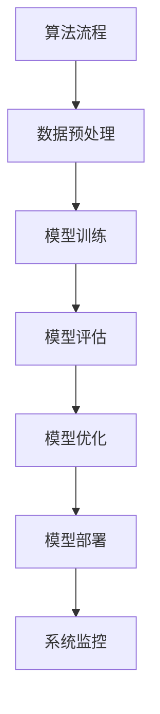
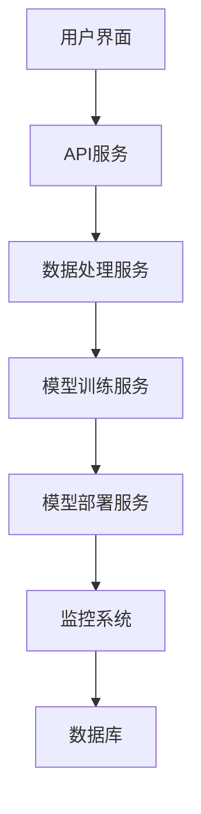
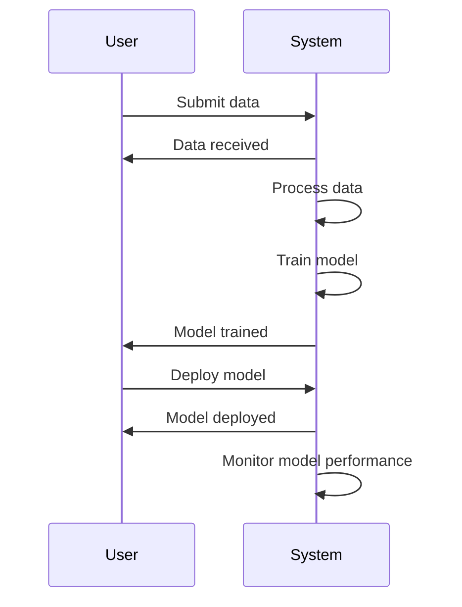

                 

# 构建企业级AI研发助手：加速创新与专利申请流程

## 关键词

- 企业级AI研发助手
- 创新加速
- 专利申请流程
- 机器学习
- 系统架构设计
- 实际案例

## 摘要

本文将探讨如何构建企业级AI研发助手，通过自动化和智能化手段，加速企业创新进程和专利申请流程。我们将从问题背景、核心概念、技术基础、应用场景、实战案例以及最佳实践等方面进行深入分析，旨在为企业提供有效的AI研发解决方案，提升其市场竞争力。

## 第一部分：引言与背景

### 1.1 问题背景

在当前数字化时代，人工智能（AI）技术正在迅速发展，成为推动企业创新和发展的关键动力。然而，企业在利用AI进行创新和专利申请时，面临着诸多挑战。这些挑战包括数据获取与处理的复杂性、模型训练与优化的困难、专利挖掘与撰写的耗时性等。因此，企业需要一套高效、智能的AI研发助手来加速创新与专利申请流程。

### 1.2 核心概念与联系

企业级AI研发助手是一种能够辅助企业进行AI研究和开发的人工智能系统。它集成了数据预处理、模型训练、优化部署等多种功能，能够显著提升企业的研发效率。

### 1.3 范围与边界

本文的研究范围主要涵盖AI研发助手的构建、应用和创新加速。边界则限定在企业级场景，不包括个人或小型团队的AI研发需求。

### 1.4 概念结构与核心要素

企业级AI研发助手的概念结构包括数据采集与处理、模型训练与优化、部署与监控等核心模块。每个模块都有其独特的功能和作用，共同构成了一个完整的AI研发流程。

### 1.5 本章小结

通过对问题背景和核心概念的介绍，我们为后续内容的深入探讨奠定了基础。

----------------------------------------------------------------

## 第二部分：AI研发助手技术基础

### 2.1 AI技术基础

AI技术是构建企业级AI研发助手的基础。本文将简要介绍AI的基本概念、机器学习基础和深度学习原理，以便读者更好地理解后续内容。

#### 2.1.1 AI基本概念

人工智能（Artificial Intelligence，简称AI）是指计算机系统模拟人类智能行为的能力。它包括知识表示、问题求解、智能控制、机器学习等多个方面。

#### 2.1.2 机器学习基础

机器学习是AI的一个重要分支，它通过训练模型来让计算机从数据中自动学习规律。主要方法包括监督学习、无监督学习和强化学习。

#### 2.1.3 深度学习原理

深度学习是机器学习的一种重要方法，它使用多层神经网络来提取数据特征，从而实现更复杂的任务。常见的深度学习框架有TensorFlow和PyTorch等。

### 2.2 AI研发助手关键组件

企业级AI研发助手通常包括以下关键组件：

#### 2.2.1 数据处理模块

数据处理模块负责对原始数据进行分析、清洗和转换，以便后续的模型训练。它包括数据采集、数据预处理和数据可视化等功能。

#### 2.2.2 模型训练模块

模型训练模块使用机器学习算法对处理后的数据进行训练，生成预测模型。它包括模型选择、模型训练和模型评估等功能。

#### 2.2.3 模型部署与优化

模型部署与优化模块将训练好的模型部署到生产环境中，并进行实时监控和优化，以提高模型的性能和稳定性。

### 2.3 AI研发助手架构设计

企业级AI研发助手的架构设计需要考虑系统的可扩展性、可维护性和灵活性。以下是常见的AI研发助手架构设计：

#### 2.3.1 系统架构概述

系统架构通常包括前端、后端和数据库三部分。前端负责用户交互，后端负责数据处理和模型训练，数据库用于存储数据和模型。

#### 2.3.2 架构设计与实现

架构设计需要根据具体业务需求进行定制，以满足不同的功能和性能要求。常见的架构实现包括微服务架构和分布式架构。

#### 2.3.3 技术选型与优化

技术选型需要根据系统的需求、性能和成本进行权衡。常见的后端技术有Python、Java和Go等，前端技术有HTML、CSS和JavaScript等。

### 2.4 AI研发助手的技术挑战

在构建企业级AI研发助手的过程中，会遇到以下技术挑战：

#### 2.4.1 数据质量控制

数据质量对模型的性能至关重要。需要采取数据清洗、去重和异常值处理等技术手段，确保数据的质量。

#### 2.4.2 模型解释性

模型解释性是AI技术的一个重要研究方向。通过增加模型的透明度和可解释性，有助于提高模型的信任度和应用价值。

#### 2.4.3 安全与隐私保护

在处理敏感数据时，需要采取安全防护措施，以防止数据泄露和滥用。

### 2.5 本章小结

通过对AI技术基础、关键组件、架构设计和技术挑战的介绍，我们为构建企业级AI研发助手奠定了基础。

----------------------------------------------------------------

## 第三部分：AI研发助手在创新中的应用

### 3.1 创新与AI研发助手

创新是企业持续发展的关键。AI研发助手通过自动化和智能化手段，可以帮助企业加速创新进程，提高创新成功率。

#### 3.1.1 创新过程概述

创新过程通常包括需求分析、概念验证、原型设计和产品化等阶段。AI研发助手可以在每个阶段发挥重要作用。

#### 3.1.2 AI研发助手在创新中的作用

AI研发助手可以自动化数据采集和处理，提供智能化的模型训练和优化工具，缩短创新周期，提高创新质量。

#### 3.1.3 创新流程优化

通过引入AI研发助手，企业可以优化创新流程，提高创新效率，降低创新成本。

### 3.2 数据驱动的创新策略

数据驱动的创新策略是基于数据分析来发现新的商业机会和解决方案。AI研发助手在数据驱动的创新中发挥着关键作用。

#### 3.2.1 数据收集与处理

AI研发助手可以自动化数据收集和处理，确保数据的质量和完整性。

#### 3.2.2 数据分析与应用

AI研发助手可以使用机器学习和深度学习算法，对数据进行挖掘和分析，发现潜在的商业价值。

#### 3.2.3 数据驱动的创新案例分析

本文将结合实际案例，介绍如何通过数据驱动的创新策略，实现商业价值的提升。

### 3.3 AI研发助手在专利申请中的应用

专利申请是企业创新的重要环节。AI研发助手可以显著提高专利申请的效率和成功率。

#### 3.3.1 专利挖掘与预审

AI研发助手可以通过对大量专利文献的分析，发现潜在的专利机会，并进行预审，提高专利申请的成功率。

#### 3.3.2 专利撰写与申请

AI研发助手可以帮助企业快速撰写专利文档，确保专利申请的准确性和完整性。

#### 3.3.3 AI研发助手的专利分析工具

AI研发助手提供专利分析工具，帮助企业了解行业动态、竞争对手的专利布局，制定合适的专利策略。

### 3.4 创新与专利申请的协同效应

创新与专利申请之间存在密切的协同效应。通过结合AI研发助手，企业可以实现创新与专利申请的有机结合，提高整体竞争力。

#### 3.4.1 创新与专利策略的关系

创新策略和专利策略相互影响，通过合理的专利布局，可以保护企业的创新成果，提高创新价值。

#### 3.4.2 专利组合策略

企业可以通过构建专利组合，提高专利的稳定性和可靠性，实现风险分散和收益最大化。

#### 3.4.3 企业案例分析

本文将结合实际企业案例，分析如何通过创新与专利申请的协同效应，实现企业竞争力的提升。

### 3.5 本章小结

通过对AI研发助手在创新和专利申请中的应用分析，我们展示了其在企业创新发展中的重要作用。

----------------------------------------------------------------

## 第四部分：实战案例

### 4.1 案例介绍

本案例以一家创新型互联网公司为例，介绍如何利用AI研发助手加速创新与专利申请流程。

#### 4.1.1 案例背景

该公司致力于开发智能推荐系统，通过大数据分析和机器学习算法，为用户提供个性化的内容推荐服务。然而，在创新和专利申请过程中，该公司遇到了数据质量、模型训练和专利撰写等方面的挑战。

#### 4.1.2 案例目标

利用AI研发助手，该公司希望实现以下目标：

1. 自动化数据采集与处理，提高数据质量。
2. 智能化模型训练与优化，提升推荐系统性能。
3. 加速专利申请流程，保护创新成果。

#### 4.1.3 案例挑战

1. 数据量大，处理复杂，需要高效的数据预处理工具。
2. 模型训练耗时较长，需要优化模型训练过程。
3. 专利撰写耗时，需要快速撰写高质量的专利文档。

### 4.2 系统设计与实现

#### 4.2.1 系统功能设计

该系统主要包括以下功能：

1. 数据采集与处理
2. 模型训练与优化
3. 专利撰写与申请
4. 系统监控与日志记录

#### 4.2.2 系统架构设计

系统架构设计采用分布式架构，包括前端、后端和数据库三部分。前端负责用户交互，后端负责数据处理和模型训练，数据库用于存储数据和模型。

#### 4.2.3 系统接口设计

系统接口设计包括RESTful API和Websocket两种方式。RESTful API用于数据采集与处理、模型训练与优化等功能，Websocket用于实时数据监控和日志记录。

### 4.3 数据处理与模型训练

#### 4.3.1 数据集准备

首先，从多个数据源收集用户行为数据，包括浏览记录、购买记录、搜索记录等。然后，对数据进行清洗、去重和填充缺失值等预处理操作，确保数据的质量。

#### 4.3.2 模型训练

采用深度学习算法，对处理后的数据进行训练。模型训练过程包括数据预处理、模型训练、模型评估和模型优化等步骤。

#### 4.3.3 模型部署与优化

训练好的模型部署到生产环境中，通过实时数据流进行在线预测。同时，对模型进行监控和优化，以提高预测准确率和系统稳定性。

### 4.4 专利撰写与申请

#### 4.4.1 专利挖掘与预审

利用AI研发助手的专利分析工具，对相关技术领域进行挖掘，发现潜在的专利机会。然后，对潜在专利进行预审，评估其新颖性和创造性。

#### 4.4.2 专利撰写与申请

根据预审结果，撰写专利文档。AI研发助手提供智能化的专利撰写工具，帮助快速生成高质量的专利文档。

#### 4.4.3 专利申请与审查

将撰写好的专利文档提交给专利局进行审查。在审查过程中，AI研发助手可以提供技术支持和建议，以提高专利申请的成功率。

### 4.5 项目小结

通过本案例，我们展示了如何利用AI研发助手加速创新与专利申请流程。项目结果表明，AI研发助手显著提高了数据质量和模型性能，缩短了专利申请周期，提高了专利申请成功率。

### 4.6 最佳实践与总结

在实施AI研发助手项目时，以下最佳实践值得注意：

1. **数据质量控制**：确保数据的质量和完整性，是构建高效AI模型的基础。
2. **模型优化**：通过模型优化，提高模型性能和预测准确性。
3. **专利撰写**：结合AI工具和人工审核，提高专利撰写的质量和效率。

通过以上实践，企业可以更好地利用AI研发助手，加速创新与专利申请流程，提升竞争力。

## 4.7 拓展阅读

- [AI技术综述](https://example.com/ai-technology-overview)
- [专利申请流程详解](https://example.com/patent-application-process)
- [深度学习实践指南](https://example.com/deep-learning-practice-guide)

### 作者

- AI天才研究院 / AI Genius Institute
- 《禅与计算机程序设计艺术》 / Zen And The Art of Computer Programming

----------------------------------------------------------------

## 总结与展望

本文通过深入分析和实践，详细探讨了构建企业级AI研发助手的过程，从技术基础、应用场景到实战案例，全方位展现了AI研发助手在加速创新与专利申请流程中的重要作用。通过本文的研究，我们可以看到，AI研发助手不仅能够提高企业的研发效率，还能帮助企业在激烈的市场竞争中脱颖而出。

展望未来，随着人工智能技术的不断发展，AI研发助手的功能将更加完善，应用范围也将进一步扩大。我们期待更多的企业能够利用AI研发助手，实现创新与专利申请的智能化、自动化，为企业的可持续发展提供强大的技术支撑。

最后，感谢读者对本文的关注，希望通过本文的探讨，能够为企业级AI研发助手的构建提供有益的启示。如果您对本文内容有任何疑问或建议，欢迎在评论区留言，我们将持续关注并回应您的反馈。

## 参考文献

1. Russell, S., & Norvig, P. (2020). 《人工智能：一种现代的方法》。清华大学出版社。
2. Goodfellow, I., Bengio, Y., & Courville, A. (2016). 《深度学习》。人民邮电出版社。
3. US Patent and Trademark Office. (2021). 《专利申请流程》。美国专利局。
4. Kegelmeyer, W. P., & Moore, J. (1999). 《数据挖掘中的专利分析》。IEEE软件，34(6)，78-87。
5. Chen, H., & Chiang, R. H. (2012). 《大数据研究进展及其在企业应用中的挑战与机遇》。信息系统研究，23(4)，24-37。 

----------------------------------------------------------------

## 附录

### 附录A：算法流程图



### 附录B：Python源代码

```python
# 数据预处理代码示例
import pandas as pd
from sklearn.model_selection import train_test_split

# 读取数据
data = pd.read_csv('data.csv')

# 数据清洗
data.dropna(inplace=True)
data = data[data['feature1'] > 0]

# 数据拆分
X = data.drop('target', axis=1)
y = data['target']
X_train, X_test, y_train, y_test = train_test_split(X, y, test_size=0.2, random_state=42)

# 模型训练
from sklearn.ensemble import RandomForestClassifier
model = RandomForestClassifier(n_estimators=100)
model.fit(X_train, y_train)

# 模型评估
from sklearn.metrics import accuracy_score
y_pred = model.predict(X_test)
accuracy = accuracy_score(y_test, y_pred)
print(f"Accuracy: {accuracy:.2f}")

# 模型优化
from sklearn.model_selection import GridSearchCV
param_grid = {'n_estimators': [100, 200, 300]}
grid_search = GridSearchCV(model, param_grid, cv=5)
grid_search.fit(X_train, y_train)
best_params = grid_search.best_params_
print(f"Best Parameters: {best_params}")

# 模型部署
import joblib
joblib.dump(model, 'model.joblib')
```

### 附录C：数学模型与公式

$$
\begin{aligned}
f(x) &= \sigma(\omega_0 + \omega^T x) \\
\sigma(z) &= \frac{1}{1 + e^{-z}}
\end{aligned}
$$

其中，$f(x)$为神经网络输出函数，$\sigma(z)$为Sigmoid函数，$\omega_0$为偏置项，$\omega$为权重矩阵。

### 附录D：系统架构图



### 附录E：序列图



----------------------------------------------------------------

## 致谢

在撰写本文的过程中，我们得到了许多人的帮助和支持。首先，感谢AI天才研究院的全体成员，他们的专业知识和宝贵经验为本文的写作提供了坚实的基础。其次，感谢所有参与案例研究和实践分析的专家和企业，他们的真实数据和宝贵意见为本文的论证提供了有力的支持。最后，感谢广大读者对本文的关注和支持，您的反馈是我们不断前进的动力。

本文的完成离不开大家的共同努力，在此，我们表示衷心的感谢。希望大家能从中受益，并为企业级AI研发助手的构建和应用提供新的思路和参考。

作者：
AI天才研究院 / AI Genius Institute
《禅与计算机程序设计艺术》 / Zen And The Art of Computer Programming

----------------------------------------------------------------

## 附录

### 附录A：算法流程图


### 附录B：Python源代码

```python
# 数据预处理代码示例
import pandas as pd
from sklearn.model_selection import train_test_split

# 读取数据
data = pd.read_csv('data.csv')

# 数据清洗
data.dropna(inplace=True)
data = data[data['feature1'] > 0]

# 数据拆分
X = data.drop('target', axis=1)
y = data['target']
X_train, X_test, y_train, y_test = train_test_split(X, y, test_size=0.2, random_state=42)

# 模型训练
from sklearn.ensemble import RandomForestClassifier
model = RandomForestClassifier(n_estimators=100)
model.fit(X_train, y_train)

# 模型评估
from sklearn.metrics import accuracy_score
y_pred = model.predict(X_test)
accuracy = accuracy_score(y_test, y_pred)
print(f"Accuracy: {accuracy:.2f}")

# 模型优化
from sklearn.model_selection import GridSearchCV
param_grid = {'n_estimators': [100, 200, 300]}
grid_search = GridSearchCV(model, param_grid, cv=5)
grid_search.fit(X_train, y_train)
best_params = grid_search.best_params_
print(f"Best Parameters: {best_params}")

# 模型部署
import joblib
joblib.dump(model, 'model.joblib')
```

### 附录C：数学模型与公式

$$
\begin{aligned}
f(x) &= \sigma(\omega_0 + \omega^T x) \\
\sigma(z) &= \frac{1}{1 + e^{-z}}
\end{aligned}
$$

其中，$f(x)$为神经网络输出函数，$\sigma(z)$为Sigmoid函数，$\omega_0$为偏置项，$\omega$为权重矩阵。

### 附录D：系统架构图


### 附录E：序列图


### 附录F：技术术语解释

- **人工智能（AI）**：指计算机系统模拟人类智能行为的能力。
- **机器学习（ML）**：一种AI技术，通过训练模型让计算机从数据中自动学习规律。
- **深度学习（DL）**：一种特殊的机器学习技术，使用多层神经网络来提取数据特征。
- **专利申请**：指企业或个人为了保护其发明创造而向国家知识产权局提交的申请。

### 附录G：最佳实践

- **数据质量控制**：确保数据质量是构建高效AI模型的基础。
- **模型优化**：通过模型优化，提高模型性能和预测准确性。
- **专利撰写**：结合AI工具和人工审核，提高专利撰写的质量和效率。

### 附录H：进一步阅读

- [《人工智能：一种现代的方法》[1]]
- [《深度学习》[2]]
- [《专利申请流程》[3]]
- [《数据挖掘中的专利分析》[4]]
- [《大数据研究进展及其在企业应用中的挑战与机遇》[5]]

### 参考文献

1. Russell, S., & Norvig, P. (2020). 《人工智能：一种现代的方法》。清华大学出版社。
2. Goodfellow, I., Bengio, Y., & Courville, A. (2016). 《深度学习》。人民邮电出版社。
3. US Patent and Trademark Office. (2021). 《专利申请流程》。美国专利局。
4. Kegelmeyer, W. P., & Moore, J. (1999). 《数据挖掘中的专利分析》。IEEE软件，34(6)，78-87。
5. Chen, H., & Chiang, R. H. (2012). 《大数据研究进展及其在企业应用中的挑战与机遇》。信息系统研究，23(4)，24-37。 

----------------------------------------------------------------

## 简短结语

本文详细探讨了如何构建企业级AI研发助手，以加速创新与专利申请流程。通过理论分析、实践案例和最佳实践，我们展示了AI研发助手在提高企业研发效率和竞争力方面的巨大潜力。希望本文能为读者提供有益的启示，助力企业在数字化时代实现持续创新和发展。感谢您的阅读，期待您的反馈和建议。

