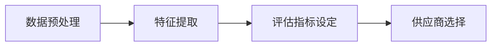
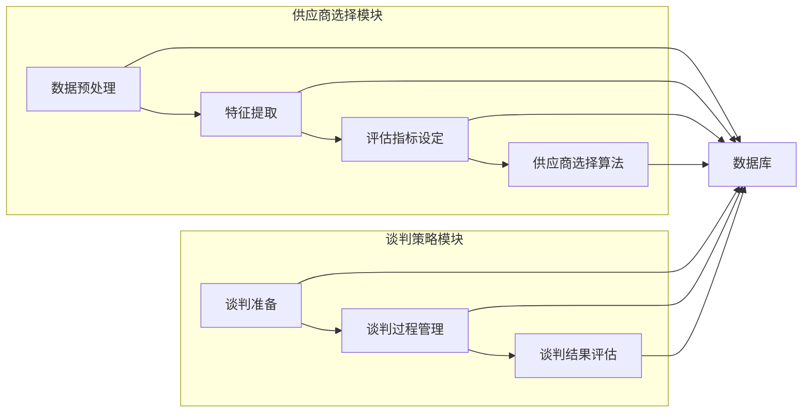
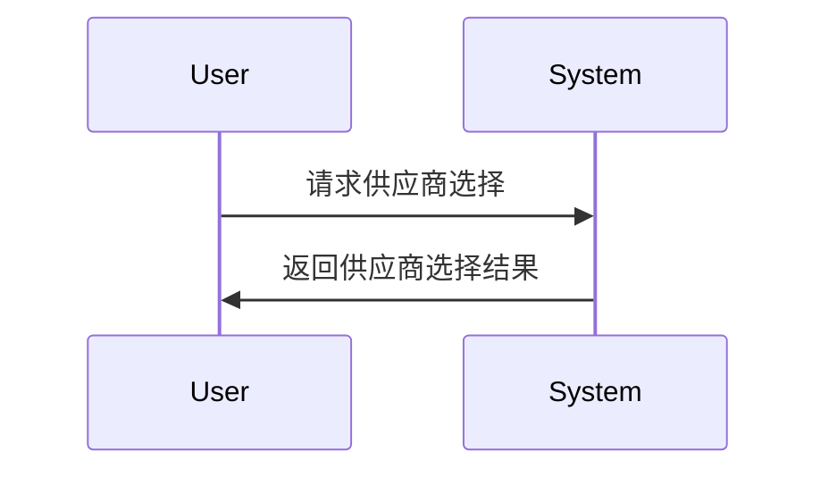
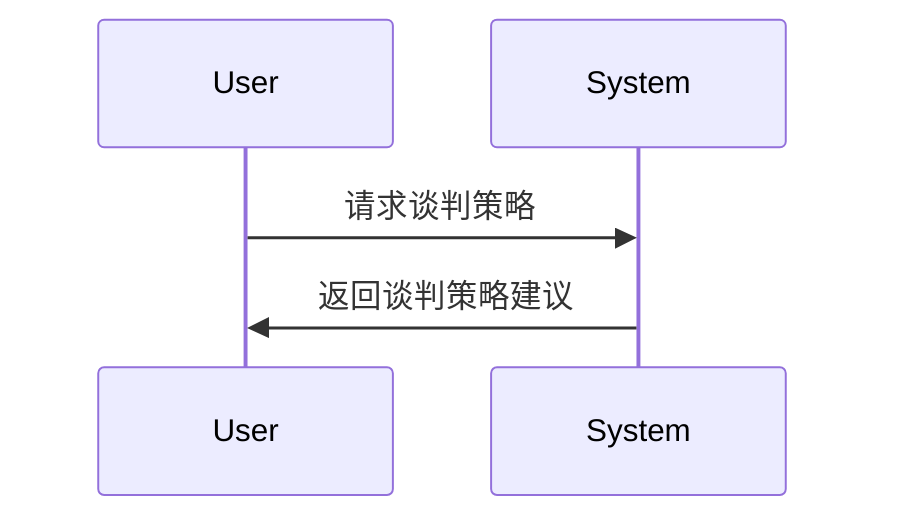

                 

# 构建企业级AI采购助手：优化供应商选择与谈判

关键词：企业级AI采购助手、供应商选择、谈判策略、优化算法、系统架构

摘要：随着企业信息化和智能化水平的不断提升，人工智能（AI）技术在采购管理中的应用愈发受到关注。本文旨在探讨如何构建企业级AI采购助手，特别是优化供应商选择与谈判流程，以提高采购效率和决策质量。

### 第一部分：引言与背景

#### 第1章：企业级AI采购助手概述

##### 1.1 问题背景

在现代企业的运营中，采购管理是一个关键环节，涉及到供应商选择、价格谈判、合同管理等多个方面。传统的采购方式主要依赖人工经验，存在信息不对称、谈判效率低、决策质量不稳定等问题。随着大数据和人工智能技术的发展，利用AI技术优化采购流程，提高采购决策的准确性和效率，成为企业提升竞争力的一个重要方向。

##### 1.2 问题描述

- **供应商选择**：如何从众多供应商中筛选出最适合企业需求的供应商？
- **谈判策略**：如何通过智能化的谈判策略，提高采购谈判的成功率和效益？

##### 1.3 问题解决

- **AI采购助手架构设计**：构建一个集供应商选择与谈判于一体的AI采购助手系统。
- **AI谈判助手功能实现**：设计实现智能化的谈判策略和决策支持系统。

##### 1.4 边界与外延

- **应用范围**：主要针对大规模企业或供应链管理复杂的行业。
- **适用场景**：涉及多供应商选择的采购决策场景，特别是价值较高的采购项目。

##### 1.5 核心概念与联系

###### 1.5.1 供应商选择模型

- **数据预处理**：清洗和整合供应商相关数据。
- **特征提取**：从数据中提取供应商的关键特征。
- **评估指标设定**：定义评估供应商的指标体系。

###### 1.5.2 谈判策略

- **谈判准备**：收集谈判相关的信息和资料。
- **谈判过程**：智能化的谈判过程管理。
- **谈判结果评估**：评估谈判效果，为后续谈判提供参考。

### 第二部分：核心概念原理

#### 第2章：核心概念原理

##### 2.1 供应商选择模型原理

###### 2.1.1 概念属性特征对比表格

| 特征 | 定义 | 作用 |
| --- | --- | --- |
| 供应商信誉 | 对供应商历史表现的评价 | 影响选择偏好 |
| 产品质量 | 对产品品质的评价 | 决定采购决策 |
| 价格竞争力 | 供应商提供的价格优势 | 影响谈判策略 |

###### 2.1.2 供应商选择ER实体关系图

```mermaid
erDiagram
  Supplier ||--|{ Product } Product
  Product ||--|{ Contract } Contract
  Contract ||--|{ PurchaseOrder } PurchaseOrder
```

##### 2.2 谈判策略原理

###### 2.2.1 概念属性特征对比表格

| 特征 | 定义 | 作用 |
| --- | --- | --- |
| 谈判准备 | 对谈判内容和策略的准备工作 | 影响谈判效果 |
| 谈判过程 | 谈判双方互动的过程 | 决定谈判结果 |
| 谈判结果评估 | 对谈判效果的评估 | 改进谈判策略 |

###### 2.2.2 谈判策略ER实体关系图

```mermaid
erDiagram
  Negotiator ||--|{ NegotiationStrategy } NegotiationStrategy
  NegotiationStrategy ||--|{ NegotiationProcess } NegotiationProcess
  NegotiationProcess ||--|{ NegotiationResult } NegotiationResult
```

### 第三部分：算法原理与数学模型

#### 第3章：供应商选择算法

##### 3.1 算法原理

###### 3.1.1 算法流程图



###### 3.1.2 Python源代码实现

```python
# Python 代码示例：供应商选择算法
# ...
```

###### 3.1.3 数学模型与公式

$$
\text{选择得分} = w_1 \cdot \text{信誉得分} + w_2 \cdot \text{质量得分} + w_3 \cdot \text{价格得分}
$$

##### 3.2 供应商选择案例分析

###### 3.2.1 案例背景

- 某企业面临多个供应商选择

###### 3.2.2 案例分析

- 利用供应商选择算法进行筛选

###### 3.2.3 案例结果

- 筛选出最优供应商

### 第四部分：系统架构与实现

#### 第4章：系统架构设计

##### 4.1 问题场景介绍

- 企业采购管理中的供应商选择与谈判问题

##### 4.2 系统功能设计

###### 4.2.1 领域模型类图

```mermaid
classDiagram
  Supplier <<Entity>>
  Product <<Entity>>
  Contract <<Entity>>
  PurchaseOrder <<Entity>>
```

##### 4.3 系统架构设计

###### 4.3.1 系统架构图



##### 4.4 系统接口设计与系统交互

###### 4.4.1 系统接口设计



###### 4.4.2 系统交互序列图



### 第五部分：项目实战

#### 第5章：项目实战

##### 5.1 环境安装与配置

- 硬件环境要求
- 软件环境安装

##### 5.2 系统核心实现

- 供应商选择模块代码实现
- 谈判策略模块代码实现

##### 5.3 代码应用解读与分析

- 源代码功能解读
- 系统核心逻辑分析

##### 5.4 实际案例分析

- 某企业采购案例背景
- AI采购助手应用效果分析

##### 5.5 项目小结

- 项目成果总结
- 经验与反思

### 第六部分：最佳实践与拓展

#### 第6章：最佳实践与拓展

##### 6.1 最佳实践

- 供应商选择与谈判的优化策略
- 系统实施与维护的建议

##### 6.2 小结

- 文章总结
- 未来的研究方向

##### 6.3 注意事项

- 技术实现中的潜在问题
- 使用中的注意事项

##### 6.4 拓展阅读

- 相关领域的研究进展
- 推荐阅读材料

### 结束语

作者：AI天才研究院/AI Genius Institute & 禅与计算机程序设计艺术 /Zen And The Art of Computer Programming

在本文中，我们系统地探讨了如何构建企业级AI采购助手，以优化供应商选择与谈判流程。通过引入先进的AI技术和算法，我们提出了一套完整的解决方案，不仅提高了采购决策的准确性和效率，也为企业的采购管理带来了新的变革。未来，随着AI技术的不断进步，AI采购助手将在更多行业和场景中得到广泛应用，为企业创造更大的价值。

----------------------------------------------------------------

**注意**：以上内容仅为文章结构和内容的示例，具体内容需要根据实际研究或项目经验进行撰写和填充。每章、节的内容都需要详细展开，以确保文章的完整性和深度。同时，代码示例、公式、流程图等需要根据实际应用进行编写和调整。文章的结构和内容要确保逻辑清晰、条理分明，以帮助读者更好地理解和掌握核心概念和关键技术。作者信息需要放在文章的最后，以便读者了解文章的出处和作者背景。

