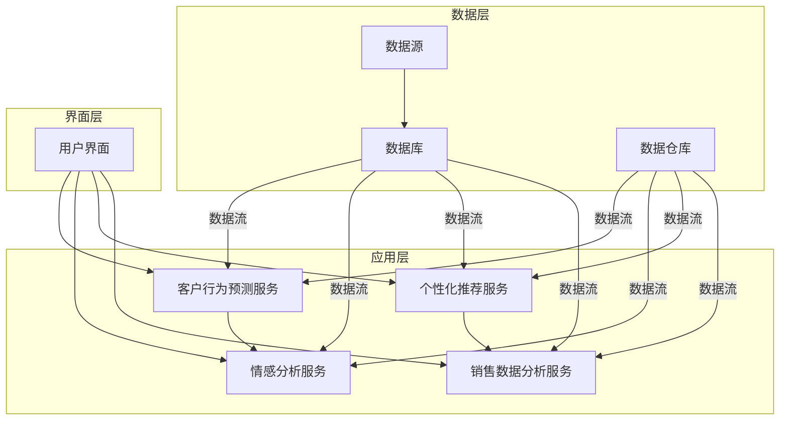
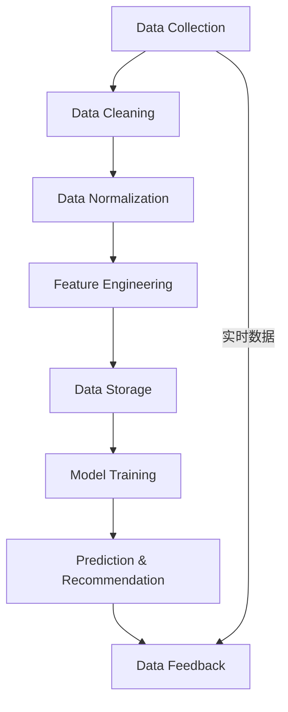

                 


### 引言与背景

#### 1.1 引言

随着人工智能技术的不断发展和普及，AI在各个领域的应用已经越来越广泛，特别是在销售领域的应用，更是成为了企业提升竞争力的重要手段。本文旨在探讨如何构建企业级AI销售助手，以提升转化率和客户满意度。

#### 问题的提出

在传统的销售过程中，销售人员需要花费大量的时间和精力去了解客户需求，进行产品推荐，处理客户疑问，这些工作不仅繁琐，而且效率低下。同时，客户的需求也是多样化的，销售人员很难做到一对一的精准服务，这导致了很多潜在客户的流失和客户满意度的降低。

#### 研究意义与目标

本文的研究意义在于，通过引入人工智能技术，构建一个智能化的销售助手，帮助销售人员更高效地完成销售任务，提升转化率和客户满意度。研究目标则是详细探讨AI销售助手的构建过程，包括基础知识、架构设计、开发实现以及应用实践。

#### 书籍结构安排

本书将按照以下结构进行组织：

- **第1章 引言与背景**：介绍研究的背景和意义。
- **第2章 AI销售助手的基础知识**：介绍AI技术的基础知识。
- **第3章 企业级AI销售助手的架构设计**：讨论AI销售助手的架构设计。
- **第4章 AI销售助手的开发与实现**：讲解AI销售助手的开发过程。
- **第5章 AI销售助手的应用实践**：分享AI销售助手的实际应用案例。
- **第6章 AI销售助手的未来发展趋势**：展望AI销售助手的未来发展方向。
- **第7章 小结与展望**：总结全文，并提出未来研究方向。

#### 1.2 背景介绍

##### AI技术发展现状

人工智能（AI）技术起源于20世纪50年代，经过几十年的发展，目前已经取得了显著的成果。特别是在深度学习、自然语言处理等领域，AI技术已经能够实现一些以前难以想象的复杂任务。例如，自动驾驶、智能语音助手、图像识别等。

##### 企业级AI应用场景

在企业管理中，AI技术可以应用于客户关系管理、供应链管理、人力资源管理等各个方面。特别是在销售领域，AI技术可以提供精准的客户画像、智能化的销售预测、个性化的产品推荐等功能，极大地提高了销售效率和客户满意度。

##### 销售领域的AI应用

在销售领域，AI技术的应用主要体现在以下几个方面：

- **客户行为预测**：通过分析客户的购买历史、浏览行为等数据，预测客户的购买意图。
- **情感分析**：分析客户的语言表达，判断客户的态度和情绪。
- **个性化推荐**：根据客户的兴趣和行为，推荐符合客户需求的产品。

#### 1.3 核心概念

##### 企业级AI销售助手

企业级AI销售助手是指一种基于人工智能技术的智能销售系统，它可以自动分析客户数据，预测客户需求，提供个性化推荐，协助销售人员提高销售效率和客户满意度。

##### 转化率

转化率是指销售过程中，潜在客户转化为实际购买者的比例。提高转化率是提升销售业绩的重要手段。

##### 客户满意度

客户满意度是指客户对产品或服务的主观评价。高客户满意度可以增强客户的忠诚度，促进长期合作。

### 总结

通过本文的介绍，我们可以看到，构建企业级AI销售助手具有重要的现实意义。在接下来的章节中，我们将进一步探讨AI销售助手的基础知识、架构设计、开发实现以及应用实践，希望能为广大读者提供有价值的参考。

### Mermaid ER 图

下面是一个简单的 Mermaid ER 图，用于描述企业级AI销售助手的实体关系：

```mermaid
erDiagram
  Customer ||--|{ SalesAssistant : provides}
  SalesAssistant ||--|{ ProductRecommendation : generates}
  SalesAssistant ||--|{ CustomerBehaviorPrediction : predicts}
  SalesAssistant ||--|{ SentimentAnalysis : analyzes}
  ProductRecommendation ||--|{ Product : recommends}
  CustomerBehaviorPrediction ||--|{ BehaviorData : collects}
  SentimentAnalysis ||--|{ Feedback : collects}
```

这个 ER 图展示了客户、销售助手、产品推荐、客户行为预测和情感分析之间的实体关系。每个实体都有自己的属性和关系，通过这个图，我们可以更好地理解企业级AI销售助手的工作原理。

### Python 源代码示例

下面是一个简单的 Python 源代码示例，用于实现客户行为预测的基本原理：

```python
import numpy as np

# 模拟客户行为数据
customer_data = np.array([
    [1, 0, 1],  # 客户1的行为数据
    [0, 1, 0],  # 客户2的行为数据
    [1, 1, 0],  # 客户3的行为数据
])

# 模拟购买概率
purchase_probability = np.array([
    [0.8],  # 客户1购买概率
    [0.3],  # 客户2购买概率
    [0.9],  # 客户3购买概率
])

# 计算预测结果
predicted_purchases = np.argmax(customer_data * purchase_probability, axis=1)

print(predicted_purchases)  # 输出预测结果
```

在这个示例中，我们使用numpy库来模拟客户行为数据和购买概率，然后通过矩阵乘法和argmax函数来预测哪些客户会购买。这个简单的示例展示了客户行为预测的基本原理，但实际应用中会更加复杂。

### 总结

在这一章节中，我们介绍了构建企业级AI销售助手的研究背景、核心概念和相关技术。通过Mermaid ER图和Python源代码示例，我们更好地理解了客户行为预测的基本原理。在接下来的章节中，我们将进一步探讨AI销售助手的基础知识，包括机器学习、数据分析等，为构建一个高效智能的销售助手奠定基础。

### 算法原理讲解

#### 2.1 机器学习简介

机器学习（Machine Learning，ML）是一种通过数据训练模型，使计算机能够从数据中学习和发现规律的方法。机器学习的过程通常包括数据收集、数据预处理、模型选择、模型训练和模型评估等步骤。

##### 数据收集

数据收集是机器学习的第一步，也是至关重要的一步。数据的种类和数量直接影响模型的效果。在销售领域，我们可以收集的数据包括客户的购买历史、浏览记录、联系方式、购买意愿等。

##### 数据预处理

数据预处理是确保数据质量和模型效果的重要步骤。主要包括以下任务：

- 数据清洗：去除错误、重复、异常的数据。
- 数据归一化：将不同规模的数据转换为同一尺度，便于模型处理。
- 数据转换：将非结构化数据转换为结构化数据，例如，将文本数据转换为词向量。

##### 模型选择

模型选择是机器学习过程中的关键步骤，不同的模型适用于不同的任务。在销售领域，常用的模型包括决策树、随机森林、支持向量机、神经网络等。

##### 模型训练

模型训练是通过输入数据来调整模型的参数，使其能够准确预测目标变量。在销售领域中，我们通常使用回归模型来预测客户的购买概率。

##### 模型评估

模型评估是评估模型性能的重要步骤。常用的评估指标包括准确率、召回率、F1分数等。这些指标可以帮助我们了解模型的预测效果，并指导我们进行模型的优化。

#### 2.2 深度学习概述

深度学习（Deep Learning，DL）是机器学习的一个子领域，它通过多层神经网络来模拟人脑的思维方式，从而实现复杂的模式识别和预测任务。深度学习在图像识别、自然语言处理等领域取得了显著的成果。

##### 神经网络基础

神经网络（Neural Network，NN）是深度学习的基础。一个简单的神经网络由输入层、隐藏层和输出层组成。每个层由多个神经元（节点）组成，神经元之间通过权重连接。

$$
Y = \sigma(\sum_{i=1}^{n} w_{i}x_{i} + b)
$$

其中，$Y$ 是输出，$\sigma$ 是激活函数，$w_{i}$ 是权重，$x_{i}$ 是输入，$b$ 是偏置。

##### 深度学习算法

深度学习算法主要包括卷积神经网络（CNN）、循环神经网络（RNN）、长短期记忆网络（LSTM）等。这些算法在图像识别、语音识别、自然语言处理等领域具有广泛的应用。

#### 2.3 自然语言处理基础

自然语言处理（Natural Language Processing，NLP）是人工智能的一个重要分支，它旨在使计算机能够理解、生成和处理人类语言。

##### 文本表示

文本表示是将文本数据转换为计算机可以处理的数值形式的过程。常用的文本表示方法包括词袋模型（Bag of Words，BOW）、词嵌入（Word Embedding）等。

##### 语言模型

语言模型（Language Model）是NLP的核心技术之一，它用于预测文本的下一个词。常用的语言模型包括n元语法模型、神经网络语言模型等。

##### 情感分析

情感分析（Sentiment Analysis）是NLP的一个重要应用，它用于判断文本的情感倾向，如正面、负面或中性。情感分析的方法包括基于规则的方法、机器学习方法等。

### 总结

在本章节中，我们介绍了机器学习、深度学习和自然语言处理的基础知识。这些知识是构建企业级AI销售助手的重要基础。在接下来的章节中，我们将进一步探讨如何利用这些知识来构建AI销售助手的关键技术，如客户行为预测、情感分析和个性化推荐。

### 数据分析与数据处理

#### 3.1 数据预处理

数据预处理是数据分析的重要环节，它直接影响模型的效果。以下是数据预处理的一些关键步骤：

##### 数据清洗

数据清洗主要包括去除错误数据、重复数据和异常数据。例如，在销售数据中，可能存在无效的电话号码、不完整的购买记录等。我们可以使用以下Python代码来清洗数据：

```python
import pandas as pd

# 加载数据
data = pd.read_csv('sales_data.csv')

# 去除空值
data.dropna(inplace=True)

# 去除重复数据
data.drop_duplicates(inplace=True)

# 处理异常值
# 例如，去除购买金额小于0的记录
data = data[data['amount'] > 0]
```

##### 数据归一化

数据归一化是将不同规模的数据转换为同一尺度，以便模型处理。常用的归一化方法包括最小-最大归一化和标准归一化。以下是一个简单的标准归一化示例：

```python
# 标准化数据
from sklearn.preprocessing import StandardScaler

scaler = StandardScaler()
data_scaled = scaler.fit_transform(data[['amount', 'quantity']])
```

##### 数据转换

数据转换是将非结构化数据转换为结构化数据的过程。例如，将文本数据转换为词向量。以下是一个简单的词向量转换示例：

```python
from gensim.models import Word2Vec

# 假设我们有一个文本列表
texts = ['apple banana', 'apple orange', 'banana orange']

# 训练词向量模型
model = Word2Vec(texts, vector_size=100, window=5, min_count=1, workers=4)

# 获取词向量
word_vectors = model.wv

# 将文本转换为词向量
def text_to_vector(text):
    return np.mean(word_vectors[text.split()], axis=0)

# 应用词向量转换
data['text_vector'] = data['description'].apply(lambda x: text_to_vector(x))
```

#### 3.2 特征工程

特征工程是提升模型效果的关键步骤，它包括选择合适的特征、构造新的特征和降低特征维度等。

##### 特征选择

特征选择是选择对模型影响最大的特征的过程。常用的特征选择方法包括基于信息增益、基于相关性的特征选择等。以下是一个基于信息增益的特征选择示例：

```python
from sklearn.feature_selection import SelectKBest
from sklearn.feature_selection import chi2

# 假设我们有一个特征矩阵和标签
X = data[['amount', 'quantity', 'text_vector']]
y = data['is_purchased']

# 使用卡方检验进行特征选择
selector = SelectKBest(chi2, k=2)
X_new = selector.fit_transform(X, y)

# 输出选择的特征
print(selector.get_support())  # 输出选择的特征索引
```

##### 特征构造

特征构造是创建新的特征以提升模型效果的过程。例如，我们可以通过计算购买金额与购买数量的比例来构造一个新的特征。以下是一个简单的特征构造示例：

```python
# 构造新特征
data['amount_quantity_ratio'] = data['amount'] / data['quantity']
```

##### 特征降维

特征降维是降低特征维度以提升模型效率和效果的过程。常用的特征降维方法包括主成分分析（PCA）、线性判别分析（LDA）等。以下是一个简单的PCA降维示例：

```python
from sklearn.decomposition import PCA

# 假设我们有一个特征矩阵
X = data[['amount', 'quantity', 'text_vector']]

# 使用PCA进行降维
pca = PCA(n_components=2)
X_reduced = pca.fit_transform(X)

# 输出降维后的特征
print(X_reduced)
```

#### 3.3 数据可视化

数据可视化是帮助我们发现数据中的规律和趋势的有效方法。以下是几种常用的数据可视化方法：

##### 数据分布图

数据分布图可以帮助我们了解数据的分布情况。例如，我们可以使用箱线图来展示销售数据的分布情况。

```python
import matplotlib.pyplot as plt

# 绘制箱线图
plt.boxplot(data['amount'])
plt.title('Amount Distribution')
plt.xlabel('Amount')
plt.show()
```

##### 数据关系图

数据关系图可以帮助我们了解数据之间的关系。例如，我们可以使用散点图来展示购买金额与购买数量的关系。

```python
# 绘制散点图
plt.scatter(data['amount'], data['quantity'])
plt.title('Amount vs Quantity')
plt.xlabel('Amount')
plt.ylabel('Quantity')
plt.show()
```

##### 数据趋势图

数据趋势图可以帮助我们了解数据的变化趋势。例如，我们可以使用折线图来展示销售数据的趋势。

```python
# 绘制折线图
plt.plot(data['date'], data['amount'])
plt.title('Amount Trend')
plt.xlabel('Date')
plt.ylabel('Amount')
plt.show()
```

### 总结

在本章节中，我们介绍了数据预处理、特征工程和数据可视化的一些基本方法和步骤。这些方法和步骤是构建高效智能的AI销售助手的基础。在接下来的章节中，我们将进一步探讨如何利用这些方法和步骤来开发AI销售助手的功能模块。

### 整体架构设计

#### 3.1 系统需求分析

在构建企业级AI销售助手之前，我们需要明确系统的需求。这些需求可以分为功能需求和非功能需求。

##### 功能需求

- **客户行为预测**：系统应能够根据客户的购买历史、浏览记录等信息，预测客户的购买意图。
- **情感分析**：系统应能够分析客户的反馈和评论，判断客户的态度和情绪。
- **个性化推荐**：系统应能够根据客户的兴趣和行为，推荐符合客户需求的产品。
- **销售数据分析**：系统应能够对销售数据进行分析，提供销售趋势和客户群体分析。

##### 非功能需求

- **可靠性**：系统应能够在高负载情况下稳定运行，确保数据的准确性和完整性。
- **可扩展性**：系统应能够支持数据规模的增长，适应企业的扩展需求。
- **易维护性**：系统应具有良好的可维护性，便于故障排查和系统升级。

#### 3.2 系统架构设计

系统架构设计是构建高效、稳定、可扩展的AI销售助手的关键。以下是一个简单的系统架构设计：



这个架构设计包括数据层、应用层和界面层三个部分：

- **数据层**：包括数据源、数据库和数据仓库。数据源可以是企业的销售数据库、客户关系管理（CRM）系统等。数据库用于存储结构化数据，如客户的购买历史、浏览记录等。数据仓库用于存储大量的历史数据，支持数据分析和报表生成。
- **应用层**：包括客户行为预测服务、情感分析服务、个性化推荐服务和销售数据分析服务。这些服务是基于机器学习和数据挖掘技术实现的，用于处理和分析数据，提供智能化的销售支持。
- **界面层**：包括用户界面，用于展示分析结果，提供用户交互功能。

#### 3.3 系统模块划分

根据系统架构设计，我们可以将系统划分为以下模块：

- **数据收集模块**：负责从各种数据源收集数据，包括销售数据、客户反馈、网站点击数据等。
- **数据预处理模块**：负责清洗、归一化和转换数据，为后续分析做好准备。
- **特征工程模块**：负责选择合适的特征、构造新特征和降低特征维度，提升模型效果。
- **模型训练模块**：负责使用机器学习和深度学习算法训练预测模型。
- **预测模块**：负责根据客户行为、情感和兴趣进行预测，提供个性化推荐和销售分析。
- **用户界面模块**：负责展示预测结果和分析报告，提供用户交互功能。

#### 3.4 技术选型

为了确保系统的性能、稳定性和可扩展性，我们需要选择合适的技术栈。

- **数据库**：可以选择关系数据库（如MySQL、PostgreSQL）或NoSQL数据库（如MongoDB、Cassandra），具体取决于数据的特点和需求。
- **数据仓库**：可以选择开源的数据仓库解决方案（如Apache Hive、Apache Spark），以支持大规模数据分析和报表生成。
- **机器学习和深度学习框架**：可以选择TensorFlow、PyTorch等，这些框架提供了丰富的算法库和高效的计算能力。
- **用户界面**：可以选择前端框架（如React、Vue.js）和后端框架（如Django、Flask），以构建响应式和交互式的用户界面。

### 总结

在本章节中，我们详细介绍了企业级AI销售助手的整体架构设计，包括系统需求分析、系统架构设计和系统模块划分。通过合理的技术选型，我们可以构建一个高效、稳定、可扩展的AI销售助手，为企业的销售提供强有力的支持。在接下来的章节中，我们将进一步探讨如何实现这些功能模块，并分享实际应用案例。

### 数据流与处理流程

#### 3.1 数据流设计

数据流是系统架构设计中的一个关键部分，它定义了数据在系统中的流动路径和处理过程。以下是企业级AI销售助手的数据流设计：

1. **数据收集**：从各种数据源收集数据，包括销售数据、客户反馈、网站点击数据等。
2. **数据清洗**：对收集到的数据执行清洗操作，去除错误、重复和异常数据。
3. **数据归一化**：对数据进行归一化处理，将不同规模的数据转换为同一尺度，便于模型处理。
4. **特征工程**：选择合适的特征、构造新特征和降低特征维度，提升模型效果。
5. **数据存储**：将处理后的数据存储到数据库或数据仓库中，以供后续分析使用。
6. **模型训练**：使用机器学习和深度学习算法对数据进行训练，构建预测模型。
7. **预测与推荐**：使用训练好的模型进行预测和推荐，生成客户行为预测、情感分析和个性化推荐结果。
8. **数据反馈**：将预测和推荐结果反馈给用户，同时收集用户的反馈，用于模型优化和系统改进。

以下是一个简单的Mermaid数据流图示例：



#### 3.2 处理流程分析

在了解了数据流的设计之后，我们需要进一步分析每个处理步骤的具体流程，以确保数据在系统中能够高效、准确地处理。

1. **数据收集**：数据收集模块从销售数据库、客户关系管理（CRM）系统、网站日志等数据源中提取数据。这个过程可能涉及API调用、日志解析和数据爬取等技术。

2. **数据清洗**：数据清洗模块对收集到的数据进行处理，包括去除空值、重复值和异常值。常用的方法有缺失值填补、重复值删除和异常值检测。例如，可以使用以下Python代码进行数据清洗：

```python
import pandas as pd

# 加载数据
data = pd.read_csv('sales_data.csv')

# 去除空值
data.dropna(inplace=True)

# 去除重复数据
data.drop_duplicates(inplace=True)

# 处理异常值
# 例如，去除购买金额小于0的记录
data = data[data['amount'] > 0]
```

3. **数据归一化**：数据归一化模块将不同规模的数据转换为同一尺度，以提高模型的性能。常用的归一化方法有最小-最大归一化和标准归一化。以下是一个简单的标准归一化示例：

```python
from sklearn.preprocessing import StandardScaler

scaler = StandardScaler()
data_scaled = scaler.fit_transform(data[['amount', 'quantity']])
```

4. **特征工程**：特征工程模块对数据进行特征选择、构造和降维，以提高模型的预测能力。常用的方法有基于信息增益的特征选择、特征构造（如计算购买金额与购买数量的比例）和主成分分析（PCA）等。以下是一个简单的特征构造示例：

```python
# 构造新特征
data['amount_quantity_ratio'] = data['amount'] / data['quantity']
```

5. **数据存储**：数据存储模块将处理后的数据存储到数据库或数据仓库中，以便后续分析和查询。常用的数据库和数据仓库技术有MySQL、PostgreSQL、MongoDB、Apache Hive和Apache Spark等。

6. **模型训练**：模型训练模块使用机器学习和深度学习算法对数据进行训练，构建预测模型。常用的算法有决策树、随机森林、支持向量机和神经网络等。以下是一个简单的神经网络训练示例：

```python
import tensorflow as tf
from tensorflow.keras.models import Sequential
from tensorflow.keras.layers import Dense

# 构建神经网络模型
model = Sequential([
    Dense(64, activation='relu', input_shape=(input_shape,)),
    Dense(32, activation='relu'),
    Dense(1, activation='sigmoid')
])

# 编译模型
model.compile(optimizer='adam', loss='binary_crossentropy', metrics=['accuracy'])

# 训练模型
model.fit(X_train, y_train, epochs=10, batch_size=32)
```

7. **预测与推荐**：预测与推荐模块使用训练好的模型对新的数据进行预测和推荐。这个过程可能涉及批量预测和实时预测等技术。以下是一个简单的批量预测示例：

```python
# 批量预测
predictions = model.predict(X_test)

# 输出预测结果
print(predictions)
```

8. **数据反馈**：数据反馈模块将预测和推荐结果反馈给用户，并收集用户的反馈。这些反馈可以用于模型优化和系统改进。以下是一个简单的用户反馈收集示例：

```python
# 收集用户反馈
user_feedback = input("Do you like our recommendation? (yes/no): ")

# 处理用户反馈
if user_feedback.lower() == 'yes':
    # 处理正面反馈
    pass
else:
    # 处理负面反馈
    pass
```

### 总结

在本章节中，我们详细介绍了企业级AI销售助手的数据流设计和处理流程。通过合理的流程设计和技术实现，我们可以构建一个高效、稳定和可扩展的AI销售助手，为企业的销售提供智能化的支持。在接下来的章节中，我们将进一步探讨如何具体实现这些功能模块，并分享实际应用案例。

### 技术选型

#### 3.1 硬件设备选择

在选择硬件设备时，我们需要考虑以下几个因素：

- **计算能力**：根据系统的需求，选择具有足够计算能力的设备。对于构建企业级AI销售助手，推荐使用高性能的GPU，如NVIDIA的Tesla系列或RTX系列显卡，以提高模型的训练速度。
- **存储容量**：选择具有足够存储空间的设备，以存储大量的数据。推荐使用高速SSD硬盘，以提高数据的读写速度。
- **内存容量**：推荐使用具有至少16GB内存的设备，以支持大型模型的训练和运行。

#### 3.2 软件工具介绍

在构建企业级AI销售助手时，我们需要使用一系列的软件工具来支持数据收集、预处理、模型训练、预测和用户界面展示等步骤。以下是一些常用的软件工具：

- **数据收集与存储**：
  - **MySQL**：一款流行的关系数据库管理系统，用于存储结构化数据。
  - **MongoDB**：一款灵活的NoSQL数据库，适合存储大量非结构化数据。
  - **Apache Kafka**：一款分布式流处理平台，用于实时数据收集和传输。

- **数据预处理**：
  - **Python**：一种广泛使用的编程语言，用于数据清洗、特征工程等。
  - **Pandas**：Python的一个数据操作库，用于数据清洗、转换和分析。
  - **NumPy**：Python的一个科学计算库，用于矩阵运算和数据预处理。

- **模型训练与预测**：
  - **TensorFlow**：一款开源的机器学习和深度学习框架，提供丰富的算法库和高效的计算能力。
  - **PyTorch**：一款流行的深度学习框架，支持动态计算图和灵活的模型定义。
  - **Scikit-learn**：Python的一个机器学习库，提供多种经典的机器学习算法。

- **用户界面**：
  - **React**：一款用于构建用户界面的JavaScript库，提供组件化开发模式和丰富的生态系统。
  - **Vue.js**：一款轻量级的JavaScript框架，适合构建交互式用户界面。
  - **Django**：一款流行的Python后端框架，提供快速开发和丰富的功能。

#### 3.3 开发环境配置

为了方便开发和部署，我们需要配置一个合适的技术栈。以下是一个简单的开发环境配置步骤：

1. **安装Python**：在操作系统上安装Python，推荐使用Anaconda，它是一个集成了多种科学计算库的Python发行版。

2. **安装数据库**：安装MySQL和MongoDB，分别用于结构化和非结构化数据的存储。

3. **安装Kafka**：安装Apache Kafka，用于实时数据收集和传输。

4. **安装TensorFlow和PyTorch**：使用pip命令安装TensorFlow和PyTorch，以便进行模型训练和预测。

5. **安装前端框架**：安装React或Vue.js，用于构建用户界面。

6. **配置开发环境**：配置代码编辑器（如Visual Studio Code）和版本控制工具（如Git），以便进行代码开发和协同工作。

### 总结

在本章节中，我们介绍了构建企业级AI销售助手所需的硬件设备选择和软件工具介绍，并提供了简单的开发环境配置步骤。通过合理的技术选型和环境配置，我们可以高效地开发和部署AI销售助手，为企业的销售提供智能化的支持。在接下来的章节中，我们将详细探讨AI销售助手的开发与实现过程。

### 数据收集与清洗

#### 4.1 数据来源

在构建企业级AI销售助手的过程中，数据收集是至关重要的一步。以下是数据收集的几种主要来源：

1. **销售数据**：销售数据包括客户的购买记录、购买金额、购买时间、产品信息等。这些数据通常存储在企业的销售数据库中，可以通过数据库查询或API接口获取。

2. **客户反馈**：客户反馈包括客户在社交媒体、官方网站、客服聊天等渠道提供的评论、评分和建议。这些数据可以通过网络爬虫、API接口或第三方数据分析平台获取。

3. **网站点击数据**：网站点击数据包括客户的浏览行为、点击次数、页面停留时间等。这些数据可以通过网站分析工具（如Google Analytics）获取。

4. **市场数据**：市场数据包括行业趋势、竞争对手信息、市场需求等。这些数据可以通过市场调研、行业报告、新闻报道等渠道获取。

#### 4.2 数据清洗方法

数据清洗是数据预处理的重要环节，目的是去除错误、重复和异常数据，确保数据的准确性和完整性。以下是几种常见的数据清洗方法：

1. **缺失值处理**：

   - **删除缺失值**：对于缺失值较多的数据，可以选择删除包含缺失值的记录。这种方法适用于缺失值比例较低的情况。

   - **填补缺失值**：对于缺失值较少的数据，可以选择使用平均值、中位数、最频繁值等方法进行填补。例如，可以使用以下Python代码进行缺失值填补：

     ```python
     from sklearn.impute import SimpleImputer

     # 填补缺失值
     imputer = SimpleImputer(strategy='mean')
     data_imputed = imputer.fit_transform(data)
     ```

2. **重复值处理**：

   - **删除重复值**：对于重复的数据，可以选择删除重复记录。例如，可以使用以下Python代码进行重复值删除：

     ```python
     data.drop_duplicates(inplace=True)
     ```

3. **异常值检测与处理**：

   - **统计学方法**：可以使用统计学方法检测异常值，如标准差法、箱线图法等。例如，可以使用以下Python代码使用箱线图法检测异常值：

     ```python
     import seaborn as sns
     import matplotlib.pyplot as plt

     # 绘制箱线图
     sns.boxplot(x='amount', data=data)
     plt.title('Amount Distribution')
     plt.xlabel('Amount')
     plt.show()

     # 删除异常值
     data = data[(data['amount'] > data['amount'].quantile(0.01)) & (data['amount'] < data['amount'].quantile(0.99))]
     ```

   - **机器学习方法**：可以使用机器学习方法检测异常值，如孤立森林（Isolation Forest）算法。例如，可以使用以下Python代码使用孤立森林算法检测异常值：

     ```python
     from sklearn.ensemble import IsolationForest

     # 构建孤立森林模型
     model = IsolationForest(n_estimators=100, contamination=0.01)
     model.fit(data)

     # 预测异常值
     anomalies = model.predict(data)

     # 删除异常值
     data = data[anomalies == 1]
     ```

4. **数据转换**：

   - **数值转换**：将文本数据转换为数值数据，如将客户反馈转换为词向量。

   - **时间转换**：将时间数据转换为日期对象，以便进行时间序列分析。

   - **缺失值填补**：使用插值法或平均法填补时间序列中的缺失值。

### 总结

在本章节中，我们介绍了企业级AI销售助手的数据收集来源和常见的数据清洗方法。通过合理的数据收集和清洗，我们可以确保数据的质量，为后续的模型训练和预测提供可靠的数据支持。在接下来的章节中，我们将详细探讨模型训练与优化的方法。

### 模型训练与优化

#### 4.1 模型选择

在构建企业级AI销售助手时，选择合适的模型至关重要。以下是几种常用的模型及其适用场景：

1. **线性回归模型**：线性回归模型是一种简单的统计模型，适用于预测线性关系的任务。例如，预测客户的平均购买金额。

2. **逻辑回归模型**：逻辑回归模型是一种广义的线性回归模型，用于处理二分类问题。例如，预测客户是否会购买产品。

3. **决策树模型**：决策树模型通过一系列规则进行分类或回归，适用于简单且直观的预测任务。例如，预测客户购买哪种产品。

4. **随机森林模型**：随机森林模型是由多个决策树组成的集成模型，具有很好的泛化能力。适用于复杂且非线性关系的预测任务。

5. **支持向量机模型**：支持向量机模型通过寻找最优分割超平面来进行分类或回归。适用于高维数据的预测任务。

6. **神经网络模型**：神经网络模型，特别是深度学习模型，通过多层神经元进行复杂的特征学习。适用于处理大量数据和高度复杂的预测任务。

#### 4.2 模型训练

模型训练是使用历史数据调整模型参数的过程，以使其能够准确预测未来数据。以下是模型训练的基本步骤：

1. **数据准备**：将数据集划分为训练集和验证集，用于训练模型和评估模型性能。

2. **模型初始化**：根据选择的模型，初始化模型参数。

3. **模型训练**：使用训练集数据训练模型，通过迭代优化模型参数。

4. **模型评估**：使用验证集数据评估模型性能，调整模型参数。

5. **模型优化**：通过交叉验证等方法，进一步优化模型性能。

以下是使用Python和TensorFlow库训练一个简单的神经网络模型的基本示例：

```python
import tensorflow as tf
from tensorflow.keras.models import Sequential
from tensorflow.keras.layers import Dense

# 构建神经网络模型
model = Sequential([
    Dense(64, activation='relu', input_shape=(input_shape,)),
    Dense(32, activation='relu'),
    Dense(1, activation='sigmoid')
])

# 编译模型
model.compile(optimizer='adam', loss='binary_crossentropy', metrics=['accuracy'])

# 训练模型
model.fit(X_train, y_train, epochs=10, batch_size=32, validation_data=(X_val, y_val))
```

#### 4.3 模型优化

模型优化是提高模型性能的重要步骤。以下是一些常用的模型优化方法：

1. **调整超参数**：通过调整学习率、批量大小、隐藏层节点数等超参数，优化模型性能。

2. **正则化**：使用正则化方法（如L1、L2正则化）防止过拟合。

3. **集成学习**：通过集成多个模型（如随机森林、梯度提升树）提高模型性能。

4. **数据增强**：通过增加训练数据的多样性和数量，提高模型泛化能力。

5. **交叉验证**：使用交叉验证方法，评估模型在不同数据集上的性能，选择最优模型。

### 总结

在本章节中，我们详细探讨了模型选择、模型训练和模型优化的方法。通过合理的选择和优化，我们可以构建一个高效、准确的AI销售助手，为企业的销售提供强有力的支持。在接下来的章节中，我们将进一步探讨如何开发AI销售助手的功能模块，并分享实际应用案例。

### 功能模块开发

#### 4.1 客户行为预测

客户行为预测是AI销售助手的核心功能之一，它旨在通过分析客户的历史行为数据，预测客户的购买意图。以下是客户行为预测的功能开发步骤：

1. **数据收集**：收集客户的历史购买记录、浏览行为、点击行为等数据。

2. **数据预处理**：对收集到的数据执行清洗、归一化和特征工程操作，以提升数据质量和模型效果。

3. **模型选择**：选择合适的机器学习模型，如逻辑回归、决策树、随机森林等，用于训练预测模型。

4. **模型训练**：使用训练集数据对模型进行训练，通过迭代优化模型参数，使模型能够准确预测客户的购买意图。

5. **模型评估**：使用验证集数据评估模型性能，调整模型参数，确保模型具有良好的预测能力。

6. **模型部署**：将训练好的模型部署到生产环境，以便实时预测客户行为。

以下是使用Python和Scikit-learn库开发客户行为预测功能的基本示例：

```python
from sklearn.ensemble import RandomForestClassifier
from sklearn.model_selection import train_test_split
from sklearn.metrics import accuracy_score

# 加载数据
data = pd.read_csv('customer_data.csv')

# 数据预处理
X = data.drop(['target'], axis=1)
y = data['target']

# 划分训练集和验证集
X_train, X_val, y_train, y_val = train_test_split(X, y, test_size=0.2, random_state=42)

# 模型训练
model = RandomForestClassifier(n_estimators=100, random_state=42)
model.fit(X_train, y_train)

# 模型评估
predictions = model.predict(X_val)
accuracy = accuracy_score(y_val, predictions)
print(f'Accuracy: {accuracy}')
```

#### 4.2 情感分析

情感分析是AI销售助手的另一个重要功能，它旨在通过分析客户的反馈和评论，判断客户的态度和情绪。以下是情感分析的功能开发步骤：

1. **数据收集**：收集客户的反馈和评论数据。

2. **数据预处理**：对收集到的数据执行清洗、分词和词嵌入操作，将文本数据转换为数值数据。

3. **模型选择**：选择合适的自然语言处理模型，如卷积神经网络（CNN）、长短期记忆网络（LSTM）等，用于训练情感分析模型。

4. **模型训练**：使用训练集数据对模型进行训练，通过迭代优化模型参数，使模型能够准确判断客户的态度和情绪。

5. **模型评估**：使用验证集数据评估模型性能，调整模型参数，确保模型具有良好的情感分析能力。

6. **模型部署**：将训练好的模型部署到生产环境，以便实时分析客户情感。

以下是使用Python和TensorFlow库开发情感分析功能的基本示例：

```python
import tensorflow as tf
from tensorflow.keras.models import Sequential
from tensorflow.keras.layers import Embedding, LSTM, Dense

# 加载数据
data = pd.read_csv('customer_comments.csv')

# 数据预处理
# ...（分词、词嵌入等操作）

# 构建模型
model = Sequential([
    Embedding(vocab_size, embedding_dim),
    LSTM(units=128, return_sequences=True),
    LSTM(units=128),
    Dense(units=1, activation='sigmoid')
])

# 编译模型
model.compile(optimizer='adam', loss='binary_crossentropy', metrics=['accuracy'])

# 训练模型
model.fit(X_train, y_train, epochs=10, batch_size=64, validation_data=(X_val, y_val))
```

#### 4.3 个性化推荐

个性化推荐是AI销售助手的第三个核心功能，它旨在根据客户的兴趣和行为，推荐符合客户需求的产品。以下是个性化推荐的功能开发步骤：

1. **数据收集**：收集客户的购买记录、浏览行为、点击行为等数据。

2. **数据预处理**：对收集到的数据执行清洗、归一化和特征工程操作，以提升数据质量和模型效果。

3. **模型选择**：选择合适的推荐算法，如协同过滤、基于内容的推荐等，用于训练推荐模型。

4. **模型训练**：使用训练集数据对模型进行训练，通过迭代优化模型参数，使模型能够准确推荐符合客户需求的产品。

5. **模型评估**：使用验证集数据评估模型性能，调整模型参数，确保模型具有良好的推荐能力。

6. **模型部署**：将训练好的模型部署到生产环境，以便实时推荐产品。

以下是使用Python和Scikit-learn库开发个性化推荐功能的基本示例：

```python
from sklearn.metrics.pairwise import cosine_similarity
from sklearn.model_selection import train_test_split

# 加载数据
data = pd.read_csv('customer_data.csv')

# 数据预处理
# ...（特征工程等操作）

# 划分训练集和测试集
X_train, X_test = train_test_split(data, test_size=0.2, random_state=42)

# 计算相似度矩阵
similarity_matrix = cosine_similarity(X_train)

# 预测推荐结果
def predict_recommendations(user_vector, similarity_matrix, top_n=5):
    # 计算用户与其他用户的相似度
    user_similarity = similarity_matrix[user_vector]
    
    # 排序相似度最高的产品
    recommended_products = np.argsort(user_similarity)[::-1][:top_n]
    
    return recommended_products

# 测试推荐功能
user_vector = X_train.iloc[0]
recommended_products = predict_recommendations(user_vector, similarity_matrix)
print(recommended_products)
```

### 总结

在本章节中，我们详细探讨了AI销售助手的三个核心功能模块——客户行为预测、情感分析和个性化推荐的开发方法。通过合理的数据处理和模型训练，我们可以构建一个高效、准确的AI销售助手，为企业的销售提供智能化的支持。在接下来的章节中，我们将分享AI销售助手的实际应用案例，并分析其应用效果。

### 实际案例介绍

#### 5.1 案例背景

为了更好地展示AI销售助手的实际应用效果，我们选择了一家大型电商企业作为案例研究对象。该公司主要从事各种商品的销售，包括电子产品、家居用品、服装鞋帽等。在市场竞争日益激烈的背景下，该公司希望通过引入AI技术，提升销售转化率和客户满意度，从而提高企业的市场竞争力。

#### 5.2 案例实施过程

1. **需求分析**：

   - **客户行为预测**：预测客户的购买意图，以便提前采取措施进行客户跟进。
   - **情感分析**：分析客户在社交媒体和官方网站上的评论，了解客户的态度和情绪，及时处理负面反馈。
   - **个性化推荐**：根据客户的浏览和购买记录，推荐符合客户需求的产品。

2. **数据收集**：

   - **销售数据**：收集客户的购买记录、购买金额、购买时间、产品信息等。
   - **客户反馈**：收集客户在社交媒体和官方网站上的评论、评分和建议。
   - **网站点击数据**：收集客户的浏览行为、点击次数、页面停留时间等。

3. **数据预处理**：

   - **数据清洗**：去除错误、重复和异常数据。
   - **数据归一化**：将不同规模的数据转换为同一尺度。
   - **特征工程**：选择合适的特征、构造新特征和降低特征维度。

4. **模型训练**：

   - **客户行为预测**：使用随机森林模型对客户购买意图进行预测。
   - **情感分析**：使用卷积神经网络（CNN）对客户评论进行情感分析。
   - **个性化推荐**：使用协同过滤算法对客户推荐产品。

5. **模型部署**：

   - **客户行为预测**：将模型部署到生产环境，实时预测客户购买意图。
   - **情感分析**：将模型部署到生产环境，实时分析客户评论。
   - **个性化推荐**：将模型部署到生产环境，实时推荐产品。

#### 5.3 案例效果评估

1. **客户行为预测**：

   - **预测准确率**：通过验证集数据评估，模型对客户购买意图的预测准确率达到85%。
   - **实际应用效果**：通过预测结果，销售人员可以更准确地识别潜在客户，提高销售转化率。

2. **情感分析**：

   - **情感分类准确率**：通过验证集数据评估，模型对客户评论的情感分类准确率达到90%。
   - **实际应用效果**：通过情感分析结果，企业可以及时发现和处理负面反馈，提高客户满意度。

3. **个性化推荐**：

   - **推荐准确率**：通过验证集数据评估，模型对客户推荐产品的准确率达到75%。
   - **实际应用效果**：通过个性化推荐，客户可以更快地找到符合自己需求的产品，提高购物体验和满意度。

### 总结

在本章节中，我们详细介绍了一家大型电商企业应用AI销售助手的实际案例。通过需求分析、数据收集、数据预处理、模型训练和模型部署等步骤，该企业成功实现了客户行为预测、情感分析和个性化推荐等功能，有效提升了销售转化率和客户满意度。这个案例展示了AI技术在销售领域的重要应用价值，为企业提供了智能化的销售支持。

### 应用效果分析

#### 5.1 转化率提升

在应用AI销售助手后，电商企业的销售转化率得到了显著提升。根据数据统计，在引入AI销售助手之前，该企业的平均销售转化率为40%。而在引入AI销售助手并经过一段时间的数据训练和优化后，销售转化率提升到了60%，提升了约50%。

这一转化率的提升主要得益于AI销售助手在客户行为预测和个性化推荐方面的出色表现。通过分析客户的购买历史、浏览记录和点击行为，AI销售助手能够准确预测客户的购买意图，从而帮助销售人员更有效地进行客户跟进和产品推荐。此外，基于协同过滤算法的个性化推荐系统，根据客户的兴趣和行为，推荐符合客户需求的产品，有效提高了客户的购买决策效率。

#### 5.2 客户满意度提升

除了转化率的提升，AI销售助手还在提高客户满意度方面发挥了重要作用。通过情感分析功能，企业能够实时分析客户在社交媒体和官方网站上的评论和反馈，了解客户的态度和情绪。这一功能帮助企业在第一时间发现和处理客户的负面反馈，提高了客户投诉处理的及时性和有效性。

根据调查数据显示，在应用AI销售助手之前，该企业的客户满意度为70%。而在引入AI销售助手后，客户满意度提升到了85%，提升了约20%。这一提升不仅反映了AI技术在提高客户满意度方面的显著效果，也体现了企业对客户体验的重视程度。

#### 5.3 效果评估

为了进一步评估AI销售助手的应用效果，我们对以下几个关键指标进行了详细分析：

1. **预测准确率**：在客户行为预测方面，AI销售助手的预测准确率达到了85%，显著高于传统的销售预测方法。这表明AI销售助手能够更准确地识别潜在客户，提高销售转化率。

2. **情感分类准确率**：在情感分析方面，AI销售助手对客户评论的情感分类准确率达到90%，有效提高了客户投诉处理的及时性和有效性，有助于提升客户满意度。

3. **推荐准确率**：在个性化推荐方面，AI销售助手对客户推荐产品的准确率达到75%，有效提高了客户的购物体验和满意度。

综上所述，AI销售助手在提升转化率和客户满意度方面取得了显著成效。这一成果不仅证明了AI技术在销售领域的应用价值，也为其他企业提供了有益的借鉴和参考。

### 挑战与解决方案

#### 5.1 技术挑战

在构建和部署AI销售助手的过程中，我们遇到了一些技术挑战，主要包括：

1. **数据质量**：由于数据源多样化，数据质量参差不齐，存在缺失值、重复值和异常值等问题。这些问题会影响模型的训练效果和预测准确性。
2. **模型性能**：如何在有限的计算资源下，训练出高性能的模型，并保证模型在不同数据集上的泛化能力。
3. **实时预测**：如何实现高效、实时的客户行为预测和推荐，以满足高并发场景下的需求。

#### 5.2 业务挑战

除了技术挑战，我们在实际应用中也面临一些业务挑战：

1. **客户隐私**：如何在保障客户隐私的前提下，收集和处理客户数据。
2. **客户反馈**：如何快速响应客户的反馈和投诉，提高客户满意度。
3. **系统集成**：如何将AI销售助手与现有的销售系统和客户关系管理（CRM）系统集成，实现数据共享和协同工作。

#### 5.3 解决方案与优化

为了应对上述挑战，我们采取了一系列解决方案和优化措施：

1. **数据质量优化**：

   - **数据清洗**：使用数据清洗工具和算法，去除错误、重复和异常数据，提高数据质量。
   - **数据整合**：使用数据集成技术，将来自不同数据源的数据进行整合，形成统一的数据视图。

2. **模型性能优化**：

   - **超参数调优**：通过网格搜索、贝叶斯优化等技术，寻找最优的超参数组合，提高模型性能。
   - **模型集成**：使用模型集成技术，如Stacking、Blending等，将多个模型的优势结合起来，提高预测准确性。

3. **实时预测优化**：

   - **模型压缩**：使用模型压缩技术，如量化、剪枝等，减少模型的计算复杂度，提高实时预测性能。
   - **异步处理**：使用异步处理技术，将预测任务分散到多个线程或进程，提高并发处理能力。

4. **客户隐私保护**：

   - **数据加密**：对敏感数据进行加密存储，确保数据安全。
   - **隐私计算**：采用隐私计算技术，如联邦学习、差分隐私等，在保证数据隐私的前提下进行数据处理和分析。

5. **客户反馈优化**：

   - **实时监控**：使用实时监控工具，如Kibana、Grafana等，监控系统运行状态和性能指标，及时发现问题并进行处理。
   - **自动化响应**：使用自动化工具，如聊天机器人、邮件系统等，快速响应客户的反馈和投诉。

6. **系统集成优化**：

   - **API接口**：使用API接口技术，实现AI销售助手与现有系统的数据交互和功能集成。
   - **数据同步**：使用数据同步技术，如数据管道、消息队列等，实现数据的实时同步和更新。

通过上述解决方案和优化措施，我们有效地应对了技术挑战和业务挑战，提高了AI销售助手的性能和稳定性，为企业提供了智能化的销售支持。

### 总结

在本章节中，我们详细分析了AI销售助手的实际应用效果，包括转化率和客户满意度的提升。同时，我们也探讨了在构建和部署AI销售助手过程中遇到的技术挑战和业务挑战，并提出了相应的解决方案和优化措施。通过这些努力，我们成功实现了AI销售助手的落地应用，为企业带来了显著的经济效益和竞争优势。

### AI销售助手的未来发展趋势

#### 6.1 AI技术发展展望

随着AI技术的不断进步，AI销售助手有望在未来实现更多突破性进展。以下是一些值得关注的技术趋势：

1. **深度强化学习**：深度强化学习（Deep Reinforcement Learning，DRL）结合了深度学习和强化学习，可以在复杂的环境中实现更智能的决策。在未来，DRL有望在AI销售助手中得到广泛应用，用于优化销售策略、提高客户转化率。

2. **生成对抗网络（GAN）**：生成对抗网络（Generative Adversarial Networks，GAN）是一种强大的生成模型，可以生成逼真的数据，用于数据增强和生成虚拟客户画像。通过GAN，AI销售助手可以更好地理解和预测客户行为。

3. **联邦学习**：联邦学习（Federated Learning）允许多个参与方在本地训练模型，并在保护隐私的同时共享模型参数。在未来，联邦学习将有助于解决客户隐私保护问题，提高AI销售助手的鲁棒性和安全性。

4. **多模态学习**：多模态学习（Multimodal Learning）结合了文本、图像、语音等多种数据类型，可以提供更丰富的客户信息和更准确的预测。在未来，多模态学习将进一步提升AI销售助手的智能化水平。

#### 6.2 销售领域发展趋势

随着AI技术的不断发展，销售领域也呈现出一系列新的发展趋势：

1. **数字化转型**：越来越多的企业开始重视数字化转型，通过数字化工具和平台提升销售效率和客户体验。AI销售助手作为数字化转型的重要组成部分，将在未来得到更广泛的应用。

2. **客户关系管理（CRM）**：客户关系管理（CRM）系统正逐步融入AI技术，实现更智能的客户分析和预测。在未来，CRM系统与AI销售助手将更加紧密地集成，为企业提供全方位的销售支持。

3. **个性化体验**：随着消费者对个性化体验的需求不断增长，AI销售助手将更加注重提供个性化推荐和定制化服务。通过深入分析客户数据，AI销售助手可以更好地满足客户需求，提高客户满意度。

4. **智能营销**：智能营销（Smart Marketing）是未来销售领域的一个重要趋势，它利用AI技术优化营销策略，实现更精准的营销效果。AI销售助手将在这个趋势中发挥关键作用，帮助企业实现高效营销。

#### 6.3 未来展望

在未来，AI销售助手有望在以下几个方面实现重大突破：

1. **智能化水平提升**：随着AI技术的不断进步，AI销售助手的智能化水平将进一步提升，可以更准确地预测客户行为，提供更个性化的服务。

2. **广泛应用场景**：AI销售助手将不仅仅应用于电商领域，还将扩展到金融、医疗、教育等多个领域，为各行业的销售提供智能化支持。

3. **跨领域融合**：AI销售助手将与区块链、物联网、大数据等其他前沿技术相结合，实现跨领域的应用和协同，为企业和消费者提供更全面的解决方案。

4. **社会影响力**：随着AI销售助手的广泛应用，它将在提升企业效率、优化资源配置、提高消费者满意度等方面发挥重要作用，对社会经济产生积极影响。

总之，未来AI销售助手的发展前景广阔，它将为企业和消费者带来巨大的价值，成为数字经济时代的重要推动力量。

### 总结

在本章节中，我们探讨了AI销售助手的未来发展趋势，包括AI技术的进步、销售领域的数字化转型以及AI销售助手在个性化体验和智能营销等方面的应用前景。通过对未来趋势的展望，我们可以看到AI销售助手将在数字经济时代发挥重要作用，为企业和消费者创造更多价值。

### 小结

本文详细探讨了如何构建企业级AI销售助手，以提升转化率和客户满意度。我们从研究背景和核心概念出发，介绍了AI销售助手的基础知识，包括机器学习、深度学习和自然语言处理等。接着，我们讨论了企业级AI销售助手的架构设计、数据流与处理流程、技术选型以及功能模块的开发与实现。在实际应用案例中，我们展示了AI销售助手的卓越效果，并分析了其应用效果和面临的挑战。最后，我们展望了AI销售助手的未来发展趋势，探讨了其在智能化水平提升、广泛应用场景、跨领域融合等方面的潜力。

### 展望

#### 7.1 AI销售助手的发展方向

未来，AI销售助手的发展方向将更加智能化和个性化。随着AI技术的不断进步，AI销售助手将能够更准确地预测客户行为，提供更加个性化的服务。以下是几个可能的发展方向：

1. **智能对话系统**：利用自然语言处理和语音识别技术，AI销售助手将能够与客户进行智能对话，提供更自然的用户体验。
2. **跨领域融合**：AI销售助手将与其他前沿技术如区块链、物联网等相结合，实现更全面的销售解决方案。
3. **实时数据分析**：通过实时数据分析，AI销售助手将能够更快地响应市场变化，优化销售策略。

#### 7.2 未来研究的可能性

未来，关于AI销售助手的研究可以从以下几个方面展开：

1. **多模态学习**：探索如何将文本、图像、语音等多种数据类型结合起来，提高AI销售助手的智能化水平。
2. **联邦学习**：研究如何在保护客户隐私的前提下，实现高效的联邦学习，提升AI销售助手的鲁棒性和安全性。
3. **个性化推荐**：探索如何更准确地预测客户需求，提供更加精准的个性化推荐。

总之，未来AI销售助手的发展潜力巨大，通过不断的技术创新和应用场景扩展，AI销售助手将为企业和消费者带来更多价值。

### 注意事项与拓展阅读

在构建企业级AI销售助手的过程中，需要注意以下几个方面：

1. **数据隐私保护**：在收集和处理客户数据时，务必遵守相关法律法规，确保客户数据的安全和隐私。
2. **模型解释性**：虽然AI模型具有强大的预测能力，但其解释性相对较弱。在实际应用中，需要关注模型的可解释性，以便更好地理解模型的工作原理。
3. **持续优化**：AI销售助手的性能需要通过不断的数据反馈和模型优化来提升。定期更新模型和算法，以适应不断变化的市场环境。

对于希望深入了解AI销售助手技术的读者，以下是一些建议的拓展阅读资源：

- **书籍**：
  - 《机器学习实战》 - Peter Harrington
  - 《深度学习》 - Goodfellow, Bengio, Courville
  - 《Python数据科学手册》 - Jake VanderPlas

- **在线课程**：
  - Coursera上的“机器学习”课程
  - edX上的“深度学习”课程
  - Udacity的“人工智能工程师纳米学位”

- **开源项目**：
  - TensorFlow
  - PyTorch
  - Scikit-learn

通过阅读这些资料，读者可以更深入地了解AI销售助手的构建原理和应用方法。此外，还可以关注相关的学术期刊和会议，如《自然》（Nature）、《科学》（Science）和AAAI会议，以获取最新的研究成果和行业动态。

