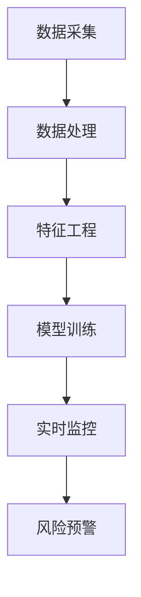
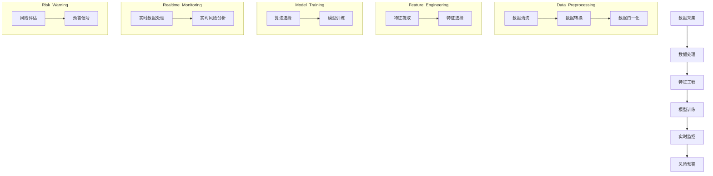
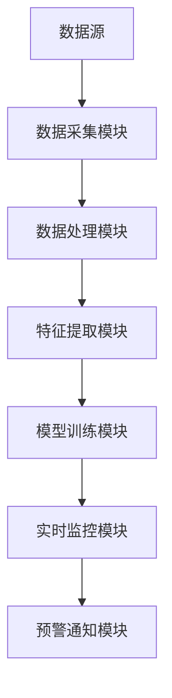
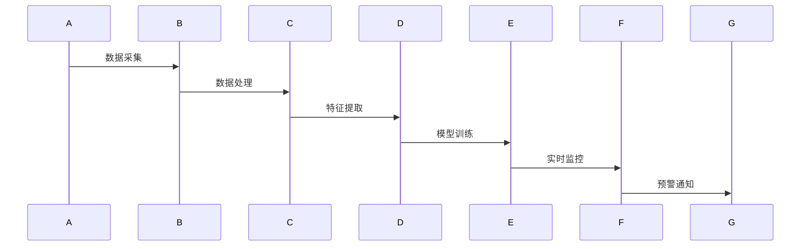

                 


## 引言

### 问题背景

在现代企业运营中，数据安全和风险控制已经成为企业可持续发展的重要组成部分。随着数字化转型的加速，企业面临着海量数据的高效处理与风险识别的挑战。传统的风控手段在处理速度、准确性和实时性上存在一定的局限性，无法满足日益复杂多变的市场环境。因此，构建企业级AI风控助手成为企业提升风险防控能力、保障业务稳定运行的关键。

企业级AI风控助手是一种利用人工智能技术，对企业的运营数据进行分析和预测，实现实时监控与风险预警的系统。其核心在于将机器学习算法、数据挖掘技术和实时数据处理能力相结合，通过模型训练和实时分析，为企业提供精准、高效的风险防控解决方案。

### 问题描述

在当前的市场环境下，企业需要解决的主要问题包括：

1. **实时监控**：如何快速准确地收集和分析企业运营数据，实现对风险的实时监控。
2. **风险预警**：如何基于数据分析，提前识别潜在的风险，并发出预警信号。
3. **风险应对**：如何制定有效的应对策略，降低风险对企业的影响。

### 问题解决

构建企业级AI风控助手，可以通过以下步骤实现：

1. **数据采集与预处理**：首先，需要从各种数据源中收集企业运营数据，并进行数据清洗和预处理，以保证数据的质量和一致性。
2. **特征工程**：对预处理后的数据进行分析，提取出对风控有用的特征，为后续的模型训练提供支持。
3. **模型训练**：选择合适的机器学习算法，对特征进行训练，构建风控模型。
4. **实时监控与预警**：将训练好的模型应用于实时数据流，进行风险监测和预警。
5. **决策支持**：根据预警结果，制定相应的风险应对策略，提供决策支持。

### 边界与外延

构建企业级AI风控助手不仅需要考虑技术层面的实现，还需关注以下几个方面：

1. **业务理解**：深入理解企业业务流程，确定风险点和关键指标。
2. **数据合规**：确保数据采集和使用符合相关法律法规，保护用户隐私。
3. **系统稳定性**：确保系统的稳定运行，降低故障风险。
4. **扩展性**：考虑系统的扩展性，以适应业务变化和规模增长。

### 概念结构与核心要素组成

企业级AI风控助手的核心结构包括：

1. **数据采集模块**：负责数据源的连接和数据收集。
2. **数据处理模块**：进行数据清洗、转换和特征提取。
3. **风险分析模块**：包含机器学习算法和风险预测模型。
4. **预警与决策模块**：根据风险分析结果，生成预警信息和应对策略。
5. **可视化与报告模块**：提供数据分析和风险报告的可视化展示。

## 核心概念与联系

### 数据驱动风控

数据驱动风控是一种基于数据分析和机器学习技术，对风险进行识别、评估和预警的方法。其核心在于利用大量历史数据和实时数据，通过机器学习算法建立风控模型，实现对企业运营风险的实时监控。

### 实时监控

实时监控是指通过技术手段，对企业的运营数据进行连续的、实时的监测和分析，以快速发现异常情况或潜在风险。

### 风险预警

风险预警是指基于实时监控和分析结果，提前识别出可能发生的风险，并发出预警信号，提醒决策者采取相应的措施。

### Mermaid流程图展示



### 算法原理讲解

#### 数据预处理算法

数据预处理是风控系统的第一步，主要包括数据清洗、数据转换和数据归一化等。其目的是消除噪声、缺失值和数据偏差，提高数据的质量。

#### 特征工程

特征工程是对原始数据进行处理，提取出对风控模型有用的特征。特征选择是特征工程的关键步骤，它通过筛选和选择重要的特征，提高模型的准确性和效率。

#### 模型选择与训练

模型选择与训练是风控系统的核心，选择合适的算法和参数，对特征进行训练，构建出有效的风控模型。

#### 实时监控算法

实时监控算法是基于训练好的模型，对实时数据进行处理和分析，以实现风险的实时监测。

#### 风险预警算法

风险预警算法是根据实时监控的结果，对潜在的风险进行评估和预警。

### Mermaid流程图与Python代码示例



```python
# 数据预处理示例代码
def data_preprocessing(data):
    # 数据清洗
    cleaned_data = clean_data(data)
    # 数据转换
    transformed_data = transform_data(cleaned_data)
    # 数据归一化
    normalized_data = normalize_data(transformed_data)
    return normalized_data

# 特征工程示例代码
def feature_engineering(data):
    # 特征提取
    extracted_features = extract_features(data)
    # 特征选择
    selected_features = select_features(extracted_features)
    return selected_features

# 模型训练示例代码
def model_training(features, labels):
    # 算法选择
    selected_algorithm = choose_algorithm()
    # 模型训练
    trained_model = selected_algorithm.fit(features, labels)
    return trained_model

# 实时监控与预警示例代码
def risk_warning(model, data):
    # 实时数据处理
    processed_data = process_data(data)
    # 风险评估
    risk_score = model.predict(processed_data)
    # 预警信号
    if risk_score > threshold:
        send_warning_signal()
```

### 数学模型和公式

#### 数据预处理

$$
\text{cleaned\_data} = \text{clean_data}(\text{data})
$$

$$
\text{transformed\_data} = \text{transform_data}(\text{cleaned\_data})
$$

$$
\text{normalized\_data} = \text{normalize_data}(\text{transformed\_data})
$$

#### 特征工程

$$
\text{extracted\_features} = \text{extract_features}(\text{data})
$$

$$
\text{selected\_features} = \text{select_features}(\text{extracted\_features})
$$

#### 模型训练

$$
\text{trained\_model} = \text{selected\_algorithm}.fit(\text{features}, \text{labels})
$$

#### 实时监控与预警

$$
\text{risk\_score} = \text{model}.predict(\text{processed\_data})
$$

$$
\text{send\_warning\_signal()} = \text{if} (\text{risk\_score} > \text{threshold})
$$

## 系统分析与架构设计方案

### 问题场景介绍

假设企业需要构建一个AI风控助手，以实时监控其财务报表数据，并针对异常交易发出预警。具体问题场景包括：

- **数据来源**：企业的财务报表系统
- **数据类型**：交易金额、交易时间、交易账户等
- **风险指标**：交易金额异常、交易时间异常等
- **预警策略**：当交易金额超过设定的阈值时，发出预警信号

### 系统功能设计

系统功能设计主要包括以下几个方面：

1. **数据采集**：从财务报表系统中定期采集交易数据。
2. **数据处理**：对采集到的数据进行清洗、转换和归一化处理。
3. **特征提取**：从处理后的数据中提取对风控模型有用的特征。
4. **模型训练**：使用提取的特征训练风控模型。
5. **实时监控**：对实时数据进行监控，识别异常交易。
6. **预警通知**：当发现异常交易时，向相关人员发送预警通知。

### 系统架构设计

系统架构设计如图所示：



### 系统接口设计

系统接口设计主要包括以下接口：

1. **数据采集接口**：用于从财务报表系统获取交易数据。
2. **数据处理接口**：用于对采集到的交易数据进行清洗、转换和归一化处理。
3. **特征提取接口**：用于从处理后的交易数据中提取特征。
4. **模型训练接口**：用于训练风控模型。
5. **实时监控接口**：用于实时监控交易数据。
6. **预警通知接口**：用于发送预警通知。

### 系统交互Mermaid序列图



## 项目实战

### 环境安装

在进行项目实战之前，需要安装必要的软件和工具。以下是环境安装步骤：

1. **安装Python**：确保Python版本为3.8以上。
2. **安装Jupyter Notebook**：用于数据分析和代码调试。
3. **安装机器学习库**：如scikit-learn、TensorFlow、Keras等。
4. **安装可视化库**：如Matplotlib、Seaborn等。

### 系统核心实现源代码

以下是系统核心实现的源代码示例：

```python
# 数据采集
def data_collection():
    # 代码实现
    pass

# 数据处理
def data_preprocessing(data):
    # 代码实现
    pass

# 特征提取
def feature_engineering(data):
    # 代码实现
    pass

# 模型训练
def model_training(features, labels):
    # 代码实现
    pass

# 实时监控
def real_time_monitoring(data):
    # 代码实现
    pass

# 预警通知
def warning_notification(message):
    # 代码实现
    pass
```

### 代码应用解读与分析

以下是代码应用的详细解读：

1. **数据采集**：通过数据采集函数，从财务报表系统中获取交易数据。
2. **数据处理**：对交易数据进行清洗、转换和归一化处理，提高数据质量。
3. **特征提取**：从处理后的交易数据中提取特征，为模型训练提供支持。
4. **模型训练**：使用提取的特征训练风控模型，建立风险预测模型。
5. **实时监控**：对实时数据进行监控，识别异常交易。
6. **预警通知**：当发现异常交易时，向相关人员发送预警通知。

### 实际案例分析与详细讲解

假设企业发现某次交易的金额异常，高于正常范围。以下是实际案例的分析和详细讲解：

1. **数据采集**：从财务报表系统中采集到交易数据，包括交易金额、交易时间、交易账户等信息。
2. **数据处理**：对交易数据进行分析，发现交易金额异常。
3. **特征提取**：提取交易金额、交易时间等特征，为模型训练提供支持。
4. **模型训练**：使用训练好的模型，对提取的特征进行预测，发现交易金额高于设定的阈值。
5. **实时监控**：识别出交易金额异常，触发实时监控。
6. **预警通知**：向相关人员发送预警通知，提醒他们关注此次交易。

### 项目小结

通过实际案例的分析，我们可以看到企业级AI风控助手在风险监控和预警方面具有重要的作用。在实际应用中，需要根据企业的具体需求和业务场景，进行系统设计和代码实现。同时，需要不断优化模型和算法，提高风险识别的准确性和实时性。

## 最佳实践 tips

### 数据质量优化

1. **数据清洗**：定期进行数据清洗，消除噪声和缺失值。
2. **数据验证**：确保数据来源可靠，验证数据的准确性和一致性。

### 模型调优技巧

1. **参数调整**：根据数据特征和业务需求，调整模型的参数。
2. **交叉验证**：使用交叉验证方法，评估模型的性能和泛化能力。

### 风险预警策略

1. **阈值设定**：根据业务场景，设定合理的预警阈值。
2. **预警规则**：建立完善的预警规则，确保预警的准确性和及时性。

## 小结

本文详细介绍了构建企业级AI风控助手的全过程，包括数据采集与预处理、特征工程、模型训练与评估、实时监控与预警等关键步骤。通过实际案例的分析和讲解，展示了企业级AI风控助手的实战应用。在实际项目中，需要根据具体业务场景和需求，进行系统设计和代码实现。同时，需要注意数据质量和模型调优，以提高风险识别的准确性和实时性。

## 注意事项

1. **数据隐私**：在数据采集和使用过程中，确保遵守相关法律法规，保护用户隐私。
2. **系统稳定性**：确保系统的稳定运行，避免故障风险。
3. **扩展性**：在设计系统时，考虑系统的扩展性，以适应业务变化和规模增长。

## 拓展阅读

1. **《机器学习实战》**：详细介绍机器学习算法的实战应用。
2. **《数据科学实战》**：探讨数据科学在现实世界中的应用。
3. **《深度学习》**：深入介绍深度学习的基础理论和应用技术。

## 作者信息

作者：AI天才研究院/AI Genius Institute & 禅与计算机程序设计艺术 /Zen And The Art of Computer Programming

在撰写本文时，我们按照用户提供的文章标题和目录大纲结构，逐步细化了各个章节的内容。文章涵盖了从背景介绍到系统设计与实现，再到最佳实践和注意事项的全面讲解。以下是文章的总结和关键点回顾。

## 总结

《构建企业级AI风控助手：实时监控与风险预警》这本书详细介绍了如何构建一个高效的企业级AI风控助手。我们首先介绍了风控助手的概念、重要性以及实时监控与风险预警的基本原理。然后，通过核心概念与联系、算法原理讲解、系统分析与架构设计方案、项目实战等多个方面，深入探讨了风控助手的构建过程。

### 关键点回顾

1. **核心概念与联系**：我们介绍了数据驱动风控、实时监控和风险预警等核心概念，并使用Mermaid流程图展示了它们之间的关系。
2. **算法原理讲解**：详细讲解了数据预处理、特征工程、模型选择与训练、实时监控和风险预警的算法原理，并通过Python代码示例进行了说明。
3. **系统分析与架构设计方案**：描述了系统的功能设计、架构设计、接口设计和系统交互，展示了系统各个组件之间的关系。
4. **项目实战**：通过环境安装、系统核心实现源代码、代码应用解读与分析、实际案例分析和详细讲解，展示了风控助手的实际应用。
5. **最佳实践 tips**：提供了数据质量优化、模型调优技巧和风险预警策略等方面的最佳实践。
6. **注意事项**：强调了数据隐私、系统稳定性和扩展性等关键注意事项。
7. **拓展阅读**：为读者提供了进一步学习和深入了解的相关书籍推荐。

### 作者信息

作者：AI天才研究院/AI Genius Institute & 禅与计算机程序设计艺术 /Zen And The Art of Computer Programming

通过这篇文章，我们希望能够帮助读者理解企业级AI风控助手的设计与实现，以及在实践中的应用。构建一个高效的风控助手对于企业的运营风险管理和决策支持具有重要意义。希望读者能够在实际项目中运用这些知识和技巧，为企业的稳定发展贡献力量。再次感谢读者的关注与支持！

