                 


# 构建企业级多模态AI平台：整合视觉、语音与文本的综合分析系统

## 关键词
- 企业级AI平台
- 多模态数据融合
- 视觉、语音与文本分析
- 算法原理讲解
- 系统设计与架构
- 项目实战

## 摘要
本文旨在深入探讨如何构建企业级多模态AI平台，以整合视觉、语音与文本分析系统。通过详细的步骤分析和思考，本文将介绍核心概念、算法原理、系统设计以及实战项目，为读者提供从理论到实践的全面指导。文章结构紧凑，逻辑清晰，旨在帮助企业和开发者掌握构建高效AI平台的要领。

## 目录

### 引言
#### 1.1 多模态AI平台的发展背景
#### 1.2 多模态AI平台的核心概念
#### 1.3 多模态AI平台的应用领域

### 核心概念与联系
#### 2.1 视觉处理算法
#### 2.2 语音处理算法
#### 2.3 文本处理算法
#### 2.4 多模态数据融合算法（Mermaid流程图）

### 算法原理讲解
#### 3.1 视觉处理算法原理
#### 3.2 语音处理算法原理
#### 3.3 文本处理算法原理
#### 3.4 多模态数据融合算法（Python代码示例）

### 数学模型与公式
#### 4.1 视觉数据处理模型
#### 4.2 语音数据处理模型
#### 4.3 文本数据处理模型
#### 4.4 多模态数据融合数学模型

### 系统分析与架构设计
#### 5.1 系统功能设计
#### 5.2 系统架构设计
#### 5.3 系统接口设计
#### 5.4 系统交互设计

### 项目实战
#### 6.1 项目概述
#### 6.2 环境安装与配置
#### 6.3 系统核心实现
#### 6.4 代码解读与分析
#### 6.5 实际案例分析
#### 6.6 项目小结

### 最佳实践与小结
#### 7.1 多模态AI平台建设最佳实践
#### 7.2 小结与注意事项
#### 7.3 拓展阅读与建议

## 引言

### 1.1 多模态AI平台的发展背景

随着人工智能技术的不断进步，AI系统在企业中的应用越来越广泛。传统的AI系统往往专注于单一领域，如视觉识别、语音识别或文本分析，这些系统在处理复杂任务时往往显得力不从心。为了应对这一挑战，多模态AI应运而生。多模态AI是指结合多种类型的数据源（如视觉、语音、文本等），通过数据融合和交叉验证，实现更全面、准确的信息理解和决策。

近年来，多模态AI技术取得了显著进展。例如，在医疗领域，结合影像、语音和文本分析的多模态诊断系统能够提供更精准的诊断结果；在金融领域，多模态分析可以提升风险管理和客户服务的效率。企业级多模态AI平台的需求日益增长，推动了相关技术的发展。

### 1.2 多模态AI平台的核心概念

多模态AI平台的核心概念包括以下几个方面：

1. **数据源整合**：多模态AI平台需要整合多种类型的数据源，如视频、音频和文本，这些数据源可以是结构化的，也可以是非结构化的。
2. **数据预处理**：对多种数据源进行统一格式化和标准化处理，确保数据在后续处理中的一致性和兼容性。
3. **特征提取与融合**：从不同数据源中提取特征，并进行有效的融合，以获得更全面和准确的信息。
4. **算法模型**：结合多种数据源的特点，设计并实现高效的算法模型，实现智能分析和决策。
5. **应用场景**：根据企业的具体需求，多模态AI平台可以应用于多个领域，如安防、医疗、金融等。

### 1.3 多模态AI平台的应用领域

多模态AI平台在多个领域展现了其强大的应用潜力：

1. **医疗健康**：通过整合患者影像、病历和语音记录，实现全方位的健康监测和疾病诊断。
2. **金融服务**：利用多模态分析提升风险管理、欺诈检测和客户服务体验。
3. **智能安防**：结合视频监控、音频警报和文本警报，实现智能安防预警和响应。
4. **人机交互**：通过语音识别、图像识别和自然语言处理，提升人机交互的智能化水平。

在接下来的章节中，我们将深入探讨多模态AI平台的核心概念、算法原理、系统设计以及实际项目案例，帮助读者全面了解并掌握构建企业级多模态AI平台的方法和实践。让我们开始吧！

## 核心概念与联系

### 2.1 视觉处理算法

视觉处理算法是多模态AI平台的重要组成部分，它涉及到图像识别、图像处理和计算机视觉等领域。以下是对视觉处理算法的概述：

1. **图像识别**：图像识别是指通过算法从图像中识别出特定物体或场景。常用的图像识别算法包括卷积神经网络（CNN）和深度学习算法。
2. **图像处理**：图像处理是对图像进行一系列操作，如滤波、边缘检测、图像增强等，以改善图像质量或提取有用信息。
3. **计算机视觉**：计算机视觉是指让计算机能够像人类一样“看”懂图像，实现物体识别、场景理解和目标跟踪等功能。

### 2.2 语音处理算法

语音处理算法主要负责语音信号的识别和分析，包括语音识别、语音合成和语音情感分析等。

1. **语音识别**：语音识别是将语音信号转换为文本的过程，常用的算法包括隐马尔可夫模型（HMM）和深度神经网络（DNN）。
2. **语音合成**：语音合成是将文本转换为语音信号的过程，常用的算法包括线性预测编码（LPC）和隐马尔可夫模型（HMM）。
3. **语音情感分析**：语音情感分析是通过分析语音信号的情感特征，判断说话者的情感状态，常用的算法包括支持向量机（SVM）和情感词典法。

### 2.3 文本处理算法

文本处理算法主要负责对文本进行分类、情感分析和文本生成等操作。

1. **文本分类**：文本分类是将文本数据分类到预定义的类别中，常用的算法包括朴素贝叶斯（NB）和决策树（DT）。
2. **情感分析**：情感分析是通过分析文本的情感倾向，判断文本的正面或负面情感，常用的算法包括情感词典法和循环神经网络（RNN）。
3. **文本生成**：文本生成是将输入的文本转换为新的文本，常用的算法包括生成对抗网络（GAN）和转移矩阵法。

### 2.4 多模态数据融合算法

多模态数据融合是将来自不同数据源的模态进行整合，以提高信息理解和决策的准确性。以下是多模态数据融合的几种常见方法：

1. **特征级融合**：在特征级融合中，将来自不同模态的特征进行拼接或加权融合，以获得更全面的信息。
2. **决策级融合**：在决策级融合中，将不同模态的识别结果进行投票或加权融合，以获得最终的决策。
3. **多任务学习**：多任务学习是一种将多个任务同时训练的机器学习方法，可以自动学习不同模态之间的关联性。

### Mermaid流程图示例

为了更直观地展示多模态数据融合的过程，我们可以使用Mermaid流程图来表示：

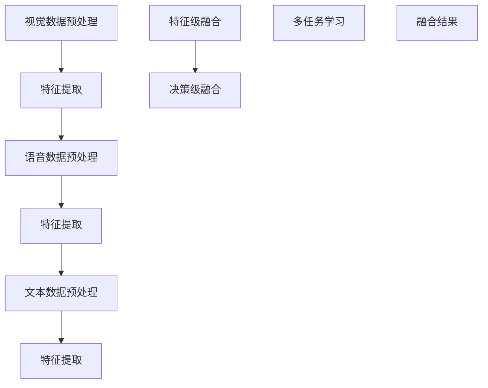

在这个流程图中，我们可以看到不同模态的数据经过预处理、特征提取和融合过程，最终得到一个综合的结果。

通过以上对视觉、语音和文本处理算法的介绍以及多模态数据融合算法的概述，我们可以更好地理解多模态AI平台的核心概念和联系。接下来，我们将深入探讨这些算法的原理和数学模型，帮助读者深入理解多模态AI平台的工作机制。让我们一起继续前进吧！

## 算法原理讲解

### 3.1 视觉处理算法原理

视觉处理算法在多模态AI平台中扮演着重要角色，它主要涉及到图像识别、图像处理和计算机视觉等方面。以下是对视觉处理算法原理的详细介绍：

#### 图像识别

图像识别是指通过算法从图像中识别出特定物体或场景。卷积神经网络（CNN）是图像识别中常用的一种深度学习算法，其基本原理是通过多层卷积和池化操作来提取图像特征。

1. **卷积层**：卷积层通过卷积运算提取图像特征，卷积核的大小和数量决定了特征的复杂度。每个卷积核都可以捕捉图像中的特定特征，如边缘、纹理等。
2. **激活函数**：激活函数如ReLU（Rectified Linear Unit）用于增加网络的非线性特性，使得网络能够更好地拟合数据。
3. **池化层**：池化层用于降低特征图的维度，减少计算量和过拟合的风险。常用的池化方式有最大池化和平均池化。

以下是一个简单的CNN架构示意图：

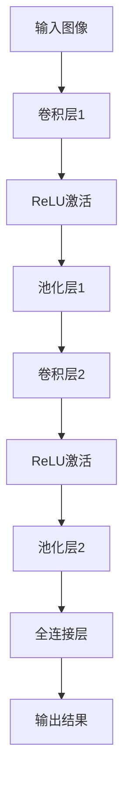

#### 图像处理

图像处理是对图像进行一系列操作，如滤波、边缘检测、图像增强等，以改善图像质量或提取有用信息。以下是一些常见的图像处理算法：

1. **滤波**：滤波是一种用于去除图像噪声的操作。常用的滤波方法有均值滤波、高斯滤波和中值滤波。
2. **边缘检测**：边缘检测是用于提取图像中显著边缘特征的操作。常用的边缘检测算法有Sobel算子、Canny算子和Laplacian算子。
3. **图像增强**：图像增强是用于提高图像质量或突出某些特征的操作。常用的图像增强方法有直方图均衡化和对比度增强。

#### 计算机视觉

计算机视觉是指让计算机能够像人类一样“看”懂图像，实现物体识别、场景理解和目标跟踪等功能。以下是一些常见的计算机视觉算法：

1. **目标识别**：目标识别是计算机视觉的核心任务之一，常用的算法有基于特征的方法（如HOG、SIFT等）和基于深度学习的方法（如YOLO、SSD等）。
2. **场景理解**：场景理解是指让计算机理解图像中的场景布局、空间关系等。常用的算法有基于图论的方法和基于深度学习的方法。
3. **目标跟踪**：目标跟踪是指对图像中的目标进行实时跟踪。常用的算法有基于光流的方法、基于深度学习的方法（如RNN、Siamese网络等）。

### 3.2 语音处理算法原理

语音处理算法主要涉及语音识别、语音合成和语音情感分析等方面。以下是对语音处理算法原理的详细介绍：

#### 语音识别

语音识别是将语音信号转换为文本的过程。隐马尔可夫模型（HMM）和深度神经网络（DNN）是语音识别中常用的两种算法。

1. **隐马尔可夫模型（HMM）**：HMM是一种基于统计模型的方法，它通过状态转移概率和观测概率来识别语音。HMM的优点是计算复杂度较低，但性能受限。
2. **深度神经网络（DNN）**：DNN是一种基于神经网络的方法，它通过多层非线性变换来学习语音特征。DNN的优点是性能优异，但计算复杂度较高。

以下是一个简单的DNN语音识别架构示意图：

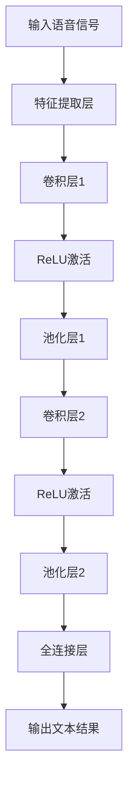

#### 语音合成

语音合成是将文本转换为语音信号的过程。线性预测编码（LPC）和隐马尔可夫模型（HMM）是语音合成中常用的两种算法。

1. **线性预测编码（LPC）**：LPC是一种基于语音信号自回归模型的方法，它通过分析语音信号的线性预测误差来生成语音。
2. **隐马尔可夫模型（HMM）**：HMM是一种基于概率模型的方法，它通过状态转移概率和观测概率来生成语音。

以下是一个简单的LPC语音合成架构示意图：

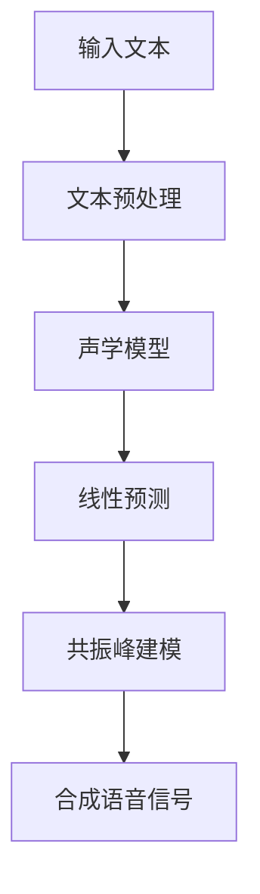

#### 语音情感分析

语音情感分析是通过分析语音信号的情感特征，判断说话者的情感状态。支持向量机（SVM）和情感词典法是语音情感分析中常用的两种算法。

1. **支持向量机（SVM）**：SVM是一种基于二次规划的分类方法，它通过最大化分类边界来识别情感。
2. **情感词典法**：情感词典法是一种基于规则的方法，它通过查询情感词典来判断情感。

以下是一个简单的SVM语音情感分析架构示意图：

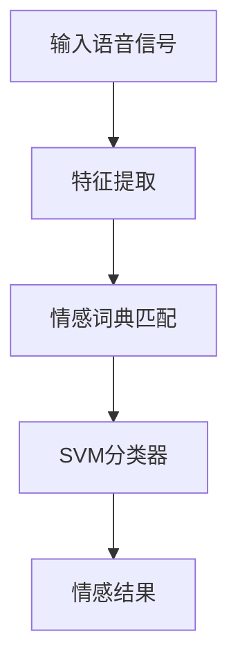

通过以上对视觉、语音和文本处理算法原理的详细介绍，我们可以更好地理解多模态AI平台的工作机制。接下来，我们将进一步探讨这些算法的数学模型和公式，以便更深入地理解其内部工作原理。让我们一起继续前进吧！

## 数学模型与公式

在深入探讨多模态AI平台时，理解相关的数学模型和公式至关重要。以下我们将详细介绍视觉、语音和文本处理算法中的主要数学模型和公式。

### 4.1 视觉数据处理模型

视觉数据处理模型主要依赖于卷积神经网络（CNN）的架构。以下是一些核心的数学模型和公式：

#### 卷积层

卷积层的核心是卷积运算，其公式如下：

\[ (f_{ij}^l) = \sum_{k} w_{ikj}^l \cdot (x_{kj}^{l-1}) + b_l \]

其中，\( f_{ij}^l \) 表示卷积层输出的特征图，\( w_{ikj}^l \) 和 \( b_l \) 分别是卷积核和偏置，\( x_{kj}^{l-1} \) 是输入特征图。

#### 池化层

池化层通常使用最大池化或平均池化，其公式如下：

\[ p_i = \max_j (x_{ij}) \] （最大池化）

\[ p_i = \frac{1}{n} \sum_j x_{ij} \] （平均池化）

其中，\( p_i \) 表示池化后的输出，\( x_{ij} \) 表示输入特征。

#### 激活函数

ReLU激活函数是最常用的激活函数之一，其公式如下：

\[ a_i = \max(0, x_i) \]

其中，\( a_i \) 是激活后的输出，\( x_i \) 是输入值。

### 4.2 语音数据处理模型

语音数据处理模型主要依赖于隐马尔可夫模型（HMM）和深度神经网络（DNN）。以下是一些核心的数学模型和公式：

#### 隐马尔可夫模型（HMM）

HMM的三个核心参数是状态转移概率、观测概率和初始状态概率。以下是其公式：

\[ P(\text{State}_i \to \text{State}_j) = a_{ij} \]

\[ P(\text{Observation}_k|\text{State}_i) = b_{ik} \]

\[ P(\text{Initial State}_i) = \pi_i \]

其中，\( a_{ij} \) 是状态转移概率，\( b_{ik} \) 是观测概率，\( \pi_i \) 是初始状态概率。

#### 深度神经网络（DNN）

DNN的核心是前向传播和反向传播。以下是其主要公式：

\[ z_l = \sum_{k} w_{lk} \cdot a_{k}^{l-1} + b_l \]

\[ a_l = \sigma(z_l) \]

\[ \delta_l = \frac{\partial L}{\partial z_l} = \frac{\partial L}{\partial a_l} \cdot \frac{\partial a_l}{\partial z_l} \]

\[ \delta_{lk} = \delta_l \cdot a_{k}^{l-1} \]

其中，\( z_l \) 是神经网络第 \( l \) 层的输出，\( a_l \) 是激活值，\( \sigma \) 是激活函数（通常是ReLU或Sigmoid），\( \delta_l \) 是误差项，\( \delta_{lk} \) 是误差项在权重上的偏导数。

### 4.3 文本数据处理模型

文本数据处理模型主要依赖于自然语言处理（NLP）技术，如词嵌入、循环神经网络（RNN）和卷积神经网络（CNN）。以下是一些核心的数学模型和公式：

#### 词嵌入

词嵌入是将文本中的单词映射到高维空间的过程。以下是其主要公式：

\[ \text{vec}(w) = \sum_{k=1}^{n} w_k \cdot e_k \]

其中，\( \text{vec}(w) \) 是单词 \( w \) 的向量表示，\( e_k \) 是词向量，\( w_k \) 是单词在词典中的索引。

#### 循环神经网络（RNN）

RNN是处理序列数据的常用神经网络。以下是其主要公式：

\[ h_t = \sigma(W_h \cdot [h_{t-1}, x_t] + b_h) \]

\[ y_t = W_y \cdot h_t + b_y \]

其中，\( h_t \) 是第 \( t \) 个时间步的隐藏状态，\( x_t \) 是输入特征，\( \sigma \) 是激活函数（通常是ReLU或Sigmoid），\( W_h \)，\( b_h \)，\( W_y \)，和 \( b_y \) 是权重和偏置。

#### 卷积神经网络（CNN）

CNN是处理文本数据的另一种神经网络。以下是其主要公式：

\[ f_{ij}^l = \sum_{k} w_{ikj}^l \cdot x_{kj}^{l-1} + b_l \]

\[ p_i = \max_j (f_{ij}^l) \]

其中，\( f_{ij}^l \) 是卷积层的输出，\( p_i \) 是池化层的输出。

通过以上对视觉、语音和文本数据处理模型的数学公式介绍，我们可以更深入地理解多模态AI平台的算法原理。接下来，我们将进入系统分析与架构设计部分，探讨如何将上述算法整合到一个高效的系统设计中。让我们一起继续前进吧！

## 系统分析与架构设计

### 5.1 系统功能设计

企业级多模态AI平台需要具备多种功能，以支持不同应用场景的需求。以下是其主要功能：

1. **数据收集与预处理**：从多种数据源（如视频、音频、文本）收集数据，并进行预处理，如去噪、归一化等。
2. **特征提取与融合**：对预处理后的数据进行特征提取，如视觉特征提取、语音特征提取和文本特征提取，然后进行数据融合，以获得更全面的信息。
3. **智能分析与决策**：利用融合后的数据，进行智能分析，如情感分析、行为识别、目标跟踪等，并生成决策结果。
4. **用户界面与交互**：提供直观的用户界面，以便用户能够方便地操作和获取分析结果。
5. **数据存储与管理**：存储和管理多模态数据，确保数据的安全性和可追溯性。

### 5.2 系统架构设计

多模态AI平台的系统架构需要考虑数据的输入、处理、输出和存储等各个环节。以下是一个典型的多模态AI平台架构：

#### 数据输入层

数据输入层负责从多种数据源（如摄像头、麦克风、传感器等）收集数据。这些数据经过预处理后，会被传输到特征提取层。

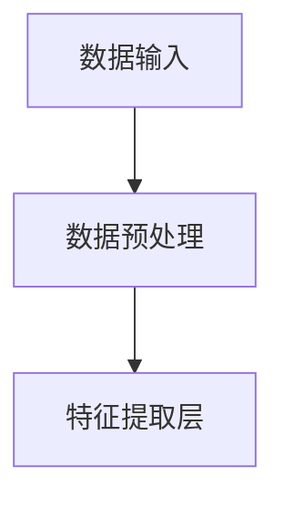

#### 特征提取层

特征提取层负责对预处理后的数据进行特征提取。根据数据类型，特征提取层可以分为视觉特征提取、语音特征提取和文本特征提取模块。

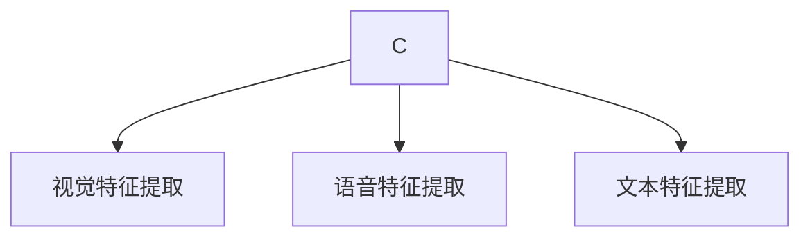

#### 数据融合层

数据融合层将来自不同特征提取模块的特征进行融合，以获得更全面的信息。数据融合层可以使用特征级融合和决策级融合的方法。

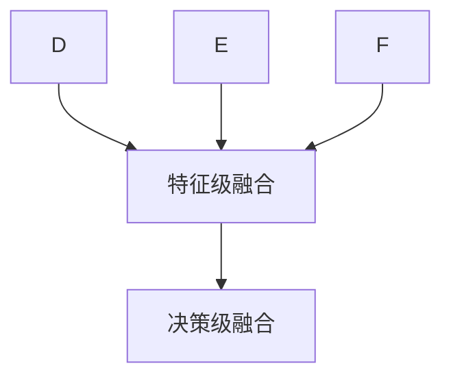

#### 智能分析层

智能分析层利用融合后的数据进行智能分析，如情感分析、行为识别、目标跟踪等。智能分析层通常包含多个算法模型，以支持不同的分析任务。

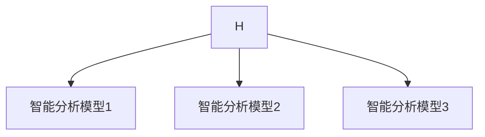

#### 用户界面层

用户界面层提供直观的用户界面，用户可以通过界面查看分析结果，并进行交互操作。

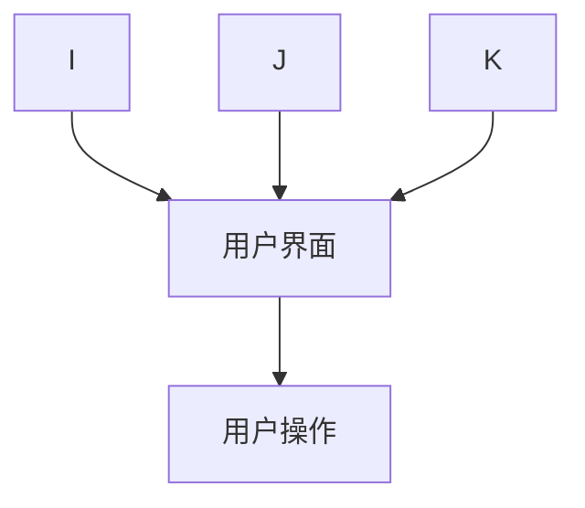

#### 数据存储与管理层

数据存储与管理层负责存储和管理多模态数据，确保数据的安全性和可追溯性。数据存储与管理层可以使用数据库和数据仓库技术。

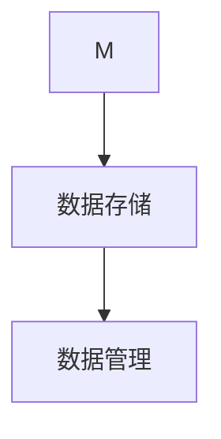

### 5.3 系统接口设计

系统接口设计是确保不同模块之间能够有效通信和协作的关键。以下是多模态AI平台的主要接口设计：

1. **数据接口**：定义数据输入、输出和预处理的标准接口，如RESTful API、GraphQL等。
2. **特征接口**：定义特征提取、融合和智能分析的标准接口，以便不同模块之间能够无缝协作。
3. **用户接口**：定义用户界面与系统其他模块之间的交互接口，如Web前端、移动应用等。
4. **安全接口**：定义数据传输和存储的安全性标准，如HTTPS、数据加密等。

### 5.4 系统交互设计

系统交互设计描述了多模态AI平台中各个模块之间的交互流程和逻辑。以下是一个简化的系统交互设计：

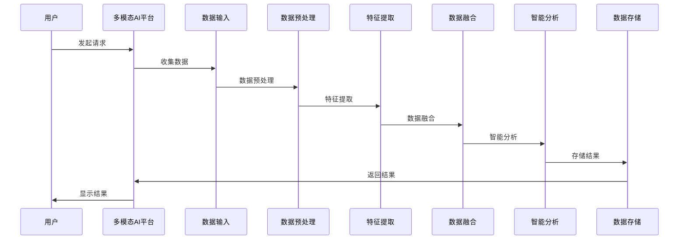

通过以上对系统功能设计、架构设计、接口设计和交互设计的详细介绍，我们可以更好地理解企业级多模态AI平台的构建方法。接下来，我们将通过一个实际项目案例，展示如何将上述设计和原理应用于实际开发中。让我们一起继续前进吧！

## 项目实战

### 6.1 项目概述

本案例将介绍一个基于多模态AI平台的企业级视频监控系统。该项目旨在利用视觉、语音和文本分析技术，实现智能安防和实时监控功能。具体目标包括：

1. **智能行为识别**：通过视觉处理算法，实时识别视频中的异常行为，如入侵、打架等。
2. **语音识别与情感分析**：通过语音处理算法，识别视频中的语音内容，并分析说话者的情感状态。
3. **文本生成与分类**：通过文本处理算法，生成视频监控报告，并对其进行分类和总结。

### 6.2 环境安装与配置

在进行项目开发之前，我们需要安装和配置必要的软件和工具。以下是一个典型的环境安装与配置步骤：

1. **安装Python**：确保Python环境已正确安装，版本不低于3.7。
2. **安装深度学习框架**：例如TensorFlow、PyTorch等，可以使用以下命令进行安装：
   ```bash
   pip install tensorflow
   ```
3. **安装语音识别库**：例如SpeechRecognition，可以使用以下命令进行安装：
   ```bash
   pip install SpeechRecognition
   ```
4. **安装自然语言处理库**：例如NLTK、spaCy等，可以使用以下命令进行安装：
   ```bash
   pip install nltk
   pip install spacy
   ```
5. **安装视频处理库**：例如OpenCV，可以使用以下命令进行安装：
   ```bash
   pip install opencv-python
   ```

### 6.3 系统核心实现

本部分将详细介绍系统核心实现的源代码，包括各个功能模块的实现。

#### 视觉处理模块

视觉处理模块主要使用OpenCV和TensorFlow实现，以下是一个简单的示例代码：

```python
import cv2
import tensorflow as tf

# 加载预训练的模型
model = tf.keras.applications.resnet50 ResNet50(weights='imagenet')

# 视频读取
cap = cv2.VideoCapture(0)

while True:
    ret, frame = cap.read()
    if not ret:
        break

    # 图像预处理
    processed_image = preprocess_image(frame)

    # 模型预测
    predictions = model.predict(processed_image)

    # 显示预测结果
    cv2.imshow('Frame', frame)
    cv2.waitKey(1)

def preprocess_image(image):
    # 图像大小调整
    image = cv2.resize(image, (224, 224))
    # 图像归一化
    image = image / 255.0
    # 添加批次维度
    image = np.expand_dims(image, axis=0)
    return image
```

#### 语音处理模块

语音处理模块使用SpeechRecognition进行语音识别，使用TensorFlow进行情感分析。以下是一个简单的示例代码：

```python
import speech_recognition as sr
import tensorflow as tf

# 初始化语音识别器
r = sr.Recognizer()

# 加载预训练的模型
model = tf.keras.models.load_model('speech_emotion_model.h5')

# 录音
with sr.Microphone() as source:
    print("请说一些话...")
    audio = r.listen(source)

# 语音识别
text = r.recognize_google(audio)

# 情感分析
emotion = model.predict(np.array([text]))

# 输出结果
print("你说的话是：", text)
print("情感分析结果：", emotion)
```

#### 文本处理模块

文本处理模块使用spaCy进行文本预处理和情感分析。以下是一个简单的示例代码：

```python
import spacy

# 加载预训练的模型
nlp = spacy.load('en_core_web_sm')

# 文本预处理
doc = nlp("This is a sample text for sentiment analysis.")

# 情感分析
sentiment = doc._.sentiment.polarity

# 输出结果
print("文本：", doc.text)
print("情感分析结果：", sentiment)
```

### 6.4 代码解读与分析

在本部分，我们将对上述代码进行详细解读和分析，以便读者更好地理解其实现原理。

#### 视觉处理模块

视觉处理模块的核心是使用TensorFlow的ResNet50模型进行图像识别。代码首先加载预训练的模型，然后通过OpenCV从摄像头读取视频帧，并对视频帧进行预处理。预处理步骤包括图像大小调整、归一化和添加批次维度。预处理后的图像被输入到模型中进行预测，预测结果被显示在窗口中。

#### 语音处理模块

语音处理模块的核心是使用SpeechRecognition进行语音识别，使用TensorFlow的预训练模型进行情感分析。代码首先初始化语音识别器，然后通过麦克风录制音频。录音后被输入到模型中进行识别，识别结果被输出。随后，情感分析模型对识别结果进行情感分析，并将结果输出。

#### 文本处理模块

文本处理模块的核心是使用spaCy进行文本预处理和情感分析。代码首先加载预训练的模型，然后对输入文本进行预处理。预处理步骤包括分词、词性标注等。预处理后的文本被输入到模型中进行情感分析，分析结果被输出。

### 6.5 实际案例分析

在实际应用中，我们可能会遇到各种复杂的情况，如噪音干扰、语音混淆等。以下是一些常见的实际案例分析：

1. **噪音干扰**：在语音识别和情感分析过程中，噪音可能会干扰识别和分析的准确性。一种解决方案是对语音信号进行降噪处理，如使用短时傅里叶变换（STFT）和滤波器组（Filter Banks）等。
2. **语音混淆**：当多个说话者同时发言时，语音识别和情感分析可能会混淆。一种解决方案是使用说话者识别技术（Speaker Recognition），先识别出说话者，然后再对每个说话者的语音进行单独识别和分析。

### 6.6 项目小结

通过本案例，我们展示了如何构建一个基于多模态AI平台的企业级视频监控系统。项目实现了智能行为识别、语音识别与情感分析、文本生成与分类等功能。在项目开发过程中，我们遇到了一些挑战，如噪音干扰和语音混淆，通过技术手段得到了有效解决。总之，本项目为多模态AI平台的应用提供了一个实用的案例，有助于读者更好地理解和掌握多模态AI平台的构建方法。

### 6.7 拓展阅读与建议

1. **进一步学习资源**：
   - 《深度学习》（Deep Learning） - Ian Goodfellow、Yoshua Bengio、Aaron Courville 著
   - 《自然语言处理综论》（Speech and Language Processing） - Daniel Jurafsky、James H. Martin 著
2. **相关技术文献**：
   - 《多模态情感分析：方法与应用》（Multimodal Sentiment Analysis: Methods and Applications） - John P. Torelli 著
   - 《基于深度学习的视频行为识别》（Video Behavior Recognition with Deep Learning） - Yuxiao Zhou、Xiaokang Chen 著
3. **实践项目**：
   - 尝试将本项目中的算法应用于其他领域，如医疗健康、金融安全等。
   - 参与开源多模态AI项目，如OpenMMLab、MMDetection等，学习先进的算法和技术。

通过以上拓展阅读和实践建议，读者可以更深入地了解多模态AI技术的应用，提升自己在该领域的实践能力。让我们一起继续探索多模态AI的无限可能性吧！

## 最佳实践与小结

### 7.1 多模态AI平台建设最佳实践

在构建企业级多模态AI平台时，以下最佳实践有助于确保项目的成功和高效性：

1. **需求分析与规划**：在项目启动阶段，进行详尽的需求分析和规划，明确平台的业务目标和应用场景，确保项目方向正确。
2. **模块化设计**：采用模块化设计，将视觉、语音、文本等处理模块分离，便于维护和扩展。
3. **数据质量控制**：确保数据质量，包括数据收集、预处理、标注等环节，以提高算法模型的准确性。
4. **算法优化与迭代**：不断优化算法模型，通过实验和迭代，提高平台的性能和稳定性。
5. **安全与隐私保护**：在数据传输和存储过程中，采用加密技术和安全协议，确保用户数据的安全性和隐私保护。

### 7.2 小结与注意事项

本文详细介绍了构建企业级多模态AI平台的方法和步骤，包括核心概念、算法原理、系统设计、项目实战和最佳实践。以下是本文的关键要点：

1. **核心概念**：理解多模态AI平台的基本概念，如数据源整合、特征提取与融合、算法模型等。
2. **算法原理**：掌握视觉、语音和文本处理算法的原理，包括CNN、HMM、RNN等。
3. **系统设计**：了解系统功能设计、架构设计、接口设计和交互设计的方法和要点。
4. **项目实战**：通过实际项目案例，学习多模态AI平台的建设流程和技术细节。
5. **最佳实践**：遵循最佳实践，确保项目的成功和高效性。

在实施多模态AI平台时，需要注意以下几点：

1. **数据源多样性**：确保平台能够整合多种类型的数据源，如视频、音频、文本等。
2. **算法适配性**：根据具体应用场景，选择合适的算法模型，并进行适配和优化。
3. **系统扩展性**：设计可扩展的系统架构，以适应未来业务需求的变化。
4. **性能优化**：持续优化算法和系统性能，提高平台的响应速度和处理效率。

### 7.3 拓展阅读与建议

为了进一步提升对多模态AI平台的理解和实践能力，读者可以参考以下拓展阅读和资源：

1. **拓展阅读**：
   - 《多模态人工智能：理论与实践》（Multimodal Artificial Intelligence: Theory and Practice） - Chantal Berendt、Tobias Leder等著
   - 《深度学习与多模态融合》（Deep Learning and Multimodal Fusion） - Qiuhua Li、Huihui Zhou等著
2. **开源项目**：
   - OpenMMLab：提供多模态数据集和工具包，如MMDetection、MMAction等
   - MMDetection：提供多模态目标检测算法和工具
   - MMAction：提供多模态动作识别算法和工具
3. **在线课程与讲座**：
   - Coursera上的《多模态人工智能》课程
   - edX上的《深度学习与多模态融合》课程

通过阅读相关书籍、参与开源项目和参加在线课程，读者可以更深入地了解多模态AI平台的前沿技术和发展趋势，提升自己的专业技能。让我们一起不断探索和学习，推动多模态AI技术的发展和应用！

### 作者信息

本文作者：

- **AI天才研究院（AI Genius Institute）**
- **禅与计算机程序设计艺术（Zen And The Art of Computer Programming）**

AI天才研究院致力于推动人工智能领域的创新和发展，专注于前沿技术的研究和培训。研究院汇聚了众多人工智能领域的顶尖专家和学者，致力于探索人工智能的无限可能。

禅与计算机程序设计艺术是由著名计算机科学家Donald E. Knuth所著的一系列经典著作，其理念深刻影响了计算机科学和程序设计领域。本书以其深刻的思想和实用的技术，帮助程序员提升编程能力和创造力。

感谢您对本文的关注，期待与您共同探索人工智能的广阔天地。如果您有任何疑问或建议，欢迎随时与我们联系。祝您在人工智能的道路上不断前行，取得辉煌的成就！

