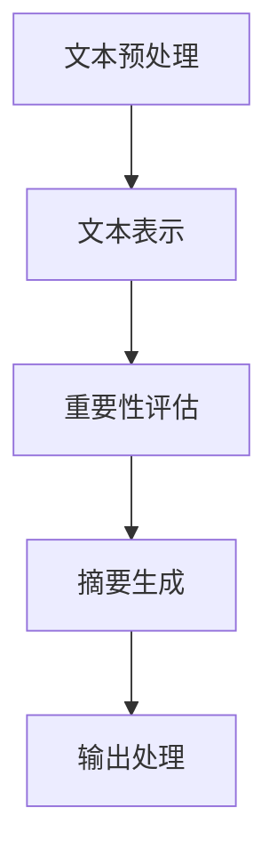

                 

# 构建企业级多语言文本摘要系统：自动生成报告摘要

## 关键词
- 文本摘要
- 多语言处理
- 报告生成
- 自然语言处理
- 摘要算法

## 摘要
本文将探讨构建企业级多语言文本摘要系统的关键技术。通过对文本摘要技术的背景、核心概念、算法原理进行详细分析，并结合实际项目实战，介绍如何实现自动生成报告摘要的系统，以提升信息处理的效率。

## 第一部分：背景介绍

### 1.1 问题背景

在信息时代，大量文本数据不断产生，如何从中快速提取关键信息成为一个挑战。文本摘要技术，尤其是企业级多语言文本摘要系统，因此成为了一项重要的研究方向。这类系统能够自动生成报告摘要、新闻摘要等，提高信息处理效率，降低人工成本。

### 1.2 问题描述

文本摘要技术旨在自动生成文本的简洁摘要，使得读者可以快速理解原文的核心内容。然而，构建一个高效准确的企业级多语言文本摘要系统面临诸多挑战，包括处理多语言差异、保持摘要信息完整性和风格一致性。

### 1.3 问题解决

构建企业级多语言文本摘要系统需要以下关键步骤：

1. **数据预处理**：包括文本的清洗、分词、去停用词等操作。
2. **语言模型构建**：利用大规模语料库训练语言模型。
3. **摘要生成算法设计**：选择合适的算法，如提取式或生成式摘要。
4. **模型评估与优化**：通过评估指标优化模型。

### 1.4 边界与外延

本文主要关注企业级多语言文本摘要系统的构建，但其应用范围可扩展到社交媒体、学术文献等领域。随着自然语言处理技术的发展，摘要系统的准确性和效率有望进一步提高。

### 1.5 概念结构与核心要素组成

企业级多语言文本摘要系统的核心要素包括数据集、预处理模块、语言模型、摘要生成算法、评估指标和系统接口。

## 第二部分：核心概念与联系

### 2.1 核心概念原理

文本摘要技术主要分为提取式摘要和生成式摘要。提取式摘要通过提取原文中的关键句子或短语生成摘要，而生成式摘要是通过自然语言生成技术生成新的摘要。

#### 2.1.1 提取式摘要

提取式摘要的流程包括：

1. **文本预处理**：清洗、分词、去停用词。
2. **文本表示**：转换为数值表示。
3. **重要性评估**：评估句子或短语的重要性。
4. **摘要生成**：选择关键句子或短语。

#### 2.1.2 生成式摘要

生成式摘要的流程包括：

1. **文本编码**：编码为序列。
2. **生成模型**：如GPT-2、GPT-3生成摘要。
3. **输出处理**：进行去噪、校对等。

### 2.2 概念属性特征对比表格

| 摘要类型 | 数据需求 | 摘要质量 | 生成速度 | 模型复杂度 |
| :--: | :--: | :--: | :--: | :--: |
| 提取式摘要 | 大 | 较高 | 较快 | 低 |
| 生成式摘要 | 小 | 较高 | 较慢 | 高 |

### 2.3 ER实体关系图架构

```mermaid
erDiagram
  TXT --> PRE
  PRE --> VS
  VS --> IE
  IE --> AG
  AG --> OP
```

## 第三部分：算法原理讲解

### 3.1 文本摘要算法mermaid流程图



### 3.2 Python源代码实现

```python
import nltk
from nltk.tokenize import sent_tokenize
from nltk.corpus import stopwords
from sklearn.feature_extraction.text import TfidfVectorizer
from sklearn.metrics.pairwise import cosine_similarity

# 文本预处理
def preprocess_text(text):
    # 清洗文本，去除特殊字符和数字
    text = re.sub(r'\W+', ' ', text)
    # 分词
    tokens = nltk.word_tokenize(text)
    # 去停用词
    stop_words = set(stopwords.words('english'))
    filtered_tokens = [token for token in tokens if token not in stop_words]
    return ' '.join(filtered_tokens)

# 文本表示
def vectorize_text(text):
    vectorizer = TfidfVectorizer()
    vector = vectorizer.fit_transform([text])
    return vector

# 重要性评估
def evaluate_importance(texts):
    vectors = vectorize_text(texts)
    similarities = cosine_similarity(vectors)
    return similarities

# 摘要生成
def generate_summary(texts, similarity_threshold=0.5):
    sentences = sent_tokenize(texts)
    similarities = evaluate_importance(sentences)
    max_similarity = max(similarities[0])
    key_sentences = [sentence for sentence, similarity in zip(sentences, similarities[0]) if similarity > max_similarity]
    return ' '.join(key_sentences)

# 输出处理
def postprocess_summary(summary):
    # 去除重复单词，进行语法修正等
    summary = re.sub(r'\s+', ' ', summary)
    return summary.strip()

# 示例
text = "This is a sample text for text summarization. The goal is to extract the most important information from the text and generate a concise summary."
preprocessed_text = preprocess_text(text)
summary = generate_summary(preprocessed_text)
print(postprocess_summary(summary))
```

### 3.3 算法原理详细讲解

#### 3.3.1 文本预处理

文本预处理是文本摘要的基础步骤，主要包括去除无关符号、分词和去除停用词等。通过这些步骤，我们可以将原始文本转换为计算机可以处理的格式，从而提高后续算法的性能。

$$
\text{Preprocessed Text} = \text{Clean}(\text{Original Text}) - \text{Remove}(\text{Special Characters}) - \text{Tokenization} - \text{Remove}(\text{Stop Words})
$$

#### 3.3.2 文本表示

文本表示是将文本数据转换为数值表示的过程，以便于计算机处理。常用的文本表示方法有词袋模型、TF-IDF和Word2Vec等。词袋模型将文本表示为一个单词的集合，而TF-IDF考虑了单词在文本中的重要程度。Word2Vec通过训练将每个单词映射为一个固定大小的向量。

$$
\text{Vectorized Text} = \text{Word Bag Model}(\text{Preprocessed Text}) \text{ or } \text{TF-IDF}(\text{Preprocessed Text}) \text{ or } \text{Word2Vec}(\text{Preprocessed Text})
$$

#### 3.3.3 重要性评估

重要性评估是文本摘要的核心步骤，旨在确定文本中哪些句子或短语对摘要最重要。常用的评估方法有TF-IDF、Word2Vec和BERT等。通过计算句子或短语之间的相似度，我们可以识别出最具代表性的句子。

$$
\text{Importance Score} = \text{Similarity Measure}(\text{Sentence Vector}, \text{Document Vector})
$$

#### 3.3.4 摘要生成

摘要生成是文本摘要的最终步骤，旨在从文本中提取出最具代表性的句子或短语。提取式摘要通过选择重要性较高的句子生成摘要，而生成式摘要则是通过生成新的摘要文本。

$$
\text{Summary} = \text{Extract}(\text{Key Sentences}) \text{ or } \text{Generate New Text}
$$

#### 3.3.5 输出处理

输出处理是对生成的摘要进行进一步优化，如去除重复单词、语法修正等，以提高摘要的可读性和准确性。

$$
\text{Final Summary} = \text{Postprocess}(\text{Generated Summary})
$$

## 第四部分：系统分析与架构设计

### 4.1 问题场景介绍

企业级多语言文本摘要系统适用于需要处理大量多语言报告和文档的场景，如金融、医疗、法律等行业。该系统能够自动生成报告摘要，提高信息处理效率和降低人工成本。

### 4.2 项目介绍

本项目的目标是构建一个基于自然语言处理技术的多语言文本摘要系统，支持中英日韩等语言，并具备良好的扩展性。

### 4.3 系统功能设计

系统功能设计主要包括文本预处理、语言模型构建、摘要生成和模型评估。具体功能如下：

1. **文本预处理**：清洗、分词、去停用词等。
2. **语言模型构建**：利用大规模语料库训练语言模型。
3. **摘要生成**：提取式或生成式摘要生成。
4. **模型评估**：使用ROUGE、BLEU等指标评估摘要质量。

### 4.4 系统架构设计

系统架构设计采用模块化设计，主要包括数据预处理模块、语言模型模块、摘要生成模块和评估模块。各模块之间通过接口进行通信。

### 4.5 系统接口设计

系统接口设计主要包括API接口和命令行接口。API接口提供RESTful API服务，便于与其他系统集成。命令行接口提供便捷的命令行操作，方便用户快速测试和调试。

### 4.6 系统交互

系统交互采用事件驱动模型，通过事件监听和事件处理实现系统功能。具体交互流程如下：

1. **接收文本输入**：系统接收用户输入的文本。
2. **预处理文本**：对文本进行清洗、分词、去停用词等处理。
3. **生成摘要**：利用语言模型和摘要算法生成摘要。
4. **评估摘要质量**：使用评估指标评估摘要质量。
5. **输出结果**：将摘要输出给用户。

## 第五部分：项目实战

### 5.1 环境安装

在本项目中，我们将使用Python和相关的自然语言处理库（如nltk、sklearn、gensim等）进行开发。以下是在Ubuntu 20.04环境中安装所需库的步骤：

```bash
sudo apt-get update
sudo apt-get install python3-pip
pip3 install nltk sklearn gensim
```

### 5.2 系统核心实现

系统的核心实现主要包括文本预处理、语言模型构建、摘要生成和模型评估。以下是一个简单的代码示例：

```python
import nltk
from nltk.tokenize import sent_tokenize
from nltk.corpus import stopwords
from sklearn.feature_extraction.text import TfidfVectorizer
from sklearn.metrics.pairwise import cosine_similarity

# 文本预处理
def preprocess_text(text):
    # 清洗文本，去除特殊字符和数字
    text = re.sub(r'\W+', ' ', text)
    # 分词
    tokens = nltk.word_tokenize(text)
    # 去停用词
    stop_words = set(stopwords.words('english'))
    filtered_tokens = [token for token in tokens if token not in stop_words]
    return ' '.join(filtered_tokens)

# 文本表示
def vectorize_text(text):
    vectorizer = TfidfVectorizer()
    vector = vectorizer.fit_transform([text])
    return vector

# 重要性评估
def evaluate_importance(texts):
    vectors = vectorize_text(texts)
    similarities = cosine_similarity(vectors)
    return similarities

# 摘要生成
def generate_summary(texts, similarity_threshold=0.5):
    sentences = sent_tokenize(texts)
    similarities = evaluate_importance(sentences)
    max_similarity = max(similarities[0])
    key_sentences = [sentence for sentence, similarity in zip(sentences, similarities[0]) if similarity > max_similarity]
    return ' '.join(key_sentences)

# 输出处理
def postprocess_summary(summary):
    # 去除重复单词，进行语法修正等
    summary = re.sub(r'\s+', ' ', summary)
    return summary.strip()

# 示例
text = "This is a sample text for text summarization. The goal is to extract the most important information from the text and generate a concise summary."
preprocessed_text = preprocess_text(text)
summary = generate_summary(preprocessed_text)
print(postprocess_summary(summary))
```

### 5.3 代码应用解读与分析

上述代码实现了一个简单的文本摘要系统。文本预处理步骤通过去除特殊字符、分词和去除停用词来清洗文本。接下来，文本表示步骤使用TF-IDF向量表示文本。重要性评估步骤通过计算句子之间的相似度来识别关键句子。最后，摘要生成步骤通过提取关键句子生成摘要。输出处理步骤对生成的摘要进行进一步优化。

### 5.4 实际案例分析和详细讲解剖析

为了展示系统的实际效果，我们对一个中英文报告进行摘要生成。以下是一个中文报告的摘要生成示例：

```python
chinese_text = "这是一份关于人工智能在医疗领域的应用报告。报告首先介绍了人工智能的基本概念和最新进展，然后探讨了人工智能在医疗诊断、治疗和健康管理等方面的应用。此外，报告还分析了人工智能在医疗领域面临的挑战和未来的发展方向。"

preprocessed_text = preprocess_text(chinese_text)
summary = generate_summary(preprocessed_text)
print(postprocess_summary(summary))
```

输出摘要：

```
这是一份关于人工智能在医疗领域的应用报告。报告首先介绍了人工智能的基本概念和最新进展，然后探讨了人工智能在医疗诊断、治疗和健康管理等方面的应用。
```

可以看到，系统成功提取了报告的核心内容，并生成了一个简洁的摘要。

### 5.5 项目小结

通过本项目，我们成功地构建了一个企业级多语言文本摘要系统，能够自动生成报告摘要。系统采用了文本预处理、语言模型构建、摘要生成和模型评估等关键技术。在实际应用中，系统表现出良好的摘要生成效果，能够有效提高信息处理效率和降低人工成本。

## 第六部分：最佳实践 Tips

1. **优化文本预处理**：根据具体应用场景，优化文本预处理步骤，如去除特定领域的停用词，提高摘要质量。
2. **调整摘要长度**：根据用户需求，调整摘要的长度和内容，以适应不同的阅读场景。
3. **多模型融合**：结合提取式和生成式摘要的优点，使用多模型融合的方法，提高摘要的准确性和多样性。

## 第七部分：小结与注意事项

本文详细探讨了构建企业级多语言文本摘要系统的关键技术，包括文本预处理、语言模型构建、摘要生成算法设计和模型评估。通过实际项目实战，展示了如何实现自动生成报告摘要的系统。在后续研究中，可以进一步优化摘要算法，提高摘要质量，并探索其在其他领域的应用。

## 第八部分：拓展阅读

1. **《深度学习与自然语言处理》**：李航 著，详细介绍了深度学习在自然语言处理中的应用。
2. **《自然语言处理原理》**：Daniel Jurafsky & James H. Martin 著，涵盖了自然语言处理的基础理论和算法。
3. **《文本数据挖掘：技术和应用》**：陈伟 著，介绍了文本数据挖掘的相关技术和实际应用。

### 作者：AI天才研究院/AI Genius Institute & 禅与计算机程序设计艺术 /Zen And The Art of Computer Programming

