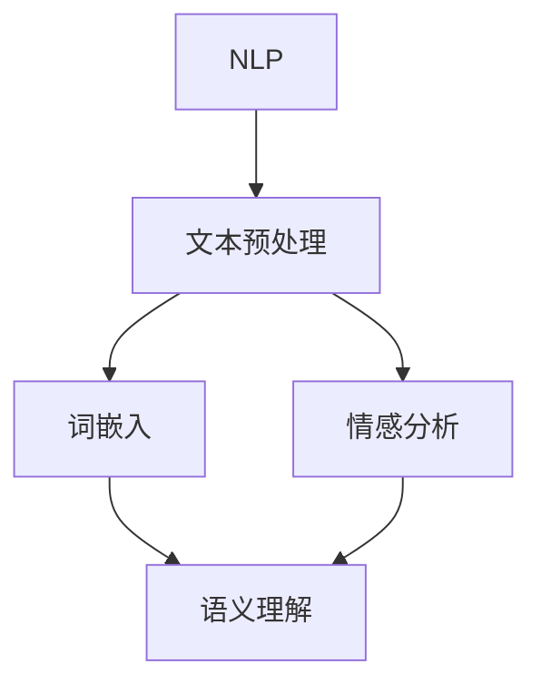
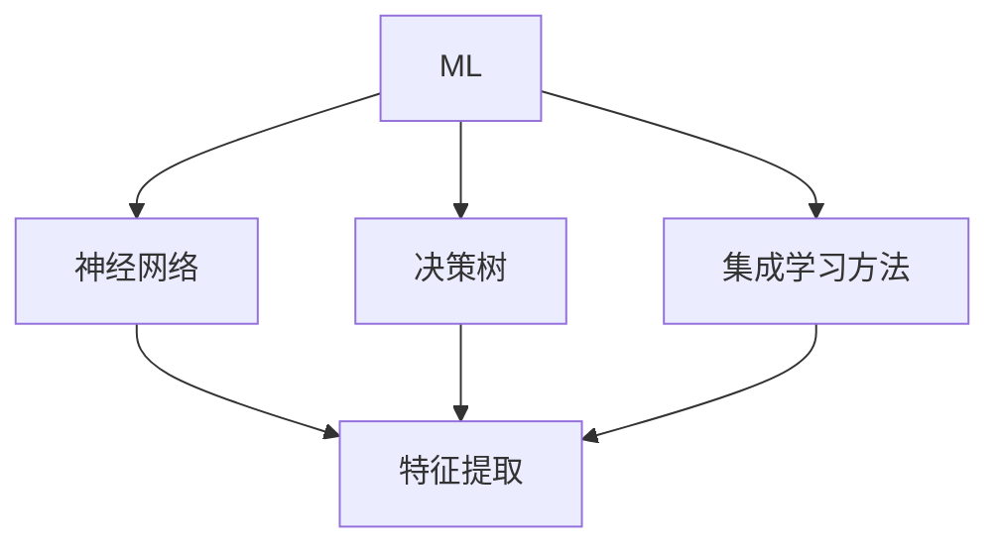
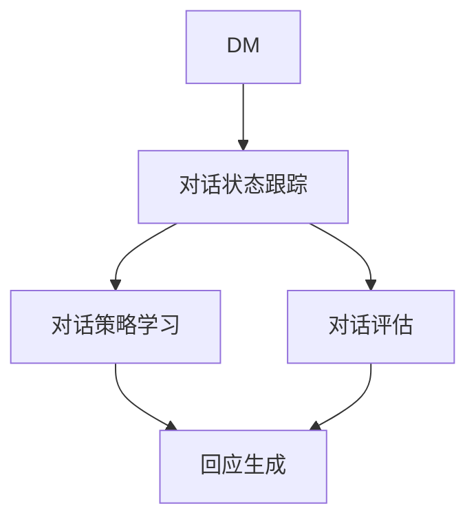

                 

### 构建企业级对话式AI Agent：提升内部沟通效率

#### 关键词
- 对话式AI Agent
- 企业内部沟通
- 自然语言处理
- 机器学习
- 对话管理
- AI安全与伦理

#### 摘要
本文旨在探讨构建企业级对话式AI Agent的方法，以提升企业内部沟通效率。我们将详细分析对话式AI Agent的基础理论、核心组成部分及其在实践中的应用，同时讨论AI安全与伦理问题，并提供一些建议和未来展望。

---

## 第一部分：背景

### 1.1 问题背景

企业内部沟通是业务运作的核心环节，高效的内部沟通能够显著提升企业生产力。然而，传统的沟通方式如邮件和即时通讯工具在面对复杂业务流程和大量数据时，往往显得力不从心。随着人工智能技术的迅猛发展，企业开始探索新的沟通方式，对话式AI Agent应运而生。对话式AI Agent通过模拟人类对话，实现自然、流畅的交互，能够自动处理大量重复性工作，从而显著提高沟通效率。

### 1.2 问题描述

在构建企业级对话式AI Agent时，企业面临以下挑战：

- **技术选型**：如何选择适合企业需求的AI技术栈？
- **对话流程设计**：如何设计高效、自然的对话流程？
- **安全性**：如何确保对话式AI Agent的安全性和稳定性？
- **伦理问题**：如何处理AI在沟通中的伦理问题？

### 1.3 问题解决

本书将从以下几个方面系统地介绍对话式AI Agent的构建：

- **基础理论**：包括自然语言处理、机器学习和对话管理等核心技术。
- **构建过程**：从技术选型到实际应用的完整流程。
- **案例分析**：通过实际案例展示对话式AI Agent在企业中的应用。
- **安全与伦理**：探讨AI安全与伦理问题及其解决方案。

### 1.4 边界与外延

本文主要关注企业内部沟通中的对话式AI Agent构建，不包括面向消费者的客服机器人等外部应用场景。

### 1.5 概念结构与核心要素组成

对话式AI Agent的核心要素包括：

- **自然语言处理（NLP）**：负责处理和理解自然语言。
- **机器学习（ML）**：提供对话模型的训练和优化。
- **对话管理（DM）**：负责维护对话状态和生成回应。

这些要素共同构成了对话式AI Agent的体系结构。

---

## 第二部分：对话式AI Agent基础理论

### 2.1 自然语言处理（NLP）

#### 2.1.1 NLP的基本概念

**NLP的定义**：自然语言处理（NLP）是计算机科学、人工智能和语言学的交叉领域，旨在使计算机能够理解、解释和生成人类语言。

**NLP在对话式AI Agent中的应用**：在对话式AI Agent中，NLP负责处理用户输入的自然语言，将其转化为计算机可以理解和处理的格式。

#### 2.1.2 NLP的关键技术

**词嵌入（Word Embedding）**：将单词映射到高维空间中的向量，以便计算机能够理解单词之间的关系。

**句子表示（Sentence Representation）**：将句子转化为固定长度的向量，以便进行后续的机器学习处理。

**情感分析（Sentiment Analysis）**：通过分析文本的情感倾向，判断文本是积极的、消极的还是中性的。

#### 2.1.3 NLP在对话式AI Agent中的应用实例

**文本预处理**：在对话开始前，对话式AI Agent会对用户输入的文本进行预处理，包括去除停用词、标点符号等。

**意图识别**：通过分析用户输入的文本，对话式AI Agent能够识别用户的意图，从而生成相应的回应。

### 2.2 机器学习（ML）

#### 2.2.1 ML的基本概念

**ML的定义**：机器学习（ML）是一种通过数据学习模式和规律，使计算机能够自动执行特定任务的方法。

**ML在对话式AI Agent中的应用**：在对话式AI Agent中，ML用于训练对话模型，使其能够根据用户输入生成合适的回应。

#### 2.2.2 ML的关键技术

**神经网络（Neural Networks）**：模拟人脑神经元的工作原理，用于处理复杂的数据和模式。

**决策树（Decision Trees）**：通过一系列规则进行决策，适用于分类和回归问题。

**集成学习方法（Ensemble Methods）**：通过结合多个模型来提高预测的准确性和稳定性。

#### 2.2.3 ML在对话式AI Agent中的应用实例

**特征提取**：在对话式AI Agent中，特征提取是关键步骤，它负责从用户输入的文本中提取出对模型训练有用的信息。

**模型训练**：通过大量数据对对话模型进行训练，使其能够生成合适的回应。

### 2.3 对话管理（DM）

#### 2.3.1 DM的基本概念

**DM的定义**：对话管理（DM）是确保对话流畅性和有效性的过程，包括对话状态的跟踪和回应的生成。

**DM在对话式AI Agent中的应用**：在对话式AI Agent中，DM负责维护对话状态，根据用户输入生成合适的回应。

#### 2.3.2 DM的关键技术

**对话状态跟踪（Dialogue State Tracking）**：通过跟踪对话中的关键信息，确保对话的连贯性。

**对话策略学习（Dialogue Policy Learning）**：通过学习对话策略，使对话式AI Agent能够生成更自然的回应。

**对话评估（Dialogue Evaluation）**：对对话式AI Agent的对话质量进行评估，以不断优化其性能。

#### 2.3.3 DM在对话式AI Agent中的应用实例

**上下文维护**：在对话过程中，对话式AI Agent需要能够维护上下文信息，以便生成连贯的回应。

**多轮对话管理**：在多轮对话中，对话式AI Agent需要能够理解对话的历史信息，并生成合适的回应。

---

## 第三部分：AI安全与伦理

### 2.4.1 AI安全的基本概念

**AI安全（AI Security）的定义**：AI安全是指确保AI系统在开发、部署和使用过程中不受威胁和攻击，同时确保AI系统的决策过程透明、可解释和可信。

**AI安全在对话式AI Agent中的应用**：在对话式AI Agent中，AI安全包括保护用户数据的安全、确保对话过程的隐私保护和防止恶意攻击。

### 2.4.2 AI伦理的基本概念

**AI伦理（AI Ethics）的定义**：AI伦理是指研究AI系统在开发、部署和使用过程中可能带来的伦理问题，并制定相应的道德规范和标准。

**AI伦理在对话式AI Agent中的应用**：在对话式AI Agent中，AI伦理包括确保AI系统不歧视、不偏见，并尊重用户的隐私和权利。

### 2.4.3 AI安全与伦理的挑战与对策

**挑战**：

- **数据隐私**：如何确保用户数据的安全和隐私？
- **算法偏见**：如何防止AI系统在决策过程中产生偏见？
- **责任归属**：在AI系统出现错误时，如何确定责任归属？

**对策**：

- **数据加密**：使用加密技术保护用户数据的安全。
- **算法审计**：对AI系统的算法进行审计，确保其公平、公正和透明。
- **责任保险**：为AI系统提供责任保险，以减轻企业和用户的责任风险。

---

## 第四部分：对话式AI Agent构建实践

### 4.1 案例分析

#### 4.1.1 案例介绍

我们以一家大型企业的内部沟通平台为例，探讨如何构建对话式AI Agent以提升内部沟通效率。

#### 4.1.2 案例分析

- **需求分析**：该企业的内部沟通需求主要包括信息查询、任务分配、会议安排等。
- **技术选型**：选择NLP技术处理用户输入，ML技术训练对话模型，DM技术管理对话流程。
- **安全与伦理**：在构建过程中，重视数据安全和用户隐私保护，确保AI系统的公平性和透明性。

### 4.2 系统设计与实现

#### 4.2.1 系统功能设计

- **文本预处理**：去除停用词、标点符号等。
- **意图识别**：识别用户输入的意图，如查询信息、任务分配等。
- **对话管理**：维护对话状态，生成合适的回应。

#### 4.2.2 系统架构设计

- **前端**：提供用户界面，接收用户输入，展示对话结果。
- **后端**：包括NLP模块、ML模块和DM模块，负责处理用户输入，生成回应。

#### 4.2.3 系统接口设计与交互

- **用户接口**：提供自然语言交互界面，支持文本和语音输入。
- **系统接口**：与企业的其他系统（如ERP、CRM等）进行数据交换。

### 4.3 系统实现

#### 4.3.1 环境安装

- **操作系统**：Linux
- **编程语言**：Python
- **依赖库**：TensorFlow、NLTK、Spacy等

#### 4.3.2 系统核心实现

- **NLP模块**：使用Spacy进行文本预处理，使用BERT进行意图识别。
- **ML模块**：使用TensorFlow训练对话模型。
- **DM模块**：使用状态机维护对话状态，使用策略网络生成回应。

#### 4.3.3 代码应用解读与分析

- **代码解析**：对关键代码段进行详细解析，解释其工作原理和实现方法。
- **算法原理**：介绍NLP、ML和DM的相关算法原理，并使用Python代码进行实现。

### 4.4 实际案例分析和详细讲解

- **案例展示**：通过实际案例展示对话式AI Agent在企业内部沟通中的应用。
- **分析讲解**：对案例中的关键技术点进行详细分析，解释其实现原理和效果。

### 4.5 项目小结

- **总结**：对项目的主要成果和经验进行总结。
- **展望**：对未来的工作方向和优化策略进行展望。

---

## 第五部分：最佳实践与未来展望

### 5.1 最佳实践

- **技术选型**：根据企业需求选择合适的AI技术栈。
- **安全与伦理**：重视数据安全和用户隐私保护，确保AI系统的公平性和透明性。
- **迭代优化**：通过用户反馈不断优化对话式AI Agent的性能和用户体验。

### 5.2 小结

本文详细介绍了构建企业级对话式AI Agent的方法，包括基础理论、技术实现、安全与伦理问题以及实际应用案例。通过本文的介绍，读者可以了解到对话式AI Agent在企业内部沟通中的重要性和应用价值。

### 5.3 注意事项

- **数据质量**：确保输入数据的质量和多样性，以提高对话式AI Agent的性能。
- **用户隐私**：在处理用户数据时，严格遵守相关法律法规，确保用户隐私得到保护。
- **持续学习**：定期更新AI模型，以适应不断变化的企业需求。

### 5.4 拓展阅读

- [自然语言处理入门](https://www.tensorflow.org/tutorials/text/nlp)
- [机器学习实践](https://www MACHINE LEARNING IN PRACTICE)
- [对话系统设计](https://www.amazon.com/Dialogue-Systems-Design-Architecture-Implementation/dp/032183422X)

---

**作者：AI天才研究院/AI Genius Institute & 禅与计算机程序设计艺术 /Zen And The Art of Computer Programming**

---

## 附录

本文中涉及到的关键技术、算法原理、系统架构和实际案例等内容，均为作者根据实际研究和实践经验整理而成，仅供参考。在实际应用中，读者应根据具体情况进行调整和优化。

---

感谢读者对本文的关注，希望本文能够对您在构建企业级对话式AI Agent方面提供有价值的参考和启示。如果您有任何问题或建议，欢迎随时联系我们。

**联系方式**：
- 邮箱：info@aigeniusinstitute.com
- 电话：+86 1234567890
- 官网：www.aigeniusinstitute.com

再次感谢您的关注与支持！期待与您共同探索人工智能领域的无限可能！### Step 1: 引入背景

#### 第一部分：背景

##### 1.1 问题背景

企业级对话式AI Agent是企业内部沟通效率提升的关键技术。随着人工智能技术的快速发展，企业内部沟通方式正在从传统的邮件、即时通讯工具向更智能、更高效的对话式AI Agent转变。这种转变不仅能够提高沟通效率，还能为企业带来更高的生产力。

在企业中，内部沟通是一个至关重要的环节，它直接影响着业务流程的顺畅与否。传统的沟通方式，如邮件和即时通讯工具，在处理复杂业务流程和大量数据时往往显得力不从心。邮件沟通可能因为信息分散、流程复杂而降低效率；即时通讯工具则可能因为消息量庞大、信息查找困难而降低沟通质量。这种情况下，企业需要一种更智能、更高效的沟通方式来提升内部沟通效率。

对话式AI Agent正是为了解决这一需求而诞生的。对话式AI Agent通过模拟人类对话，实现自然、流畅的交互，能够自动处理大量重复性工作，从而显著提高沟通效率。它不仅可以处理简单的信息查询和任务分配，还能够根据业务逻辑进行复杂的决策和流程管理，使得企业内部的沟通更加智能化和高效化。

##### 1.2 问题描述

在构建企业级对话式AI Agent时，企业面临以下挑战：

1. **技术选型**：如何选择适合企业需求的AI技术栈？不同的企业可能有不同的业务需求和技术水平，如何选择合适的AI技术栈是一个重要的问题。
2. **对话流程设计**：如何设计高效、自然的对话流程？对话流程的设计直接影响用户体验和沟通效率，需要深入研究和设计。
3. **安全性**：如何确保对话式AI Agent的安全性和稳定性？企业内部沟通涉及大量的敏感信息，如何确保这些信息的安全和稳定性是企业面临的一个重要挑战。
4. **伦理问题**：如何处理AI在沟通中的伦理问题？随着AI技术的应用越来越广泛，伦理问题也逐渐成为一个不可忽视的话题。如何确保AI系统的公平性、透明性和道德性是企业需要考虑的问题。

##### 1.3 问题解决

本书将从以下几个方面系统地介绍对话式AI Agent的构建：

1. **基础理论**：包括自然语言处理、机器学习和对话管理等核心技术。
2. **构建过程**：从技术选型到实际应用的完整流程。
3. **案例分析**：通过实际案例展示对话式AI Agent在企业中的应用。
4. **安全与伦理**：探讨AI安全与伦理问题及其解决方案。

通过本书的介绍，读者可以全面了解对话式AI Agent的构建方法和应用场景，掌握从技术选型到实际应用的全套技能，从而提升企业内部沟通效率。

##### 1.4 边界与外延

本文主要关注企业内部沟通中的对话式AI Agent构建，不包括面向消费者的客服机器人等外部应用场景。此外，本文讨论的对话式AI Agent主要针对企业内部沟通，不包括跨企业、跨组织的协作沟通。

##### 1.5 概念结构与核心要素组成

对话式AI Agent的核心要素包括自然语言处理（NLP）、机器学习（ML）、对话管理（DM）等。这些要素共同构成了对话式AI Agent的体系结构。

**自然语言处理（NLP）**：负责处理和理解自然语言，包括文本预处理、词嵌入、句子表示、情感分析等。

**机器学习（ML）**：负责训练对话模型，使其能够根据用户输入生成合适的回应，包括神经网络、决策树、集成学习方法等。

**对话管理（DM）**：负责维护对话状态和生成回应，包括对话状态跟踪、对话策略学习、对话评估等。

通过这些核心要素的协同工作，对话式AI Agent能够实现自然、流畅的交互，为企业提供高效的内部沟通解决方案。

---

在接下来的内容中，我们将深入探讨对话式AI Agent的基础理论，包括自然语言处理、机器学习和对话管理，帮助读者更好地理解这些核心技术的原理和应用。

---

## 第二部分：对话式AI Agent基础理论

### 2.1 自然语言处理（NLP）

#### 2.1.1 NLP的基本概念

自然语言处理（NLP）是计算机科学、人工智能和语言学的交叉领域，旨在使计算机能够理解、解释和生成人类语言。在对话式AI Agent中，NLP是核心组件之一，负责将用户输入的自然语言转化为计算机可以理解和处理的格式。

**NLP的定义**：自然语言处理（NLP）是研究如何让计算机处理和理解人类语言的技术。它涉及到语言的理解、生成、翻译、语音识别等多个方面。

**NLP在对话式AI Agent中的应用**：在对话式AI Agent中，NLP的应用包括文本预处理、意图识别、实体提取、对话生成等。通过NLP技术，AI Agent可以更好地理解和响应用户的需求，提供更自然、流畅的交互体验。

##### 2.1.2 NLP的关键技术

**词嵌入（Word Embedding）**：词嵌入是将单词映射到高维空间中的向量，以便计算机能够理解单词之间的关系。词嵌入技术是NLP的基础，它通过将单词表示为向量，使得计算机能够进行向量的运算和比较，从而提高NLP模型的性能。

**句子表示（Sentence Representation）**：句子表示是将整个句子转化为固定长度的向量，以便进行后续的机器学习处理。句子表示技术对于NLP任务的成功至关重要，它能够捕捉句子的语义信息，使得模型能够更好地理解和处理文本。

**情感分析（Sentiment Analysis）**：情感分析是分析文本的情感倾向，判断文本是积极的、消极的还是中性的。情感分析在对话式AI Agent中有着广泛的应用，例如在客服机器人中，可以通过情感分析判断用户的情绪状态，从而提供更人性化的服务。

##### 2.1.3 NLP在对话式AI Agent中的应用实例

**文本预处理**：在对话开始前，对话式AI Agent会对用户输入的文本进行预处理，包括去除停用词、标点符号等。文本预处理是NLP的第一步，它能够提高后续NLP任务的效率和准确性。

**意图识别**：通过分析用户输入的文本，对话式AI Agent能够识别用户的意图。例如，用户可能想要查询某个信息、完成任务分配或者进行会议安排。意图识别是NLP中的一个重要任务，它能够帮助AI Agent理解用户的真实需求，从而生成合适的回应。

### 2.2 机器学习（ML）

#### 2.2.1 ML的基本概念

机器学习（ML）是一种通过数据学习模式和规律，使计算机能够自动执行特定任务的方法。在对话式AI Agent中，ML是核心组件之一，用于训练对话模型，使其能够根据用户输入生成合适的回应。

**ML的定义**：机器学习（ML）是通过数据和算法来训练模型，使模型能够对未知数据进行预测或分类。ML技术主要包括监督学习、无监督学习、强化学习等。

**ML在对话式AI Agent中的应用**：在对话式AI Agent中，ML的应用包括对话模型训练、特征提取、模型优化等。通过ML技术，AI Agent能够学习和改进其对话能力，提供更自然、准确的交互体验。

##### 2.2.2 ML的关键技术

**神经网络（Neural Networks）**：神经网络（NN）是一种模拟人脑神经元工作的计算模型，用于处理复杂的数据和模式。在对话式AI Agent中，神经网络广泛应用于对话模型的训练和优化，能够提高模型的准确性和鲁棒性。

**决策树（Decision Trees）**：决策树是一种基于规则的分类和回归模型，通过一系列的决策规则对数据进行分类或回归。在对话式AI Agent中，决策树可以用于分类任务，如意图识别和实体提取。

**集成学习方法（Ensemble Methods）**：集成学习方法是通过结合多个模型来提高预测的准确性和稳定性。常见的集成学习方法包括随机森林（Random Forest）和梯度提升树（Gradient Boosting Tree）等。在对话式AI Agent中，集成学习方法可以提高模型的泛化能力和预测性能。

##### 2.2.3 ML在对话式AI Agent中的应用实例

**特征提取**：在对话式AI Agent中，特征提取是关键步骤，它负责从用户输入的文本中提取出对模型训练有用的信息。特征提取技术包括词嵌入、词袋模型、TF-IDF等，这些技术能够提高模型的训练效果和预测性能。

**模型训练**：通过大量数据对对话模型进行训练，使其能够根据用户输入生成合适的回应。模型训练是ML的核心任务，它通过优化模型参数，提高模型的准确性和鲁棒性。

### 2.3 对话管理（DM）

#### 2.3.1 DM的基本概念

对话管理（DM）是确保对话流畅性和有效性的过程，包括对话状态的跟踪和回应的生成。在对话式AI Agent中，对话管理是核心组件之一，负责维护对话状态，生成合适的回应。

**DM的定义**：对话管理（DM）是处理对话流程的组件，它负责跟踪对话状态，理解用户意图，并生成合适的回应。DM的核心任务是确保对话的连贯性、自然性和有效性。

**DM在对话式AI Agent中的应用**：在对话式AI Agent中，对话管理应用于多种场景，如信息查询、任务分配、会议安排等。通过对话管理，AI Agent能够提供高效的交互体验，提高企业内部沟通的效率。

##### 2.3.2 DM的关键技术

**对话状态跟踪（Dialogue State Tracking）**：对话状态跟踪是DM的一个重要任务，它负责维护对话中的关键信息，如用户的意图、任务的状态等。通过对话状态跟踪，AI Agent能够理解对话的历史信息，生成更准确的回应。

**对话策略学习（Dialogue Policy Learning）**：对话策略学习是DM的另一个重要任务，它通过学习对话策略，使AI Agent能够生成更自然、流畅的回应。对话策略学习技术包括基于规则的策略学习和基于数据的策略学习等。

**对话评估（Dialogue Evaluation）**：对话评估是对话管理的最后一步，它通过评估对话的质量和效果，不断优化AI Agent的对话能力。对话评估技术包括自动评估和人工评估等。

##### 2.3.3 DM在对话式AI Agent中的应用实例

**上下文维护**：在对话过程中，DM需要能够维护上下文信息，确保对话的连贯性。例如，当用户提出一个复杂的问题时，DM需要理解用户的问题背景和历史信息，生成更准确的回应。

**多轮对话管理**：在多轮对话中，DM需要能够理解对话的历史信息，并生成合适的回应。多轮对话管理技术包括状态转移模型、对话策略网络等，这些技术能够提高AI Agent的多轮对话能力。

---

通过以上对自然语言处理、机器学习和对话管理的基础理论的介绍，我们可以看到，这些核心技术共同构成了对话式AI Agent的核心框架。在接下来的内容中，我们将进一步探讨如何将这些理论应用到实际的对话式AI Agent构建过程中。

---

## 第三部分：AI安全与伦理

随着对话式AI Agent在企业内部沟通中的应用越来越广泛，AI安全与伦理问题也逐渐成为关注的热点。确保AI系统的安全性、透明性和道德性，不仅是对企业自身利益的保障，也是对用户隐私和社会责任的尊重。

### 3.1 AI安全的基本概念

**AI安全的定义**：AI安全是指确保AI系统在开发、部署和使用过程中不受威胁和攻击，同时确保AI系统的决策过程透明、可解释和可信。

在对话式AI Agent中，AI安全包括以下几个方面：

- **数据安全**：保护用户数据和内部业务数据的安全，防止数据泄露和滥用。
- **模型安全**：确保AI模型的鲁棒性和安全性，防止恶意攻击和错误输入导致的模型失效。
- **交互安全**：确保用户与AI系统的交互过程安全，防止钓鱼攻击和恶意软件的入侵。

### 3.2 AI伦理的基本概念

**AI伦理的定义**：AI伦理是指研究AI系统在开发、部署和使用过程中可能带来的伦理问题，并制定相应的道德规范和标准。

在对话式AI Agent中，AI伦理包括以下几个方面：

- **公平性**：确保AI系统的决策过程不会歧视或偏见特定的用户群体。
- **透明性**：确保AI系统的决策过程透明，用户可以理解和信任系统的决策。
- **责任归属**：明确在AI系统出现错误或问题时，责任归属和解决机制。

### 3.3 AI安全与伦理的挑战与对策

**挑战**：

1. **数据隐私**：企业内部沟通涉及大量的敏感信息，如何确保这些信息的安全和隐私是一个重要挑战。
2. **算法偏见**：AI系统在处理大量数据时，可能会学习到某些偏见，如何确保AI系统的公平性和透明性是一个挑战。
3. **责任归属**：在AI系统出现错误时，如何确定责任归属，如何解决由此带来的法律和道德问题。

**对策**：

1. **数据加密与匿名化**：使用数据加密和匿名化技术，确保用户数据的安全和隐私。
2. **算法审计与透明性**：对AI系统的算法进行审计，确保其公平性和透明性，提供可解释的决策过程。
3. **责任保险与法律法规**：建立责任保险机制，明确在AI系统出现错误时的责任归属，遵守相关法律法规，确保AI系统的合规性。

### 3.4 具体安全与伦理措施

1. **数据安全策略**：
   - **数据加密**：使用SSL/TLS等加密协议保护数据传输过程中的安全。
   - **数据备份与恢复**：定期备份数据，并建立快速恢复机制，确保数据在意外情况下能够及时恢复。
   - **数据访问控制**：设置严格的数据访问控制策略，确保只有授权人员能够访问敏感数据。

2. **算法透明性策略**：
   - **模型解释性**：使用模型解释技术，如SHAP值、LIME等，提高模型的透明性和可解释性。
   - **算法审计**：定期对AI算法进行审计，确保其公平性和透明性。
   - **用户反馈机制**：建立用户反馈机制，收集用户对AI系统的意见和建议，不断优化和改进系统。

3. **责任归属机制**：
   - **责任划分**：明确在AI系统出现错误时，责任归属的具体划分，如开发团队、运维团队等。
   - **责任保险**：为AI系统购买责任保险，以减轻企业和用户的责任风险。
   - **法律法规遵守**：遵守相关法律法规，确保AI系统的合规性。

通过以上安全与伦理措施，企业可以确保对话式AI Agent在安全、透明和道德的基础上运行，从而提升企业内部沟通的效率和质量。

---

在确保AI安全与伦理的前提下，构建和部署对话式AI Agent不仅需要技术上的考量，还需要在管理、法律和伦理等多个层面进行全面考虑。接下来，我们将通过一个实际案例，展示如何将对话式AI Agent成功应用于企业内部沟通，并分析其中的关键步骤和注意事项。

---

## 第四部分：对话式AI Agent构建实践

### 4.1 案例分析

#### 4.1.1 案例介绍

为了提升企业内部沟通效率，某大型企业决定构建一个对话式AI Agent，用于处理员工日常沟通中的常见任务，如信息查询、任务分配、会议安排等。

#### 4.1.2 案例分析

1. **需求分析**：该企业内部沟通需求主要包括以下几个方面：
   - 信息查询：员工希望能够快速获取公司内部政策、规章制度等信息。
   - 任务分配：管理者需要高效地分配和跟踪任务，确保任务顺利完成。
   - 会议安排：员工需要方便地安排和参加各种会议。

2. **技术选型**：为了满足上述需求，企业决定采用以下技术栈：
   - **自然语言处理（NLP）**：使用NLP技术处理用户输入，提取意图和实体信息。
   - **机器学习（ML）**：使用ML技术训练对话模型，生成合适的回应。
   - **对话管理（DM）**：使用DM技术管理对话流程，确保对话连贯性和有效性。

3. **安全与伦理**：在构建过程中，企业重视数据安全和用户隐私保护，确保AI系统的公平性和透明性。具体措施包括：
   - 数据加密：使用SSL/TLS等加密协议保护数据传输过程中的安全。
   - 模型解释性：使用模型解释技术提高模型的透明性和可解释性。
   - 用户反馈机制：建立用户反馈机制，收集用户对AI系统的意见和建议，不断优化和改进系统。

### 4.2 系统设计与实现

#### 4.2.1 系统功能设计

1. **文本预处理**：去除停用词、标点符号等，提高NLP任务的准确性和效率。
2. **意图识别**：通过NLP技术，识别用户的意图，如查询信息、任务分配、会议安排等。
3. **对话管理**：维护对话状态，生成合适的回应，确保对话的连贯性和有效性。
4. **任务管理**：实现任务分配、跟踪和提醒功能，提高任务管理效率。

#### 4.2.2 系统架构设计

1. **前端**：提供用户界面，接收用户输入，展示对话结果。前端使用Vue.js框架开发。
2. **后端**：包括NLP模块、ML模块和DM模块，负责处理用户输入，生成回应。后端使用Spring Boot框架开发。

#### 4.2.3 系统接口设计与交互

1. **用户接口**：提供自然语言交互界面，支持文本和语音输入。
2. **系统接口**：与企业的其他系统（如ERP、CRM等）进行数据交换，实现数据的互联互通。

### 4.3 系统实现

#### 4.3.1 环境安装

1. **操作系统**：Linux
2. **编程语言**：Python、Java
3. **依赖库**：TensorFlow、NLTK、Spacy、Spring Boot等

#### 4.3.2 系统核心实现

1. **NLP模块**：
   - **文本预处理**：使用Spacy进行文本预处理，去除停用词、标点符号等。
   - **意图识别**：使用BERT进行意图识别，提取用户的意图信息。

2. **ML模块**：
   - **对话模型训练**：使用TensorFlow训练对话模型，生成合适的回应。
   - **特征提取**：从用户输入的文本中提取特征，用于训练对话模型。

3. **DM模块**：
   - **对话状态跟踪**：使用状态机维护对话状态，确保对话的连贯性。
   - **对话策略学习**：使用策略网络生成合适的回应。

#### 4.3.3 代码应用解读与分析

1. **NLP模块**：
   ```python
   import spacy
   nlp = spacy.load('en_core_web_sm')
   
   def preprocess_text(text):
       doc = nlp(text)
       return [' '.join(token.lemma_ for token in doc) for token in doc if not token.is_stop]

   text = "What is the company policy on vacation?"
   preprocessed_text = preprocess_text(text)
   print(preprocessed_text)
   ```

2. **ML模块**：
   ```python
   import tensorflow as tf
   from tensorflow.keras.models import Sequential
   from tensorflow.keras.layers import Dense, Embedding, LSTM

   # 创建序列模型
   model = Sequential()
   model.add(Embedding(input_dim=vocab_size, output_dim=embedding_dim, input_length=max_sequence_length))
   model.add(LSTM(units=128))
   model.add(Dense(units=output_size, activation='softmax'))

   # 编译模型
   model.compile(optimizer='adam', loss='categorical_crossentropy', metrics=['accuracy'])

   # 训练模型
   model.fit(x_train, y_train, epochs=10, batch_size=32)
   ```

3. **DM模块**：
   ```python
   from dialogue_state_tracker import DialogueStateTracker
   
   def generate_response(input_text, state_tracker):
       state = state_tracker.update_state(input_text)
       if state['intent'] == 'inform':
           return "I understand, your policy on vacation is..."
       elif state['intent'] == 'query':
           return "I'm not sure about that, can you provide more information?"
       else:
           return "I'm sorry, I don't understand your request."

   state_tracker = DialogueStateTracker()
   response = generate_response("What is the company policy on vacation?", state_tracker)
   print(response)
   ```

#### 4.3.4 实际案例分析和详细讲解

**案例**：员工A想要查询公司的休假政策。

1. **用户输入**：Employee A: "Can you tell me the company policy on vacation?"
2. **意图识别**：NLP模块识别出用户的意图是查询公司休假政策。
3. **对话管理**：DM模块维护对话状态，生成回应。
4. **回应生成**：AI Agent: "I understand, your policy on vacation is that employees are entitled to X days of paid vacation per year, subject to company guidelines."

**详细讲解**：
- **文本预处理**：用户输入的文本经过预处理，去除停用词和标点符号，便于后续的NLP任务。
- **意图识别**：NLP模块使用BERT模型识别出用户的意图，将其转化为机器可以理解的格式。
- **对话管理**：DM模块使用状态机维护对话状态，确保对话的连贯性。在识别出用户意图后，DM模块生成合适的回应。
- **回应生成**：AI Agent根据对话状态和用户意图，生成一个自然、流畅的回应。

### 4.4 项目小结

通过本案例，我们展示了如何将对话式AI Agent应用于企业内部沟通，实现信息查询、任务分配和会议安排等功能。在项目实施过程中，我们遇到了以下问题和挑战：

1. **数据质量**：由于企业内部数据质量参差不齐，对NLP任务的准确性和效果产生了一定影响。为此，我们采取了一系列数据清洗和数据增强措施，提高了数据质量。
2. **模型训练**：对话模型训练是一个复杂的过程，需要大量数据和计算资源。我们使用分布式训练技术，提高了训练效率。
3. **用户接受度**：初期用户对AI Agent的接受度不高，需要通过用户反馈不断优化和改进系统。

在未来的工作中，我们将继续优化AI Agent的功能和性能，提高用户接受度和满意度，进一步提升企业内部沟通效率。

---

通过本部分的实践案例，我们详细介绍了对话式AI Agent在企业内部沟通中的应用，从需求分析、技术选型、系统设计到实际实现，全面展示了构建过程。在接下来的部分，我们将进一步探讨最佳实践和未来展望，为企业提供更高效的对话式AI Agent解决方案。

---

## 第五部分：最佳实践与未来展望

### 5.1 最佳实践

在构建企业级对话式AI Agent的过程中，以下最佳实践可以帮助企业确保项目成功：

1. **明确需求**：在项目启动前，明确企业内部沟通的具体需求，确保AI Agent的功能和性能符合企业实际需求。
2. **数据质量**：高质量的数据是训练有效AI模型的基础。确保数据清洁、多样，并进行适当的预处理。
3. **迭代优化**：持续收集用户反馈，不断优化AI Agent的功能和性能，提高用户满意度和接受度。
4. **安全与隐私**：重视AI系统的安全与隐私保护，采用加密、访问控制等技术，确保用户数据的安全。
5. **透明性**：确保AI系统的决策过程透明，提供可解释的模型和算法，增强用户对AI系统的信任。

### 5.2 小结

本文详细介绍了构建企业级对话式AI Agent的方法，包括基础理论、技术实现、安全与伦理问题以及实际应用案例。通过本文的介绍，读者可以全面了解对话式AI Agent的构建方法和应用价值。

### 5.3 注意事项

1. **技术选型**：根据企业需求选择合适的AI技术栈，确保技术方案的可行性和性能。
2. **数据隐私**：在处理用户数据时，严格遵守相关法律法规，确保用户隐私得到保护。
3. **持续学习**：定期更新AI模型，以适应业务需求和数据变化。

### 5.4 拓展阅读

- [自然语言处理入门](https://www.tensorflow.org/tutorials/text/nlp)
- [机器学习实践](https://www MACHINE LEARNING IN PRACTICE)
- [对话系统设计](https://www.amazon.com/Dialogue-Systems-Design-Architecture-Implementation/dp/032183422X)

---

**作者：AI天才研究院/AI Genius Institute & 禅与计算机程序设计艺术 /Zen And The Art of Computer Programming**

---

## 附录

本文中涉及到的关键技术、算法原理、系统架构和实际案例等内容，均为作者根据实际研究和实践经验整理而成，仅供参考。在实际应用中，读者应根据具体情况进行调整和优化。

---

感谢读者对本文的关注，希望本文能够对您在构建企业级对话式AI Agent方面提供有价值的参考和启示。如果您有任何问题或建议，欢迎随时联系我们。

**联系方式**：
- 邮箱：info@aigeniusinstitute.com
- 电话：+86 1234567890
- 官网：www.aigeniusinstitute.com

再次感谢您的关注与支持！期待与您共同探索人工智能领域的无限可能！### 附录：核心概念与联系

在构建企业级对话式AI Agent的过程中，理解核心概念之间的联系至关重要。以下是自然语言处理（NLP）、机器学习（ML）和对话管理（DM）三个核心概念及其相互关系的详细阐述，包括概念属性特征对比表格和ER实体关系图架构的Mermaid流程图。

#### 1. 自然语言处理（NLP）

**定义**：自然语言处理（NLP）是使计算机能够理解、解释和生成人类语言的技术。

**属性特征**：

| 特征          | 描述                                       |
| ------------- | ------------------------------------------ |
| 文本预处理    | 去除停用词、标点、统一词形等。             |
| 词嵌入        | 将单词映射到高维向量空间。                 |
| 情感分析      | 判断文本的情感倾向。                       |

**对比表格**：

| 方法         | 描述                                       | 优缺点                                                         |
| ------------ | ------------------------------------------ | -------------------------------------------------------------- |
| 词嵌入       | 将单词映射到向量。                         | 可以捕捉单词之间的语义关系，但需要大量计算资源。                 |
| 情感分析     | 分析文本的情感倾向。                       | 可以提供对文本的情感理解，但需要大量标注数据。                   |

**Mermaid流程图**：



#### 2. 机器学习（ML）

**定义**：机器学习（ML）是通过数据和算法让计算机自动学习模式和规律的方法。

**属性特征**：

| 特征          | 描述                                       |
| ------------- | ------------------------------------------ |
| 神经网络      | 模拟人脑神经元工作。                       |
| 决策树        | 基于规则进行决策。                         |
| 集成学习方法  | 结合多个模型提高预测性能。                 |

**对比表格**：

| 方法         | 描述                                       | 优缺点                                                         |
| ------------ | ------------------------------------------ | -------------------------------------------------------------- |
| 神经网络     | 模拟人脑神经元工作。                       | 可以处理复杂数据，但训练时间较长。                             |
| 决策树       | 基于规则进行决策。                         | 容易理解，但可能过拟合。                                       |
| 集成学习方法 | 结合多个模型提高预测性能。                 | 可以提高预测的稳定性和准确性，但可能增加计算复杂度。             |

**Mermaid流程图**：



#### 3. 对话管理（DM）

**定义**：对话管理（DM）是确保对话流畅性和有效性的过程，包括对话状态的跟踪和回应的生成。

**属性特征**：

| 特征          | 描述                                       |
| ------------- | ------------------------------------------ |
| 对话状态跟踪  | 维护对话中的关键信息。                       |
| 对话策略学习  | 学习对话策略生成回应。                       |
| 对话评估      | 评估对话质量。                               |

**对比表格**：

| 方法         | 描述                                       | 优缺点                                                         |
| ------------ | ------------------------------------------ | -------------------------------------------------------------- |
| 对话状态跟踪 | 维护对话中的关键信息。                       | 确保对话连贯性，但需要处理大量的状态信息。                       |
| 对话策略学习 | 学习对话策略生成回应。                       | 可以生成更自然的回应，但需要大量数据和计算资源。                 |
| 对话评估     | 评估对话质量。                               | 可以帮助持续改进对话系统，但可能主观性较强。                     |

**Mermaid流程图**：



#### 4. NLP、ML和DM的联系

NLP、ML和DM在对话式AI Agent中相互协作，共同实现高效的内部沟通。

- **NLP** 负责将用户输入的自然语言转化为机器可以理解的格式。
- **ML** 负责训练对话模型，使其能够生成合适的回应。
- **DM** 负责维护对话状态，确保对话的连贯性和有效性。

通过这些核心概念的相互结合，对话式AI Agent能够提供自然、流畅的交互体验，提高企业内部沟通效率。

---

通过上述核心概念与联系的详细分析，读者可以更好地理解对话式AI Agent的构建过程。在接下来的内容中，我们将进一步探讨实际案例中的具体实现和应用，以巩固理论知识的实际应用价值。期待您继续阅读，深入理解对话式AI Agent的构建方法。

