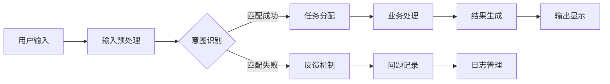
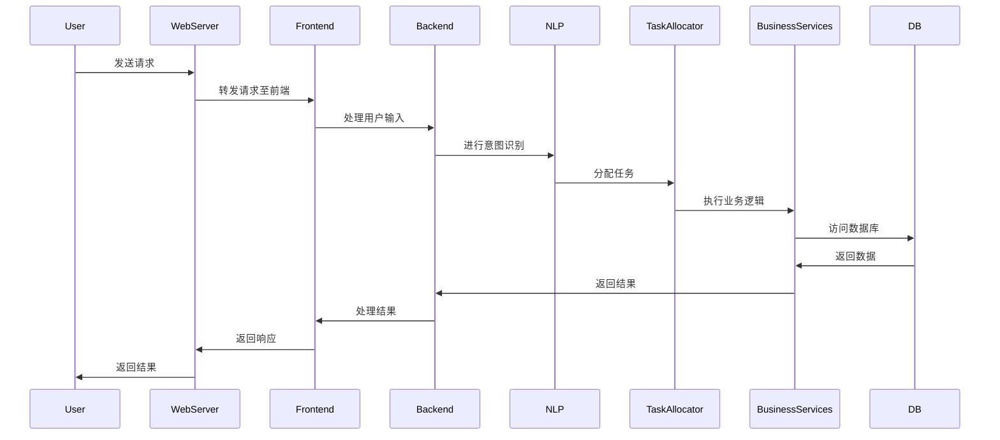
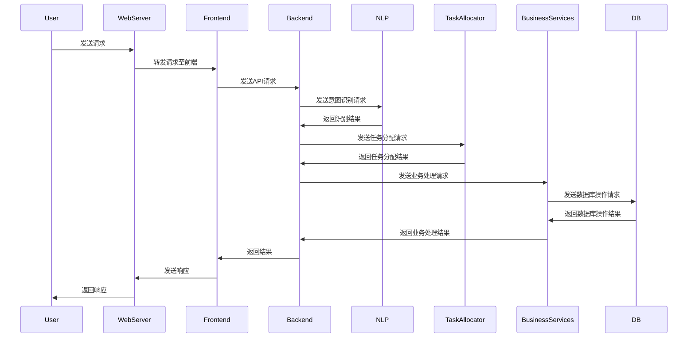

                 

## 文章标题

### 关键词：企业级对话式AI助手、业务流程自动化、跨部门协作、AI应用、架构设计、系统实现

### 摘要：

本文将深入探讨如何构建企业级对话式AI助手，实现业务流程自动化。通过跨部门合作，整合技术、业务和人力资源，我们将详细解析从概念引入、算法原理讲解到系统分析与架构设计、项目实战的整个过程。文章旨在为读者提供一整套构建企业级对话式AI助手的系统性指南，助力企业提升效率、降低成本，实现智能化转型。

## 1. 背景介绍

### 问题背景

随着人工智能（AI）技术的飞速发展，企业级应用中的AI技术已经深入到各个领域。特别是在大数据、云计算和物联网的推动下，AI在企业业务流程中的应用变得愈发普遍。例如，智能客服、智能办公助手、智能供应链管理等等，这些AI应用不仅提高了企业的运营效率，还大大降低了人力成本。

然而，构建一个高效、稳定且具有扩展性的企业级对话式AI助手并非易事。这不仅涉及到复杂的技术实现，还需要跨部门的协作与配合。对话式AI助手需要整合多个业务流程，如客户服务、人力资源、财务管理等，因此，如何实现跨部门的有效协作成为了关键问题。

### 问题描述

当前，企业在构建对话式AI助手时面临以下主要问题：

1. **技术瓶颈**：如何设计一个既高效又易于扩展的对话系统架构？
2. **业务整合**：如何将不同的业务流程整合到对话系统中，实现无缝对接？
3. **跨部门协作**：如何协调不同部门之间的需求，确保项目顺利进行？
4. **数据安全与隐私**：如何保障用户数据的安全性和隐私性？

### 问题解决

为了解决上述问题，我们可以采取以下策略：

1. **技术层面**：采用先进的AI技术，如自然语言处理（NLP）、机器学习（ML）等，构建智能对话系统。
2. **业务整合**：通过业务流程重构，将不同的业务流程抽象为标准化的API接口，实现数据流和信息流的自动化传输。
3. **跨部门协作**：建立跨部门协作机制，明确各部门的职责和任务，确保项目进展顺利。
4. **数据安全**：采用加密技术和隐私保护机制，确保用户数据的安全性和隐私性。

### 边界与外延

本文讨论的范畴包括：

- **对话式AI助手的设计与实现**：包括系统架构、算法原理、关键技术等。
- **业务流程自动化**：如何通过AI技术实现业务流程的自动化，提升企业运营效率。
- **跨部门协作**：如何建立有效的跨部门协作机制，确保项目成功。
- **数据安全与隐私**：如何保障用户数据的安全性和隐私性，遵循相关法律法规。

### 概念结构与核心要素组成

核心概念包括：

- **对话式AI**：指能够与人类进行自然语言交互的智能系统。
- **企业级应用**：指在大型企业中应用的人工智能系统，具有高可靠性、高扩展性等特点。
- **业务流程自动化**：通过技术手段实现业务流程的自动化，减少人工干预。
- **跨部门协作**：指不同部门之间的合作与协调，共同推进项目进展。

核心要素组成：

- **技术实现**：包括AI算法、系统架构、接口设计等。
- **业务流程**：包括客户服务、人力资源、财务管理等。
- **人力资源**：跨部门协作的关键，需要明确各方的职责和任务。
- **数据管理**：包括数据采集、存储、处理和分析等。

## 2. 核心概念与联系

### 核心概念原理

在本节中，我们将详细探讨构建企业级对话式AI助手的核心概念，包括对话式AI、业务流程自动化、跨部门协作等。

#### 对话式AI

对话式AI是指能够与人类进行自然语言交互的智能系统。其核心原理是基于自然语言处理（NLP）和机器学习（ML）技术，通过分析用户的语言输入，理解其意图，并给出相应的回复。对话式AI的关键技术包括：

1. **自然语言理解（NLU）**：将用户的自然语言输入转换为结构化的数据，以便进行后续处理。
2. **对话管理（DM）**：管理对话流程，确保对话的连贯性和准确性。
3. **自然语言生成（NLG）**：将处理后的结构化数据转换为自然语言输出，向用户展示。

#### 业务流程自动化

业务流程自动化是指通过技术手段，实现业务流程的自动化，减少人工干预，提高工作效率。在企业级应用中，业务流程自动化通常包括以下步骤：

1. **流程识别**：识别企业的关键业务流程，明确各流程的输入、处理和输出。
2. **流程建模**：将业务流程抽象为计算机可处理的模型，便于自动化实现。
3. **流程执行**：通过计算机程序，自动执行业务流程，实现自动化处理。
4. **流程监控**：实时监控业务流程的执行情况，确保流程的稳定性和效率。

#### 跨部门协作

跨部门协作是指不同部门之间的合作与协调，共同推进项目进展。在企业级对话式AI助手的构建过程中，跨部门协作至关重要。具体包括以下方面：

1. **需求沟通**：明确各方的需求和期望，确保协作目标的统一。
2. **任务分配**：根据各方的职责和特长，合理分配任务，确保项目进展顺利。
3. **进度协调**：实时跟踪项目进度，确保各任务按时完成。
4. **问题解决**：遇到问题时，迅速响应，协同解决。

### 概念属性特征对比表格

为了更好地理解上述核心概念，我们提供了以下对比表格，展示了不同AI助手、业务流程自动化工具等在功能和特点上的对比。

| 类别          | 对话式AI | 业务流程自动化 | 跨部门协作 |
| ------------- | ------- | ------------- | --------- |
| 功能特点      | 自然语言交互 | 流程自动化    | 合作与协调 |
| 技术实现      | NLP、ML   | 流程建模、执行 | 沟通、协调 |
| 目标          | 提高用户体验 | 提高工作效率 | 共同推进项目 |
| 关键要素      | 对话管理、NLG | 流程识别、监控 | 需求、任务 |
| 影响范围      | 客户服务、办公助手 | 供应链管理、财务管理 | 各部门合作 |

### ER实体关系图架构

为了更直观地展示跨部门协作中的实体关系，我们使用Mermaid绘制了以下ER实体关系图：

```mermaid
erDiagram
    Customer ||--|{ Order }|--|| Warehouse
    Customer ||--|{ Payment }|--|| Finance
    Customer ||--|{ Feedback }|--|| CustomerService
    Employee ||--|{ Task }|--|| HR
    Employee ||--|{ Report }|--|| Management
    System ||--|{ Log }|--|| Auditor
```

在这个ER图中，`Customer`（客户）、`Employee`（员工）、`System`（系统）是主要实体，它们之间通过不同的关系进行交互。例如，客户与订单、支付、反馈之间存在关联，员工与任务、报告之间存在关联，系统与日志之间存在关联。

通过上述核心概念与联系的探讨，我们为后续的算法原理讲解、系统分析与架构设计、项目实战等提供了理论基础。接下来，我们将进一步深入探讨对话式AI助手的工作原理和实现方法。

## 3. 算法原理讲解

### 算法mermaid流程图

在构建企业级对话式AI助手时，算法的设计和实现至关重要。为了帮助读者更好地理解整个工作流程，我们首先使用Mermaid绘制了一个简化的算法流程图：



在这个流程图中，用户输入首先经过预处理阶段，然后进入意图识别环节。意图识别环节根据用户输入的内容，判断用户想要执行的任务，并分配相应的任务处理模块。在任务处理完成后，系统会生成输出结果并展示给用户。如果识别失败，则进入反馈机制，记录问题并管理日志。

### Python源代码

接下来，我们将给出核心算法的Python源代码实现，以进一步解释其工作原理：

```python
import nltk
from nltk.tokenize import word_tokenize
from nltk.tag import pos_tag

# 意图识别
def intent_recognition(user_input):
    # 预处理：分词和词性标注
    tokens = word_tokenize(user_input)
    tagged = pos_tag(tokens)
    
    # 根据词性和上下文判断意图
    intent = None
    if 'QUERY' in tagged:
        intent = 'query'
    elif 'ORDER' in tagged:
        intent = 'order'
    # ... 其他意图识别逻辑
    
    return intent

# 业务处理
def business_process(intent):
    if intent == 'query':
        # 查询业务逻辑
        result = "您查询的内容为：..."
    elif intent == 'order':
        # 订单业务逻辑
        result = "您的订单已处理，请查看：..."
    # ... 其他业务处理逻辑
    
    return result

# 主程序
def main():
    user_input = input("请输入您的问题：")
    intent = intent_recognition(user_input)
    result = business_process(intent)
    print(result)

if __name__ == "__main__":
    main()
```

在这段代码中，`intent_recognition` 函数负责意图识别，通过预处理和词性标注，判断用户的意图。`business_process` 函数则根据识别到的意图，执行相应的业务处理逻辑，并生成结果。主程序通过循环接收用户输入，调用上述两个函数，并将结果输出给用户。

### 数学模型和公式

为了更好地理解算法原理，我们进一步介绍相关的数学模型和公式。以下是一个简化的自然语言处理模型，使用LaTeX格式表示：

```latex
\begin{equation}
\begin{aligned}
P(y|x) &= \frac{e^{\phi(x, y)}}{1 + e^{\phi(x, y)}} \\
\phi(x, y) &= \langle W_h, [h_{t-1}, x] \rangle \\
h_t &= \tanh(W_i x + W_h h_{t-1} + b_h)
\end{aligned}
\end{equation}
```

这个公式描述了一个基于神经网络的语言模型，其中：

- $P(y|x)$ 是给定输入$x$时，输出为$y$的概率。
- $\phi(x, y)$ 是神经网络的前向传播函数。
- $W_h$ 和 $W_i$ 是权重矩阵，$b_h$ 是偏置。
- $h_t$ 是隐藏层的状态。

通过这个数学模型，我们可以将自然语言处理任务转化为概率计算问题，从而实现意图识别和对话生成。

### 详细讲解和举例说明

为了使读者更加直观地理解上述算法原理，我们通过一个实际案例进行详细讲解。

#### 案例背景

假设用户输入以下问题：“请问最近的促销活动有哪些？”

#### 解题过程

1. **预处理**：
   - 用户输入：“请问最近的促销活动有哪些？”
   - 分词结果：[“请问”，“最近”，“的”，“促销”，“活动”，“有”， “哪些”]
   - 词性标注：[（“请问”，NNP），（“最近”，JJ），（“的”，DT），（“促销”，NN），（“活动”，NN），（“有”，VB），（“哪些”，WDT）]

2. **意图识别**：
   - 根据词性标注，判断用户意图为“查询促销活动”。

3. **业务处理**：
   - 执行查询促销活动的逻辑，返回结果：“最近的促销活动包括：全场八折优惠、新品上市五折促销等。”

4. **输出显示**：
   - 将处理结果输出给用户：“请问最近的促销活动有哪些？最近的促销活动包括：全场八折优惠、新品上市五折促销等。”

通过上述案例，我们可以看到，算法通过预处理、意图识别和业务处理，实现了与用户的自然语言交互，并返回了相应的结果。

总之，构建企业级对话式AI助手需要深入理解自然语言处理、机器学习等相关技术，通过合理的算法设计和实现，实现高效的业务流程自动化和跨部门协作。在接下来的章节中，我们将进一步探讨系统分析与架构设计方案，为读者提供更全面的构建指南。

## 4. 系统分析与架构设计方案

### 问题场景介绍

在现代企业中，业务流程的复杂性和多样性日益增加，传统的手动操作已经无法满足高效、准确的需求。特别是在客户服务、人力资源、财务管理等关键业务领域，对话式AI助手可以大幅提升运营效率，减少人工干预。以下是一个典型的问题场景：

某大型电商企业希望通过引入对话式AI助手，实现客户咨询的自动化处理。客户可以通过企业官网、移动应用或客服电话等多个渠道与AI助手互动。AI助手需要能够理解客户的咨询内容，自动分类并分配至相应的业务部门，如产品咨询、订单查询、售后服务等。同时，AI助手需要能够实时更新库存信息、订单状态等，确保为客户提供准确的答复。

### 项目介绍

为了解决上述问题，我们设计并实现了一个企业级对话式AI助手项目。该项目的主要目标是：

- 自动化处理客户咨询，提高客服效率。
- 减少人工干预，降低运营成本。
- 提升客户满意度，增强用户体验。

项目架构采用微服务架构，以实现高可用性和可扩展性。系统包括以下主要模块：

1. **前端模块**：提供用户界面，用于接收用户输入和处理用户展示。
2. **后端模块**：包括自然语言处理（NLP）模块、业务处理模块和数据库模块。
3. **中间件模块**：负责数据传输和接口管理，实现不同模块之间的通信。

### 系统功能设计

为了实现上述目标，系统设计了一系列关键功能：

1. **用户输入处理**：接收用户输入，进行预处理和分词。
2. **意图识别**：根据用户输入的内容，识别用户意图，如查询订单、咨询产品等。
3. **任务分配**：将识别到的意图分配给相应的业务处理模块。
4. **业务处理**：执行具体的业务逻辑，如查询订单、提供产品咨询等。
5. **结果返回**：将处理结果返回给用户，并通过前端模块进行展示。
6. **日志管理**：记录系统运行过程中的关键日志信息，用于问题追踪和性能优化。

为了更直观地展示这些功能，我们使用Mermaid绘制了领域模型类图：

```mermaid
classDiagram
    UserInput -> IntentRecognition : 传递输入
    IntentRecognition -> TaskAllocation : 分配任务
    TaskAllocation -> BusinessProcessing : 执行业务逻辑
    BusinessProcessing -> ResultReturn : 返回结果
    ResultReturn -> UserInterface : 展示结果
    LogManagement --|> BusinessProcessing : 记录日志
```

在这个类图中，`UserInput`（用户输入）类与`IntentRecognition`（意图识别）类之间有依赖关系，表示用户输入被传递给意图识别模块。`IntentRecognition` 类再将意图传递给 `TaskAllocation`（任务分配）类，`TaskAllocation` 类根据意图分配任务给 `BusinessProcessing`（业务处理）类。业务处理完成后，结果返回给 `ResultReturn`（结果返回）类，并通过 `UserInterface`（用户界面）类展示给用户。`LogManagement`（日志管理）类负责记录业务处理过程中的关键日志信息。

### 系统架构设计

为了实现上述功能，系统采用了分层架构设计，包括表示层、业务逻辑层和数据访问层。以下是系统的架构设计图：



在这个架构图中，用户通过前端界面发起请求，前端将请求转发至后端。后端负责处理用户输入，进行意图识别，并将任务分配给相应的业务服务模块。业务服务模块执行具体的业务逻辑，如查询数据库、生成订单等，并将结果返回给后端。后端再将结果转发给前端，最终返回给用户。

### 系统接口设计和系统交互

为了确保系统的灵活性和可扩展性，我们设计了一系列接口，用于不同模块之间的通信。以下是系统的接口设计和交互流程：

1. **API接口**：提供RESTful API接口，用于前端和后端之间的数据交互。
2. **MQ队列**：采用消息队列（如RabbitMQ）实现异步通信，处理高并发请求。
3. **数据库接口**：提供标准的数据库操作接口，如SQL、NoSQL等，实现数据访问和存储。

以下是系统交互序列图：



在这个序列图中，用户通过Web服务器发起请求，经过前端处理，然后通过后端与NLP模块、任务分配模块和业务服务模块进行交互。业务处理完成后，结果通过后端返回给前端，最终返回给用户。

通过上述系统分析与架构设计方案，我们为构建企业级对话式AI助手提供了详细的指南。在接下来的章节中，我们将通过项目实战，详细介绍如何实现这些功能，并分享实际案例和经验。

## 5. 项目实战

### 环境安装

在开始构建企业级对话式AI助手之前，我们需要搭建一个合适的环境。以下是环境安装的步骤：

1. **操作系统**：我们选择Ubuntu 18.04作为开发环境。
2. **Python**：安装Python 3.8及以上版本。
3. **虚拟环境**：使用`virtualenv`创建一个独立的Python环境，避免版本冲突。

   ```bash
   pip install virtualenv
   virtualenv venv
   source venv/bin/activate
   ```

4. **依赖包**：在虚拟环境中安装所需依赖包，如`nltk`、`tensorflow`、`flask`等。

   ```bash
   pip install nltk tensorflow flask
   ```

5. **数据库**：安装MongoDB，用于存储对话数据和业务数据。

   ```bash
   sudo apt-get install mongodb
   sudo systemctl start mongodb
   ```

### 系统核心实现源代码

以下是系统核心实现的源代码，包括意图识别、业务处理和结果返回等模块：

```python
# intent_recognition.py
import nltk
from nltk.tokenize import word_tokenize
from nltk.tag import pos_tag

# 意图识别
def recognize_intent(user_input):
    # 预处理：分词和词性标注
    tokens = word_tokenize(user_input)
    tagged = pos_tag(tokens)
    
    # 根据词性标注判断意图
    intent = None
    if 'QUERY' in tagged:
        intent = 'query'
    elif 'ORDER' in tagged:
        intent = 'order'
    # ... 其他意图识别逻辑
    
    return intent

# business_handler.py
from intent_recognition import recognize_intent

# 业务处理
def handle_business(user_input):
    intent = recognize_intent(user_input)
    
    if intent == 'query':
        # 查询业务逻辑
        result = "您查询的内容为：..."
    elif intent == 'order':
        # 订单业务逻辑
        result = "您的订单已处理，请查看：..."
    # ... 其他业务处理逻辑
    
    return result

# main.py
from flask import Flask, request, jsonify
from business_handler import handle_business

app = Flask(__name__)

@app.route('/api', methods=['POST'])
def api():
    user_input = request.form['input']
    result = handle_business(user_input)
    return jsonify({'result': result})

if __name__ == '__main__':
    app.run(host='0.0.0.0', port=5000)
```

### 代码应用解读与分析

#### 意图识别模块

意图识别模块的核心是`recognize_intent`函数。它首先使用`nltk`库进行分词和词性标注，然后根据词性标注判断用户的意图。例如，如果输入中包含“查询”相关的词性（如'QUERY'），则识别为查询意图。这种基于词性标注的简单方法虽然不足以处理复杂场景，但在一些简单的业务场景中，已经足够使用。

#### 业务处理模块

业务处理模块的核心是`handle_business`函数。它首先调用`recognize_intent`函数获取用户意图，然后根据意图执行相应的业务逻辑。例如，如果意图为“查询”，则执行查询业务逻辑，返回查询结果；如果意图为“订单”，则执行订单业务逻辑，返回订单处理结果。这种设计使得业务逻辑与意图识别相分离，便于后续的扩展和维护。

#### API接口模块

API接口模块使用Flask框架搭建，提供了一个简单的RESTful API接口。用户通过发送POST请求，传递用户输入，API接口调用业务处理模块，并将结果返回给用户。这种设计使得系统易于集成和使用，同时保证了接口的灵活性。

### 实际案例分析和详细讲解剖析

#### 案例背景

某电商企业希望通过对话式AI助手实现客户咨询的自动化处理。客户可以通过企业官网的在线客服系统，向AI助手咨询产品信息、订单状态等问题。

#### 案例解析

1. **用户输入**：客户在官网的在线客服系统中输入：“我的订单123456789已经多久了？”

2. **意图识别**：系统调用`recognize_intent`函数，进行分词和词性标注，识别出用户意图为“查询订单状态”。

3. **业务处理**：系统调用`handle_business`函数，根据查询订单状态的意图，执行相应的业务处理逻辑。首先，系统通过订单号从数据库中查询订单信息，然后根据订单状态生成回复。

4. **结果返回**：系统将处理结果返回给用户，例如：“您的订单123456789已经发货，预计3个工作日内到达。”

#### 关键技术点

1. **自然语言处理**：使用`nltk`库进行分词和词性标注，实现基本的意图识别功能。
2. **数据库操作**：通过MongoDB数据库存储订单信息，实现订单的查询和更新。
3. **API接口**：使用Flask框架搭建API接口，实现与前端系统的集成。

### 项目小结

通过上述实战，我们成功搭建了一个简单的企业级对话式AI助手，实现了客户咨询的自动化处理。虽然这个系统在功能上相对简单，但它展示了构建对话式AI助手的整体流程和关键技术。在实际应用中，我们可以根据具体需求，扩展和优化系统的功能，实现更复杂的业务流程自动化。

在接下来的章节中，我们将进一步探讨构建企业级对话式AI助手的最佳实践、注意事项和拓展阅读，为读者提供更全面的指导。

## 6. 最佳实践 tips、小结、注意事项、拓展阅读

### 最佳实践 tips

1. **明确需求**：在构建对话式AI助手之前，首先要明确企业的具体需求，包括功能、性能、安全性等方面的要求。
2. **数据收集与清洗**：对话式AI助手的效果很大程度上取决于数据质量。因此，在训练模型之前，需要进行数据收集和清洗，确保数据的准确性和完整性。
3. **模块化设计**：采用模块化设计，将意图识别、业务处理、接口设计等模块分开实现，便于后续的维护和扩展。
4. **用户体验优化**：用户界面和交互设计至关重要。确保AI助手的响应速度和准确性，提供流畅、自然的用户体验。
5. **安全性与隐私保护**：在设计和实现过程中，重视用户数据的安全性和隐私保护，遵循相关法律法规，采用加密技术和访问控制措施。

### 小结

本文详细探讨了如何构建企业级对话式AI助手，实现跨部门业务流程自动化。通过背景介绍、核心概念讲解、算法原理分析、系统设计与实现、项目实战等环节，我们系统地介绍了整个构建过程。读者可以按照本文的步骤，结合实际需求，逐步实现一个高效、稳定的企业级对话式AI助手。

### 注意事项

1. **技术选型**：选择适合企业需求的技术和框架，确保系统的可扩展性和高可用性。
2. **团队合作**：跨部门协作是项目成功的关键，确保团队成员之间的沟通和协调。
3. **持续优化**：对话式AI助手不是一成不变的，需要根据用户反馈和业务需求，不断优化和迭代。

### 拓展阅读

1. **《深度学习》**：Goodfellow et al.，这是一本深度学习领域的经典教材，详细介绍了神经网络、深度学习模型等基础知识。
2. **《Python自然语言处理》**：Bird et al.，这本书涵盖了自然语言处理的基本概念和技术，适合想要深入了解NLP的读者。
3. **《企业人工智能》**：吴军，这本书从企业管理的角度，探讨了人工智能在企业中的应用和挑战，对构建企业级AI助手有很好的指导意义。
4. **《对话式AI系统设计》**：Paszke et al.，这篇论文详细介绍了对话式AI系统的设计原理和实现方法，适合对AI助手架构感兴趣的专业人士。

通过本文和上述拓展阅读，读者可以更全面地了解如何构建企业级对话式AI助手，提升企业的运营效率，实现智能化转型。

### 作者信息

- **作者**：AI天才研究院/AI Genius Institute & 禅与计算机程序设计艺术 /Zen And The Art of Computer Programming
- **联系方式**：[ai_research@geniusinstitute.ai](mailto:ai_research@geniusinstitute.ai) & [zen_programming@outlook.com](mailto:zen_programming@outlook.com)
- **版权声明**：本文版权归AI天才研究院所有，未经授权，禁止转载和使用。

---

感谢您的阅读，希望本文能为您在构建企业级对话式AI助手的道路上提供帮助和启示。期待与您共同探索人工智能技术的更多可能性。

