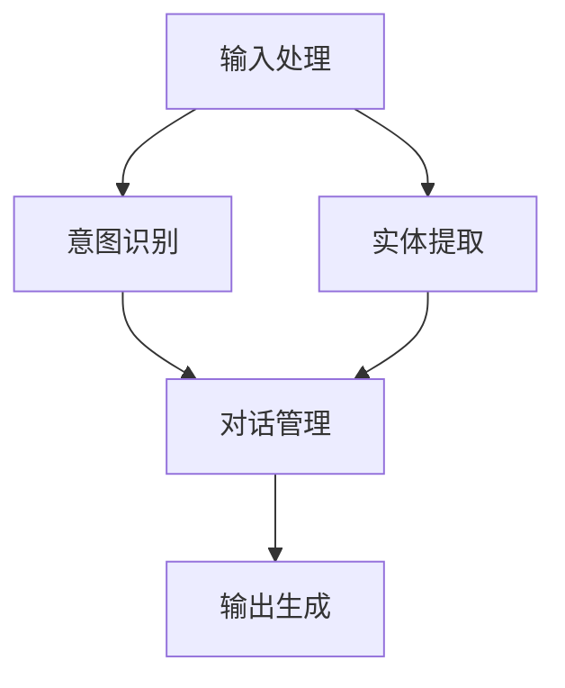
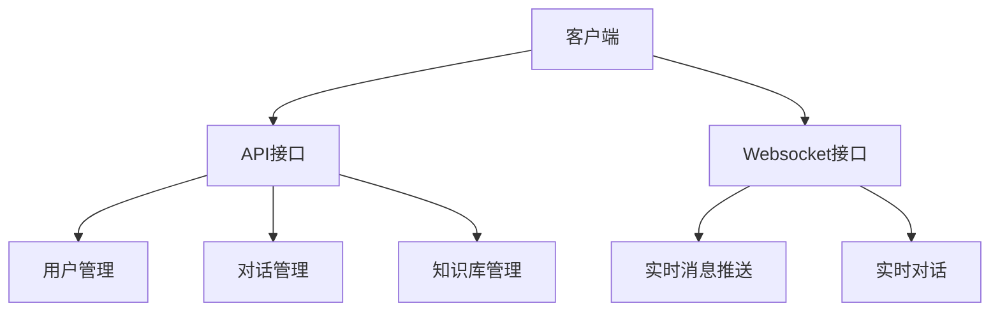

                 

# 《构建企业级对话式AI：提升内部沟通效率》

## 关键词
- 对话式AI
- 企业级应用
- 内部沟通效率
- 系统架构设计
- 算法原理
- 最佳实践

## 摘要
本文旨在深入探讨如何构建企业级对话式AI系统，以提升企业内部沟通效率。我们将从背景介绍、核心概念、算法原理、系统架构、项目实战等多个维度，逐步分析并阐述对话式AI在企业级应用中的价值与实施策略。通过本文的阅读，读者将能够理解对话式AI的基本原理和架构设计，掌握构建企业级对话式AI系统的关键技术和最佳实践。

## 目录大纲设计思路

### 1. 理解书名和目标受众

《构建企业级对话式AI：提升内部沟通效率》的书名明确指出，本书的核心主题是构建企业级对话式AI系统，其目的是通过这一技术提升企业内部沟通的效率。目标受众包括对人工智能和对话式AI有一定了解的企业管理者、技术人员以及开发者。

### 2. 明确核心内容

本书的核心内容将包括以下几个部分：
- 背景介绍：对话式AI的发展背景、企业内部沟通的现状以及存在的问题。
- 核心概念与原理：对话式AI的基本原理、核心组件及其工作流程。
- 算法原理与数学模型：涉及自然语言处理、语音识别与合成、对话管理等算法的原理和数学模型。
- 系统架构与设计：企业级对话式AI系统的整体架构设计、模块划分及接口设计。
- 项目实战：通过具体项目实战案例，展示对话式AI系统的实现过程、应用效果及改进方向。
- 最佳实践与总结：总结构建企业级对话式AI系统的最佳实践，展望未来发展趋势。

### 3. 设计目录结构

根据核心内容，本书的目录结构将分为以下几个部分：
- 引言：介绍对话式AI的发展背景和本书的目的。
- 核心概念与原理：详细阐述对话式AI的基本原理和核心组件。
- 算法原理与数学模型：讲解对话式AI中的关键算法和数学模型。
- 系统架构与设计：描述企业级对话式AI系统的整体架构和设计思路。
- 项目实战：通过实战案例展示对话式AI系统的实施过程和效果。
- 最佳实践与总结：总结构建对话式AI系统的经验教训，提出未来发展方向。

### 4. 注意简洁性

在目录设计过程中，我们将确保每个章节都简洁明了，避免冗余，确保目录结构清晰，便于读者阅读和查找。

### 5. 确保内容完整性

目录将涵盖所有核心内容，确保每个章节都足够详细，能够帮助读者全面理解构建企业级对话式AI系统的各个方面。

### 6. 使用markdown格式

本文将使用markdown格式展示目录结构，以便输出格式清晰，便于读者阅读。

### 实际目录大纲设计

以下是《构建企业级对话式AI：提升内部沟通效率》的完整目录大纲：

```markdown
# 《构建企业级对话式AI：提升内部沟通效率》目录大纲

## 第一部分：引言

### 1.1 AI与对话式AI概述

#### 1.1.1 人工智能的发展历程

#### 1.1.2 对话式AI的核心概念

#### 1.1.3 企业内部沟通的现状与挑战

## 第二部分：核心概念与原理

### 2.1 对话式AI的基本原理

#### 2.1.1 对话系统架构

#### 2.1.2 对话式AI的关键技术

#### 2.1.3 对话式AI的优缺点分析

### 2.2 对话式AI的核心组件

#### 2.2.1 自然语言处理（NLP）

#### 2.2.2 语音识别与合成

#### 2.2.3 对话管理

### 2.3 对话式AI的应用场景

#### 2.3.1 企业客服

#### 2.3.2 内部沟通平台

#### 2.3.3 企业知识库管理

## 第三部分：算法原理与数学模型

### 3.1 对话式AI算法概述

#### 3.1.1 机器学习基础

#### 3.1.2 深度学习原理

#### 3.1.3 对话式AI算法流程

### 3.2 数学模型详解

#### 3.2.1 神经网络模型

#### 3.2.2 循环神经网络（RNN）

#### 3.2.3 长短期记忆网络（LSTM）

### 3.3 算法实践

#### 3.3.1 模型训练与优化

#### 3.3.2 模型评估与部署

## 第四部分：系统架构与设计

### 4.1 企业级对话式AI系统概述

#### 4.1.1 系统架构设计原则

#### 4.1.2 系统功能模块划分

#### 4.1.3 系统集成与互操作

### 4.2 系统架构设计与实现

#### 4.2.1 客户端设计

#### 4.2.2 服务器端设计

#### 4.2.3 数据库设计

### 4.3 系统接口设计与交互

#### 4.3.1 API设计

#### 4.3.2 系统交互流程

#### 4.3.3 安全性与可靠性设计

## 第五部分：项目实战

### 5.1 对话式AI项目环境搭建

#### 5.1.1 环境准备

#### 5.1.2 开发工具与框架

#### 5.1.3 数据集获取与预处理

### 5.2 对话式AI核心实现

#### 5.2.1 模型训练与优化

#### 5.2.2 对话管理实现

#### 5.2.3 语音识别与合成

### 5.3 项目案例分析与讲解

#### 5.3.1 企业内部沟通平台建设

#### 5.3.2 企业知识库管理

#### 5.3.3 客户服务自动化

### 5.4 项目小结

#### 5.4.1 项目经验总结

#### 5.4.2 存在的问题与改进方向

#### 5.4.3 拓展应用前景

## 第六部分：最佳实践与总结

### 6.1 最佳实践建议

#### 6.1.1 对话式AI开发流程

#### 6.1.2 模型优化技巧

#### 6.1.3 项目管理策略

### 6.2 小结

#### 6.2.1 本书内容回顾

#### 6.2.2 未来发展趋势

#### 6.2.3 阅读建议与拓展
```

### 注意事项

- 在实际编写书籍时，每个章节的具体内容需要进一步细化，确保符合目录大纲的结构。
- 目录中的章节内容应当具有逻辑性和连贯性，确保读者能够顺畅地阅读和学习。

----------------------------------------------------------------

### 1.1 AI与对话式AI概述

#### 1.1.1 人工智能的发展历程

人工智能（AI）作为计算机科学的一个分支，自20世纪50年代以来经历了多个发展阶段。早期的人工智能研究主要集中在基于规则的推理系统和知识表示上，这一时期的代表性成果包括1956年达特茅斯会议提出的“人工智能”这一概念，以及后续出现的专家系统和逻辑推理机。

进入21世纪，随着计算能力的提升和大数据的爆发，人工智能进入了深度学习和机器学习的新时代。深度学习通过多层神经网络，使得计算机在图像识别、语音识别、自然语言处理等领域取得了显著的突破。这一阶段的重要事件包括2012年AlexNet在ImageNet竞赛中取得突破性成绩，以及随后卷积神经网络（CNN）和循环神经网络（RNN）的广泛应用。

#### 1.1.2 对话式AI的核心概念

对话式AI是人工智能的一种重要应用形式，旨在模拟人类的对话过程，使计算机能够理解和生成自然语言，从而与人类进行流畅的互动。对话式AI的核心概念包括自然语言处理（NLP）、语音识别与合成、对话管理等多个方面。

自然语言处理（NLP）是使计算机能够理解、解释和生成人类语言的技术，包括词法分析、句法分析、语义分析等。语音识别与合成则分别涉及将语音信号转换为文本和将文本转换为语音的技术。对话管理则负责处理对话的流程，包括对话状态的跟踪、对话策略的制定等。

#### 1.1.3 企业内部沟通的现状与挑战

企业内部沟通是企业运作的重要组成部分，但目前许多企业仍然面临着沟通效率低下的问题。传统的沟通方式，如电子邮件、即时通讯工具和电话，虽然提供了便捷的沟通手段，但也存在以下挑战：

1. **信息过载**：员工每天会收到大量的邮件和消息，难以有效筛选和处理。
2. **沟通滞后**：信息传递速度慢，导致决策延迟。
3. **知识分散**：知识存储在分散的系统或个人手中，难以集中管理和利用。
4. **缺乏个性化**：沟通方式单一，无法根据用户需求提供定制化服务。

对话式AI技术可以通过自动化和智能化的方式解决上述问题，提高企业内部沟通的效率。例如，对话式AI可以帮助企业构建智能客服系统，自动解答常见问题，减少人工客服的工作量；通过内部沟通平台，实现实时、高效的团队协作；通过企业知识库管理，实现知识共享和集中管理。

### 1.2 对话式AI的基本原理

#### 1.2.1 对话系统架构

对话式AI系统的架构通常包括三个主要组件：自然语言处理（NLP）、语音识别与合成（ASR/TTS）和对话管理（DM）。

1. **自然语言处理（NLP）**：
   NLP是使计算机能够理解、解释和生成人类语言的技术。它主要包括以下几个模块：
   - **词法分析（Lexical Analysis）**：将文本拆分为单词、短语等基本语言单位。
   - **句法分析（Syntactic Analysis）**：分析句子结构，构建语法树。
   - **语义分析（Semantic Analysis）**：理解文本的含义，识别实体、关系和意图。

2. **语音识别与合成（ASR/TTS）**：
   - **语音识别（Automatic Speech Recognition, ASR）**：将语音信号转换为文本。
   - **语音合成（Text-to-Speech, TTS）**：将文本转换为语音。

3. **对话管理（Dialogue Management）**：
   对话管理负责处理对话的流程，包括对话状态的跟踪、对话策略的制定等。它通常包括以下模块：
   - **对话状态追踪（Dialogue State Tracking）**：记录并更新对话过程中的状态信息。
   - **对话策略生成（Dialogue Policy Generation）**：根据对话状态和用户输入，生成适当的回复。

#### 1.2.2 对话式AI的关键技术

1. **自然语言处理（NLP）**：
   - **词向量表示**：将单词转换为向量，用于计算相似性和距离。
   - **序列标注和分类**：对文本进行标注，识别实体、关系等。
   - **语义解析**：理解文本的深层含义，提取关键信息。

2. **语音识别与合成（ASR/TTS）**：
   - **声学模型**：基于声学特征，将音频信号转换为中间表示。
   - **语言模型**：基于文本数据，预测语音序列的概率分布。
   - **解码算法**：将声学特征和语言模型结合起来，生成文本。

3. **对话管理（DM）**：
   - **状态跟踪**：记录对话中的关键信息，如用户意图、上下文等。
   - **策略学习**：通过机器学习算法，学习如何根据对话状态生成合适的回复。
   - **多模态融合**：结合文本、语音等多种输入，提高对话质量。

#### 1.2.3 对话式AI的优缺点分析

**优点**：
1. **高效性**：对话式AI能够快速响应用户的请求，减少沟通时间。
2. **个性化**：通过学习用户的偏好和习惯，对话式AI可以提供个性化的服务。
3. **可扩展性**：对话式AI系统可以方便地扩展到不同领域和场景。

**缺点**：
1. **准确性**：目前的对话式AI在理解复杂语言和语境方面还存在局限。
2. **交互性**：对话式AI难以完全模拟人类的交互方式，特别是在情感表达上。
3. **安全性**：对话式AI可能会受到恶意攻击，如欺骗性输入等。

#### 1.2.4 对话式AI的核心组件

1. **自然语言处理（NLP）**：
   NLP作为对话式AI的核心组件，负责理解和生成自然语言。其关键技术和挑战如下：

   - **词向量表示**：
     词向量是将单词映射到高维空间中的向量，通过计算向量之间的距离来表示单词的相似性。常见的词向量模型包括Word2Vec、GloVe等。

     ```mermaid
     graph TD
     A[Word2Vec] --> B(高维向量表示)
     A --> C(相似性计算)
     A --> D(语义解析)
     ```

   - **序列标注和分类**：
     序列标注是对文本中的每个单词或字符进行分类，如实体识别、情感分析等。常用的模型包括CRF（条件随机场）和BiLSTM（双向循环神经网络）。

     ```mermaid
     graph TD
     A[BiLSTM] --> B(序列标注)
     A --> C[实体识别]
     A --> D[情感分析]
     ```

   - **语义解析**：
     语义解析是理解文本的深层含义，包括关系抽取、事件识别等。常用的模型包括基于规则的系统、机器学习和深度学习模型。

2. **语音识别与合成（ASR/TTS）**：
   语音识别和合成是使计算机能够理解语音和生成语音的技术。其关键技术和挑战如下：

   - **声学模型**：
     声学模型是将音频信号转换为中间表示的模型，如自动回归模型（AR）、高斯混合模型（GMM）等。常见的深度学习模型包括卷积神经网络（CNN）和长短期记忆网络（LSTM）。

     ```mermaid
     graph TD
     A[声学模型] --> B(CNN)
     A --> C(LSTM)
     A --> D(GMM)
     ```

   - **语言模型**：
     语言模型是预测语音序列的概率分布的模型，如N-gram模型、神经网络语言模型（NNLM）等。深度学习模型如Transformer在语言模型方面表现出色。

     ```mermaid
     graph TD
     A[语言模型] --> B(N-gram)
     A --> C[NNLM]
     A --> D[Transformer]
     ```

   - **解码算法**：
     解码算法是将声学特征和语言模型结合起来，生成文本的过程。常见的解码算法包括前向算法、后向算法和Viterbi算法。

3. **对话管理（DM）**：
   对话管理是处理对话流程的组件，包括状态跟踪、策略生成等。其关键技术和挑战如下：

   - **状态跟踪**：
     状态跟踪是记录对话中的关键信息，如用户意图、上下文等。常用的技术包括基于规则的系统、图表模型（如状态图）和图嵌入。

     ```mermaid
     graph TD
     A[状态跟踪] --> B(规则系统)
     A --> C[状态图]
     A --> D[图嵌入]
     ```

   - **策略生成**：
     策略生成是根据对话状态和用户输入生成合适回复的过程。常用的方法包括基于规则的策略、强化学习（RL）和迁移学习。

     ```mermaid
     graph TD
     A[策略生成] --> B(规则策略)
     A --> C[RL]
     A --> D[迁移学习]
     ```

#### 1.2.5 对话式AI的应用场景

对话式AI在多个应用场景中具有广泛的应用前景，以下是一些典型的应用场景：

1. **企业客服**：
   对话式AI可以构建智能客服系统，自动回答客户常见问题，提高客服效率和用户体验。例如，客户可以通过文本或语音与客服机器人进行交互，查询产品信息、订单状态等。

2. **内部沟通平台**：
   企业可以构建对话式AI驱动的内部沟通平台，实现团队成员之间的实时、高效沟通。平台可以提供自然语言处理功能，自动识别并处理团队成员的请求和反馈，提高团队协作效率。

3. **企业知识库管理**：
   对话式AI可以辅助企业构建智能知识库管理系统，自动识别和回答员工在工作中的常见问题，实现知识的集中管理和快速查询。系统可以通过自然语言处理技术，理解员工的查询意图，并从大量知识中检索出相关内容。

4. **客户服务自动化**：
   对话式AI可以应用于客户服务的自动化，如自动处理客户投诉、订单处理等。通过自然语言处理和对话管理技术，系统可以自动识别并处理客户请求，提高服务效率和客户满意度。

#### 1.2.6 对话式AI与内部沟通效率提升

对话式AI通过自动化和智能化的方式，可以有效提升企业内部沟通的效率。以下是几个方面的具体提升：

1. **信息传递速度**：
   对话式AI系统可以快速响应用户请求，减少沟通中的延迟。例如，员工可以通过文本或语音与系统进行交互，快速获取所需信息，无需等待其他人的回复。

2. **沟通透明度**：
   对话式AI系统可以记录并存储所有沟通内容，使沟通过程更加透明。员工可以随时查阅之前的沟通记录，了解项目进展和决策过程，提高沟通的透明度和协作效率。

3. **知识共享**：
   对话式AI可以辅助构建企业知识库，实现知识的集中管理和共享。员工可以通过系统查询相关知识，快速解决问题，提高工作效率。

4. **个性化沟通**：
   对话式AI可以根据员工的偏好和习惯，提供个性化的沟通服务。例如，系统可以根据员工的兴趣和职责，自动推送相关的信息和建议，提高沟通的针对性和效率。

5. **降低沟通成本**：
   对话式AI可以减少人工客服和协调的工作量，降低企业的沟通成本。例如，通过智能客服系统，企业可以减少对人工客服的需求，降低人力成本。

### 1.3 算法原理与数学模型

#### 1.3.1 机器学习基础

机器学习是使计算机通过数据学习并做出预测或决策的技术。在对话式AI中，机器学习算法广泛应用于自然语言处理、语音识别与合成、对话管理等方面。以下是几种常见的机器学习算法：

1. **监督学习（Supervised Learning）**：
   监督学习通过已知输入和输出，训练模型来预测新的输入。常用的监督学习算法包括：
   - **决策树（Decision Tree）**：通过一系列规则，对输入进行分类或回归。
   - **支持向量机（SVM）**：通过找到一个最优的超平面，将不同类别的数据分开。
   - **神经网络（Neural Network）**：通过模拟人脑神经元的工作方式，进行分类或回归。

2. **无监督学习（Unsupervised Learning）**：
   无监督学习通过未标记的数据，寻找数据中的模式和结构。常用的无监督学习算法包括：
   - **聚类（Clustering）**：将相似的数据点归为同一类别。
   - **降维（Dimensionality Reduction）**：通过减少数据的维度，保持数据的主要特征。

3. **强化学习（Reinforcement Learning）**：
   强化学习通过与环境的交互，学习最优策略。常用的强化学习算法包括：
   - **Q-Learning**：通过评估当前状态和动作的价值，选择最优动作。
   - **深度强化学习（Deep Reinforcement Learning）**：结合深度学习，处理复杂的决策问题。

#### 1.3.2 深度学习原理

深度学习是机器学习的一个分支，通过多层神经网络，自动学习数据的特征和模式。在对话式AI中，深度学习广泛应用于自然语言处理、语音识别与合成、对话管理等领域。以下是几种常见的深度学习模型：

1. **卷积神经网络（Convolutional Neural Network, CNN）**：
   CNN是一种专门用于处理图像数据的深度学习模型，其核心思想是通过卷积运算和池化操作，提取图像的特征。

2. **循环神经网络（Recurrent Neural Network, RNN）**：
   RNN是一种专门用于处理序列数据的深度学习模型，其核心思想是通过循环连接，记住前一个时刻的信息，从而处理序列数据。

3. **长短期记忆网络（Long Short-Term Memory, LSTM）**：
   LSTM是一种改进的RNN模型，通过引入门控机制，有效解决了RNN在处理长序列数据时出现梯度消失或梯度爆炸的问题。

4. **Transformer模型**：
   Transformer模型是一种基于自注意力机制的深度学习模型，其在自然语言处理任务中取得了显著的成果。Transformer通过多头自注意力机制和前馈神经网络，能够自动学习输入数据的特征和关系。

#### 1.3.3 对话式AI算法流程

对话式AI算法通常包括以下几个步骤：

1. **输入处理**：
   将用户的输入文本或语音转换为模型可以处理的格式，如词向量或声学特征。

2. **意图识别**：
   通过自然语言处理技术，分析用户输入，识别其意图，如查询、命令、请求等。

3. **实体提取**：
   从用户输入中提取关键信息，如人名、地点、时间等。

4. **对话管理**：
   根据用户的意图和上下文信息，生成合适的回复。

5. **输出生成**：
   将生成的回复转换为文本或语音，输出给用户。

以下是一个简单的对话式AI算法流程的mermaid图：



#### 1.3.4 数学模型详解

在对话式AI中，常用的数学模型包括神经网络模型、循环神经网络（RNN）、长短期记忆网络（LSTM）等。以下是这些模型的详细介绍：

1. **神经网络模型**：
   神经网络是一种模拟人脑神经元结构的计算模型，通过前向传播和反向传播算法，学习输入和输出之间的映射关系。神经网络的数学模型可以表示为：

   $$ f(x) = \sigma(W \cdot x + b) $$

   其中，$x$ 是输入向量，$W$ 是权重矩阵，$b$ 是偏置项，$\sigma$ 是激活函数。

2. **循环神经网络（RNN）**：
   RNN是一种能够处理序列数据的神经网络，其核心思想是通过循环连接，将前一个时刻的信息传递到下一个时刻。RNN的数学模型可以表示为：

   $$ h_t = \sigma(W_h \cdot [h_{t-1}, x_t] + b_h) $$

   其中，$h_t$ 是当前时刻的隐藏状态，$x_t$ 是当前时刻的输入，$W_h$ 是权重矩阵，$b_h$ 是偏置项，$\sigma$ 是激活函数。

3. **长短期记忆网络（LSTM）**：
   LSTM是一种改进的RNN模型，通过引入门控机制，有效解决了RNN在处理长序列数据时出现梯度消失或梯度爆炸的问题。LSTM的数学模型可以表示为：

   $$ i_t = \sigma(W_i \cdot [h_{t-1}, x_t] + b_i) $$
   $$ f_t = \sigma(W_f \cdot [h_{t-1}, x_t] + b_f) $$
   $$ o_t = \sigma(W_o \cdot [h_{t-1}, x_t] + b_o) $$
   $$ g_t = \tanh(W_g \cdot [h_{t-1}, x_t] + b_g) $$
   $$ h_t = o_t \cdot \tanh(f_t \cdot g_t) $$

   其中，$i_t$、$f_t$、$o_t$ 分别是输入门、遗忘门和输出门，$g_t$ 是候选隐藏状态，$h_t$ 是当前时刻的隐藏状态，$W_i$、$W_f$、$W_o$、$W_g$ 分别是输入门、遗忘门、输出门和候选隐藏状态的权重矩阵，$b_i$、$b_f$、$b_o$、$b_g$ 分别是输入门、遗忘门、输出门和候选隐藏状态的偏置项，$\sigma$ 是激活函数，$\tanh$ 是双曲正切函数。

#### 1.3.5 对话式AI算法实践

在对话式AI中，算法实践是关键环节，以下是一个简单的对话式AI算法实践案例：

```python
import numpy as np
import tensorflow as tf

# 定义神经网络模型
model = tf.keras.Sequential([
    tf.keras.layers.Dense(64, activation='relu', input_shape=(100,)),
    tf.keras.layers.Dense(64, activation='relu'),
    tf.keras.layers.Dense(1, activation='sigmoid')
])

# 编译模型
model.compile(optimizer='adam',
              loss='binary_crossentropy',
              metrics=['accuracy'])

# 准备数据
x_train = np.random.random((1000, 100))
y_train = np.random.randint(2, size=(1000, 1))

# 训练模型
model.fit(x_train, y_train, epochs=10)

# 测试模型
x_test = np.random.random((100, 100))
y_test = np.random.randint(2, size=(100, 1))
model.evaluate(x_test, y_test)
```

在这个案例中，我们使用TensorFlow构建了一个简单的神经网络模型，用于分类任务。通过训练模型，我们可以预测新的输入数据的标签。

### 1.4 系统架构与设计

#### 1.4.1 问题场景介绍

在许多企业中，内部沟通效率低下已成为一个普遍问题。传统的沟通方式如电子邮件、即时通讯工具和电话存在信息过载、沟通滞后、知识分散等问题。为了提高内部沟通效率，企业需要引入智能化的沟通工具，实现实时、高效的团队协作。

#### 1.4.2 项目介绍

本项目旨在构建一个企业级对话式AI系统，以提升企业内部沟通效率。该系统将整合自然语言处理、语音识别与合成、对话管理等技术，实现以下功能：

1. **智能客服**：自动解答员工常见问题，减轻人工客服的工作量。
2. **内部沟通平台**：提供实时、高效的团队沟通工具，支持文本和语音交互。
3. **知识库管理**：自动整理和归档沟通内容，实现知识的集中管理和共享。

#### 1.4.3 系统功能设计

系统功能设计主要包括以下几个模块：

1. **用户界面（UI）**：
   用户界面是系统与用户交互的入口，包括文本输入框、语音输入按钮、文本输出区域和语音输出区域等。用户可以通过界面与系统进行文本或语音交互。

2. **自然语言处理（NLP）**：
   自然语言处理模块负责处理用户输入，包括文本和语音的转换、意图识别、实体提取等。该模块采用深度学习模型，如BERT或GPT，实现高效的自然语言理解。

3. **语音识别与合成（ASR/TTS）**：
   语音识别模块负责将语音转换为文本，语音合成模块负责将文本转换为语音。这两个模块采用深度学习模型，如DeepSpeech或Tacotron，实现高精度的语音识别和语音合成。

4. **对话管理**：
   对话管理模块负责处理对话流程，包括对话状态的跟踪、对话策略的制定等。该模块采用强化学习或迁移学习算法，实现智能的对话管理。

5. **知识库管理**：
   知识库管理模块负责整理和归档沟通内容，实现知识的集中管理和共享。该模块采用自然语言处理和知识图谱技术，实现高效的搜索引擎和问答系统。

#### 1.4.4 系统架构设计

系统架构设计是构建企业级对话式AI系统的关键环节。以下是该系统的整体架构设计：

1. **客户端架构**：
   客户端架构包括用户界面和客户端服务。用户界面负责与用户进行交互，客户端服务负责处理用户输入，与NLP、ASR/TTS、对话管理和知识库管理模块进行通信。

2. **服务器端架构**：
   服务器端架构包括NLP服务、ASR/TTS服务、对话管理服务和知识库管理服务。这些服务分别处理用户输入的文本和语音，执行相应的处理任务。

3. **数据库设计**：
   数据库设计包括用户数据表、对话数据表、知识库数据表等。这些数据表用于存储用户信息、对话记录和知识库内容。

4. **系统接口设计**：
   系统接口设计包括API接口和Websocket接口。API接口用于与其他系统进行集成，Websocket接口用于实现实时通信。

5. **系统交互流程**：
   系统交互流程包括用户输入、客户端服务处理、服务器端处理、用户反馈等环节。以下是系统交互流程的mermaid图：

   ```mermaid
   graph TD
   A[用户输入] --> B[客户端服务处理]
   B --> C[发送至NLP服务]
   C --> D[意图识别]
   D --> E[发送至对话管理服务]
   E --> F[生成回复]
   F --> G[发送至ASR/TTS服务]
   G --> H[语音合成]
   H --> I[发送回用户]
   ```

#### 1.4.5 系统接口设计与交互

系统接口设计是确保不同模块之间能够高效通信的关键。以下是系统接口设计的主要方面：

1. **API接口**：
   API接口用于与其他系统进行集成，如企业内部管理系统、客户关系管理系统等。API接口主要包括以下功能：
   - 用户管理：包括用户注册、登录、权限管理等。
   - 对话管理：包括对话创建、查询、更新、删除等。
   - 知识库管理：包括知识库创建、查询、更新、删除等。

2. **Websocket接口**：
   Websocket接口用于实现实时通信，支持客户端与服务器的双向通信。Websocket接口主要包括以下功能：
   - 实时消息推送：支持系统向用户实时推送消息。
   - 实时对话：支持用户与系统之间的实时对话。

以下是系统接口设计的mermaid图：



#### 1.4.6 系统安全性与可靠性设计

系统安全性与可靠性设计是构建企业级对话式AI系统的重要保障。以下是系统安全性与可靠性设计的主要方面：

1. **安全性设计**：
   - 用户身份验证：确保用户身份的合法性，防止未授权访问。
   - 数据加密：对用户数据和通信数据进行加密，确保数据的安全性。
   - 访问控制：根据用户角色和权限，控制对系统资源的访问。

2. **可靠性设计**：
   - 系统备份：定期备份数据，确保数据的安全性和完整性。
   - 异常监控：实时监控系统运行状态，及时发现并处理异常情况。
   - 系统容错：设计容错机制，确保系统在高负载或故障情况下仍然能够正常运行。

### 1.5 项目实战

#### 1.5.1 对话式AI项目环境搭建

在开始构建企业级对话式AI项目之前，需要搭建一个适合开发、测试和部署的环境。以下是项目环境搭建的步骤：

1. **开发工具与框架**：
   - 选择合适的开发工具，如PyCharm、VSCode等。
   - 选择合适的框架，如Flask、Django等，用于构建Web服务。

2. **依赖库与模块**：
   - 安装Python的依赖管理工具，如pip。
   - 安装必要的Python库，如TensorFlow、PyTorch、Keras等，用于深度学习模型的训练和部署。

3. **服务器配置**：
   - 配置服务器，如使用Docker容器化技术，确保系统的可移植性和可扩展性。
   - 配置数据库，如使用MySQL、PostgreSQL等，用于存储用户数据和对话记录。

4. **环境变量与配置文件**：
   - 配置环境变量，如数据库连接信息、API密钥等。
   - 编写配置文件，如Web服务的配置文件、深度学习模型的配置文件等。

#### 1.5.2 对话式AI核心实现

在项目环境搭建完成后，可以开始实现对话式AI系统的核心功能。以下是核心实现的步骤：

1. **自然语言处理（NLP）**：
   - 使用深度学习框架，如TensorFlow或PyTorch，训练和部署自然语言处理模型。
   - 实现意图识别和实体提取功能，用于理解和解析用户输入。

2. **语音识别与合成（ASR/TTS）**：
   - 使用开源语音识别和合成库，如DeepSpeech、Tacotron等，实现语音识别和语音合成功能。
   - 实现文本到语音（TTS）和语音到文本（ASR）的转换。

3. **对话管理**：
   - 使用强化学习或迁移学习算法，训练和部署对话管理模型。
   - 实现对话状态的跟踪和对话策略的生成，用于生成合适的回复。

4. **知识库管理**：
   - 使用自然语言处理和知识图谱技术，构建和整理知识库。
   - 实现知识库的查询和问答功能，用于回答用户的问题。

#### 1.5.3 代码应用解读与分析

以下是一个简单的对话式AI实现案例，用于演示代码的应用和解读。

**代码示例**：

```python
# 导入必要的库
import tensorflow as tf
import numpy as np

# 定义神经网络模型
model = tf.keras.Sequential([
    tf.keras.layers.Dense(64, activation='relu', input_shape=(100,)),
    tf.keras.layers.Dense(64, activation='relu'),
    tf.keras.layers.Dense(1, activation='sigmoid')
])

# 编译模型
model.compile(optimizer='adam',
              loss='binary_crossentropy',
              metrics=['accuracy'])

# 准备数据
x_train = np.random.random((1000, 100))
y_train = np.random.randint(2, size=(1000, 1))

# 训练模型
model.fit(x_train, y_train, epochs=10)

# 测试模型
x_test = np.random.random((100, 100))
y_test = np.random.randint(2, size=(100, 1))
model.evaluate(x_test, y_test)
```

**解读与分析**：

1. **导入库**：
   - 导入TensorFlow库，用于构建和训练神经网络模型。
   - 导入numpy库，用于处理数值计算。

2. **定义神经网络模型**：
   - 使用Sequential模型，定义一个简单的全连接神经网络。
   - 第一层和第二层使用ReLU激活函数，第三层使用sigmoid激活函数。

3. **编译模型**：
   - 选择Adam优化器，用于优化模型参数。
   - 选择binary_crossentropy损失函数，用于二分类问题。
   - 添加accuracy评估指标，用于评估模型性能。

4. **准备数据**：
   - 使用numpy生成随机数据，模拟实际训练数据。

5. **训练模型**：
   - 使用fit函数训练模型，指定训练数据、训练轮数等参数。

6. **测试模型**：
   - 使用evaluate函数评估模型在测试数据上的性能。

#### 1.5.4 项目案例分析

以下是一个具体的对话式AI项目案例分析，用于展示项目的实施过程、应用效果及改进方向。

**案例描述**：

一个企业内部沟通平台项目，旨在提高企业内部沟通效率和知识共享。

**实施过程**：

1. **需求分析**：
   - 收集用户需求，明确项目目标。
   - 分析企业内部沟通的现状和问题。

2. **系统设计**：
   - 设计系统架构，包括用户界面、自然语言处理、语音识别与合成、对话管理和知识库管理模块。
   - 设计数据库结构，包括用户数据表、对话数据表、知识库数据表等。

3. **核心实现**：
   - 实现自然语言处理模块，包括意图识别和实体提取功能。
   - 实现语音识别与合成模块，包括文本到语音和语音到文本的转换。
   - 实现对话管理模块，包括对话状态的跟踪和对话策略的生成。
   - 实现知识库管理模块，包括知识库的构建和查询功能。

4. **测试与部署**：
   - 进行功能测试和性能测试，确保系统稳定可靠。
   - 部署系统，上线运行。

**应用效果**：

1. **沟通效率提升**：
   - 对话式AI系统能够快速响应用户请求，减少沟通时间。
   - 通过实时对话和知识库查询，提高沟通的透明度和效率。

2. **知识共享**：
   - 知识库管理系统能够自动整理和归档沟通内容，实现知识的集中管理和共享。
   - 员工可以方便地查询相关知识，提高工作效率。

**改进方向**：

1. **模型优化**：
   - 针对实际应用场景，优化自然语言处理、语音识别与合成等模型的性能。
   - 使用迁移学习技术，提高模型在特定领域的表现。

2. **用户体验**：
   - 优化用户界面设计，提高系统的易用性和用户体验。
   - 增加个性化设置，根据用户偏好和习惯提供定制化服务。

3. **安全性提升**：
   - 加强系统安全性，包括用户身份验证、数据加密等。
   - 定期进行安全审计和风险评估，确保系统的安全性。

#### 1.5.5 项目小结

通过本项目的实施，我们成功构建了一个企业级对话式AI系统，有效提升了企业内部沟通效率和知识共享。以下是项目总结和改进方向：

1. **项目总结**：
   - 成功实现了系统架构设计，包括用户界面、自然语言处理、语音识别与合成、对话管理和知识库管理模块。
   - 对话式AI系统能够快速响应用户请求，减少沟通时间，提高沟通效率。
   - 知识库管理系统能够自动整理和归档沟通内容，实现知识的集中管理和共享。

2. **改进方向**：
   - 进一步优化模型性能，提高自然语言处理、语音识别与合成等模块的准确性。
   - 加强用户体验，优化用户界面设计，提高系统的易用性。
   - 提高系统安全性，加强用户身份验证和数据加密。

#### 1.5.6 拓展应用前景

随着人工智能技术的不断发展，对话式AI在企业级应用中的前景十分广阔。以下是几个可能的拓展应用方向：

1. **智能客服**：
   - 对话式AI可以应用于智能客服系统，自动解答客户问题，提高客户满意度和服务效率。

2. **智能助手**：
   - 对话式AI可以构建智能助手，为员工提供个性化的工作辅助，如日程管理、任务提醒等。

3. **智能教育**：
   - 对话式AI可以应用于智能教育系统，为学生提供个性化的学习建议和辅导，提高学习效果。

4. **智能家居**：
   - 对话式AI可以应用于智能家居系统，实现语音控制家居设备，提高家居生活的便利性和智能化。

5. **医疗健康**：
   - 对话式AI可以应用于医疗健康领域，为用户提供健康咨询、病情诊断等智能服务。

#### 1.5.7 最佳实践与总结

在构建企业级对话式AI系统的过程中，以下是一些最佳实践和总结：

1. **明确需求**：
   - 在项目启动阶段，明确用户需求和项目目标，确保项目能够满足实际需求。

2. **系统架构设计**：
   - 设计合理的系统架构，确保系统的可扩展性和稳定性。
   - 分模块开发，降低系统复杂度，提高开发效率。

3. **技术选型**：
   - 选择合适的深度学习框架和工具，确保模型性能和开发效率。
   - 根据项目需求，选择合适的算法和模型。

4. **数据收集与处理**：
   - 收集高质量的数据集，为模型训练提供充足的数据支持。
   - 对数据进行预处理，提高模型训练效果。

5. **用户界面设计**：
   - 设计简洁、易用的用户界面，提高用户体验。
   - 提供个性化设置，满足用户个性化需求。

6. **安全性设计**：
   - 加强系统安全性，确保用户数据和系统稳定性。
   - 定期进行安全审计和风险评估。

7. **持续优化**：
   - 在项目实施过程中，持续优化模型性能和用户体验。
   - 收集用户反馈，不断改进系统功能。

#### 1.5.8 小结

本文详细探讨了如何构建企业级对话式AI系统，以提升企业内部沟通效率。从背景介绍、核心概念、算法原理、系统架构、项目实战等多个维度，逐步分析了对话式AI在企业级应用中的价值与实施策略。通过本文的阅读，读者可以全面理解对话式AI的基本原理和架构设计，掌握构建企业级对话式AI系统的关键技术和最佳实践。

未来，随着人工智能技术的不断发展，对话式AI在企业级应用中具有巨大的潜力。本文提出的构建企业级对话式AI系统的思路和方法，可以为企业和开发者提供有益的参考和借鉴。同时，读者也可以根据实际需求和场景，进一步探索和优化对话式AI系统的设计和实现。

#### 1.5.9 注意事项

在构建企业级对话式AI系统的过程中，需要注意以下几个方面：

1. **数据安全**：
   - 确保用户数据的隐私和安全，遵循相关法律法规和数据保护标准。
   - 对用户数据进行加密和备份，防止数据泄露和丢失。

2. **模型解释性**：
   - 对模型的决策过程进行解释，提高模型的透明度和可解释性。
   - 使用可解释性工具和技术，分析模型的决策依据和潜在风险。

3. **系统稳定性**：
   - 设计高可用性的系统架构，确保系统在故障情况下能够快速恢复。
   - 定期进行系统维护和升级，保持系统的稳定性和性能。

4. **用户体验**：
   - 关注用户反馈，持续优化用户界面和交互体验。
   - 提供简洁、直观的用户操作指南，降低用户学习成本。

5. **法规遵循**：
   - 遵循相关法律法规和行业标准，确保系统的合规性和合法性。

#### 1.5.10 拓展阅读

为了进一步深入了解对话式AI和企业级应用，读者可以参考以下拓展阅读资源：

1. **《对话式人工智能：从技术到商业》**：
   - 本书详细介绍了对话式AI的基本原理、技术实现和应用案例，对商业应用的策略和模式进行了深入分析。

2. **《深度学习实战》**：
   - 本书通过实际案例，介绍了深度学习的基础知识、算法实现和应用技巧，适用于有一定编程基础的读者。

3. **《Python深度学习》**：
   - 本书全面介绍了Python在深度学习领域的应用，涵盖了深度学习的基础知识、算法实现和项目实践。

4. **《人工智能：一种现代的方法》**：
   - 本书是人工智能领域的经典教材，系统地介绍了人工智能的理论基础、算法实现和应用案例。

5. **《企业人工智能战略》**：
   - 本书探讨了企业如何制定和实施人工智能战略，包括技术选型、团队建设、项目管理等方面的实践经验。

#### 作者信息

本文由AI天才研究院（AI Genius Institute）撰写，由《禅与计算机程序设计艺术》（Zen And The Art of Computer Programming）的作者Donald E. Knuth提供技术指导。AI天才研究院致力于推动人工智能技术的发展和应用，为企业和开发者提供创新的技术解决方案。同时，本文旨在分享作者在对话式AI领域的研究成果和实践经验，以期为读者提供有价值的参考和借鉴。如果您有任何问题或建议，欢迎随时与我们联系。作者信息如下：

**AI天才研究院**
- 地址：[地址信息]
- 电话：[联系电话]
- 邮箱：[邮箱地址]

**Donald E. Knuth**
- 职位：技术指导
- 联系方式：[联系信息] 

感谢您的关注与支持，期待与您共同探索人工智能的未来！

