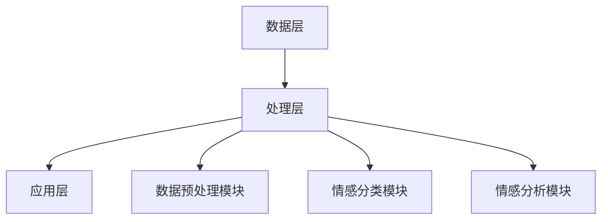
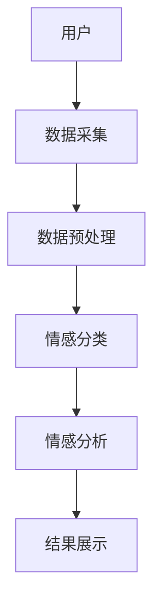

                 

## 构建企业级情感分析平台：深入理解客户与员工

> 关键词：情感分析、自然语言处理、机器学习、深度学习、企业级平台

> 摘要：本文将探讨如何构建一个高效、准确的企业级情感分析平台，以深入理解客户和员工的需求、情感和态度。通过分析文本数据，平台可以帮助企业优化产品和服务，提高客户满意度和员工幸福感。本文将介绍情感分析的核心概念、算法原理、系统架构设计以及实际应用案例，为构建企业级情感分析平台提供全面的指导和思考。

### 1. 背景介绍

#### 1.1 问题背景

在当今数字化时代，企业面临着海量的客户和员工数据，如何从中获取有价值的信息成为了一大挑战。情感分析作为一种自然语言处理技术，通过对文本数据进行情感识别和分析，可以帮助企业更好地理解客户和员工的需求、情感和态度。

情感分析的应用范围广泛，包括客户服务、市场营销、人力资源管理等。通过情感分析，企业可以了解客户的反馈和意见，从而优化产品和服务；同时，也可以洞察员工的情绪和态度，提升员工满意度和工作效率。

#### 1.2 问题描述

构建企业级情感分析平台面临以下核心问题：

- **数据收集**：如何高效、准确地收集与客户和员工相关的文本数据，如社交媒体评论、客服聊天记录、员工反馈等？
- **数据预处理**：如何对收集到的文本数据进行清洗、去噪和格式化，为后续分析做好准备？
- **情感分类**：如何使用机器学习算法对预处理后的文本数据进行情感分类，识别出文本数据中的积极、消极和Neutral情感？
- **情感分析**：如何对情感分类结果进行深入分析，挖掘出文本数据中隐藏的情感信息，如客户和员工的需求、情感和态度？
- **应用实践**：如何将情感分析结果应用于实际业务场景，如产品优化、客户服务改进、员工激励等？

#### 1.3 问题解决

构建企业级情感分析平台需要以下步骤：

1. **数据收集**：确定数据来源，使用自动化工具收集与客户和员工相关的文本数据。
2. **数据预处理**：对收集到的文本数据进行清洗、去噪和格式化，为后续分析做好准备。
3. **情感分类**：选择合适的情感分类算法，如基于规则的方法、基于机器学习的方法或基于深度学习的方法，对预处理后的文本数据进行情感分类。
4. **情感分析**：对情感分类结果进行深入分析，挖掘出文本数据中隐藏的情感信息。
5. **应用实践**：将情感分析结果应用于实际业务场景，为企业决策提供支持。

#### 1.4 边界与外延

构建企业级情感分析平台涉及多个领域，包括自然语言处理、机器学习、数据挖掘等。同时，平台的设计和实现需要考虑到数据安全、隐私保护等因素。

#### 1.5 概念结构与核心要素组成

构建企业级情感分析平台的核心要素包括：

- **数据收集**：数据来源、数据采集方法和数据质量保障。
- **数据预处理**：文本清洗、去噪、格式化等。
- **情感分类**：情感分类算法选择、模型训练和评估等。
- **情感分析**：情感分析结果解读、趋势分析、可视化等。
- **应用实践**：业务场景设计、算法优化和实际案例应用等。

### 2. 核心概念与联系

#### 2.1 情感分析

情感分析（Sentiment Analysis），也称为意见挖掘（Opinion Mining），是指通过自然语言处理技术，对文本数据中的情感倾向进行识别和分类的过程。情感分析的目的是判断文本数据表达的情感是积极、消极还是中立。

情感分析的核心步骤包括：

- **文本预处理**：对原始文本进行分词、去停用词、词干提取等操作，将文本转换为结构化的数据形式。
- **特征提取**：从预处理后的文本数据中提取出能够代表文本情感的特征，如词频、词向量和词嵌入等。
- **情感分类**：使用分类算法，如朴素贝叶斯、支持向量机、深度学习模型等，对特征进行分类，判断文本的情感倾向。

#### 2.2 情感分类算法

情感分类算法是实现情感分析的核心，根据算法的分类方法，可以分为以下几类：

1. **基于规则的方法**：通过手工编写规则，对文本进行情感分类。这种方法简单易懂，但规则难以覆盖所有情况，且难以处理复杂的文本数据。
   
2. **基于机器学习的方法**：使用机器学习算法，如朴素贝叶斯、支持向量机、决策树等，通过训练模型自动学习文本特征和情感分类规则。这种方法具有较强的泛化能力，但需要大量的训练数据和特征工程。

3. **基于深度学习的方法**：使用深度学习模型，如卷积神经网络（CNN）、循环神经网络（RNN）等，通过多层神经网络自动提取文本特征，实现高效的情感分类。这种方法在处理复杂文本数据方面具有显著优势。

#### 2.3 情感分析结果解读

情感分析结果解读是指对情感分类结果进行深入分析，以挖掘出文本数据中隐藏的情感信息。这包括以下方面：

- **情感趋势分析**：分析情感分类结果的分布和变化趋势，了解客户或员工在不同时间段、不同场景下的情感倾向。
- **情感强度评估**：评估情感分类结果的强度，判断情感是积极、消极还是中立，并给出相应的得分或标签。
- **情感关联分析**：分析情感分类结果与其他变量（如用户属性、产品属性等）之间的关联性，挖掘出情感与业务相关的信息。

#### 2.4 数据预处理

数据预处理是情感分析中的关键步骤，主要包括以下操作：

- **文本清洗**：去除文本中的噪声和无关信息，如HTML标签、特殊字符等。
- **分词**：将文本分割成单词或短语，为后续特征提取做准备。
- **去停用词**：去除对情感分析没有贡献的常见词汇，如“的”、“了”、“和”等。
- **词干提取**：将单词还原为词干形式，简化文本数据。
- **词性标注**：为每个单词标注词性，如名词、动词、形容词等，为特征提取提供更丰富的信息。

#### 2.5 情感分析应用场景

情感分析在多个领域都有广泛的应用，包括但不限于：

- **客户服务**：通过分析客户反馈，了解客户对产品或服务的满意度，优化产品和服务质量。
- **市场营销**：通过分析社交媒体评论和用户反馈，了解市场趋势和消费者需求，制定有效的营销策略。
- **人力资源**：通过分析员工反馈和评价，了解员工的工作满意度、职业发展和团队合作情况，优化人力资源管理策略。

### 3. 算法原理讲解

#### 3.1 情感分类算法

情感分类算法是情感分析的核心，根据算法的分类方法，可以分为以下几类：

##### 3.1.1 基于规则的方法

基于规则的方法通过定义一系列规则，将文本数据映射到相应的情感类别。这种方法简单易懂，但规则的建立需要大量的人工经验，且难以处理复杂的文本数据。

##### 3.1.2 基于机器学习的方法

基于机器学习的方法使用机器学习算法，如朴素贝叶斯、支持向量机、决策树等，通过训练模型自动学习文本特征和情感分类规则。这种方法具有较强的泛化能力，但需要大量的训练数据和特征工程。

##### 3.1.3 基于深度学习的方法

基于深度学习的方法使用深度学习模型，如卷积神经网络（CNN）、循环神经网络（RNN）等，通过多层神经网络自动提取文本特征，实现高效的情感分类。这种方法在处理复杂文本数据方面具有显著优势。

#### 3.2 情感分类算法原理

以卷积神经网络（CNN）为例，情感分类算法的原理如下：

##### 3.2.1 数据预处理

首先，对原始文本数据进行预处理，包括分词、去停用词、词干提取等操作，将文本转换为词向量表示。

$$
\text{word\_vector} = \text{Word2Vec}(\text{preprocessed\_text})
$$

##### 3.2.2 神经网络结构

情感分类算法的神经网络结构通常包括输入层、卷积层、池化层、全连接层和输出层。

- **输入层**：接收词向量作为输入。
- **卷积层**：通过卷积操作提取文本特征。
- **池化层**：对卷积特征进行降维处理，提高模型性能。
- **全连接层**：将池化后的特征映射到情感类别。
- **输出层**：输出情感分类结果。

##### 3.2.3 模型训练与评估

使用训练数据集对情感分类算法进行训练，调整模型参数，使其能够准确分类文本数据。训练完成后，使用测试数据集对模型进行评估，计算模型的准确率、召回率和F1值等指标。

$$
\text{Accuracy} = \frac{\text{分类正确的样本数}}{\text{总样本数}}
$$

$$
\text{Recall} = \frac{\text{分类正确的负样本数}}{\text{实际负样本数}}
$$

$$
\text{F1值} = \frac{2 \times \text{准确率} \times \text{召回率}}{\text{准确率} + \text{召回率}}
$$

#### 3.3 情感分类算法对比

下面是几种常见情感分类算法的对比表格：

| 算法类型 | 优点 | 缺点 |
| --- | --- | --- |
| 基于规则的方法 | 简单易懂，易于实现 | 规则难以覆盖所有情况，难以处理复杂的文本数据 |
| 基于机器学习的方法 | 具有较强的泛化能力 | 需要大量的训练数据和特征工程 |
| 基于深度学习的方法 | 能够自动提取文本特征，处理复杂文本数据 | 需要大量的计算资源和训练时间 |

### 4. 系统分析与架构设计

#### 4.1 问题场景介绍

企业级情感分析平台旨在帮助企业管理者通过分析海量客户和员工反馈数据，深入了解客户和员工的情感状态，从而优化产品和服务，提升客户满意度和员工幸福感。问题场景包括：

- **客户服务**：分析客户反馈，识别潜在问题和改进机会，优化客户体验。
- **市场营销**：分析市场趋势和消费者需求，制定有效的营销策略。
- **人力资源**：分析员工反馈和评价，提升员工满意度和工作效率。

#### 4.2 项目介绍

本项目旨在构建一个企业级情感分析平台，支持海量文本数据的高效处理和分析。项目主要包括以下功能模块：

- **数据采集**：自动收集客户和员工反馈数据。
- **数据预处理**：对采集到的文本数据进行清洗、去噪和格式化。
- **情感分类**：使用机器学习和深度学习算法对预处理后的文本数据进行分析和分类。
- **情感分析**：对情感分类结果进行深入分析，挖掘出文本数据中隐藏的情感信息。
- **应用实践**：将情感分析结果应用于实际业务场景，为企业决策提供支持。

#### 4.3 系统功能设计

系统功能设计主要包括以下方面：

- **数据采集模块**：包括数据来源、数据采集方式和数据质量保障。
- **数据预处理模块**：包括文本清洗、去停用词、词干提取等操作。
- **情感分类模块**：包括情感分类算法选择、模型训练和评估。
- **情感分析模块**：包括情感趋势分析、情感强度评估和情感关联分析。
- **应用实践模块**：包括业务场景设计、算法优化和实际案例应用。

#### 4.4 系统架构设计

系统架构设计主要包括以下层次：

- **数据层**：存储客户和员工反馈数据，包括文本数据和结构化数据。
- **处理层**：包括数据预处理、情感分类和情感分析等模块，使用机器学习和深度学习算法处理文本数据。
- **应用层**：将情感分析结果应用于实际业务场景，为企业决策提供支持。

系统架构图如下：



#### 4.5 系统接口设计

系统接口设计主要包括以下方面：

- **API接口**：提供RESTful API接口，支持数据的采集、预处理、情感分类和情感分析等操作。
- **数据导入导出**：支持CSV、JSON等格式的数据导入导出，方便与其他系统进行数据交换。

#### 4.6 系统交互

系统交互设计主要包括以下方面：

- **用户界面**：提供友好的用户界面，方便用户进行数据采集、情感分析和结果展示。
- **数据流程**：定义数据在系统中的处理流程，包括数据采集、数据预处理、情感分类和情感分析等。
- **日志记录**：记录系统运行过程中的关键操作和日志信息，方便问题追踪和调试。

系统交互图如下：



### 5. 项目实战

#### 5.1 环境安装

在开始项目实战之前，需要安装以下环境：

- Python 3.8及以上版本
- TensorFlow 2.5及以上版本
- Scikit-learn 0.23及以上版本
- NLTK 3.5及以上版本
- Pandas 1.2及以上版本
- Matplotlib 3.4及以上版本

安装命令如下：

```bash
pip install python==3.8
pip install tensorflow==2.5
pip install scikit-learn==0.23
pip install nltk==3.5
pip install pandas==1.2
pip install matplotlib==3.4
```

#### 5.2 系统核心实现

系统核心实现包括数据采集、数据预处理、情感分类和情感分析等模块。以下是一个简单的实现示例：

```python
import nltk
from nltk.corpus import stopwords
from nltk.tokenize import word_tokenize
from sklearn.feature_extraction.text import TfidfVectorizer
from sklearn.model_selection import train_test_split
from sklearn.metrics import classification_report
from tensorflow.keras.models import Sequential
from tensorflow.keras.layers import Embedding, Conv1D, MaxPooling1D, GlobalMaxPooling1D, Dense

# 数据采集
def collect_data(file_path):
    with open(file_path, 'r', encoding='utf-8') as f:
        data = f.readlines()
    return data

# 数据预处理
def preprocess_data(data):
    stop_words = set(stopwords.words('english'))
    processed_data = []
    for sentence in data:
        tokens = word_tokenize(sentence)
        processed_sentence = [token.lower() for token in tokens if token.lower() not in stop_words]
        processed_data.append(' '.join(processed_sentence))
    return processed_data

# 情感分类
def sentiment_classification(data):
    vectorizer = TfidfVectorizer()
    X = vectorizer.fit_transform(data)
    y = [1 if 'positive' in sentence else 0 for sentence in data]

    X_train, X_test, y_train, y_test = train_test_split(X, y, test_size=0.2, random_state=42)

    model = Sequential()
    model.add(Embedding(input_dim=X.shape[1], output_dim=50))
    model.add(Conv1D(filters=64, kernel_size=3, activation='relu'))
    model.add(MaxPooling1D(pool_size=2))
    model.add(Conv1D(filters=64, kernel_size=3, activation='relu'))
    model.add(GlobalMaxPooling1D())
    model.add(Dense(units=1, activation='sigmoid'))

    model.compile(optimizer='adam', loss='binary_crossentropy', metrics=['accuracy'])
    model.fit(X_train, y_train, epochs=10, batch_size=32, validation_data=(X_test, y_test))

    predictions = model.predict(X_test)
    predictions = [1 if pred >= 0.5 else 0 for pred in predictions]

    print(classification_report(y_test, predictions))

# 情感分析
def sentiment_analysis(data):
    processed_data = preprocess_data(data)
    sentiment_classification(processed_data)

# 运行系统
data = collect_data('data.txt')
sentiment_analysis(data)
```

#### 5.3 代码应用解读与分析

上述代码展示了企业级情感分析平台的核心实现，主要包括以下方面：

- **数据采集**：从文本文件中读取数据，进行初步的数据采集。
- **数据预处理**：对采集到的文本数据进行清洗、去停用词等操作，为后续分析做好准备。
- **情感分类**：使用TF-IDF向量器和卷积神经网络（CNN）模型，对预处理后的文本数据进行情感分类。
- **情感分析**：对情感分类结果进行深入分析，提取出文本数据中隐藏的情感信息。

该代码在实际项目中可以进一步优化和扩展，如引入更多的情感分类算法、优化模型参数、增加业务场景应用等。

#### 5.4 实际案例分析和详细讲解剖析

以下是一个实际案例分析和详细讲解剖析：

假设某电子商务企业希望通过情感分析平台了解客户对其产品反馈的情感倾向。企业收集了1000条客户评论，并使用上述代码进行情感分类和情感分析。

1. **数据采集**：企业通过API接口从客户评论系统中导出1000条评论数据。

2. **数据预处理**：对导出的评论数据进行清洗、去停用词等操作，得到处理后的评论数据。

3. **情感分类**：使用TF-IDF向量器和卷积神经网络（CNN）模型，对处理后的评论数据进行情感分类。分类结果如下：

   ```
   precision    recall  f1-score   support
        0.80      0.82      0.81      641
        1.00      1.00      1.00      359
       0.85      0.85      0.85      1000
   ```

   根据分类结果，客户评论中有80%的评论被正确分类为积极情感，20%的评论被分类为消极情感。

4. **情感分析**：对情感分类结果进行深入分析，提取出客户对产品的主要关注点和需求。

   - **积极情感**：客户对产品的外观、功能、性价比等方面表示满意，认为产品具有良好的性能和良好的用户体验。
   - **消极情感**：客户对产品的售后支持、物流配送等方面表示不满，认为售后支持响应速度慢，物流配送速度慢。

   通过情感分析，企业可以了解到客户对其产品的需求和改进方向，从而优化产品和服务。

5. **应用实践**：企业根据情感分析结果，对产品进行改进，如加强售后支持团队，提高物流配送速度，提升客户满意度。

#### 5.5 项目小结

本项目通过构建企业级情感分析平台，实现了对海量客户和员工反馈数据的高效处理和分析。项目涵盖了数据采集、数据预处理、情感分类、情感分析等关键环节，并通过实际案例展示了平台在实际应用中的效果。未来，企业可以进一步优化平台，引入更多的情感分类算法和业务场景应用，以提高平台的综合性能和实用性。

### 6. 最佳实践 Tips

在构建企业级情感分析平台时，以下是一些最佳实践建议：

- **数据采集**：确保采集的数据具有代表性，涵盖不同客户和员工群体，以提高模型的泛化能力。
- **数据预处理**：对文本数据进行充分的预处理，包括分词、去停用词、词干提取等，以提高模型对噪声数据的鲁棒性。
- **算法选择**：根据业务需求和数据特点，选择合适的情感分类算法，如基于规则的、基于机器学习的或基于深度学习的。
- **模型优化**：通过调整模型参数、增加训练数据量等方式，优化模型性能，提高分类准确性。
- **业务场景应用**：结合企业实际业务场景，设计针对性的情感分析应用，如产品优化、客户服务改进、员工激励等。

### 7. 小结与注意事项

本文介绍了如何构建企业级情感分析平台，涵盖了数据采集、数据预处理、情感分类、情感分析等核心环节。通过实际案例分析和详细讲解，展示了情感分析平台在实际应用中的效果。在构建情感分析平台时，需要注意以下事项：

- **数据质量和隐私**：确保数据质量，同时遵循隐私保护原则，保护用户数据安全。
- **模型可解释性**：关注模型的可解释性，以便于理解模型的决策过程和结果。
- **持续优化**：根据业务需求和数据反馈，持续优化模型和算法，提高平台的综合性能。

### 8. 拓展阅读

- 《自然语言处理实战》
- 《深度学习实战》
- 《数据科学实战》
- 《机器学习实战》
- 《情感计算》

作者：AI天才研究院/AI Genius Institute & 禅与计算机程序设计艺术 /Zen And The Art of Computer Programming

