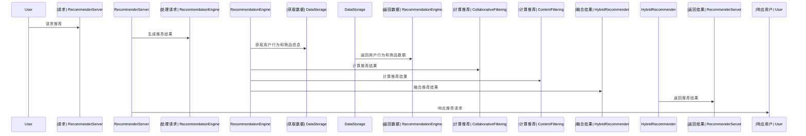
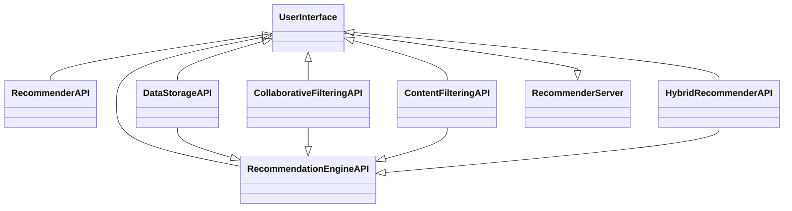
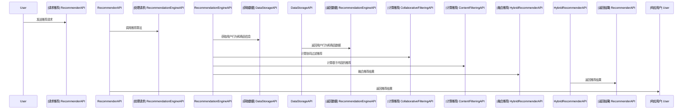

                 

### 文章标题

# 构建企业级推荐系统：个性化产品与服务推荐

> 关键词：推荐系统、企业级、个性化、产品推荐、服务推荐

> 摘要：本文将深入探讨如何构建企业级推荐系统，实现个性化产品与服务推荐。我们将从背景介绍、核心概念、算法原理、系统设计与实现、项目实战等多个角度进行详细阐述，帮助读者理解并掌握构建推荐系统的关键技术和方法。

----------------------------------------------------------------

## 引言

推荐系统（Recommender System）是信息检索和知识发现领域的一项重要技术，其主要目标是利用用户历史行为数据，为用户推荐他们可能感兴趣的产品或服务。随着互联网的快速发展，推荐系统在电子商务、社交媒体、新闻推荐、在线教育等多个领域得到了广泛应用，并成为了提高用户体验、增加用户黏性和促进业务增长的重要手段。

在企业级应用中，推荐系统具有以下几个显著优势：

1. **个性化推荐**：通过分析用户的历史行为和偏好，推荐系统可以为每位用户提供高度个性化的产品和服务，从而提升用户满意度和忠诚度。
2. **提升销售额**：推荐系统能够有效地挖掘用户潜在需求，促进商品销售和业务增长。
3. **降低运营成本**：通过智能推荐，企业可以减少广告投放和营销预算，提高营销效率。
4. **提升数据价值**：推荐系统对用户行为数据的分析，有助于企业更好地了解用户需求和市场趋势，从而做出更加精准的商业决策。

然而，构建一个高效、稳定、可扩展的企业级推荐系统并非易事，它涉及到数据处理、算法选择、系统设计等多个方面的挑战。本文将从以下五个部分对推荐系统的构建进行深入探讨：

1. **第一部分：介绍推荐系统**：包括推荐系统的发展历史、应用场景、核心概念和原则等。
2. **第二部分：协同过滤算法**：详细介绍协同过滤算法的基本原理、用户和项目基础协同过滤方法，以及混合协同过滤算法。
3. **第三部分：基于内容的过滤算法**：探讨基于内容的过滤算法，包括文本分析、特征提取和推荐生成等。
4. **第四部分：系统设计与实现**：介绍推荐系统的整体架构设计、接口设计和实现细节。
5. **第五部分：项目实战**：通过实际项目案例，展示推荐系统的开发过程和实现方法。

本文的目标是帮助读者全面理解推荐系统的构建过程，掌握关键技术和方法，从而在实际项目中能够有效应用推荐系统，提升企业的业务水平和竞争力。

## 第一部分：介绍推荐系统

### 1.1 背景介绍

#### 1.1.1 发展历史

推荐系统的发展可以追溯到20世纪90年代初期，当时互联网刚刚兴起，电子商务和在线服务逐渐成为主流。早期的推荐系统主要基于规则和人工编写策略，如基于内容的推荐和基于协同过滤的推荐。随着计算能力的提升和大数据技术的发展，推荐系统逐渐走向智能化和自动化。

2000年左右，协同过滤算法成为推荐系统研究的热点，其基于用户行为数据的推荐方式获得了广泛的认可和应用。随后，基于内容的推荐算法也取得了显著进展，通过文本分析、自然语言处理等技术，实现了更精确的个性化推荐。

#### 1.1.2 应用场景

推荐系统在多个领域得到了广泛应用，主要包括：

1. **电子商务**：推荐系统在电商平台中用于推荐商品，提高用户购买意愿和销售量。
2. **社交媒体**：推荐系统用于推荐用户可能感兴趣的内容，提升用户活跃度和留存率。
3. **在线教育**：推荐系统根据用户的学习历史和兴趣，推荐相应的课程和资源。
4. **新闻推荐**：推荐系统根据用户的历史阅读行为和兴趣，推荐个性化的新闻和文章。
5. **音乐和视频平台**：推荐系统用于推荐用户可能喜欢的音乐和视频，提高用户黏性和平台流量。

#### 1.1.3 重要性

推荐系统在企业级应用中的重要性体现在以下几个方面：

1. **提升用户体验**：通过个性化推荐，满足用户的个性化需求，提高用户满意度和忠诚度。
2. **增加业务收入**：推荐系统能够有效提高商品的曝光率和转化率，从而增加企业的收入和利润。
3. **降低运营成本**：通过自动化推荐，减少人工干预和营销成本，提高运营效率。
4. **数据驱动的决策**：推荐系统对用户行为数据的深入分析，为企业提供了有价值的市场洞察和决策支持。

#### 1.1.4 挑战

尽管推荐系统在许多领域取得了显著的成果，但在实际应用中仍面临一系列挑战：

1. **数据质量**：推荐系统的效果很大程度上取决于数据的质量和完整性。数据缺失、噪声和偏差都可能影响推荐质量。
2. **算法复杂性**：推荐算法的实现和优化涉及到多个复杂的技术，如协同过滤、基于内容的推荐、机器学习等。
3. **实时性**：对于实时推荐场景，如何在短时间内处理大量数据并生成高质量的推荐结果是一个挑战。
4. **隐私保护**：用户数据的隐私保护是推荐系统设计过程中必须考虑的重要问题。

### 1.2 核心概念和原则

#### 1.2.1 定义

推荐系统是一种信息过滤技术，旨在根据用户的历史行为和偏好，为用户推荐他们可能感兴趣的产品、内容或服务。

#### 1.2.2 类型

推荐系统主要分为以下几种类型：

1. **基于内容的推荐**：根据用户的历史行为和偏好，推荐与用户兴趣相似的内容或产品。
2. **协同过滤推荐**：根据用户之间的相似性和他们的历史行为，推荐用户可能感兴趣的内容或产品。
3. **混合推荐**：结合多种推荐方法，以实现更精确的个性化推荐。

#### 1.2.3 关键组件

一个典型的推荐系统通常包括以下几个关键组件：

1. **用户数据**：用户的历史行为数据，如浏览记录、购买历史、评价等。
2. **项目数据**：产品的描述信息、标签、分类等。
3. **推荐算法**：根据用户和项目数据，生成推荐结果的核心算法。
4. **推荐模型**：基于推荐算法，训练和优化的推荐模型。
5. **推荐引擎**：将推荐模型应用于用户数据，生成实时推荐结果的系统。

### 1.3 数据源和预处理

#### 1.3.1 用户数据

用户数据是推荐系统的重要输入，主要包括：

1. **浏览记录**：用户在平台上的浏览历史。
2. **购买历史**：用户的购买记录。
3. **评价和反馈**：用户对产品和服务的评价和反馈。

#### 1.3.2 项目数据

项目数据主要包括：

1. **产品描述**：产品的详细信息，如标题、描述、标签等。
2. **分类和标签**：产品的分类和标签，用于基于内容的推荐。
3. **用户行为数据**：用户对产品的行为数据，如点击、收藏、评分等。

#### 1.3.3 数据预处理技术

数据预处理是构建推荐系统的重要步骤，主要包括：

1. **数据清洗**：去除无效、错误和重复的数据，保证数据质量。
2. **数据转换**：将不同类型的数据转换为统一的格式，如将文本数据转换为向量表示。
3. **特征提取**：从原始数据中提取有用的特征，用于训练推荐模型。
4. **数据降维**：通过降维技术，减少数据的维度，提高计算效率。

### 1.4 评价指标

评价推荐系统的效果是衡量其性能的重要手段，常用的评价指标包括：

1. **准确率（Precision）**：推荐结果中实际感兴趣的项目数与推荐项目总数之比。
2. **召回率（Recall）**：推荐结果中实际感兴趣的项目数与所有实际感兴趣的项目总数之比。
3. **F1值（F1 Score）**：准确率和召回率的调和平均值。
4. **平均准确率（Mean Average Precision, MAP）**：用于评价推荐结果的平均精度。
5. **均方根误差（Root Mean Square Error, RMSE）**：预测值与实际值之间的误差平方的平均值的平方根。

### 1.5 总结

本部分介绍了推荐系统的发展背景、应用场景、核心概念、关键组件和数据预处理技术。通过本文的介绍，读者可以初步了解推荐系统的基础知识和构建方法，为后续的深入学习和实践打下基础。

## 第二部分：协同过滤算法

### 2.1 介绍协同过滤

#### 2.1.1 定义和优点

协同过滤（Collaborative Filtering）是一种基于用户行为数据推荐的方法，其核心思想是通过分析用户之间的相似性来推荐他们可能感兴趣的项目。协同过滤算法的优点在于：

1. **个性化推荐**：能够根据用户的历史行为和偏好，提供高度个性化的推荐。
2. **无需额外标签信息**：不需要为项目或用户打标签，适用于无标签数据的推荐。
3. **广泛适用性**：适用于多种领域，如电子商务、社交媒体、在线教育等。

#### 2.1.2 类型

协同过滤算法主要分为以下两种类型：

1. **基于用户的协同过滤**（User-Based Collaborative Filtering）：根据用户之间的相似性，为用户推荐与他们有相似兴趣的其他用户喜欢的项目。
2. **基于项目的协同过滤**（Item-Based Collaborative Filtering）：根据项目之间的相似性，为用户推荐与他们已评价的其他项目相似的项目。

#### 2.1.3 挑战和限制

尽管协同过滤算法具有许多优点，但在实际应用中仍面临一些挑战和限制：

1. **稀疏性问题**：用户和项目之间的交互数据往往非常稀疏，导致算法效果不佳。
2. **冷启动问题**：对于新用户或新项目，由于缺乏足够的交互数据，无法生成有效的推荐。
3. **计算复杂度**：在用户和项目数量庞大的情况下，计算复杂度较高，影响推荐系统的实时性。
4. **数据偏差**：用户的历史行为可能受到偶然因素的影响，导致推荐结果偏差。

### 2.2 用户基础协同过滤

#### 2.2.1 用户相似度度量

用户相似度度量是用户基础协同过滤算法的核心步骤，常用的相似度度量方法包括：

1. **余弦相似度**：
   $$\cos(\theta) = \frac{\sum_{i \in common} u_i \cdot v_i}{\sqrt{\sum_{i \in all} u_i^2} \cdot \sqrt{\sum_{i \in all} v_i^2}}$$

   其中，$u_i$和$v_i$分别表示两个用户在共同评价的项目上的评分。

2. **皮尔逊相关系数**：
   $$r(u, v) = \frac{\sum_{i \in common} (u_i - \bar{u})(v_i - \bar{v})}{\sqrt{\sum_{i \in common} (u_i - \bar{u})^2} \cdot \sqrt{\sum_{i \in common} (v_i - \bar{v})^2}}$$

   其中，$\bar{u}$和$\bar{v}$分别表示两个用户在共同评价的项目上的平均评分。

#### 2.2.2 最近邻算法

最近邻算法（Nearest Neighbor Algorithm）是用户基础协同过滤算法的核心，其基本思想是：

1. 计算用户之间的相似度。
2. 根据相似度度量，找出与目标用户最相似的k个用户。
3. 对这k个用户的评分进行加权平均，生成推荐结果。

#### 2.2.3 优化技术

为了提高用户基础协同过滤算法的性能，可以采用以下优化技术：

1. **记忆化**（Memoization）：缓存用户之间的相似度计算结果，避免重复计算。
2. **矩阵分解**（Matrix Factorization）：将用户-项目评分矩阵分解为两个低秩矩阵，从而降低计算复杂度。
3. **基于模型的协同过滤**：引入机器学习模型，如隐语义模型、神经网络等，对用户和项目进行建模，提高推荐质量。

### 2.3 项目基础协同过滤

#### 2.3.1 项目相似度度量

项目相似度度量是项目基础协同过滤算法的核心，常用的相似度度量方法包括：

1. **余弦相似度**：
   $$\cos(\theta) = \frac{\sum_{u \in users} (u_i \cdot u_j)}{\sqrt{\sum_{u \in users} u_i^2} \cdot \sqrt{\sum_{u \in users} u_j^2}}$$

   其中，$u_i$和$u_j$分别表示两个项目在共同评价的用户上的评分。

2. **欧氏距离**：
   $$d(u_i, u_j) = \sqrt{\sum_{u \in users} (u_i - u_j)^2}$$

#### 2.3.2 最近邻算法

项目基础协同过滤算法的最近邻算法与用户基础协同过滤算法类似，基本步骤为：

1. 计算项目之间的相似度。
2. 根据相似度度量，找出与目标项目最相似的k个项目。
3. 对这k个项目的评分进行加权平均，生成推荐结果。

#### 2.3.4 优化技术

为了提高项目基础协同过滤算法的性能，可以采用以下优化技术：

1. **指数衰减**：对历史评分数据进行指数衰减，减轻旧数据对推荐结果的影响。
2. **基于模型的协同过滤**：引入机器学习模型，如隐语义模型、神经网络等，对用户和项目进行建模，提高推荐质量。

### 2.4 混合协同过滤算法

#### 2.4.1 混合方法

混合协同过滤算法（Hybrid Collaborative Filtering Algorithm）通过结合基于用户的协同过滤和基于项目的协同过滤方法，以实现更精确的个性化推荐。常见的混合方法包括：

1. **基于模型的混合方法**：将协同过滤算法与机器学习模型（如隐语义模型、神经网络等）结合，利用模型对用户和项目进行建模，提高推荐质量。
2. **基于规则的混合方法**：将协同过滤算法与基于内容的推荐算法结合，通过规则匹配和加权融合，实现更全面的推荐。

#### 2.4.2 案例研究

一个典型的混合协同过滤算法案例是Netflix Prize，该比赛要求参赛者设计一个推荐系统，以预测用户对未知电影的评分。参赛者通常采用以下混合方法：

1. **基于模型的协同过滤**：使用隐语义模型（如矩阵分解、隐因子模型等）对用户和电影进行建模。
2. **基于内容的推荐**：对电影进行文本分析，提取特征，然后使用文本匹配算法推荐相似的电影。
3. **规则匹配**：根据用户的历史行为和偏好，设置规则，如推荐用户近期喜欢类型的电影。

### 2.5 评价和优化

#### 2.5.1 模型评价指标

评价协同过滤模型性能的常用指标包括：

1. **准确率（Accuracy）**：预测评分与实际评分的匹配程度。
2. **均方根误差（Root Mean Square Error, RMSE）**：预测评分与实际评分之间的平均误差。
3. **平均绝对误差（Mean Absolute Error, MAE）**：预测评分与实际评分之间的平均绝对误差。

#### 2.5.2 模型优化技术

为了提高协同过滤模型的性能，可以采用以下优化技术：

1. **数据预处理**：通过数据清洗、数据转换和特征提取等技术，提高数据质量。
2. **特征选择**：选择对模型性能影响较大的特征，提高模型的解释性和泛化能力。
3. **模型选择**：根据实际问题选择合适的协同过滤算法，如基于用户的协同过滤、基于项目的协同过滤或混合协同过滤算法。
4. **参数调优**：通过交叉验证和网格搜索等技术，优化模型参数，提高模型性能。

### 2.6 总结

本部分介绍了协同过滤算法的基本原理、用户和项目基础协同过滤方法、混合协同过滤算法以及评价和优化技术。通过本部分的讲解，读者可以全面了解协同过滤算法在构建推荐系统中的应用，掌握关键技术和方法。

## 第三部分：基于内容的过滤算法

### 3.1 介绍基于内容的过滤

#### 3.1.1 定义和优点

基于内容的过滤（Content-Based Filtering）是一种推荐算法，其核心思想是根据用户的历史偏好和项目的特征信息，为用户推荐与他们兴趣相似的项目。与协同过滤不同，基于内容的过滤不依赖于用户行为数据，而是通过文本分析、特征提取等方法，从项目的内容中提取关键特征，生成推荐结果。

基于内容的过滤算法的优点包括：

1. **解释性**：推荐结果基于项目的内容和特征，易于理解和解释。
2. **适用于新用户和新项目**：不需要历史交互数据，适用于新用户或新项目的推荐。
3. **个性化推荐**：可以根据用户的历史偏好和项目的特征，提供高度个性化的推荐。

#### 3.1.2 类型

基于内容的过滤算法主要分为以下几种类型：

1. **基于属性的过滤**：通过分析项目的属性特征，如分类、标签、关键词等，为用户推荐具有相似属性的物品。
2. **基于语义的过滤**：通过自然语言处理和文本分析技术，从项目的文本内容中提取语义信息，为用户推荐与内容相关的物品。
3. **混合过滤**：结合基于内容的过滤和其他推荐方法（如协同过滤），以实现更精确的个性化推荐。

#### 3.1.3 挑战和限制

尽管基于内容的过滤算法具有许多优点，但在实际应用中仍面临一些挑战和限制：

1. **特征提取难度**：从文本内容中提取有效的特征是一个复杂的问题，需要考虑文本的多样性、语义变化等因素。
2. **冷启动问题**：对于新用户或新项目，由于缺乏足够的特征信息，难以生成有效的推荐。
3. **计算复杂度**：基于语义的过滤算法通常涉及大量的文本分析和特征提取，计算复杂度较高，影响推荐系统的实时性。

### 3.2 文本分析

文本分析（Text Analysis）是基于内容过滤算法的核心步骤，主要包括以下内容：

#### 3.2.1 关键词提取

关键词提取（Keyword Extraction）是从文本中提取出最能代表文本内容的词汇。常用的关键词提取方法包括：

1. **TF-IDF**：词频（Term Frequency, TF）和逆文档频率（Inverse Document Frequency, IDF）的加权组合，用于衡量关键词的重要程度。
   $$TF-IDF(t, d) = TF(t, d) \cdot IDF(t, D)$$
   其中，$TF(t, d)$表示词$t$在文档$d$中的词频，$IDF(t, D)$表示词$t$在所有文档中的逆文档频率。

2. **TF*IDF + 频率阈值**：在TF-IDF的基础上，设置频率阈值，去除低频率的关键词。

#### 3.2.2 偏差词过滤

偏差词过滤（De-biasing）是从提取的关键词中去除对推荐结果产生偏差的常见词汇，如“很好”、“很差”等。这些词汇虽然能反映用户的情感倾向，但在不同情境下可能具有不同的含义，因此需要去除。

#### 3.2.3 主题建模

主题建模（Topic Modeling）是一种无监督学习技术，用于从文本中识别出隐藏的主题结构。常见的方法包括：

1. **隐含狄利克雷分配（Latent Dirichlet Allocation, LDA）**：LDA假设文本是由一系列主题的混合生成的，通过概率模型识别出文本中的主题。
2. **非负矩阵分解（Non-negative Matrix Factorization, NMF）**：将文本矩阵分解为两个非负矩阵，从而识别出文本的主题。

### 3.3 特征提取

特征提取（Feature Extraction）是将文本内容转换为可以用于训练推荐模型的特征向量。常用的特征提取方法包括：

#### 3.3.1 基于词袋模型的特征提取

基于词袋模型（Bag of Words, BoW）的特征提取方法是将文本转换为词频向量，即每个词在一个文档中的出现次数。词袋模型可以表示为：
$$V = \{v_1, v_2, ..., v_n\}$$
其中，$v_i$表示第$i$个词。

#### 3.3.2 基于TF-IDF的特征提取

基于TF-IDF的特征提取方法是将文本转换为TF-IDF向量，即每个词在文档中的重要性。TF-IDF向量可以表示为：
$$TF-IDF = [tfidf_1, tfidf_2, ..., tfidf_n]$$
其中，$tfidf_i$表示第$i$个词的TF-IDF值。

#### 3.3.3 基于词嵌入的特征提取

基于词嵌入（Word Embedding）的特征提取方法是将文本中的每个词映射到一个高维空间中的向量。常见的词嵌入方法包括：

1. **Word2Vec**：通过神经网络学习词的向量表示，能够捕捉词的语义信息。
2. **GloVe**：全局向量表示（Global Vectors for Word Representation），通过训练大规模语料库，学习词的向量表示。

### 3.4 推荐生成

推荐生成（Recommendation Generation）是基于内容过滤算法的最后一个步骤，其主要任务是根据用户的历史偏好和项目的特征，生成推荐结果。常用的推荐生成方法包括：

#### 3.4.1 基于距离的推荐

基于距离的推荐方法是通过计算用户和项目之间的距离（如余弦相似度、欧氏距离等），为用户推荐距离较近的项目。推荐结果可以表示为：
$$R(u) = \{i | d(u, i) \leq \theta\}$$
其中，$d(u, i)$表示用户$u$和项目$i$之间的距离，$\theta$为阈值。

#### 3.4.2 基于规则的推荐

基于规则的推荐方法是通过定义一系列规则，为用户推荐符合规则的项目。常见的规则包括：

1. **最近邻规则**：为用户推荐与最近邻用户相似的项目。
2. **关键词规则**：为用户推荐包含用户偏好关键词的项目。

### 3.5 优化和扩展

为了提高基于内容的过滤算法的性能，可以采用以下优化和扩展方法：

#### 3.5.1 特征选择

特征选择（Feature Selection）是通过选择对推荐结果影响较大的特征，提高模型的解释性和泛化能力。常用的特征选择方法包括：

1. **信息增益**：选择能够提供最多信息量的特征。
2. **互信息**：选择能够最大化用户和项目特征之间互信息的特征。

#### 3.5.2 模型融合

模型融合（Model Fusion）是将多个模型的结果进行加权融合，以获得更精确的推荐结果。常见的模型融合方法包括：

1. **加权平均**：将多个模型的预测结果进行加权平均。
2. **投票法**：选择预测结果最多的模型。

### 3.6 总结

本部分介绍了基于内容的过滤算法的基本原理、文本分析、特征提取和推荐生成方法，以及优化和扩展技术。通过本部分的讲解，读者可以全面了解基于内容过滤算法的构建过程，掌握关键技术和方法。

## 第四部分：系统设计与实现

### 4.1 问题场景介绍

推荐系统在电子商务、社交媒体、在线教育等场景中有着广泛的应用。以电子商务场景为例，当用户在电商平台上浏览或购买商品时，推荐系统可以根据用户的历史行为和偏好，为用户推荐可能感兴趣的商品，从而提升用户体验和销售量。

### 4.2 项目介绍

本项目旨在构建一个企业级推荐系统，为电商平台提供个性化商品推荐功能。系统的主要功能包括：

1. **用户注册与登录**：允许用户在平台上注册账户并登录。
2. **用户历史行为记录**：记录用户的浏览、购买、收藏等行为。
3. **商品信息管理**：管理商品的基本信息，如商品名称、描述、分类等。
4. **推荐结果生成**：根据用户的历史行为和商品信息，生成个性化的商品推荐。
5. **推荐结果展示**：将推荐结果以图形化的方式展示给用户。

### 4.3 系统功能设计（领域模型）

领域模型（Domain Model）是系统设计的重要组成部分，它描述了系统的核心实体和它们之间的关系。以下是一个简化的领域模型，用于描述推荐系统的核心实体和关系：

```mermaid
erDiagram
    User ||--o{ Item : 购买或浏览}
    User ||--o{ Behavior : 记录用户行为}
    Item ||--o{ Category : 归类于某一类别}
    Behavior ||--o{ Rating : 评价行为}
    Behavior ||--o{ Collection : 收藏行为}
    Behavior ||--o{ Purchase : 购买行为}
    Category ||--|{ has } Brand : 品牌
    Category ||--|{ has } Feature : 商品特征
```

在这个领域模型中，用户（User）与商品（Item）之间存在多对多的关系，用户可以通过浏览、购买或收藏行为与商品互动。每个商品属于一个类别（Category），类别可以进一步细分到品牌（Brand）和特征（Feature）。

### 4.4 系统架构设计

系统架构设计是确保推荐系统高效、可扩展和可靠的关键。以下是一个推荐系统的基本架构设计：



在该架构中，用户通过RecommenderServer请求推荐，RecommenderServer负责处理用户请求，并将请求转发给RecommendationEngine。RecommendationEngine调用CollaborativeFiltering和ContentFiltering分别计算协同过滤和基于内容的推荐结果，然后通过HybridRecommender融合推荐结果，最终返回给用户。

### 4.5 系统接口设计

系统接口设计是确保系统各模块之间高效协作的关键。以下是一个简单的接口设计示例：



在该接口设计中，UserInterface代表用户界面，与RecommenderAPI、DataStorageAPI、RecommendationEngineAPI、CollaborativeFilteringAPI、ContentFilteringAPI和HybridRecommenderAPI进行交互。RecommenderServer通过这些API与用户界面、数据存储和推荐引擎等模块进行通信。

### 4.6 系统交互设计

系统交互设计是描述系统各组件之间交互流程和通信机制的关键。以下是一个推荐系统的交互序列图示例：



在该交互序列图中，用户通过RecommenderAPI发送推荐请求，RecommenderAPI处理请求并调用RecommendationEngineAPI。RecommendationEngineAPI从DataStorageAPI获取用户行为和商品信息，并调用CollaborativeFilteringAPI和ContentFilteringAPI分别计算协同过滤和基于内容的推荐结果。最后，通过HybridRecommenderAPI融合推荐结果，并将最终结果返回给用户。

### 4.7 系统实现细节

系统实现细节包括数据库设计、数据存储和处理、推荐算法实现、接口实现等。以下是一个简化的实现细节示例：

#### 4.7.1 数据库设计

数据库设计是推荐系统数据存储的基础，以下是一个简化的数据库设计示例：

```mermaid
classDiagram
    User ||--|{ has } Behavior : 用户行为记录
    User ||--|{ has } Profile : 用户基本信息
    Item ||--|{ has } Metadata : 商品元数据
    Item ||--|{ has } Category : 商品分类
    Behavior ||--|{ has } Rating : 商品评价
    Behavior ||--|{ has } Collection : 商品收藏
    Behavior ||--|{ has } Purchase : 商品购买
```

#### 4.7.2 数据存储和处理

数据存储和处理包括用户行为数据的收集、存储和处理。以下是一个简化的数据处理流程：

1. **数据收集**：通过Web爬虫或API接口收集用户行为数据。
2. **数据存储**：将收集到的数据存储到数据库中，如MySQL、MongoDB等。
3. **数据处理**：对用户行为数据进行预处理，包括数据清洗、去重、格式转换等。

#### 4.7.3 推荐算法实现

推荐算法实现包括协同过滤算法、基于内容的推荐算法和混合推荐算法。以下是一个简化的算法实现示例：

```python
class CollaborativeFiltering:
    def __init__(self):
        # 初始化协同过滤算法相关参数

    def compute_similarity(self, user1, user2):
        # 计算用户相似度

    def generate_recommendations(self, user):
        # 生成推荐结果

class ContentFiltering:
    def __init__(self):
        # 初始化基于内容过滤算法相关参数

    def extract_features(self, item):
        # 提取商品特征

    def generate_recommendations(self, user):
        # 生成推荐结果

class HybridRecommender:
    def __init__(self, collaborative_filtering, content_filtering):
        # 初始化混合推荐算法相关参数

    def generate_recommendations(self, user):
        # 生成推荐结果
```

#### 4.7.4 接口实现

接口实现包括API接口和Web界面。以下是一个简化的API接口实现示例：

```python
from flask import Flask, request, jsonify
app = Flask(__name__)

@app.route('/recommend', methods=['GET'])
def recommend():
    user_id = request.args.get('user_id')
    recommendations = recommendation_engine.generate_recommendations(user_id)
    return jsonify(recommendations)

if __name__ == '__main__':
    app.run(debug=True)
```

### 4.8 项目实战

以下是项目实战的具体步骤：

1. **环境安装**：安装Python、Flask、Scikit-learn等依赖库。
2. **数据库配置**：配置MySQL或MongoDB数据库。
3. **数据收集**：通过Web爬虫或API接口收集用户行为数据。
4. **数据预处理**：对用户行为数据进行清洗、去重和格式转换。
5. **推荐算法实现**：实现协同过滤算法和基于内容的推荐算法。
6. **接口实现**：实现API接口和Web界面。
7. **测试与优化**：对推荐系统进行测试和优化，确保其性能和效果。

### 4.9 项目小结

通过本项目的实战，读者可以了解推荐系统的整体设计和实现过程，掌握关键技术和方法。同时，本项目也提供了实际操作的经验，帮助读者更好地理解和应用推荐系统。

### 4.10 最佳实践 Tips

1. **数据质量**：确保数据质量，进行数据清洗和预处理，避免噪声和错误数据影响推荐效果。
2. **算法优化**：根据业务需求和数据特点，选择合适的推荐算法，并进行优化和调参。
3. **实时性**：优化推荐系统的实时性，减少数据处理和推荐生成的时间。
4. **用户体验**：关注用户体验，设计直观、易用的推荐界面。
5. **持续迭代**：根据用户反馈和业务需求，持续迭代和优化推荐系统。

### 4.11 小结

本部分介绍了推荐系统的系统设计与实现，包括问题场景介绍、项目介绍、系统功能设计、系统架构设计、系统接口设计、系统交互设计、系统实现细节和项目实战。通过本部分的讲解，读者可以全面了解推荐系统的设计和实现过程，掌握关键技术和方法。

## 第五部分：项目实战

### 5.1 环境安装

在开始项目之前，我们需要安装一些必要的软件和依赖库。以下是在Ubuntu 18.04操作系统上安装Python环境、Flask Web框架和Scikit-learn机器学习库的步骤：

1. **安装Python**：首先，确保系统中已经安装了Python 3。如果没有安装，可以通过以下命令安装：
   ```bash
   sudo apt update
   sudo apt install python3 python3-pip
   ```

2. **安装Flask**：通过pip安装Flask Web框架：
   ```bash
   pip3 install flask
   ```

3. **安装Scikit-learn**：通过pip安装Scikit-learn机器学习库：
   ```bash
   pip3 install scikit-learn
   ```

### 5.2 系统核心实现

推荐系统的核心实现包括用户数据管理、商品数据管理、协同过滤算法、基于内容的推荐算法和混合推荐算法。以下是一个简化的实现示例：

#### 用户数据管理

用户数据管理用于处理用户的注册、登录和用户行为记录。以下是一个简单的用户数据管理实现：

```python
class UserManager:
    def register_user(self, username, password):
        # 实现用户注册逻辑

    def login_user(self, username, password):
        # 实现用户登录逻辑

    def record_behavior(self, user_id, item_id, behavior_type):
        # 实现记录用户行为逻辑
```

#### 商品数据管理

商品数据管理用于管理商品的基本信息和分类。以下是一个简单的商品数据管理实现：

```python
class ItemManager:
    def add_item(self, item_id, item_name, category_id):
        # 实现添加商品逻辑

    def get_item_metadata(self, item_id):
        # 实现获取商品元数据逻辑

    def get_item_category(self, category_id):
        # 实现获取商品分类逻辑
```

#### 协同过滤算法

协同过滤算法是推荐系统的核心算法之一，以下是一个简单的协同过滤算法实现：

```python
from sklearn.metrics.pairwise import cosine_similarity

class CollaborativeFiltering:
    def __init__(self):
        self.user_similarity_matrix = None

    def train(self, user_ratings_matrix):
        # 训练协同过滤模型

    def predict(self, user_id, item_id):
        # 预测用户对商品的评分
```

#### 基于内容的推荐算法

基于内容的推荐算法通过分析商品的内容特征为用户推荐商品。以下是一个简单的基于内容的推荐算法实现：

```python
from sklearn.feature_extraction.text import TfidfVectorizer

class ContentFiltering:
    def __init__(self):
        self.tfidf_vectorizer = TfidfVectorizer()

    def train(self, item_descriptions):
        # 训练基于内容模型

    def predict(self, user_profile, item_description):
        # 预测用户对商品的偏好
```

#### 混合推荐算法

混合推荐算法结合协同过滤和基于内容的推荐算法，以实现更精确的推荐。以下是一个简单的混合推荐算法实现：

```python
class HybridRecommender:
    def __init__(self, collaborative_filtering, content_filtering):
        self.cf = collaborative_filtering
        self.cf.train(user_ratings_matrix)
        self.cf.train(item_descriptions)

    def predict(self, user_id, item_id):
        # 结合协同过滤和基于内容的推荐算法，生成最终推荐
```

### 5.3 代码应用解读与分析

以下是对项目核心实现代码的解读和分析：

#### 用户数据管理

用户数据管理实现用户注册、登录和用户行为记录。在实际项目中，这些功能通常会与数据库进行交互，存储和查询用户信息。

```python
class UserManager:
    def register_user(self, username, password):
        # 这里可以添加用户注册的逻辑，如创建用户账号、存储用户信息到数据库等。

    def login_user(self, username, password):
        # 这里可以添加用户登录的逻辑，如验证用户账号和密码、返回用户ID等。

    def record_behavior(self, user_id, item_id, behavior_type):
        # 这里可以添加记录用户行为的逻辑，如更新用户行为记录到数据库等。
```

#### 商品数据管理

商品数据管理实现商品添加、商品元数据获取和商品分类获取。在实际项目中，商品信息通常会存储在数据库中，并通过接口进行管理和查询。

```python
class ItemManager:
    def add_item(self, item_id, item_name, category_id):
        # 这里可以添加添加商品的逻辑，如向数据库插入商品记录等。

    def get_item_metadata(self, item_id):
        # 这里可以添加获取商品元数据的逻辑，如从数据库查询商品信息等。

    def get_item_category(self, category_id):
        # 这里可以添加获取商品分类的逻辑，如从数据库查询分类信息等。
```

#### 协同过滤算法

协同过滤算法通过计算用户之间的相似度，为用户推荐他们可能感兴趣的商品。在实际应用中，可以使用多种相似度度量方法，如余弦相似度、皮尔逊相关系数等。

```python
from sklearn.metrics.pairwise import cosine_similarity

class CollaborativeFiltering:
    def __init__(self):
        self.user_similarity_matrix = None

    def train(self, user_ratings_matrix):
        # 这里可以添加训练协同过滤模型的方法，如计算用户相似度矩阵等。

    def predict(self, user_id, item_id):
        # 这里可以添加预测用户对商品的评分方法，如基于用户相似度矩阵生成推荐等。
```

#### 基于内容的推荐算法

基于内容的推荐算法通过分析商品的内容特征，为用户推荐与他们兴趣相似的商品。在实际项目中，可以使用TF-IDF、词嵌入等技术进行特征提取和相似度计算。

```python
from sklearn.feature_extraction.text import TfidfVectorizer

class ContentFiltering:
    def __init__(self):
        self.tfidf_vectorizer = TfidfVectorizer()

    def train(self, item_descriptions):
        # 这里可以添加训练基于内容模型的方法，如生成商品特征向量等。

    def predict(self, user_profile, item_description):
        # 这里可以添加预测用户对商品的偏好方法，如基于商品特征向量计算相似度等。
```

#### 混合推荐算法

混合推荐算法结合协同过滤和基于内容的推荐算法，以实现更精确的推荐。在实际应用中，可以通过加权融合或投票法等方法进行推荐。

```python
class HybridRecommender:
    def __init__(self, collaborative_filtering, content_filtering):
        self.cf = collaborative_filtering
        self.cf.train(user_ratings_matrix)
        self.cf.train(item_descriptions)

    def predict(self, user_id, item_id):
        # 这里可以添加混合推荐算法的方法，如结合协同过滤和基于内容的推荐等。
```

### 5.4 实际案例分析和详细讲解

以下是一个简单的实际案例，展示如何使用构建的推荐系统为用户生成商品推荐。

#### 案例背景

假设一个用户A在电商平台上浏览了商品1、商品2和商品3，并收藏了商品4。我们需要根据用户A的历史行为和商品信息，为他生成个性化推荐。

#### 案例步骤

1. **获取用户A的历史行为数据**：从数据库中查询用户A的浏览记录、收藏记录等行为数据。
2. **获取商品信息**：从数据库中查询商品1、商品2、商品3、商品4的详细信息。
3. **计算用户A的偏好**：使用协同过滤算法计算用户A与其他用户的相似度，并分析用户A的浏览、收藏等行为，确定用户A的偏好。
4. **生成推荐结果**：使用混合推荐算法结合协同过滤和基于内容的推荐，为用户A生成个性化推荐。

#### 案例分析

1. **协同过滤推荐**：计算用户A与其他用户的相似度，并找出与用户A最相似的K个用户。然后，分析这些用户对商品1、商品2、商品3、商品4的评分，生成协同过滤推荐结果。
2. **基于内容的推荐**：提取商品1、商品2、商品3、商品4的文本描述，使用TF-IDF或词嵌入技术生成商品特征向量。然后，计算用户A的偏好特征向量与商品特征向量之间的相似度，生成基于内容的推荐结果。
3. **混合推荐**：将协同过滤推荐和基于内容的推荐结果进行加权融合，生成最终的推荐结果。

### 5.5 项目小结

通过本部分的项目实战，我们了解了如何从零开始构建一个推荐系统。从环境安装、核心实现到实际案例分析和详细讲解，我们逐步掌握了推荐系统的构建方法和技术要点。这个项目实战为我们提供了一个完整的推荐系统开发经验，有助于我们在实际项目中更好地应用推荐技术，提升用户体验和业务价值。

## 最佳实践 Tips

在构建企业级推荐系统的过程中，以下是一些最佳实践和技巧，这些能够帮助优化系统的性能和用户体验：

1. **数据质量保证**：确保数据质量是推荐系统成功的关键。定期清理数据，处理缺失值、噪声数据和异常值。使用数据清洗工具和脚本，确保数据的一致性和准确性。

2. **特征工程**：特征工程对于推荐系统的效果至关重要。根据业务需求，提取和选择有效的用户行为特征、商品特征和交互特征。使用自动化工具或人工分析，优化特征的质量和数量。

3. **算法优化**：根据实际业务场景和用户需求，选择合适的推荐算法。对于实时性要求较高的场景，可以考虑优化算法的效率。定期评估和调整算法参数，以实现最佳推荐效果。

4. **缓存机制**：利用缓存机制减少数据库访问次数，提高系统响应速度。缓存用户信息和推荐结果，避免重复计算，特别是在高并发场景下。

5. **A/B测试**：通过A/B测试，评估不同推荐策略和算法对用户体验和业务指标的影响。根据测试结果，不断迭代和优化推荐系统。

6. **用户隐私保护**：推荐系统需要处理大量用户数据，保护用户隐私至关重要。采用加密技术和隐私保护算法，确保用户数据的安全和隐私。

7. **实时性和扩展性**：推荐系统需要具备良好的实时性和扩展性。采用分布式系统和微服务架构，确保系统能够处理海量数据和用户请求。

8. **用户反馈**：收集用户对推荐结果的反馈，分析用户满意度，优化推荐策略。使用机器学习技术，根据用户反馈自动调整推荐算法。

9. **监控和日志分析**：监控系统性能和日志，及时发现和处理系统故障和异常。使用监控工具和日志分析工具，确保系统的稳定性和可靠性。

10. **文档和培训**：为开发团队和维护人员提供详细的系统文档和培训，确保团队成员能够熟练掌握系统设计和实现方法。

通过遵循这些最佳实践，企业可以构建一个高效、稳定且具备良好用户体验的推荐系统，从而在竞争激烈的市场中脱颖而出。

## 小结

在本文章中，我们从多个角度深入探讨了构建企业级推荐系统的关键技术和方法。首先，我们介绍了推荐系统的发展历史、应用场景和核心概念，帮助读者理解推荐系统的基础知识。接着，我们详细讲解了协同过滤算法和基于内容的过滤算法，包括用户和项目相似度度量、最近邻算法和优化技术。此外，我们还介绍了混合推荐算法，通过结合多种推荐方法，实现更精确的个性化推荐。在系统设计与实现部分，我们介绍了系统架构设计、接口设计和实现细节，并通过实际项目案例展示了推荐系统的开发过程。最后，我们提供了一系列最佳实践，帮助读者优化推荐系统的性能和用户体验。

通过本文的深入探讨，读者可以全面了解推荐系统的构建过程，掌握关键技术和方法，为实际项目中的推荐系统开发提供有力支持。在未来的学习和实践中，建议读者：

1. **深入研究**：继续学习和研究推荐系统相关的最新技术，如深度学习、图神经网络等。
2. **动手实践**：积极参与实际项目，动手实现推荐系统，将理论知识应用于实际场景。
3. **持续优化**：根据用户反馈和业务需求，持续优化推荐系统，提升用户体验和业务价值。
4. **社区交流**：加入推荐系统相关的技术社区和论坛，与其他开发者交流经验，分享最佳实践。

通过不断学习和实践，读者可以逐步提升自己在推荐系统领域的专业能力，为企业提供更高效、更精准的推荐解决方案。

## 拓展阅读

为了帮助读者进一步深入学习和研究推荐系统，以下是一些建议的拓展阅读材料：

1. **经典书籍**：
   - 《推荐系统实践》（Recommender Systems: The Textbook）：这是一本全面的推荐系统教程，涵盖了推荐系统的基本概念、算法和实现。
   - 《机器学习推荐系统》（Machine Learning for User Modeling and Recommendation）：该书详细介绍了机器学习在用户建模和推荐系统中的应用，适合对机器学习有基础知识的读者。

2. **学术论文**：
   - “Matrix Factorization Techniques for Recommender Systems” by Yehuda Koren：该论文介绍了矩阵分解技术，是协同过滤算法研究的重要基础。
   - “Item-Item Collaborative Filtering Recommendation Algorithms” by Bo Long et al.：该论文讨论了基于物品的协同过滤算法，提供了不同物品相似度度量方法。

3. **在线课程**：
   - Coursera上的“Recommender Systems”课程：由斯坦福大学提供，涵盖了推荐系统的基本原理、算法和实现。
   - edX上的“Machine Learning”课程：由哈佛大学提供，介绍了机器学习的基础知识，包括推荐系统中常用的算法。

4. **技术博客和文档**：
   - Uber AI的技术博客：提供了关于大规模推荐系统架构和优化的深入讨论。
   - AWS的推荐系统文档：介绍了使用AWS服务构建和部署推荐系统的最佳实践。

通过阅读这些材料，读者可以进一步加深对推荐系统的理解，掌握更多的技术和方法，为实际项目提供有力支持。同时，建议读者关注相关领域的新动态，不断更新自己的知识体系。

