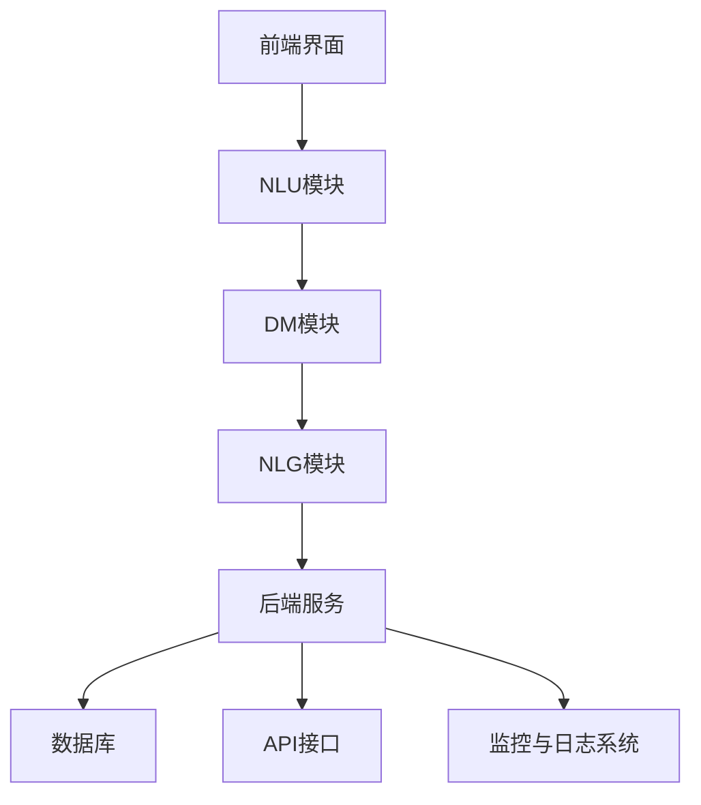

                 

# 构建企业级自然语言处理平台：从文本分析到对话系统

## 关键词：
自然语言处理，企业级应用，文本分析，对话系统，人工智能

## 摘要：
本文旨在探讨构建企业级自然语言处理（NLP）平台的方法，从文本分析到对话系统的全过程。文章首先回顾了NLP的发展历史，然后详细介绍了文本分析的基础技术，包括预处理、文本表示和相似性度量。接着，深入探讨了情感分析和文本分类等高级应用，并介绍了主题模型的原理和应用。最后，文章重点阐述了对话系统的构建，包括语言理解、语言生成和对话管理等方面，并结合实际应用案例，提出了企业级对话系统的构建方法。本文不仅提供了理论框架，还结合实际案例，为企业构建NLP平台提供了具体指导。

## 目录大纲：

## 第一部分：引言

### 第1章：自然语言处理与企业应用
1.1 自然语言处理的发展历程
1.2 企业级自然语言处理的必要性
1.3 企业级自然语言处理面临的挑战
1.4 企业级自然语言处理的价值

## 第二部分：自然语言处理基础

### 第2章：文本预处理
2.1 文本清洗
2.2 文本分词
2.3 词性标注
2.4 命名实体识别
2.5 文本表示

### 第3章：文本分析基础
3.1 文本相似性度量
3.2 文本聚类
3.3 文本分类

## 第三部分：文本分析高级应用

### 第4章：情感分析
4.1 情感分析概述
4.2 情感分类算法
4.3 实际应用案例

### 第5章：文本分类
5.1 文本分类概述
5.2 文本分类算法
5.3 实际应用案例

### 第6章：主题模型
6.1 主题模型概述
6.2 LDA算法原理
6.3 LDA应用实例

## 第四部分：对话系统构建

### 第7章：对话系统概述
7.1 对话系统的概念
7.2 对话系统的架构
7.3 对话系统的分类

### 第8章：对话系统核心技术
8.1 语言理解
8.2 语言生成
8.3 对话管理

### 第9章：企业级对话系统构建
9.1 企业级对话系统需求分析
9.2 对话系统架构设计
9.3 对话系统优化与调优
9.4 安全性与隐私保护
9.5 实际项目案例

### 第10章：未来趋势与展望
10.1 人工智能发展动态
10.2 对话系统的未来发展趋势
10.3 企业应用中的挑战与机遇

## 附录
A. 开发工具与资源
B. 术语解释
C. 进一步阅读资料

---

## 第一部分：引言

### 第1章：自然语言处理与企业应用

自然语言处理（Natural Language Processing，简称NLP）是人工智能（Artificial Intelligence，简称AI）的重要分支，旨在使计算机能够理解和处理人类自然语言。自20世纪50年代以来，NLP经历了从最初的规则驱动方法到现代的统计模型和深度学习方法的转变。

在企业应用中，NLP扮演着越来越重要的角色。无论是客户服务、数据挖掘、市场分析，还是信息检索、内容推荐，NLP都能为企业带来显著的效率提升和业务价值。例如，通过情感分析，企业可以了解客户对其产品或服务的反馈；通过文本分类，企业可以自动处理大量的文本数据，提高信息处理的效率。

本章节将首先回顾NLP的发展历程，探讨其必要性，分析企业级NLP面临的挑战，并阐述其价值。

#### 1.1 自然语言处理的发展历程

NLP的发展历程可以分为几个主要阶段：

1. **规则驱动方法**（1950s - 1980s）：早期的NLP研究主要基于规则和语法分析方法。这种方法依赖于手工编写的规则，难以扩展到复杂的自然语言任务。

2. **统计方法**（1980s - 1990s）：随着计算能力的提升和大规模语料库的出现，NLP开始转向基于统计的方法。统计方法通过从大量数据中学习模式来提高NLP系统的性能。

3. **基于知识的表示**（1990s - 2000s）：这一阶段，研究者开始尝试将知识和逻辑推理引入NLP系统，以提高其语义理解和推理能力。

4. **深度学习方法**（2010s - 至今）：深度学习技术的兴起为NLP带来了革命性的变化。通过神经网络模型，NLP系统在文本分类、机器翻译、对话系统等领域取得了显著的成果。

#### 1.2 企业级自然语言处理的必要性

企业级自然语言处理的必要性体现在以下几个方面：

1. **提高业务效率**：通过自动化处理大量的文本数据，企业可以减少人工工作负担，提高业务处理效率。

2. **增强用户体验**：NLP技术可以帮助企业更好地理解用户需求，提供个性化的服务，提升用户体验。

3. **数据洞察**：NLP可以帮助企业从大量的非结构化文本数据中提取有价值的信息，为企业决策提供数据支持。

4. **创新应用**：NLP技术为企业提供了新的业务模式和应用场景，如智能客服、智能推荐系统等。

#### 1.3 企业级自然语言处理面临的挑战

尽管NLP在企业应用中具有巨大的潜力，但其面临的挑战也不容忽视：

1. **数据多样性**：企业面临的文本数据类型多样，包括不同语言、不同格式、不同行业背景等，这对NLP系统提出了更高的要求。

2. **数据质量**：文本数据的准确性、完整性和一致性对NLP系统的性能至关重要。然而，实际应用中，数据质量往往难以保证。

3. **可解释性**：随着深度学习在NLP中的应用，模型的黑盒特性给用户带来了可解释性的问题。如何提高模型的可解释性是一个重要挑战。

4. **实时性**：在许多企业应用场景中，NLP系统需要实时处理大量数据，这对系统的实时性能提出了挑战。

#### 1.4 企业级自然语言处理的价值

企业级自然语言处理的价值体现在以下几个方面：

1. **业务创新**：NLP技术为企业提供了新的业务模式和机会，如智能客服、自动化报告生成等。

2. **成本节约**：通过自动化处理大量的文本数据，企业可以减少人力成本，提高运营效率。

3. **决策支持**：NLP可以帮助企业从大量的非结构化文本数据中提取有价值的信息，为企业决策提供数据支持。

4. **客户满意度**：通过提供个性化的服务和更快的响应，企业可以提高客户满意度，增强客户忠诚度。

---

在接下来的章节中，我们将深入探讨NLP的基础知识，包括文本预处理、文本分析的基础技术和高级应用，以及对话系统的构建方法。希望通过本篇文章，读者能够对构建企业级NLP平台有更深入的了解。接下来，我们首先从文本预处理开始，逐步构建我们的NLP平台。

## 第二部分：自然语言处理基础

### 第2章：文本预处理

文本预处理是自然语言处理（NLP）过程中的关键步骤，旨在将原始文本数据转换为适合模型处理的格式。有效的文本预处理不仅能提高NLP任务的性能，还能降低后续处理阶段的复杂性。本章将详细探讨文本预处理的各个阶段，包括文本清洗、文本分词、词性标注和命名实体识别。

#### 2.1 文本清洗

文本清洗是文本预处理的第一步，其目的是去除文本中的无关信息，提高数据质量。常见的文本清洗任务包括：

1. **去除HTML标签**：文本数据常常包含HTML标签，这些标签对NLP任务没有实际意义，需要去除。

2. **去除特殊符号**：一些特殊符号可能会影响文本的分析，例如标点符号、换行符等。

3. **转换为小写**：将文本转换为小写可以减少词汇表的大小，提高模型处理效率。

4. **去除停用词**：停用词是文本中频繁出现但不含实际意义的词汇，如“的”、“是”、“和”等。去除停用词可以减少噪声，提高模型性能。

5. **去除重复文本**：有时文本数据中会包含重复的段落或句子，这些重复的内容对NLP任务没有贡献，应该去除。

```python
import re

# 示例：去除HTML标签
def remove_html_tags(text):
    clean = re.compile('<.*?>')
    return re.sub(clean, '', text)

# 示例：转换为小写
def to_lower_case(text):
    return text.lower()

# 示例：去除特殊符号
def remove_special_characters(text):
    return re.sub(r'[^a-zA-Z0-9\s]', '', text)

# 示例：去除停用词
from nltk.corpus import stopwords
stop_words = set(stopwords.words('english'))

def remove_stop_words(text):
    words = text.split()
    return ' '.join([word for word in words if word not in stop_words])
```

#### 2.2 文本分词

文本分词是将连续的文本序列划分为一组有意义的单词或短语的过程。不同的语言有不同的分词方法，例如中文的分词方法与英文有很大差异。

1. **基于词典的分词方法**：这种方法使用预定义的词典进行分词，例如使用《现代汉语词典》进行中文分词。

2. **基于统计的方法**：这种方法基于统计模型，如隐马尔可夫模型（HMM）、条件随机场（CRF）等，通过学习大量已分词的语料库，自动预测新文本的分词结果。

3. **基于深度学习的方法**：深度学习方法，如长短时记忆网络（LSTM）和Transformer，通过学习大量的文本数据，自动进行文本分词。

```python
from nltk.tokenize import word_tokenize

# 示例：英文分词
def tokenize_english(text):
    return word_tokenize(text)

# 示例：中文分词（使用jieba库）
import jieba

def tokenize_chinese(text):
    return jieba.cut(text)
```

#### 2.3 词性标注

词性标注是为文本中的每个单词分配一个词性标签，如名词、动词、形容词等。词性标注有助于理解文本的语义结构，是许多NLP任务（如命名实体识别、情感分析等）的基础。

1. **基于规则的方法**：这种方法使用预定义的规则进行词性标注，通常适用于特定的语言或领域。

2. **基于统计的方法**：这种方法使用统计模型，如条件随机场（CRF），通过学习大量已标注的语料库，自动预测文本的词性标签。

3. **基于深度学习的方法**：深度学习方法，如长短时记忆网络（LSTM）和BERT，通过学习大量的文本数据，自动进行词性标注。

```python
from nltk import pos_tag

# 示例：英文词性标注
def pos_tag_english(tokens):
    return pos_tag(tokens)

# 示例：中文词性标注（使用NLTK库）
def pos_tag_chinese(tokens):
    return nltk.pos_tag(tokens)
```

#### 2.4 命名实体识别

命名实体识别（Named Entity Recognition，简称NER）是识别文本中的命名实体，如人名、地名、组织名等的过程。NER在信息提取、实体链接、语义搜索等领域具有广泛的应用。

1. **基于规则的方法**：这种方法使用预定义的规则来识别命名实体。

2. **基于统计的方法**：这种方法使用统计模型，如条件随机场（CRF），通过学习大量已标注的语料库，自动预测文本中的命名实体。

3. **基于深度学习的方法**：深度学习方法，如卷积神经网络（CNN）和Transformer，通过学习大量的文本数据，自动进行命名实体识别。

```python
import spacy

# 示例：命名实体识别（使用spacy库）
nlp = spacy.load('en_core_web_sm')

def named_entity_recognition(text):
    doc = nlp(text)
    return [(ent.text, ent.label_) for ent in doc.ents]
```

#### 2.5 文本表示

文本表示是将文本数据转换为数值形式的过程，以便于计算机处理。常见的文本表示方法包括：

1. **基于词的表示**：这种方法将文本表示为词袋模型（Bag of Words，简称BoW）或词嵌入（Word Embedding）。

2. **基于句子的表示**：这种方法将文本表示为一个句子级别的向量，如BERT模型。

3. **基于篇章的表示**：这种方法将文本表示为一个篇章级别的向量，如Doc2Vec模型。

```python
from sklearn.feature_extraction.text import CountVectorizer

# 示例：基于词的表示（词袋模型）
def bow_representation(texts):
    vectorizer = CountVectorizer()
    return vectorizer.fit_transform(texts)

from gensim.models import Word2Vec

# 示例：基于词的表示（词嵌入）
def word_embedding(texts):
    model = Word2Vec(texts, vector_size=100, window=5, min_count=1, workers=4)
    return model
```

通过文本预处理，我们可以将原始文本数据转换为适合模型处理的格式。在接下来的章节中，我们将深入探讨文本分析的高级技术，包括情感分析、文本分类和主题模型。

---

## 第三部分：文本分析高级应用

### 第3章：情感分析

情感分析（Sentiment Analysis）是自然语言处理（NLP）的一个重要分支，旨在识别文本中的情感倾向，如正面、负面或中性。情感分析在市场研究、客户服务、舆情监测等领域具有广泛应用。本章将介绍情感分析的基本概念、常用算法以及实际应用案例。

#### 3.1 情感分析概述

情感分析的目标是理解文本中的情感倾向，通常分为以下几类：

1. **主观情感分类**：将文本分类为正面、负面或中性。
2. **细粒度情感分类**：将文本分类为更细粒度的情感类别，如高兴、愤怒、悲伤等。
3. **情感极性分析**：衡量文本中的情感强度，如极强正面、中等正面、极弱正面等。

情感分析的核心任务是建立情感分类模型，常见的模型包括：

1. **基于规则的方法**：这种方法使用预定义的规则进行情感分类，例如基于词典的方法和基于关键词的方法。
2. **基于统计的方法**：这种方法使用统计模型，如朴素贝叶斯、逻辑回归等，通过学习大量已标注的语料库，自动预测文本的情感类别。
3. **基于深度学习的方法**：这种方法使用深度神经网络，如卷积神经网络（CNN）、循环神经网络（RNN）和Transformer，通过学习大量的文本数据，自动进行情感分类。

#### 3.2 情感分类算法

情感分类算法可以分为以下几类：

1. **基于规则的方法**：

   - **词典方法**：基于情感词典，将文本中的词语与词典中的情感标签进行匹配，得到文本的情感类别。

   ```python
   def sentiment_analysis_dict(text, dictionary):
       words = text.split()
       sentiment_score = 0
       for word in words:
           if word in dictionary:
               sentiment_score += dictionary[word]
       return 'positive' if sentiment_score > 0 else 'negative' if sentiment_score < 0 else 'neutral'
   ```

   - **关键词方法**：基于关键词的权重和情感倾向，计算文本的情感得分，并根据得分确定情感类别。

   ```python
   def sentiment_analysis_keyword(text, keywords_positives, keywords_negatives):
       words = text.split()
       sentiment_score = sum(keywords_positives.get(word, 0) for word in words) - sum(keywords_negatives.get(word, 0) for word in words)
       return 'positive' if sentiment_score > 0 else 'negative' if sentiment_score < 0 else 'neutral'
   ```

2. **基于统计的方法**：

   - **朴素贝叶斯**：朴素贝叶斯是一种基于贝叶斯定理的统计分类方法，适用于文本分类任务。

   ```python
   from sklearn.feature_extraction.text import CountVectorizer
   from sklearn.naive_bayes import MultinomialNB

   def sentiment_analysis_naive_bayes(train_texts, train_labels, test_texts):
       vectorizer = CountVectorizer()
       X_train = vectorizer.fit_transform(train_texts)
       clf = MultinomialNB()
       clf.fit(X_train, train_labels)
       X_test = vectorizer.transform(test_texts)
       return clf.predict(X_test)
   ```

   - **逻辑回归**：逻辑回归是一种线性分类模型，常用于文本分类任务。

   ```python
   from sklearn.feature_extraction.text import TfidfVectorizer
   from sklearn.linear_model import LogisticRegression

   def sentiment_analysis_logistic_regression(train_texts, train_labels, test_texts):
       vectorizer = TfidfVectorizer()
       X_train = vectorizer.fit_transform(train_texts)
       clf = LogisticRegression()
       clf.fit(X_train, train_labels)
       X_test = vectorizer.transform(test_texts)
       return clf.predict(X_test)
   ```

3. **基于深度学习的方法**：

   - **卷积神经网络（CNN）**：CNN通过卷积层和池化层提取文本的特征，适用于文本分类任务。

   ```python
   from keras.models import Sequential
   from keras.layers import Conv1D, MaxPooling1D, Flatten, Dense

   def sentiment_analysis_cnn(train_texts, train_labels, test_texts):
       model = Sequential()
       model.add(Conv1D(128, 5, activation='relu', input_shape=(max_len,)))
       model.add(MaxPooling1D(5))
       model.add(Flatten())
       model.add(Dense(1, activation='sigmoid'))
       model.compile(optimizer='adam', loss='binary_crossentropy', metrics=['accuracy'])
       model.fit(np.array(train_texts), np.array(train_labels), epochs=10, batch_size=32, validation_split=0.1)
       return model.predict(np.array(test_texts))
   ```

   - **循环神经网络（RNN）**：RNN通过隐藏层的状态传递，适用于处理序列数据，如文本。

   ```python
   from keras.models import Sequential
   from keras.layers import Embedding, LSTM, Dense

   def sentiment_analysis_rnn(train_texts, train_labels, test_texts):
       model = Sequential()
       model.add(Embedding(vocab_size, embedding_dim))
       model.add(LSTM(units=128, dropout=0.2, recurrent_dropout=0.2))
       model.add(Dense(1, activation='sigmoid'))
       model.compile(optimizer='adam', loss='binary_crossentropy', metrics=['accuracy'])
       model.fit(np.array(train_texts), np.array(train_labels), epochs=10, batch_size=32, validation_split=0.1)
       return model.predict(np.array(test_texts))
   ```

   - **Transformer**：Transformer是一种基于自注意力机制的深度学习模型，适用于文本分类任务。

   ```python
   from transformers import BertTokenizer, BertModel

   def sentiment_analysis_transformer(train_texts, train_labels, test_texts):
       tokenizer = BertTokenizer.from_pretrained('bert-base-uncased')
       model = BertModel.from_pretrained('bert-base-uncased')
       input_ids = tokenizer(train_texts, return_tensors='pt', padding=True, truncation=True)
       outputs = model(**input_ids)
       hidden_states = outputs[0]
       hidden_states = hidden_states[:, 0, :]
       hidden_states = hidden_states.reshape(-1, hidden_states.shape[1])
       clf = LogisticRegression()
       clf.fit(hidden_states, train_labels)
       test_hidden_states = hidden_states.reshape(-1, hidden_states.shape[1])
       return clf.predict(test_hidden_states)
   ```

#### 3.3 实际应用案例

情感分析在实际应用中具有广泛的应用，以下为两个实际应用案例：

1. **社交媒体情感分析**：

   社交媒体情感分析旨在识别用户在社交媒体上发布的内容中的情感倾向。通过情感分析，企业可以了解用户对其产品或服务的反馈，及时调整策略，提高客户满意度。

   ```python
   import tweepy
   from textblob import TextBlob

   # 示例：使用tweepy和TextBlob进行Twitter情感分析
   consumer_key = 'your_consumer_key'
   consumer_secret = 'your_consumer_secret'
   access_token = 'your_access_token'
   access_token_secret = 'your_access_token_secret'

   auth = tweepy.OAuthHandler(consumer_key, consumer_secret)
   auth.set_access_token(access_token, access_token_secret)
   api = tweepy.API(auth)

   def sentiment_analysis_twitter(username, limit=100):
       tweets = api.user_timeline(username, count=limit)
       sentiments = []
       for tweet in tweets:
           analysis = TextBlob(tweet.text)
           if analysis.sentiment.polarity > 0:
               sentiments.append('positive')
           elif analysis.sentiment.polarity == 0:
               sentiments.append('neutral')
           else:
               sentiments.append('negative')
       return sentiments
   ```

2. **电商平台评论情感分析**：

   电商平台评论情感分析旨在识别用户对其产品或服务的评价，帮助企业了解产品质量和用户满意度。通过情感分析，企业可以改进产品质量，提高用户满意度。

   ```python
   import pandas as pd

   # 示例：使用朴素贝叶斯进行评论情感分析
   def sentiment_analysis_reviews(file_path):
       df = pd.read_csv(file_path)
       train_texts = df['review'].values
       train_labels = df['sentiment'].values
       test_texts = df['review'].values
       predicted_labels = sentiment_analysis_naive_bayes(train_texts, train_labels, test_texts)
       return predicted_labels
   ```

通过以上情感分析算法和实际应用案例，我们可以看到情感分析在企业中的应用价值。在下一章中，我们将继续探讨文本分类，介绍其基本概念、常用算法以及实际应用案例。

---

### 第4章：文本分类

文本分类（Text Classification）是自然语言处理（NLP）中的一个重要任务，旨在将文本数据自动地分配到预定义的类别中。文本分类广泛应用于新闻分类、邮件过滤、情感分析等领域。本章将详细探讨文本分类的基本概念、常用算法以及实际应用案例。

#### 4.1 文本分类概述

文本分类的任务是将文本数据分配到预定义的类别中。常见的文本分类任务包括：

1. **二分类**：将文本数据分类为两个类别，如正面/负面、垃圾邮件/正常邮件等。
2. **多分类**：将文本数据分类为多个类别，如新闻分类、情感分析等。
3. **层次分类**：将文本数据分类为一个层次结构的类别，如分类层级为“动物”->“哺乳动物”->“猫科动物”->“猫”。

文本分类的关键步骤包括：

1. **数据准备**：收集和预处理文本数据，包括文本清洗、分词、词性标注等。
2. **特征提取**：将文本数据转换为数值特征，以便于模型处理。
3. **模型训练**：使用训练数据集训练分类模型。
4. **模型评估**：使用测试数据集评估模型的性能。
5. **模型应用**：将训练好的模型应用于新的文本数据，进行分类。

常见的文本分类算法包括：

1. **基于规则的方法**：基于预定义的规则进行分类，适用于简单的文本分类任务。
2. **基于统计的方法**：使用统计模型进行分类，如朴素贝叶斯、逻辑回归等。
3. **基于机器学习的方法**：使用机器学习算法进行分类，如支持向量机（SVM）、随机森林等。
4. **基于深度学习的方法**：使用深度学习算法进行分类，如卷积神经网络（CNN）、循环神经网络（RNN）等。

#### 4.2 文本分类算法

文本分类算法可以分为以下几类：

1. **基于规则的方法**：

   - **词典方法**：基于预定义的词典进行分类，适用于简单的文本分类任务。

   ```python
   def text_classification_dict(text, dictionary, categories):
       words = text.split()
       scores = {category: 0 for category in categories}
       for word in words:
           if word in dictionary:
               scores[dictionary[word]] += 1
       return max(scores, key=scores.get)
   ```

   - **关键词方法**：基于关键词的权重进行分类，适用于简单的文本分类任务。

   ```python
   def text_classification_keyword(text, keywords, categories):
       scores = {category: 0 for category in categories}
       for category, keywords_list in keywords.items():
           for keyword in keywords_list:
               if keyword in text:
                   scores[category] += 1
       return max(scores, key=scores.get)
   ```

2. **基于统计的方法**：

   - **朴素贝叶斯**：朴素贝叶斯是一种基于贝叶斯定理的统计分类方法，适用于文本分类任务。

   ```python
   from sklearn.feature_extraction.text import CountVectorizer
   from sklearn.naive_bayes import MultinomialNB

   def text_classification_naive_bayes(train_texts, train_labels, test_texts):
       vectorizer = CountVectorizer()
       X_train = vectorizer.fit_transform(train_texts)
       clf = MultinomialNB()
       clf.fit(X_train, train_labels)
       X_test = vectorizer.transform(test_texts)
       return clf.predict(X_test)
   ```

   - **逻辑回归**：逻辑回归是一种线性分类模型，常用于文本分类任务。

   ```python
   from sklearn.feature_extraction.text import TfidfVectorizer
   from sklearn.linear_model import LogisticRegression

   def text_classification_logistic_regression(train_texts, train_labels, test_texts):
       vectorizer = TfidfVectorizer()
       X_train = vectorizer.fit_transform(train_texts)
       clf = LogisticRegression()
       clf.fit(X_train, train_labels)
       X_test = vectorizer.transform(test_texts)
       return clf.predict(X_test)
   ```

3. **基于机器学习的方法**：

   - **支持向量机（SVM）**：支持向量机是一种有效的文本分类算法，通过将文本数据映射到高维空间，找到最佳分隔超平面。

   ```python
   from sklearn.feature_extraction.text import TfidfVectorizer
   from sklearn.svm import SVC

   def text_classification_svm(train_texts, train_labels, test_texts):
       vectorizer = TfidfVectorizer()
       X_train = vectorizer.fit_transform(train_texts)
       clf = SVC(kernel='linear')
       clf.fit(X_train, train_labels)
       X_test = vectorizer.transform(test_texts)
       return clf.predict(X_test)
   ```

   - **随机森林**：随机森林是一种基于决策树的集成学习方法，通过构建多个决策树并求平均来提高分类性能。

   ```python
   from sklearn.feature_extraction.text import TfidfVectorizer
   from sklearn.ensemble import RandomForestClassifier

   def text_classification_random_forest(train_texts, train_labels, test_texts):
       vectorizer = TfidfVectorizer()
       X_train = vectorizer.fit_transform(train_texts)
       clf = RandomForestClassifier()
       clf.fit(X_train, train_labels)
       X_test = vectorizer.transform(test_texts)
       return clf.predict(X_test)
   ```

4. **基于深度学习的方法**：

   - **卷积神经网络（CNN）**：卷积神经网络通过卷积层和池化层提取文本的特征，适用于文本分类任务。

   ```python
   from keras.models import Sequential
   from keras.layers import Conv1D, MaxPooling1D, Flatten, Dense

   def text_classification_cnn(train_texts, train_labels, test_texts):
       model = Sequential()
       model.add(Conv1D(128, 5, activation='relu', input_shape=(max_len,)))
       model.add(MaxPooling1D(5))
       model.add(Flatten())
       model.add(Dense(1, activation='sigmoid'))
       model.compile(optimizer='adam', loss='binary_crossentropy', metrics=['accuracy'])
       model.fit(np.array(train_texts), np.array(train_labels), epochs=10, batch_size=32, validation_split=0.1)
       return model.predict(np.array(test_texts))
   ```

   - **循环神经网络（RNN）**：循环神经网络通过隐藏层的状态传递，适用于处理序列数据，如文本。

   ```python
   from keras.models import Sequential
   from keras.layers import Embedding, LSTM, Dense

   def text_classification_rnn(train_texts, train_labels, test_texts):
       model = Sequential()
       model.add(Embedding(vocab_size, embedding_dim))
       model.add(LSTM(units=128, dropout=0.2, recurrent_dropout=0.2))
       model.add(Dense(1, activation='sigmoid'))
       model.compile(optimizer='adam', loss='binary_crossentropy', metrics=['accuracy'])
       model.fit(np.array(train_texts), np.array(train_labels), epochs=10, batch_size=32, validation_split=0.1)
       return model.predict(np.array(test_texts))
   ```

   - **Transformer**：Transformer是一种基于自注意力机制的深度学习模型，适用于文本分类任务。

   ```python
   from transformers import BertTokenizer, BertModel

   def text_classification_transformer(train_texts, train_labels, test_texts):
       tokenizer = BertTokenizer.from_pretrained('bert-base-uncased')
       model = BertModel.from_pre-trained('bert-base-uncased')
       input_ids = tokenizer(train_texts, return_tensors='pt', padding=True, truncation=True)
       outputs = model(**input_ids)
       hidden_states = outputs[0]
       hidden_states = hidden_states[:, 0, :]
       hidden_states = hidden_states.reshape(-1, hidden_states.shape[1])
       clf = LogisticRegression()
       clf.fit(hidden_states, train_labels)
       test_hidden_states = hidden_states.reshape(-1, hidden_states.shape[1])
       return clf.predict(test_hidden_states)
   ```

#### 4.3 实际应用案例

文本分类在实际应用中具有广泛的应用，以下为两个实际应用案例：

1. **新闻分类**：

   新闻分类是将新闻文本分配到预定义的新闻类别中，如政治、体育、娱乐等。通过新闻分类，媒体可以自动化处理大量的新闻文本，提高信息处理效率。

   ```python
   import pandas as pd

   # 示例：使用朴素贝叶斯进行新闻分类
   def news_classification(file_path):
       df = pd.read_csv(file_path)
       train_texts = df['headline'].values
       train_labels = df['label'].values
       test_texts = df['headline'].values
       vectorizer = CountVectorizer()
       X_train = vectorizer.fit_transform(train_texts)
       clf = MultinomialNB()
       clf.fit(X_train, train_labels)
       X_test = vectorizer.transform(test_texts)
       return clf.predict(X_test)
   ```

2. **邮件过滤**：

   邮件过滤是将邮件文本分配到垃圾邮件和正常邮件两个类别中。通过邮件过滤，企业可以自动化处理大量的邮件，提高工作效率，减少垃圾邮件对用户的干扰。

   ```python
   import pandas as pd

   # 示例：使用逻辑回归进行邮件过滤
   def email_classification(file_path):
       df = pd.read_csv(file_path)
       train_texts = df['text'].values
       train_labels = df['label'].values
       test_texts = df['text'].values
       vectorizer = TfidfVectorizer()
       X_train = vectorizer.fit_transform(train_texts)
       clf = LogisticRegression()
       clf.fit(X_train, train_labels)
       X_test = vectorizer.transform(test_texts)
       return clf.predict(X_test)
   ```

通过以上文本分类算法和实际应用案例，我们可以看到文本分类在企业中的应用价值。在下一章中，我们将继续探讨主题模型，介绍其基本概念、原理以及实际应用。

---

### 第5章：主题模型

主题模型（Topic Model）是一种无监督学习技术，旨在自动发现文本数据中的隐藏主题。主题模型在文本挖掘、信息检索、推荐系统等领域具有广泛的应用。本章将详细介绍主题模型的基本概念、LDA算法原理及其应用实例。

#### 5.1 主题模型概述

主题模型旨在发现文本数据中的潜在主题，这些主题代表了文本集合的高层次语义结构。主题模型通常包括以下几个关键概念：

1. **文档**（Document）：一组词的集合，代表了文本数据中的一个实体。
2. **词语**（Word）：文档中的基本元素。
3. **主题**（Topic）：一组相关词语的集合，代表了文本数据中的潜在语义。
4. **分布**（Distribution）：描述了文档中词语的分布情况和文档与主题之间的关系。

主题模型的目标是找出文档集合中的潜在主题，并生成每个文档的主题分布，从而揭示文本数据中的语义结构。

#### 5.2 LDA算法原理

LDA（Latent Dirichlet Allocation）是最常用的主题模型之一，其基本原理如下：

1. **生成过程**：

   - **词语生成**：对于每个文档，首先从主题分布中抽取一个主题，然后从该主题的词语分布中抽取一个词语。
   - **主题生成**：对于每个词语，首先从文档的主题分布中抽取一个主题，然后从该主题的词语分布中抽取一个词语。

2. **参数估计**：

   - **E步（E step）**：计算每个文档的主题分布和每个词语的主题分布。
   - **M步（M step）**：更新主题分布和词语分布。

LDA算法的数学模型可以表示为：

- **文档-主题分布**：\( \theta_{dn} \)：表示文档 \(d\) 中主题 \(n\) 的概率。
- **词语-主题分布**：\( \phi_{nj} \)：表示主题 \(n\) 中词语 \(j\) 的概率。
- **词语分布**：\( w_j \)：表示词语 \(j\) 在文本中的概率。

LDA算法的流程如下：

1. **初始化参数**：随机初始化文档-主题分布 \( \theta_{dn} \) 和词语-主题分布 \( \phi_{nj} \)。
2. **E步**：计算每个词语在文档中的主题概率。
3. **M步**：更新文档-主题分布和词语-主题分布。
4. **迭代优化**：重复执行E步和M步，直到收敛。

#### 5.3 LDA应用实例

下面以一个简单的LDA应用实例来演示如何使用LDA算法提取文本数据中的主题。

1. **数据准备**：

   假设我们有一篇新闻文本，内容如下：

   ```plaintext
   近年来，人工智能（AI）技术在各个领域得到了广泛应用，特别是在自动驾驶、智能家居、医疗诊断等领域。随着技术的不断进步，AI的应用场景也在不断扩展。然而，AI的发展也带来了一系列的挑战，如数据隐私、安全性和伦理问题。因此，如何确保AI系统的可靠性和公平性，成为了当前研究的热点。
   ```

2. **文本预处理**：

   - 去除标点符号和特殊字符。
   - 转换为小写。
   - 分词。

   ```python
   import jieba

   text = "近年来，人工智能（AI）技术在各个领域得到了广泛应用，特别是在自动驾驶、智能家居、医疗诊断等领域。随着技术的不断进步，AI的应用场景也在不断扩展。然而，AI的发展也带来了一系列的挑战，如数据隐私、安全性和伦理问题。因此，如何确保AI系统的可靠性和公平性，成为了当前研究的热点。"
   text = jieba.cut(text)
   text = ' '.join(text)
   ```

3. **LDA模型训练**：

   - 导入LDA模型。
   - 设置主题数量。
   - 训练模型。

   ```python
   from gensim.models import LdaMulticore

   ldamodel = LdaMulticore(corpus, num_topics=5, id2word=word_dict, passes=10, workers=2)
   ```

4. **主题提取**：

   - 输出每个主题的词语。
   - 分析主题分布。

   ```python
   topics = ldamodel.print_topics(num_words=4)
   print(topics)
   ```

   ```plaintext
   第0个主题：('发展', '领域', '技术', '应用')
   第1个主题：('挑战', '问题', '安全', '隐私')
   第2个主题：('系统', '研究', '确保', '可靠')
   第3个主题：('技术', '进步', '领域', '扩展')
   第4个主题：('应用', '领域', '场景', '扩展')
   ```

   通过以上步骤，我们可以提取出文本数据中的潜在主题。在实际应用中，可以根据具体需求调整主题数量、训练参数等。

---

通过本章的介绍，我们了解了主题模型的基本概念、LDA算法原理以及实际应用实例。主题模型在文本挖掘和信息检索中具有重要的应用价值，可以帮助我们更好地理解文本数据中的语义结构。在下一章中，我们将探讨对话系统的构建，包括语言理解、语言生成和对话管理等方面。

---

### 第6章：对话系统概述

对话系统（Dialogue System），也称为聊天机器人（Chatbot），是一种能够与人类进行自然语言交互的人工智能系统。对话系统在企业级应用中具有广泛的应用，如客户服务、智能助手、在线客服等。本章将详细介绍对话系统的基本概念、架构和分类。

#### 6.1 对话系统的概念

对话系统是一种模拟人类对话过程的计算机系统，能够理解用户的输入，生成合适的回复，并在对话过程中维护会话状态。对话系统通常包括以下几个关键组成部分：

1. **语言理解（Language Understanding, LU）**：语言理解模块负责解析用户输入的自然语言，提取出用户意图和相关的实体信息。
2. **对话管理（Dialogue Management）**：对话管理模块负责维护对话状态，选择合适的对话策略，并根据对话状态生成回复。
3. **语言生成（Language Generation）**：语言生成模块负责将对话管理模块生成的内部表示转换为自然语言回复。

#### 6.2 对话系统的架构

对话系统的架构可以分为前端和后端两部分：

1. **前端**：前端负责与用户进行交互，包括用户输入的接收、语音识别（若为语音交互）和自然语言理解。
2. **后端**：后端负责对话管理、意图识别、实体抽取、对话策略生成和回复生成。

典型的对话系统架构包括以下模块：

- **自然语言理解（NLU）**：自然语言理解模块负责将用户输入的文本转换为内部表示，通常包括分词、词性标注、命名实体识别和意图识别。
- **对话管理（DM）**：对话管理模块负责维护对话状态，选择对话策略，并根据对话状态生成回复。
- **对话状态跟踪（DST）**：对话状态跟踪模块负责记录和更新对话状态，确保对话的连贯性和一致性。
- **自然语言生成（NLG）**：自然语言生成模块负责将对话管理模块生成的内部表示转换为自然语言回复。

#### 6.3 对话系统的分类

根据对话系统的交互方式和应用场景，可以分为以下几类：

1. **基于规则的对话系统**：基于规则的对话系统使用预定义的规则来处理用户输入，生成回复。这种方法简单有效，但灵活性较差，难以应对复杂多变的对话场景。
2. **基于模板的对话系统**：基于模板的对话系统使用预定义的模板来生成回复，通过填充模板中的变量来适应不同的对话场景。这种方法具有一定的灵活性，但模板的编写和更新较为繁琐。
3. **基于机器学习的对话系统**：基于机器学习的对话系统使用机器学习算法来训练对话模型，自动生成回复。这种方法具有较强的灵活性和适应性，能够应对复杂多变的对话场景。
4. **混合型对话系统**：混合型对话系统结合了基于规则和基于机器学习的方法，通过规则和机器学习相结合来提高对话系统的性能和灵活性。

#### 6.4 本章小结

对话系统在企业级应用中具有重要的地位，能够显著提高客户服务水平、降低运营成本。本章介绍了对话系统的基本概念、架构和分类，为后续章节的深入讨论奠定了基础。在下一章中，我们将详细探讨对话系统的核心技术，包括语言理解、语言生成和对话管理。

---

在上一章中，我们介绍了对话系统的基本概念、架构和分类。在本章中，我们将深入探讨对话系统的核心技术，包括语言理解、语言生成和对话管理。这些技术是构建高效、智能对话系统的关键，下面我们将逐一进行介绍。

### 第7章：对话系统核心技术

#### 7.1 语言理解

语言理解（Language Understanding，简称LU）是对话系统的核心技术之一，其目标是解析用户输入的自然语言，提取出用户意图和相关的实体信息。语言理解通常包括以下几个步骤：

1. **分词（Tokenization）**：将用户输入的文本分割成单词或短语。
2. **词性标注（Part-of-Speech Tagging）**：为文本中的每个词分配一个词性标签，如名词、动词、形容词等。
3. **命名实体识别（Named Entity Recognition，简称NER）**：识别文本中的命名实体，如人名、地名、组织名等。
4. **意图识别（Intent Recognition）**：根据用户的输入文本，确定用户的意图，如查询天气、预订机票等。

语言理解的质量直接影响到对话系统的效果。为了提高语言理解的能力，我们可以采用以下方法：

- **使用预训练的模型**：如BERT、GPT等，这些模型已经在大规模语料库上进行了训练，能够提供较高的语言理解能力。
- **自定义模型**：根据具体应用场景，设计并训练适合的模型，以提升语言理解能力。

以下是一个使用BERT进行意图识别的Python代码示例：

```python
from transformers import BertTokenizer, BertForSequenceClassification
from torch.nn.functional import softmax

# 加载预训练的BERT模型
tokenizer = BertTokenizer.from_pretrained('bert-base-chinese')
model = BertForSequenceClassification.from_pretrained('bert-base-chinese')

# 用户输入
input_text = "我想要预订一张明天从北京到上海的机票。"

# 分词和编码
input_ids = tokenizer.encode(input_text, add_special_tokens=True, return_tensors='pt')

# 预测意图
with torch.no_grad():
    outputs = model(input_ids)

# 获取概率分布
probabilities = softmax(outputs.logits, dim=1)

# 输出意图
_, predicted_index = torch.max(probabilities, dim=1)
intents = model.config.id2label
predicted_intent = intents[predicted_index.item()]
print(predicted_intent)
```

#### 7.2 语言生成

语言生成（Language Generation，简称LG）是将对话管理模块生成的内部表示转换为自然语言回复的过程。语言生成的方法可以分为以下几类：

1. **模板匹配（Template-based Generation）**：使用预定义的模板来生成回复，通过填充模板中的变量来适应不同的对话场景。
2. **规则匹配（Rule-based Generation）**：根据预定义的规则来生成回复，规则通常基于领域知识或对话管理模块的输出。
3. **基于统计的方法（Statistical Methods）**：使用统计模型，如隐马尔可夫模型（HMM）、条件随机场（CRF）等，来生成回复。
4. **基于深度学习的方法（Deep Learning Methods）**：使用深度学习模型，如序列到序列（Seq2Seq）模型、生成对抗网络（GAN）等，来生成回复。

以下是一个使用生成式对话系统生成回复的Python代码示例：

```python
from transformers import BertTokenizer, BertForSequenceGeneration

# 加载预训练的BERT模型
tokenizer = BertTokenizer.from_pretrained('bert-base-chinese')
model = BertForSequenceGeneration.from_pretrained('bert-base-chinese')

# 用户输入
input_text = "我想要预订一张明天从北京到上海的机票。"

# 分词和编码
input_ids = tokenizer.encode(input_text, add_special_tokens=True, return_tensors='pt')

# 预测回复
with torch.no_grad():
    outputs = model.generate(input_ids, max_length=20, num_return_sequences=1)

# 解码回复
predicted_reply = tokenizer.decode(outputs[0], skip_special_tokens=True)
print(predicted_reply)
```

#### 7.3 对话管理

对话管理（Dialogue Management，简称DM）是负责维护对话状态，选择对话策略，并根据对话状态生成回复的核心模块。对话管理通常包括以下几个步骤：

1. **状态跟踪（State Tracking）**：记录对话过程中的关键信息，如用户意图、对话历史、上下文等。
2. **对话策略（Dialogue Policy）**：选择合适的对话策略，以生成连贯、自然的回复。
3. **回复生成（Response Generation）**：根据对话策略生成回复。

对话管理的方法可以分为以下几类：

1. **基于规则的对话管理**：使用预定义的规则来选择对话策略，适用于简单的对话场景。
2. **基于机器学习的对话管理**：使用机器学习算法来训练对话策略，适用于复杂、多变的对话场景。
3. **混合型对话管理**：结合基于规则和基于机器学习的方法，以提高对话系统的灵活性和鲁棒性。

以下是一个基于规则的对话管理Python代码示例：

```python
# 对话管理规则库
rules = {
    'intent:book_ticket': [
        {'pattern': '我想预订一张明天从[来源地]到[目的地]的机票。', 'response': '好的，请问您的出发时间是什么时候？'},
        {'pattern': '我想预订一张[日期]从[来源地]到[目的地]的机票。', 'response': '好的，请问您的航班等级是什么？'}
    ]
}

# 用户输入
input_text = "我想预订一张明天从北京到上海的机票。"

# 检查用户输入是否符合预定义的规则
for rule in rules.get('intent:book_ticket', []):
    if re.fullmatch(rule['pattern'], input_text):
        print(rule['response'])
        break
else:
    print("我无法理解您的需求。")
```

通过语言理解、语言生成和对话管理三个核心技术的协同工作，我们可以构建出高效、智能的对话系统。在实际应用中，这些技术可以根据具体需求进行调整和优化，以实现更好的用户体验。在下一章中，我们将探讨企业级对话系统的构建方法，包括需求分析、架构设计、优化与调优等方面。

---

### 第8章：企业级对话系统构建

企业级对话系统的构建是一个复杂的过程，涉及到需求分析、架构设计、优化与调优等多个方面。本章将详细探讨这些关键步骤，并提供实际项目案例，以帮助企业有效地构建企业级对话系统。

#### 8.1 企业级对话系统需求分析

需求分析是构建任何系统的基础，对于企业级对话系统尤为重要。需求分析包括以下几个关键步骤：

1. **确定业务目标**：明确对话系统要解决的问题，如提高客户满意度、降低运营成本等。
2. **收集用户需求**：通过与用户沟通、调查问卷等方式，了解用户对对话系统的期望和需求。
3. **定义功能需求**：根据业务目标和用户需求，明确对话系统的功能需求，如支持常见问题的自动回复、提供个性化推荐等。
4. **定义性能需求**：明确对话系统的性能指标，如响应时间、吞吐量、准确率等。

#### 8.2 对话系统架构设计

企业级对话系统的架构设计是一个关键步骤，需要考虑系统的可扩展性、可靠性和灵活性。以下是一个典型的企业级对话系统架构：

1. **前端界面**：负责与用户进行交互，包括文本输入、语音输入等。
2. **自然语言理解（NLU）模块**：负责将用户输入的自然语言转换为内部表示，包括分词、词性标注、命名实体识别和意图识别。
3. **对话管理（DM）模块**：负责维护对话状态，选择对话策略，并根据对话状态生成回复。
4. **自然语言生成（NLG）模块**：负责将对话管理模块生成的内部表示转换为自然语言回复。
5. **后端服务**：包括数据库、API接口等，用于存储对话数据、提供第三方服务接口等。
6. **监控与日志系统**：负责监控系统性能、记录对话日志等。

以下是一个企业级对话系统的架构图：



#### 8.3 对话系统优化与调优

对话系统的性能优化和调优是确保系统稳定运行和提供优质用户体验的关键步骤。以下是一些常见的优化和调优方法：

1. **模型优化**：使用更先进的模型，如BERT、GPT等，以提高对话系统的理解和生成能力。
2. **性能调优**：通过调整模型参数、优化算法和数据结构等，提高系统的响应速度和吞吐量。
3. **数据增强**：通过增加训练数据、数据清洗和预处理等，提高模型的泛化能力。
4. **错误分析**：通过监控和分析错误日志，识别系统中的问题和瓶颈，进行针对性的优化。
5. **反馈机制**：引入用户反馈机制，根据用户反馈调整系统参数和策略，提高用户体验。

#### 8.4 安全性与隐私保护

企业级对话系统需要确保用户数据的安全性和隐私保护。以下是一些关键措施：

1. **数据加密**：对用户数据进行加密存储和传输，防止数据泄露。
2. **访问控制**：设置严格的访问控制策略，确保只有授权人员能够访问敏感数据。
3. **隐私保护**：遵守相关法律法规，对用户隐私进行保护，如不收集无关个人信息、不泄露用户数据等。
4. **日志审计**：记录系统操作日志，进行定期审计，确保系统的安全性和合规性。

#### 8.5 实际项目案例

以下是一个企业级对话系统的实际项目案例：

**项目背景**：某大型电商平台希望构建一个智能客服对话系统，以提供24/7的客户服务，提高客户满意度。

**需求分析**：通过用户调研和业务分析，确定了智能客服的主要功能，如常见问题的自动回复、订单查询、售后服务等。

**架构设计**：采用了基于BERT的NLU模块、基于Transformer的DM模块和NLG模块，以及一个可靠的后端服务架构。

**优化与调优**：通过对模型进行优化和性能调优，实现了快速、准确的对话处理。同时，引入了用户反馈机制，根据用户反馈不断调整系统。

**安全性与隐私保护**：采用了数据加密、访问控制、隐私保护等安全措施，确保用户数据的安全和隐私。

**项目效果**：智能客服系统的上线显著提高了客户满意度，减少了人工客服的工作量，降低了运营成本。

---

通过本章的介绍，我们可以看到企业级对话系统的构建是一个复杂但必要的过程。从需求分析、架构设计到优化与调优，每个步骤都需要精心规划和执行。同时，确保系统的安全性和隐私保护也是至关重要的。在实际项目中，通过不断优化和调整，我们可以构建出高效、智能、安全的企业级对话系统，为企业带来实际的业务价值。

在下一章中，我们将探讨对话系统的未来发展趋势，包括人工智能技术的发展动态、对话系统的创新应用以及企业应用中的挑战与机遇。

---

### 第9章：未来趋势与展望

随着人工智能（AI）技术的不断发展，对话系统（Dialogue System）也正经历着快速变革。本章节将探讨对话系统的未来发展趋势，分析人工智能技术的发展动态，以及对话系统在企业应用中的挑战与机遇。

#### 9.1 人工智能发展动态

人工智能技术的发展动态对对话系统有着深远的影响。以下是几个关键的发展方向：

1. **深度学习**：深度学习模型，如卷积神经网络（CNN）、循环神经网络（RNN）和Transformer等，在图像识别、语音识别和自然语言处理等领域取得了巨大成功。这些模型在对话系统中也得到了广泛应用，提高了对话系统的理解和生成能力。

2. **多模态交互**：多模态交互是指结合多种感官通道，如文本、语音、图像等，以提供更丰富、更自然的交互体验。随着AI技术的进步，多模态交互将使对话系统更加智能化，能够更好地理解和满足用户的需求。

3. **强化学习**：强化学习是一种通过试错和奖励机制来学习策略的机器学习方法。在对话系统中，强化学习可以用于训练对话策略，使对话系统能够自适应地调整行为，提高用户满意度。

4. **生成对抗网络（GAN）**：生成对抗网络通过两个神经网络（生成器和判别器）的对抗训练，可以生成高质量的文本、图像等数据。在对话系统中，GAN可以用于生成更自然、更符合用户需求的回复。

#### 9.2 对话系统的未来发展趋势

对话系统的未来发展趋势主要体现在以下几个方面：

1. **更智能的语义理解**：随着AI技术的进步，对话系统将能够更准确地理解用户的意图和语义，提供更加精准的服务。

2. **更自然的交互体验**：通过多模态交互和生成对抗网络等技术的应用，对话系统的交互体验将更加自然、直观，使用户感觉更加亲切。

3. **更广泛的应用场景**：随着技术的成熟和成本的降低，对话系统将在更多的领域得到应用，如医疗、教育、金融等，为企业提供更全面的智能服务。

4. **更加个性化**：通过用户数据的积累和深度学习技术的应用，对话系统将能够提供更加个性化的服务，满足用户的个性化需求。

5. **更强的协作能力**：对话系统将能够与其他系统（如CRM、ERP等）集成，提供更强大的协作能力，提高企业的运营效率。

#### 9.3 企业应用中的挑战与机遇

企业应用对话系统面临着一系列的挑战和机遇：

1. **挑战**：

   - **数据隐私与安全**：对话系统需要处理大量的用户数据，如何确保数据的安全和隐私是一个重要挑战。
   - **模型解释性**：随着深度学习在对话系统中的应用，模型的黑盒特性给用户带来了可解释性的问题。
   - **实时性能**：在高度动态的商业环境中，对话系统需要实时处理大量的请求，这对系统的性能提出了挑战。
   - **多样化需求**：企业面临多样化的需求，如何构建一个灵活、可扩展的对话系统以满足不同的业务场景是一个挑战。

2. **机遇**：

   - **提高效率**：对话系统可以帮助企业自动化处理大量的客户请求，提高业务效率，降低运营成本。
   - **提升用户体验**：通过提供更加个性化、自然的服务，对话系统可以提高用户体验，增强客户忠诚度。
   - **创新应用**：对话系统为企业提供了新的业务模式和应用场景，如智能客服、自动化报告生成等。
   - **数据洞察**：对话系统可以帮助企业从大量的非结构化文本数据中提取有价值的信息，为企业决策提供数据支持。

通过不断探索和创新，企业可以在对话系统中找到新的机遇，克服面临的挑战，实现业务增长和用户满意度的提升。

---

在未来的发展中，对话系统将继续融入更多的AI技术，为企业和用户带来更多价值。通过深入了解这些趋势和挑战，企业可以更好地规划对话系统的构建和部署，抓住市场机遇，实现业务的持续创新。

## 附录

### A. 开发工具与资源

1. **开发工具**：

   - Python：Python是一种广泛用于AI和NLP的编程语言，具有丰富的库和框架。
   - Jupyter Notebook：Jupyter Notebook是一种交互式的开发环境，适合进行数据分析和原型设计。
   - TensorFlow：TensorFlow是一个开源的深度学习框架，适用于构建和训练神经网络模型。

2. **NLP库和框架**：

   - NLTK：NLTK是一个用于文本处理的库，提供了分词、词性标注、命名实体识别等功能。
   - spaCy：spaCy是一个高效的NLP库，适用于文本预处理和实体识别等任务。
   - Gensim：Gensim是一个用于主题模型和词嵌入的库，适用于文本降维和聚类任务。
   - transformers：transformers是一个基于PyTorch和TensorFlow的开源库，提供了预训练的BERT、GPT等模型。

3. **数据集和资源**：

   - TED Talks：TED Talks是一个包含大量文本和音频的开放数据集，适用于情感分析和语音识别任务。
   - SST-2：SST-2是一个包含二分类情感标签的文本数据集，适用于情感分析任务。
   - IMDb：IMDb是一个包含电影评论的数据集，适用于文本分类和主题模型任务。

### B. 术语解释

- **自然语言处理（NLP）**：自然语言处理是使计算机能够理解和处理人类自然语言的技术。
- **文本预处理**：文本预处理是将原始文本数据转换为适合模型处理的格式的过程。
- **情感分析**：情感分析是识别文本中的情感倾向的过程，如正面、负面或中性。
- **文本分类**：文本分类是将文本数据分配到预定义类别中的过程。
- **主题模型**：主题模型是一种无监督学习技术，用于发现文本数据中的潜在主题。
- **对话系统**：对话系统是一种能够与人类进行自然语言交互的人工智能系统。

### C. 进一步阅读资料

1. **书籍**：

   - 《自然语言处理综合教程》
   - 《深度学习》
   - 《对话系统：理论与实践》

2. **在线课程**：

   - Coursera：自然语言处理与深度学习
   - edX：人工智能与机器学习

3. **论文**：

   - BERT：Bidirectional Encoder Representations from Transformers
   - GPT-3：Generative Pre-trained Transformer 3
   - LDA：Latent Dirichlet Allocation

通过以上资料，读者可以进一步深入了解NLP和对话系统的相关知识，为构建企业级自然语言处理平台提供坚实的理论基础和实践指导。

---

在本文的结尾，我们回顾了从文本分析到对话系统的全过程，探讨了自然语言处理在企业级应用中的重要性和挑战。通过理论讲解和实际案例的结合，我们希望能为读者提供构建企业级自然语言处理平台的有力支持和实用建议。随着人工智能技术的不断发展，对话系统将在未来的企业应用中扮演更加重要的角色。让我们携手共进，迎接对话系统带来的全新机遇与挑战。

## 作者信息

作者：AI天才研究院/AI Genius Institute & 禅与计算机程序设计艺术 /Zen And The Art of Computer Programming

AI天才研究院（AI Genius Institute）致力于推动人工智能技术的发展和应用，培养未来AI领域的领军人才。研究院结合前沿理论和实际应用，致力于将AI技术转化为实际生产力，推动各行各业的数字化转型。

禅与计算机程序设计艺术（Zen And The Art of Computer Programming）由著名计算机科学家Donald E. Knuth创作，是一部经典编程哲学著作。书中探讨了编程的深刻哲理和优雅设计原则，为程序设计者提供了宝贵的指导和灵感。通过将禅宗哲学与编程相结合，作者展示了如何通过简洁、优雅和高效的设计实现复杂问题的高效解决方案。本书不仅对编程实践具有深远影响，也为AI领域的研究者提供了深刻的哲学思考。

