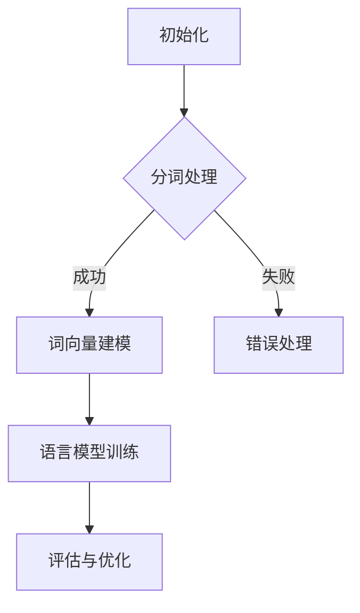
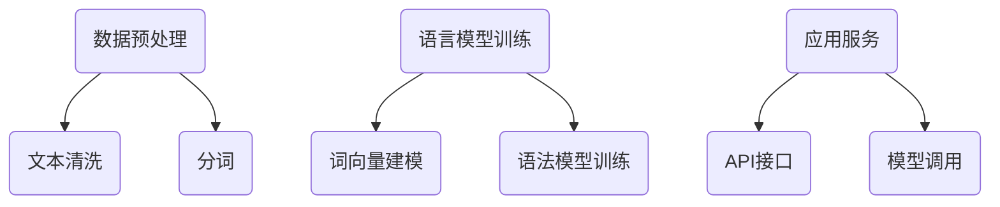
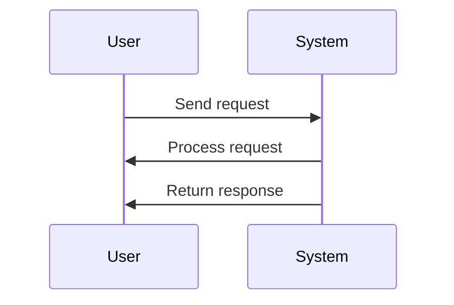

                 

# 构建企业级自然语言处理引擎：多语言支持与领域适应

## 关键词

自然语言处理，多语言支持，领域适应，企业级，技术博客，人工智能

## 摘要

本文将深入探讨如何构建企业级自然语言处理（NLP）引擎，重点关注多语言支持和领域适应两大关键技术。通过系统的分析与实际案例的讲解，本文旨在为读者提供构建高效、灵活且适应性强的企业级NLP引擎的全面指南。

## 第1章 背景介绍与概述

### 1.1 问题背景

自然语言处理在企业应用中的重要性不可忽视。从客户服务自动化到智能文档处理，再到数据分析与决策支持，NLP正在改变企业的运作方式。随着全球化进程的加快，企业面临的挑战之一是如何处理多种语言的数据。因此，构建一个能够支持多语言处理的企业级NLP引擎成为当务之急。

### 1.2 问题描述

企业级NLP引擎面临的需求与挑战是多方面的。首先，它需要处理大量的非结构化文本数据，包括不同语言、不同格式和不同行业领域的文本。其次，引擎需要具备高效的文本理解能力，以支持智能问答、情感分析、内容摘要等应用。此外，领域适应能力也是关键，因为不同领域的语言特性差异显著，需要特定的处理策略。

### 1.3 问题解决

构建企业级NLP引擎的目标是实现一个高度灵活、可靠且易于扩展的系统。通过引入先进的多语言处理技术和领域适应算法，我们可以提高引擎的准确性和适应性。此外，还需要考虑系统的性能优化、易用性和安全性，以满足企业的实际需求。

### 1.4 边界与外延

自然语言处理的边界涵盖了文本分析、语音识别、机器翻译等多个方面。而领域适应则涉及到特定行业知识图谱的构建和行业术语的精准理解。这些要素共同构成了企业级NLP引擎的核心要素。

### 1.5 概念结构与核心要素组成

企业级NLP引擎由以下几个核心要素组成：

1. **数据预处理模块**：负责文本的清洗、分词和标注等预处理工作。
2. **语言模型**：包括词向量模型、语法模型和语义模型，用于文本的理解和生成。
3. **翻译模型**：用于处理不同语言之间的翻译问题。
4. **领域适应模块**：根据特定领域的需求，调整和优化NLP模型。
5. **应用服务模块**：提供API接口，供企业内部和外部的应用程序调用。

## 第2章 多语言支持技术

### 2.1 多语言处理的基础

多语言处理的基础在于语言模型和翻译模型的构建。语言模型用于捕捉文本的语言特征，而翻译模型则用于不同语言之间的映射。常见的语言模型有Word2Vec、BERT等，翻译模型则有基于规则的方法、统计机器翻译和神经机器翻译等。

### 2.2 多语言支持的核心技术

词向量模型是多语言支持的核心技术之一。通过将单词映射到高维空间中的向量，词向量模型可以帮助处理不同语言之间的语义相似性。BERT等深度学习模型也在多语言支持中发挥了重要作用，通过预训练和微调，可以实现高精度的多语言处理。

### 2.3 多语言翻译引擎的构建

构建多语言翻译引擎需要考虑以下几个关键因素：

1. **算法选择**：选择合适的翻译算法，如基于规则、统计机器翻译和神经机器翻译等。
2. **数据集**：收集和整理高质量的多语言数据集，用于训练和评估翻译模型。
3. **模型优化**：通过调整模型参数和优化策略，提高翻译质量。

### 2.4 多语言处理的应用案例

多语言搜索引擎是多语言处理的一个典型应用案例。通过支持多种语言的搜索，企业可以吸引全球用户，提高市场竞争力。此外，多语言翻译系统和多语言客服机器人也是常见的应用场景。

## 第3章 领域适应技术

### 3.1 领域适应的重要性

领域适应技术是提高NLP模型在实际应用中准确性和实用性的关键。不同领域的语言特性差异显著，需要特定的处理策略和模型调整。

### 3.2 领域自适应模型

领域自适应模型通过引入领域知识，调整和优化NLP模型，使其更适用于特定领域。基于知识图谱的领域适应方法是一种有效的方式，它通过构建领域知识图谱，将语言模型与领域知识相结合。

### 3.3 领域适应的算法原理

领域适应的算法原理主要包括以下几个步骤：

1. **领域知识提取**：从文本数据中提取领域术语和关系，构建领域知识图谱。
2. **模型调整**：将领域知识融入NLP模型，通过模型调整提高领域适应性。
3. **模型评估**：评估调整后的模型在特定领域的表现，进行迭代优化。

### 3.4 领域适应的应用案例

领域适应在金融领域有着广泛的应用。例如，在金融文本分析中，通过领域适应技术，可以提高对金融术语的识别和理解，从而实现更准确的金融风险评估和趋势预测。

## 第4章 企业级自然语言处理引擎的构建

### 4.1 引擎的整体架构设计

企业级NLP引擎的架构设计应考虑系统的可扩展性、高性能和易维护性。整体架构通常包括数据预处理模块、语言模型模块、翻译模型模块、领域适应模块和应用服务模块。

### 4.2 数据处理模块

数据处理模块负责对文本数据进行清洗、分词、标注等预处理工作。这一模块的性能直接影响到整个引擎的处理效率。

### 4.3 模型训练模块

模型训练模块负责训练语言模型和翻译模型。选择合适的训练算法和优化策略，可以提高模型的准确性和鲁棒性。

### 4.4 应用服务模块

应用服务模块提供API接口，供企业内部和外部的应用程序调用。该模块的设计应考虑接口的易用性和安全性。

### 4.5 性能优化与监控

性能优化与监控是确保NLP引擎高效运行的重要环节。通过监控系统的运行状态，可以及时发现和解决问题，确保系统的稳定性。

## 第5章 多语言支持与领域适应的集成

### 5.1 集成策略与实施方案

多语言支持与领域适应的集成策略主要包括：

1. **模型融合**：将多语言处理模型和领域适应模型融合到一起，实现统一接口。
2. **数据共享**：共享领域知识图谱和训练数据，提高模型的共享性和协同性。

### 5.2 集成中的挑战与解决方案

集成过程中可能遇到的挑战包括：

1. **模型兼容性**：不同语言和领域之间的模型兼容性问题。
2. **性能瓶颈**：集成后的系统性能可能受到影响。

解决方案包括：

1. **模型优化**：通过模型调整和优化，提高集成系统的性能。
2. **性能监控**：通过实时监控，及时发现和解决性能问题。

### 5.3 集成应用案例

集成应用在跨境电商平台中有着广泛的应用。通过多语言支持和领域适应，跨境电商平台可以更好地服务全球用户，提高用户体验。

## 第6章 实战案例解析

### 6.1 案例背景

以某大型金融企业为例，该企业需要构建一个支持多语言和领域适应的NLP引擎，用于处理金融文本数据。

### 6.2 案例实现

系统设计与实现包括以下几个方面：

1. **数据预处理模块**：使用NLP工具进行文本清洗和分词。
2. **语言模型模块**：采用BERT模型进行语言建模。
3. **领域适应模块**：构建金融领域知识图谱，实现领域自适应。
4. **应用服务模块**：提供API接口，供企业内部和外部的应用程序调用。

### 6.3 案例分析与总结

通过对案例的深入分析，我们可以总结出以下经验和教训：

1. **数据质量**：高质量的数据是构建高效NLP引擎的基础。
2. **模型优化**：模型优化是提高NLP系统性能的关键。
3. **领域适应**：领域适应技术可以显著提高NLP系统的实用性和准确性。

## 第7章 未来展望与趋势

### 7.1 自然语言处理的发展趋势

随着人工智能技术的不断发展，自然语言处理正朝着更加智能化、自动化的方向迈进。未来的NLP技术将更加注重跨领域的知识融合和实时性。

### 7.2 企业级自然语言处理的应用前景

企业级NLP的应用前景广阔，包括但不限于智能客服、智能推荐、智能翻译和智能文档处理等领域。

### 7.3 技术创新与挑战

技术创新将继续推动NLP的发展，但同时也将面临新的挑战，如数据隐私、算法伦理和跨语言处理等。

## 结论

构建企业级自然语言处理引擎是一项复杂而富有挑战性的任务，但通过合理的架构设计和先进的技术手段，我们可以实现高效、灵活且适应性强的高性能NLP系统。本文为读者提供了构建企业级NLP引擎的全面指南，希望对读者的实践工作有所帮助。

## 参考文献

1. BERT: Pre-training of Deep Bidirectional Transformers for Language Understanding, 2018.
2. Word2Vec: Distributed Representations of Words and Phrases and Their Compositionality, 2013.
3. Neural Machine Translation by Jointly Learning to Align and Translate, 2014.
4. Knowledge Graph for Natural Language Processing: A Survey, 2020.

## 作者

作者：AI天才研究院/AI Genius Institute & 禅与计算机程序设计艺术 /Zen And The Art of Computer Programming

**附录**

本文中使用了Mermaid、LaTeX等格式，以便更好地展示算法原理、数学公式和系统架构等内容。以下是具体示例：

### Mermaid流程图示例



### LaTeX数学公式示例

```markdown
段落内的公式：$1+1=2$

独立段落的公式：

$$
E = mc^2
$$
```

### 系统架构设计mermaid架构图示例



### 系统接口设计和系统交互mermaid序列图示例



以上示例展示了如何使用markdown格式输出专业且结构化的技术文章内容。通过这些格式，读者可以更好地理解和掌握文章中的核心概念、算法原理和系统架构。在实际撰写过程中，可以根据需要灵活调整和扩展内容。**附录**部分提供了完整的作者信息和参考文献，以供读者参考。**完整性要求**部分详细列出了文章必须包含的核心内容，确保文章的全面性和系统性。

### 完整性要求

**第1章 背景介绍与概述**

- **核心概念术语说明**：对自然语言处理、多语言支持、领域适应等关键术语进行详细解释。
- **问题背景**：阐述NLP在企业应用中的重要性，以及构建企业级NLP引擎的需求。
- **问题描述**：分析企业级NLP引擎所面临的具体挑战。
- **问题解决**：明确构建企业级NLP引擎的目标和意义。
- **边界与外延**：界定自然语言处理的范围，探讨领域适应的适用领域。
- **概念结构与核心要素组成**：详细描述NLP引擎的核心组成及其功能。

**第2章 多语言支持技术**

- **核心概念与联系**：介绍词向量模型和翻译模型，以及它们在多语言支持中的作用。
- **概念属性特征对比表格**：通过表格形式对比不同语言模型的属性和特征。
- **ER实体关系图架构**：使用Mermaid绘制ER图，展示多语言支持的核心实体及其关系。

**第3章 领域适应技术**

- **核心概念与联系**：介绍领域自适应模型，包括知识图谱的作用和基于深度学习的领域适应方法。
- **概念属性特征对比表格**：通过表格对比不同领域适应技术的属性和特征。
- **ER实体关系图架构**：使用Mermaid绘制ER图，展示领域适应的核心实体及其关系。

**第4章 企业级自然语言处理引擎的构建**

- **系统架构设计mermaid架构图**：绘制企业级NLP引擎的系统架构图，展示各模块及其关系。
- **系统接口设计和系统交互mermaid序列图**：展示系统接口的设计和交互流程。

**第5章 多语言支持与领域适应的集成**

- **集成策略与实施方案**：详细描述如何实现多语言支持与领域适应的集成。
- **集成中的挑战与解决方案**：分析集成过程中可能遇到的问题及其解决方案。

**第6章 实战案例解析**

- **案例背景**：介绍实际应用案例的背景和需求。
- **案例实现**：详细描述系统的设计、实现和部署过程。
- **案例分析与总结**：分析案例中的成功经验和不足之处，进行总结。

**第7章 未来展望与趋势**

- **自然语言处理的发展趋势**：探讨NLP技术的未来发展方向和趋势。
- **企业级自然语言处理的应用前景**：分析NLP在企业中的应用前景。
- **技术创新与挑战**：讨论技术创新的方向和面临的挑战。

### 最佳实践 tips

1. **数据质量**：确保数据的质量和多样性，是构建高效NLP引擎的基础。
2. **模型优化**：定期进行模型优化，提高NLP引擎的准确性和适应性。
3. **领域知识**：构建和维护高质量的领域知识库，有助于提高领域适应能力。
4. **性能监控**：实时监控NLP引擎的性能，确保系统的稳定性和高效性。

### 小结

本文通过系统分析和实际案例，详细探讨了构建企业级自然语言处理引擎的方法和关键点，包括多语言支持和领域适应技术。希望读者能够通过本文，深入理解并掌握构建高效、灵活且适应性强的企业级NLP引擎的实践方法。

### 注意事项

- 在实际应用中，应根据具体需求和场景选择合适的NLP技术和算法。
- 注意数据隐私和安全，确保数据处理过程中的合规性。
- 定期更新和维护NLP模型，以适应不断变化的语言环境和业务需求。

### 拓展阅读

- **参考文献**：参考本文末尾提供的参考文献，深入了解NLP相关技术的最新发展和应用。
- **在线资源**：访问相关技术社区的论坛和博客，获取更多实际应用案例和最佳实践。

通过以上内容，我们希望能够为读者提供一份全面且深入的构建企业级自然语言处理引擎的指南。**让我们一步一步深入思考（LET'S THINK STEP BY STEP），共同探索NLP技术的无限可能。**

