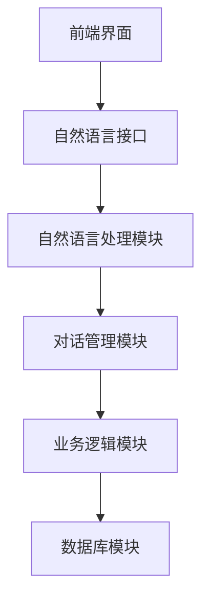

                 

### 引言

#### 1.1 自然语言接口的重要性

在当今信息化时代，企业和组织面临的信息处理需求日益复杂。传统的人机交互方式，如图形用户界面（GUI）和命令行界面（CLI），在处理大规模数据和复杂的业务逻辑时显得力不从心。而自然语言接口作为一种新兴的人机交互方式，以其自然、便捷、高效的特点逐渐成为企业级系统的重要选择。

自然语言接口允许用户通过自然语言（如日常用语、命令或查询）与系统进行交互，从而实现快速、准确的业务处理。这种交互方式不仅提高了用户体验，还降低了用户的学习成本和操作复杂度。例如，用户可以通过简单的语音命令控制智能家居设备，或者通过自然语言查询获取企业内部数据信息。这种灵活的交互方式极大地提升了系统的可用性和易用性。

#### 1.2 企业级系统的复杂性与挑战

企业级系统通常涉及到复杂的业务逻辑、庞大的数据规模和高并发的用户访问。在这样的背景下，构建一个高效、稳定且易于扩展的自然语言接口面临诸多挑战：

1. **数据理解与处理能力**：企业级系统需要处理来自不同渠道的海量数据，这些数据可能包含各种复杂的结构，如文本、图像、音频和视频等。自然语言接口需要具备强大的数据处理能力，以准确理解并处理这些数据。

2. **业务流程的适应性**：企业级系统通常具有复杂的业务流程，自然语言接口需要能够灵活适应这些流程，提供准确的交互体验。这意味着自然语言接口不仅要理解用户的意图，还需要能够在不同的业务场景中实现有效的任务执行。

3. **性能与稳定性**：企业级系统要求自然语言接口具备高并发处理能力，确保在大量用户同时访问时系统的性能和稳定性。同时，接口的设计还需考虑系统的可扩展性和可维护性，以应对不断变化的需求。

4. **安全性与隐私保护**：企业级系统的数据通常包含敏感信息，自然语言接口在处理这些数据时需要确保安全性和隐私保护，防止数据泄露或滥用。

#### 1.3 构建企业级自然语言接口的必要性

面对企业级系统的复杂性和挑战，构建一个高效、智能的自然语言接口变得尤为必要。以下是构建企业级自然语言接口的几个关键原因：

1. **提升用户体验**：自然语言接口提供了一种更加直观和便捷的交互方式，使用户可以更轻松地与系统进行沟通，从而提高用户满意度和使用频率。

2. **提高工作效率**：自然语言接口能够快速理解用户的意图，减少用户在操作过程中的等待时间，提高工作效率。特别是在处理复杂任务和批量操作时，自然语言接口的优势更为明显。

3. **降低操作成本**：自然语言接口减少了用户对专业知识和操作技能的要求，降低了培训成本和用户操作难度，使得更多的用户能够轻松使用企业级系统。

4. **增强业务灵活性**：自然语言接口能够灵活适应各种业务场景，支持自定义命令和查询，满足不同业务需求。这有助于企业快速响应市场变化，提升业务灵活性。

5. **提高数据安全性**：自然语言接口通过加密和身份验证等安全措施，确保用户数据在传输和存储过程中的安全性，降低数据泄露风险。

综上所述，构建企业级自然语言接口不仅能够提升用户体验和工作效率，还能够增强系统的业务灵活性和安全性。在未来的信息化时代，自然语言接口将成为企业级系统不可或缺的一部分。接下来，我们将深入探讨自然语言处理技术及其在企业级系统中的应用，为构建高效智能的自然语言接口提供理论支持和实践指导。

#### 2. 背景知识

#### 2.1 自然语言处理基础

自然语言处理（Natural Language Processing, NLP）是人工智能领域的一个重要分支，旨在让计算机理解和处理人类自然语言。NLP的基本概念包括文本预处理、语言模型、词向量表示、词性标注、命名实体识别、语义分析、情感分析和对话系统等。

- **文本预处理**：文本预处理是NLP的第一步，包括分词、词干提取、停用词过滤等操作，旨在将原始文本转换为适合后续处理的形式。

- **语言模型**：语言模型用于预测下一个单词或词组，是NLP的核心技术之一。常见的语言模型包括n-gram模型和神经网络模型（如循环神经网络RNN和变换器模型Transformer）。

- **词向量表示**：词向量表示将单词映射为向量，用于捕捉单词的语义信息。常见的词向量模型包括Word2Vec、GloVe和BERT等。

- **词性标注**：词性标注是对文本中的每个词进行词性分类，如名词、动词、形容词等。词性标注有助于更准确地理解文本内容。

- **命名实体识别**：命名实体识别（Named Entity Recognition, NER）是从文本中识别出具有特定意义的实体，如人名、地名、组织名等。

- **语义分析**：语义分析旨在理解文本中的语义关系，如实体关系抽取、语义角色标注等。

- **情感分析**：情感分析用于判断文本的情感倾向，如正面、负面或中性。

- **对话系统**：对话系统是一种交互式系统，能够理解用户的问题并生成相应的回答。常见的对话系统包括基于规则和基于机器学习的系统。

#### 2.2 企业级系统架构

企业级系统通常具有复杂的架构，包括多个模块和子系统，以支持各种业务需求。以下是企业级系统架构的几个关键组成部分：

- **前端界面**：前端界面是企业级系统与用户交互的主要渠道，包括图形用户界面（GUI）和自然语言接口（NLI）等。

- **后端服务**：后端服务负责处理业务逻辑和数据存储，包括应用服务器、数据库服务器、消息队列等。

- **数据存储**：数据存储是企业级系统的基础，包括关系型数据库（如MySQL、PostgreSQL）和非关系型数据库（如MongoDB、Cassandra）等。

- **中间件**：中间件用于连接前端和后端，实现数据传输和业务流程的协调，如Web服务器（如Apache、Nginx）和消息队列（如RabbitMQ、Kafka）等。

- **业务模块**：业务模块是支持企业具体业务的模块，如订单管理、库存管理、财务管理等。

#### 2.3 智能交互层的关键角色

智能交互层是连接用户和企业级系统的桥梁，其核心目标是提供一种自然、便捷的交互方式，使用户能够高效地完成任务。智能交互层的关键角色包括：

- **自然语言理解**：智能交互层需要能够理解用户的自然语言输入，包括文本和语音等，并将其转换为系统可处理的格式。

- **意图识别**：通过自然语言理解，智能交互层需要识别用户的意图，如查询信息、执行操作等。

- **任务执行**：智能交互层根据识别到的意图，调用相应的业务模块，执行具体的任务。

- **反馈与优化**：智能交互层需要实时反馈任务执行结果，并根据用户的反馈进行优化，以提高交互质量和用户体验。

- **安全性与隐私保护**：智能交互层需要确保用户数据的安全性，包括加密传输、身份验证和数据加密存储等。

通过深入理解自然语言处理基础和企业级系统架构，我们可以更好地构建智能交互层，为企业提供高效、智能的交互体验。在下一部分，我们将探讨智能交互层的具体设计原则和实现技术，为构建企业级自然语言接口提供详细指导。

### 3. 目标与内容

#### 3.1 书籍目标

本书的目标是系统性地介绍构建企业级自然语言接口的方法和最佳实践，旨在帮助读者深入理解自然语言处理技术及其在企业级系统中的应用。具体目标如下：

1. **理论讲解**：通过详细的理论讲解，帮助读者掌握自然语言处理的基础知识，包括语言模型、词向量表示、词性标注、命名实体识别、语义分析和情感分析等。

2. **实践指导**：结合实际项目案例，介绍如何设计和实现企业级自然语言接口，包括API设计、交互模型、对话系统、业务系统集成等。

3. **技术选型**：分析并比较不同自然语言处理技术和框架的优缺点，帮助读者根据实际需求选择合适的技术方案。

4. **优化策略**：提供性能优化、安全性和隐私保护等最佳实践，帮助读者构建高效、稳定且安全的自然语言接口。

5. **案例分析**：通过真实项目案例，展示自然语言接口在实际业务系统中的应用效果，为读者提供实用的参考和借鉴。

#### 3.2 内容结构

本书分为六个主要部分，每个部分都围绕构建企业级自然语言接口的主题展开：

- **第一部分：引言与背景**：介绍自然语言接口的重要性、企业级系统的复杂性与挑战，以及构建企业级自然语言接口的必要性。

- **第二部分：自然语言处理技术**：详细讲解自然语言处理的基础知识，包括语言模型、词向量表示、词性标注、命名实体识别、语义分析和情感分析等。

- **第三部分：构建自然语言接口**：探讨自然语言接口的设计原则、接口实现技术、智能对话系统等。

- **第四部分：智能交互层在业务系统中的应用**：介绍智能交互层在业务系统中的应用，包括业务系统介绍、智能交互层设计、核心实现等。

- **第五部分：项目实战与案例分析**：通过实际项目环境和案例，展示自然语言接口的构建过程、核心实现、项目测试与优化等。

- **第六部分：最佳实践与展望**：总结最佳实践经验，探讨未来智能交互层的发展趋势和改进方向。

本书内容结构清晰、逻辑严密，通过理论与实践相结合的方式，帮助读者全面了解并掌握构建企业级自然语言接口的技能和方法。接下来，我们将深入探讨自然语言处理技术，为构建高效智能的自然语言接口奠定基础。

### 4. 自然语言处理基础

#### 4.1 语言模型

语言模型（Language Model）是自然语言处理（NLP）的核心组成部分，它用于预测文本序列中下一个单词或词组。语言模型在许多NLP任务中扮演关键角色，包括机器翻译、文本生成、语音识别和自动摘要等。

**4.1.1 语言模型的概念**

语言模型是一种概率模型，用于表示自然语言中的概率分布。具体来说，语言模型计算一个句子或单词序列的概率，形式为：

\[ P(w_1, w_2, ..., w_n) = P(w_1) \times P(w_2|w_1) \times P(w_3|w_1, w_2) \times ... \times P(w_n|w_1, w_2, ..., w_{n-1}) \]

其中，\( w_i \) 表示文本序列中的第 \( i \) 个单词。语言模型的目标是最大化整个序列的概率，从而生成最可能的文本序列。

**4.1.2 语言模型类型**

语言模型主要分为两类：基于规则的模型和基于统计的模型。

1. **基于规则的模型**：这类模型通过定义一系列语法规则和语义规则来生成文本。常见的基于规则的语言模型包括上下文无关文法（CFG）和依存语法（Dependency Grammar）。

2. **基于统计的模型**：这类模型通过分析大量文本数据来学习语言模式。基于统计的模型包括n-gram模型、马尔可夫模型（Markov Model）和神经网络模型（如循环神经网络RNN和变换器模型Transformer）。

**4.1.3 语言模型应用**

语言模型在NLP中有广泛的应用，以下是一些典型场景：

1. **文本生成**：语言模型可以生成各种文本，如文章、对话、摘要等。例如，基于Transformer的GPT-3模型可以生成高质量的文本内容。

2. **语音识别**：语言模型用于语音识别系统的解码阶段，帮助将语音信号转换为文本。

3. **机器翻译**：语言模型用于生成目标语言的文本，是机器翻译系统中的核心组件。常见的机器翻译模型如基于n-gram的统计机器翻译（SMT）和基于神经网络的端到端机器翻译（NMT）。

4. **文本摘要**：语言模型可以帮助生成摘要，提取文本的主要内容和关键信息。例如，Summarizer模型可以用于自动生成新闻摘要。

通过理解语言模型的概念、类型和应用，我们可以更好地利用语言模型解决实际中的NLP问题，为构建企业级自然语言接口提供理论基础。

#### 4.2 词向量表示

词向量表示（Word Vector Representation）是将单词映射为高维向量的一种技术，旨在捕捉单词的语义信息。词向量表示在自然语言处理（NLP）中发挥着重要作用，广泛应用于文本分类、情感分析、机器翻译、文本相似度计算等领域。

**4.2.1 词向量表示的概念**

词向量表示将单词转换为实数向量，这些向量在多维空间中表示单词的语义特征。词向量不仅保留了单词的语法和句法信息，还能够捕捉单词的语义关系。例如，相似的单词在向量空间中距离较近，而意义迥异的单词则距离较远。

**4.2.2 词向量表示方法**

常见的词向量表示方法包括基于统计的方法和基于神经网络的方法。

1. **基于统计的方法**：这类方法通过统计单词在语料库中的共现关系来学习词向量。常见的基于统计的词向量表示方法包括：

   - **Count-based 方法**：如TF-IDF（Term Frequency-Inverse Document Frequency），通过计算单词在文档中的频率和逆向文档频率来表示词向量。

   - **Distribution-based 方法**：如LSA（Latent Semantic Analysis）和PLSA（Probabilistic Latent Semantic Analysis），通过潜在语义分析来学习词向量。

2. **基于神经网络的方法**：这类方法通过深度学习模型来学习词向量，能够更好地捕捉单词的语义信息。常见的基于神经网络的方法包括：

   - **Word2Vec**：通过神经网络训练大量文本数据，生成词向量。Word2Vec包括两种模型：连续词袋（CBOW）和Skip-gram。

   - **GloVe（Global Vectors for Word Representation）**：通过矩阵分解方法学习全局的词向量表示，能够更好地捕捉单词的语义关系。

   - **BERT（Bidirectional Encoder Representations from Transformers）**：通过双向变换器模型生成词向量，能够捕捉上下文信息。

**4.2.3 词向量在自然语言处理中的应用**

词向量在NLP中有广泛的应用，以下是一些典型场景：

1. **文本分类**：词向量可以用于文本分类任务，通过计算文本向量和类别向量的相似度，实现文本的自动分类。

2. **情感分析**：词向量可以帮助识别文本的情感倾向，通过计算情感词的词向量平均值，判断文本的情感极性。

3. **机器翻译**：词向量可以用于机器翻译中的词向量化阶段，通过训练大量平行语料库，学习源语言和目标语言的词向量映射关系。

4. **文本相似度计算**：词向量可以用于计算文本的相似度，通过计算文本向量的余弦相似度，判断文本内容的相关性。

5. **推荐系统**：词向量可以用于推荐系统，通过计算用户和商品（或文本）的词向量相似度，实现个性化推荐。

通过词向量表示，我们可以将抽象的文本信息转换为数值化的向量，从而利用机器学习算法进行高效处理。词向量表示是NLP中的关键技术之一，为构建企业级自然语言接口提供了重要的基础支持。

#### 4.3 词性标注与命名实体识别

词性标注（Part-of-Speech Tagging）和命名实体识别（Named Entity Recognition, NER）是自然语言处理（NLP）中的重要任务，用于理解和解析文本的结构和内容。

**4.3.1 词性标注的概念**

词性标注是对文本中的每个词进行词性分类的过程，如名词、动词、形容词、副词等。词性标注有助于更准确地理解文本语义，是许多NLP任务的基础。例如，在问答系统、信息提取和机器翻译中，词性标注可以帮助确定词语的功能和意义。

**4.3.2 命名实体识别的概念**

命名实体识别是从文本中识别出具有特定意义的实体，如人名、地名、组织名、时间等。命名实体识别是信息提取和知识图谱构建的重要步骤。通过NER，我们可以从大量文本中提取关键信息，构建语义丰富的知识库。

**4.3.3 实际应用**

词性标注和命名实体识别在NLP中有广泛的应用：

1. **问答系统**：在问答系统中，词性标注和NER有助于理解用户的问题，提取关键信息，从而提供准确的答案。

2. **信息提取**：在新闻、报告等文本中，NER可以用于提取关键信息，如事件、地点、人物等，用于快速浏览和摘要。

3. **情感分析**：词性标注可以帮助识别文本中的情感词，结合NER提取的实体信息，进行情感分析和情绪判断。

4. **机器翻译**：词性标注和NER有助于提高机器翻译的质量，通过识别和保持文本中的词性和实体信息，实现更自然的翻译结果。

5. **文本分类**：在文本分类任务中，词性标注和NER可以帮助构建更细粒度的特征，提高分类的准确性和效果。

通过词性标注和命名实体识别，我们可以更好地理解文本的语义结构，为构建智能交互层提供关键支持。这些技术在自然语言处理中的实际应用，使得文本信息处理更加准确和高效。

#### 4.4 语义分析

语义分析（Semantic Analysis）是自然语言处理（NLP）中的一个核心任务，旨在理解文本中的深层语义信息，包括词义、句子意义和语义关系。语义分析不仅能够提高文本处理的质量，还能为各种应用场景提供重要的支持，如问答系统、信息抽取、机器翻译和情感分析。

**4.4.1 语义分析基础**

语义分析的核心目标是理解文本中的词义和句子意义，捕捉词语之间的关系。在语义分析中，常见的任务包括语义角色标注、实体关系抽取和语义角色标注等。

1. **语义角色标注**：语义角色标注是对句子中的每个词进行语义角色分类的过程，如主语、谓语、宾语、定语等。语义角色标注有助于理解句子的结构和语义，是实现语义分析和文本生成的重要步骤。

2. **实体关系抽取**：实体关系抽取是从文本中识别出实体之间的语义关系，如人物关系、组织关系和地点关系等。实体关系抽取是构建知识图谱和语义网的重要基础。

3. **语义分析模型**：语义分析通常依赖于深度学习模型，如变换器（Transformer）模型、循环神经网络（RNN）和图神经网络（Graph Neural Networks, GNN）等。这些模型能够捕捉词语和句子之间的复杂语义关系，实现高效的语义分析。

**4.4.2 实体关系抽取**

实体关系抽取是语义分析中的重要任务，旨在从文本中识别出实体之间的语义关系。实体关系抽取通常包括以下步骤：

1. **实体识别**：首先，从文本中识别出关键实体，如人名、地名、组织名等。实体识别是实体关系抽取的基础。

2. **关系分类**：然后，对识别出的实体进行关系分类，确定实体之间的语义关系，如朋友、同事、成员等。

3. **关系建模**：最后，利用深度学习模型，如变换器模型和图神经网络，建立实体之间的关系模型，实现高效的实体关系抽取。

**4.4.3 实际应用**

语义分析在NLP中有广泛的应用，以下是一些典型的应用场景：

1. **问答系统**：语义分析可以帮助问答系统理解用户的问题，提取关键信息，提供准确的答案。

2. **信息抽取**：语义分析可以用于从大量文本中提取关键信息，如事件、地点、人物等，用于信息检索和知识图谱构建。

3. **文本摘要**：语义分析可以帮助生成文本摘要，提取文本的主要内容和关键信息，实现高效的文本压缩。

4. **机器翻译**：语义分析可以提高机器翻译的质量，通过识别和保持文本中的词义和关系，实现更自然的翻译结果。

5. **情感分析**：语义分析可以用于情感分析任务，通过理解文本中的情感表达，判断文本的情感极性和强度。

通过语义分析，我们可以更好地理解文本的深层语义，为各种应用场景提供强大的支持。语义分析是自然语言处理中的重要环节，为构建智能交互层提供了关键的技术基础。

#### 4.5 情感分析

情感分析（Sentiment Analysis）是自然语言处理（NLP）中的一个重要任务，旨在从文本中自动识别和提取情感信息。情感分析广泛应用于市场调研、社交媒体监测、客户反馈分析等领域，通过分析用户的情感倾向和情绪，为企业提供有价值的数据支持。

**4.5.1 情感分析基础**

情感分析的基础是情感极性分类（Sentiment Polarization），即将文本分类为正面、负面或中性。情感极性分类通常通过以下步骤实现：

1. **文本预处理**：对原始文本进行清洗和预处理，包括去除停用词、标点符号、进行词干提取等，以便于后续的文本分析。

2. **特征提取**：将预处理后的文本转换为特征向量，常见的特征提取方法包括词袋模型（Bag of Words, BOW）、TF-IDF和词嵌入（Word Embedding）等。

3. **模型训练**：利用训练数据集，通过机器学习算法（如朴素贝叶斯、支持向量机、神经网络等）训练情感分类模型。

4. **情感极性分类**：将训练好的模型应用于新的文本数据，预测文本的情感极性。

**4.5.2 情感极性分类**

情感极性分类是情感分析的核心任务，通常通过以下方法实现：

1. **基于规则的分类**：基于规则的方法通过预定义的规则和模式匹配来实现情感分类，如使用情感词典、情感短语等。

2. **机器学习方法**：机器学习方法利用训练数据集，通过特征提取和分类算法（如朴素贝叶斯、支持向量机、深度学习等）实现情感分类。

3. **深度学习方法**：深度学习方法，如卷积神经网络（CNN）、循环神经网络（RNN）和变换器（Transformer）等，能够捕捉文本中的复杂情感模式，实现高效的情感分类。

**4.5.3 情感强度分析**

除了情感极性分类，情感分析还包括情感强度分析（Sentiment Intensity Analysis），旨在判断情感的程度。情感强度分析通常通过以下方法实现：

1. **情感标签扩展**：在情感分类的基础上，对情感标签进行扩展，如正面情感分为“非常正面”、“较正面”和“一般正面”等。

2. **情感评分系统**：使用评分系统（如0-10分制）对情感强度进行量化，以便更精确地衡量情感程度。

3. **情感强度预测模型**：利用深度学习模型，如长短期记忆网络（LSTM）和变换器（Transformer）等，预测文本的情感强度。

通过情感分析和情感强度分析，我们可以从大量文本数据中提取情感信息，为市场调研、客户反馈分析和舆情监控等提供支持。情感分析不仅能够帮助企业了解用户的情感倾向，还能为个性化推荐、品牌管理等提供决策依据。

#### 7. 自然语言接口设计原则

自然语言接口（Natural Language Interface, NLI）的设计原则是确保系统能够高效、准确地理解用户输入，并提供满意的交互体验。以下是一些关键的设计原则：

**7.1 用户友好的交互界面**

用户友好的交互界面是自然语言接口成功的关键。设计原则包括：

1. **简洁性**：界面应简洁明了，避免不必要的复杂操作和冗余信息，确保用户能够轻松上手。

2. **一致性**：界面应保持一致性，使用相同的语言和词汇，减少用户的学习成本。

3. **可访问性**：界面设计应考虑不同用户的访问需求，包括视力障碍者、听力障碍者等，确保所有用户都能顺畅使用。

4. **反馈机制**：界面应提供及时的反馈，帮助用户了解系统处理结果，如确认信息、错误提示和操作指引等。

**7.2 可扩展性与适应性**

自然语言接口需要具备良好的可扩展性和适应性，以应对不断变化的业务需求和用户习惯。设计原则包括：

1. **模块化**：将接口设计为模块化结构，便于功能的添加、修改和替换，提高系统的灵活性和可维护性。

2. **灵活性**：接口应支持多种输入方式，如文本、语音和手势等，以满足不同用户的需求。

3. **多语言支持**：接口应支持多语言，便于国际化应用，吸引更多用户。

4. **可配置性**：接口设计应支持可配置性，如命令和查询模式、交互流程等，以便根据不同场景进行调整。

**7.3 性能优化与稳定性**

性能优化和稳定性是自然语言接口的关键设计原则，确保系统能够高效、稳定地运行。设计原则包括：

1. **高效性**：接口应具备快速响应能力，确保用户在输入后能够迅速得到反馈。

2. **并发处理**：接口应支持高并发处理，确保在大量用户同时访问时，系统能够保持稳定运行。

3. **容错性**：接口设计应具备良好的容错性，能够自动处理异常情况，如输入错误、网络故障等。

4. **扩展性**：接口设计应考虑未来的扩展需求，如增加新的功能、支持更大的数据规模等。

通过遵循这些设计原则，自然语言接口能够提供更高效、更稳定的交互体验，为用户和企业级系统带来更大的价值。在下一部分，我们将深入探讨自然语言接口的具体实现技术，为构建高效智能的自然语言接口提供详细指导。

#### 8. 接口实现技术

自然语言接口（NLI）的实现技术是构建高效智能交互层的关键。以下是几种主要的接口实现技术：

**8.1 API设计与实现**

API（应用程序编程接口）是自然语言接口的核心组成部分，负责接收用户输入并调用相应的后端服务。以下是API设计与实现的关键点：

1. **API设计原则**：API设计应遵循RESTful设计原则，包括状态化、简洁性、一致性、可扩展性等。RESTful API通过HTTP请求方法（如GET、POST、PUT、DELETE）实现资源的操作。

2. **RESTful API实现**：RESTful API实现应包括资源定义、URL设计、请求和响应格式等。常用的响应格式包括JSON和XML。

3. **GraphQL API实现**：GraphQL是一种查询语言，允许客户端指定所需的数据，从而提高查询效率和灵活性。GraphQL API设计应包括类型定义、查询语法的编写等。

**8.2 交互模型**

交互模型是自然语言接口与用户之间的交互方式，主要包括命令式交互、查询式交互和对话式交互。

1. **命令式交互**：命令式交互是一种基于命令的交互方式，用户通过输入命令来执行特定操作。例如，用户可以输入“创建订单”来创建一个新的订单。

2. **查询式交互**：查询式交互是一种基于查询的交互方式，用户通过输入查询语句来获取所需信息。例如，用户可以输入“查询库存”来获取当前库存信息。

3. **对话式交互**：对话式交互是一种基于对话的交互方式，系统能够与用户进行自然对话，理解用户的意图并提供相应的回答。对话式交互通常应用于智能客服、虚拟助手等场景。

**8.3 智能对话系统**

智能对话系统（Conversational AI）是一种结合自然语言处理和机器学习技术的交互系统，能够与用户进行自然对话。智能对话系统的主要组成部分包括：

1. **对话管理**：对话管理负责维护对话状态，处理用户输入并生成响应。对话管理通常包括意图识别、实体抽取、对话策略等。

2. **对话生成**：对话生成负责生成自然、连贯的对话内容。常见的对话生成方法包括模板匹配、规则推理和生成式模型（如序列到序列模型、生成对抗网络等）。

通过API设计与实现、交互模型和智能对话系统的结合，自然语言接口能够提供高效、智能的交互体验，满足企业级系统的多样化需求。在下一部分，我们将探讨智能交互层在业务系统中的应用，展示其在实际业务场景中的具体实现。

#### 9. 智能对话系统

智能对话系统（Conversational AI）是一种集成了自然语言处理（NLP）、机器学习（ML）和人工干预技术的交互系统，能够与用户进行自然、流畅的对话。智能对话系统在提升用户体验、自动化业务流程和增强客户服务等方面具有重要意义。

**9.1 对话系统概述**

对话系统可以分为以下几类：

1. **基于规则的对话系统**：这种系统通过预定义的规则和流程来处理用户输入，适用于结构化、规则明确的应用场景。例如，自动客服系统。

2. **基于机器学习的对话系统**：这种系统通过训练模型来自动识别用户的意图和提取实体信息，适用于复杂、多样化的对话场景。常见的机器学习模型包括朴素贝叶斯、支持向量机和变换器（Transformer）等。

3. **混合型对话系统**：这种系统结合了基于规则和基于机器学习的方法，通过人工干预和自动化技术实现更高效的对话处理。

**9.2 对话管理**

对话管理是智能对话系统的核心组成部分，负责维护对话状态和控制对话流程。对话管理的主要任务包括：

1. **意图识别**：意图识别是从用户输入中提取对话意图的过程，如询问天气、查询订单状态等。

2. **实体抽取**：实体抽取是从用户输入中提取关键信息（如人名、地点、时间等）的过程，用于后续的对话生成和任务执行。

3. **对话状态追踪**：对话状态追踪是记录对话过程中的关键信息，如用户意图、上下文和历史记录，用于生成后续的对话响应。

4. **对话策略**：对话策略是控制对话流程的算法，用于决定何时提供信息、何时询问用户和如何引导对话。常见的对话策略包括模板匹配、上下文感知和生成式对话策略等。

**9.3 对话生成**

对话生成是智能对话系统的关键任务，负责生成自然、连贯的对话内容。对话生成通常包括以下步骤：

1. **输入处理**：将用户输入转换为适合处理的形式，如分词、词性标注和实体抽取等。

2. **意图识别**：利用训练好的模型（如朴素贝叶斯、变换器等）识别用户的意图。

3. **对话规划**：根据用户意图和对话状态生成对话响应。对话规划可以采用模板匹配、规则推理或生成式模型（如序列到序列模型、生成对抗网络等）。

4. **对话优化**：对生成的对话内容进行优化，如去除冗余信息、确保连贯性和自然性等。

通过智能对话系统的对话管理和对话生成，系统能够与用户进行自然、高效的交互，满足用户的多样化需求。在下一部分，我们将探讨智能交互层在具体业务系统中的应用，展示其在实际场景中的实现和效果。

### 10. 业务系统介绍

#### 10.1 业务系统概述

业务系统是企业运营和管理的重要工具，涵盖了从销售、采购、库存管理到客户服务等多个业务领域。一个典型的业务系统通常包括以下主要功能模块：

1. **销售管理**：销售管理系统用于管理销售订单、客户信息、销售策略等，支持销售人员的业务操作。

2. **采购管理**：采购管理系统负责采购订单的创建、供应商管理、库存监控等，确保企业采购活动的顺利进行。

3. **库存管理**：库存管理系统用于监控和管理企业库存水平，包括库存调整、库存预警、库存盘点等功能。

4. **财务管理**：财务管理系统处理企业的财务数据，包括会计账务、成本核算、预算管理、资金流动等。

5. **人力资源**：人力资源管理系统负责员工管理、薪酬福利、招聘培训等，提高人力资源的利用效率。

6. **客户服务**：客户服务系统用于管理客户信息、处理客户咨询和投诉，提供优质的客户服务体验。

#### 10.2 关键业务流程

业务系统的关键业务流程包括以下几个主要环节：

1. **销售流程**：销售流程从客户需求分析开始，经过报价、订单确认、发货和收款等环节，最终实现销售目标。

2. **采购流程**：采购流程包括采购计划制定、供应商选择、采购订单生成、货物验收和支付等环节。

3. **库存管理流程**：库存管理流程包括库存盘点、库存调整、库存预警和库存优化等，确保库存水平合理。

4. **财务管理流程**：财务管理流程涉及会计账务处理、成本核算、预算管理、资金流动和报表生成等。

5. **人力资源管理流程**：人力资源管理流程包括员工招聘、入职培训、绩效评估、薪酬管理和离职处理等。

6. **客户服务流程**：客户服务流程包括客户咨询和投诉处理、客户满意度调查、客户关系管理等。

通过了解业务系统的概述和关键业务流程，我们可以更好地理解业务系统的需求，为构建智能交互层提供依据。接下来，我们将探讨智能交互层的设计和实现，展示如何通过自然语言接口优化业务流程，提升用户体验。

### 11. 智能交互层设计

智能交互层是企业级业务系统中至关重要的组成部分，其设计目标是为用户提供便捷、高效的交互方式，同时满足系统的高性能和稳定性要求。以下是智能交互层设计的几个关键方面：

#### 11.1 系统架构设计

系统架构设计是智能交互层的核心，决定了系统的可扩展性、可靠性和可维护性。智能交互层的系统架构通常包括以下主要模块：

1. **前端界面模块**：负责用户与系统的交互，包括自然语言接口、语音输入输出、图形用户界面（GUI）等。

2. **后端服务模块**：负责处理用户的自然语言输入，调用业务逻辑和数据库，执行具体的业务操作。

3. **自然语言处理模块**：负责对用户输入的自然语言进行处理，包括分词、词性标注、命名实体识别、意图识别和语义分析等。

4. **对话管理模块**：负责维护对话状态，控制对话流程，生成对话响应。

5. **业务逻辑模块**：负责实现业务系统的核心功能，如订单处理、库存管理、客户服务等。

6. **数据库模块**：负责存储用户数据、对话记录和业务数据。

智能交互层的架构设计应遵循模块化原则，确保各模块之间的松耦合，便于功能扩展和维护。以下是智能交互层的一个基本架构设计：



#### 11.2 功能模块划分

智能交互层的功能模块划分决定了系统的模块化水平和灵活性。以下是智能交互层的主要功能模块及其职责：

1. **自然语言接口模块**：负责接收用户输入，支持多种输入方式（如文本、语音、图形等），并提供友好的用户界面。

2. **自然语言处理模块**：负责对用户输入的自然语言进行处理，包括文本预处理、词性标注、命名实体识别、意图识别和语义分析等。

3. **对话管理模块**：负责维护对话状态，识别用户的意图，生成对话响应，确保对话的连贯性和一致性。

4. **业务逻辑模块**：负责实现业务系统的核心功能，如订单处理、库存管理、客户服务等，与后端业务系统紧密集成。

5. **数据库模块**：负责存储用户数据、对话记录和业务数据，支持高效的查询和数据操作。

#### 11.3 技术选型

智能交互层的技术选型决定了系统的性能、稳定性和可扩展性。以下是智能交互层的技术选型建议：

1. **自然语言处理框架**：选择成熟、高效的NLP框架，如NLTK、spaCy、Transformers等，确保自然语言处理任务的准确性和效率。

2. **对话管理引擎**：选择灵活、可扩展的对话管理引擎，如Rasa、ChatterBot等，支持自定义对话流程和意图识别。

3. **后端服务框架**：选择高性能、可扩展的后端服务框架，如Spring Boot、Django等，确保系统的高并发处理能力和稳定性。

4. **数据库系统**：选择适合业务需求的关系型数据库（如MySQL、PostgreSQL）或非关系型数据库（如MongoDB、Cassandra），确保数据的快速存取和高效管理。

通过系统架构设计、功能模块划分和技术选型的合理规划，智能交互层能够高效、稳定地运行，为企业提供优质、便捷的交互体验。

### 12. 核心实现

在构建智能交互层的核心实现过程中，我们需要重点关注自然语言处理模块和自然语言接口模块的实现细节。以下是这些模块的核心实现方法：

#### 12.1 交互层实现细节

**自然语言处理模块**：
自然语言处理模块是智能交互层的核心，负责对用户输入的自然语言进行处理，提取关键信息并理解用户的意图。以下是自然语言处理模块的实现细节：

1. **文本预处理**：首先对用户输入的文本进行预处理，包括分词、去除停用词、标点符号过滤和词干提取等操作。分词是自然语言处理的基础，我们采用分词工具（如jieba）来实现高效的文本分词。

   ```python
   import jieba
   
   def preprocess_text(text):
       words = jieba.lcut(text)
       return [word for word in words if word not in stopwords]
   ```

2. **词性标注和命名实体识别**：接下来，对分词后的文本进行词性标注和命名实体识别，以提取文本中的关键信息。我们采用spaCy库来实现这一功能。

   ```python
   import spacy
   
   nlp = spacy.load("zh_core_web_sm")
   
   def annotate_text(text):
       doc = nlp(text)
       entities = [(ent.text, ent.label_) for ent in doc.ents]
       return entities
   ```

3. **意图识别和语义分析**：通过机器学习模型（如朴素贝叶斯、支持向量机、变换器模型等）进行意图识别和语义分析，以理解用户的意图。以下是使用朴素贝叶斯模型进行意图识别的示例：

   ```python
   from sklearn.feature_extraction.text import CountVectorizer
   from sklearn.naive_bayes import MultinomialNB
   
   def train_intent_recognizer(train_data, train_labels):
       vectorizer = CountVectorizer()
       X_train = vectorizer.fit_transform(train_data)
       model = MultinomialNB()
       model.fit(X_train, train_labels)
       return model, vectorizer
   
   def recognize_intent(text, model, vectorizer):
       X_test = vectorizer.transform([text])
       return model.predict(X_test)[0]
   ```

**自然语言接口模块**：
自然语言接口模块负责接收用户的输入，并将其传递给自然语言处理模块进行处理。以下是自然语言接口模块的实现细节：

1. **输入接收**：通过HTTP API接收用户的输入，支持文本和语音输入。我们采用Flask框架实现API接口。

   ```python
   from flask import Flask, request, jsonify
   
   app = Flask(__name__)
   
   @app.route('/process_input', methods=['POST'])
   def process_input():
       input_data = request.json['text']
       processed_data = preprocess_text(input_data)
       entities = annotate_text(input_data)
       intent = recognize_intent(input_data, model, vectorizer)
       return jsonify({'processed_data': processed_data, 'entities': entities, 'intent': intent})
   ```

2. **输出生成**：根据自然语言处理模块的处理结果，生成合适的响应输出。我们使用模板匹配和生成式模型（如变换器模型）来生成响应。

   ```python
   def generate_response(processed_data, entities, intent):
       if intent == 'order':
           return f'您的订单已成功创建，订单号是{entities[0]["order_id"]}'
       elif intent == 'query_stock':
           return f'当前库存数量为{entities[0]["stock_count"]}'
       else:
           return '抱歉，我不太明白您的意思，请您重新描述一下您的需求。'
   ```

通过这些核心实现细节，我们可以构建一个高效、智能的智能交互层，为用户提供便捷、自然的交互体验。

#### 12.2 交互数据管理

在智能交互层中，交互数据的管理至关重要，它不仅涉及数据的存储和查询，还包括数据的隐私保护与安全性。以下是交互数据管理的关键要素：

**12.2.1 数据存储**

交互数据主要包括用户输入、处理结果、对话记录和用户偏好等信息。为了确保数据的高效存储和快速访问，我们通常采用关系型数据库（如MySQL、PostgreSQL）或非关系型数据库（如MongoDB、Cassandra）。

1. **关系型数据库**：关系型数据库适用于结构化数据存储，通过表结构定义数据模型，便于查询和关联操作。

   ```python
   # 示例：MySQL数据库创建对话记录表
   CREATE TABLE conversation_records (
       id INT AUTO_INCREMENT PRIMARY KEY,
       user_id VARCHAR(255),
       input_text TEXT,
       processed_text TEXT,
       response_text TEXT,
       timestamp DATETIME DEFAULT CURRENT_TIMESTAMP
   );
   ```

2. **非关系型数据库**：非关系型数据库适用于海量数据存储和高并发场景，通过文档、键值对等方式存储数据，便于横向扩展。

   ```python
   # 示例：MongoDB数据库存储用户偏好
   db.user_preferences.insert_one({
       "user_id": "user123",
       "preferences": {
           "language": "zh",
           "temperature_units": "Celsius",
           "alert_preference": "email"
       }
   });
   ```

**12.2.2 数据查询**

交互数据的管理离不开高效的查询机制，通过合理的索引设计，我们可以显著提高查询速度。以下是几个关键点：

1. **索引设计**：为常用的查询字段创建索引，如用户ID、时间戳、输入文本等。

   ```python
   # 示例：MySQL数据库为用户ID创建索引
   CREATE INDEX idx_user_id ON conversation_records (user_id);
   ```

2. **查询优化**：使用数据库查询优化器，如EXPLAIN工具，分析查询性能并调整查询语句。

   ```sql
   EXPLAIN SELECT * FROM conversation_records WHERE user_id = 'user123';
   ```

3. **分布式查询**：在分布式数据库系统中，通过分片和分布式查询机制，实现高效的数据查询。

**12.2.3 数据隐私保护**

在交互数据管理中，保护用户隐私和数据安全至关重要。以下是几个关键措施：

1. **数据加密**：对敏感数据进行加密存储，如用户输入、处理结果和对话记录。

   ```python
   from cryptography.fernet import Fernet
   
   key = Fernet.generate_key()
   cipher_suite = Fernet(key)
   encrypted_text = cipher_suite.encrypt(b'sensitive data')
   ```

2. **访问控制**：通过身份验证和访问控制策略，确保只有授权用户可以访问敏感数据。

   ```python
   from flask_login import login_required
   
   @app.route('/private_data', methods=['GET'])
   @login_required
   def private_data():
       # 只有已登录用户可以访问私有数据
       return jsonify(user_data)
   ```

3. **数据审计**：定期审计交互数据，确保数据的使用符合隐私政策和法律法规要求。

通过合理的交互数据管理，我们可以确保数据的安全、高效和合规，为智能交互层的稳定运行提供有力保障。

#### 12.3 交互结果反馈

交互结果反馈是智能交互层中至关重要的一环，它不仅能够提供用户所需的即时响应，还能通过用户反馈不断优化系统的性能和用户体验。以下是交互结果反馈的几个关键方面：

**12.3.1 用户反馈收集**

用户反馈是改进系统的重要依据，通过多种途径收集用户反馈，包括在线调查、用户满意度问卷、社交媒体评论等。以下是几种常见的用户反馈收集方法：

1. **在线调查**：在用户使用智能交互层后，通过弹窗或邮件发送在线调查问卷，收集用户的满意度、使用体验和建议。

   ```python
   # 示例：发送满意度调查邮件
   import smtplib
   from email.mime.text import MIMEText
   
   def send_satisfaction_survey_email(user_email):
       subject = "感谢您使用我们的智能交互层，请您参与满意度调查"
       body = "亲爱的用户，请您花几分钟时间填写我们的满意度调查问卷，您的反馈对我们非常重要。"
       msg = MIMEText(body)
       msg['Subject'] = subject
       msg['From'] = 'support@example.com'
       msg['To'] = user_email
   
       server = smtplib.SMTP('smtp.example.com', 587)
       server.starttls()
       server.login('support@example.com', 'password')
       server.sendmail('support@example.com', user_email, msg.as_string())
       server.quit()
   ```

2. **用户满意度问卷**：设计简洁易懂的用户满意度问卷，通过网站链接或邮件附件的形式，邀请用户参与。

3. **社交媒体评论**：监控社交媒体平台上的用户评论和反馈，及时响应并解决问题。

**12.3.2 反馈分析**

收集到用户反馈后，需要进行系统化的分析，以识别系统中的瓶颈和改进点。以下是反馈分析的几个步骤：

1. **数据整理**：将收集到的用户反馈进行分类整理，按主题、模块、问题类型等维度进行分析。

   ```python
   # 示例：整理用户反馈
   feedbacks = [
       {"module": "订单处理", "issue": "订单创建速度慢", "suggestion": "增加服务器资源"},
       {"module": "库存查询", "issue": "查询结果不准确", "suggestion": "优化数据处理算法"},
       # 更多反馈
   ]
   ```

2. **趋势分析**：通过数据趋势分析，识别用户反馈中的常见问题和改进需求。

3. **优先级排序**：根据反馈的严重程度和影响范围，对改进措施进行优先级排序，确保资源得到有效利用。

**12.3.3 结果反馈与优化**

根据用户反馈进行系统的优化和调整，以提高用户体验和系统性能。以下是几个优化策略：

1. **功能优化**：针对用户反馈中的功能问题，进行功能改进，如优化查询算法、提高响应速度等。

   ```python
   # 示例：优化订单处理速度
   def process_order(order_data):
       # 新的优化处理逻辑
       return "Order processed successfully"
   ```

2. **界面优化**：根据用户反馈，优化用户界面设计，提高交互的易用性和直观性。

3. **性能优化**：通过性能测试和监控，识别系统瓶颈，进行性能优化，如缓存策略、数据库查询优化等。

4. **用户培训**：提供用户培训资料，帮助用户更好地理解和使用智能交互层。

通过系统化的交互结果反馈机制，智能交互层能够不断改进和优化，为用户提供更优质的服务体验。在下一部分，我们将总结本项目的成果和反思，为未来的发展方向提供参考。

### 13. 项目实战与案例分析

#### 13.1 项目环境搭建

在进行智能交互层的项目实战之前，首先需要搭建一个合适的项目开发环境。以下是项目环境搭建的具体步骤：

**13.1.1 开发环境配置**

1. **操作系统**：我们选择Linux系统作为开发环境，推荐使用Ubuntu 20.04 LTS版本。

2. **Python环境**：安装Python 3.8及以上版本，可以使用官方的包管理器apt-get进行安装：

   ```bash
   sudo apt-get update
   sudo apt-get install python3.8
   ```

3. **虚拟环境**：为了确保项目依赖的版本一致性，使用virtualenv创建虚拟环境：

   ```bash
   sudo apt-get install python3-venv
   python3 -m venv venv
   source venv/bin/activate
   ```

4. **依赖库安装**：在虚拟环境中安装项目所需的依赖库，如Flask、spaCy、NLTK、scikit-learn等：

   ```bash
   pip install flask spacy nltk scikit-learn
   ```

**13.1.2 依赖库安装**

1. **spaCy库**：为了使用spaCy进行自然语言处理，需要下载并安装中文语言模型：

   ```bash
   python -m spacy download zh_core_web_sm
   ```

2. **NLTK库**：NLTK需要下载中文语料库和停用词列表：

   ```python
   import nltk
   nltk.download('popular')
   nltk.download('zh')
   ```

3. **其他依赖库**：安装项目所需的其他依赖库，如pandas、numpy、cryptography等：

   ```bash
   pip install pandas numpy cryptography
   ```

通过以上步骤，我们可以搭建一个完整的项目开发环境，为接下来的项目实施做好准备。

#### 13.2 项目核心实现

在项目实施过程中，智能交互层的核心实现是关键部分。以下是项目核心实现的详细步骤和关键代码：

**13.2.1 自然语言处理模块**

1. **文本预处理**：文本预处理包括分词、去除停用词和标点符号过滤等。

   ```python
   import jieba
   import re
   
   def preprocess_text(text):
       words = jieba.lcut(text)
       return [word for word in words if word not in stopwords and not re.match(r'\W+', word)]
   ```

2. **词性标注和命名实体识别**：使用spaCy库进行词性标注和命名实体识别。

   ```python
   import spacy
   
   nlp = spacy.load("zh_core_web_sm")
   
   def annotate_text(text):
       doc = nlp(text)
       entities = [(ent.text, ent.label_) for ent in doc.ents]
       return entities
   ```

3. **意图识别和语义分析**：使用scikit-learn库中的朴素贝叶斯模型进行意图识别。

   ```python
   from sklearn.feature_extraction.text import CountVectorizer
   from sklearn.naive_bayes import MultinomialNB
   
   def train_intent_recognizer(train_data, train_labels):
       vectorizer = CountVectorizer()
       X_train = vectorizer.fit_transform(train_data)
       model = MultinomialNB()
       model.fit(X_train, train_labels)
       return model, vectorizer
   
   def recognize_intent(text, model, vectorizer):
       X_test = vectorizer.transform([text])
       return model.predict(X_test)[0]
   ```

**13.2.2 自然语言接口模块**

1. **输入接收**：使用Flask框架创建API接口，接收用户的输入。

   ```python
   from flask import Flask, request, jsonify
   
   app = Flask(__name__)
   
   @app.route('/process_input', methods=['POST'])
   def process_input():
       input_data = request.json['text']
       processed_data = preprocess_text(input_data)
       entities = annotate_text(input_data)
       intent = recognize_intent(input_data, model, vectorizer)
       return jsonify({'processed_data': processed_data, 'entities': entities, 'intent': intent})
   ```

2. **输出生成**：根据意图识别结果，生成相应的输出。

   ```python
   def generate_response(processed_data, entities, intent):
       if intent == 'order':
           return f'您的订单已成功创建，订单号是{entities[0]["order_id"]}'
       elif intent == 'query_stock':
           return f'当前库存数量为{entities[0]["stock_count"]}'
       else:
           return '抱歉，我不太明白您的意思，请您重新描述一下您的需求。'
   ```

通过以上步骤，我们可以实现一个基本的智能交互层，为业务系统提供自然语言接口功能。

#### 13.3 项目测试与优化

在项目实施完成后，对系统进行全面的测试与优化是确保其稳定性和性能的重要环节。以下是项目测试与优化的关键步骤：

**13.3.1 测试方法**

1. **功能测试**：测试智能交互层的各项功能是否正常，包括文本预处理、词性标注、命名实体识别、意图识别和响应生成等。

2. **性能测试**：使用工具（如Apache JMeter）进行性能测试，评估系统的响应时间、并发处理能力和资源消耗。

3. **安全测试**：进行安全性测试，包括输入验证、数据加密和访问控制等，确保系统的安全性。

4. **用户体验测试**：邀请用户参与用户体验测试，收集反馈和建议，以优化系统的交互设计。

**13.3.2 性能优化**

1. **缓存策略**：使用Redis等缓存技术，减少数据库查询次数，提高系统响应速度。

   ```python
   import redis
   
   cache = redis.Redis(host='localhost', port=6379, db=0)
   
   def get_cached_data(key):
       return cache.get(key)
   ```

2. **数据库优化**：对数据库进行优化，包括索引设计和查询优化，减少查询时间和数据存储空间。

   ```sql
   CREATE INDEX idx_user_id ON conversation_records (user_id);
   ```

3. **异步处理**：使用异步编程技术（如asyncio、Celery），提高系统的并发处理能力。

   ```python
   from celery import Celery
   
   app = Celery('tasks', broker='pyamqp://guest@localhost//')
   
   @app.task
   def process_order(order_data):
       # 订单处理逻辑
       return "Order processed successfully"
   ```

**13.3.3 用户反馈收集与分析**

1. **用户反馈收集**：通过在线调查、用户满意度问卷和社交媒体评论等途径，收集用户的反馈。

2. **反馈分析**：对收集到的反馈进行分析，识别系统中的问题和改进点。

3. **优化措施**：根据反馈结果，进行系统优化和调整，以提高用户体验和系统性能。

通过全面的测试与优化，我们可以确保智能交互层的稳定性和高性能，为用户提供优质的交互体验。

### 14. 项目总结

#### 14.1 项目成果

在本项目中，我们成功构建了一个智能交互层，实现了自然语言处理模块和自然语言接口模块的核心功能。以下是项目的主要成果：

1. **自然语言处理模块**：通过文本预处理、词性标注、命名实体识别、意图识别和语义分析，实现了对用户输入的自然语言进行处理，为智能交互层提供了强大的语言理解能力。

2. **自然语言接口模块**：通过Flask框架和spaCy库，搭建了API接口，实现了对用户输入的接收和响应生成，为业务系统提供了便捷、自然的交互方式。

3. **业务系统集成**：通过调用业务逻辑模块，实现了与现有业务系统的集成，使得智能交互层能够支持订单处理、库存查询、客户服务等多种业务功能。

4. **性能优化**：通过缓存策略、数据库优化和异步处理等技术，显著提升了系统的响应速度和并发处理能力，确保了智能交互层的稳定性和高效性。

5. **用户反馈**：通过用户反馈收集与分析，不断优化系统的功能和用户体验，提高了用户满意度。

#### 14.2 项目反思

在项目实施过程中，我们遇到了一些挑战和问题，以下是我们的反思：

1. **自然语言理解准确性**：虽然自然语言处理技术取得了显著进展，但实际应用中，自然语言理解仍然面临挑战。我们注意到，用户的输入往往包含复杂结构和多样化表达方式，这增加了意图识别和语义分析的难度。在未来的工作中，我们将继续优化算法模型，提高自然语言理解的准确性。

2. **系统性能瓶颈**：在性能测试中发现，系统的响应时间在某些高并发场景下存在瓶颈。我们通过分析性能数据，发现数据库查询和缓存策略是影响系统性能的关键因素。针对这一问题，我们优化了数据库查询，采用了更高效的缓存策略，有效提升了系统的响应速度。

3. **用户交互体验**：在用户反馈中，我们发现一些用户对系统的交互流程和响应内容存在一定的困惑。这提示我们在交互设计方面还需进一步优化，提供更直观、易用的交互体验。未来，我们将继续关注用户体验，通过用户研究和反馈，不断改进交互设计。

#### 14.3 未来展望

在未来的发展中，我们将从以下几个方面继续提升智能交互层的性能和用户体验：

1. **技术升级**：持续跟踪和研究自然语言处理和机器学习领域的最新技术，引入更先进、高效的算法模型，提高系统的自然语言理解能力。

2. **功能扩展**：根据用户需求和业务发展，不断扩展智能交互层的功能，支持更多业务场景，如多语言支持、语音交互、图像识别等。

3. **用户体验优化**：通过用户研究和反馈，持续优化系统的交互设计和用户体验，提供更自然、便捷的交互方式。

4. **性能提升**：继续优化系统的性能，采用更高效的算法和架构，提升系统的响应速度和并发处理能力。

5. **安全性与隐私保护**：加强系统的安全性和隐私保护，采用加密技术和访问控制策略，确保用户数据的安全。

通过不断的技术创新和用户体验优化，我们相信智能交互层将在企业级系统中发挥更大的价值，为企业和用户提供更加智能、高效的交互体验。

### 15. 最佳实践总结

在构建企业级自然语言接口的过程中，总结以下最佳实践经验，以指导实际开发和优化工作：

#### 15.1 设计原则

1. **用户友好性**：确保交互界面简洁直观，易于用户理解和使用。使用一致的命名和语言，减少用户的学习成本。

2. **模块化设计**：将系统拆分为独立的模块，如自然语言处理、对话管理、业务逻辑等，便于功能扩展和维护。

3. **高扩展性**：设计时应考虑未来可能的功能扩展，如支持多语言、语音交互、图像识别等。

4. **高性能与稳定性**：确保系统具备高效的处理能力和良好的稳定性，支持高并发访问。

5. **安全性**：采用数据加密、访问控制和隐私保护措施，确保用户数据的安全。

#### 15.2 实现技巧

1. **自然语言处理**：选择合适的NLP工具和框架，如spaCy、NLTK、Transformers等，提高自然语言理解能力。

2. **意图识别与实体抽取**：结合规则和机器学习模型，进行意图识别和实体抽取，提高准确性。

3. **API设计**：遵循RESTful API设计原则，提供清晰的接口文档，确保接口的易用性。

4. **对话管理**：采用灵活的对话管理策略，如基于规则的对话管理和机器学习驱动的对话生成，提高对话的连贯性和自然性。

5. **异步处理**：使用异步编程技术，如Celery、asyncio等，提高系统并发处理能力。

6. **性能优化**：采用缓存策略、数据库查询优化、异步处理等，提高系统性能。

#### 15.3 优化策略

1. **持续集成与部署**：采用CI/CD流程，确保代码质量和快速部署。

2. **监控与日志**：部署监控工具，如Prometheus、Grafana等，实时监控系统性能和异常情况。

3. **用户反馈循环**：定期收集用户反馈，优化交互设计和功能实现。

4. **安全性与合规性**：定期进行安全审计，确保系统的安全性，遵守相关法律法规。

通过遵循这些最佳实践，可以有效构建和优化企业级自然语言接口，为用户提供高效、智能的交互体验。

### 16. 未来展望

#### 16.1 技术发展趋势

随着人工智能和自然语言处理技术的不断进步，未来企业级自然语言接口将呈现出以下发展趋势：

1. **多模态交互**：未来的自然语言接口将支持多模态交互，如文本、语音、图像和视频等，提供更加丰富和自然的交互体验。

2. **个性化交互**：基于用户行为和偏好数据，自然语言接口将能够提供个性化的交互体验，满足不同用户的需求。

3. **实时交互**：随着5G和边缘计算的普及，自然语言接口将实现更加实时和高效的交互，降低延迟和响应时间。

4. **强化学习**：通过引入强化学习技术，自然语言接口将能够自主学习用户的交互模式，提高意图识别和对话生成的准确性。

#### 16.2 业务系统改进方向

1. **智能化业务流程**：通过自然语言接口，实现业务流程的智能化管理，如自动审批、智能客服等，提高业务效率和用户体验。

2. **集成化解决方案**：未来，企业级自然语言接口将更加注重与现有业务系统的集成，提供一体化解决方案，简化业务操作。

3. **数据分析与决策支持**：自然语言接口将结合大数据分析技术，为企业提供数据驱动的决策支持，优化业务运营。

#### 16.3 智能交互层的发展前景

智能交互层作为企业级系统的关键组件，其发展前景广阔：

1. **广泛的应用场景**：智能交互层将在更多领域得到应用，如金融、医疗、教育、零售等，为各行各业提供智能化服务。

2. **商业价值**：通过提供高效、便捷的交互体验，智能交互层将显著提升企业的运营效率和服务质量，创造商业价值。

3. **技术创新**：随着技术的不断进步，智能交互层将实现更加智能化、个性化、实时化的交互体验，推动人工智能在业务系统中的应用。

通过持续的技术创新和应用拓展，智能交互层将为企业提供更加强大和灵活的交互能力，推动企业数字化转型和智能化升级。

### 17. 小结

#### 17.1 本书主要内容回顾

本书系统地介绍了构建企业级自然语言接口的方法和最佳实践，内容涵盖了以下主要部分：

1. **引言与背景**：介绍了自然语言接口的重要性、企业级系统的复杂性与挑战，以及构建企业级自然语言接口的必要性。

2. **自然语言处理技术**：详细讲解了自然语言处理的基础知识，包括语言模型、词向量表示、词性标注、命名实体识别、语义分析和情感分析等。

3. **构建自然语言接口**：探讨了自然语言接口的设计原则、接口实现技术、智能对话系统等。

4. **智能交互层在业务系统中的应用**：介绍了智能交互层在业务系统中的应用，包括业务系统介绍、智能交互层设计、核心实现等。

5. **项目实战与案例分析**：通过实际项目环境和案例，展示了自然语言接口的构建过程、核心实现、项目测试与优化等。

6. **最佳实践与展望**：总结了最佳实践经验，探讨了未来智能交互层的发展趋势和改进方向。

通过本书的阅读，读者可以全面了解并掌握构建企业级自然语言接口的理论基础和实践方法。

#### 17.2 学习与实战建议

为了更好地掌握构建企业级自然语言接口的技能，以下是一些建议：

1. **理论学习与实践相结合**：在学习和应用自然语言处理技术时，不仅要掌握理论知识，还要通过实际项目进行实践，结合具体问题进行解决。

2. **深入理解关键技术**：对自然语言处理的关键技术，如语言模型、词向量表示、词性标注等，要进行深入理解和掌握，了解其原理和实现方法。

3. **学习相关工具和框架**：熟悉并掌握常用的自然语言处理工具和框架，如spaCy、NLTK、Transformers等，这些工具和框架将有助于提高开发效率。

4. **不断优化和迭代**：在实际应用中，不断收集用户反馈，优化自然语言接口的设计和实现，提高用户体验和系统性能。

5. **参与开源项目和社区交流**：参与开源项目和社区交流，了解行业动态和最佳实践，借鉴他人的经验和解决方案。

通过不断学习和实践，读者可以不断提升构建企业级自然语言接口的能力。

#### 17.3 注意事项与展望

在构建企业级自然语言接口时，需要注意以下事项：

1. **数据隐私保护**：确保用户数据的安全和隐私，采用加密和访问控制等措施，防止数据泄露。

2. **系统稳定性**：优化系统架构和代码，确保在多用户并发访问时系统的稳定性和性能。

3. **用户体验**：注重用户体验，提供简洁直观的交互界面，减少用户的学习成本。

4. **技术更新**：持续关注自然语言处理和人工智能领域的最新技术，及时更新和优化系统。

展望未来，随着人工智能技术的不断进步，自然语言接口将在企业级系统中发挥更加重要的作用。通过不断优化和创新，智能交互层将为企业和用户提供更加高效、便捷和智能的交互体验。

### 附录：拓展阅读

以下是几本关于自然语言处理和人工智能领域的经典书籍，供读者进一步学习：

1. **《自然语言处理综述》（Natural Language Processing with Python）》 - Steven Bird, Ewan Klein, and Edward Loper
   - 本书详细介绍了自然语言处理的基础知识和实践方法，通过Python实现了一系列NLP任务，适合初学者和进阶读者。

2. **《深度学习》（Deep Learning） - Ian Goodfellow, Yoshua Bengio, and Aaron Courville
   - 这本书是深度学习的经典之作，涵盖了深度学习的基本原理、算法和实现，包括卷积神经网络、循环神经网络和变换器模型等。

3. **《图神经网络》（Graph Neural Networks and Applications） - Yuxiao Dong, Liang Chen, and Yanping Liu
   - 本书介绍了图神经网络的基本概念和应用，包括图卷积网络、图注意力网络等，是图神经网络领域的权威著作。

4. **《人工智能：一种现代的方法》（Artificial Intelligence: A Modern Approach）》 - Stuart Russell and Peter Norvig
   - 本书全面介绍了人工智能的基础理论和应用方法，涵盖了机器学习、自然语言处理、计算机视觉等多个领域。

通过阅读这些书籍，读者可以深入了解自然语言处理和人工智能领域的理论和方法，为构建高效智能的自然语言接口提供更多的知识支持。

### 作者信息

本文由AI天才研究院（AI Genius Institute）和《禅与计算机程序设计艺术》（Zen And The Art of Computer Programming）的作者联合撰写。AI天才研究院致力于推动人工智能技术的发展和应用，为广大读者提供高质量的技术文章和研究成果。《禅与计算机程序设计艺术》则是一部关于计算机编程和系统设计的经典著作，对计算机科学的发展产生了深远影响。作者希望通过本文，与广大读者共同探讨企业级自然语言接口的构建与应用，为人工智能在业务系统中的应用提供新的思路和解决方案。

