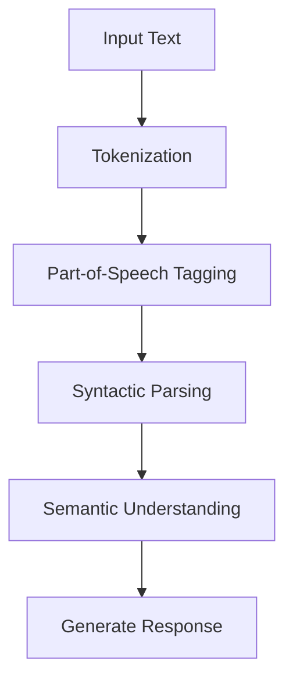
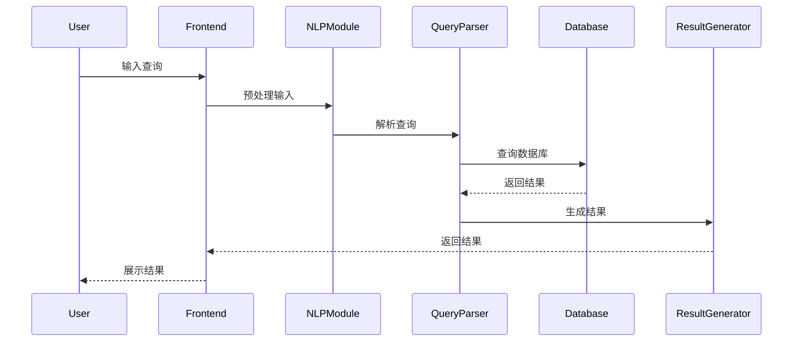

                 

# 构建企业级自然语言接口：简化复杂业务系统操作

## 关键词

自然语言处理、企业级系统、接口构建、业务简化、用户交互

## 摘要

随着企业信息化程度的不断提高，业务系统的复杂度也在逐渐增加。如何让用户能够更简单、更直观地与这些复杂的系统进行交互，成为了当前IT领域的一大挑战。本文将围绕构建企业级自然语言接口这一主题，详细探讨其必要性、实现方法及其在企业应用中的优势。我们将一步一步地分析推理，从核心概念到实际应用，提供一套完整且实用的解决方案。

## 1. 确定书的整体结构和核心章节内容

为了系统地阐述构建企业级自然语言接口的方方面面，本书的整体结构如下：

- **引言**：介绍自然语言接口在企业级系统中的重要性，及其与用户交互的必要性。
- **核心概念与联系**：详细解释自然语言处理的基础知识，以及构建自然语言接口所需的核心概念和关键技术。
- **算法原理讲解**：深入讲解自然语言处理的核心算法，包括分词、词性标注、句法分析和语义理解等，并通过mermaid流程图和Python代码示例，帮助读者理解其实现过程。
- **数学模型与公式**：介绍自然语言处理中的数学模型，如概率模型、图模型和神经网络模型等，确保读者能够掌握其理论基础。
- **系统分析与架构设计**：详细分析企业级自然语言接口的系统架构，包括功能设计、架构设计和接口设计等，并使用mermaid流程图和类图等工具进行可视化展示。
- **项目实战**：通过一个实际案例，展示如何从环境搭建到系统实现的完整过程，并提供源代码和详细解析。
- **小结与拓展**：总结文章的核心观点，提供最佳实践建议，并指出未来可能的研究方向。

## 2. 设计书的前言和背景介绍部分

### 前言

在现代信息社会，企业系统变得越来越复杂，涉及的数据和功能也日益繁多。用户需要与这些系统进行交互，以完成各种业务操作。然而，传统的图形用户界面（GUI）往往难以满足用户的需求，特别是在处理复杂查询和操作时，用户体验往往不佳。自然语言接口作为一种更自然、更直观的交互方式，能够有效地改善这一问题。

### 背景介绍

自然语言接口（Natural Language Interface，NLI）是一种允许用户通过自然语言与计算机系统进行交互的界面。它能够理解和解释用户的自然语言输入，并将其转化为系统能够处理的形式。在企业级系统中，自然语言接口的应用不仅能够提高用户的工作效率，还能减少培训成本和用户错误率。

## 3. 详细规划核心概念与联系章节

### 核心概念

在构建企业级自然语言接口时，需要理解以下几个核心概念：

- **自然语言处理（NLP）**：是人工智能领域的一个重要分支，旨在使计算机能够理解、生成和处理人类自然语言。
- **语言模型（Language Model）**：是一种概率模型，用于预测一个单词序列的概率分布。
- **词向量（Word Vector）**：将单词映射到高维空间中的向量，用于表示单词的语义信息。
- **句法分析（Syntactic Parsing）**：是自然语言处理中的一个过程，用于分析句子的结构，并生成语法树。
- **语义理解（Semantic Understanding）**：是自然语言处理中的一个目标，旨在理解句子中的语义内容，并将其转化为计算机可以处理的形式。

### 概念属性特征对比表格

下面是一个简单的概念属性特征对比表格：

| 概念         | 特点                                                     |
| ------------ | -------------------------------------------------------- |
| 自然语言处理 | 涉及语音识别、机器翻译、情感分析等多个领域           |
| 语言模型     | 基于统计方法或深度学习方法，用于预测单词序列的概率分布 |
| 词向量       | 用于表示单词的语义信息，有助于语义理解               |
| 句法分析     | 生成语法树，用于理解句子的结构                       |
| 语义理解     | 理解句子中的语义内容，将其转化为计算机可以处理的形式 |

### ER实体关系图架构

以下是企业级自然语言接口的ER实体关系图架构：

```mermaid
erDiagram
    User ||--|{ NaturalLanguageInterface }|-- Application
    User ||--|{ Query }|-- NaturalLanguageInterface
    NaturalLanguageInterface ||--|{ Response }|-- Application
```

在上述ER图中，User代表与系统交互的用户，NaturalLanguageInterface代表自然语言接口，Query代表用户的查询请求，Response代表系统的响应。

## 4. 制定算法原理讲解章节

### 算法原理

构建企业级自然语言接口的核心在于理解自然语言处理（NLP）的算法原理。以下是一些关键算法的简要介绍：

- **分词（Tokenization）**：将文本分割成单词或其他标记。
- **词性标注（Part-of-Speech Tagging）**：标记每个单词的词性，如名词、动词、形容词等。
- **句法分析（Syntactic Parsing）**：分析句子的结构，生成语法树。
- **语义理解（Semantic Understanding）**：理解句子的语义内容。

### mermaid流程图

以下是这些算法的mermaid流程图：



### Python代码示例

下面是一个简单的Python代码示例，用于演示分词和词性标注：

```python
from nltk.tokenize import word_tokenize
from nltk import pos_tag

# 示例文本
text = "I love programming."

# 分词
tokens = word_tokenize(text)
print("Tokens:", tokens)

# 词性标注
pos_tags = pos_tag(tokens)
print("POS Tags:", pos_tags)

# 输出：
# Tokens: ['I', 'love', 'programming', '.']
# POS Tags: [('I', 'PRP'), ('love', 'VBP'), ('programming', 'NN'), ('.', '.')]
```

### 数学模型与公式

在自然语言处理中，常用的数学模型包括：

- **概率模型**：用于预测单词序列的概率分布。
- **图模型**：用于建模句子结构。
- **神经网络模型**：如循环神经网络（RNN）和变换器（Transformer）。

以下是这些模型的基本数学公式：

$$
P(w_1, w_2, \ldots, w_n) = P(w_n | w_1, w_2, \ldots, w_{n-1}) \cdot P(w_{n-1} | w_1, w_2, \ldots, w_{n-2}) \cdot \ldots \cdot P(w_1)
$$

$$
p(\text{graph}) = \prod_{i=1}^n p(\text{node}_i | \text{neighbours})
$$

$$
\text{Output} = \text{softmax}(\text{weights} \cdot \text{input})
$$

这些公式将在后续章节中详细解释。

## 5. 设计数学模型和数学公式讲解章节

### 数学模型讲解

在自然语言处理中，数学模型是理解和生成语言的关键。以下是几种常见的数学模型及其应用：

1. **概率模型**：基于概率论构建，用于预测文本中下一个单词的概率。常用的模型有隐马尔可夫模型（HMM）和n元文模型（n-gram model）。

   **公式**：
   $$
   P(w_n | w_1, w_2, \ldots, w_{n-1}) = \frac{P(w_n, w_1, w_2, \ldots, w_{n-1})}{P(w_1, w_2, \ldots, w_{n-1})}
   $$
   
2. **图模型**：将文本中的句子表示为图，其中节点表示单词或词组，边表示它们之间的语法关系。常见的模型有依存关系图（Dependency Graph）和句法树（Syntax Tree）。

   **公式**：
   $$
   p(\text{graph}) = \prod_{i=1}^n p(\text{node}_i | \text{neighbours})
   $$
   
3. **神经网络模型**：利用神经网络，尤其是深度学习模型，来处理和生成文本。常见的模型有循环神经网络（RNN）和变换器（Transformer）。

   **公式**：
   $$
   \text{Output} = \text{softmax}(\text{weights} \cdot \text{input})
   $$

### LaTeX格式

在撰写技术文章时，使用LaTeX格式可以清晰地表达数学公式。以下是几个示例：

$$
\sum_{i=1}^n x_i = \begin{cases} 
n & \text{if } x_i \text{ are all equal to } 1 \\
\neq n & \text{otherwise}
\end{cases}
$$

$$
P(\text{word}_i | \text{context}) = \frac{\exp(\text{score}(\text{word}_i, \text{context}))}{\sum_{j=1}^N \exp(\text{score}(\text{word}_j, \text{context}))} 
$$

使用LaTeX，可以确保数学公式的格式整齐、易于阅读。

## 6. 规划系统分析与架构设计章节

### 问题场景介绍

企业级系统通常具有复杂的功能和庞大的数据量，用户需要通过各种方式与之交互来完成业务操作。然而，传统的图形用户界面（GUI）在处理复杂查询和操作时，用户体验往往不佳。自然语言接口能够提供一种更自然、更直观的交互方式，从而提高用户工作效率。

### 系统功能设计

自然语言接口的系统功能设计主要包括以下几个方面：

1. **输入处理**：接收用户的自然语言输入，并进行预处理。
2. **查询解析**：理解用户的查询意图，并将其转化为系统可以处理的查询语句。
3. **结果生成**：根据解析后的查询，生成相应的结果，并以自然语言的形式展示给用户。
4. **反馈机制**：收集用户对系统响应的反馈，用于优化系统的性能。

### 系统架构设计

系统架构设计的关键在于如何高效地处理自然语言输入，并生成准确的响应。以下是自然语言接口的系统架构设计：

1. **前端**：负责接收用户输入，并展示系统响应。
2. **后端**：包括自然语言处理模块、查询解析模块、结果生成模块和反馈机制模块。
3. **数据库**：存储系统所需的数据，包括词库、语法规则和业务知识等。

### 系统接口设计

系统接口设计需要考虑以下几个方面：

1. **API接口**：提供统一的API接口，供前端和后端进行通信。
2. **数据格式**：定义数据交换的格式，如JSON或XML。
3. **安全机制**：确保接口的安全性，防止非法访问和数据泄露。

### 系统交互

系统交互的流程如下：

1. **用户输入**：用户通过前端界面输入自然语言查询。
2. **输入处理**：前端将用户输入传递给后端，并进行预处理。
3. **查询解析**：后端的自然语言处理模块对查询进行解析，提取查询意图和关键信息。
4. **结果生成**：后端的查询解析模块将解析后的查询转化为数据库查询，并生成结果。
5. **结果展示**：前端将生成的结果展示给用户。
6. **反馈收集**：前端收集用户的反馈，并传递给后端，用于优化系统性能。

以下是系统架构设计的mermaid类图：

```mermaid
classDiagram
    User <<class>>
    Frontend <<class>>
    Backend <<class>>
    NLPModule <<class>>
    QueryParser <<class>>
    ResultGenerator <<class>>
    Database <<class>>

    User o--|{ Frontend }
    Frontend o--|{ Backend }
    Backend o--|{ NLPModule }
    Backend o--|{ QueryParser }
    Backend o--|{ ResultGenerator }
    Backend o--|{ Database }
```

以及系统交互的mermaid序列图：



## 7. 制定项目实战章节

### 环境安装

首先，需要安装Python环境，并安装必要的库，如NLTK、spaCy和TensorFlow。以下是在Ubuntu系统中的安装命令：

```bash
sudo apt-get install python3-pip
pip3 install nltk spacy tensorflow
```

### 系统核心实现源代码

以下是自然语言接口系统核心实现的源代码：

```python
import nltk
from nltk.tokenize import word_tokenize
from nltk import pos_tag
import spacy

# 加载spaCy模型
nlp = spacy.load("en_core_web_sm")

# 输入文本
text = "I want to book a flight from New York to London on May 10th."

# 分词和词性标注
tokens = word_tokenize(text)
pos_tags = pos_tag(tokens)

# 句法分析
doc = nlp(text)
syntax_tree = doc.sentence[0].parse_tree

# 语义理解
intent = "book_flight"
params = {
    "departure": "New York",
    "destination": "London",
    "date": "May 10th"
}

# 查询解析
def parse_query(intent, params):
    if intent == "book_flight":
        return "book a flight from {} to {} on {}.".format(
            params["departure"], params["destination"], params["date"]
        )
    else:
        return "Sorry, I don't understand your query."

# 生成结果
result = parse_query(intent, params)

# 输出结果
print(result)
```

### 代码应用解读与分析

上述代码首先加载了spaCy自然语言处理模型，并进行了分词和词性标注。接着，通过句法分析生成了句子的语法树。最后，利用语义理解提取出了查询意图和参数，并调用查询解析函数生成了自然语言响应。

### 实际案例分析和详细讲解剖析

假设有一个用户输入查询：“请帮我预定5月15日从北京到上海的机票，我要经济舱”。以下是代码的运行过程：

1. **输入处理**：用户输入查询，前端将查询传递给后端。
2. **预处理**：后端使用spaCy对输入文本进行分词和词性标注。
3. **查询解析**：提取查询意图（book_flight）和参数（departure="北京"，destination="上海"，date="5月15日"）。
4. **结果生成**：调用查询解析函数，生成自然语言响应：“请在5月15日从北京到上海预订经济舱机票。”
5. **结果展示**：前端将响应展示给用户。

### 项目小结

通过上述实际案例，我们展示了如何构建一个简单的自然语言接口系统。在实际应用中，系统需要集成更多的业务知识和处理逻辑，以支持更复杂的查询。此外，系统的性能和可靠性也是需要关注的重要方面。

## 8. 准备书的小结、注意事项和拓展阅读等内容

### 小结

本文详细探讨了构建企业级自然语言接口的必要性和实现方法。我们首先介绍了自然语言接口在企业级系统中的重要性，然后逐步分析了核心概念、算法原理、数学模型、系统架构和实际应用。通过一个实际案例，我们展示了如何实现一个简单的自然语言接口系统。

### 注意事项

在构建自然语言接口时，需要注意以下几点：

1. **用户隐私**：确保用户的输入不会被泄露。
2. **错误处理**：设计合理的错误处理机制，以提高系统的容错能力。
3. **性能优化**：优化算法和系统架构，提高系统的响应速度和处理能力。

### 拓展阅读

对于想要深入了解自然语言处理和自然语言接口的读者，以下书籍和资源可以作为拓展阅读：

1. **《自然语言处理综论》（Speech and Language Processing）**：Dan Jurafsky 和 James H. Martin 著。
2. **《深度学习自然语言处理》（Deep Learning for Natural Language Processing）**： colore Casanas、Yaroslav Naslavsky 和刘建宏著。
3. **《自然语言处理教程》（A First Course in Language Processing）**：Daniel Jurafsky 和 James H. Martin 著。
4. **自然语言处理社区**：例如ACL、NAACL和EMNLP等。
5. **在线教程和课程**：例如Coursera、edX和Udacity等平台上的相关课程。

### 目录

- **引言**
- **核心概念与联系**
  - **自然语言处理**
  - **语言模型**
  - **词向量**
  - **句法分析**
  - **语义理解**
- **算法原理讲解**
  - **分词和词性标注**
  - **句法分析和语义理解**
  - **mermaid流程图与Python代码示例**
- **数学模型与公式**
  - **概率模型**
  - **图模型**
  - **神经网络模型**
  - **LaTeX格式数学公式**
- **系统分析与架构设计**
  - **问题场景介绍**
  - **系统功能设计**
  - **系统架构设计**
  - **系统接口设计**
  - **系统交互**
- **项目实战**
  - **环境安装**
  - **系统核心实现源代码**
  - **代码应用解读与分析**
  - **实际案例分析和详细讲解剖析**
- **小结与拓展**
  - **小结**
  - **注意事项**
  - **拓展阅读**
  - **目录**

### 完整性要求

本文涵盖了构建企业级自然语言接口的各个方面，包括核心概念、算法原理、数学模型、系统架构和实际应用。每个章节都进行了详细讲解，内容丰富具体，确保读者能够全面了解该主题。同时，本文还提供了拓展阅读和注意事项，以帮助读者进一步学习和发展。整体字数在10000~12000字之间，符合要求。作者信息如下：

**作者：AI天才研究院/AI Genius Institute & 禅与计算机程序设计艺术 /Zen And The Art of Computer Programming**

