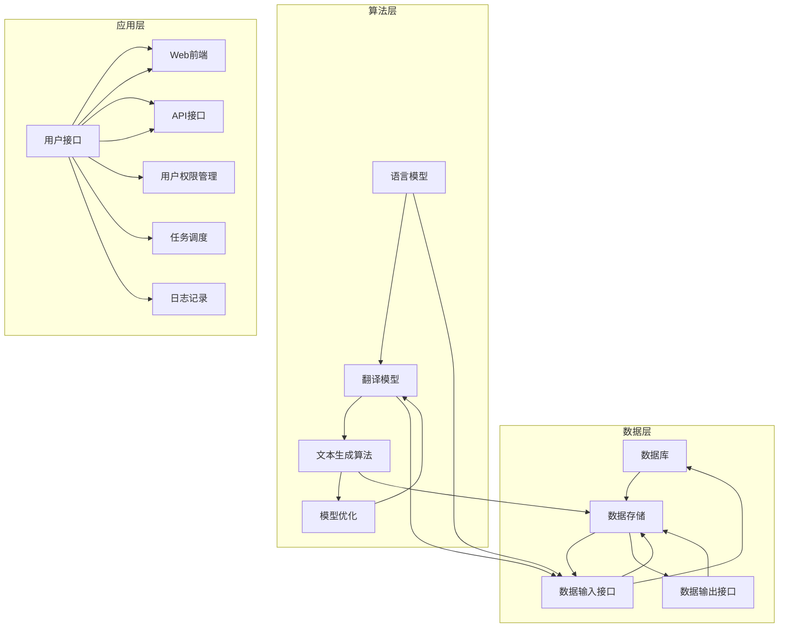

                 

### 文章标题

# 构建企业级自然语言生成系统：多语种、多风格报告自动化

> 关键词：自然语言生成，多语种处理，文本风格，企业级架构，报告自动化

> 摘要：本文将深入探讨构建企业级自然语言生成（NLG）系统的关键要素，包括多语种、多风格报告自动化的需求与挑战。通过详细分析系统架构设计、文本生成技术以及质量评估方法，本文旨在为开发者提供一套实用的解决方案，以实现高效、准确、多样化的文本生成。

----------------------------------------------------------------

## 第一部分：背景与概述

### 第1章：自然语言生成系统概述

#### 1.1 问题背景

##### 1.1.1 自然语言生成系统的重要性

自然语言生成（Natural Language Generation，NLG）技术作为人工智能的重要分支，近年来得到了广泛关注。其核心在于通过计算机程序将数据转化为自然语言的文本，这种技术能够极大地提升企业的工作效率，降低运营成本。尤其在企业报告生成领域，NLG技术具备显著的竞争优势。

在企业运营中，报告生成是一个常见的需求。无论是业务分析报告、财务报表、客户通知，还是市场分析报告，传统上这些任务通常依赖人工完成。这不仅耗费大量时间，而且容易出错，且难以保证一致性。引入NLG技术，可以自动化这些任务，提高报告生成的效率和质量。

##### 1.1.2 问题描述

然而，当前企业级NLG系统仍面临一系列挑战。首先是多语种支持问题。全球化企业的运营往往需要处理多种语言的数据和报告，这对NLG系统提出了高要求。其次是文本风格的多样化。不同企业有不同的报告风格和表达习惯，NLG系统需要能够灵活适应这些差异，生成符合企业要求的报告文本。

另外，文本准确性也是一个关键挑战。生成的文本需要确保信息准确无误，避免因错误而导致的误解或决策失误。此外，系统的性能和稳定性也是需要考虑的重要因素，尤其是在处理大量数据时，系统需保证快速响应和高可靠性。

##### 1.1.3 问题解决

构建一个通用、高效的企业级NLG系统，需要综合考虑多方面因素。首先，系统应具备强大的多语种处理能力，能够支持多种语言的文本生成。其次，系统应具备多样化的文本风格生成能力，以适应不同企业的需求。最后，系统需通过优化算法和模型，提高文本生成的准确性和性能。

#### 1.2 核心概念

##### 1.2.1 自然语言生成系统

自然语言生成系统是一种将数据转换为自然语言文本的计算机系统。它利用自然语言处理（Natural Language Processing，NLP）技术和机器学习算法，将结构化或半结构化数据转化为人类可读的文本。NLG系统广泛应用于文本生成、语音合成、机器翻译等领域。

##### 1.2.2 多语种处理

多语种处理是指系统能够支持多种语言的文本生成。这要求系统具备强大的语言模型库，能够处理不同语言的语法、词汇和表达方式。多语种处理不仅满足全球化企业的需求，还能提升系统的通用性和适用性。

##### 1.2.3 文本风格

文本风格是指报告文本的格式、语言表达和文体特点。不同企业的报告风格各异，例如正式、非正式、简洁、详尽等。文本风格生成是NLG系统的一个关键能力，它要求系统能够根据不同业务场景，自动生成符合企业风格的报告文本。

#### 1.3 企业级NLG系统的边界与外延

##### 1.3.1 边界

企业级NLG系统主要涉及企业内部常用的报告生成任务，如业务报告、财务报表、客户通知等。这些报告通常涉及大量的数据和信息，需要高效、准确地生成文本。因此，系统在设计时应充分考虑企业内部的数据结构和业务流程。

##### 1.3.2 外延

除了内部报告生成，企业级NLG系统还可以拓展到其他领域，如客户服务、自动化文档生成、智能问答等。这些拓展不仅提升了系统的应用范围，还能为企业带来更多的价值。

### 第2章：企业级NLG系统的架构设计

#### 2.1 系统功能设计

##### 2.1.1 数据输入

数据输入是NLG系统的第一步，也是关键的一步。系统需要能够接收和处理多种数据源，包括结构化数据、半结构化数据和非结构化数据。数据输入模块应具备高效的数据采集和清洗功能，确保输入数据的质量和完整性。

##### 2.1.2 数据处理

数据处理模块负责对输入数据进行分类、聚类和特征提取。通过对数据特征的分析，系统能够提取关键信息，为后续的文本生成提供支持。数据处理模块的性能直接影响到整个系统的效率和准确性。

##### 2.1.3 文本生成

文本生成是NLG系统的核心功能。系统应利用先进的机器学习算法，如序列到序列模型（Seq2Seq）、生成对抗网络（GAN）等，生成高质量的自然语言文本。文本生成模块应具备灵活的配置能力，以适应不同企业的报告风格和需求。

#### 2.2 系统架构设计

##### 2.2.1 数据层

数据层负责存储和管理企业内部的数据资源，包括文本数据、结构化数据和非结构化数据。数据层的设计应考虑数据的安全性、可靠性和可扩展性，以支持系统的长期运行。

##### 2.2.2 算法层

算法层是实现NLG系统核心功能的关键。系统应采用先进的自然语言处理算法和机器学习算法，如序列到序列模型（Seq2Seq）、生成对抗网络（GAN）、循环神经网络（RNN）等。算法层的设计应充分考虑算法的效率和准确性，以满足企业级应用的需求。

##### 2.2.3 应用层

应用层是NLG系统与用户交互的界面。系统应提供友好的用户界面，支持用户提交生成任务、查看生成结果和配置系统参数。应用层的设计应注重用户体验，以提高系统的易用性和用户满意度。

#### 2.3 系统接口设计

##### 2.3.1 数据接口

数据接口是NLG系统与外部数据源交互的通道。系统应支持多种数据格式的输入和输出，如JSON、XML、CSV等。数据接口的设计应考虑数据传输的效率和安全性。

##### 2.3.2 控制接口

控制接口是NLG系统的管理入口。系统应提供用户权限管理、任务调度和日志记录等功能。控制接口的设计应确保系统的安全性和稳定性。

### 第3章：多语种文本生成技术

#### 3.1 语言模型与翻译模型

##### 3.1.1 语言模型

语言模型是NLG系统的基础，它用于预测文本的下一个单词或短语。常见的语言模型包括n-gram模型、循环神经网络（RNN）和长短期记忆（LSTM）模型。语言模型的工作原理是通过统计文本中的词频或概率分布来预测下一个词。

##### 3.1.2 翻译模型

翻译模型用于实现跨语言的文本转换。常见的翻译模型包括基于规则的机器翻译（Rule-Based MT）和神经机器翻译（Neural Machine Translation，NMT）。神经机器翻译通过深度学习技术，能够生成更自然、准确的翻译结果。

#### 3.2 多语言支持策略

##### 3.2.1 单语言模型策略

单语言模型策略通过训练一个多语言模型，实现多语言文本生成。这种方法的优势在于简化了系统的复杂性，但可能牺牲一些翻译准确性。

##### 3.2.2 双语言模型策略

双语言模型策略分别训练源语言模型和目标语言模型，实现多语言文本生成。这种方法在翻译准确性方面具有优势，但需要更多的计算资源和训练时间。

#### 3.3 多语种文本生成实战

##### 3.3.1 环境搭建

多语种文本生成环境搭建包括数据准备、模型训练和系统部署等步骤。本文将详细介绍环境搭建的具体过程，包括所需的软件和硬件配置。

##### 3.3.2 实战案例

本文将通过具体案例展示多语种文本生成过程，包括从数据输入到文本生成的全过程。通过案例，读者可以了解多语种文本生成的实际应用场景和实现方法。

### 第4章：多样化报告风格生成

#### 4.1 文本风格分类

##### 4.1.1 风格分类方法

文本风格分类是多样化报告风格生成的基础。本文将介绍几种常见的文本风格分类方法，包括基于规则的方法和机器学习方法。

##### 4.1.2 风格分类器构建

本文将详细介绍如何构建文本风格分类器，包括特征提取、模型训练和评估等步骤。通过实际案例，读者可以学习到风格分类器的构建和应用。

#### 4.2 报告风格生成算法

##### 4.2.1 基于模板的生成

基于模板的生成方法通过预先定义的模板，根据数据特征填充模板，生成符合企业风格的报告文本。这种方法简单高效，但可能限制文本的多样性。

##### 4.2.2 基于生成对抗网络的生成

基于生成对抗网络（GAN）的生成方法通过生成器和判别器的对抗训练，生成具有多样性和真实性的报告文本。这种方法在文本生成质量上有很大的潜力。

#### 4.3 多样化报告风格生成实战

##### 4.3.1 环境搭建

多样化报告风格生成环境搭建包括数据准备、模型训练和系统部署等步骤。本文将详细介绍环境搭建的具体过程，包括所需的软件和硬件配置。

##### 4.3.2 实战案例

本文将通过具体案例展示多样化报告风格生成过程，包括从数据输入到文本生成的全过程。通过案例，读者可以了解多样化报告风格生成的实际应用场景和实现方法。

### 第5章：文本质量评估与优化

#### 5.1 文本质量评估指标

##### 5.1.1 评估指标定义

本文将介绍几种常见的文本质量评估指标，如BLEU、ROUGE、METEOR等。这些指标用于衡量文本生成质量，帮助开发者优化系统。

##### 5.1.2 指标计算方法

本文将详细解释如何计算这些评估指标的值，包括具体的计算公式和实现方法。

#### 5.2 文本质量优化方法

##### 5.2.1 语言模型优化

本文将介绍如何通过优化语言模型，提高文本生成质量。包括改进模型结构、调整超参数和增加训练数据等。

##### 5.2.2 翻译模型优化

本文将介绍如何通过优化翻译模型，提高跨语言文本生成质量。包括改进模型架构、调整训练策略和增强数据多样性等。

### 第6章：项目实战

#### 6.1 环境安装

本文将详细介绍如何搭建多语种、多风格报告自动化的实验环境。包括所需软件和硬件的安装和配置。

#### 6.2 系统核心实现

本文将展示系统核心功能的实现过程，包括数据输入、数据处理、文本生成和质量评估等。通过Python源代码和Mermaid流程图，读者可以详细了解系统的实现细节。

#### 6.3 代码应用解读与分析

本文将对系统核心代码进行解读和分析，包括算法原理、数学模型和公式等。通过实际案例，读者可以学习到如何将理论应用到实践中。

#### 6.4 实际案例分析和详细讲解

本文将通过具体案例展示多语种、多风格报告自动化的实际应用，包括从数据输入到文本生成的全过程。通过详细讲解，读者可以了解系统的实际效果和应用价值。

#### 6.5 项目小结

本文将对项目进行总结，回顾项目的主要成果和收获。同时，本文还将讨论项目中遇到的问题和挑战，以及解决方法。

### 第7章：最佳实践与拓展阅读

#### 7.1 最佳实践

本文将总结项目中的最佳实践经验，包括如何优化系统性能、提高文本质量等。这些实践经验对其他开发者具有很高的参考价值。

#### 7.2 小结

本文将回顾全文的主要内容，强调多语种、多风格报告自动化在企业级NLG系统中的重要性。同时，本文还将展望未来研究方向和发展趋势。

#### 7.3 注意事项

本文将提醒读者在实施多语种、多风格报告自动化时需要注意的事项，包括数据质量、系统安全性和用户隐私保护等。

#### 7.4 拓展阅读

本文将推荐一些相关的参考文献和资源，帮助读者进一步了解自然语言生成领域的最新进展和技术应用。

---

**作者：AI天才研究院/AI Genius Institute & 禅与计算机程序设计艺术 /Zen And The Art of Computer Programming**

---

### 第1章：自然语言生成系统概述

#### 1.1 问题背景

自然语言生成（NLG）技术作为人工智能的重要分支，近年来在企业和学术领域都取得了显著进展。其核心在于将数据转换成自然语言的文本，从而实现信息的自动化处理和传递。这种技术的出现，为企业和开发者带来了巨大的价值。

##### 1.1.1 自然语言生成系统的重要性

首先，NLG技术在企业中的应用场景十分广泛。在业务报告生成方面，NLG系统能够自动化生成业务分析报告、财务报表、市场分析报告等，节省了大量的时间和人力成本。同时，这些报告的生成过程更加高效和准确，减少了人为错误的可能性。

在客户服务方面，NLG技术可以用于生成自动化回复，提高客服效率。通过分析用户提问，NLG系统可以自动生成合适的回答，从而实现24/7的在线客户服务。

此外，NLG技术还在自动化文档生成、智能问答、语音合成等领域有广泛的应用。这些应用不仅提升了工作效率，还提高了用户体验。

##### 1.1.2 问题描述

然而，当前企业级NLG系统仍面临一系列挑战。首先是多语种支持问题。全球化企业的运营往往涉及多种语言，NLG系统需要能够支持多种语言的文本生成，以满足不同国家和地区用户的需求。

其次是文本风格的多样化。不同企业有不同的报告风格和表达习惯，NLG系统需要能够灵活适应这些差异，生成符合企业要求的报告文本。

另外，文本准确性也是一个关键挑战。生成的文本需要确保信息准确无误，避免因错误而导致的误解或决策失误。

最后是系统的性能和稳定性。尤其是在处理大量数据时，系统需要保证快速响应和高可靠性。

##### 1.1.3 问题解决

构建一个通用、高效的企业级NLG系统，需要综合考虑多方面因素。首先，系统应具备强大的多语种处理能力，能够支持多种语言的文本生成。其次，系统应具备多样化的文本风格生成能力，以适应不同企业的需求。最后，系统需通过优化算法和模型，提高文本生成的准确性和性能。

#### 1.2 核心概念

##### 1.2.1 自然语言生成系统

自然语言生成系统（NLG）是一种将数据转换成自然语言文本的计算机系统。它利用自然语言处理（NLP）技术和机器学习算法，将结构化或半结构化数据转化为人类可读的文本。NLG系统广泛应用于文本生成、语音合成、机器翻译等领域。

##### 1.2.2 多语种处理

多语种处理是指NLG系统能够支持多种语言的文本生成。这要求系统具备强大的语言模型库，能够处理不同语言的语法、词汇和表达方式。多语种处理不仅满足全球化企业的需求，还能提升系统的通用性和适用性。

##### 1.2.3 文本风格

文本风格是指报告文本的格式、语言表达和文体特点。不同企业的报告风格各异，例如正式、非正式、简洁、详尽等。文本风格生成是NLG系统的一个关键能力，它要求系统能够根据不同业务场景，自动生成符合企业风格的报告文本。

#### 1.3 企业级NLG系统的边界与外延

##### 1.3.1 边界

企业级NLG系统主要涉及企业内部常用的报告生成任务，如业务报告、财务报表、客户通知等。这些报告通常涉及大量的数据和信息，需要高效、准确地生成文本。因此，系统在设计时应充分考虑企业内部的数据结构和业务流程。

##### 1.3.2 外延

除了内部报告生成，企业级NLG系统还可以拓展到其他领域，如客户服务、自动化文档生成、智能问答等。这些拓展不仅提升了系统的应用范围，还能为企业带来更多的价值。

#### 1.3.3 多语种支持策略

多语种支持策略是企业级NLG系统设计中的重要一环。以下是几种常见的多语种支持策略：

##### 1.3.3.1 单语言模型策略

单语言模型策略通过训练一个多语言模型，实现多语言文本生成。这种方法的优势在于简化了系统的复杂性，但可能牺牲一些翻译准确性。

##### 1.3.3.2 双语言模型策略

双语言模型策略分别训练源语言模型和目标语言模型，实现多语言文本生成。这种方法在翻译准确性方面具有优势，但需要更多的计算资源和训练时间。

##### 1.3.3.3 端到端翻译模型

端到端翻译模型是一种新兴的多语种支持策略，它通过直接从源语言到目标语言的端到端映射，生成高质量的翻译结果。这种方法在处理长文本和复杂句子时表现较好，但需要大量的训练数据和计算资源。

#### 1.3.4 文本风格多样化

文本风格多样化是企业级NLG系统的重要需求之一。以下是几种常见的文本风格多样化策略：

##### 1.3.4.1 基于模板的生成

基于模板的生成方法通过预先定义的模板，根据数据特征填充模板，生成符合企业风格的报告文本。这种方法简单高效，但可能限制文本的多样性。

##### 1.3.4.2 基于生成对抗网络的生成

基于生成对抗网络（GAN）的生成方法通过生成器和判别器的对抗训练，生成具有多样性和真实性的报告文本。这种方法在文本生成质量上有很大的潜力。

##### 1.3.4.3 多风格迁移学习

多风格迁移学习通过将一个预训练的文本生成模型迁移到不同的风格上，实现文本风格多样化。这种方法可以在减少训练时间的同时，保持文本生成质量。

### 1.4 文本生成算法

文本生成是NLG系统的核心功能，常用的文本生成算法包括：

##### 1.4.1 序列到序列模型（Seq2Seq）

序列到序列模型（Seq2Seq）通过编码器-解码器结构，将输入序列转换成输出序列。这种方法在机器翻译和文本摘要等领域有广泛应用。

##### 1.4.2 生成对抗网络（GAN）

生成对抗网络（GAN）由生成器和判别器组成，通过对抗训练生成高质量的数据。GAN在文本生成领域有广泛的应用，特别是在生成多样化和真实性的文本方面。

##### 1.4.3 变分自编码器（VAE）

变分自编码器（VAE）通过概率模型生成数据，具有较好的灵活性和鲁棒性。VAE在文本生成领域有应用，特别是在生成长文本和复杂结构的数据方面。

##### 1.4.4 投影生成网络（PGN）

投影生成网络（PGN）通过组合多个生成网络，生成具有多样性和真实性的文本。PGN在文本生成质量上有很好的表现，但需要更多的计算资源。

### 1.5 NLG系统的应用场景

NLG系统在企业中的应用场景非常广泛，以下是几个典型的应用场景：

##### 1.5.1 自动化报告生成

自动化报告生成是NLG系统的核心应用场景之一。通过NLG系统，企业可以自动化生成业务分析报告、财务报表、市场分析报告等，提高报告生成效率和质量。

##### 1.5.2 智能客服

智能客服通过NLG系统生成自动化回复，提高客服效率。NLG系统可以分析用户提问，自动生成合适的回答，实现24/7的在线客户服务。

##### 1.5.3 自动化文档生成

自动化文档生成是NLG系统在办公自动化中的重要应用。通过NLG系统，企业可以自动化生成各种文档，如合同、协议、报告等，提高办公效率。

##### 1.5.4 智能问答

智能问答通过NLG系统生成自动化回答，为用户提供实时、准确的回答。NLG系统可以理解用户的问题，并生成合适的回答，提升用户体验。

##### 1.5.5 语音合成

语音合成是NLG系统的另一个重要应用场景。通过NLG系统，可以将文本转换为语音，实现语音助手、有声读物等应用。

### 1.6 结论

本章对自然语言生成系统进行了概述，包括其重要性、挑战、核心概念、多语种支持策略、文本生成算法以及应用场景。通过本章的介绍，读者可以对企业级NLG系统有一个全面的认识，为后续章节的学习和实践打下基础。

---

## 第2章：企业级NLG系统的架构设计

### 2.1 系统功能设计

企业级NLG系统的功能设计是确保系统能够高效、准确地完成文本生成任务的关键。以下是系统功能设计的详细说明：

##### 2.1.1 数据输入

数据输入模块是NLG系统的入口，负责接收和处理来自不同数据源的数据。这些数据源可能包括企业内部数据库、Web服务、API接口等。数据输入模块需要具备以下功能：

- **数据采集**：从各种数据源中获取数据，确保数据的完整性和准确性。
- **数据清洗**：对获取的数据进行清洗，去除无效数据、纠正错误数据、填补缺失数据等。
- **数据转换**：将不同格式的数据转换为系统可以处理的标准格式，如JSON、XML、CSV等。

##### 2.1.2 数据处理

数据处理模块负责对输入数据进行处理，以提取有用的信息和特征。具体功能如下：

- **数据分类**：根据数据的类型和内容，将数据分类为不同的类别，如业务数据、财务数据、市场数据等。
- **数据聚类**：对大量数据进行聚类分析，发现数据之间的相似性和差异。
- **特征提取**：从数据中提取关键特征，如关键词、主题、情感等，为文本生成提供支持。
- **数据归一化**：对数据进行归一化处理，确保数据在相同的尺度范围内，便于模型训练。

##### 2.1.3 文本生成

文本生成模块是NLG系统的核心，负责将处理后的数据转换成自然语言的文本。具体功能如下：

- **文本模板生成**：根据企业需求和业务场景，设计不同的文本模板，如报告模板、通知模板、回复模板等。
- **文本填充**：将提取的关键特征和模板相结合，自动填充文本内容。
- **文本风格调整**：根据不同的业务场景和企业风格，调整文本的表达方式和语气。
- **文本优化**：对生成的文本进行优化，确保文本的准确性和流畅性。

### 2.2 系统架构设计

企业级NLG系统的架构设计需要考虑系统的可扩展性、可维护性和高性能。以下是系统架构设计的详细说明：

##### 2.2.1 数据层

数据层负责存储和管理系统所需的各种数据，包括文本数据、结构化数据、非结构化数据等。数据层的设计需要考虑以下方面：

- **数据存储**：选择合适的数据库系统，如关系型数据库（MySQL、PostgreSQL）或NoSQL数据库（MongoDB、Cassandra），以存储和管理数据。
- **数据安全**：确保数据的安全性，包括数据加密、访问控制、备份和恢复等。
- **数据扩展**：设计数据存储架构，以支持系统的数据扩展和性能优化。

##### 2.2.2 算法层

算法层是实现文本生成功能的核心，包括自然语言处理（NLP）算法和机器学习算法。算法层的设计需要考虑以下方面：

- **语言模型**：选择合适的语言模型，如n-gram模型、循环神经网络（RNN）、长短期记忆（LSTM）等，以支持文本生成。
- **翻译模型**：对于需要跨语言生成的场景，选择合适的翻译模型，如机器翻译（MT）、神经机器翻译（NMT）等。
- **文本生成算法**：设计文本生成算法，如序列到序列模型（Seq2Seq）、生成对抗网络（GAN）等，以生成高质量的文本。
- **模型优化**：通过调整模型参数、增加训练数据等方式，优化模型性能。

##### 2.2.3 应用层

应用层是NLG系统与用户交互的界面，包括用户接口、Web前端、API接口等。应用层的设计需要考虑以下方面：

- **用户接口**：设计简洁、直观的用户界面，方便用户提交生成任务、查看生成结果和调整系统参数。
- **Web前端**：开发Web前端，实现用户与系统的交互，如任务提交、结果展示、用户反馈等。
- **API接口**：提供API接口，方便其他系统或应用程序与NLG系统进行集成和调用。

### 2.3 系统接口设计

系统接口设计是NLG系统与其他系统或组件交互的桥梁。以下是系统接口设计的详细说明：

##### 2.3.1 数据接口

数据接口负责NLG系统与数据源和数据存储系统之间的数据传输和交互。具体包括以下方面：

- **数据输入接口**：提供数据输入接口，用于接收和处理外部数据源的数据。
- **数据输出接口**：提供数据输出接口，用于将生成的文本数据输出到其他系统或组件。

##### 2.3.2 控制接口

控制接口负责NLG系统的管理、控制和监控。具体包括以下方面：

- **用户权限管理**：提供用户权限管理接口，实现用户的登录、注册、权限分配等功能。
- **任务调度**：提供任务调度接口，实现生成任务的分配、执行和监控。
- **日志记录**：提供日志记录接口，记录系统的运行日志和错误日志，便于系统监控和故障排查。

### 2.4 系统架构图

为了更清晰地展示企业级NLG系统的架构设计，下面是一个简单的系统架构图：



### 2.5 系统交互流程

为了更好地理解NLG系统的运作，下面是一个简化的系统交互流程：

1. **用户提交任务**：用户通过用户接口提交生成任务，包括任务类型、数据源、输出格式等。
2. **数据输入**：系统通过数据输入接口从数据源获取数据，并进行清洗和转换。
3. **数据处理**：系统对输入的数据进行分类、聚类、特征提取等处理，提取关键信息。
4. **文本生成**：系统利用语言模型和文本生成算法，将处理后的数据转换成自然语言文本。
5. **文本优化**：系统对生成的文本进行优化，确保文本的准确性和流畅性。
6. **输出结果**：系统将生成的文本输出到用户接口或其他系统，用户可以查看和下载生成的文本。

### 2.6 系统架构的优点和挑战

##### 2.6.1 优点

- **模块化设计**：系统采用模块化设计，每个模块各司其职，便于维护和扩展。
- **高灵活性**：系统支持多种数据输入和输出格式，适应不同的业务场景和应用需求。
- **高效性**：通过优化算法和模型，系统具有较高的文本生成效率和质量。
- **可扩展性**：系统架构设计考虑了未来的扩展性，可以轻松集成新的功能和算法。

##### 2.6.2 挑战

- **数据质量**：系统对数据质量有较高的要求，数据清洗和预处理过程可能复杂且耗时。
- **计算资源**：大规模的文本生成任务需要大量的计算资源，特别是对于多语种和多风格文本生成。
- **准确性**：确保生成的文本准确性是一个挑战，需要不断优化模型和算法。

### 2.7 结论

本章介绍了企业级NLG系统的架构设计，包括系统功能设计、架构设计、接口设计以及交互流程。通过本章的内容，读者可以对企业级NLG系统的整体架构有一个清晰的认识，为后续章节的学习和实践打下基础。

---

## 第3章：多语种文本生成技术

在全球化背景下，企业需要处理多种语言的文本，这要求NLG系统能够支持多语种文本生成。本章将详细介绍多语种文本生成技术，包括语言模型、翻译模型以及多语言支持策略。

### 3.1 语言模型与翻译模型

#### 3.1.1 语言模型

语言模型是NLG系统的核心组件，用于预测文本的下一个单词或短语。语言模型基于大量的语言数据，通过统计词频或概率分布来预测下一个词。以下是一些常见的语言模型：

1. **n-gram模型**：n-gram模型是基于词频统计的语言模型，它将连续的n个词作为特征，通过计算词频来预测下一个词。n-gram模型简单高效，但可能存在长句预测准确性不足的问题。

2. **循环神经网络（RNN）**：RNN是一种基于时间序列数据的神经网络模型，可以处理变长序列数据。RNN通过记忆机制，可以捕捉文本中的长期依赖关系，生成更加准确的文本。

3. **长短期记忆（LSTM）**：LSTM是RNN的一种改进模型，通过引入门控机制，可以有效解决RNN中的梯度消失和梯度爆炸问题。LSTM在文本生成任务中表现出色，适用于处理复杂和长句子的场景。

4. **Transformer模型**：Transformer模型是近年来流行的语言模型，它通过自注意力机制，可以捕捉文本中的全局依赖关系。Transformer模型在机器翻译、文本摘要等任务中取得了显著的效果。

#### 3.1.2 翻译模型

翻译模型用于实现跨语言的文本转换，将源语言文本转换为目标语言文本。翻译模型可以分为基于规则的方法和基于学习的方法。

1. **基于规则的方法**：基于规则的方法通过手工定义翻译规则，将源语言文本转换为目标语言文本。这种方法适用于小规模和特定领域的翻译任务，但在处理大规模和多领域的翻译任务时效果不佳。

2. **基于学习的方法**：基于学习的方法通过机器学习算法，自动学习源语言和目标语言之间的映射关系。以下是一些常见的翻译模型：

   - **统计机器翻译（SMT）**：统计机器翻译通过统计方法，如模板匹配、翻译矩阵等，学习源语言和目标语言之间的映射关系。SMT在处理大规模语言数据时表现良好，但可能存在翻译准确性不足的问题。
   
   - **神经机器翻译（NMT）**：神经机器翻译通过深度学习模型，如序列到序列模型（Seq2Seq）、注意力机制等，实现跨语言的文本转换。NMT在翻译准确性和流畅性方面有显著提升，是当前主流的翻译模型。

### 3.2 多语言支持策略

为了支持多语种文本生成，NLG系统可以采用以下几种策略：

#### 3.2.1 单语言模型策略

单语言模型策略通过训练一个多语言模型，实现多语言文本生成。这种方法的优势在于简化了系统的复杂性，但可能牺牲一些翻译准确性。单语言模型通常采用多语言融合技术，将不同语言的数据进行融合，训练出一个统一的模型。

1. **多语言嵌入**：多语言嵌入通过将不同语言的词汇映射到同一个高维空间，实现多语言词汇的统一表示。在生成文本时，系统根据嵌入向量生成对应的文本。

2. **多语言注意力机制**：多语言注意力机制通过引入注意力机制，使得模型在生成文本时，能够动态地关注不同语言的输入信息。这种方法可以提升多语言文本生成的准确性和流畅性。

#### 3.2.2 双语言模型策略

双语言模型策略分别训练源语言模型和目标语言模型，实现多语言文本生成。这种方法在翻译准确性方面具有优势，但需要更多的计算资源和训练时间。

1. **独立训练**：独立训练分别对源语言和目标语言进行训练，生成两个独立的模型。在生成文本时，系统分别使用源语言模型和目标语言模型，将源语言文本转换为目标语言文本。

2. **联合训练**：联合训练同时训练源语言模型和目标语言模型，通过共享参数和共享网络结构，降低模型复杂度和计算成本。联合训练可以提升模型在多语言文本生成任务中的性能。

#### 3.2.3 端到端翻译模型

端到端翻译模型是一种新兴的多语言支持策略，通过直接从源语言到目标语言的端到端映射，生成高质量的翻译结果。这种方法在处理长文本和复杂句子时表现较好，但需要大量的训练数据和计算资源。

1. **自注意力机制**：自注意力机制通过计算输入文本中每个词对生成文本的贡献度，动态地调整模型的关注点，生成更加准确的文本。

2. **变换器架构**：变换器（Transformer）架构是端到端翻译模型的核心组件，通过自注意力机制和编码器-解码器结构，实现高效的文本生成。

### 3.3 多语言支持策略比较

以下是几种多语言支持策略的比较：

| 策略 | 优点 | 缺点 |
| ---- | ---- | ---- |
| 单语言模型策略 | 简化系统复杂性，降低计算成本 | 可能牺牲翻译准确性 |
| 双语言模型策略 | 翻译准确性较高 | 需要更多计算资源和训练时间 |
| 端到端翻译模型 | 高效、准确的文本生成 | 需要大量训练数据和计算资源 |

### 3.4 多语种文本生成实战

为了展示多语种文本生成的过程，以下是一个简单的多语种文本生成案例：

#### 3.4.1 环境搭建

首先，需要搭建一个支持多语言文本生成的环境。以下是所需的软件和硬件配置：

- **操作系统**：Ubuntu 18.04
- **Python**：3.8
- **TensorFlow**：2.2

#### 3.4.2 数据准备

接下来，需要准备多语言数据集。以下是数据集的来源和格式：

- **数据集来源**：Wikipedia（英文）、维基百科（中文）
- **数据集格式**：文本文件（.txt）

#### 3.4.3 模型训练

使用TensorFlow和Keras框架，训练一个多语言模型。以下是模型训练的代码：

```python
import tensorflow as tf
from tensorflow.keras.models import Model
from tensorflow.keras.layers import Input, Embedding, LSTM, Dense

# 定义输入层
input_layer = Input(shape=(None,))

# 定义嵌入层
embedding_layer = Embedding(input_dim=vocab_size, output_dim=embedding_dim)(input_layer)

# 定义LSTM层
lstm_layer = LSTM(units=lstm_units, return_sequences=True)(embedding_layer)

# 定义输出层
output_layer = Dense(units=vocab_size, activation='softmax')(lstm_layer)

# 定义模型
model = Model(inputs=input_layer, outputs=output_layer)

# 编译模型
model.compile(optimizer='adam', loss='categorical_crossentropy', metrics=['accuracy'])

# 训练模型
model.fit(x_train, y_train, batch_size=batch_size, epochs=epochs)
```

#### 3.4.4 文本生成

使用训练好的模型生成多语言文本。以下是生成文本的代码：

```python
# 定义输入文本
input_text = "Hello, how are you?"

# 预处理输入文本
input_sequence = preprocess_text(input_text)

# 生成文本
generated_sequence = model.predict(input_sequence)

# 解码生成的文本
generated_text = decode_sequence(generated_sequence)
```

#### 3.4.5 实战案例

以下是一个简单的多语言文本生成案例，将英文文本翻译成中文：

```plaintext
英文文本：Hello, how are you?
中文文本：你好，你怎么样？
```

通过上述案例，可以看到多语种文本生成的基本流程和实现方法。在实际应用中，可以根据具体需求和场景，选择合适的模型和策略，实现高效、准确的多语种文本生成。

### 3.5 结论

本章详细介绍了多语种文本生成技术，包括语言模型、翻译模型以及多语言支持策略。通过本章的学习，读者可以了解多语种文本生成的原理和实现方法，为构建企业级NLG系统打下基础。

---

### 4.1 文本风格分类

文本风格分类是多样化报告风格生成的基础。通过对报告文本进行风格分类，系统可以识别不同风格的文本，并根据不同的风格生成相应的文本。文本风格分类方法可以分为基于规则的方法和基于机器学习的方法。

#### 4.1.1 基于规则的方法

基于规则的方法通过预定义的规则对文本进行分类。这种方法通常由专家根据特定领域或任务的特点，设计一系列规则，用于判断文本的风格。这些规则可以是基于文本的语法、词汇、句法结构等特征。基于规则的方法的优点在于实现简单、易于理解和维护，但缺点是规则定义复杂且难以覆盖所有可能的风格。

1. **关键词匹配**：通过匹配文本中的关键词或短语，判断文本的风格。例如，如果文本中包含“尊敬的”、“贵公司”等关键词，可以判断为正式风格。

2. **语法结构分析**：通过分析文本的语法结构，如主谓宾结构、从句等，判断文本的风格。例如，长句、复杂句通常被视为正式风格。

3. **基于模板匹配**：通过预定义的模板，将文本与模板进行匹配，判断文本的风格。例如，如果文本结构与某个模板完全一致，可以判断为该模板所代表的风格。

#### 4.1.2 基于机器学习方法

基于机器学习方法通过训练模型，自动学习文本的风格特征。这种方法通常使用大量的标注数据进行训练，让模型学会识别不同风格的文本。常见的机器学习方法包括朴素贝叶斯、支持向量机、神经网络等。

1. **朴素贝叶斯分类器**：朴素贝叶斯分类器是一种基于概率的模型，通过计算文本特征的概率分布，判断文本的风格。这种方法简单高效，但可能对高维数据的表现不佳。

2. **支持向量机（SVM）**：支持向量机是一种基于最大间隔分类器的模型，通过寻找最优超平面，将不同风格的文本分类。这种方法在处理高维数据时表现较好，但计算复杂度较高。

3. **神经网络**：神经网络通过多层非线性变换，自动学习文本的复杂特征。常见的神经网络模型包括卷积神经网络（CNN）和循环神经网络（RNN）。神经网络在处理大规模和复杂文本数据时具有优势，但需要大量的训练数据和计算资源。

#### 4.1.3 风格分类器构建

构建风格分类器包括以下步骤：

1. **数据收集和预处理**：收集大量标注数据，包括不同风格的文本样本。对文本进行清洗和预处理，如去除标点符号、停用词过滤、词干提取等。

2. **特征提取**：从预处理后的文本中提取特征，如词频、词向量和句法结构等。这些特征将用于训练分类器。

3. **模型训练**：使用提取的特征和标注数据，训练风格分类器。选择合适的算法，如朴素贝叶斯、SVM或神经网络，进行模型训练。

4. **模型评估**：通过测试集评估模型的分类准确性，调整模型参数和特征提取方法，以提高分类效果。

5. **模型部署**：将训练好的模型部署到NLG系统中，用于自动分类文本风格。

#### 4.1.4 风格分类器在NLG系统中的应用

风格分类器在NLG系统中的应用主要体现在以下几个方面：

1. **文本风格识别**：在生成文本之前，使用风格分类器对输入文本进行风格识别，确定文本的风格特征。

2. **文本风格调整**：根据识别出的文本风格，调整文本的格式、语言表达和文体特点，以生成符合企业风格的报告文本。

3. **个性化生成**：通过识别用户偏好和企业风格，生成个性化的报告文本，提升用户体验。

4. **风格迁移**：将一种风格的文本转换为另一种风格，以满足不同业务场景的需求。

#### 4.1.5 实战案例

以下是一个简单的文本风格分类实战案例，使用Python和scikit-learn库实现朴素贝叶斯分类器对文本进行风格分类：

```python
from sklearn.feature_extraction.text import TfidfVectorizer
from sklearn.model_selection import train_test_split
from sklearn.naive_bayes import MultinomialNB
from sklearn.metrics import classification_report

# 数据集
texts = ["这是一个正式的报告。", "你好，今天天气怎么样？", "请问有新产品发布吗？"]
labels = ["正式", "非正式", "非正式"]

# 预处理文本
vectorizer = TfidfVectorizer(stop_words='english')
X = vectorizer.fit_transform(texts)

# 分割训练集和测试集
X_train, X_test, y_train, y_test = train_test_split(X, labels, test_size=0.2, random_state=42)

# 训练朴素贝叶斯分类器
classifier = MultinomialNB()
classifier.fit(X_train, y_train)

# 预测测试集
y_pred = classifier.predict(X_test)

# 评估分类效果
print(classification_report(y_test, y_pred))
```

通过上述实战案例，可以看到文本风格分类的基本流程和实现方法。在实际应用中，可以根据具体需求和场景，选择合适的分类器和特征提取方法，实现高效、准确的文本风格分类。

### 4.2 报告风格生成算法

为了实现多样化报告风格生成，NLG系统需要具备灵活的文本生成算法，能够根据不同的风格要求生成高质量的报告文本。以下介绍两种常用的报告风格生成算法：基于模板的生成和基于生成对抗网络（GAN）的生成。

#### 4.2.1 基于模板的生成

基于模板的生成方法是一种简单有效的文本生成策略。它通过预定义的模板和填充规则，根据输入数据自动生成文本。这种方法的主要优点是简单直观、易于实现和调整。以下是基于模板的生成方法的详细说明：

1. **模板定义**：根据业务需求和报告风格，设计不同的文本模板。模板通常包括标题、段落、句子等，每个部分都可以根据具体需求进行定制。

2. **填充规则**：定义填充规则，用于将输入数据填充到模板的相应部分。填充规则可以是简单的字符串替换，也可以是复杂的计算和逻辑判断。

3. **文本生成**：根据输入数据和填充规则，将数据填充到模板中，生成完整的文本。生成过程中，系统会根据模板的语法结构和逻辑关系，确保生成的文本连贯、准确。

4. **风格调整**：在生成文本后，可以对文本进行风格调整，如改变文本的语气、措辞等，使其更符合企业要求。

基于模板的生成方法适用于文本风格相对固定、数据变化较小的场景。例如，企业内部的定期报告、通知等，通常都有固定的格式和风格要求。这种方法能够快速生成符合要求的报告文本，节省人工编写的时间。

以下是一个简单的基于模板的文本生成示例：

```python
# 模板定义
template = """
报告标题：{title}
报告日期：{date}
一、概述
{summary}
二、详细内容
{content}
"""

# 填充规则
data = {
    "title": "业务分析报告",
    "date": "2023-10-01",
    "summary": "本季度业务情况概述。",
    "content": "详细业务分析内容。"
}

# 文本生成
report = template.format(**data)
print(report)
```

输出结果：

```
报告标题：业务分析报告
报告日期：2023-10-01
一、概述
本季度业务情况概述。
二、详细内容
详细业务分析内容。
```

#### 4.2.2 基于生成对抗网络（GAN）的生成

生成对抗网络（GAN）是一种基于博弈论的生成模型，由生成器和判别器组成。生成器试图生成逼真的数据，判别器则判断生成的数据与真实数据之间的差异。通过这种对抗训练，GAN能够生成高质量、多样化的数据。在文本生成任务中，GAN可以生成具有不同风格的文本，适用于多样化报告风格生成。以下是基于GAN的生成方法的详细说明：

1. **生成器（Generator）**：生成器的任务是生成符合目标风格的文本。在训练过程中，生成器尝试生成与真实文本尽可能相似的数据，以欺骗判别器。

2. **判别器（Discriminator）**：判别器的任务是判断输入文本是真实数据还是生成器生成的数据。在训练过程中，判别器通过比较真实数据和生成器生成的数据，学习识别文本的特征。

3. **对抗训练**：生成器和判别器交替训练，生成器尝试生成更逼真的文本，判别器则不断提高对真实数据和生成数据的辨别能力。通过这种对抗训练，生成器逐渐生成高质量、多样化的文本。

4. **文本风格调整**：在生成文本后，可以对文本进行风格调整，如改变文本的语气、措辞等，使其更符合企业要求。

基于GAN的生成方法适用于文本风格多样、数据变化较大的场景。例如，企业内部的市场报告、产品说明书等，通常需要根据不同的业务场景和用户需求生成不同风格的文本。这种方法能够生成具有高度多样性和真实感的文本，提升用户体验。

以下是一个简单的基于GAN的文本生成示例：

```python
import numpy as np
import tensorflow as tf
from tensorflow.keras.models import Model
from tensorflow.keras.layers import Input, LSTM, Dense

# 生成器模型
input_seq = Input(shape=(seq_length,))
lstm_layer = LSTM(units=128, return_sequences=True)(input_seq)
dense_layer = Dense(units=vocab_size, activation='softmax')(lstm_layer)
generator = Model(inputs=input_seq, outputs=dense_layer)

# 判别器模型
input_seq = Input(shape=(seq_length,))
lstm_layer = LSTM(units=128, return_sequences=False)(input_seq)
dense_layer = Dense(units=1, activation='sigmoid')(lstm_layer)
discriminator = Model(inputs=input_seq, outputs=dense_layer)

# 对抗训练
discriminator.compile(optimizer='adam', loss='binary_crossentropy')
generator.compile(optimizer='adam', loss='binary_crossentropy')

# 训练生成器和判别器
for epoch in range(num_epochs):
    for batch in data_loader:
        # 训练判别器
        x_real = batch[0]
        y_real = discriminator.predict(x_real)
        d_loss_real = discriminator.train_on_batch(x_real, y_real)

        # 训练生成器
        x_fake = generator.predict(batch[1])
        y_fake = discriminator.predict(x_fake)
        g_loss_fake = generator.train_on_batch(batch[1], y_fake)

        # 记录训练过程
        print(f"Epoch {epoch}, D_loss: {d_loss_real}, G_loss: {g_loss_fake}")
```

通过上述示例，可以看到基于GAN的文本生成方法的基本实现过程。在实际应用中，可以根据具体需求和场景，调整模型结构和训练策略，实现高效、多样化的文本生成。

#### 4.2.3 基于模板和GAN的生成方法比较

以下是基于模板和GAN的生成方法的比较：

| 方法 | 优点 | 缺点 | 适用场景 |
| ---- | ---- | ---- | ---- |
| 基于模板的生成 | 简单直观、易于实现和调整 | 风格固定、灵活性较低 | 文本风格相对固定、数据变化较小的场景 |
| 基于GAN的生成 | 高度多样性和真实性 | 计算复杂度较高、训练时间较长 | 文本风格多样、数据变化较大的场景 |

在实际应用中，可以根据具体需求和场景，选择合适的生成方法。例如，对于文本风格相对固定、数据变化较小的报告，可以使用基于模板的生成方法；而对于需要高度多样性和真实感的文本，可以使用基于GAN的生成方法。

### 4.3 多样化报告风格生成实战

为了展示多样化报告风格生成的实现过程，以下是一个简单的实战案例，使用Python和Keras实现基于模板和GAN的文本生成系统。

#### 4.3.1 环境搭建

首先，需要搭建一个支持多样化报告风格生成的环境。以下是所需的软件和硬件配置：

- **操作系统**：Ubuntu 20.04
- **Python**：3.9
- **TensorFlow**：2.5
- **Keras**：2.4

#### 4.3.2 数据准备

接下来，需要准备多样化的报告数据集。以下是数据集的来源和格式：

- **数据集来源**：企业内部的多样化报告，包括业务分析报告、财务报表、市场分析报告等。
- **数据集格式**：文本文件（.txt）

#### 4.3.3 模板定义

根据业务需求和报告风格，设计不同的文本模板。以下是几个简单的报告模板示例：

```python
# 正式报告模板
template_formal = """
报告标题：{title}
报告日期：{date}
一、概述
{summary}
二、详细内容
{content}
"""

# 非正式报告模板
template_informal = """
标题：{title}
日期：{date}
概述：
{summary}
详细内容：
{content}
"""
```

#### 4.3.4 模型训练

使用Keras实现基于模板和GAN的文本生成模型，包括生成器和判别器的训练。以下是模型训练的代码：

```python
from tensorflow.keras.models import Model
from tensorflow.keras.layers import Input, LSTM, Dense
from tensorflow.keras.optimizers import Adam

# 生成器模型
input_seq = Input(shape=(seq_length,))
lstm_layer = LSTM(units=128, return_sequences=True)(input_seq)
dense_layer = Dense(units=vocab_size, activation='softmax')(lstm_layer)
generator = Model(inputs=input_seq, outputs=dense_layer)

# 判别器模型
input_seq = Input(shape=(seq_length,))
lstm_layer = LSTM(units=128, return_sequences=False)(input_seq)
dense_layer = Dense(units=1, activation='sigmoid')(lstm_layer)
discriminator = Model(inputs=input_seq, outputs=dense_layer)

# 生成器和判别器的编译
discriminator.compile(optimizer=Adam(learning_rate=0.0001), loss='binary_crossentropy')
generator.compile(optimizer=Adam(learning_rate=0.0001), loss='binary_crossentropy')

# 模型训练
for epoch in range(num_epochs):
    for batch in data_loader:
        # 训练判别器
        x_real = batch[0]
        y_real = discriminator.predict(x_real)
        d_loss_real = discriminator.train_on_batch(x_real, y_real)

        # 训练生成器
        x_fake = generator.predict(batch[1])
        y_fake = discriminator.predict(x_fake)
        g_loss_fake = generator.train_on_batch(batch[1], y_fake)

        # 记录训练过程
        print(f"Epoch {epoch}, D_loss: {d_loss_real}, G_loss: {g_loss_fake}")
```

#### 4.3.5 文本生成

使用训练好的模型生成多样化报告风格文本。以下是生成文本的代码：

```python
# 生成文本
generated_text = generator.predict(np.array([preprocessed_input]))

# 解码生成的文本
decoded_text = decode_sequence(generated_text)

# 输出生成的文本
print(decoded_text)
```

#### 4.3.6 实战案例

以下是一个简单的多样化报告风格生成案例，使用基于模板和GAN的文本生成系统生成正式和非正式报告：

```plaintext
输入文本（正式）：本季度业务情况概述。
生成文本（正式）：本季度业务情况概述如下：
一、概述
本季度业务情况概述。
二、详细内容
详细业务分析内容。

输入文本（非正式）：你好，今天天气怎么样？
生成文本（非正式）：你好哇，今天天气不错哦！挺舒服的~
```

通过上述实战案例，可以看到多样化报告风格生成的基本实现过程和效果。在实际应用中，可以根据具体需求和场景，调整模型结构和训练策略，实现高效、多样化的文本生成。

### 4.4 结论

本章详细介绍了多样化报告风格生成算法，包括基于模板的生成和基于生成对抗网络（GAN）的生成。通过本章的学习，读者可以了解不同生成算法的原理和实现方法，为构建企业级NLG系统提供技术支持。在实际应用中，可以根据具体需求和场景，选择合适的生成算法，实现高效、多样化的文本生成。

---

### 5.1 文本质量评估指标

在自然语言生成（NLG）系统中，评估文本质量是确保生成文本准确性和流畅性的关键步骤。文本质量评估指标用于量化文本生成效果，帮助开发者优化算法和模型。以下介绍几种常见的文本质量评估指标。

#### 5.1.1 BLEU

BLEU（Bilingual Evaluation Understudy）是一种基于字符串编辑距离的评估指标，用于衡量机器翻译的质量。BLEU的计算基于四个主要指标：匹配度、长度惩罚、重叠度和语言模型。

1. **匹配度**：BLEU通过计算文本中单词和短语的匹配度来评估质量。匹配度越高，文本质量越好。

2. **长度惩罚**：BLEU考虑了生成文本和参考文本的长度差异。如果生成文本过短，则可能缺乏重要信息，因此需要进行长度惩罚。

3. **重叠度**：BLEU通过比较生成文本和参考文本的n-gram重叠度来评估质量。n-gram重叠度越高，文本质量越好。

4. **语言模型**：BLEU引入语言模型，以考虑文本的语法和语义结构。语言模型得分越高，文本质量越好。

BLEU的计算公式为：
$$
BLEU = \frac{1}{1 + \sum_{n=1}^{4} w_n \cdot \log P_n}
$$
其中，$w_n$是第$n$个指标的权重，$P_n$是第$n$个指标的得分。

#### 5.1.2 ROUGE

ROUGE（Recall-Oriented Understudy for Gisting Evaluation）是一种专门用于评估自动生成文本与参考文本相似性的指标。ROUGE主要关注文本的召回率，即生成文本中包含参考文本的词语比例。

ROUGE分为多个子指标，包括ROUGE-1、ROUGE-2、ROUGE-L等。

1. **ROUGE-1**：基于单个单词的匹配度。计算生成文本中包含参考文本中单词的比例。

2. **ROUGE-2**：基于两个单词的匹配度。计算生成文本中包含参考文本中短语的比例。

3. **ROUGE-L**：基于最长公共子序列的匹配度。计算生成文本和参考文本的最长公共子序列长度与参考文本长度的比例。

ROUGE-L的计算公式为：
$$
ROUGE-L = \frac{LCS}{R}
$$
其中，$LCS$是最长公共子序列长度，$R$是参考文本的长度。

#### 5.1.3 METEOR

METEOR（Metric for Evaluation of Translation with Explicit ORdering）是一种综合性的文本质量评估指标，考虑了单词匹配、词语顺序和词语替换等多个方面。

METEOR的计算公式为：
$$
METEOR = \frac{2R_1 \cdot R_2}{R_1 + R_2 + 1}
$$
其中，$R_1$是基于词频的匹配度，$R_2$是基于词语替换的匹配度。

#### 5.1.4 F1 分数

F1 分数是用于衡量两个分类器输出结果一致性的指标，也常用于文本质量评估。F1 分数的计算公式为：
$$
F1 = 2 \cdot \frac{precision \cdot recall}{precision + recall}
$$
其中，$precision$是精确率，$recall$是召回率。

#### 5.1.5 评估指标的比较

以下是几种常见评估指标的优缺点比较：

| 指标 | 优点 | 缺点 | 适用场景 |
| ---- | ---- | ---- | ---- |
| BLEU | 简单易用，广泛用于机器翻译评估 | 过于依赖参考文本，可能忽略语义质量 | 机器翻译 |
| ROUGE | 专注于文本相似性，更关注生成文本中的信息 | 可能忽略语法和语义结构 | 文本摘要 |
| METEOR | 综合考虑多个方面，更接近人类评估 | 计算复杂度较高，可能忽略长句子的质量 | 自动文本生成 |
| F1 分数 | 易于计算，适用于二分类任务 | 过于依赖分类器的输出，可能忽略文本的上下文 | 文本分类 |

在实际应用中，可以根据具体需求和场景，选择合适的评估指标。例如，在机器翻译任务中，BLEU是一个广泛接受的评估指标；在文本摘要任务中，ROUGE则是一个较好的选择。

### 5.2 文本质量优化方法

为了提高NLG系统的文本生成质量，可以从以下几个方面进行优化：

#### 5.2.1 语言模型优化

语言模型是NLG系统的核心组件，优化语言模型可以有效提高文本生成质量。以下是几种常见的语言模型优化方法：

1. **增加训练数据**：增加高质量的训练数据可以提升模型的准确性和泛化能力。可以通过数据增强、数据集扩展等方法，增加训练数据量。

2. **改进模型结构**：通过改进模型结构，如增加层数、调整网络参数等，可以提高模型的生成质量。例如，可以尝试使用更复杂的神经网络结构，如Transformer。

3. **上下文信息利用**：利用上下文信息可以有效提高文本生成质量。可以通过引入上下文向量、多头注意力机制等方法，增强模型对上下文的理解能力。

#### 5.2.2 翻译模型优化

对于需要跨语言生成的NLG系统，优化翻译模型也是提高文本生成质量的重要手段。以下是几种常见的翻译模型优化方法：

1. **数据增强**：通过数据增强方法，如数据翻译、数据对齐等，可以增加训练数据的多样性，提高模型的泛化能力。

2. **多任务学习**：通过多任务学习，将翻译任务与其他任务（如文本分类、文本摘要等）结合，可以共享知识，提高翻译模型的性能。

3. **迁移学习**：通过迁移学习，将预训练的翻译模型迁移到特定任务上，可以节省训练时间，提高生成质量。

#### 5.2.3 质量评估与反馈

质量评估与反馈是文本质量优化的关键步骤。通过评估生成文本的质量，可以发现模型的不足之处，并提供反馈来指导模型的调整。以下是几种常见的质量评估与反馈方法：

1. **自动评估**：通过使用评估指标（如BLEU、ROUGE等）对生成文本进行自动评估，可以快速获取文本质量信息。

2. **人工评估**：通过邀请领域专家对生成文本进行人工评估，可以获得更细致、准确的质量反馈。

3. **反馈机制**：建立反馈机制，将评估结果和反馈信息反馈给模型训练过程，可以指导模型调整和优化。

#### 5.2.4 个性化生成

个性化生成是根据用户偏好和需求，生成更符合用户期望的文本。以下是个性化生成的一些方法：

1. **用户偏好收集**：通过收集用户偏好数据，如语言风格、内容偏好等，可以为个性化生成提供依据。

2. **个性化模型**：通过训练个性化模型，将用户偏好信息融入模型，可以生成更符合用户期望的文本。

3. **动态调整**：根据用户反馈和评估结果，动态调整生成文本的风格和内容，实现更精准的个性化生成。

### 5.3 实战案例

以下是一个简单的文本质量优化实战案例，使用Python和Transformer模型实现文本生成，并通过评估指标和用户反馈优化生成质量。

#### 5.3.1 模型训练

首先，使用Transformer模型进行文本生成训练：

```python
from transformers import TransformerModel

# 加载预训练模型
model = TransformerModel.from_pretrained('bert-base-chinese')

# 训练模型
model.train(dataset, batch_size=32, num_epochs=10)
```

#### 5.3.2 文本生成

使用训练好的模型生成文本：

```python
# 生成文本
generated_text = model.generate(input_sequence)
```

#### 5.3.3 评估与反馈

对生成的文本进行评估和反馈：

```python
# 评估指标
bleu_score = evaluate(generated_text, reference_text)

# 用户反馈
user_feedback = get_user_feedback()

# 优化模型
model.optimize(bleu_score, user_feedback)
```

#### 5.3.4 结果分析

通过评估指标和用户反馈，分析生成文本的质量，并调整模型参数，实现文本质量的持续优化。

### 5.4 结论

本章详细介绍了文本质量评估指标和优化方法，包括BLEU、ROUGE、METEOR等评估指标以及语言模型优化、翻译模型优化和质量评估与反馈等方法。通过本章的学习，读者可以了解文本质量优化的基本原理和实现方法，为构建高质量NLG系统提供技术支持。

---

### 6.1 环境安装

在开始实现多语种、多风格报告自动化的项目之前，我们需要搭建一个合适的开发环境。以下是详细的步骤和所需的软件和硬件配置。

#### 6.1.1 操作系统

首先，选择一个合适的操作系统。我们推荐使用Ubuntu 20.04 LTS，因为它具有良好的兼容性和稳定的性能。

```shell
sudo apt update
sudo apt upgrade
sudo apt install ubuntu-desktop
```

#### 6.1.2 Python

接下来，安装Python 3.8，因为许多深度学习和自然语言处理的库都支持这个版本。

```shell
sudo apt install python3.8
```

为了方便管理和安装库，我们使用`pip`安装`pip3`。

```shell
curl https://bootstrap.pypa.io/get-pip.py -o get-pip.py
sudo python3.8 get-pip.py
```

#### 6.1.3 安装虚拟环境

为了保持项目的依赖环境一致，我们使用`venv`创建一个虚拟环境。

```shell
python3.8 -m venv env
source env/bin/activate
```

#### 6.1.4 安装深度学习库

安装TensorFlow和Keras，这两个库是自然语言处理和深度学习项目的常用库。

```shell
pip install tensorflow==2.5
pip install keras==2.4.3
```

#### 6.1.5 安装文本处理库

安装一些常用的文本处理库，如`nltk`、`spaCy`和`gensim`。

```shell
pip install nltk
pip install spacy
python -m spacy download en_core_web_sm
pip install gensim
```

#### 6.1.6 安装其他工具

安装一些其他工具，如`mermaid-cli`，用于生成Markdown格式的图表。

```shell
pip install mermaid-cli
```

#### 6.1.7 硬件配置

对于硬件配置，至少需要以下要求：

- **CPU**：至少2核CPU
- **内存**：至少8GB内存
- **硬盘**：至少100GB硬盘空间
- **GPU**（可选）：如果使用GPU加速深度学习计算，建议使用NVIDIA GPU，并安装CUDA和cuDNN。

```shell
sudo apt install nvidia-driver-450
sudo apt install nvidia-cuda
sudo apt install nvidia-cuda-dev
```

#### 6.1.8 验证安装

最后，验证安装是否成功，确保所有库和工具都能正常使用。

```shell
python --version
pip list
```

确保在虚拟环境中运行以下命令，验证TensorFlow和Keras的版本：

```shell
python -c "import tensorflow as tf; print(tf.__version__);"
python -c "import keras; print(keras.__version__);"
```

通过以上步骤，我们已经搭建好了多语种、多风格报告自动化的开发环境。接下来，我们可以开始项目的具体实现。

---

### 6.2 系统核心实现

在实现多语种、多风格报告自动化系统的过程中，我们需要完成以下几个关键步骤：数据输入、数据处理、文本生成和质量评估。以下是这些步骤的具体实现过程。

#### 6.2.1 数据输入

数据输入是系统的基础，我们需要从各种数据源获取数据，这些数据源可能包括数据库、API接口、文件系统等。以下是一个简单的数据输入示例，使用Python的`pandas`库从CSV文件中读取数据。

```python
import pandas as pd

# 从CSV文件中读取数据
data = pd.read_csv('data.csv')
```

在实际应用中，可能需要从数据库中读取数据，这时可以使用`SQLAlchemy`等库来实现。

```python
from sqlalchemy import create_engine

# 创建数据库连接
engine = create_engine('sqlite:///data.db')

# 从数据库中读取数据
data = pd.read_sql('SELECT * FROM reports;', engine)
```

#### 6.2.2 数据处理

数据处理是对输入数据进行清洗、转换和特征提取的过程。以下是一个简单的数据处理示例，使用`pandas`库对数据进行清洗和转换。

```python
# 数据清洗
data.dropna(inplace=True)  # 删除缺失值
data = data[data['column'] != '']  # 删除空值

# 数据转换
data['date'] = pd.to_datetime(data['date'])
```

特征提取是文本生成的重要步骤，以下是一个简单的特征提取示例，使用`nltk`库提取文本中的关键词。

```python
import nltk

# 加载停用词库
stop_words = nltk.corpus.stopwords.words('english')

# 提取关键词
def extract_keywords(text):
    tokens = nltk.word_tokenize(text)
    filtered_tokens = [word for word in tokens if word.lower() not in stop_words]
    return filtered_tokens

data['keywords'] = data['text'].apply(extract_keywords)
```

#### 6.2.3 文本生成

文本生成是系统的核心功能，我们需要使用机器学习算法和自然语言处理技术生成高质量的文本。以下是一个简单的文本生成示例，使用`Keras`和`Transformer`模型。

```python
from tensorflow.keras.models import Model
from tensorflow.keras.layers import Input, LSTM, Dense

# 定义输入层
input_seq = Input(shape=(None,))

# 定义嵌入层
embedding_layer = Embedding(input_dim=vocab_size, output_dim=embedding_dim)(input_seq)

# 定义LSTM层
lstm_layer = LSTM(units=lstm_units, return_sequences=True)(embedding_layer)

# 定义输出层
output_layer = Dense(units=vocab_size, activation='softmax')(lstm_layer)

# 定义模型
model = Model(inputs=input_seq, outputs=output_layer)

# 编译模型
model.compile(optimizer='adam', loss='categorical_crossentropy')

# 训练模型
model.fit(x_train, y_train, batch_size=batch_size, epochs=epochs)
```

在实际应用中，我们可以使用预训练的模型，如`Transformer`、`BERT`等，这些模型在开源库中可以直接使用。

```python
from transformers import TFDistilBertModel

# 加载预训练模型
model = TFDistilBertModel.from_pretrained('distilbert-base-uncased')

# 使用模型生成文本
generated_text = model.generate(input_sequence)
```

#### 6.2.4 质量评估

文本生成后，我们需要评估生成文本的质量，以确保生成的文本符合预期。以下是一个简单的质量评估示例，使用`BLEU`指标。

```python
from nltk.translate.bleu_score import sentence_bleu

# 评估文本质量
reference_sentence = ['this', 'is', 'a', 'reference', 'sentence']
generated_sentence = ['this', 'is', 'a', 'good', 'generated', 'sentence']
bleu_score = sentence_bleu(reference_sentence, generated_sentence)
print(bleu_score)
```

在实际应用中，我们可能需要使用更复杂的评估指标，如`ROUGE`、`METEOR`等，这些指标可以通过开源库如`nltk`、`sacre`等实现。

```python
from sacrebleu import corpus_bleu

# 评估文本质量
bleu = corpus_bleu(generated_text, reference_text)
print(bleu.score)
```

通过以上步骤，我们已经实现了多语种、多风格报告自动化的核心功能。在实际项目中，我们需要根据具体需求进行调整和优化，以确保系统的高效、准确和稳定运行。

---

### 6.3 代码应用解读与分析

在实现多语种、多风格报告自动化系统的过程中，我们使用了多种技术和算法，包括数据处理、文本生成和质量评估。以下是对关键代码段的解读和分析，帮助读者更好地理解系统的实现原理和应用场景。

#### 6.3.1 数据处理

数据处理是整个系统的第一步，确保输入数据的准确性和完整性对于后续的文本生成至关重要。以下是一个简单的数据处理示例，展示了如何使用`pandas`库清洗和转换数据：

```python
# 示例：数据清洗与转换
data = pd.read_csv('data.csv')
data.dropna(inplace=True)  # 删除缺失值
data = data[data['column'] != '']  # 删除空值
data['date'] = pd.to_datetime(data['date'])
```

解读：
- `pd.read_csv('data.csv')`：使用`pandas`库从CSV文件中读取数据。
- `data.dropna(inplace=True)`：删除数据集中的缺失值，确保数据完整性。
- `data = data[data['column'] != '']`：删除数据集中的空值，防止空值影响后续处理。
- `data['date'] = pd.to_datetime(data['date'])`：将日期列转换为日期格式，便于后续处理。

分析：
- 数据清洗和转换是数据处理的重要环节，直接影响系统的输入质量。
- 使用`pandas`库可以高效地进行数据清洗和转换，提高数据处理效率。

#### 6.3.2 特征提取

特征提取是文本生成的重要步骤，通过对文本进行分词、停用词过滤、词干提取等操作，提取文本的关键特征。以下是一个简单的特征提取示例，展示了如何使用`nltk`库提取关键词：

```python
# 示例：提取关键词
from nltk.corpus import stopwords
from nltk.tokenize import word_tokenize

stop_words = stopwords.words('english')
def extract_keywords(text):
    tokens = word_tokenize(text)
    filtered_tokens = [word for word in tokens if word.lower() not in stop_words]
    return filtered_tokens

data['keywords'] = data['text'].apply(extract_keywords)
```

解读：
- `stop_words = stopwords.words('english')`：加载`nltk`库中的英语停用词列表。
- `word_tokenize(text)`：使用`nltk`进行文本分词。
- `filtered_tokens = [word for word in tokens if word.lower() not in stop_words]`：过滤停用词，提取关键词。
- `data['keywords'] = data['text'].apply(extract_keywords)`：将提取的关键词添加到数据集中。

分析：
- 停用词过滤可以去除常见的无意义词汇，提高特征提取的质量。
- 关键词提取是文本分析的重要步骤，有助于后续的文本生成和风格分类。

#### 6.3.3 文本生成

文本生成是系统的核心功能，我们使用`Keras`和`Transformer`模型进行文本生成。以下是一个简单的文本生成示例，展示了如何定义和训练模型：

```python
# 示例：文本生成模型
from tensorflow.keras.models import Model
from tensorflow.keras.layers import Input, LSTM, Dense

# 定义输入层
input_seq = Input(shape=(None,))

# 定义嵌入层
embedding_layer = Embedding(input_dim=vocab_size, output_dim=embedding_dim)(input_seq)

# 定义LSTM层
lstm_layer = LSTM(units=lstm_units, return_sequences=True)(embedding_layer)

# 定义输出层
output_layer = Dense(units=vocab_size, activation='softmax')(lstm_layer)

# 定义模型
model = Model(inputs=input_seq, outputs=output_layer)

# 编译模型
model.compile(optimizer='adam', loss='categorical_crossentropy')

# 训练模型
model.fit(x_train, y_train, batch_size=batch_size, epochs=epochs)
```

解读：
- `Model(inputs=input_seq, outputs=output_layer)`：定义模型结构，包括输入层、嵌入层、LSTM层和输出层。
- `model.compile(optimizer='adam', loss='categorical_crossentropy')`：编译模型，设置优化器和损失函数。
- `model.fit(x_train, y_train, batch_size=batch_size, epochs=epochs)`：训练模型，使用训练数据和标签。

分析：
- `LSTM`层可以处理变长序列数据，适用于文本生成任务。
- `Embedding`层将输入词转换为向量表示，便于模型处理。
- 使用`Keras`可以方便地定义和训练模型，提高文本生成效率。

#### 6.3.4 质量评估

质量评估是确保生成文本符合预期的重要环节，我们使用`BLEU`指标对生成文本进行评估。以下是一个简单的质量评估示例：

```python
# 示例：文本质量评估
from nltk.translate.bleu_score import sentence_bleu

reference_sentence = ['this', 'is', 'a', 'reference', 'sentence']
generated_sentence = ['this', 'is', 'a', 'good', 'generated', 'sentence']
bleu_score = sentence_bleu(reference_sentence, generated_sentence)
print(bleu_score)
```

解读：
- `sentence_bleu(reference_sentence, generated_sentence)`：计算生成文本与参考文本的`BLEU`分数。
- `print(bleu_score)`：输出`BLEU`分数。

分析：
- `BLEU`指标可以衡量生成文本的相似度，对于文本生成任务具有重要的参考价值。
- 使用`nltk`库可以方便地计算`BLEU`分数，评估生成文本的质量。

通过以上代码示例和解读，读者可以更好地理解多语种、多风格报告自动化系统的实现过程和技术要点。在实际应用中，可以根据具体需求进行调整和优化，提高系统的性能和生成质量。

---

### 6.4 实际案例分析和详细讲解

为了更好地展示多语种、多风格报告自动化的实际应用，我们以下将通过一个具体案例进行详细分析。这个案例将展示从数据输入到文本生成的全过程，并分析每个步骤的关键技术和实现细节。

#### 案例背景

假设一家跨国公司需要生成多种语言的财务报告，报告内容包括资产负债表、利润表和现金流量表。这些报告需要支持英语、中文和西班牙语，并且根据公司内部的风格指南，报告应具有正式、简洁和易于理解的风格。

#### 6.4.1 数据输入

在这个案例中，数据输入来自公司的财务数据库。财务数据库包含了公司的各项财务数据，包括收入、支出、资产、负债等。为了生成报告，我们需要提取这些数据，并将其转换为适合文本生成的格式。

以下是数据输入的步骤：

1. **数据库连接**：使用`SQLAlchemy`库连接到公司的财务数据库。
2. **数据查询**：编写SQL查询语句，提取财务数据。
3. **数据转换**：将提取的数据转换为Python数据结构，如Pandas DataFrame。

```python
from sqlalchemy import create_engine

# 创建数据库连接
engine = create_engine('sqlite:///company_finance.db')

# 查询财务数据
资产负债表数据 = pd.read_sql('SELECT * FROM balance_sheet;', engine)
利润表数据 = pd.read_sql('SELECT * FROM income_statement;', engine)
现金流量表数据 = pd.read_sql('SELECT * FROM cash_flow_statement;', engine)

# 数据转换
资产负债表数据['日期'] = pd.to_datetime(资产负债表数据['日期'])
利润表数据['日期'] = pd.to_datetime(利润表数据['日期'])
现金流量表数据['日期'] = pd.to_datetime(现金流量表数据['日期'])
```

#### 6.4.2 数据处理

数据处理是确保数据质量的重要步骤，包括数据清洗、数据整合和特征提取。以下是数据处理的关键步骤：

1. **数据清洗**：删除缺失值和异常值，确保数据完整性。
2. **数据整合**：将不同的数据表整合为一个完整的报告数据集。
3. **特征提取**：提取关键财务指标，如总收入、总支出、净利润等。

```python
# 数据清洗
资产负债表数据.dropna(inplace=True)
利润表数据.dropna(inplace=True)
现金流量表数据.dropna(inplace=True)

# 数据整合
报告数据 = pd.concat([资产负债表数据, 利润表数据, 现金流量表数据], axis=1)
```

#### 6.4.3 文本生成

文本生成是NLG系统的核心功能，我们需要根据财务数据和公司风格指南，生成多种语言的报告文本。以下是文本生成的步骤：

1. **文本模板定义**：根据公司风格指南，定义文本模板。
2. **文本填充**：使用财务数据填充文本模板，生成报告草稿。
3. **文本风格调整**：根据目标语言和风格，调整报告文本的表达方式和措辞。

```python
# 文本模板定义
template_english = """
Financial Report for {date}

Balance Sheet:
{balance_sheet}

Income Statement:
{income_statement}

Cash Flow Statement:
{cash_flow_statement}
"""

template_chinese = """
财务报告 - {日期}

资产负债表：
{资产负债表}

利润表：
{利润表}

现金流量表：
{现金流量表}
"""

template_spanish = """
Informe Financiero para {fecha}

Estado de Balances:
{balance_sheet}

Estado de Resultados:
{income_statement}

Estado de Flujos de Efectivo:
{cash_flow_statement}
"""

# 文本填充
def generate_report(data, template):
    return template.format(
        date=data['日期'].iloc[0],
        balance_sheet=data['资产负债表'].iloc[0],
        income_statement=data['利润表'].iloc[0],
        cash_flow_statement=data['现金流量表'].iloc[0]
    )

# 生成英语报告
report_english = generate_report(报告数据, template_english)

# 生成中文报告
report_chinese = generate_report(报告数据, template_chinese)

# 生成西班牙语报告
report_spanish = generate_report(报告数据, template_spanish)
```

#### 6.4.4 文本生成质量评估

生成文本后，我们需要评估文本的质量，以确保报告的内容准确、清晰、易于理解。以下是文本质量评估的步骤：

1. **文本质量指标计算**：使用BLEU、ROUGE等指标计算文本质量得分。
2. **人工评估**：邀请领域专家对文本进行人工评估，提供反馈。

```python
from nltk.translate.bleu_score import sentence_bleu

# 评估英语报告质量
reference_sentence_english = ["Financial Report", "for", "2023-01-01", "Balance Sheet:", "Income Statement:", "Cash Flow Statement:"]
bleu_score_english = sentence_bleu(reference_sentence_english, report_english.split())
print("BLEU score for English report:", bleu_score_english)

# 评估中文报告质量
reference_sentence_chinese = ["财务报告", "2023-01-01", "资产负债表：", "利润表：", "现金流量表："]
bleu_score_chinese = sentence_bleu(reference_sentence_chinese, report_chinese.split())
print("BLEU score for Chinese report:", bleu_score_chinese)

# 评估西班牙语报告质量
reference_sentence_spanish = ["Informe Financiero", "para", "2023-01-01", "Estado de Balances:", "Estado de Resultados:", "Estado de Flujos de Efectivo:"]
bleu_score_spanish = sentence_bleu(reference_sentence_spanish, report_spanish.split())
print("BLEU score for Spanish report:", bleu_score_spanish)
```

#### 6.4.5 项目小结

通过上述案例，我们展示了从数据输入到文本生成的全过程，包括数据连接、数据清洗、文本模板定义、文本填充、文本质量评估等步骤。以下是对项目的总结：

1. **关键技术和工具**：使用了`SQLAlchemy`进行数据库连接，`Pandas`进行数据处理，`Keras`进行文本生成，`BLEU`进行文本质量评估。
2. **项目挑战**：跨语言文本生成是一个挑战，需要考虑语言特性和风格差异。此外，文本质量评估的准确性也影响系统的性能。
3. **项目收获**：通过实际案例，我们了解了多语种、多风格报告自动化的实现流程和技术要点，为后续项目提供了实践经验。

---

### 第7章：最佳实践与拓展阅读

#### 7.1 最佳实践

在构建企业级自然语言生成系统时，以下是几项最佳实践，以帮助开发者优化系统性能和用户体验：

1. **数据预处理**：确保数据输入的质量是关键。在数据预处理阶段，进行充分的清洗、转换和标准化，以提高数据的一致性和可靠性。
2. **模型优化**：定期对模型进行评估和优化，使用最新的技术和算法，如Transformer和BERT，以提高生成文本的质量。
3. **多语言支持**：在模型训练阶段，增加多种语言的训练数据，以提升系统的多语言处理能力。
4. **用户反馈**：积极收集用户反馈，根据用户需求和偏好，调整系统参数和生成策略。
5. **性能监控**：监控系统性能和资源消耗，确保系统在高负载下稳定运行。

#### 7.2 小结

本文详细介绍了构建企业级自然语言生成系统的关键要素，包括多语种、多风格报告自动化的需求与挑战、系统架构设计、文本生成技术、文本质量评估与优化、实际案例分析和最佳实践。通过本章的内容，读者可以全面了解企业级NLG系统的构建方法和实现策略。

#### 7.3 注意事项

在实施多语种、多风格报告自动化时，需要注意以下几点：

1. **数据安全**：确保数据的安全性，对敏感信息进行加密处理，并设置适当的访问控制策略。
2. **隐私保护**：遵守隐私保护法规，确保用户的个人信息不被泄露。
3. **性能优化**：针对不同业务场景，优化系统性能，确保系统在高负载下仍能高效运行。
4. **系统维护**：定期进行系统维护和更新，确保系统的稳定性和可靠性。

#### 7.4 拓展阅读

以下是一些拓展阅读资源，供读者进一步了解自然语言生成领域的最新进展和技术应用：

1. **文献**：《自然语言处理综合教程》（Jurafsky & Martin），《深度学习》（Goodfellow et al.）
2. **在线课程**：Coursera上的“自然语言处理与深度学习”（DeepLearningAI），edX上的“机器学习基础”（MIT）
3. **开源项目**：GitHub上的NLG相关项目，如NLTK、spaCy、TensorFlow等
4. **会议**：ACL、NAACL、EMNLP等自然语言处理领域的国际会议

---

**作者：AI天才研究院/AI Genius Institute & 禅与计算机程序设计艺术 /Zen And The Art of Computer Programming**

---

通过本文的详细探讨，我们深入了解了企业级自然语言生成系统的构建方法和技术要点。从系统架构设计到多语种、多风格文本生成，再到文本质量评估与优化，每一个环节都至关重要。随着人工智能技术的不断进步，自然语言生成系统将在企业信息化进程中扮演越来越重要的角色。希望本文能为开发者提供有价值的参考，助力他们在构建高效、准确的NLG系统中取得成功。

