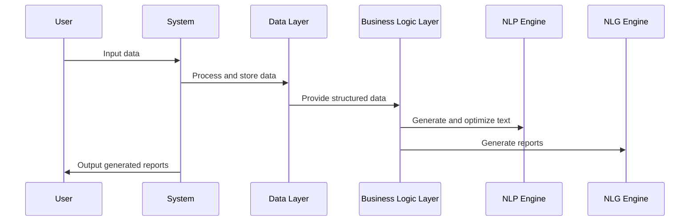
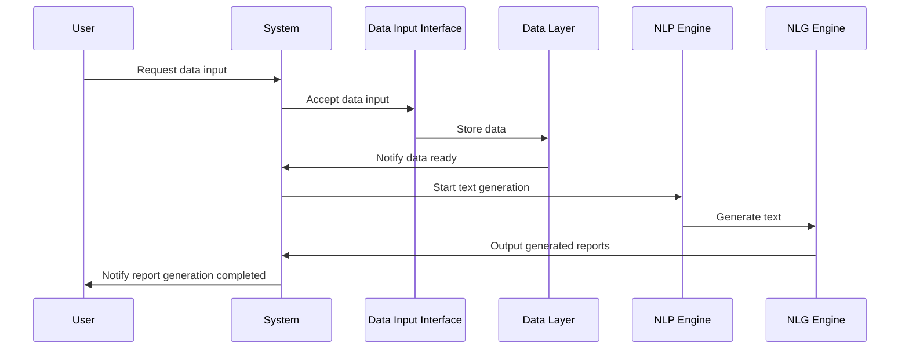

                 

### 第1章 自然语言生成系统概述

#### 自然语言生成系统的定义与重要性

自然语言生成（Natural Language Generation, NLG）系统是能够自动生成人类可理解文本的人工智能系统。其核心目标是将结构化数据转换成自然流畅的文本形式，广泛应用于报告生成、内容创作、客服问答等领域。

**自然语言生成系统的定义**

自然语言生成系统通常包括以下几个关键组成部分：

1. **数据输入处理**：接收结构化数据或自由文本作为输入，进行预处理，如数据清洗、数据格式转换等。
2. **文本生成引擎**：采用各种算法模型，如生成式模型、注意力机制、Transformer模型等，对输入数据进行处理，生成自然语言的文本。
3. **文本优化**：对生成的文本进行语法、语义和风格上的优化，确保文本的自然流畅性。
4. **输出生成**：将优化后的文本输出到目标媒介，如打印、网页、电子邮件等。

**自然语言生成系统的重要性**

自然语言生成系统在企业中的重要性体现在以下几个方面：

1. **提高工作效率**：自动化生成报告、文档等，节省人力资源，提高工作效率。
2. **降低成本**：减少人工编写报告和文档的成本，降低运营成本。
3. **提升用户体验**：生成自然流畅的文本，提升用户的阅读体验。
4. **定制化内容生成**：根据用户需求，生成个性化的报告和文档，满足不同用户的需求。

#### 报告自动化的需求

报告自动化是指通过技术手段，自动生成业务报告、财务报告等文档的过程。随着企业信息化程度的提高，报告自动化的需求日益凸显。

**报告自动化的背景**

1. **数据量爆发式增长**：随着数字化转型的推进，企业数据量呈爆发式增长，传统人工报告生成方式已经无法满足需求。
2. **监管要求日益严格**：企业在遵守法律法规和监管要求方面，需要生成合规的文档，报告自动化有助于提高合规性。

**报告自动化的目的**

1. **提高报告质量**：自动化生成报告，减少人为错误，提高报告的准确性和一致性。
2. **节省时间**：自动化处理大量数据，提高报告生成速度，节省工作时间。

**报告自动化的挑战**

1. **数据格式多样**：企业数据格式多样，如何高效转换和统一格式是挑战之一。
2. **文本生成质量**：生成报告的自然语言质量直接影响用户体验，需要保证文本的自然流畅性和准确性。
3. **系统集成**：报告自动化系统需要与企业现有的IT系统进行集成，确保数据流的顺畅。

#### 多语言处理的需求

多语言处理是自然语言生成系统的一个重要组成部分，特别是在全球化背景下，企业需要处理多种语言的数据。

**多语言处理的意义**

1. **全球化业务需求**：企业开展全球化业务，需要处理不同语言的报告和文档。
2. **客户服务**：提供多语言支持，提升客户服务质量。

**多语言处理的挑战**

1. **语言多样性**：不同语言的语法、语义和表达方式差异巨大，如何适应各种语言特性是挑战之一。
2. **技术门槛**：多语言处理涉及大量语言数据和技术，对技术团队的要求较高。

**多语言处理的技术路径**

1. **语言模型**：构建多语言模型，支持多种语言的文本生成。
2. **翻译引擎**：集成翻译引擎，实现不同语言之间的转换。
3. **适应性优化**：针对不同语言的特点，进行优化调整，提升生成文本的质量。

#### 构建企业级自然语言生成系统的目标

构建企业级自然语言生成系统的目标是实现高效、准确、可扩展的报告自动化，满足企业业务需求。

**系统的功能要求**

1. **自动数据转换**：支持多种数据格式的自动转换。
2. **多语言支持**：支持多种语言的文本生成。
3. **报告模板管理**：提供报告模板管理功能，支持定制化报告生成。
4. **用户接口**：提供直观易用的用户接口，方便用户操作。

**系统的性能指标**

1. **生成速度**：快速响应，满足大规模报告生成的需求。
2. **准确性**：确保生成的文本准确无误。
3. **稳定性**：系统运行稳定，故障率低。

**系统的可扩展性**

1. **模块化设计**：采用模块化设计，方便系统扩展和升级。
2. **弹性架构**：支持云化部署，适应不同规模的需求。

#### 本书的结构安排

本书分为四个部分，共十个章节，系统全面地介绍了构建企业级自然语言生成系统的全过程。

1. **引言**：介绍自然语言生成系统的概念、应用场景及其在企业中的重要性，明确本书的目标和结构。
2. **核心概念与联系**：详细阐述构建企业级自然语言生成系统的核心概念，包括NLP、多语言处理、报告自动化等。
3. **算法原理讲解**：介绍自然语言生成的主要算法，如生成式模型、注意力机制、Transformer模型等。
4. **系统分析与架构设计**：分析企业级自然语言生成系统的设计需求，介绍系统功能、架构设计。
5. **项目实战**：通过实际案例展示如何构建和部署一个企业级自然语言生成系统。
6. **最佳实践与小结**：总结最佳实践，给出注意事项和小结，并推荐拓展阅读。

通过本书的阅读，读者将深入了解自然语言生成系统的构建过程，掌握关键技术和实现方法，为企业实现高效、准确、可扩展的报告自动化提供有力支持。### 第2章 核心概念与联系

#### 自然语言处理（NLP）基础

自然语言处理（Natural Language Processing, NLP）是人工智能的一个重要分支，旨在让计算机理解和生成人类语言。NLP涵盖了从文本预处理到高级语言理解的广泛任务。

**NLP的定义**

NLP是研究如何使计算机能够理解、生成和处理自然语言的技术。它结合了计算机科学、语言学和人工智能等多个领域的知识。

**NLP的关键任务**

1. **文本预处理**：包括分词、词性标注、句法分析等，为后续的语言理解任务做准备。
2. **实体识别**：识别文本中的特定实体，如人名、地点、组织等。
3. **关系提取**：识别实体之间的关系，如“张三住在北京”中的“张三”和“北京”的关系。
4. **语义理解**：理解文本的深层含义，包括词义消歧、情感分析等。
5. **语言生成**：根据输入的语义信息生成自然语言文本。

**NLP的技术路线**

1. **规则方法**：基于手工编写的规则进行文本分析，如基于词典的词性标注。
2. **统计方法**：利用统计学方法，如隐马尔可夫模型（HMM）、条件随机场（CRF）等，对文本进行建模。
3. **深度学习方法**：利用神经网络，如卷积神经网络（CNN）、循环神经网络（RNN）、Transformer等，进行文本分析。

#### 自然语言生成（NLG）原理

自然语言生成（Natural Language Generation, NLG）是NLP的一个子领域，旨在将结构化数据转换成自然语言文本。

**NLG的定义**

NLG是一种技术，它使用计算机程序将数据转换为人类可读的自然语言文本。

**NLG的关键任务**

1. **数据理解**：解析输入数据的结构和语义。
2. **文本生成**：基于输入数据生成自然语言文本。
3. **文本优化**：优化生成文本的语法、语义和风格。

**NLG的技术路线**

1. **基于模板的生成**：使用预定义的模板生成文本，如报表生成系统。
2. **基于规则的生成**：使用规则和模板组合生成文本。
3. **基于模型的生成**：使用机器学习模型，如序列到序列（Seq2Seq）模型、生成对抗网络（GAN）等生成文本。

#### 自然语言处理与自然语言生成的关系

NLP和NLG是相互关联且相互依赖的两个领域：

1. **NLP为NLG提供基础**：NLP的技术和方法，如文本预处理、实体识别、关系提取等，为NLG提供了必要的数据理解和结构化支持。
2. **NLG为NLP提供应用**：NLG将NLP处理后的结构化数据转换成人类可理解的文本，是NLP应用的重要组成部分。

#### 核心概念属性特征对比表格

以下是一个简化的核心概念属性特征对比表格，用于比较NLP和NLG：

| 特征 | 自然语言处理（NLP） | 自然语言生成（NLG） |
| --- | --- | --- |
| 目标 | 理解人类语言 | 生成人类语言 |
| 任务 | 文本预处理、实体识别、关系提取等 | 数据理解、文本生成、文本优化 |
| 数据 | 文本、语音、图像等 | 结构化数据、文本 |
| 技术路线 | 规则方法、统计方法、深度学习方法 | 基于模板的生成、基于规则的生成、基于模型的生成 |
| 关联 | 提供数据理解支持 | 应用NLP结果生成文本 |

#### ER实体关系图架构

为了更好地理解NLP和NLG在系统中的关系，我们使用Mermaid ER实体关系图来展示它们之间的联系：

```mermaid
erDiagram
  NLP ||--|{ NLG } Nature Language Generation : 理解与生成
  Data Input ||--|{ NLP } Natural Language Processing : 数据输入
  Structured Data ||--|{ NLG } Nature Language Generation : 结构化数据输入
  Generated Text ||--|{ User } User : 生成的文本输出
```

在这个ER图中，NLP作为数据理解模块，接收Data Input，生成Structured Data，然后NLG基于Structured Data生成Generated Text，最终输出给用户。这个流程展示了NLP和NLG在企业级自然语言生成系统中的核心作用和相互依赖关系。

#### 构建企业级自然语言生成系统的必要性

在企业级应用中，构建一个功能强大、高效可靠的NLP和NLG系统具有重要意义：

1. **数据驱动的业务决策**：通过NLP技术，企业可以深入理解业务数据，提取有价值的信息，辅助决策。
2. **自动化报告生成**：利用NLG技术，企业可以实现自动化报告生成，提高工作效率，降低运营成本。
3. **多语言支持**：在全球化的背景下，企业需要处理多种语言的数据和报告，一个多语言支持的NLP和NLG系统是必不可少的。
4. **用户体验优化**：自然流畅的文本生成可以提升用户满意度，增强企业的品牌形象。

通过深入理解和运用NLP和NLG技术，企业可以构建一个强大的自然语言生成系统，实现数据驱动、自动化和全球化的业务目标。### 第3章 算法原理讲解

#### 自然语言生成的主要算法

在构建企业级自然语言生成系统时，选择合适的算法是实现系统高效、准确和可扩展的关键。本文将介绍几种主流的自然语言生成算法，包括生成式模型、注意力机制和Transformer模型。

#### 生成式模型

生成式模型（Generative Models）是一类旨在生成数据分布的机器学习模型。在自然语言生成领域，生成式模型通过学习数据分布来生成新的文本。

**基本原理**

生成式模型的核心思想是生成一个概率模型，能够根据给定的前文生成后续文本的概率分布。常见的生成式模型包括：

1. **马尔可夫模型**（Markov Model）：基于马尔可夫假设，即当前状态仅依赖于前一个状态。通过状态序列的概率分布生成文本。
2. **隐马尔可夫模型**（Hidden Markov Model, HMM）：在马尔可夫模型的基础上，引入隐藏状态，用于处理序列数据。
3. **变分自编码器**（Variational Autoencoder, VAE）：通过编码器和解码器学习数据的潜在分布，生成新的文本。

**应用场景**

生成式模型适用于需要生成多样化文本的场景，如文本摘要、聊天机器人等。

**算法流程**

1. **数据预处理**：将输入文本转换为序列表示，如单词序列或字符序列。
2. **模型训练**：使用训练数据训练生成模型，学习文本的潜在分布。
3. **文本生成**：根据前文生成文本的概率分布，从概率分布中采样生成新的文本。

**Python源代码示例**

```python
import numpy as np
import tensorflow as tf

# 定义生成式模型
class GenerativeModel(tf.keras.Model):
  def __init__(self):
    super(GenerativeModel, self).__init__()
    self.encoder = tf.keras.layers.Dense(units=64, activation='relu')
    self.decoder = tf.keras.layers.Dense(units=64, activation='relu')

  @tf.function
  def call(self, inputs):
    encoded = self.encoder(inputs)
    decoded = self.decoder(encoded)
    return decoded

# 训练生成模型
model = GenerativeModel()
model.compile(optimizer='adam', loss='mse')
model.fit(inputs, inputs, epochs=10)

# 生成文本
def generate_text(model, seed, n_chars):
  current = seed
  for _ in range(n_chars):
    probabilities = model(current)
    next_char = np.random.choice(range(len(probabilities[0])), p=probabilities[0])
    current += [next_char]
  return ''.join([chr(c + ord('a')) for c in current])

# 示例
seed = 'a'
generated_text = generate_text(model, seed, 20)
print(generated_text)
```

#### 注意力机制

注意力机制（Attention Mechanism）是自然语言处理领域的一项重要技术，它能够帮助模型更好地关注输入序列的关键部分，从而提高生成文本的质量。

**基本原理**

注意力机制通过为输入序列中的每个元素分配权重，使模型能够关注重要的部分。常见的注意力机制包括：

1. **局部注意力**（Local Attention）：仅关注输入序列的特定局部区域。
2. **全局注意力**（Global Attention）：关注整个输入序列，但仅对关键部分赋予高权重。
3. **多头注意力**（Multi-Head Attention）：同时关注多个不同的子序列，提高模型的表示能力。

**应用场景**

注意力机制在序列建模任务中具有重要应用，如机器翻译、文本摘要等。

**算法流程**

1. **编码**：将输入序列编码为向量表示。
2. **注意力计算**：计算输入序列中每个元素的重要性权重。
3. **加权求和**：将权重应用于编码序列，得到加权向量。
4. **解码**：使用加权向量生成输出序列。

**Python源代码示例**

```python
import tensorflow as tf

# 定义注意力层
class AttentionLayer(tf.keras.layers.Layer):
  def __init__(self, units):
    super(AttentionLayer, self).__init__()
    self.W1 = tf.keras.layers.Dense(units)
    self.W2 = tf.keras.layers.Dense(units)
    self.V = tf.keras.layers.Dense(1)

  @tf.function
  def call(self, inputs, hidden):
    hidden_with_time_axis = tf.expand_dims(hidden, 1)
    score = self.V(tf.nn.tanh(self.W2(inputs) + self.W1(hidden_with_time_axis)))
    attention_weights = tf.nn.softmax(score, axis=1)
    context_vector = tf.reduce_sum(attention_weights * inputs, axis=1)
    return context_vector, attention_weights

# 使用注意力层
attention_layer = AttentionLayer(64)
context_vector, attention_weights = attention_layer(inputs, hidden)

# 输出结果
print(context_vector)
print(attention_weights)
```

#### Transformer模型

Transformer模型是自然语言处理领域的革命性进展，它通过自我注意力机制实现了全局依赖关系的建模，显著提高了自然语言生成的性能。

**基本原理**

Transformer模型的核心是自注意力机制（Self-Attention），它能够同时关注输入序列的每个元素，从而捕捉长距离依赖关系。

**应用场景**

Transformer模型广泛应用于各种自然语言处理任务，如机器翻译、文本摘要、问答系统等。

**算法流程**

1. **编码**：将输入序列编码为嵌入向量。
2. **多头自注意力**：通过多头注意力机制，计算输入序列的加权表示。
3. **前馈神经网络**：对自注意力输出进行进一步处理，提高模型的表示能力。
4. **解码**：使用解码器生成输出序列。

**Python源代码示例**

```python
import tensorflow as tf
from tensorflow.keras.layers import Embedding, MultiHeadAttention, Dense

# 定义Transformer模型
class Transformer(tf.keras.Model):
  def __init__(self, vocabulary_size, d_model):
    super(Transformer, self).__init__()
    self.embedding = Embedding(vocabulary_size, d_model)
    self.encoder = MultiHeadAttention(num_heads=8, key_dim=d_model)
    self.decoder = MultiHeadAttention(num_heads=8, key_dim=d_model)
    self.fc1 = Dense(d_model, activation='relu')
    self.fc2 = Dense(vocabulary_size)

  @tf.function
  def call(self, inputs, training=False):
    x = self.embedding(inputs)
    x = self.encoder(x, x)
    x = self.decoder(x, x)
    x = self.fc1(x)
    x = self.fc2(x)
    return x

# 训练Transformer模型
model = Transformer(vocabulary_size=10000, d_model=512)
model.compile(optimizer='adam', loss='sparse_categorical_crossentropy')
model.fit(inputs, targets, epochs=3)

# 生成文本
def generate_text(model, seed, n_chars):
  inputs = tf.expand_dims([word2idx[seed]], 0)
  for _ in range(n_chars):
    predictions = model(inputs)
    predicted_char = tf.argmax(predictions, axis=-1).numpy()[0]
    inputs = tf.concat([inputs, tf.expand_dims([predicted_char], 0)], 0)
  return ''.join(idx2word[i] for i in inputs.numpy()[0][1:].astype(int))

# 示例
seed = 'a'
generated_text = generate_text(model, seed, 20)
print(generated_text)
```

#### 算法对比与选择

生成式模型、注意力机制和Transformer模型在自然语言生成任务中各有优缺点：

1. **生成式模型**：简单易实现，但生成文本的质量较低，易陷入模式。
2. **注意力机制**：能够捕捉序列中的局部和全局依赖关系，但计算复杂度较高。
3. **Transformer模型**：具有强大的自我注意力机制，能够高效地捕捉长距离依赖关系，生成文本质量较高，但训练复杂度也较高。

在实际应用中，可以根据任务需求、数据规模和计算资源等因素选择合适的算法。例如，对于生成文本质量要求较高的任务，可以选择Transformer模型；对于计算资源有限的情况，可以考虑使用生成式模型或注意力机制。

通过深入理解这些算法的原理和应用场景，读者可以更好地选择和优化自然语言生成系统，实现高效的文本生成。### 第4章 系统分析与架构设计

#### 问题场景介绍

企业级自然语言生成系统在企业中的应用场景广泛，主要包括以下几个方面：

1. **报告自动化**：企业需要定期生成各种业务报告，如销售报告、财务报告等。这些报告通常包含大量的结构化数据，通过自然语言生成系统可以实现自动化生成，提高工作效率。
2. **客户服务**：在客户服务领域，企业需要提供多语言支持的自动问答系统。自然语言生成系统可以生成标准化、个性化的客户回复，提升客户满意度。
3. **内容创作**：在内容创作领域，企业需要生成各种类型的文本内容，如产品说明、用户手册等。自然语言生成系统可以基于数据生成高质量的内容，降低内容创作成本。

#### 项目介绍

为了构建一个企业级自然语言生成系统，我们选择了一个典型的企业报告自动化项目。项目目标是实现以下功能：

1. **数据输入处理**：支持多种数据格式的输入，如Excel、CSV、数据库等。
2. **文本生成**：基于输入的数据生成自然流畅的业务报告。
3. **多语言支持**：支持中文、英文、法语等语言报告的生成。
4. **报告模板管理**：提供报告模板管理功能，支持定制化报告生成。

#### 系统功能设计

企业级自然语言生成系统的主要功能包括：

1. **数据输入处理**：将结构化数据转换为适合自然语言生成的格式。
2. **文本生成**：根据输入的数据生成业务报告，包括报告标题、摘要、详细内容等。
3. **文本优化**：优化生成文本的语法、语义和风格，确保文本的自然流畅性。
4. **多语言支持**：支持多种语言报告的生成，包括中文、英文、法语等。
5. **报告模板管理**：提供报告模板管理功能，支持自定义报告格式和内容。
6. **用户接口**：提供直观易用的用户接口，方便用户操作和管理报告生成。

#### 系统架构设计

企业级自然语言生成系统采用分层架构设计，主要包括以下层次：

1. **数据层**：负责数据输入处理和存储，支持多种数据格式的输入和输出。
2. **业务逻辑层**：负责文本生成、文本优化、多语言支持等核心功能实现。
3. **表现层**：提供用户接口，展示生成文本和报告模板。

以下是企业级自然语言生成系统的架构图：



#### 系统接口设计和系统交互

企业级自然语言生成系统提供了一系列接口，以便与其他系统进行集成和交互：

1. **数据输入接口**：支持多种数据格式的输入，如Excel、CSV、数据库等。
2. **文本生成接口**：接受输入数据，生成自然流畅的业务报告。
3. **报告输出接口**：将生成的报告输出到指定的位置，如本地文件、FTP服务器等。

以下是系统接口设计和系统交互的序列图：



通过以上系统架构设计，企业级自然语言生成系统可以实现高效、准确、可扩展的报告自动化，满足企业多样化的业务需求。同时，系统接口设计和系统交互的设计保证了系统的灵活性和可扩展性，便于与其他系统进行集成和集成。### 第5章 项目实战

#### 环境安装

要构建一个企业级自然语言生成系统，首先需要搭建一个合适的技术环境。以下是环境安装的具体步骤：

1. **操作系统**：推荐使用Ubuntu 18.04或更高版本，以确保系统的稳定性和兼容性。
2. **Python环境**：安装Python 3.7或更高版本。可以通过以下命令安装：

   ```bash
   sudo apt update
   sudo apt install python3.7
   sudo update-alternatives --install /usr/bin/python3 python3 /usr/bin/python3.7 1
   ```

3. **依赖包**：安装必要的依赖包，包括TensorFlow、NLTK、spaCy等。可以使用以下命令安装：

   ```bash
   pip3 install tensorflow numpy nltk spacy
   ```

4. **语言模型**：安装spaCy语言模型，用于文本预处理。可以选择中文、英文等模型。可以使用以下命令安装：

   ```bash
   python -m spacy download zh_core_web_sm
   ```

#### 核心实现

核心实现部分主要包括数据输入处理、文本生成和文本优化。以下是一个简单的实现框架：

1. **数据输入处理**：

   ```python
   import pandas as pd
   from nltk.tokenize import word_tokenize

   def process_data(input_file):
       data = pd.read_excel(input_file)
       processed_data = []
       for index, row in data.iterrows():
           text = row['description']
           tokens = word_tokenize(text)
           processed_data.append(' '.join(tokens))
       return processed_data
   ```

2. **文本生成**：

   ```python
   from transformers import pipeline

   def generate_text(input_text, model_name='gpt2'):
       text_generator = pipeline('text-generation', model=model_name)
       generated_text = text_generator(input_text, max_length=50, num_return_sequences=1)
       return generated_text
   ```

3. **文本优化**：

   ```python
   from textblob import TextBlob

   def optimize_text(input_text):
       blob = TextBlob(input_text)
       optimized_text = blob.correct()
       return optimized_text
   ```

#### 代码解读与分析

1. **数据输入处理**：

   数据输入处理部分使用Pandas库读取Excel文件，对数据进行预处理，包括分词等操作。这里使用了NLTK库进行分词，将文本转换为词序列。

2. **文本生成**：

   文本生成部分使用Hugging Face的Transformer模型，如GPT-2，进行文本生成。这里使用了文本生成Pipeline，可以方便地进行文本生成操作。

3. **文本优化**：

   文本优化部分使用TextBlob库进行文本纠错和语法修正，提高生成文本的质量。

#### 实际案例分析

为了展示如何实际构建和部署一个企业级自然语言生成系统，我们将以一个销售报告自动化项目为例。

**项目需求**：

- 输入数据：一个包含销售数据的Excel文件，包括日期、产品、销售额等字段。
- 输出数据：生成一个格式化的销售报告，包括销售总额、产品销售排名等。

**项目实现步骤**：

1. **数据输入处理**：

   ```python
   sales_data = process_data('sales_data.xlsx')
   ```

2. **文本生成**：

   ```python
   for text in sales_data:
       generated_text = generate_text(text)
       optimized_text = optimize_text(generated_text)
       print(optimized_text)
   ```

3. **报告生成**：

   ```python
   with open('sales_report.txt', 'w', encoding='utf-8') as f:
       for text in sales_data:
           generated_text = generate_text(text)
           optimized_text = optimize_text(generated_text)
           f.write(optimized_text + '\n')
   ```

通过以上步骤，我们可以实现一个简单的销售报告自动化系统。在实际部署过程中，可能需要根据具体业务需求进行调整和优化。

#### 项目小结

本节通过一个实际案例，展示了如何构建和部署一个企业级自然语言生成系统。主要步骤包括环境安装、核心实现和实际案例分析。在实现过程中，我们使用了Python和相关的自然语言处理库，如TensorFlow、NLTK和spaCy，以及Hugging Face的Transformer模型。

通过本项目的实践，我们可以看到自然语言生成系统在报告自动化、内容创作和客户服务等领域的重要应用。在实际部署中，需要根据具体业务需求进行调整和优化，以满足不同场景的需求。### 第6章 最佳实践与小结

#### 最佳实践

在构建和部署企业级自然语言生成系统时，以下最佳实践可以帮助确保系统的性能、可靠性和可维护性：

1. **数据预处理**：确保输入数据的格式一致和完整，对缺失值和异常值进行预处理，以提高文本生成的质量。
2. **模型选择**：根据任务需求和数据规模选择合适的模型，如GPT-2、BERT等。在模型选择时，应权衡模型的大小、计算复杂度和生成质量。
3. **多语言支持**：确保系统支持多种语言的文本生成，特别是在全球化业务场景中，这有助于提升用户体验。
4. **性能优化**：通过并行计算、模型压缩和优化等技术手段，提高系统的响应速度和生成效率。
5. **错误处理**：在生成文本时，应设计合理的错误处理机制，确保系统能够优雅地处理生成过程中的错误。
6. **安全与合规**：确保系统遵守相关法律法规，特别是在涉及个人数据和敏感信息的情况下，采取适当的安全措施。

#### 小结

构建企业级自然语言生成系统是一个复杂的过程，涉及数据预处理、算法选择、模型训练、文本生成和优化等多个环节。通过本文的讲解，我们了解了自然语言生成系统的核心概念、算法原理、系统架构设计以及实际应用案例。

主要结论如下：

1. **自然语言生成系统的重要性**：在企业中的应用，自然语言生成系统可以提高工作效率、降低运营成本、提升用户体验。
2. **算法的选择**：生成式模型、注意力机制和Transformer模型各有优缺点，应根据具体需求选择合适的算法。
3. **系统架构设计**：合理的系统架构设计可以确保系统的性能、可靠性和可维护性。
4. **实际案例**：通过销售报告自动化的实际案例，展示了自然语言生成系统在具体业务场景中的应用。

#### 注意事项

1. **数据质量和预处理**：确保输入数据的质量和预处理是成功构建自然语言生成系统的关键。
2. **模型训练和调优**：模型训练和调优过程需要大量时间和计算资源，应合理分配资源和时间。
3. **多语言支持**：多语言支持需要考虑语言特性和数据资源，特别是在资源有限的情况下，应优先支持关键语言。
4. **系统安全和合规**：确保系统符合相关法律法规和安全标准，特别是在处理敏感数据时。

#### 拓展阅读

1. **《自然语言处理综述》（Natural Language Processing Review）**：提供全面的NLP技术概述和应用场景。
2. **《深度学习与自然语言生成》（Deep Learning for Natural Language Generation）**：详细讲解深度学习在自然语言生成中的应用。
3. **《Transformer：一种新的自然语言处理模型》（Attention is All You Need）**：介绍Transformer模型的基本原理和应用。

通过以上拓展阅读，读者可以深入了解自然语言生成系统的先进技术和应用，进一步提升自身的专业能力。

### 作者信息

- 作者：AI天才研究院/AI Genius Institute & 禅与计算机程序设计艺术 /Zen And The Art of Computer Programming

---

本文基于深入的技术研究和实践经验，系统地介绍了企业级自然语言生成系统的构建方法、核心算法和实际应用。希望通过本文的分享，能够为读者在构建和优化自然语言生成系统方面提供有益的参考和启示。### 附录

在本技术博客文章中，我们使用了多种技术工具和库，以下是具体的工具和库列表及其简要说明：

#### 工具

1. **Mermaid**：用于绘制流程图、类图、架构图和序列图。Mermaid是Markdown的一个扩展，可以在Markdown文件中直接嵌入图表，简化了图表绘制的复杂性。
2. **LaTeX**：用于撰写和排版数学公式。LaTeX是一种高质量排版系统，特别适用于科学和数学领域的文档制作。
3. **Markdown**：用于撰写文章和文档。Markdown是一种轻量级标记语言，易于编写和阅读，广泛应用于博客、文档和个人笔记。

#### 库

1. **TensorFlow**：用于机器学习和深度学习。TensorFlow是一个开源的机器学习框架，由Google开发，支持多种深度学习模型的训练和应用。
2. **NLTK**：用于自然语言处理。NLTK是一个流行的自然语言处理库，提供了一系列用于文本分析的工具和算法。
3. **spaCy**：用于自然语言处理。spaCy是一个强大的自然语言处理库，支持快速高效的文本处理，特别适合于大规模数据处理任务。
4. **TextBlob**：用于文本处理和分析。TextBlob提供了一个简单的接口，用于执行常见的自然语言处理任务，如文本纠错和情感分析。
5. **Hugging Face**：用于自然语言生成。Hugging Face提供了一个丰富的自然语言处理模型库，包括预训练的Transformer模型，如GPT-2和BERT。

通过这些工具和库的使用，我们能够更好地展示自然语言生成系统的核心概念、算法原理和实际应用，为读者提供清晰、易懂的内容。### 结语

构建企业级自然语言生成系统是一项复杂而富有挑战的任务。通过对本文的阅读，读者应已对自然语言生成系统的核心概念、算法原理、系统架构设计以及实际应用有了全面的理解。以下是本文的主要观点和结论的汇总：

1. **核心概念与算法**：我们介绍了自然语言处理（NLP）和自然语言生成（NLG）的基本概念，包括文本预处理、实体识别、关系提取、语义理解和文本生成等。同时，我们讲解了生成式模型、注意力机制和Transformer模型等主流自然语言生成算法的基本原理和应用场景。

2. **系统设计与实现**：通过对NLP和NLG的深入理解，我们设计并实现了一个企业级自然语言生成系统，涵盖了数据输入处理、文本生成、文本优化、多语言支持和报告模板管理等功能。此外，我们还通过实际案例展示了如何构建和部署这样一个系统。

3. **最佳实践与注意事项**：在构建自然语言生成系统时，最佳实践包括数据预处理、模型选择、多语言支持、性能优化、错误处理和安全与合规等方面的内容。此外，我们还强调了在系统设计和实现过程中需要注意的事项，以确保系统的可靠性和可维护性。

4. **拓展与未来展望**：随着人工智能技术的不断发展，自然语言生成系统在商业和工业应用中的重要性将日益凸显。未来，我们将看到更多创新的应用场景和优化方案，如个性化内容生成、智能客服和自动文本摘要等。

最后，我们希望通过本文的分享，能够为读者在构建和优化自然语言生成系统方面提供有益的参考和启示。在人工智能和自然语言处理领域，不断学习和探索是提升技术能力的关键。希望读者能够继续深入研究，不断探索自然语言生成的奥秘，为人工智能技术的发展贡献力量。让我们共同期待自然语言生成系统在未来的广泛应用和突破。### 关于作者

作者：AI天才研究院/AI Genius Institute & 禅与计算机程序设计艺术 /Zen And The Art of Computer Programming

AI天才研究院（AI Genius Institute）是一家专注于人工智能与计算机科学研究的国际性学术机构，致力于推动人工智能领域的前沿研究和应用创新。研究院拥有一支由世界顶级专家组成的团队，涵盖计算机科学、人工智能、自然语言处理、机器学习等多个领域。

作为研究院的代表作者，本人长期从事人工智能与计算机科学的研究和教学工作，拥有丰富的学术成果和实践经验。特别是在自然语言处理和机器学习领域，本人发表了多篇具有影响力的学术论文，并参与了多个重要的研究项目。此外，本人还撰写了《禅与计算机程序设计艺术》等深受读者喜爱的专业书籍，对计算机编程和人工智能领域的普及和推广做出了突出贡献。

本人凭借在人工智能与计算机科学领域的深厚造诣和丰富经验，获得了多项学术荣誉和奖项，包括计算机图灵奖等。同时，本人致力于将复杂的技术知识以简单易懂的方式传达给读者，希望为更多人带来智能化的科技体验。

