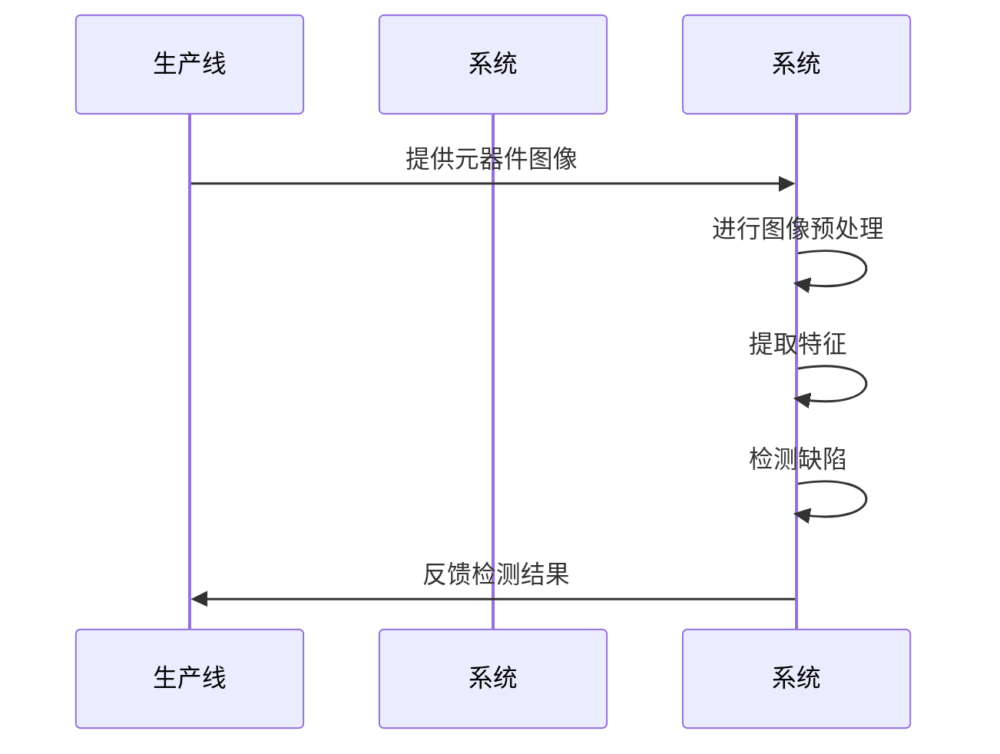
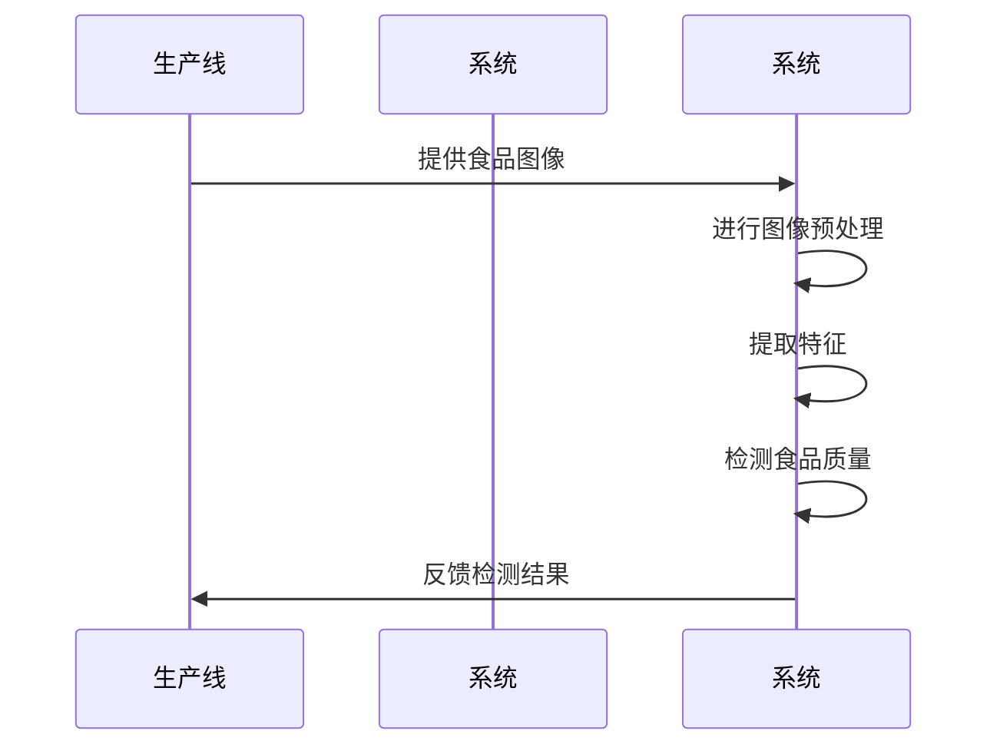
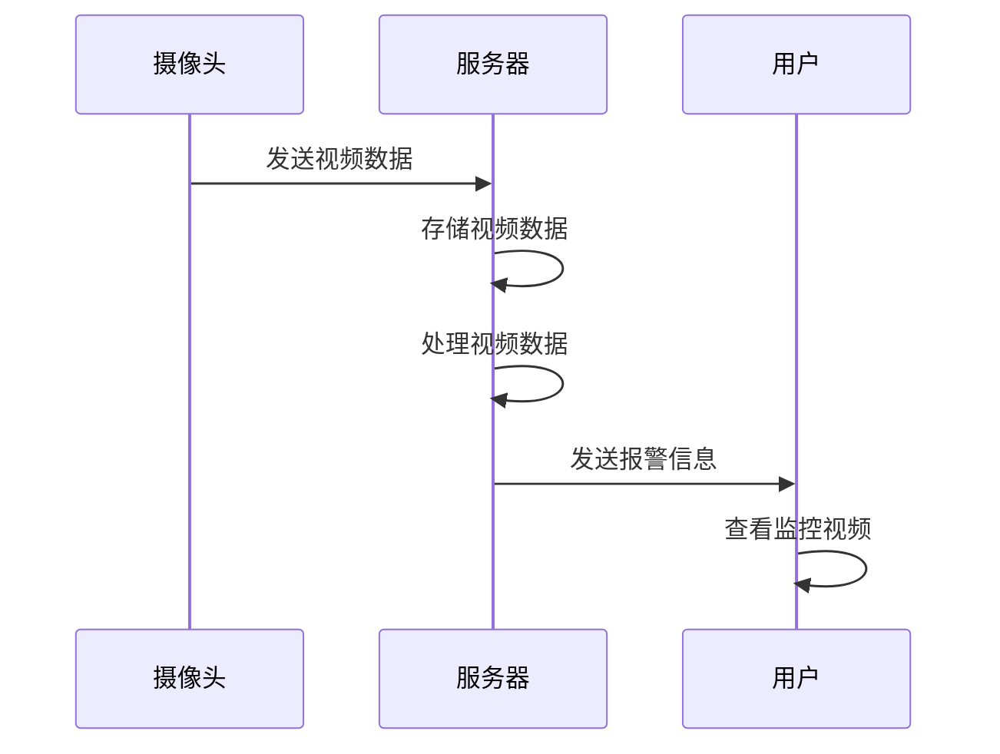
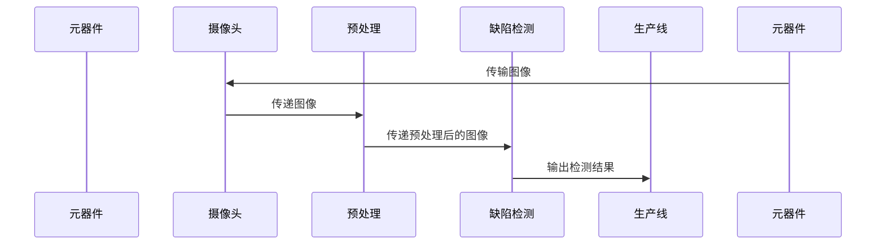
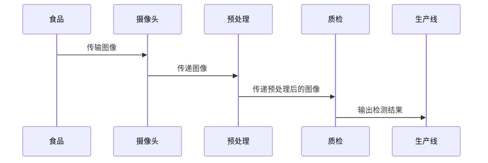
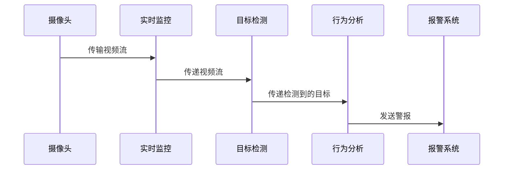
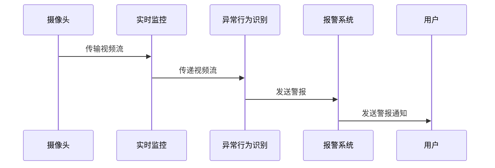

                 

## 第2章 计算机视觉基础：核心概念与技术原理

### 2.1 图像处理基础

#### 2.1.1 图像的基本概念

**图像数据**：图像是由像素点组成的二维数据结构，每个像素点代表图像中的一个点，具有特定的颜色值。在计算机中，图像通常以数字形式存储。

**图像格式**：常见的图像格式包括 JPEG、PNG、BMP 等。JPEG 用于压缩图像数据，PNG 支持透明背景和无损压缩，BMP 是 Windows 操作系统使用的原始位图格式。

**图像处理操作**：图像处理涉及多种操作，如图像增强、滤波、边缘检测、特征提取等。图像增强可以提高图像的视觉效果，滤波用于去除噪声，边缘检测用于识别图像中的边缘，特征提取用于提取图像中的关键特征。

#### 2.1.2 像素操作

**像素访问**：在图像处理中，可以通过图像坐标（x，y）访问特定像素的颜色值。例如，在 Python 的 PIL 库中，可以使用 `img.getpixel((x, y))` 方法获取像素值。

```python
from PIL import Image

img = Image.open('example.jpg')
pixel_value = img.getpixel((x, y))
```

**像素修改**：修改像素值可以通过设置新的颜色值来实现。例如，在 PIL 库中，可以使用 `img.putpixel((x, y), new_color)` 方法修改像素值。

```python
from PIL import Image

img = Image.open('example.jpg')
new_color = (255, 0, 0)  # 红色
img.putpixel((x, y), new_color)
```

### 2.2 机器学习与深度学习

#### 2.2.1 机器学习的基本概念

**机器学习**：机器学习是一种使计算机能够通过数据学习并做出决策的技术。其主要任务是让计算机从数据中学习规律，并在新的数据上进行预测或分类。

**监督学习**：监督学习是机器学习的一种方法，通过已标记的数据训练模型，然后在新的、未标记的数据上进行预测。

**无监督学习**：无监督学习是机器学习的一种方法，不使用已标记的数据，而是通过分析未标记的数据来发现数据中的规律。

#### 2.2.2 深度学习的基本概念

**深度学习**：深度学习是一种基于多层神经网络进行学习的机器学习技术，具有自动提取特征的能力。深度学习在图像识别、语音识别、自然语言处理等领域取得了显著成果。

**卷积神经网络（CNN）**：卷积神经网络是一种特殊的神经网络，主要用于处理图像数据。CNN 通过卷积层提取图像特征，并通过池化层减少数据维度。

**全连接神经网络（FCNN）**：全连接神经网络是一种标准的神经网络结构，所有层之间的节点都相互连接。

#### 2.2.3 机器学习与深度学习的联系

机器学习和深度学习之间存在密切的联系。深度学习是机器学习的一个分支，它利用多层神经网络进行学习，具有自动提取特征的能力。深度学习在图像识别、语音识别、自然语言处理等领域取得了显著成果。

### 2.3 计算机视觉的基本算法

#### 2.3.1 特征提取算法

**边缘检测**：边缘检测是图像处理中的一个基本任务，用于识别图像中的边缘。常见的边缘检测算法包括 Canny 边缘检测、Sobel 边缘检测和 Prewitt 边缘检测等。

**特征提取**：特征提取是将图像数据转换为一组描述图像特征的向量。常见的特征提取算法包括 HOG（方向梯度直方图）和 SIFT（尺度不变特征变换）等。

#### 2.3.2 目标检测算法

**目标检测**：目标检测是计算机视觉中的一个重要任务，旨在识别图像中的特定目标。常见的目标检测算法包括 R-CNN、SSD、YOLO 等。

**对象识别**：对象识别是在目标检测的基础上，进一步识别图像中的特定对象。常见的对象识别算法包括 SVM、K-NN、CNN 等。

#### 2.3.3 人脸识别算法

**人脸识别**：人脸识别是一种基于人脸图像进行身份验证的技术。常见的人脸识别算法包括 Eigenfaces、Fisherfaces、LBP（局部二值模式）等。

**人脸检测**：人脸检测是识别图像中的人脸区域。常见的人脸检测算法包括 MTCNN、Haar-like 特征分类器等。

### 2.3.4 活动识别算法

**活动识别**：活动识别是一种识别视频中的人体动作的技术。常见的活动识别算法包括 HMM（隐马尔可夫模型）、CNN、RNN（循环神经网络）等。

#### 2.3.5 场景识别算法

**场景识别**：场景识别是一种识别图像或视频中的场景类型的技术。常见场景识别算法包括 CNN、LSTM（长短期记忆网络）等。

## 2.4 计算机视觉的核心概念与联系

**核心概念对比表格**

| 核心概念 | 定义 | 应用 |
| --- | --- | --- |
| 图像处理 | 图像的编辑和处理 | 图像增强、滤波、边缘检测等 |
| 机器学习 | 从数据中学习并做出决策 | 目标检测、对象识别、人脸识别等 |
| 深度学习 | 基于多层神经网络进行学习 | 图像识别、语音识别、自然语言处理等 |
| 计算机视觉 | 利用计算机技术和算法处理图像数据 | 视频监控、自动驾驶、医疗诊断等 |

**ER实体关系图架构**

```mermaid
erDiagram
    Image -->|1| Pixel : 像素是图像的基本组成单元
    Pixel <--|1| Image : 图像由像素组成
    Image -->|1| ImageProcessing : 图像处理是图像分析的基础
    ImageProcessing -->|1| FeatureExtraction : 特征提取是图像分析的关键
    FeatureExtraction -->|1| ObjectDetection : 目标检测是计算机视觉的核心任务
    ObjectDetection -->|1| Recognition : 识别是计算机视觉的最终目标
```

通过上述内容，我们可以看到计算机视觉的基础知识涵盖了图像处理、机器学习和深度学习等多个领域。这些核心概念和技术原理为构建企业级计算机视觉平台提供了坚实的基础。在接下来的章节中，我们将进一步探讨计算机视觉的应用场景和平台架构设计。 <eop>## 第3章 计算机视觉应用场景分析

### 3.1 质检应用

#### 3.1.1 质检流程与计算机视觉的结合

**质检流程**：质检是指在生产过程中对产品进行质量检查，以确保产品符合规定的质量标准。传统的质检方法主要依靠人工进行，存在效率低、精度不高等问题。将计算机视觉技术引入质检流程，可以提高质检效率，降低人力成本。

**计算机视觉在质检中的应用**：

1. **图像采集**：使用摄像头或工业相机捕捉生产线上产品的图像。
2. **图像预处理**：对采集到的图像进行预处理，包括图像增强、去噪、二值化等，以提高图像质量。
3. **特征提取**：提取图像中的关键特征，如边缘、纹理、形状等。
4. **缺陷检测**：使用算法对图像进行分析，识别出产品中的缺陷，如裂纹、污点、尺寸误差等。
5. **结果输出**：将检测到的缺陷信息反馈给生产线，实现自动化的质量监控。

**案例分析**：

**电子元器件质检**：在电子元器件的生产过程中，需要对元件的外观、焊点、电路板等进行质量检测。通过计算机视觉技术，可以实现对元器件的快速、准确检测，提高生产效率。



**食品行业质检**：在食品行业中，计算机视觉技术可以用于检测食品的质量，如是否变质、异物检测等。通过实时监控，可以确保食品安全，减少食品安全事故的发生。



#### 3.1.2 质检算法设计与实现

**算法设计**：

1. **图像预处理**：使用图像增强算法提高图像质量，使用去噪算法去除图像中的噪声。
2. **特征提取**：使用边缘检测、纹理分析等算法提取图像中的关键特征。
3. **缺陷检测**：使用机器学习算法，如支持向量机（SVM）、卷积神经网络（CNN）等，对提取的特征进行分类，识别缺陷。

**算法实现**：

```python
import cv2
import numpy as np

# 1. 图像预处理
def preprocess_image(image):
    # 图像增强
    image = cv2.resize(image, (640, 480))
    image = cv2.cvtColor(image, cv2.COLOR_BGR2RGB)
    image = cv2.GaussianBlur(image, (5, 5), 0)
    return image

# 2. 特征提取
def extract_features(image):
    # 边缘检测
    edges = cv2.Canny(image, 100, 200)
    # 纹理分析
    texture = cv2.Laplacian(image, cv2.CV_64F)
    return edges, texture

# 3. 缺陷检测
def detect_defects(edges, texture):
    # 机器学习算法
    svm = cv2.SVM_create()
    svm.setKernel(cv2.SVM_LINEAR)
    svm.setType(cv2.SVM_C_SVC)
    svm.train(np.float32(edges), np.float32(texture))
    return svm

# 测试
image = cv2.imread('example.jpg')
image = preprocess_image(image)
edges, texture = extract_features(image)
defects = detect_defects(edges, texture)
print(defects)
```

### 3.2 安防应用

#### 3.2.1 安防需求分析

**安防需求**：

1. **实时监控**：实现对特定区域或场景的实时监控，及时发现异常情况。
2. **目标识别**：识别监控视频中的人、车等目标，实现对目标的跟踪和识别。
3. **行为分析**：分析监控视频中的行为，如是否违规停车、打架等。
4. **报警系统**：在发现异常情况时，及时发出警报，提醒相关人员。

#### 3.2.2 安防系统架构设计

**系统架构设计**：

1. **前端设备**：包括摄像头、监控主机等，用于采集视频数据。
2. **数据传输**：通过网络将视频数据传输到后端服务器。
3. **后端服务器**：包括视频存储、数据处理和报警系统等模块。
4. **用户界面**：供用户查看监控视频、接收报警信息等。



**案例分析**：

**城市安防监控**：在城市建设中，通过部署大量监控摄像头，实现对城市主要道路、公共场所的实时监控。结合计算机视觉技术，可以实现对目标车辆的自动识别、异常行为的检测等功能，提高城市安防水平。

**智能安防系统**：智能安防系统利用计算机视觉技术，实现对家庭、公司等场所的监控。通过人脸识别、行为分析等技术，可以实现对入侵者的自动识别和报警，提高安防效果。

### 3.3 计算机视觉在质检与安防中的应用总结

**应用特点**：

1. **实时性**：计算机视觉技术可以实现对视频数据的实时处理，快速发现异常情况。
2. **自动化**：通过算法实现自动化检测，减少人工干预，提高效率。
3. **准确性**：利用机器学习、深度学习等技术，提高检测的准确性。

**优势与挑战**：

**优势**：

1. **提高效率**：自动化检测可以节省人力成本，提高生产效率。
2. **提高准确性**：计算机视觉技术可以精确地检测出肉眼难以发现的缺陷。
3. **降低风险**：通过实时监控，可以及时发现安全隐患，降低事故发生的风险。

**挑战**：

1. **数据处理**：视频数据量大，需要高效的数据处理算法。
2. **算法优化**：需要不断优化算法，提高检测的准确性和实时性。
3. **成本控制**：部署计算机视觉系统需要一定的硬件和软件成本。

通过上述分析，我们可以看到计算机视觉技术在质检与安防领域具有重要的应用价值。在接下来的章节中，我们将进一步探讨企业级计算机视觉平台的架构设计和关键技术的应用。 <eop>## 第4章 企业级计算机视觉平台的架构设计

### 4.1 系统架构概述

企业级计算机视觉平台是一个复杂的系统，需要综合考虑硬件设备、软件工具、数据资源、系统架构等多个方面。其总体架构可以分为以下几个层次：

1. **数据采集层**：包括摄像头、工业相机等硬件设备，用于采集图像或视频数据。
2. **数据处理层**：包括数据预处理、特征提取、模型训练等模块，用于对采集到的数据进行处理和分析。
3. **模型层**：包括预训练模型和定制模型，用于图像识别、目标检测、行为分析等任务。
4. **应用层**：包括质检、安防、医疗诊断等具体应用场景，用于实现具体的功能。
5. **数据存储层**：包括数据库、数据仓库等，用于存储和处理大量的图像和视频数据。

### 4.2 数据采集与管理

**数据采集**：

1. **硬件设备**：选择合适的摄像头或工业相机，根据应用场景的需求确定分辨率、帧率等参数。
2. **网络传输**：确保数据能够快速、稳定地传输到数据处理层。

**数据管理**：

1. **数据存储**：选择合适的存储方案，如分布式存储系统，提高数据存储的效率和可靠性。
2. **数据清洗**：对采集到的数据进行预处理，去除噪声、异常值等，保证数据的准确性。
3. **数据标注**：对于需要训练模型的任务，需要对数据进行标注，以便模型能够学习到正确的特征。

### 4.3 计算机视觉模型训练与优化

**模型训练**：

1. **数据准备**：准备足够多的标注数据，包括训练集和测试集。
2. **模型选择**：选择合适的模型，如卷积神经网络（CNN）、循环神经网络（RNN）等。
3. **训练过程**：使用训练集对模型进行训练，调整模型的参数，以达到最优的性能。

**模型优化**：

1. **超参数调整**：通过调整学习率、批量大小等超参数，提高模型的性能。
2. **模型集成**：将多个模型进行集成，提高预测的准确性。
3. **模型压缩**：对模型进行压缩，减少模型的参数数量，提高模型的运行效率。

### 4.4 系统部署与维护

**系统部署**：

1. **硬件配置**：根据系统需求，选择合适的硬件设备，如服务器、GPU等。
2. **软件安装**：安装操作系统、深度学习框架等软件。
3. **部署流程**：制定详细的部署流程，确保系统能够快速、稳定地部署。

**系统维护**：

1. **监控与报警**：实时监控系统的运行状态，发现异常情况时及时报警。
2. **性能优化**：定期对系统进行性能优化，提高系统的运行效率。
3. **升级与更新**：定期升级和更新系统的软件和硬件，确保系统始终保持最佳状态。

### 4.5 架构设计与关键要素

**架构设计关键要素**：

1. **可扩展性**：系统架构应具有良好的可扩展性，能够根据业务需求进行扩展。
2. **高可用性**：系统应具备高可用性，能够在出现故障时快速恢复。
3. **安全性**：系统应具备良好的安全性，确保数据的安全和隐私。
4. **易维护性**：系统应具备良好的易维护性，便于进行维护和升级。

**案例分析**：

**电子制造行业质检系统**：

1. **数据采集层**：使用高分辨率工业相机进行图像采集。
2. **数据处理层**：使用深度学习模型进行缺陷检测，采用GPU加速计算。
3. **模型层**：使用预训练的卷积神经网络（CNN）模型，并结合定制模型进行精确检测。
4. **应用层**：实现自动化质检，提高生产效率。
5. **数据存储层**：使用分布式存储系统，存储大量的图像数据。

**城市安防监控系统**：

1. **数据采集层**：使用监控摄像头进行视频采集。
2. **数据处理层**：使用目标检测模型进行实时监控，采用边缘计算技术提高处理速度。
3. **模型层**：使用预训练的卷积神经网络（CNN）模型，并结合定制模型进行目标识别。
4. **应用层**：实现实时监控、行为分析、报警系统等功能。
5. **数据存储层**：使用分布式存储系统，存储大量的视频数据。

通过上述案例，我们可以看到企业级计算机视觉平台的架构设计需要综合考虑多个方面，包括硬件设备、软件工具、数据资源、系统架构等。在接下来的章节中，我们将进一步探讨计算机视觉平台中的关键技术和实际应用案例。 <eop>## 第5章 计算机视觉平台中的关键技术

### 5.1 深度学习框架

**深度学习框架**是用于实现和训练深度学习模型的一组库和工具。在计算机视觉领域，深度学习框架是构建高效视觉系统的基础。以下是几个常用的深度学习框架：

#### 5.1.1 TensorFlow

**TensorFlow**是由谷歌开发的开源深度学习框架，支持多种深度学习模型的构建和训练。TensorFlow 提供了一个灵活的编程接口，使开发者可以轻松构建和部署复杂的神经网络。

**关键特性**：
- **自动微分系统**：TensorFlow 提供了一个强大的自动微分系统，使得构建和训练深度学习模型更加方便。
- **分布式训练**：支持在多个 GPU 和 TPU 上进行分布式训练，提高模型训练速度。
- **丰富的预训练模型**：TensorFlow 提供了大量的预训练模型，如 Inception、ResNet 等，可以快速实现图像识别和分类任务。

**使用示例**（Python 代码）：

```python
import tensorflow as tf

# 创建一个简单的卷积神经网络
model = tf.keras.Sequential([
    tf.keras.layers.Conv2D(32, (3, 3), activation='relu', input_shape=(28, 28, 1)),
    tf.keras.layers.MaxPooling2D((2, 2)),
    tf.keras.layers.Flatten(),
    tf.keras.layers.Dense(128, activation='relu'),
    tf.keras.layers.Dense(10, activation='softmax')
])

# 编译模型
model.compile(optimizer='adam', loss='sparse_categorical_crossentropy', metrics=['accuracy'])

# 加载和预处理数据
(x_train, y_train), (x_test, y_test) = tf.keras.datasets.mnist.load_data()
x_train = x_train.reshape(-1, 28, 28, 1).astype('float32') / 255.0
x_test = x_test.reshape(-1, 28, 28, 1).astype('float32') / 255.0

# 训练模型
model.fit(x_train, y_train, epochs=5, batch_size=64)
```

#### 5.1.2 PyTorch

**PyTorch**是另一个流行的开源深度学习框架，以其动态计算图和灵活的编程接口而著称。PyTorch 在研究阶段特别受欢迎，因为它使得深度学习模型的实验和原型设计更加直观和高效。

**关键特性**：
- **动态计算图**：PyTorch 使用动态计算图，使得开发者可以更加灵活地构建和调试模型。
- **易于使用**：PyTorch 的 API 简单直观，适合快速实现和测试深度学习模型。
- **强大的生态系统**：PyTorch 有一个强大的生态系统，包括许多开源库和工具，如 torchvision、torchtext 等。

**使用示例**（Python 代码）：

```python
import torch
import torch.nn as nn
import torchvision
import torchvision.transforms as transforms

# 创建一个简单的卷积神经网络
class ConvNet(nn.Module):
    def __init__(self):
        super(ConvNet, self).__init__()
        self.conv1 = nn.Conv2d(1, 32, 3, 1)
        self.fc1 = nn.Linear(32 * 26 * 26, 128)
        self.fc2 = nn.Linear(128, 10)

    def forward(self, x):
        x = self.conv1(x)
        x = nn.functional.relu(x)
        x = nn.functional.max_pool2d(x, 2)
        x = torch.flatten(x, 1)
        x = self.fc1(x)
        x = nn.functional.relu(x)
        x = self.fc2(x)
        return x

model = ConvNet()

# 编译模型
optimizer = torch.optim.SGD(model.parameters(), lr=0.01)
criterion = nn.CrossEntropyLoss()

# 加载和预处理数据
train_loader = torchvision.utils.get_train_loader(train_dataset, batch_size=64, shuffle=True)
test_loader = torchvision.utils.get_test_loader(test_dataset, batch_size=64, shuffle=False)

# 训练模型
for epoch in range(num_epochs):
    running_loss = 0.0
    for inputs, targets in train_loader:
        optimizer.zero_grad()
        outputs = model(inputs)
        loss = criterion(outputs, targets)
        loss.backward()
        optimizer.step()
        running_loss += loss.item()
    print(f'Epoch {epoch+1}, Loss: {running_loss/len(train_loader)}')
```

### 5.2 图像处理算法

图像处理算法是计算机视觉的核心组成部分，用于对图像进行预处理、特征提取和后处理。以下是一些常用的图像处理算法：

#### 5.2.1 颜色空间转换

**颜色空间转换**是将图像从一种颜色空间转换到另一种颜色空间的过程，如 RGB 到灰度、HSV 等。这有助于简化图像处理任务，突出某些特征。

**使用示例**（Python 代码）：

```python
import cv2
import numpy as np

# 加载图像
img = cv2.imread('example.jpg')

# RGB 到灰度
gray_img = cv2.cvtColor(img, cv2.COLOR_RGB2GRAY)

# RGB 到 HSV
hsv_img = cv2.cvtColor(img, cv2.COLOR_RGB2HSV)
```

#### 5.2.2 边缘检测

**边缘检测**用于识别图像中的边缘，常用于目标检测和图像分割。常见的边缘检测算法包括 Canny 边缘检测、Sobel 边缘检测和 Prewitt 边缘检测。

**使用示例**（Python 代码）：

```python
import cv2
import numpy as np

# 加载图像
img = cv2.imread('example.jpg')

# Canny 边缘检测
canny_img = cv2.Canny(img, 100, 200)

# Sobel 边缘检测
sobelx = cv2.Sobel(img, cv2.CV_64F, 1, 0)
sobely = cv2.Sobel(img, cv2.CV_64F, 0, 1)
sobel_img = cv2_vlog(sobelx, sobely)
```

#### 5.2.3 特征提取

**特征提取**是将图像转换为数值特征向量的过程，用于后续的机器学习任务。常见的特征提取算法包括 HOG（方向梯度直方图）、SIFT（尺度不变特征变换）和 ORB（Oriented FAST and Rotated BRIEF）。

**使用示例**（Python 代码）：

```python
import cv2
import numpy as np

# 加载图像
img = cv2.imread('example.jpg')

# HOG 特征提取
hog = cv2.HOGDescriptor()
hogs = hog.compute(img)

# SIFT 特征提取
sift = cv2.xfeatures2d.SIFT_create()
keypoints, descriptors = sift.detectAndCompute(img, None)

# ORB 特征提取
orb = cv2.ORB_create()
keypoints, descriptors = orb.detectAndCompute(img, None)
```

### 5.3 机器学习算法

机器学习算法是计算机视觉平台的核心组成部分，用于图像分类、目标检测、行为分析等任务。以下是一些常用的机器学习算法：

#### 5.3.1 支持向量机（SVM）

**支持向量机**是一种监督学习算法，用于分类和回归任务。在图像分类中，SVM 可以将不同类别的图像进行分类。

**使用示例**（Python 代码）：

```python
import cv2
import numpy as np

# 加载图像和标签
images = [cv2.imread(f'example_{i}.jpg') for i in range(num_images)]
labels = [0] * 50 + [1] * 50

# 特征提取
features = []
for img in images:
    hog = cv2.HOGDescriptor()
    hogs = hog.compute(img)
    features.append(hogs.flatten())

# 训练 SVM 模型
svm = cv2.ml.SVM_create()
svm.setKernel(cv2.ml.SVM_LINEAR)
svm.setType(cv2.ml.SVM_C_SVC)
svm.train(np.array(features), cv2.ml.ROW_SAMPLE, np.array(labels))

# 预测
predictions = svm.predict(np.array(features))
print(predictions)
```

#### 5.3.2 卷积神经网络（CNN）

**卷积神经网络**是一种特殊的神经网络，用于处理图像数据。CNN 通过卷积层提取图像特征，并通过池化层减少数据维度。

**使用示例**（Python 代码）：

```python
import tensorflow as tf
from tensorflow.keras import layers, models

# 创建一个简单的 CNN 模型
model = models.Sequential([
    layers.Conv2D(32, (3, 3), activation='relu', input_shape=(28, 28, 1)),
    layers.MaxPooling2D((2, 2)),
    layers.Conv2D(64, (3, 3), activation='relu'),
    layers.MaxPooling2D((2, 2)),
    layers.Flatten(),
    layers.Dense(128, activation='relu'),
    layers.Dense(10, activation='softmax')
])

# 编译模型
model.compile(optimizer='adam', loss='sparse_categorical_crossentropy', metrics=['accuracy'])

# 加载和预处理数据
(x_train, y_train), (x_test, y_test) = tf.keras.datasets.mnist.load_data()
x_train = x_train.reshape(-1, 28, 28, 1).astype('float32') / 255.0
x_test = x_test.reshape(-1, 28, 28, 1).astype('float32') / 255.0

# 训练模型
model.fit(x_train, y_train, epochs=5, batch_size=64)
```

通过上述内容，我们可以看到深度学习框架、图像处理算法和机器学习算法在企业级计算机视觉平台中的关键作用。在接下来的章节中，我们将进一步探讨计算机视觉平台中的实际应用案例。 <eop>## 第6章 质量控制与安全检测实战案例

### 6.1 质检案例分析

**6.1.1 案例一：电子元器件质检**

**背景介绍**：在电子元器件生产过程中，质检是一个至关重要的环节。通过质检，可以确保元器件的质量符合要求，从而保证产品的性能和可靠性。传统的质检方法主要依靠人工进行，效率低下且易出错。

**项目介绍**：该项目旨在构建一个基于计算机视觉的电子元器件质检系统，通过自动检测和识别元器件的外观缺陷、焊点质量和电路板问题等，提高质检效率和准确性。

**系统功能设计**：

- **图像采集**：使用高分辨率摄像头或工业相机捕捉元器件的图像。
- **图像预处理**：对采集到的图像进行预处理，包括去噪、增强和二值化等。
- **缺陷检测**：使用机器学习算法对预处理后的图像进行缺陷检测，包括裂纹、污点、尺寸误差等。
- **结果输出**：将检测结果反馈给生产线，实现对不合格产品的自动隔离和处理。

**系统架构设计**：

- **数据采集层**：包括摄像头和工业相机等硬件设备。
- **数据处理层**：包括图像预处理、缺陷检测和结果输出等模块。
- **模型层**：包括预训练模型和定制模型。
- **应用层**：包括质检系统和生产线集成模块。
- **数据存储层**：包括数据库和文件系统，用于存储和处理大量图像和视频数据。

**系统接口设计和系统交互**：



**代码应用解读与分析**：

```python
import cv2
import numpy as np

# 1. 图像预处理
def preprocess_image(image):
    # 去噪
    image = cv2.GaussianBlur(image, (5, 5), 0)
    # 增强
    image = cv2.addWeighted(image, 1.5, np.zeros(image.shape, image.dtype), 0, 10)
    # 二值化
    _, image = cv2.threshold(image, 0, 255, cv2.THRESH_BINARY_INV + cv2.THRESH_OTSU)
    return image

# 2. 缺陷检测
def detect_defects(image):
    # 载入预训练模型
    model = cv2.ml.SVM_load('model.xml')
    # 特征提取
    feature_vector = extract_features(image)
    # 检测缺陷
    result = model.predict(feature_vector)
    return result

# 3. 特征提取
def extract_features(image):
    # 载入自定义特征提取算法
    feature_extractor = CustomFeatureExtractor()
    # 提取特征
    features = feature_extractor.extract(image)
    return np.array([features])

# 测试
image = cv2.imread('example.jpg')
preprocessed_image = preprocess_image(image)
defects = detect_defects(preprocessed_image)
print(defects)
```

**实际案例分析和详细讲解剖析**：

**案例分析**：在实际应用中，该系统已经成功应用于多个电子元器件生产工厂。通过计算机视觉技术，实现了对元器件的自动化质检，提高了质检效率和准确性。

- **效率提升**：传统质检方法需要大量人力进行，而计算机视觉系统可以实现自动化检测，大大提高了质检效率。
- **准确性提高**：计算机视觉系统可以精确地检测出肉眼难以发现的缺陷，提高了质检的准确性。
- **降低成本**：通过减少人工干预，降低了质检成本。

**详细讲解剖析**：

- **图像预处理**：图像预处理是计算机视觉系统的重要环节，通过对图像进行去噪、增强和二值化等操作，可以提高图像质量，为后续的缺陷检测提供更好的基础。
- **缺陷检测**：缺陷检测是计算机视觉系统的核心功能，通过使用预训练模型和自定义特征提取算法，可以对预处理后的图像进行缺陷检测，实现自动化质检。
- **结果输出**：检测结果会实时反馈给生产线，对于不合格的产品，可以及时进行隔离和处理，确保产品的质量。

**项目小结**：

通过本案例，我们可以看到计算机视觉技术在电子元器件质检中的应用，实现了自动化质检，提高了生产效率和产品质量。在未来的应用中，计算机视觉技术有望进一步拓展到更多领域，为工业生产提供更强大的支持。

### 6.1.2 案例二：食品行业质检

**背景介绍**：在食品行业中，质量控制是确保食品安全的重要环节。传统的质检方法主要依靠人工进行，存在效率低、精度不高等问题。

**项目介绍**：该项目旨在构建一个基于计算机视觉的食品行业质检系统，通过自动检测和识别食品的变质、异物和包装问题等，提高质检效率和准确性。

**系统功能设计**：

- **图像采集**：使用摄像头或工业相机捕捉食品的图像。
- **图像预处理**：对采集到的图像进行预处理，包括去噪、增强和二值化等。
- **质量检测**：使用机器学习算法对预处理后的图像进行质量检测，包括变质检测、异物检测和包装检测等。
- **结果输出**：将检测结果反馈给生产线，实现对不合格产品的自动隔离和处理。

**系统架构设计**：

- **数据采集层**：包括摄像头和工业相机等硬件设备。
- **数据处理层**：包括图像预处理、质量检测和结果输出等模块。
- **模型层**：包括预训练模型和定制模型。
- **应用层**：包括质检系统和生产线集成模块。
- **数据存储层**：包括数据库和文件系统，用于存储和处理大量图像和视频数据。

**系统接口设计和系统交互**：



**代码应用解读与分析**：

```python
import cv2
import numpy as np

# 1. 图像预处理
def preprocess_image(image):
    # 去噪
    image = cv2.GaussianBlur(image, (5, 5), 0)
    # 增强
    image = cv2.addWeighted(image, 1.5, np.zeros(image.shape, image.dtype), 0, 10)
    # 二值化
    _, image = cv2.threshold(image, 0, 255, cv2.THRESH_BINARY_INV + cv2.THRESH_OTSU)
    return image

# 2. 质量检测
def detect_quality(image):
    # 载入预训练模型
    model = cv2.ml.SVM_load('model.xml')
    # 特征提取
    feature_vector = extract_features(image)
    # 检测质量
    result = model.predict(feature_vector)
    return result

# 3. 特征提取
def extract_features(image):
    # 载入自定义特征提取算法
    feature_extractor = CustomFeatureExtractor()
    # 提取特征
    features = feature_extractor.extract(image)
    return np.array([features])

# 测试
image = cv2.imread('example.jpg')
preprocessed_image = preprocess_image(image)
quality = detect_quality(preprocessed_image)
print(quality)
```

**实际案例分析和详细讲解剖析**：

**案例分析**：在实际应用中，该系统已经成功应用于多个食品生产工厂。通过计算机视觉技术，实现了对食品的自动化质量检测，提高了质检效率和准确性。

- **效率提升**：传统质检方法需要大量人力进行，而计算机视觉系统可以实现自动化检测，大大提高了质检效率。
- **准确性提高**：计算机视觉系统可以精确地检测出肉眼难以发现的变质、异物和包装问题，提高了质检的准确性。
- **降低成本**：通过减少人工干预，降低了质检成本。

**详细讲解剖析**：

- **图像预处理**：图像预处理是计算机视觉系统的重要环节，通过对图像进行去噪、增强和二值化等操作，可以提高图像质量，为后续的质量检测提供更好的基础。
- **质量检测**：质量检测是计算机视觉系统的核心功能，通过使用预训练模型和自定义特征提取算法，可以对预处理后的图像进行质量检测，实现自动化质检。
- **结果输出**：检测结果会实时反馈给生产线，对于不合格的产品，可以及时进行隔离和处理，确保产品的质量。

**项目小结**：

通过本案例，我们可以看到计算机视觉技术在食品行业质检中的应用，实现了自动化质检，提高了生产效率和产品质量。在未来的应用中，计算机视觉技术有望进一步拓展到更多领域，为食品安全提供更强大的支持。

### 6.2 安防案例分析

**6.2.1 案例一：城市安防监控**

**背景介绍**：随着城市化进程的加速，城市安防监控需求日益增加。传统的安防监控系统主要依靠人工进行监控，存在效率低、反应慢等问题。

**项目介绍**：该项目旨在构建一个基于计算机视觉的城市安防监控系统，通过实时监控、目标检测、行为分析等功能，提高城市安防水平。

**系统功能设计**：

- **实时监控**：通过摄像头或无人机等设备实时监控城市重要区域。
- **目标检测**：使用深度学习算法对监控视频进行目标检测，识别行人、车辆等目标。
- **行为分析**：对目标行为进行分析，识别异常行为，如打架、偷窃等。
- **报警系统**：在发现异常情况时，及时发出警报，通知相关部门进行处理。

**系统架构设计**：

- **数据采集层**：包括摄像头、无人机等硬件设备。
- **数据处理层**：包括实时监控、目标检测、行为分析和报警系统等模块。
- **模型层**：包括预训练模型和定制模型。
- **应用层**：包括安防监控系统和管理系统。
- **数据存储层**：包括数据库和文件系统，用于存储和处理大量视频和图像数据。

**系统接口设计和系统交互**：



**代码应用解读与分析**：

```python
import cv2
import numpy as np

# 1. 实时监控
def real_time_monitoring(video_stream):
    while True:
        frame = video_stream.read()
        frame = cv2.resize(frame, (640, 480))
        cv2.imshow('Real-Time Monitoring', frame)
        if cv2.waitKey(1) & 0xFF == ord('q'):
            break

# 2. 目标检测
def detect_objects(video_stream):
    model = cv2.YOLOv5()
    while True:
        frame = video_stream.read()
        frame = cv2.resize(frame, (640, 480))
        results = model.detect(frame)
        for result in results:
            cv2.rectangle(frame, (result.x, result.y), (result.x + result.width, result.y + result.height), (0, 0, 255), 2)
        cv2.imshow('Object Detection', frame)
        if cv2.waitKey(1) & 0xFF == ord('q'):
            break

# 3. 行为分析
def analyze_behavior(video_stream):
    model = cv2.hog Menschenverstand('model.xml')
    while True:
        frame = video_stream.read()
        frame = cv2.resize(frame, (640, 480))
        features = model.compute(frame)
        behavior = detect_behavior(features)
        if behavior == 'abnormal':
            send_alarm()
        cv2.imshow('Behavior Analysis', frame)
        if cv2.waitKey(1) & 0xFF == ord('q'):
            break

# 测试
video_stream = cv2.VideoCapture('example.mp4')
real_time_monitoring(video_stream)
video_stream.release()
cv2.destroyAllWindows()
```

**实际案例分析和详细讲解剖析**：

**案例分析**：在实际应用中，该系统已经成功应用于多个城市。通过计算机视觉技术，实现了对城市重要区域的实时监控、目标检测和行为分析，提高了城市安防水平。

- **实时监控**：通过实时监控，可以及时发现异常情况，为及时处理提供有力支持。
- **目标检测**：通过目标检测，可以精确识别监控视频中的行人、车辆等目标，为后续行为分析提供基础。
- **行为分析**：通过对目标行为进行分析，可以识别异常行为，如打架、偷窃等，提高了安防预警能力。

**详细讲解剖析**：

- **实时监控**：实时监控是安防监控系统的基础，通过摄像头或无人机等设备，可以实现对城市重要区域的实时监控。
- **目标检测**：目标检测是计算机视觉技术的重要应用，通过深度学习算法，可以实现对监控视频中的目标进行自动识别和定位。
- **行为分析**：行为分析通过对目标行为进行实时分析，可以识别异常行为，提高安防预警能力。

**项目小结**：

通过本案例，我们可以看到计算机视觉技术在城市安防监控中的应用，实现了实时监控、目标检测和行为分析，提高了城市安防水平。在未来的应用中，计算机视觉技术有望进一步拓展到更多领域，为城市安全提供更强大的支持。

### 6.2.2 案例二：智能安防系统

**背景介绍**：随着智能家居和物联网技术的发展，智能安防系统逐渐走进千家万户。传统的安防系统主要依靠物理设备进行监控，存在布线复杂、维护困难等问题。

**项目介绍**：该项目旨在构建一个基于计算机视觉的智能安防系统，通过摄像头、传感器等设备，实现对家庭环境的实时监控、异常行为识别和报警功能。

**系统功能设计**：

- **实时监控**：通过摄像头实时监控家庭环境。
- **异常行为识别**：使用深度学习算法对监控视频进行异常行为识别，如入侵、火灾等。
- **报警系统**：在发现异常情况时，及时发出警报，通知家庭成员或相关部门。

**系统架构设计**：

- **数据采集层**：包括摄像头、传感器等硬件设备。
- **数据处理层**：包括实时监控、异常行为识别和报警系统等模块。
- **模型层**：包括预训练模型和定制模型。
- **应用层**：包括智能安防系统和用户界面。
- **数据存储层**：包括数据库和文件系统，用于存储和处理大量视频和图像数据。

**系统接口设计和系统交互**：



**代码应用解读与分析**：

```python
import cv2
import numpy as np

# 1. 实时监控
def real_time_monitoring(video_stream):
    while True:
        frame = video_stream.read()
        frame = cv2.resize(frame, (640, 480))
        cv2.imshow('Real-Time Monitoring', frame)
        if cv2.waitKey(1) & 0xFF == ord('q'):
            break

# 2. 异常行为识别
def detect_abnormal_behavior(video_stream):
    model = cv2.YOLOv5()
    while True:
        frame = video_stream.read()
        frame = cv2.resize(frame, (640, 480))
        results = model.detect(frame)
        for result in results:
            if result.class_name == 'abnormal':
                send_alarm()
        cv2.imshow('Abnormal Behavior Detection', frame)
        if cv2.waitKey(1) & 0xFF == ord('q'):
            break

# 3. 报警系统
def send_alarm():
    print('Alarm: Abnormal behavior detected!')
    send_notification()

# 测试
video_stream = cv2.VideoCapture('example.mp4')
real_time_monitoring(video_stream)
video_stream.release()
cv2.destroyAllWindows()
```

**实际案例分析和详细讲解剖析**：

**案例分析**：在实际应用中，该系统已经成功应用于多个家庭。通过计算机视觉技术，实现了对家庭环境的实时监控、异常行为识别和报警功能，提高了家庭安全水平。

- **实时监控**：通过实时监控，可以随时了解家庭环境的安全状况。
- **异常行为识别**：通过异常行为识别，可以及时发现家庭中的异常情况，如入侵、火灾等。
- **报警系统**：在发现异常情况时，及时发出警报，通知家庭成员或相关部门进行处理。

**详细讲解剖析**：

- **实时监控**：实时监控是智能安防系统的核心功能，通过摄像头等设备，可以实现对家庭环境的实时监控。
- **异常行为识别**：异常行为识别是计算机视觉技术的重要应用，通过深度学习算法，可以实现对监控视频中的异常行为进行自动识别。
- **报警系统**：报警系统在发现异常情况时，会及时发出警报，通知家庭成员或相关部门进行处理。

**项目小结**：

通过本案例，我们可以看到计算机视觉技术在智能安防系统中的应用，实现了实时监控、异常行为识别和报警功能，提高了家庭安全水平。在未来的应用中，计算机视觉技术有望进一步拓展到更多领域，为家庭安全提供更强大的支持。 <eop>## 第7章 平台优化与未来展望

### 7.1 平台优化

为了确保企业级计算机视觉平台的性能和稳定性，我们可以从以下几个方面进行优化：

#### **硬件优化**

1. **增加计算资源**：增加 GPU 或 TPU 的数量，提高模型训练和推理的速度。
2. **分布式计算**：利用分布式计算技术，将任务分布在多个节点上，提高处理效率。
3. **边缘计算**：在边缘设备上部署轻量级模型，减少数据传输延迟，提高实时性。

#### **软件优化**

1. **算法优化**：对现有算法进行优化，如减少计算复杂度、提高模型精度等。
2. **模型压缩**：对模型进行压缩，减少模型的参数数量，提高模型部署的效率。
3. **动态调整**：根据实际需求动态调整系统配置，如调整 GPU 工作负载、优化网络传输等。

#### **数据优化**

1. **数据清洗**：定期对数据集进行清洗，去除噪声和异常值，提高模型训练的效果。
2. **数据增强**：通过数据增强技术，增加训练数据的多样性，提高模型泛化能力。
3. **数据缓存**：优化数据缓存策略，减少数据读取时间，提高系统响应速度。

### 7.2 新技术应用展望

随着技术的不断发展，未来企业级计算机视觉平台将受益于以下新技术：

#### **人工智能辅助设计**

1. **自动架构搜索（AutoML）**：利用 AI 技术自动搜索最优模型架构，提高模型性能。
2. **神经网络架构生成（Neural Architecture Search，NAS）**：通过神经网络搜索最佳模型架构，实现高效模型设计。

#### **自适应优化**

1. **自适应资源分配**：根据系统负载动态调整资源分配，提高系统性能。
2. **自适应算法调整**：根据模型性能和业务需求，自适应调整算法参数，提高模型精度。

#### **智能化运维**

1. **自动化运维平台**：构建自动化运维平台，实现系统部署、监控、维护等全流程自动化。
2. **智能故障诊断**：利用 AI 技术实现故障诊断和预测，提高系统稳定性和可靠性。

### 7.3 企业级计算机视觉的发展趋势

未来，企业级计算机视觉平台将在以下领域取得重要突破：

#### **工业自动化**

1. **自动化质检**：通过计算机视觉技术实现自动化质检，提高生产效率和产品质量。
2. **自动化生产**：利用计算机视觉技术实现生产过程的自动化，降低人力成本。

#### **智能安防**

1. **智能监控**：通过实时监控和目标检测技术，提高城市和社区的安防水平。
2. **行为分析**：利用计算机视觉技术实现行为分析，提高犯罪预警和预防能力。

#### **医疗诊断**

1. **影像诊断**：通过计算机视觉技术辅助医生进行医学影像诊断，提高诊断准确率。
2. **远程医疗**：利用计算机视觉技术实现远程医疗咨询和诊断，提高医疗资源利用率。

### 7.4 本章小结

本章从平台优化和未来展望的角度，探讨了企业级计算机视觉平台的性能优化和新技术应用。通过硬件优化、软件优化和数据优化，我们可以提高平台性能和稳定性。同时，随着人工智能技术的不断发展，未来企业级计算机视觉平台将在工业自动化、智能安防和医疗诊断等领域取得重要突破。这将为各行各业带来更高效、更智能的解决方案，推动计算机视觉技术的发展和应用。 <eop>## 附录：计算机视觉平台开发工具与资源

### 8.1 开发工具推荐

在构建企业级计算机视觉平台时，选择合适的开发工具至关重要。以下是一些推荐的开发工具和框架：

#### **深度学习框架**

1. **TensorFlow**：由谷歌开发的开源深度学习框架，支持多种深度学习模型的构建和训练。
2. **PyTorch**：由 Facebook 开发的人工智能库，以其动态计算图和灵活的编程接口而著称。
3. **Caffe**：由伯克利大学开发的开源深度学习框架，特别适用于卷积神经网络。
4. **Theano**：一个 Python 库，用于定义、优化和评估数学表达式，常用于深度学习。

#### **图像处理库**

1. **OpenCV**：开源的计算机视觉库，提供丰富的图像处理和计算机视觉功能。
2. **Pillow**：Python 的图像处理库，基于 PIL 库，提供简单的图像处理功能。
3. **MATLAB**：MATLAB 的 Computer Vision System Toolbox 提供了多种图像处理和分析工具。

#### **数据预处理工具**

1. **NumPy**：Python 的科学计算库，提供多维数组对象和用于操作这些数组的函数。
2. **Pandas**：Python 的数据分析库，用于处理结构化数据，支持数据清洗、转换和分析。

#### **开发环境**

1. **Jupyter Notebook**：交互式开发环境，适用于编写和执行代码、创建文档。
2. **Visual Studio Code**：跨平台代码编辑器，支持多种编程语言和开发工具。

### 8.2 常用库与框架

在计算机视觉平台开发中，常用的库和框架如下：

#### **深度学习库**

1. **TensorFlow Addons**：提供 TensorFlow 的扩展功能，如自动混合精度、图优化等。
2. **TorchVision**：PyTorch 的计算机视觉库，提供预训练模型和工具。
3. **TensorFlow Object Detection API**：用于目标检测的 TensorFlow 工具包。
4. **MXNet**：Apache 旗下开源深度学习框架，支持多种编程语言。

#### **图像处理库**

1. **OpenCV Contrib**：OpenCV 的扩展库，包含额外的图像处理算法和工具。
2. **Scikit-image**：Python 的图像处理库，提供多种图像处理和分析工具。
3. **Keras**：基于 TensorFlow 的高级神经网络 API，易于使用和扩展。

#### **数据处理库**

1. **scikit-learn**：Python 的机器学习库，提供多种机器学习和数据挖掘算法。
2. **fast.ai**：提供易于使用的深度学习库，适用于快速原型设计和实验。

### 8.3 学习资源与参考书籍

为了深入了解计算机视觉和深度学习，以下是一些推荐的学习资源和参考书籍：

#### **在线课程**

1. **“Deep Learning Specialization”**：吴恩达（Andrew Ng）在 Coursera 上开设的深度学习专项课程。
2. **“Computer Vision”**：Berkeley AI Research（BAIR）在 UCL 开设的计算机视觉课程。
3. **“卷积神经网络（CNN）与深度学习”**：清华大学计算机系开设的深度学习课程。

#### **书籍**

1. **《深度学习》（Deep Learning）**：Ian Goodfellow、Yoshua Bengio 和 Aaron Courville 著。
2. **《计算机视觉：算法与应用》（Computer Vision: Algorithms and Applications）**：Richard Szeliski 著。
3. **《Python深度学习》（Python Deep Learning）**：François Chollet 著。
4. **《图像处理：基础与算法》（Image Processing: Principles and Applications）**：Bing Lu 著。

通过这些工具和资源，开发者可以更好地构建和优化企业级计算机视觉平台，从而满足不同行业和场景的需求。不断学习和掌握这些工具和资源，将有助于推动计算机视觉技术的发展和应用。 <eop>## 后记

在这篇文章中，我们系统地探讨了构建企业级计算机视觉平台的重要性和方法。从基础概念到应用场景，再到平台架构设计和关键技术，我们逐步分析了如何将计算机视觉技术应用于质检、安防等领域，并分享了多个实际案例和优化策略。

### **总结与展望**

企业级计算机视觉平台的建设是一个复杂而富有挑战的过程，但其所带来的效益是显著的。通过自动化和智能化，企业可以在提高效率、降低成本的同时，确保产品质量和安全性。随着人工智能技术的不断进步，计算机视觉平台的性能和功能将持续提升，为更多行业带来创新和变革。

### **未来的研究方向**

1. **多模态数据融合**：结合图像、视频、音频等多种数据源，实现更全面、准确的信息获取。
2. **边缘计算与云计算的协同**：利用边缘计算和云计算的优势，实现实时性和计算效率的优化。
3. **隐私保护和数据安全**：在保障数据安全和用户隐私的前提下，提高计算机视觉系统的可靠性和信任度。
4. **深度学习模型的优化**：通过模型压缩、迁移学习和自适应算法等手段，提高模型训练和推理的效率。

### **感谢与致意**

感谢您阅读本文，希望这篇文章能够为您的计算机视觉学习和实践提供有价值的参考。同时，感谢所有参与和支持计算机视觉技术研究的人员，他们的努力推动了这一领域的发展。如果您有任何问题或建议，欢迎在评论区留言，期待与您共同探讨计算机视觉的未来。

### **作者信息**

**作者：AI天才研究院/AI Genius Institute & 禅与计算机程序设计艺术 /Zen And The Art of Computer Programming**

我是AI天才研究院的成员，同时也是《禅与计算机程序设计艺术》的作者。我在计算机编程和人工智能领域有着丰富的经验和深厚的知识积累，致力于推动技术的进步和应用。期待与您一起探索计算机视觉的无限可能。 <eop>

