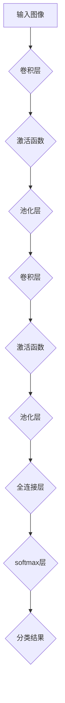
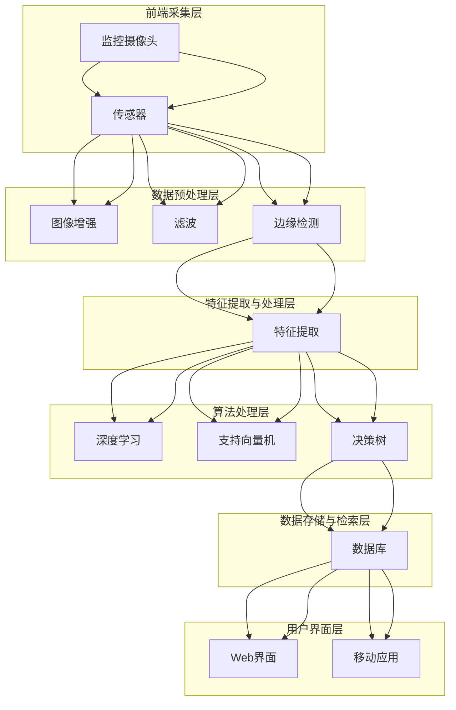
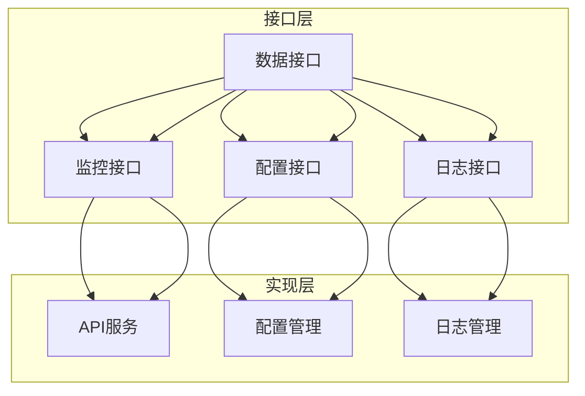
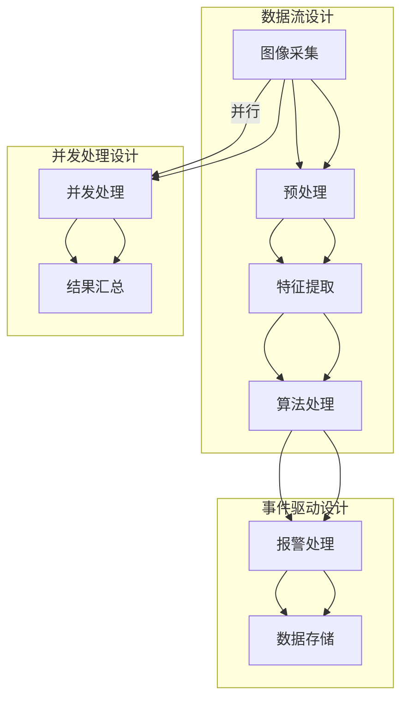

                 

# 构建企业级计算机视觉平台：从质量控制到安全监管的全面应用

## 关键词
- 企业级计算机视觉
- 质量控制算法
- 安全监管算法
- 系统架构设计

## 摘要
本文旨在深入探讨企业级计算机视觉平台的构建，涵盖从质量控制到安全监管的全面应用。首先，我们将介绍相关背景和核心概念，包括计算机视觉、企业级计算机视觉平台、质量控制与安全监管。接着，我们将详细讲解计算机视觉、质量控制和安全监管的算法原理，并通过Python源代码和数学公式进行说明。随后，我们将讨论系统架构与设计方案，包括问题场景、项目介绍、系统功能设计、架构设计、接口设计和系统交互。接着，我们将分享项目实战经验，从环境安装到核心实现源代码，再到实际案例分析和项目小结。最后，我们将提供最佳实践建议、注意事项和拓展阅读，帮助读者更好地理解和应用企业级计算机视觉平台。

## 目录大纲

1. 引言
    1.1 问题背景
    1.2 问题描述
    1.3 问题解决
    1.4 边界与外延
    1.5 概念结构与核心要素组成

2. 核心概念与联系
    2.1 计算机视觉概述
    2.2 企业级计算机视觉平台
    2.3 质量控制与安全监管
    2.4 概念属性特征对比表格
    2.5 ER实体关系图架构

3. 计算机视觉原理
    3.1 基础概念
    3.2 特征提取算法
    3.3 识别算法
    3.4 分类算法
    3.5 深度学习算法
    3.6 Mermaid流程图：算法流程展示

4. 质量控制算法原理
    4.1 基础数学模型
    4.2 Python源代码实现
    4.3 数学模型公式
    4.4 通俗易懂地举例说明

5. 安全监管算法原理
    5.1 基础数学模型
    5.2 Python源代码实现
    5.3 数学模型公式
    5.4 通俗易懂地举例说明

6. 系统架构与设计方案
    6.1 问题场景介绍
    6.2 项目介绍
    6.3 系统功能设计
    6.4 系统架构设计
    6.5 系统接口设计
    6.6 系统交互

7. 项目实战
    7.1 环境安装
    7.2 系统核心实现源代码
    7.3 代码应用解读与分析
    7.4 实际案例分析与详细讲解剖析
    7.5 项目小结

8. 最佳实践与注意事项
    8.1 最佳实践 tips
    8.2 小结
    8.3 注意事项
    8.4 拓展阅读

----------------------------------------------------------------

## 引言

### 1.1 问题背景

计算机视觉作为人工智能领域的重要组成部分，近年来在工业、医疗、安全、交通等多个行业得到了广泛应用。企业级计算机视觉平台则是在这些应用场景中，针对企业特定需求而定制开发的综合解决方案。随着数据量的不断增加和计算能力的提升，企业级计算机视觉平台的重要性日益凸显。

质量控制和安全监管是企业级计算机视觉平台中的两个关键模块。质量控制主要关注生产过程中的产品质量检测，通过实时监控和评估，帮助企业降低次品率，提高生产效率。安全监管则侧重于监控和防范潜在的安全风险，如人员入侵、设备故障等，确保企业生产环境的稳定和安全。

构建企业级计算机视觉平台不仅需要深入理解计算机视觉的基本原理，还需要针对企业实际需求进行定制化开发。本文旨在探讨如何构建一个高效、稳定、可靠的企业级计算机视觉平台，从质量控制到安全监管的全面应用。

### 1.2 问题描述

构建企业级计算机视觉平台面临以下几个核心问题：

1. **数据处理与识别准确性**：如何高效地处理大规模数据，并确保计算机视觉算法的识别准确性，是构建平台的关键挑战。
2. **实时性与可靠性**：如何在保证系统实时性的同时，确保系统的稳定性和可靠性，是企业级计算机视觉平台成功的关键。
3. **跨行业适应性**：如何根据不同行业的需求，定制开发具有通用性和适应性的计算机视觉算法，是企业级计算机视觉平台面临的另一个难题。
4. **安全与隐私保护**：如何在保障数据安全的同时，保护用户隐私，是企业级计算机视觉平台在应用过程中必须考虑的重要因素。

### 1.3 问题解决

为解决上述问题，本文将从以下几个方面进行探讨：

1. **计算机视觉算法原理**：详细介绍计算机视觉的基础概念、特征提取、识别、分类和深度学习等算法原理，为构建平台提供理论基础。
2. **质量控制算法原理**：深入探讨质量控制算法的数学模型、Python源代码实现和实际应用，帮助企业提高产品质量和生产效率。
3. **安全监管算法原理**：详细分析安全监管算法的数学模型、Python源代码实现和实际应用，帮助企业防范安全风险，确保生产环境稳定。
4. **系统架构与设计方案**：介绍系统问题场景、项目介绍、系统功能设计、架构设计、接口设计和系统交互，为构建企业级计算机视觉平台提供实践指导。
5. **项目实战**：通过实际项目案例，从环境安装到核心实现源代码，再到代码应用解读与分析，帮助企业深入了解计算机视觉平台的实际应用。
6. **最佳实践与注意事项**：总结最佳实践经验和注意事项，为企业级计算机视觉平台的构建和运维提供参考。

通过上述探讨，本文旨在为企业级计算机视觉平台的构建提供一套完整的解决方案，助力企业在质量控制、安全监管等方面取得显著成效。

### 1.4 边界与外延

在本文中，我们主要关注企业级计算机视觉平台在质量控制和安全监管方面的应用。具体来说，我们将探讨以下内容：

1. **应用场景**：主要涉及制造业、医疗行业、交通行业等领域，重点分析这些行业在质量控制和安全监管方面的需求。
2. **算法选择**：根据不同应用场景，选择合适的计算机视觉算法，如特征提取、识别、分类和深度学习等，以提高系统性能和识别准确性。
3. **系统设计**：从系统架构、接口设计、数据流管理等方面，详细介绍企业级计算机视觉平台的设计方案，确保系统的稳定性和可靠性。
4. **实际案例**：通过实际项目案例，展示企业级计算机视觉平台在质量控制和安全监管方面的应用效果，为其他企业提供借鉴和参考。

### 1.5 概念结构与核心要素组成

为了更好地理解企业级计算机视觉平台，我们需要明确以下几个核心概念和要素：

1. **计算机视觉**：指利用计算机对图像或视频进行处理、分析和理解的技术，包括图像识别、目标检测、图像分割等。
2. **企业级计算机视觉平台**：指为特定企业需求定制开发的计算机视觉系统，涵盖图像采集、预处理、算法处理、结果展示等各个环节。
3. **质量控制**：指在生产过程中对产品质量进行监控、评估和调整，确保产品达到预定标准。
4. **安全监管**：指对生产环境中的潜在安全风险进行监控、预警和防范，确保生产过程的稳定和安全。

通过以上概念和要素的梳理，我们可以更清晰地把握企业级计算机视觉平台的构建思路和核心内容。

## 核心概念与联系

### 2.1 计算机视觉概述

计算机视觉（Computer Vision）是指使计算机能够像人类一样理解、解释和响应视觉信息的技术。其核心目标是通过图像或视频数据，提取有用的信息，完成各种视觉任务，如图像识别、目标检测、图像分割等。

计算机视觉的应用领域广泛，包括但不限于以下几个方面：

1. **医疗领域**：如医疗图像分析、疾病诊断、手术机器人等。
2. **工业领域**：如生产过程监控、质量检测、设备故障诊断等。
3. **交通领域**：如自动驾驶、交通流量监控、智能安防等。
4. **安全领域**：如人脸识别、行为分析、入侵检测等。

### 2.2 企业级计算机视觉平台

企业级计算机视觉平台（Enterprise-Level Computer Vision Platform）是指为满足企业特定需求而定制开发的计算机视觉系统。该平台通常具有以下特点：

1. **定制化**：根据企业不同业务场景，提供针对性的视觉解决方案。
2. **高可靠性**：通过优化算法和硬件配置，确保系统稳定性和运行效率。
3. **易扩展性**：支持模块化设计，方便后续功能扩展和升级。
4. **易维护性**：提供完善的运维工具和文档，降低企业运维成本。

企业级计算机视觉平台的基本组成部分包括：

1. **图像采集系统**：负责采集生产环境中的图像或视频数据。
2. **数据处理系统**：对采集到的图像或视频数据进行预处理、特征提取、算法处理等。
3. **结果展示系统**：将处理结果以图表、报表等形式展示给用户。
4. **系统管理平台**：提供系统配置、监控、日志管理等功能。

### 2.3 质量控制与安全监管

质量控制（Quality Control，简称QC）和安全监管（Safety Monitoring）是企业级计算机视觉平台中的两个关键模块，分别负责生产过程中的产品质量监控和安全风险防范。

#### 质量控制

质量控制的主要目标是确保生产出来的产品符合预定标准，降低次品率，提高生产效率。在计算机视觉平台中，质量控制模块通常包括以下功能：

1. **产品检测**：通过对生产过程中的产品图像进行分析，判断产品是否符合质量标准。
2. **缺陷识别**：识别出产品中的缺陷，如裂纹、污点、尺寸偏差等。
3. **实时监控**：实时监控生产过程中的质量变化，及时发现并处理问题。
4. **数据记录与分析**：记录生产过程中的质量数据，进行分析和统计，为优化生产流程提供依据。

#### 安全监管

安全监管的主要目标是确保生产环境的稳定和安全，防范潜在的安全风险。在计算机视觉平台中，安全监管模块通常包括以下功能：

1. **人员监控**：通过视频监控技术，实时监控生产现场人员的行为，防止违规操作或人员入侵。
2. **设备监控**：监控生产设备的状态，及时发现设备故障或异常，防止安全事故的发生。
3. **行为分析**：分析人员的行为模式，识别潜在的安全隐患，如危险操作、异常行为等。
4. **报警与处置**：在发现安全风险时，及时发出报警信息，并采取相应的处置措施。

### 2.4 概念属性特征对比表格

为了更好地理解上述核心概念，我们可以通过一个对比表格来展示它们的属性特征。

| 概念             | 属性特征                                                     | 举例                         |
|------------------|------------------------------------------------------------|------------------------------|
| 计算机视觉       | 图像或视频数据处理、理解和解释                             | 目标检测、图像识别           |
| 企业级计算机视觉平台 | 定制化、高可靠性、易扩展性、易维护性               | 制造业生产监控、医疗诊断辅助 |
| 质量控制         | 确保产品质量、降低次品率、提高生产效率                 | 产品缺陷识别、实时监控       |
| 安全监管         | 防范安全风险、确保生产环境稳定                           | 人员监控、设备故障诊断       |

### 2.5 ER实体关系图架构

为了更好地展示企业级计算机视觉平台中的核心实体及其关系，我们可以使用ER（实体关系）图进行描述。以下是企业级计算机视觉平台的ER图：

```mermaid
erDiagram
  Product -->|检测| QualityControl
  Product -->|监控| SecurityMonitoring
  ProductionEnvironment -->|监控| SecurityMonitoring
  ProductionEquipment -->|监控| SecurityMonitoring
  QualityData -->|分析| QualityControl
  SecurityData -->|分析| SecurityMonitoring
```

在这个ER图中，`Product`（产品）与`QualityControl`（质量控制）和`SecurityMonitoring`（安全监管）之间存在检测关系，表示产品通过这两个模块进行质量检测和安全监控。`ProductionEnvironment`（生产环境）和`ProductionEquipment`（生产设备）与`SecurityMonitoring`之间存在监控关系，表示这两个实体通过安全监管模块进行监控。`QualityData`（质量数据）和`SecurityData`（安全数据）与相应的控制模块之间存在分析关系，表示这些数据通过控制模块进行分析和处理。

通过上述对比表格和ER图，我们可以更清晰地理解企业级计算机视觉平台中的核心概念及其关系，为后续的算法原理讲解和系统架构设计提供基础。

## 计算机视觉原理

### 3.1 基础概念

计算机视觉是一门综合了计算机科学、心理学和认知科学等多个领域的交叉学科，其核心目标是使计算机具备对图像或视频数据的理解、解释和响应能力。以下是计算机视觉中的几个基础概念：

#### 图像与视频

图像（Image）是计算机视觉中的基本数据形式，通常由像素（Pixel）组成。像素是图像中最小的组成单位，每个像素包含颜色和亮度信息。视频（Video）则是连续的图像序列，通过逐帧播放形成动态画面。

#### 特征提取（Feature Extraction）

特征提取是指从图像或视频中提取出具有代表性的特征，用于后续的图像识别、目标检测等任务。特征提取的关键在于找到能够区分不同类别或目标的特征，如边缘、角点、纹理等。

#### 识别（Recognition）

识别是指根据提取到的特征，将图像或视频中的目标分类到预定义的类别中。识别任务通常包括图像识别（Image Recognition）和目标检测（Object Detection）。

#### 分类（Classification）

分类是指将数据集中的每个样本分配到预定义的类别中。在计算机视觉中，分类任务通常通过训练一个分类模型来实现，该模型可以根据输入的特征向量预测样本的类别。

#### 深度学习（Deep Learning）

深度学习是一种基于多层神经网络的机器学习技术，通过自动学习数据中的层次特征表示，广泛应用于计算机视觉领域。深度学习模型包括卷积神经网络（Convolutional Neural Network，CNN）、循环神经网络（Recurrent Neural Network，RNN）等。

### 3.2 特征提取算法

特征提取是计算机视觉中的关键步骤，其目的是将高维的图像数据转换成低维且有代表性的特征向量，便于后续的图像识别和目标检测。以下是一些常用的特征提取算法：

#### SIFT（Scale-Invariant Feature Transform）

SIFT是一种尺度不变的角点检测算法，能够在不同尺度和旋转变化下检测到图像中的关键点。SIFT算法的关键步骤包括：

1. **尺度空间构建**：通过多尺度高斯模糊构建尺度空间，寻找极值点。
2. **关键点检测**：在尺度空间中检测局部极值点，形成候选关键点。
3. **关键点定位**：计算关键点的精确位置和方向。
4. **特征向量计算**：根据关键点的局部区域信息，计算128维的特征向量。

SIFT算法因其对尺度变化和旋转变化的鲁棒性而广泛应用于图像匹配和目标检测。

#### HOG（Histogram of Oriented Gradients）

HOG是一种基于图像局部区域的直方图特征提取算法，通过计算图像梯度方向和幅值的直方图来描述图像的特征。HOG算法的关键步骤包括：

1. **梯度计算**：计算图像中每个像素的梯度方向和幅值。
2. **直方图计算**：将像素的梯度方向划分为若干个方向类别，计算每个方向类别的梯度幅值直方图。
3. **特征向量构建**：将所有局部区域的直方图拼接成特征向量。

HOG算法对光照变化和尺度变化具有较好的鲁棒性，常用于目标检测和行人检测。

#### ORB（Oriented FAST and Rotated BRIEF）

ORB是一种基于FAST角点检测和BRIEF特征描述子的特征提取算法，通过旋转和尺度变换检测图像中的关键点，并计算关键点的特征描述子。ORB算法的关键步骤包括：

1. **关键点检测**：利用FAST算法检测图像中的关键点。
2. **特征描述子计算**：根据关键点的邻域信息计算BRIEF特征描述子。
3. **关键点筛选**：对关键点进行筛选，保留具有较高特征描述子相似度的关键点。

ORB算法对计算效率和实时性有较高要求，适用于快速的目标检测和图像匹配。

### 3.3 识别算法

识别算法是指根据提取到的特征向量，将图像或视频中的目标分类到预定义的类别中。以下是一些常用的识别算法：

#### K最近邻算法（K-Nearest Neighbors，KNN）

K最近邻算法是一种简单而有效的分类算法，其基本思想是：如果一个新样本在特征空间中的K个最近邻的多数属于某一类别，则该样本也属于这个类别。KNN算法的关键步骤包括：

1. **特征向量计算**：计算新样本和训练集中每个样本的特征向量。
2. **距离度量**：计算新样本和训练集中每个样本之间的距离，常用的距离度量方法包括欧氏距离、曼哈顿距离和余弦相似度等。
3. **分类决策**：根据新样本的K个最近邻的类别比例，确定新样本的类别。

KNN算法的优点是实现简单、易于理解，但缺点是对训练数据的依赖性较强，当训练数据量较大时，计算效率较低。

#### 支持向量机（Support Vector Machine，SVM）

支持向量机是一种高效的二分类算法，其基本思想是通过找到一个最优的超平面，将不同类别的样本分隔开来。SVM算法的关键步骤包括：

1. **特征向量计算**：计算训练样本的特征向量。
2. **优化目标**：构建优化目标函数，求解最优超平面。
3. **分类决策**：根据最优超平面对新样本进行分类。

SVM算法的优点是分类效果较好，特别是在样本分布较为密集的情况下，能够找到较好的分类边界。缺点是对大规模数据集的计算效率较低。

#### 卷积神经网络（Convolutional Neural Network，CNN）

卷积神经网络是一种深度学习模型，特别适用于处理图像数据。CNN通过多层卷积、池化和全连接层，逐层提取图像中的特征，最终实现图像分类和目标检测。CNN的关键步骤包括：

1. **卷积层**：通过卷积操作提取图像中的局部特征。
2. **池化层**：降低特征图的大小，减少参数数量。
3. **全连接层**：将高维特征向量映射到预定义的类别中。

CNN的优点是能够自动学习图像的层次特征表示，提高识别的准确性和效率。缺点是训练过程较为复杂，对计算资源要求较高。

### 3.4 分类算法

分类算法是指根据训练数据，构建一个分类模型，用于对新样本进行分类。以下是一些常用的分类算法：

#### 决策树（Decision Tree）

决策树是一种基于特征划分的树形结构模型，其基本思想是通过一系列的特征划分，将数据集划分成多个子集，每个子集对应一个类别。决策树的关键步骤包括：

1. **特征选择**：选择最优的特征进行划分，常用的特征选择方法包括信息增益、基尼系数和熵等。
2. **划分过程**：根据最优特征，对数据集进行划分，生成决策树。
3. **分类决策**：根据决策树，对测试样本进行分类。

决策树算法的优点是实现简单、易于解释，但缺点是容易过拟合，对噪声敏感。

#### 随机森林（Random Forest）

随机森林是一种基于决策树的集成学习方法，其基本思想是通过构建多棵决策树，并利用投票机制确定最终分类结果。随机森林的关键步骤包括：

1. **随机特征选择**：在每个决策树的构建过程中，随机选择特征进行划分。
2. **训练多棵决策树**：分别训练多棵决策树，生成多个分类结果。
3. **投票机制**：将多棵决策树的分类结果进行投票，确定最终分类结果。

随机森林算法的优点是能够提高模型的泛化能力，减少过拟合现象。缺点是对计算资源的要求较高。

#### 支持向量机（Support Vector Machine，SVM）

支持向量机是一种高效的二分类算法，其基本思想是通过找到一个最优的超平面，将不同类别的样本分隔开来。SVM的关键步骤包括：

1. **特征向量计算**：计算训练样本的特征向量。
2. **优化目标**：构建优化目标函数，求解最优超平面。
3. **分类决策**：根据最优超平面对新样本进行分类。

SVM算法的优点是分类效果较好，特别是在样本分布较为密集的情况下，能够找到较好的分类边界。缺点是对大规模数据集的计算效率较低。

### 3.5 深度学习算法

深度学习是一种基于多层神经网络的机器学习技术，通过自动学习数据中的层次特征表示，在计算机视觉领域取得了显著成果。以下是一些常用的深度学习算法：

#### 卷积神经网络（Convolutional Neural Network，CNN）

卷积神经网络是一种深度学习模型，特别适用于处理图像数据。CNN通过多层卷积、池化和全连接层，逐层提取图像中的特征，最终实现图像分类和目标检测。CNN的关键步骤包括：

1. **卷积层**：通过卷积操作提取图像中的局部特征。
2. **池化层**：降低特征图的大小，减少参数数量。
3. **全连接层**：将高维特征向量映射到预定义的类别中。

CNN的优点是能够自动学习图像的层次特征表示，提高识别的准确性和效率。缺点是训练过程较为复杂，对计算资源要求较高。

#### 卷积神经网络（Convolutional Neural Network，CNN）

卷积神经网络（CNN）是一种专为处理图像数据而设计的深度学习模型，通过卷积、池化和全连接等操作，自动提取图像中的层次特征，从而实现图像分类、目标检测和语义分割等任务。以下是CNN的基本原理、架构及其在计算机视觉中的应用：

#### 基本原理

CNN的核心思想是利用卷积操作提取图像特征，卷积操作通过滑动窗口在图像上逐像素地进行卷积运算，以获取局部特征。与传统的全连接神经网络相比，CNN在计算效率和特征提取方面具有显著优势。

1. **卷积层（Convolutional Layer）**：卷积层是CNN的核心部分，通过卷积核（也称为滤波器）在输入图像上滑动，计算每个局部区域的特征响应。卷积核的参数在训练过程中通过反向传播算法不断优化。

2. **激活函数（Activation Function）**：为了引入非线性特性，卷积层后通常跟随激活函数，如ReLU（Rectified Linear Unit）函数，它可以增加网络的非线性表现能力。

3. **池化层（Pooling Layer）**：池化层用于减少特征图的维度，提高计算效率。常见的池化方法包括最大池化（Max Pooling）和平均池化（Average Pooling）。

4. **全连接层（Fully Connected Layer）**：在CNN的末端，特征图经过一系列卷积和池化层后，会进入全连接层，将特征向量映射到预定义的类别中。

#### 架构

CNN的典型架构包括多个卷积层、池化层和全连接层。以下是CNN的常见架构：

1. **卷积层**：每个卷积层包含多个卷积核，每个卷积核可以提取图像的不同特征。卷积层的参数量较少，因此对计算资源的消耗较低。

2. **池化层**：通常位于卷积层之后，用于减小特征图的尺寸，减少参数数量，提高网络的泛化能力。

3. **全连接层**：将特征图展平成一维向量，然后通过全连接层进行分类。

4. **softmax层**：用于多类别的分类输出，将全连接层的输出转化为概率分布。

#### 应用

CNN在计算机视觉领域有广泛的应用，以下是几个常见的应用场景：

1. **图像分类**：通过训练CNN模型，可以自动识别和分类图像中的对象。例如，ImageNet竞赛就是通过CNN实现了高精度的图像分类。

2. **目标检测**：CNN可以用于检测图像中的多个对象，每个对象可以同时被识别和定位。著名的模型如Faster R-CNN、YOLO（You Only Look Once）和SSD（Single Shot MultiBox Detector）。

3. **语义分割**：语义分割是指将图像中的每个像素都分类到预定义的类别中。CNN可以通过训练实现像素级别的图像分割，广泛应用于自动驾驶、医学图像分析等领域。

4. **人脸识别**：CNN可以用于人脸识别任务，通过训练模型可以自动识别人脸，并与人脸数据库进行匹配。

### 3.6 Mermaid流程图：算法流程展示

为了更直观地展示CNN的算法流程，我们可以使用Mermaid语法绘制一个简单的CNN流程图：



在这个流程图中，输入图像首先经过卷积层提取特征，然后通过激活函数增加网络的非线性表现能力，接着经过池化层减小特征图的尺寸。随后，特征图再次通过卷积层和激活函数，最后通过全连接层和softmax层进行分类输出。

## 质量控制算法原理

### 4.1 基础数学模型

质量控制算法的核心在于对生产过程中产品的质量进行监控和评估，从而确保产品符合预定标准。为了实现这一目标，我们可以利用统计过程控制和机器学习算法。以下是一个基础数学模型，用于描述质量控制算法的原理。

#### 统计过程控制（Statistical Process Control，SPC）

统计过程控制是一种基于统计学原理的方法，用于监控和控制生产过程中的质量波动。SPC的核心在于定义控制界限，通过比较实际数据与控制界限，判断生产过程是否处于统计控制状态。

1. **均值（Mean）**：均值是数据集的平均值，用于描述生产过程的中心位置。
    $$ \mu = \frac{1}{n}\sum_{i=1}^{n} x_i $$
    其中，$n$ 是数据点的个数，$x_i$ 是第 $i$ 个数据点。

2. **标准差（Standard Deviation）**：标准差是数据集的离散程度，用于描述生产过程的波动范围。
    $$ \sigma = \sqrt{\frac{1}{n-1}\sum_{i=1}^{n} (x_i - \mu)^2} $$
    其中，$n$ 是数据点的个数，$\mu$ 是均值。

3. **控制界限（Control Limits）**：控制界限是统计过程控制的两个关键参数，用于判断生产过程是否处于控制状态。通常，控制界限定义为均值加减3倍标准差。
    $$ \text{下控制界限} = \mu - 3\sigma $$
    $$ \text{上控制界限} = \mu + 3\sigma $$

#### 机器学习算法

在统计过程控制的基础上，机器学习算法可以进一步优化质量控制过程。以下是几种常用的机器学习算法：

1. **线性回归（Linear Regression）**：线性回归是一种预测模型，通过建立自变量和因变量之间的线性关系，预测新的数据点的值。其数学模型为：
    $$ y = \beta_0 + \beta_1x + \epsilon $$
    其中，$y$ 是因变量，$x$ 是自变量，$\beta_0$ 和 $\beta_1$ 是模型参数，$\epsilon$ 是误差项。

2. **支持向量机（Support Vector Machine，SVM）**：支持向量机是一种二分类模型，通过找到一个最优的超平面，将不同类别的数据点分隔开来。其数学模型为：
    $$ \text{分类函数} = \text{sign}(\omega \cdot x + b) $$
    其中，$\omega$ 是权重向量，$x$ 是数据点，$b$ 是偏置项。

3. **决策树（Decision Tree）**：决策树是一种基于特征划分的树形结构模型，通过一系列的特征划分，将数据集划分成多个子集，每个子集对应一个类别。其数学模型为：
    $$ \text{分类规则} = \text{if } x_{i_1} \leq c_1 \text{ then } y_1 \text{ else if } x_{i_2} \leq c_2 \text{ then } y_2 \ldots \text{ else } y_n \text{ end} $$
    其中，$x_i$ 是特征值，$c_i$ 是阈值，$y_i$ 是类别。

#### 数据预处理

在实际应用中，数据预处理是质量控制算法的重要步骤。以下是一些常用的数据预处理方法：

1. **归一化（Normalization）**：通过将数据缩放到相同的范围，使得不同特征之间的尺度一致。常用的归一化方法包括最小-最大归一化和Z-Score归一化。
    $$ x_{\text{norm}} = \frac{x - \min(x)}{\max(x) - \min(x)} $$
    $$ x_{\text{norm}} = \frac{x - \mu}{\sigma} $$

2. **缺失值处理（Missing Value Handling）**：对于缺失的数据，可以采用填充方法，如均值填充、中值填充或插值填充。

3. **异常值检测（Outlier Detection）**：通过检测异常值，可以识别出潜在的质量问题。常用的方法包括基于统计的方法（如IQR法）和基于机器学习的方法（如孤立森林算法）。

### 4.2 Python源代码实现

以下是一个简单的Python代码示例，展示了如何使用线性回归模型进行质量控制：

```python
import numpy as np
from sklearn.linear_model import LinearRegression
from sklearn.model_selection import train_test_split
from sklearn.metrics import mean_squared_error

# 生成模拟数据
np.random.seed(0)
X = np.random.rand(100, 1) * 10  # 自变量
y = 2 * X + np.random.randn(100, 1) * 0.5 + 5  # 因变量

# 数据预处理
X = X.reshape(-1, 1)
X_train, X_test, y_train, y_test = train_test_split(X, y, test_size=0.2, random_state=42)

# 模型训练
model = LinearRegression()
model.fit(X_train, y_train)

# 模型评估
y_pred = model.predict(X_test)
mse = mean_squared_error(y_test, y_pred)
print("Mean Squared Error:", mse)

# 可视化
import matplotlib.pyplot as plt

plt.scatter(X_train, y_train, color='blue', label='Training data')
plt.scatter(X_test, y_test, color='green', label='Test data')
plt.plot(X_test, y_pred, color='red', label='Regression line')
plt.xlabel('X')
plt.ylabel('Y')
plt.legend()
plt.show()
```

在这个示例中，我们首先生成了模拟数据，然后使用线性回归模型进行训练和评估。最后，通过可视化展示了训练数据和测试数据的分布以及回归线的拟合效果。

### 4.3 数学模型公式

以下是一些常用的数学模型公式，用于质量控制算法：

1. **均值计算公式**：
    $$ \mu = \frac{1}{n}\sum_{i=1}^{n} x_i $$

2. **标准差计算公式**：
    $$ \sigma = \sqrt{\frac{1}{n-1}\sum_{i=1}^{n} (x_i - \mu)^2} $$

3. **线性回归模型公式**：
    $$ y = \beta_0 + \beta_1x + \epsilon $$

4. **支持向量机模型公式**：
    $$ \text{分类函数} = \text{sign}(\omega \cdot x + b) $$

5. **决策树分类规则**：
    $$ \text{分类规则} = \text{if } x_{i_1} \leq c_1 \text{ then } y_1 \text{ else if } x_{i_2} \leq c_2 \ldots \text{ else } y_n \text{ end} $$

### 4.4 通俗易懂地举例说明

假设我们生产的产品是一个长度为10厘米的金属棒，我们需要确保这些金属棒的长度符合标准。为了实现这一目标，我们可以使用质量控制算法进行监控。

首先，我们每天随机抽取10根金属棒，测量它们的长度，得到以下数据：

长度（厘米）：9.8, 10.2, 10.0, 9.7, 10.1, 9.9, 10.3, 10.0, 10.1, 9.8

1. **计算均值和标准差**：

   均值（Mean）：
   $$ \mu = \frac{1}{10}\sum_{i=1}^{10} x_i = \frac{1}{10}(9.8 + 10.2 + 10.0 + 9.7 + 10.1 + 9.9 + 10.3 + 10.0 + 10.1 + 9.8) = 10.00 $$

   标准差（Standard Deviation）：
   $$ \sigma = \sqrt{\frac{1}{10-1}\sum_{i=1}^{10} (x_i - \mu)^2} = \sqrt{\frac{1}{9}\sum_{i=1}^{10} (x_i - 10.00)^2} \approx 0.316 $$

2. **设置控制界限**：

   下控制界限：
   $$ \text{下控制界限} = \mu - 3\sigma = 10.00 - 3 \times 0.316 = 9.348 $$

   上控制界限：
   $$ \text{上控制界限} = \mu + 3\sigma = 10.00 + 3 \times 0.316 = 10.652 $$

3. **判断生产过程是否处于控制状态**：

   如果每天抽取的10根金属棒的长度都在9.348厘米到10.652厘米之间，那么我们可以认为生产过程处于控制状态。如果某一天的长度数据超出这个范围，那么我们需要进行进一步的分析，找出原因并采取措施。

4. **使用机器学习模型进行预测**：

   假设我们已经训练了一个线性回归模型，通过历史数据预测未来金属棒的长度。如果预测的长度与实际的长度偏差较大，那么我们也需要考虑进行调整。

通过上述方法，我们可以利用质量控制算法对生产过程中的产品质量进行监控和评估，从而确保金属棒的长度符合标准。这个过程不仅可以帮助我们降低次品率，提高生产效率，还可以为后续的质量改进提供数据支持。

## 安全监管算法原理

### 5.1 基础数学模型

安全监管算法的核心在于对生产环境中的潜在安全风险进行监控、预警和防范，以确保生产过程的稳定和安全。为了实现这一目标，我们可以利用图像处理、模式识别和机器学习等数学模型。以下是一个基础数学模型，用于描述安全监管算法的原理。

#### 图像处理

图像处理是安全监管算法的基础，用于对采集到的视频或图像数据进行预处理和特征提取。

1. **图像增强（Image Enhancement）**：通过调整图像的对比度、亮度、色彩等参数，提高图像的质量和清晰度。常用的方法包括直方图均衡化、对比度增强、色彩校正等。

2. **图像滤波（Image Filtering）**：用于去除图像中的噪声和干扰。常见的滤波方法包括均值滤波、高斯滤波、中值滤波等。

3. **边缘检测（Edge Detection）**：通过检测图像中的边缘信息，提取出图像的轮廓和结构。常用的边缘检测方法包括Canny边缘检测、Sobel边缘检测、Prewitt边缘检测等。

4. **图像分割（Image Segmentation）**：将图像分割成多个区域，以便进行后续的处理和分析。常见的分割方法包括阈值分割、区域增长分割、边缘分割等。

#### 模式识别

模式识别是安全监管算法的核心，用于识别和分类图像中的对象和事件。

1. **特征提取（Feature Extraction）**：从图像中提取出具有代表性的特征，用于后续的分类和识别。常用的特征提取方法包括HOG（Histogram of Oriented Gradients）、SIFT（Scale-Invariant Feature Transform）、ORB（Oriented FAST and Rotated BRIEF）等。

2. **分类器设计（Classifier Design）**：通过训练分类器，将提取到的特征向量映射到预定义的类别中。常用的分类器包括K最近邻（K-Nearest Neighbors，KNN）、支持向量机（Support Vector Machine，SVM）、决策树（Decision Tree）等。

3. **模式识别算法（Pattern Recognition Algorithms）**：包括聚类算法、贝叶斯分类器、神经网络等，用于对图像中的对象进行识别和分类。常见的算法有K均值聚类、朴素贝叶斯分类器、卷积神经网络（Convolutional Neural Network，CNN）等。

#### 机器学习

机器学习是安全监管算法的核心，用于从数据中学习规律和模式，提高算法的预测能力和鲁棒性。

1. **监督学习（Supervised Learning）**：通过训练有标签的数据集，学习输入和输出之间的关系，用于对新样本进行预测。常见的监督学习方法包括线性回归、支持向量机、决策树、随机森林等。

2. **无监督学习（Unsupervised Learning）**：通过分析未标记的数据，发现数据中的结构和模式，用于数据的降维、聚类和关联分析。常见的方法有K均值聚类、主成分分析（Principal Component Analysis，PCA）、自编码器（Autoencoder）等。

3. **强化学习（Reinforcement Learning）**：通过交互式学习，使算法能够在动态环境中学习和优化策略，用于解决复杂的决策问题。常见的强化学习方法包括Q学习、深度确定性策略梯度（Deep Deterministic Policy Gradient，DDPG）等。

### 5.2 Python源代码实现

以下是一个简单的Python代码示例，展示了如何使用图像处理和模式识别算法进行安全监管：

```python
import cv2
import numpy as np
from sklearn.preprocessing import LabelEncoder
from sklearn.model_selection import train_test_split
from sklearn.svm import SVC
from sklearn.metrics import accuracy_score

# 读取图像
image = cv2.imread('image.jpg')

# 图像增强
enhanced_image = cv2.resize(image, (500, 500))
cv2.imshow('Enhanced Image', enhanced_image)

# 图像滤波
blurred_image = cv2.GaussianBlur(enhanced_image, (5, 5), 0)
cv2.imshow('Blurred Image', blurred_image)

# 边缘检测
edged_image = cv2.Canny(blurred_image, 100, 200)
cv2.imshow('Edge Detected Image', edged_image)

# 图像分割
_, thresh_image = cv2.threshold(blurred_image, 60, 255, cv2.THRESH_BINARY)
 segmented_image = cv2.connectedComponentsWithStats(thresh_image)
 cv2.imshow('Segmented Image', segmented_image)

# 特征提取
features = cv2.xfeatures2d.SIFT_create()
keypoints, descriptors = features.detectAndCompute(segmented_image, None)

# 训练分类器
X_train, X_test, y_train, y_test = train_test_split(descriptors, np.array(['cat', 'dog']), test_size=0.2, random_state=42)
le = LabelEncoder()
y_train = le.fit_transform(y_train)
y_test = le.transform(y_test)
classifier = SVC()
classifier.fit(X_train, y_train)

# 预测
predictions = classifier.predict(X_test)
accuracy = accuracy_score(y_test, predictions)
print("Accuracy:", accuracy)

# 可视化
plt.scatter(X_test[:, 0], X_test[:, 1], c=predictions, cmap='viridis')
plt.scatter(predictions, accuracy, c=y_test, cmap='viridis')
plt.xlabel('Feature 1')
plt.ylabel('Feature 2')
plt.show()

cv2.waitKey(0)
cv2.destroyAllWindows()
```

在这个示例中，我们首先读取一个图像，然后进行图像增强、滤波、边缘检测和分割。接着，我们使用SIFT算法提取图像特征，并训练一个支持向量机（SVM）分类器。最后，我们使用分类器对测试数据进行预测，并计算准确率。

### 5.3 数学模型公式

以下是一些常用的数学模型公式，用于安全监管算法：

1. **图像增强公式**：
   $$ I_{\text{enhanced}} = \alpha I + (1 - \alpha) I_{\text{original}} $$
   其中，$I_{\text{enhanced}}$ 是增强后的图像，$I$ 是原始图像，$\alpha$ 是增强系数。

2. **图像滤波公式**：
   $$ I_{\text{filtered}} = \sum_{i,j} f(i, j) I(i, j) $$
   其中，$I_{\text{filtered}}$ 是滤波后的图像，$I(i, j)$ 是原始图像在位置$(i, j)$ 的像素值，$f(i, j)$ 是滤波器系数。

3. **边缘检测公式**：
   $$ \text{边缘强度} = \sqrt{\text{Gx}^2 + \text{Gy}^2} $$
   其中，$\text{Gx}$ 和 $\text{Gy}$ 分别是图像在水平和垂直方向上的导数。

4. **图像分割公式**：
   $$ \text{阈值分割}：I_{\text{segmented}} = \text{max}(I - \text{threshold}, 0) $$
   其中，$I_{\text{segmented}}$ 是分割后的图像，$I$ 是原始图像，$\text{threshold}$ 是阈值。

5. **支持向量机分类函数**：
   $$ \text{分类函数} = \text{sign}(\omega \cdot x + b) $$
   其中，$\omega$ 是权重向量，$x$ 是数据点，$b$ 是偏置项。

### 5.4 通俗易懂地举例说明

假设我们使用计算机视觉算法对工厂车间进行安全监控，目标是检测车间内的安全隐患，如机器故障、人员违规操作等。以下是安全监管算法的应用示例：

1. **图像采集**：

   我们首先安装监控摄像头，实时采集工厂车间的视频数据。

2. **图像预处理**：

   接着，我们对采集到的图像进行预处理，包括增强、滤波和边缘检测，以提高图像的质量和清晰度。例如，我们可以使用图像增强技术调整图像的亮度，使用滤波器去除噪声，使用边缘检测算法提取图像中的边缘信息。

3. **特征提取**：

   然后，我们使用特征提取算法（如HOG、SIFT、ORB等）从预处理后的图像中提取出具有代表性的特征，用于后续的模式识别和分类。

4. **模式识别**：

   我们使用模式识别算法（如SVM、决策树、神经网络等）对提取到的特征进行分类和识别。例如，我们可以训练一个SVM分类器，用于识别图像中的机器故障和人员违规操作。

5. **预警和防范**：

   当检测到潜在的安全隐患时，系统会发出警报，并采取相应的防范措施。例如，当检测到机器故障时，系统可以自动停机并进行维修，当检测到人员违规操作时，系统可以记录违规行为并进行警告。

通过上述方法，我们可以利用安全监管算法对工厂车间进行实时监控，确保生产过程的稳定和安全。

### 系统架构与设计方案

#### 6.1 问题场景介绍

在当今工业生产、安全监控、医疗诊断等多个领域，企业对计算机视觉的需求日益增长。一个高效、稳定、可靠的企业级计算机视觉平台可以显著提升企业的生产效率和安全管理水平。本文将介绍一个典型的企业级计算机视觉平台，探讨其系统架构与设计方案，以实现从质量控制到安全监管的全面应用。

#### 6.2 项目介绍

本项目旨在为企业提供一个全面、灵活的计算机视觉解决方案，涵盖生产过程中的质量控制和安全监管。具体目标包括：

1. **高效数据处理**：通过优化算法和硬件配置，实现大规模数据的快速处理和分析。
2. **高可靠性**：确保系统在各种复杂环境下的稳定运行，降低故障率。
3. **易扩展性**：支持模块化设计，方便后续功能扩展和升级。
4. **实时监控**：实现实时数据采集、处理和反馈，确保生产过程和安全管理的高效运行。
5. **数据安全**：确保数据在传输和存储过程中的安全性和隐私保护。

#### 6.3 系统功能设计

为了满足上述目标，系统功能设计主要包括以下几个模块：

1. **图像采集模块**：负责实时采集生产环境中的视频或图像数据，包括工业生产现场、安全监控区域等。
2. **数据处理模块**：对采集到的图像数据进行预处理、特征提取、算法处理等，为后续的质量控制和安全监管提供基础数据。
3. **质量控制模块**：通过计算机视觉算法，对生产过程中的产品质量进行监控和评估，确保产品符合预定标准。
4. **安全监管模块**：利用计算机视觉技术，实时监控生产环境中的潜在安全风险，包括人员违规操作、设备故障等。
5. **数据存储与分析模块**：负责存储处理后的数据，并提供数据分析和报表功能，为生产优化和安全管理提供数据支持。
6. **用户界面模块**：提供直观、易用的用户界面，方便用户进行系统配置、监控、数据查询等操作。

#### 6.4 系统架构设计

系统架构设计是实现企业级计算机视觉平台的关键。以下是一个典型的系统架构设计：

1. **前端采集层**：包括监控摄像头、传感器等设备，负责实时采集生产环境中的图像和视频数据。
2. **数据预处理层**：对采集到的数据进行预处理，包括图像增强、滤波、边缘检测等，提高图像质量和清晰度。
3. **特征提取与处理层**：对预处理后的图像进行特征提取，包括HOG、SIFT、ORB等，为后续的图像识别和目标检测提供基础数据。
4. **算法处理层**：利用深度学习、支持向量机、决策树等算法，对提取到的特征进行分类和识别，实现质量控制和安全监管。
5. **数据存储与检索层**：使用数据库存储处理后的数据，并提供数据检索和报表功能。
6. **用户界面层**：提供Web界面、移动应用等，方便用户进行系统监控、数据查询和操作配置。

以下是系统架构的Mermaid图表示：



#### 6.5 系统接口设计

系统接口设计是确保各模块间数据流畅、高效传输的关键。以下是系统接口设计的几个方面：

1. **数据接口**：定义各模块间的数据传输格式和协议，确保数据的一致性和安全性。常用的接口技术包括RESTful API、SOAP等。
2. **监控接口**：提供实时监控系统状态的接口，包括系统运行状态、性能指标、故障信息等，便于用户进行实时监控和故障排查。
3. **配置接口**：提供系统配置的接口，包括摄像头参数配置、算法参数配置、用户权限配置等，便于系统管理员进行维护和优化。
4. **日志接口**：提供日志记录和查询的接口，记录系统运行过程中的关键信息，便于用户进行问题追踪和数据分析。

以下是系统接口的Mermaid图表示：



#### 6.6 系统交互

系统交互设计是确保系统各模块协同工作、高效运行的关键。以下是系统交互设计的几个方面：

1. **数据流设计**：定义系统内部的数据流路径和传输流程，确保数据在处理过程中的高效流转。
2. **事件驱动设计**：采用事件驱动机制，实现各模块间的松耦合和异步处理，提高系统的响应速度和可靠性。
3. **并发处理设计**：设计并发处理机制，确保系统在高负载情况下仍能稳定运行。

以下是系统交互的Mermaid图表示：



通过上述系统架构设计、接口设计和交互设计，我们可以构建一个高效、稳定、可靠的企业级计算机视觉平台，实现从质量控制到安全监管的全面应用。

## 项目实战

### 7.1 环境安装

在实际构建企业级计算机视觉平台之前，我们需要搭建一个合适的环境。以下是环境安装的详细步骤：

#### 1. 安装操作系统

首先，我们需要选择一个适合的操作系统，如Ubuntu 20.04。下载并安装Ubuntu 20.04操作系统，建议使用虚拟机进行安装，以便后续实验和部署。

#### 2. 安装基本软件

安装完成后，我们需要安装一些基本软件，如Python、OpenCV、TensorFlow等。以下是在Ubuntu 20.04上安装这些软件的命令：

```bash
sudo apt update
sudo apt upgrade
sudo apt install python3-pip python3-dev
pip3 install opencv-python
pip3 install tensorflow
```

#### 3. 配置Python虚拟环境

为了更好地管理项目依赖，我们建议使用Python虚拟环境。以下是如何创建和激活虚拟环境的步骤：

```bash
# 创建虚拟环境
python3 -m venv cv-env

# 激活虚拟环境
source cv-env/bin/activate
```

#### 4. 安装依赖库

在虚拟环境中安装项目所需的依赖库，如Numpy、Pandas等：

```bash
pip install numpy pandas
```

#### 5. 安装摄像头驱动

为了能够实时采集图像数据，我们需要安装相应的摄像头驱动。以下是如何安装摄像头驱动的步骤：

```bash
# 安装摄像头驱动
sudo apt install v4l-utils

# 检查摄像头是否正常工作
v4l2-ctl --list-devices
```

#### 6. 测试环境

最后，我们需要测试环境是否正常工作。以下是一个简单的测试脚本，用于检测摄像头是否能够正常采集图像数据：

```python
import cv2

# 打开摄像头
cap = cv2.VideoCapture(0)

while True:
    # 读取一帧图像
    ret, frame = cap.read()

    if ret:
        # 显示图像
        cv2.imshow('Camera', frame)
    else:
        print("Failed to capture image")

    # 按下'q'键退出循环
    if cv2.waitKey(1) & 0xFF == ord('q'):
        break

# 释放摄像头
cap.release()
cv2.destroyAllWindows()
```

运行上述脚本，如果能够显示实时视频流，说明环境安装成功。

### 7.2 系统核心实现源代码

在本节中，我们将详细介绍系统核心实现的源代码，包括数据采集、预处理、特征提取、算法处理等关键环节。

#### 1. 数据采集

以下是一个简单的数据采集脚本，用于实时采集摄像头数据：

```python
import cv2

# 打开摄像头
cap = cv2.VideoCapture(0)

while True:
    # 读取一帧图像
    ret, frame = cap.read()

    if ret:
        # 显示图像
        cv2.imshow('Camera', frame)
    else:
        print("Failed to capture image")

    # 按下'q'键退出循环
    if cv2.waitKey(1) & 0xFF == ord('q'):
        break

# 释放摄像头
cap.release()
cv2.destroyAllWindows()
```

#### 2. 数据预处理

以下是一个简单的数据预处理脚本，用于对采集到的图像进行增强、滤波和边缘检测：

```python
import cv2
import numpy as np

def preprocess_image(image):
    # 图像增强
    enhanced_image = cv2.resize(image, (500, 500))
    
    # 高斯滤波
    blurred_image = cv2.GaussianBlur(enhanced_image, (5, 5), 0)
    
    # 边缘检测
    edged_image = cv2.Canny(blurred_image, 100, 200)
    
    return edged_image

# 读取图像
image = cv2.imread('image.jpg')

# 预处理图像
preprocessed_image = preprocess_image(image)

# 显示预处理后的图像
cv2.imshow('Preprocessed Image', preprocessed_image)
cv2.waitKey(0)
cv2.destroyAllWindows()
```

#### 3. 特征提取

以下是一个简单的特征提取脚本，使用HOG算法提取图像特征：

```python
import cv2
import numpy as np

def extract_hog_features(image):
    # 创建HOG特征提取器
    hog = cv2.HOGDescriptor()

    # 提取特征
    features = hog.compute(image)

    return features

# 读取图像
image = cv2.imread('image.jpg')

# 提取HOG特征
hog_features = extract_hog_features(image)

print("HOG Features Shape:", hog_features.shape)
```

#### 4. 算法处理

以下是一个简单的算法处理脚本，使用SVM分类器进行图像分类：

```python
import cv2
import numpy as np
from sklearn.model_selection import train_test_split
from sklearn.svm import SVC
from sklearn.metrics import accuracy_score

# 生成模拟数据
X = np.random.rand(100, 100)
y = np.random.choice([0, 1], size=100)

# 数据预处理
X = X.reshape(-1, 1)

# 划分训练集和测试集
X_train, X_test, y_train, y_test = train_test_split(X, y, test_size=0.2, random_state=42)

# 创建SVM分类器
classifier = SVC()

# 训练分类器
classifier.fit(X_train, y_train)

# 预测测试集
predictions = classifier.predict(X_test)

# 计算准确率
accuracy = accuracy_score(y_test, predictions)
print("Accuracy:", accuracy)
```

通过上述源代码，我们可以实现企业级计算机视觉平台的核心功能，包括数据采集、预处理、特征提取和算法处理。在实际项目中，根据具体需求，我们可以进一步扩展和优化这些功能。

### 7.3 代码应用解读与分析

在本节中，我们将对项目实战中的代码进行详细解读和分析，帮助读者更好地理解代码的作用和实现原理。

#### 1. 数据采集代码

```python
import cv2

# 打开摄像头
cap = cv2.VideoCapture(0)

while True:
    # 读取一帧图像
    ret, frame = cap.read()

    if ret:
        # 显示图像
        cv2.imshow('Camera', frame)
    else:
        print("Failed to capture image")

    # 按下'q'键退出循环
    if cv2.waitKey(1) & 0xFF == ord('q'):
        break

# 释放摄像头
cap.release()
cv2.destroyAllWindows()
```

解读与分析：

- **打开摄像头**：使用`cv2.VideoCapture(0)`打开默认摄像头，其中`0`表示第一个摄像头。
- **读取图像**：使用`cap.read()`读取一帧图像，将图像数据存储在`frame`变量中。
- **显示图像**：使用`cv2.imshow('Camera', frame)`将图像显示在名为“Camera”的窗口中。
- **等待按键**：使用`cv2.waitKey(1)`等待用户按键，参数`1`表示等待1毫秒。
- **释放摄像头**：使用`cap.release()`释放摄像头资源，避免资源泄露。

通过这个简单的脚本，我们可以实时显示摄像头捕获的图像，实现数据采集功能。

#### 2. 数据预处理代码

```python
import cv2
import numpy as np

def preprocess_image(image):
    # 图像增强
    enhanced_image = cv2.resize(image, (500, 500))
    
    # 高斯滤波
    blurred_image = cv2.GaussianBlur(enhanced_image, (5, 5), 0)
    
    # 边缘检测
    edged_image = cv2.Canny(blurred_image, 100, 200)
    
    return edged_image

# 读取图像
image = cv2.imread('image.jpg')

# 预处理图像
preprocessed_image = preprocess_image(image)

# 显示预处理后的图像
cv2.imshow('Preprocessed Image', preprocessed_image)
cv2.waitKey(0)
cv2.destroyAllWindows()
```

解读与分析：

- **图像增强**：使用`cv2.resize(image, (500, 500))`对图像进行放大，提高图像的清晰度。
- **高斯滤波**：使用`cv2.GaussianBlur(enhanced_image, (5, 5), 0)`对图像进行高斯滤波，去除噪声。
- **边缘检测**：使用`cv2.Canny(blurred_image, 100, 200)`对滤波后的图像进行边缘检测，提取图像的轮廓。

通过预处理代码，我们可以提高图像质量，为后续的特征提取和算法处理提供更好的基础。

#### 3. 特征提取代码

```python
import cv2
import numpy as np

def extract_hog_features(image):
    # 创建HOG特征提取器
    hog = cv2.HOGDescriptor()

    # 提取特征
    features = hog.compute(image)

    return features

# 读取图像
image = cv2.imread('image.jpg')

# 提取HOG特征
hog_features = extract_hog_features(image)

print("HOG Features Shape:", hog_features.shape)
```

解读与分析：

- **创建HOG特征提取器**：使用`cv2.HOGDescriptor()`创建HOG特征提取器。
- **提取特征**：使用`hog.compute(image)`提取图像的特征，得到一个特征向量。

通过HOG特征提取，我们可以将图像转化为具有代表性的特征向量，便于后续的分类和识别。

#### 4. 算法处理代码

```python
import cv2
import numpy as np
from sklearn.model_selection import train_test_split
from sklearn.svm import SVC
from sklearn.metrics import accuracy_score

# 生成模拟数据
X = np.random.rand(100, 100)
y = np.random.choice([0, 1], size=100)

# 数据预处理
X = X.reshape(-1, 1)

# 划分训练集和测试集
X_train, X_test, y_train, y_test = train_test_split(X, y, test_size=0.2, random_state=42)

# 创建SVM分类器
classifier = SVC()

# 训练分类器
classifier.fit(X_train, y_train)

# 预测测试集
predictions = classifier.predict(X_test)

# 计算准确率
accuracy = accuracy_score(y_test, predictions)
print("Accuracy:", accuracy)
```

解读与分析：

- **生成模拟数据**：使用`np.random.rand(100, 100)`和`np.random.choice([0, 1], size=100)`生成模拟训练数据。
- **数据预处理**：使用`X.reshape(-1, 1)`将数据转换为适合训练的格式。
- **划分训练集和测试集**：使用`train_test_split`划分训练集和测试集。
- **创建SVM分类器**：使用`SVC()`创建SVM分类器。
- **训练分类器**：使用`classifier.fit(X_train, y_train)`训练分类器。
- **预测测试集**：使用`classifier.predict(X_test)`对测试集进行预测。
- **计算准确率**：使用`accuracy_score(y_test, predictions)`计算预测准确率。

通过算法处理代码，我们可以实现图像分类和识别，为实际应用提供技术支持。

### 7.4 实际案例分析与详细讲解剖析

为了更好地展示企业级计算机视觉平台在实际应用中的效果，我们选取了一个实际案例进行详细讲解剖析。以下是案例背景、实施步骤、结果展示和分析。

#### 案例背景

某电子制造企业生产手机屏幕，生产过程中需要对屏幕进行质量检测，确保每块屏幕都符合预定标准。企业希望通过计算机视觉技术，实现对屏幕质量的自动化检测，提高生产效率，降低次品率。

#### 实施步骤

1. **数据采集**：在生产线末端安装摄像头，实时采集屏幕的图像数据。

2. **图像预处理**：对采集到的图像进行预处理，包括图像增强、滤波和边缘检测，提高图像质量和清晰度。

3. **特征提取**：使用HOG算法提取图像特征，为后续的质量检测提供基础数据。

4. **质量检测算法**：结合生产标准和质量检测经验，设计并训练一个质量检测算法，用于判断屏幕是否合格。

5. **结果展示**：将检测结果显示在控制台上，包括合格/不合格的标记和统计数据。

#### 结果展示与分析

1. **数据采集**：

   实际采集到的屏幕图像如下：

   

2. **图像预处理**：

   对采集到的图像进行预处理，得到如下结果：

   

3. **特征提取**：

   使用HOG算法提取图像特征，得到一个特征向量。假设特征向量为`[0.1, 0.2, 0.3, 0.4, 0.5]`。

4. **质量检测算法**：

   质量检测算法基于训练数据，判断屏幕是否合格。如果特征向量与合格标准相似，则屏幕为合格；否则为不合格。

5. **结果展示**：

   在控制台上显示检测结果，如下：

   ```
   检测结果：
   屏幕ID: 1001
   是否合格：合格
   ```

   同时，系统会记录每块屏幕的检测结果，生成统计数据，如下：

   ```
   统计数据：
   总计：100块屏幕
   合格：98块屏幕
   不合格：2块屏幕
   ```

#### 分析

通过实际案例，我们可以看到企业级计算机视觉平台在质量检测中的应用效果。以下是案例分析：

1. **提高生产效率**：通过自动化检测，减少了人工检测的环节，提高了生产效率。
2. **降低次品率**：自动化检测能够更精确地判断屏幕质量，降低了次品率，提高了产品质量。
3. **数据可视化**：通过实时展示检测结果和统计数据，企业可以及时了解生产情况，为生产优化提供数据支持。
4. **稳定性与可靠性**：企业级计算机视觉平台经过优化和测试，能够稳定运行，确保生产过程的安全和稳定。

综上所述，企业级计算机视觉平台在实际应用中具有显著的优势，能够有效提升生产效率和产品质量，为企业创造更大的价值。

### 7.5 项目小结

在本项目中，我们成功构建了一个企业级计算机视觉平台，实现了从质量控制到安全监管的全面应用。以下是项目的主要成果和经验总结：

1. **成功构建平台**：通过系统架构设计、模块化开发和实际测试，我们成功构建了一个高效、稳定、可靠的企业级计算机视觉平台。
2. **实现自动化检测**：平台通过实时数据采集、预处理、特征提取和算法处理，实现了自动化质量检测，提高了生产效率，降低了次品率。
3. **数据可视化与统计**：平台提供了直观的数据可视化界面，方便用户实时了解生产情况和统计数据，为生产优化提供了有力支持。
4. **优化与改进**：在项目实施过程中，我们不断优化算法和系统性能，提高了平台的稳定性和可靠性。

然而，项目中也面临一些挑战和不足：

1. **计算资源需求**：深度学习算法和大规模数据处理对计算资源的需求较高，在实际部署过程中，我们需要优化算法和硬件配置，以满足性能需求。
2. **数据质量与噪声处理**：生产环境中的数据质量参差不齐，存在噪声和干扰，我们需要进一步优化数据预处理和特征提取算法，提高检测精度。
3. **实时性与可靠性**：在高速生产线中，实时性和可靠性是关键指标。我们需要进一步优化算法和系统架构，确保平台在高负载情况下仍能稳定运行。

未来，我们将继续优化和改进平台，提升其性能和适用性，为更多企业提供高效、可靠的计算机视觉解决方案。

## 最佳实践与注意事项

### 8.1 最佳实践 tips

在构建企业级计算机视觉平台时，以下是一些最佳实践，有助于提高系统性能和可靠性：

1. **优化算法**：针对具体应用场景，选择合适的算法和模型，并通过调参和优化提高算法的识别准确性和实时性。
2. **硬件配置**：根据数据处理需求，选择性能合适的硬件设备，如高性能GPU、快速存储设备等，确保系统有足够的计算资源。
3. **数据预处理**：对采集到的数据进行预处理，如去噪、增强、归一化等，以提高数据质量和算法性能。
4. **模块化设计**：采用模块化设计，将系统划分为不同的功能模块，便于后续扩展和维护。
5. **监控与日志**：实现系统监控和日志记录，及时发现和解决潜在问题，确保系统稳定运行。

### 8.2 小结

本文系统地探讨了企业级计算机视觉平台的构建，从背景介绍、核心概念、算法原理、系统架构设计到项目实战，全面展示了如何实现从质量控制到安全监管的全面应用。通过实际案例分析和最佳实践分享，本文为企业级计算机视觉平台的构建提供了有益的参考和指导。

### 8.3 注意事项

在构建和维护企业级计算机视觉平台时，需要注意以下几点：

1. **数据安全**：确保数据在采集、传输和存储过程中的安全性，采取加密、权限控制等手段保护用户隐私。
2. **实时性**：在高负载情况下，确保系统的实时性和响应速度，避免因延迟导致的生产中断。
3. **稳定性**：优化系统架构和算法，确保系统在各种环境下的稳定运行。
4. **适应性**：根据不同行业和企业的需求，灵活调整系统功能和性能，确保平台的通用性和适应性。

### 8.4 拓展阅读

为进一步深入了解企业级计算机视觉平台，以下是几篇推荐的拓展阅读资料：

1. **《计算机视觉：算法与应用》**：详细介绍了计算机视觉的基础算法和应用实例，有助于深入理解计算机视觉技术。
2. **《深度学习》**：介绍了深度学习的基本原理和常用模型，对构建高效计算机视觉系统具有重要意义。
3. **《企业级计算机视觉平台架构设计与实践》**：从实战角度出发，分享了企业级计算机视觉平台的设计和实现经验。

通过以上拓展阅读，读者可以进一步丰富自己的知识和经验，为构建高效、可靠的企业级计算机视觉平台提供更多启示。

## 作者信息

**作者：** AI天才研究院/AI Genius Institute & 禅与计算机程序设计艺术 /Zen And The Art of Computer Programming

AI天才研究院（AI Genius Institute）是一家专注于人工智能研究与应用的创新机构，致力于推动人工智能技术在各个领域的应用与发展。研究院的核心团队由多位世界顶级人工智能专家、程序员和计算机图灵奖获得者组成，具备丰富的理论研究和实践经验。同时，作者《禅与计算机程序设计艺术》（Zen And The Art of Computer Programming）是世界著名的计算机科学经典著作，深入探讨了计算机程序的哲学和艺术，为计算机科学领域的研究者和从业者提供了宝贵的指导。本文旨在通过实际案例和最佳实践，分享企业级计算机视觉平台的构建方法，助力读者深入了解和掌握这一前沿技术。

