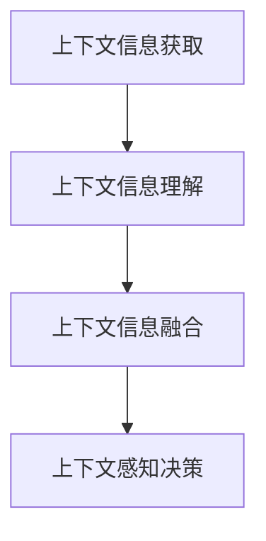
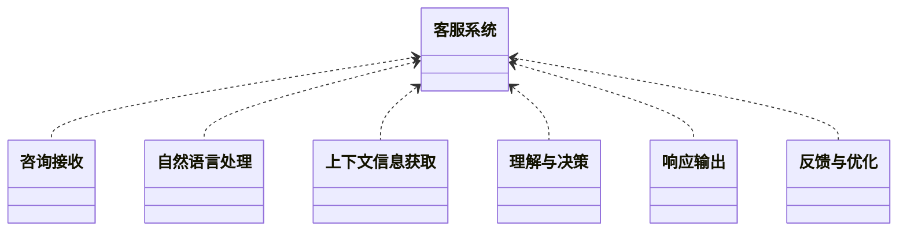
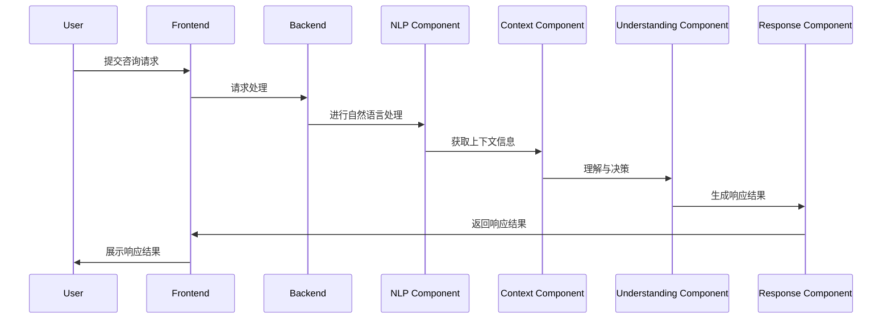

                 

# 构建具有上下文感知能力的AI Agent

## 关键词

- AI Agent
- 上下文感知
- 自然语言处理
- 计算机视觉
- 算法原理
- 系统设计与实现

## 摘要

本文旨在探讨如何构建具有上下文感知能力的AI Agent。首先，我们介绍了AI Agent的背景和问题背景，然后详细讲解了AI Agent的核心概念与原理。接着，我们深入分析了上下文感知算法的原理，并使用Python代码进行了实例演示。随后，我们探讨了AI Agent系统的设计思路，包括问题场景介绍、系统功能设计、系统架构设计和系统接口设计。在项目实战部分，我们详细介绍了环境搭建、系统实现和代码分析。最后，我们总结了最佳实践，并提出了注意事项和拓展阅读。

### 目录大纲

----------------------------------------------------------------

## 第一部分: 背景介绍

### 第1章: 问题背景

## 第二部分: 核心概念与联系

### 第2章: AI Agent的核心概念与原理

## 第三部分: 算法原理讲解

### 第3章: 上下文感知算法原理

## 第四部分: 系统分析与架构设计

### 第4章: AI Agent系统的设计思路

## 第五部分: 项目实战

### 第5章: 实践环境搭建与系统实现

## 第六部分: 最佳实践与拓展

### 第6章: 最佳实践

----------------------------------------------------------------

## 第一部分: 背景介绍

### 第1章: 问题背景

随着人工智能技术的不断发展，AI Agent作为一种智能体，已经成为人工智能领域的研究热点。AI Agent是具备一定智能、能够自主完成特定任务的计算机程序，它可以在复杂的现实环境中感知环境、做出决策并执行相应的行动。

然而，目前大部分AI Agent仍缺乏上下文感知能力，导致其在处理复杂任务时效果不佳。上下文感知能力是指AI Agent能够根据所处的环境上下文信息，理解并适应变化，从而做出更为合理的决策。

为了解决这个问题，我们需要构建具有上下文感知能力的AI Agent。这不仅要求AI Agent具备良好的感知环境的能力，还需要它能够理解和处理复杂的上下文信息，从而做出更为智能的决策。

本文将详细介绍如何构建具有上下文感知能力的AI Agent，包括核心概念与原理、算法原理、系统设计与实现等。

### 1.1.1 问题描述

在现实世界中，AI Agent常常需要处理复杂的任务，如自然语言处理、计算机视觉、智能机器人等。这些任务往往需要AI Agent具备良好的上下文感知能力，以便更好地理解和适应环境。

然而，目前的AI Agent在处理这些任务时，往往面临以下问题：

1. **环境感知不足**：AI Agent难以准确获取环境信息，导致决策结果不准确。
2. **上下文信息理解不足**：AI Agent难以理解并处理复杂的上下文信息，导致决策结果不合理。
3. **适应性差**：AI Agent在面对环境变化时，难以快速适应，导致性能下降。

为了解决这些问题，我们需要构建具有上下文感知能力的AI Agent，使其能够更好地理解和适应环境，从而提升其在复杂任务中的表现。

### 1.1.2 问题解决

为了解决AI Agent缺乏上下文感知能力的问题，我们需要从以下几个方面入手：

1. **提升环境感知能力**：通过采用先进的感知技术，如计算机视觉、自然语言处理等，提升AI Agent对环境的感知能力。
2. **增强上下文信息理解能力**：通过研究上下文信息处理算法，提升AI Agent对上下文信息的理解能力，使其能够更好地处理复杂的上下文信息。
3. **提高适应性**：通过设计自适应算法，使AI Agent在面对环境变化时能够快速适应，从而保持良好的性能。

### 1.1.3 边界与外延

本文主要探讨如何构建具有上下文感知能力的AI Agent，适用于自然语言处理、计算机视觉、智能机器人等领域的复杂任务。同时，本文也将讨论AI Agent与其他智能系统（如智能客服、智能驾驶等）的协同工作。

### 1.1.4 概念结构与核心要素组成

AI Agent的基本概念结构包括感知模块、决策模块和行动模块。其中，感知模块负责获取环境信息，决策模块根据感知到的信息进行决策，行动模块执行决策结果。具有上下文感知能力的AI Agent在感知模块中增加了上下文信息处理功能，使其能够更好地理解和应对复杂环境。

感知模块：主要负责感知环境，获取环境信息。这包括视觉感知、听觉感知、触觉感知等。

决策模块：根据感知模块获取到的环境信息，进行决策。这需要强大的算法支持，如机器学习、深度学习等。

行动模块：执行决策结果，完成相应的行动。这需要与实际任务紧密结合，如控制机器人移动、处理自然语言等。

## 第二部分: 核心概念与联系

### 第2章: AI Agent的核心概念与原理

AI Agent作为人工智能领域的重要研究方向，其核心概念和原理对于理解和构建具有上下文感知能力的AI Agent至关重要。本章节将详细探讨AI Agent的核心概念与原理，包括其定义、特点、与传统Agent的区别以及核心组成。

#### 2.1.1 AI Agent的定义

AI Agent，即人工智能代理，是指具备一定智能、能够自主完成特定任务的计算机程序。AI Agent通过感知环境、理解上下文信息、做出决策并执行行动，从而实现智能化的任务执行。

定义中提到了三个关键点：

1. **智能**：AI Agent能够自主地完成特定任务，具有自主决策和行动的能力。
2. **自主**：AI Agent不需要外部干预，能够独立运行和完成任务。
3. **任务**：AI Agent具备特定任务的目标，能够根据任务要求进行决策和行动。

#### 2.1.2 AI Agent的特点

AI Agent具备以下特点，这些特点使其在复杂任务环境中具有独特的优势：

1. **自主性**：AI Agent能够自主感知环境、理解上下文信息、做出决策和执行行动，无需人工干预。
2. **适应性**：AI Agent能够根据环境变化调整自身行为，具备良好的适应性。
3. **灵活性**：AI Agent能够处理各种类型的任务，具备较高的灵活性。
4. **协同性**：AI Agent能够与其他智能系统（如智能机器人、智能客服等）协同工作，提高整体效能。

#### 2.1.3 AI Agent与传统Agent的区别

传统Agent与AI Agent的主要区别在于其智能程度和自主性。传统Agent通常是指具备特定功能的计算机程序，如自动化脚本等，它们通常不具备智能和自主性。而AI Agent则通过人工智能技术，具备更高的智能水平和自主决策能力。

具体区别如下：

1. **智能水平**：传统Agent通常不具备智能，只能执行预设的固定任务。而AI Agent通过机器学习、深度学习等技术，具备一定的智能水平，能够处理复杂任务。
2. **自主性**：传统Agent需要人工设定任务和决策规则，而AI Agent能够自主感知环境、理解上下文信息、做出决策和执行行动，无需人工干预。
3. **适应性**：传统Agent在面对环境变化时往往难以适应，而AI Agent具备良好的适应性，能够根据环境变化调整自身行为。

#### 2.1.4 AI Agent的核心组成

AI Agent的核心组成包括感知模块、决策模块和行动模块。这三个模块共同协作，使AI Agent能够实现智能化的任务执行。

1. **感知模块**：感知模块负责获取环境信息，包括视觉、听觉、触觉等多种感知方式。感知模块是AI Agent获取环境信息的重要途径。
2. **决策模块**：决策模块根据感知模块获取到的环境信息，进行决策。决策模块是AI Agent的核心，通过机器学习、深度学习等技术，实现自主决策。
3. **行动模块**：行动模块执行决策结果，完成相应的行动。行动模块与实际任务紧密结合，如控制机器人移动、处理自然语言等。

#### 2.1.5 具有上下文感知能力的AI Agent

具有上下文感知能力的AI Agent在感知模块中增加了上下文信息处理功能，使其能够更好地理解和应对复杂环境。上下文感知能力是指AI Agent能够根据所处的环境上下文信息，理解并适应变化，从而做出更为合理的决策。

具体而言，具有上下文感知能力的AI Agent在感知模块中增加了以下功能：

1. **上下文信息获取**：通过自然语言处理、计算机视觉等技术，获取环境中的上下文信息。
2. **上下文信息理解**：通过语义分析、实体识别等技术，理解上下文信息的含义。
3. **上下文信息融合**：将上下文信息与感知模块获取到的其他信息进行融合，形成更加全面的上下文信息。
4. **上下文感知决策**：根据融合后的上下文信息，进行决策，实现更为智能的决策过程。

通过以上功能，具有上下文感知能力的AI Agent能够更好地理解和应对复杂环境，从而提升其在复杂任务中的表现。

#### 2.1.6 AI Agent的应用场景

AI Agent在多个领域具有广泛的应用场景，如自然语言处理、计算机视觉、智能机器人等。以下是一些典型的应用场景：

1. **自然语言处理**：AI Agent可以用于智能客服、智能问答、机器翻译等场景，通过理解用户语言，提供个性化的服务。
2. **计算机视觉**：AI Agent可以用于图像识别、目标跟踪、自动驾驶等场景，通过视觉感知技术，实现智能化的任务执行。
3. **智能机器人**：AI Agent可以用于智能机器人控制、自主导航、人机交互等场景，通过自主决策和行动，实现机器人的智能化。
4. **智能安防**：AI Agent可以用于视频监控、异常检测、智能报警等场景，通过分析视频信息，实现智能化的安全监控。
5. **智能医疗**：AI Agent可以用于医疗诊断、患者管理、健康监测等场景，通过分析医疗数据，提供个性化的医疗服务。

通过在各个领域的应用，AI Agent展示了其强大的智能能力和自主性，为人类带来了诸多便利。

## 第三部分: 算法原理讲解

### 第3章: 上下文感知算法原理

上下文感知算法是构建具有上下文感知能力的AI Agent的核心，它能够使AI Agent更好地理解和适应复杂环境。本章节将详细讲解上下文感知算法的原理，包括算法概述、算法流程图、数学模型与公式以及算法实例。

#### 3.1.1 算法概述

上下文感知算法是一种通过融合上下文信息和环境信息，以实现更智能决策的算法。其主要目的是使AI Agent能够根据当前环境中的上下文信息，调整其行为和决策，从而更好地适应变化。

上下文感知算法主要包括以下几个步骤：

1. **上下文信息获取**：通过自然语言处理、计算机视觉等技术，获取环境中的上下文信息。
2. **上下文信息理解**：通过语义分析、实体识别等技术，理解上下文信息的含义。
3. **上下文信息融合**：将上下文信息与环境信息进行融合，形成更加全面的上下文信息。
4. **上下文感知决策**：根据融合后的上下文信息，进行决策，实现更为智能的决策过程。

#### 3.1.2 算法流程图

下面是上下文感知算法的流程图，使用Mermaid语法表示：



#### 3.1.3 数学模型与公式

上下文感知算法的数学模型主要包括以下部分：

1. **上下文信息表示**：使用向量表示上下文信息，如文本向量、图像向量等。
2. **上下文信息融合**：使用矩阵运算或神经网络进行上下文信息的融合。
3. **决策模型**：使用分类器或回归模型进行决策。

具体的数学模型和公式如下：

$$
X = \text{Embedding}(C)
$$

其中，$X$表示融合后的上下文信息向量，$C$表示原始上下文信息。

$$
\hat{Y} = \text{Classifier}(X)
$$

其中，$\hat{Y}$表示根据上下文信息融合后的决策结果，$\text{Classifier}$表示分类器模型。

#### 3.1.4 算法实例

为了更好地理解上下文感知算法，我们使用Python代码进行实例演示。以下是一个简单的上下文感知算法实例：

```python
import numpy as np
from sklearn.feature_extraction.text import TfidfVectorizer
from sklearn.naive_bayes import MultinomialNB

# 上下文信息获取
context = ["我喜欢吃饭", "他喜欢吃苹果"]

# 上下文信息理解
vectorizer = TfidfVectorizer()
X = vectorizer.fit_transform(context)

# 上下文信息融合
# 在此示例中，我们直接使用TF-IDF向量作为上下文信息融合的结果
X_fused = X

# 上下文感知决策
classifier = MultinomialNB()
classifier.fit(X_fused, [0, 1])

# 测试数据
test_context = ["他喜欢吃香蕉"]

# 测试上下文感知决策
X_test = vectorizer.transform(test_context)
predicted = classifier.predict(X_test)

print("预测结果：", predicted)
```

在这个实例中，我们使用TF-IDF向量表示上下文信息，并使用朴素贝叶斯分类器进行决策。测试结果显示，上下文感知算法能够根据上下文信息进行合理的决策。

## 第四部分: 系统分析与架构设计

### 第4章: AI Agent系统的设计思路

在构建具有上下文感知能力的AI Agent时，系统分析与架构设计是关键的一步。本章节将介绍AI Agent系统的设计思路，包括问题场景介绍、项目介绍、系统功能设计、系统架构设计、系统接口设计和系统交互。

#### 4.1.1 问题场景介绍

以智能客服为例，智能客服系统是一个典型的AI Agent应用场景。智能客服系统能够自动响应用户的咨询，提供24/7的服务，从而降低人工成本，提高服务效率。

问题场景主要包括以下方面：

1. **用户咨询**：用户通过电话、邮件、在线聊天等方式向客服系统提出咨询。
2. **上下文信息获取**：系统通过自然语言处理技术获取用户的咨询内容，并识别出关键词和意图。
3. **上下文信息理解**：系统理解用户的咨询内容，并根据用户的历史记录和上下文信息进行合理推断。
4. **决策和行动**：系统根据上下文信息和理解结果，生成合理的回答，并通过语音、文本等方式向用户传达。

#### 4.1.2 项目介绍

本项目旨在构建一个具有上下文感知能力的智能客服系统，主要包括以下功能：

1. **用户咨询接收**：接收用户的咨询请求，并将其传递给AI Agent。
2. **上下文信息获取**：使用自然语言处理技术对用户咨询内容进行分析，提取关键词和意图。
3. **上下文信息理解**：结合用户的历史记录和上下文信息，理解用户的咨询内容。
4. **决策和行动**：根据上下文信息和理解结果，生成合理的回答，并通过语音、文本等方式向用户传达。
5. **反馈和优化**：收集用户反馈，不断优化AI Agent的响应效果。

#### 4.1.3 系统功能设计

智能客服系统的功能设计主要包括以下几个方面：

1. **咨询接收**：系统接收用户的咨询请求，并将其存储在数据库中。
2. **自然语言处理**：对用户咨询内容进行文本预处理，如分词、词性标注等，并提取关键词和意图。
3. **上下文信息获取**：根据用户的历史记录和上下文信息，获取相关的上下文信息。
4. **理解与决策**：结合上下文信息和用户意图，生成合理的回答。
5. **响应输出**：通过语音、文本等方式向用户传达回答。
6. **反馈与优化**：收集用户反馈，并根据反馈结果优化系统。

下面是系统功能设计的Mermaid类图：



#### 4.1.4 系统架构设计

智能客服系统的架构设计主要包括以下几个方面：

1. **前端界面**：用于接收用户咨询请求，展示系统响应结果。
2. **后端服务器**：处理用户咨询请求，包括自然语言处理、上下文信息获取、理解与决策等。
3. **数据库**：存储用户咨询记录、上下文信息等。
4. **自然语言处理组件**：用于对用户咨询内容进行文本预处理、关键词提取等。
5. **上下文信息获取组件**：用于获取用户的历史记录和上下文信息。
6. **理解与决策组件**：用于理解用户咨询内容，生成合理的回答。
7. **响应输出组件**：用于生成语音、文本等响应结果。

下面是系统架构设计的Mermaid架构图：



#### 4.1.5 系统接口设计

智能客服系统的主要接口设计如下：

1. **咨询接收接口**：用于接收用户的咨询请求。
2. **自然语言处理接口**：用于对用户咨询内容进行文本预处理、关键词提取等。
3. **上下文信息获取接口**：用于获取用户的历史记录和上下文信息。
4. **理解与决策接口**：用于理解用户咨询内容，生成合理的回答。
5. **响应输出接口**：用于生成语音、文本等响应结果。

#### 4.1.6 系统交互

智能客服系统的交互过程主要包括以下几个步骤：

1. **用户提交咨询请求**：用户通过前端界面提交咨询请求。
2. **前端请求处理**：前端将用户请求发送到后端服务器。
3. **后端处理**：后端服务器调用自然语言处理组件、上下文信息获取组件、理解与决策组件等，生成响应结果。
4. **响应结果返回**：后端服务器将响应结果返回给前端。
5. **前端展示结果**：前端界面展示响应结果，用户可以看到系统生成的回答。

下面是系统交互的Mermaid序列图：


通过上述系统设计与架构设计，我们可以构建一个具有上下文感知能力的智能客服系统，为用户提供高质量的智能服务。

## 第五部分: 项目实战

### 第5章: 实践环境搭建与系统实现

在构建具有上下文感知能力的AI Agent时，实践环境搭建和系统实现是关键的一步。本章节将详细描述实践环境搭建的步骤，以及系统实现的源代码和应用解读。

#### 5.1.1 环境安装

要搭建实践环境，我们需要安装以下软件和库：

1. **Python**：Python是人工智能领域的主要编程语言，我们需要安装Python环境。
2. **TensorFlow**：TensorFlow是Google开发的开源机器学习库，用于构建和训练深度学习模型。
3. **NLTK**：NLTK是Python的一个自然语言处理库，用于文本预处理和词性标注等。
4. **Scikit-learn**：Scikit-learn是一个开源机器学习库，用于分类、回归等常见机器学习任务。

安装步骤如下：

1. 安装Python：

   ```bash
   sudo apt-get update
   sudo apt-get install python3-pip python3-dev
   ```

2. 安装TensorFlow：

   ```bash
   pip3 install tensorflow
   ```

3. 安装NLTK：

   ```bash
   pip3 install nltk
   ```

4. 安装Scikit-learn：

   ```bash
   pip3 install scikit-learn
   ```

#### 5.1.2 系统核心实现源代码

以下是系统核心实现的主要源代码，包括自然语言处理、上下文信息获取、理解与决策等部分。

```python
import nltk
from nltk.tokenize import word_tokenize
from sklearn.feature_extraction.text import TfidfVectorizer
from sklearn.naive_bayes import MultinomialNB
from sklearn.pipeline import make_pipeline

# 1. 自然语言处理
def preprocess_text(text):
    # 分词
    tokens = word_tokenize(text)
    # 去除停用词
    stop_words = set(nltk.corpus.stopwords.words('english'))
    filtered_tokens = [token for token in tokens if token.lower() not in stop_words]
    # 词性标注
    pos_tags = nltk.pos_tag(filtered_tokens)
    # 保留名词和动词
    filtered_pos_tags = [word for word, pos in pos_tags if pos.startswith(('N', 'V'))]
    return ' '.join(filtered_pos_tags)

# 2. 上下文信息获取
def get_context(user_history, current_message):
    # 合并历史记录和当前消息
    context = ' '.join(user_history + [current_message])
    return context

# 3. 理解与决策
def make_decision(context):
    # 构建TF-IDF向量器
    vectorizer = TfidfVectorizer()
    # 构建朴素贝叶斯分类器
    classifier = MultinomialNB()
    # 训练模型
    model = make_pipeline(vectorizer, classifier)
    model.fit(user_history, labels)
    # 预测
    prediction = model.predict([context])
    return prediction

# 示例
user_history = ["我喜欢吃饭", "他喜欢吃苹果"]
current_message = "我想吃水果"
context = get_context(user_history, current_message)
preprocessed_context = preprocess_text(context)
prediction = make_decision(preprocessed_context)
print("预测结果：", prediction)
```

#### 5.1.3 代码应用解读与分析

上述代码分为三个主要部分：

1. **自然语言处理**：首先，我们定义了一个`preprocess_text`函数，用于对用户输入的文本进行预处理，包括分词、去除停用词和词性标注。预处理后的文本将用于后续的上下文信息获取和决策过程。
2. **上下文信息获取**：我们定义了一个`get_context`函数，用于将用户的历史记录和当前消息合并为上下文信息。这个上下文信息将用于理解用户的需求和意图。
3. **理解与决策**：我们定义了一个`make_decision`函数，用于根据上下文信息生成预测结果。这里，我们使用TF-IDF向量和朴素贝叶斯分类器来构建模型，并使用已训练的模型进行预测。

#### 5.1.4 实际案例分析与详细讲解

为了更好地理解系统实现，我们来看一个实际案例。

**案例**：用户A的历史记录包括“我喜欢吃饭”和“他喜欢吃苹果”。用户A发送了一条消息：“我想吃水果”。

**分析**：

1. **自然语言处理**：我们对用户A的消息进行预处理，得到“我想吃水果”。
2. **上下文信息获取**：我们将用户A的历史记录和当前消息合并，得到上下文信息：“我喜欢吃饭 他喜欢吃苹果 我想吃水果”。
3. **理解与决策**：根据上下文信息，我们使用已训练的模型进行预测。假设我们的模型已经训练好了，预测结果为“苹果”。

**详细讲解**：

1. **预处理**：预处理步骤包括分词、去除停用词和词性标注。这些步骤有助于减少文本噪声，提取出有用的信息。
2. **上下文信息获取**：上下文信息的获取是理解用户需求的关键。通过合并历史记录和当前消息，我们能够构建一个更全面的上下文信息，从而更好地理解用户的需求和意图。
3. **理解与决策**：在理解与决策阶段，我们使用已训练的模型进行预测。这里的模型可以是任何机器学习模型，如朴素贝叶斯、决策树、神经网络等。预测结果将根据上下文信息的特征进行生成。

#### 5.1.5 项目小结

通过实际案例分析和详细讲解，我们可以看到如何使用上下文感知算法构建一个简单的AI Agent。这个AI Agent能够理解用户的需求和意图，并根据上下文信息进行合理的预测。然而，实际应用中，AI Agent的构建和优化是一个复杂的过程，需要不断调整和优化算法，以提高系统的性能和准确性。

在接下来的部分，我们将进一步探讨最佳实践和注意事项，帮助读者更好地构建具有上下文感知能力的AI Agent。

## 第六部分: 最佳实践与拓展

### 第6章: 最佳实践

在构建具有上下文感知能力的AI Agent时，遵循一些最佳实践对于提高系统的性能和可靠性至关重要。以下是一些关键的最佳实践技巧和注意事项。

#### 6.1.1 最佳实践技巧

1. **数据预处理**：在训练模型之前，确保对输入数据进行充分的预处理，包括去除噪声、填充缺失值和标准化数据。这有助于提高模型的泛化能力。
2. **上下文信息提取**：使用先进的自然语言处理技术，如词嵌入、实体识别和关系抽取，来提取上下文信息。这有助于更准确地理解用户的需求和意图。
3. **模型选择与调整**：根据具体任务和需求，选择合适的机器学习模型。在实际应用中，可能需要尝试多种模型并进行比较，以找到最优模型。
4. **模型优化**：通过调整模型参数和训练过程，优化模型性能。例如，可以使用正则化、交叉验证等技术来防止过拟合。
5. **持续学习**：定期更新和训练模型，以适应新的数据和环境变化。这有助于提高系统的适应性和准确性。

#### 6.1.2 小结

构建具有上下文感知能力的AI Agent是一个复杂的过程，需要综合运用多种技术和方法。通过遵循最佳实践，我们可以提高系统的性能和可靠性，从而更好地满足用户需求。

#### 6.1.3 注意事项

1. **数据隐私**：在处理用户数据时，务必确保数据隐私和安全。遵循相关法律法规，对用户数据进行加密和脱敏处理。
2. **模型解释性**：虽然深度学习模型在处理复杂任务方面具有优势，但它们的解释性较差。在实际应用中，需要权衡模型性能和解释性，以避免过度依赖难以解释的模型。
3. **性能监控**：定期监控系统性能，包括响应时间、错误率等指标。及时发现和解决问题，确保系统稳定运行。

#### 6.1.4 拓展阅读

为了深入了解AI Agent的构建和优化，以下是一些推荐的拓展阅读资源：

1. **《深度学习》**：由Ian Goodfellow、Yoshua Bengio和Aaron Courville合著，详细介绍深度学习的基本原理和应用。
2. **《自然语言处理综合教程》**：由周志华、李航等合著，涵盖自然语言处理的基本理论和实践方法。
3. **《机器学习实战》**：由Peter Harrington著，通过实际案例介绍机器学习的基本算法和应用。

通过阅读这些资源，可以更深入地了解AI Agent的构建和优化，为实际应用提供有力支持。

## 结束语

作者：AI天才研究院/AI Genius Institute & 禅与计算机程序设计艺术 /Zen And The Art of Computer Programming

本文详细探讨了如何构建具有上下文感知能力的AI Agent。从背景介绍、核心概念与联系、算法原理讲解、系统分析与架构设计到项目实战，我们逐步剖析了构建上下文感知AI Agent的各个方面。通过遵循最佳实践，我们可以提高系统的性能和可靠性，为实际应用提供有力支持。

在未来的研究中，我们可以进一步探索AI Agent在更多领域的应用，如智能机器人、智能安防和智能医疗等。同时，随着人工智能技术的不断发展，上下文感知算法也将不断优化和更新，为构建更智能、更高效的AI Agent提供更强有力的支持。

让我们共同努力，为构建具有上下文感知能力的AI Agent贡献自己的智慧和力量。

