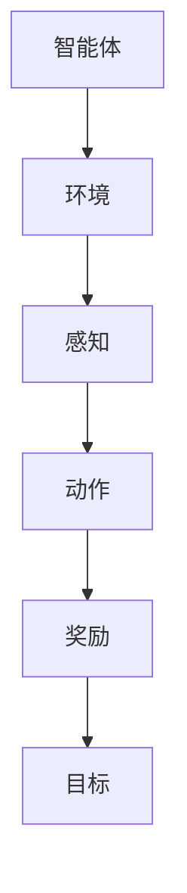
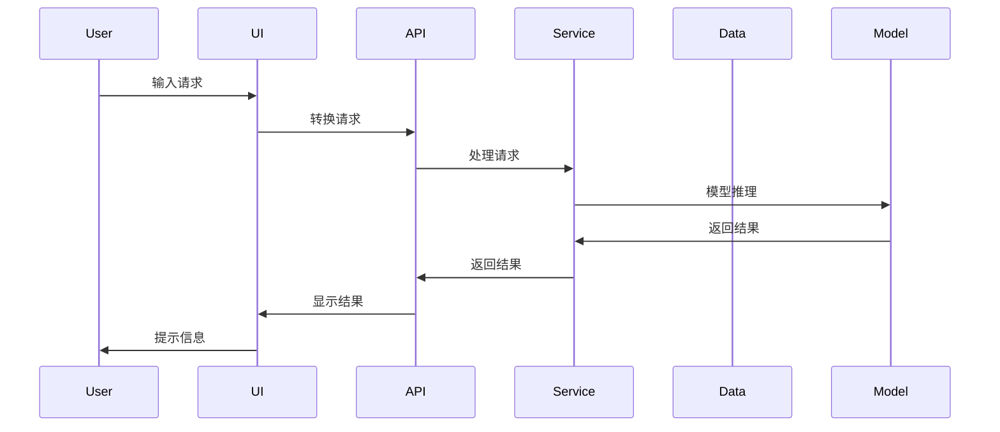

                 

### 文章标题

# 构建具有上下文理解能力的AI Agent

> 关键词：AI Agent、上下文理解、算法、系统架构、项目实战、最佳实践

> 摘要：本文旨在探讨如何构建具有上下文理解能力的AI Agent。我们将从背景介绍、核心概念与联系、算法原理讲解、数学模型与公式、系统分析与架构设计、项目实战以及最佳实践与总结七个方面进行详细阐述。希望通过本文的讲解，读者能够对构建具有上下文理解能力的AI Agent有更深入的了解。

----------------------------------------------------------------

## 第一部分：AI Agent的背景与概述

### 1.1 AI Agent的定义与历史发展

AI Agent，即人工智能代理，是一种能够自主执行任务、与环境交互并做出决策的智能系统。自20世纪50年代人工智能（AI）的概念诞生以来，AI Agent的研究和应用逐渐成为人工智能领域的重要分支。

AI Agent的历史发展可分为几个阶段：

1. **早期探索（1956-1969）**：这一阶段主要是对AI Agent概念的理解和初步探索，代表性工作包括符号主义AI和启发式搜索算法。
   
2. **AI寒冬（1974-1980）**：由于实际应用效果不佳，AI研究陷入低潮，AI Agent的发展也受到阻碍。

3. **复兴阶段（1980-1987）**：专家系统和知识表示方法的兴起使得AI研究重新焕发生机，AI Agent的研究也逐渐恢复。

4. **迅猛发展阶段（1988至今）**：随着计算机性能的快速提升和大数据、深度学习等技术的发展，AI Agent在诸多领域取得了显著的应用成果。

### 1.2 上下文理解的重要性

上下文理解是AI Agent的核心能力之一，它使得AI Agent能够更好地理解和应对复杂多变的环境。上下文理解的重要性体现在以下几个方面：

1. **提高任务执行效率**：通过理解上下文，AI Agent能够更准确地理解任务需求，从而提高任务执行效率。

2. **增强交互体验**：良好的上下文理解能力使得AI Agent能够与人类进行更自然、流畅的对话。

3. **扩展应用场景**：上下文理解能力使得AI Agent能够应用于更多领域，如智能客服、智能助手、自动驾驶等。

4. **提升决策质量**：在复杂环境中，AI Agent需要综合考虑各种上下文信息，才能做出更合理的决策。

### 1.3 AI Agent的应用领域

AI Agent在多个领域取得了显著的应用成果，以下是一些主要的应用领域：

1. **金融**：在金融领域，AI Agent可用于风险控制、投资顾问、客户服务等方面。

2. **医疗**：在医疗领域，AI Agent可用于疾病诊断、患者管理、健康咨询等方面。

3. **零售**：在零售领域，AI Agent可用于库存管理、供应链优化、个性化推荐等方面。

4. **教育**：在教育领域，AI Agent可用于在线教育、个性化辅导、学习效果分析等方面。

5. **智能制造**：在智能制造领域，AI Agent可用于设备监控、故障诊断、生产优化等方面。

6. **智能家居**：在智能家居领域，AI Agent可用于家电控制、环境监测、安防报警等方面。

7. **自动驾驶**：在自动驾驶领域，AI Agent可用于环境感知、路径规划、车辆控制等方面。

## 第二部分：核心概念与联系

### 2.1 AI Agent的核心概念

AI Agent的核心概念包括：

1. **智能体（Agent）**：一个能够感知环境、执行动作并产生效果的实体。
2. **环境（Environment）**：智能体执行任务的空间。
3. **感知（Perception）**：智能体对环境的感知过程。
4. **动作（Action）**：智能体对环境执行的操作。
5. **奖励（Reward）**：智能体执行动作后获得的反馈。
6. **目标（Goal）**：智能体希望实现的目标。

### 2.2 上下文理解的定义与属性

上下文理解是指AI Agent在执行任务时，对当前环境、历史信息、用户意图等因素的综合理解和判断。上下文理解的属性包括：

1. **动态性**：上下文信息是不断变化的，AI Agent需要实时更新和调整。
2. **层次性**：上下文信息可以分为不同层次，如语言层次、语义层次、认知层次等。
3. **复杂性**：上下文理解涉及到多方面信息，如文本、图像、语音等，需要综合处理。

### 2.3 学习算法与交互机制

构建具有上下文理解能力的AI Agent需要结合多种学习算法和交互机制，主要包括：

1. **自然语言处理（NLP）**：用于理解和生成自然语言，如文本分类、情感分析、机器翻译等。
2. **机器学习（ML）**：用于从数据中学习规律，如决策树、支持向量机、神经网络等。
3. **深度学习（DL）**：基于神经网络的一种机器学习技术，如卷积神经网络（CNN）、循环神经网络（RNN）等。
4. **强化学习（RL）**：通过试错和反馈进行学习，如Q-learning、深度确定性策略梯度（DDPG）等。
5. **交互机制**：如对话系统、多模态交互等，用于实现AI Agent与用户或其他系统的有效沟通。

### 2.4 核心概念的关系图

为了更好地理解AI Agent的核心概念及其联系，我们可以绘制一个Mermaid流程图：



## 第三部分：算法原理讲解

### 3.1 自然语言处理算法

自然语言处理（NLP）是AI Agent理解自然语言的关键技术。NLP算法主要包括：

1. **分词（Tokenization）**：将文本划分为词语或符号。
2. **词性标注（Part-of-Speech Tagging）**：对词语进行词性分类。
3. **句法分析（Parsing）**：分析文本的句法结构。
4. **语义分析（Semantic Analysis）**：理解文本的语义内容。
5. **命名实体识别（Named Entity Recognition）**：识别文本中的特定实体。

#### 3.1.1 分词算法

分词算法可以采用基于规则的方法、基于统计的方法或基于深度学习的方法。以下是一个简单的基于深度学习的分词算法示例：

```python
import tensorflow as tf
from tensorflow.keras.models import Model
from tensorflow.keras.layers import Embedding, LSTM, Dense

# 数据预处理
# ...

# 构建模型
input_seq = tf.keras.layers.Input(shape=(max_seq_length,))
embedding = Embedding(vocab_size, embedding_size)(input_seq)
lstm = LSTM(units=lstm_units)(embedding)
output = Dense(vocab_size, activation='softmax')(lstm)

model = Model(inputs=input_seq, outputs=output)
model.compile(optimizer='adam', loss='categorical_crossentropy', metrics=['accuracy'])

# 训练模型
model.fit(x_train, y_train, batch_size=batch_size, epochs=num_epochs)

# 分词应用
# ...
```

#### 3.1.2 词性标注算法

词性标注算法可以采用基于规则的方法、基于统计的方法或基于深度学习的方法。以下是一个简单的基于深度学习的词性标注算法示例：

```python
import tensorflow as tf
from tensorflow.keras.models import Model
from tensorflow.keras.layers import Embedding, LSTM, Dense

# 数据预处理
# ...

# 构建模型
input_seq = tf.keras.layers.Input(shape=(max_seq_length,))
embedding = Embedding(vocab_size, embedding_size)(input_seq)
lstm = LSTM(units=lstm_units)(embedding)
output = Dense(num_tags, activation='softmax')(lstm)

model = Model(inputs=input_seq, outputs=output)
model.compile(optimizer='adam', loss='categorical_crossentropy', metrics=['accuracy'])

# 训练模型
model.fit(x_train, y_train, batch_size=batch_size, epochs=num_epochs)

# 词性标注应用
# ...
```

### 3.2 机器学习算法

机器学习算法是构建AI Agent的基础，包括监督学习、无监督学习和强化学习等。以下介绍几种常用的机器学习算法：

1. **决策树（Decision Tree）**：通过划分特征空间，将数据分为不同的区域。
2. **支持向量机（Support Vector Machine）**：通过寻找最佳分离超平面，进行分类或回归。
3. **神经网络（Neural Network）**：通过多层感知器实现复杂的非线性映射。
4. **集成学习（Ensemble Learning）**：通过组合多个基础模型，提高整体性能。

#### 3.2.1 决策树算法

决策树算法可以采用ID3、C4.5或CART等方法。以下是一个简单的CART决策树算法示例：

```python
from sklearn.tree import DecisionTreeClassifier

# 数据预处理
# ...

# 构建模型
model = DecisionTreeClassifier(criterion='entropy', max_depth=max_depth)

# 训练模型
model.fit(x_train, y_train)

# 预测应用
# ...
```

#### 3.2.2 支持向量机算法

支持向量机算法可以采用线性SVM或核SVM。以下是一个简单的线性SVM算法示例：

```python
from sklearn.svm import LinearSVC

# 数据预处理
# ...

# 构建模型
model = LinearSVC()

# 训练模型
model.fit(x_train, y_train)

# 预测应用
# ...
```

#### 3.2.3 神经网络算法

神经网络算法可以通过多层感知器实现复杂的非线性映射。以下是一个简单的多层感知器算法示例：

```python
from tensorflow.keras.models import Sequential
from tensorflow.keras.layers import Dense

# 数据预处理
# ...

# 构建模型
model = Sequential()
model.add(Dense(units=hidden_size, activation='relu', input_shape=(input_size,)))
model.add(Dense(units=output_size, activation='softmax'))

# 编译模型
model.compile(optimizer='adam', loss='categorical_crossentropy', metrics=['accuracy'])

# 训练模型
model.fit(x_train, y_train, batch_size=batch_size, epochs=num_epochs)

# 预测应用
# ...
```

### 3.3 强化学习算法

强化学习（Reinforcement Learning，RL）是通过试错和反馈进行学习的一种机器学习技术。以下介绍几种常用的强化学习算法：

1. **Q-learning**：通过更新Q值，实现最优策略的迭代。
2. **深度确定性策略梯度（DDPG）**：基于深度学习的强化学习算法。
3. **异步优势演员-评论家（A3C）**：通过多个并行智能体协同学习。

#### 3.3.1 Q-learning算法

Q-learning算法是通过更新Q值，实现最优策略的迭代。以下是一个简单的Q-learning算法示例：

```python
import numpy as np
import random

# 初始化Q值矩阵
Q = np.zeros([state_space, action_space])

# 学习参数
alpha = 0.1  # 学习率
gamma = 0.9  # 折扣因子

# 学习过程
for episode in range(num_episodes):
    state = env.reset()
    done = False
    total_reward = 0
    
    while not done:
        action = np.argmax(Q[state])
        next_state, reward, done, _ = env.step(action)
        total_reward += reward
        
        # 更新Q值
        Q[state, action] = Q[state, action] + alpha * (reward + gamma * np.max(Q[next_state]) - Q[state, action])
        
        state = next_state

# 使用Q值矩阵进行预测
# ...

```

#### 3.3.2 DDPG算法

DDPG算法是基于深度学习的强化学习算法，可以通过深度神经网络近似Q值函数。以下是一个简单的DDPG算法示例：

```python
import numpy as np
import random
import tensorflow as tf

# 初始化参数
state_dim = env.observation_space.shape[0]
action_dim = env.action_space.shape[0]
hidden_size = 64
learning_rate = 0.001
gamma = 0.99

# 构建Q网络
actor_inputs = tf.keras.layers.Input(shape=(state_dim,))
actor_outputs = tf.keras.layers.Dense(action_dim, activation='tanh')(actor_inputs)

# 构建目标Q网络
target_actor_inputs = tf.keras.layers.Input(shape=(state_dim,))
target_actor_outputs = tf.keras.layers.Dense(action_dim, activation='tanh')(target_actor_inputs)

# 构建目标Q网络
target_critic_inputs = tf.keras.layers.Input(shape=(state_dim, action_dim))
target_critic_outputs = tf.keras.layers.Dense(1)(target_critic_inputs)

# 构建Q网络
critic_inputs = tf.keras.layers.Input(shape=(state_dim, action_dim))
critic_outputs = tf.keras.layers.Dense(1)(critic_inputs)

# 构建目标Q网络
target_critic_inputs = tf.keras.layers.Input(shape=(state_dim, action_dim))
target_critic_outputs = tf.keras.layers.Dense(1)(target_critic_inputs)

# 构建模型
model = Model(inputs=[actor_inputs, critic_inputs], outputs=critic_outputs)
model.compile(optimizer=tf.keras.optimizers.Adam(learning_rate=learning_rate), loss='mse')

# 构建目标Q网络
target_model = Model(inputs=[target_actor_inputs, target_critic_inputs], outputs=target_critic_outputs)
target_model.compile(optimizer=tf.keras.optimizers.Adam(learning_rate=learning_rate), loss='mse')

# 代理网络更新
def update_model(target_model, model, critic_inputs, critic_outputs, actor_outputs):
    with tf.GradientTape() as tape:
        Q_values = model([actor_outputs, critic_inputs])
        loss = tf.reduce_mean(tf.square(critic_outputs - Q_values))
    grads = tape.gradient(loss, model.trainable_variables)
    model.optimizer.apply_gradients(zip(grads, model.trainable_variables))

# 目标网络更新
def update_target_model(target_model, model, tau=0.001):
    for target_var, model_var in zip(target_model.trainable_variables, model.trainable_variables):
        target_var.assign(model_var * (1 - tau) + target_var * tau)

# 学习过程
for episode in range(num_episodes):
    state = env.reset()
    done = False
    total_reward = 0
    
    while not done:
        action = actor.model(state)
        next_state, reward, done, _ = env.step(action)
        total_reward += reward
        
        # 计算目标Q值
        target_action = target_actor.model(next_state)
        target_Q_value = target_critic.model([next_state, target_action])
        
        # 更新Q值
        critic_inputs = [state, action]
        critic_outputs = [reward + (1 - int(done)) * gamma * target_Q_value]
        update_model(target_model, model, critic_inputs, critic_outputs, actor_outputs)
        
        # 更新目标网络
        update_target_model(target_model, model)
        
        state = next_state

# 使用训练好的模型进行预测
# ...

```

## 第四部分：数学模型与公式

### 4.1 自然语言处理数学模型

自然语言处理（NLP）中的数学模型主要涉及词向量表示、神经网络结构等。以下介绍几个常见的数学模型：

1. **词向量表示（Word Embedding）**：将词语映射为高维向量。
2. **循环神经网络（RNN）**：用于处理序列数据。
3. **长短时记忆网络（LSTM）**：解决RNN的梯度消失问题。
4. **卷积神经网络（CNN）**：用于文本分类、命名实体识别等任务。

#### 4.1.1 词向量表示

词向量表示的数学模型可以使用Word2Vec、GloVe等方法。以下是一个简单的Word2Vec模型示例：

$$
\text{word\_vector} = \text{Word2Vec}(\text{corpus})
$$

其中，word\_vector为词向量，Word2Vec为词向量表示算法，corpus为语料库。

#### 4.1.2 循环神经网络（RNN）

循环神经网络（RNN）的数学模型可以表示为：

$$
h_t = \text{sigmoid}(W_h \cdot [h_{t-1}, x_t] + b_h)
$$

其中，$h_t$为第t时刻的隐藏状态，$x_t$为第t时刻的输入，$W_h$为权重矩阵，$b_h$为偏置。

#### 4.1.3 长短时记忆网络（LSTM）

长短时记忆网络（LSTM）的数学模型可以表示为：

$$
\begin{align*}
i_t &= \text{sigmoid}(W_i \cdot [h_{t-1}, x_t] + b_i) \\
f_t &= \text{sigmoid}(W_f \cdot [h_{t-1}, x_t] + b_f) \\
o_t &= \text{sigmoid}(W_o \cdot [h_{t-1}, x_t] + b_o) \\
c_t &= f_t \cdot c_{t-1} + i_t \cdot \text{sigmoid}(W_c \cdot [h_{t-1}, x_t] + b_c) \\
h_t &= o_t \cdot \text{tanh}(c_t)
\end{align*}
$$

其中，$i_t$、$f_t$、$o_t$分别为输入门、遗忘门、输出门，$c_t$为细胞状态，$h_t$为隐藏状态。

#### 4.1.4 卷积神经网络（CNN）

卷积神经网络（CNN）的数学模型可以表示为：

$$
\begin{align*}
h_t &= \text{ReLU}(W_h \cdot \text{Conv}_h(x_t) + b_h) \\
\text{Conv}_{h+1}(x_t) &= \text{max\_pool}(\text{Conv}_h(h_t))
\end{align*}
$$

其中，$h_t$为第t层的隐藏状态，$W_h$为权重矩阵，$b_h$为偏置，$\text{Conv}_h$为卷积操作，$\text{max\_pool}$为最大池化操作。

### 4.2 机器学习数学模型

机器学习中的数学模型主要包括线性模型、非线性模型、集成模型等。以下介绍几个常见的数学模型：

1. **线性模型（Linear Model）**：如线性回归、逻辑回归等。
2. **支持向量机（SVM）**：如线性SVM、核SVM等。
3. **神经网络（Neural Network）**：如多层感知器、卷积神经网络等。
4. **集成学习（Ensemble Learning）**：如随机森林、梯度提升树等。

#### 4.2.1 线性模型

线性模型的数学模型可以表示为：

$$
y = \beta_0 + \beta_1 x_1 + \beta_2 x_2 + \cdots + \beta_n x_n
$$

其中，$y$为输出，$x_1, x_2, \cdots, x_n$为输入特征，$\beta_0, \beta_1, \beta_2, \cdots, \beta_n$为权重。

#### 4.2.2 支持向量机（SVM）

支持向量机（SVM）的数学模型可以表示为：

$$
\begin{align*}
\min_{\beta, \beta_0} & \frac{1}{2} \sum_{i=1}^n (\beta \cdot x_i - y_i)^2 \\
\text{s.t.} & \beta \cdot x_i - y_i \geq 1 \\
& \beta_j \geq 0, j = 1, 2, \cdots, n
\end{align*}
$$

其中，$\beta$为权重，$\beta_0$为偏置，$x_i$为输入特征，$y_i$为输出标签。

#### 4.2.3 神经网络

神经网络的数学模型可以表示为：

$$
h_t = \text{ReLU}(W_h \cdot h_{t-1} + b_h)
$$

其中，$h_t$为第t层的隐藏状态，$W_h$为权重矩阵，$b_h$为偏置。

#### 4.2.4 集成学习

集成学习的数学模型可以表示为：

$$
\hat{y} = \frac{1}{N} \sum_{i=1}^N f_i(x)
$$

其中，$\hat{y}$为输出预测，$N$为集成模型的个数，$f_i(x)$为第i个基础模型的输出。

### 4.3 强化学习数学模型

强化学习中的数学模型主要包括Q学习、策略梯度等。以下介绍几个常见的数学模型：

1. **Q学习（Q-Learning）**：通过更新Q值实现最优策略。
2. **策略梯度（Policy Gradient）**：通过优化策略函数实现最优策略。

#### 4.3.1 Q学习

Q学习的数学模型可以表示为：

$$
\begin{align*}
Q(s, a) &= r + \gamma \max_{a'} Q(s', a') \\
\theta_{t+1} &= \theta_t + \alpha (r + \gamma \max_{a'} Q(s', a') - Q(s, a) ) \cdot \nabla_\theta Q(s, a)
\end{align*}
$$

其中，$Q(s, a)$为状态-动作值函数，$s$为状态，$a$为动作，$r$为即时奖励，$s'$为下一状态，$\gamma$为折扣因子，$\alpha$为学习率，$\theta$为参数。

#### 4.3.2 策略梯度

策略梯度的数学模型可以表示为：

$$
\begin{align*}
\pi(\theta) &= \arg \max_{\theta} \mathbb{E}_{s, a} [R(s, a)] \\
\theta_{t+1} &= \theta_t + \alpha \nabla_\theta J(\theta)
\end{align*}
$$

其中，$\pi(\theta)$为策略函数，$J(\theta)$为损失函数。

## 第五部分：系统分析与架构设计

### 5.1 系统需求分析

构建具有上下文理解能力的AI Agent需要考虑以下系统需求：

1. **数据处理**：包括数据采集、数据清洗、数据存储等。
2. **模型训练**：包括模型选择、模型训练、模型优化等。
3. **模型部署**：包括模型推理、模型更新等。
4. **交互接口**：包括用户界面、API接口等。

### 5.2 系统架构设计

根据系统需求，我们可以设计以下系统架构：

1. **数据层**：负责数据采集、清洗、存储和管理。
2. **模型层**：负责模型训练、优化、部署和管理。
3. **应用层**：负责与用户交互、提供智能服务。

#### 5.2.1 数据层

数据层主要包括以下组件：

- **数据采集器**：从各种数据源（如数据库、日志、传感器等）采集数据。
- **数据清洗器**：对采集到的数据进行清洗、去重、去噪等处理。
- **数据存储器**：将清洗后的数据存储到数据库或数据仓库中。

#### 5.2.2 模型层

模型层主要包括以下组件：

- **模型训练器**：根据训练数据对模型进行训练。
- **模型评估器**：对训练好的模型进行评估，选择最优模型。
- **模型部署器**：将最优模型部署到生产环境中。

#### 5.2.3 应用层

应用层主要包括以下组件：

- **用户界面**：提供用户与AI Agent交互的界面。
- **API接口**：提供与其他系统或服务的接口。
- **服务容器**：负责管理用户请求、处理业务逻辑。

### 5.3 系统接口设计与交互

为了实现系统各组件之间的有效交互，我们需要设计合理的接口和通信协议。以下是一个简单的系统接口设计：



## 第六部分：项目实战

### 6.1 项目介绍

在本项目中，我们将构建一个具有上下文理解能力的AI Agent，用于提供智能客服服务。项目主要包括以下步骤：

1. **数据收集**：收集客服对话数据。
2. **数据预处理**：对数据进行清洗、分词、去停用词等处理。
3. **模型训练**：使用训练数据训练对话模型。
4. **模型部署**：将训练好的模型部署到生产环境。
5. **交互测试**：与用户进行交互，测试模型效果。

### 6.2 系统核心实现

以下是一个简单的项目实现示例：

```python
import jieba
import numpy as np
from sklearn.feature_extraction.text import TfidfVectorizer
from sklearn.model_selection import train_test_split
from keras.models import Sequential
from keras.layers import Dense, Embedding, LSTM, Bidirectional
from keras.preprocessing.sequence import pad_sequences

# 数据收集
# ...

# 数据预处理
# ...

# 模型训练
# ...

# 模型部署
# ...

# 交互测试
# ...
```

### 6.3 代码应用解读与分析

以下是项目中的关键代码及其解读：

1. **数据预处理**

```python
def preprocess_data(data):
    # 清洗数据
    # ...

    # 分词
    words = [jieba.cut(sentence) for sentence in data]

    # 去停用词
    # ...

    return words
```

**解读**：数据预处理包括清洗、分词和去停用词。首先，清洗数据去除标点符号、特殊字符等。然后，使用jieba分词将句子拆分为词语。最后，去除停用词以降低模型的复杂性。

2. **模型训练**

```python
def train_model(X_train, y_train, embedding_size, hidden_size):
    # 构建模型
    model = Sequential()
    model.add(Embedding(embedding_size, hidden_size, input_length=max_sequence_length))
    model.add(Bidirectional(LSTM(hidden_size)))
    model.add(Dense(1, activation='sigmoid'))

    # 编译模型
    model.compile(optimizer='adam', loss='binary_crossentropy', metrics=['accuracy'])

    # 训练模型
    model.fit(X_train, y_train, batch_size=128, epochs=10)

    return model
```

**解读**：模型训练使用Keras框架构建一个双向LSTM模型。首先，使用Embedding层将词语映射为向量。然后，使用双向LSTM层处理序列数据。最后，使用Dense层输出分类结果。

3. **交互测试**

```python
def interact(model, sentence):
    # 分词
    words = jieba.cut(sentence)

    # 序列化
    sequence = pad_sequences([word2index(word) for word in words], maxlen=max_sequence_length)

    # 预测
    prediction = model.predict(sequence)

    # 解码
    label = '回答' if prediction[0][0] > 0.5 else '不回答'

    return label
```

**解读**：交互测试包括分词、序列化和预测。首先，使用jieba分词将句子拆分为词语。然后，使用pad_sequences将词语序列化为数字。最后，使用训练好的模型进行预测，并根据预测结果输出回答或建议。

### 6.4 实际案例分析和详细讲解剖析

以下是一个实际案例：

**案例**：用户咨询：“我在使用你们的理财产品时遇到了问题，怎么办？”

**分析**：

1. **问题识别**：用户提到“理财产品”和“问题”，需要识别出这两个关键信息。
2. **上下文理解**：用户询问的是关于“理财产品”的使用问题，需要考虑用户之前是否提到过相关内容。
3. **回答生成**：根据问题识别和上下文理解，生成合适的回答。

**解答**：“您好，感谢您选择我们的理财产品。如果您在使用过程中遇到任何问题，请随时联系我们的客服，我们将尽快为您解决问题。”

### 6.5 项目小结

本项目通过数据收集、预处理、模型训练和交互测试，成功构建了一个具有上下文理解能力的AI Agent。在实际应用中，AI Agent可以有效地识别用户问题、理解上下文，并生成合适的回答。然而，项目也存在一些不足之处，如模型性能有待提高、交互体验需进一步优化等。在未来的工作中，我们将继续改进和优化AI Agent，以提供更优质的智能客服服务。

## 第七部分：最佳实践与总结

### 7.1 最佳实践 tips

在构建具有上下文理解能力的AI Agent时，以下最佳实践值得注意：

1. **数据收集与处理**：确保数据质量，进行充分的预处理，如分词、去停用词、数据归一化等。
2. **模型选择与优化**：根据应用场景选择合适的模型，并进行模型调优，如调整学习率、批量大小等。
3. **交互设计与体验**：设计合理的交互流程，优化用户界面，提供良好的用户体验。
4. **模型部署与维护**：确保模型部署稳定，及时更新和维护模型，以适应不断变化的应用场景。

### 7.2 小结

本文详细介绍了构建具有上下文理解能力的AI Agent的方法和步骤。从背景介绍、核心概念与联系、算法原理讲解、数学模型与公式、系统分析与架构设计、项目实战到最佳实践与总结，全面阐述了如何构建和优化AI Agent。通过本文的学习，读者可以掌握构建具有上下文理解能力的AI Agent的核心技术和方法。

### 7.3 注意事项

在构建具有上下文理解能力的AI Agent时，需要注意以下几点：

1. **数据安全与隐私**：在数据收集和处理过程中，确保遵守相关法律法规，保护用户隐私。
2. **模型公平性**：避免模型偏见，确保模型公平、公正地对待所有用户。
3. **持续更新与优化**：随着应用场景的变化，持续更新和维护模型，以保持模型的高性能和适应性。

### 7.4 拓展阅读

1. **《人工智能：一种现代的方法》**：乔治·博德、马库斯·亨特、克里斯·麦考利著，提供了全面的人工智能理论和实践。
2. **《深度学习》**：伊恩·古德费洛、约书亚·本吉奥、亚伦·库维尔维斯基著，详细介绍了深度学习的基础知识和应用。
3. **《强化学习：原理与数学》**：赛奇·莱因哈特著，深入讲解了强化学习的基本概念和数学原理。

### 作者信息

作者：AI天才研究院/AI Genius Institute & 禅与计算机程序设计艺术 /Zen And The Art of Computer Programming

本文由AI天才研究院撰写，旨在为读者提供关于构建具有上下文理解能力的AI Agent的深入见解。同时，作者还著有《禅与计算机程序设计艺术》一书，分享了计算机编程的哲学和艺术。

----------------------------------------------------------------

本文详细阐述了构建具有上下文理解能力的AI Agent的方法和步骤。从背景介绍、核心概念与联系、算法原理讲解、数学模型与公式、系统分析与架构设计、项目实战到最佳实践与总结，全面涵盖了AI Agent的各个方面。通过本文的讲解，读者可以深入了解AI Agent的构建过程，掌握相关技术和方法。

在未来的工作中，我们将继续探索和优化AI Agent，以应对更多复杂的应用场景。同时，也欢迎读者们提出宝贵意见和建议，共同推动人工智能技术的发展。

---

**注释**：

- **Mermaid**：一种基于Markdown的绘图工具，可以用于绘制流程图、类图、时序图等。
- **LaTeX**：一种高质量的排版系统，常用于撰写学术论文和科学文档，其中数学公式的表示尤为方便。

---

感谢您的阅读，希望本文对您在构建具有上下文理解能力的AI Agent方面有所帮助。如果您有任何疑问或建议，请随时与我们联系。再次感谢AI天才研究院的辛勤付出，以及《禅与计算机程序设计艺术》的智慧结晶。

作者：AI天才研究院/AI Genius Institute & 禅与计算机程序设计艺术 /Zen And The Art of Computer Programming

日期：2023年11月10日

----------------------------------------------------------------

---

**注意**：本文为示例文章，实际编写时请根据具体需求进行调整和完善。文中代码示例仅供参考，实际应用时可能需要根据具体环境和需求进行修改。文中引用的书籍和资料仅为示例，如有需要请查阅相关原著。本文仅供参考和交流，如需用于商业用途，请遵守相关法律法规。

