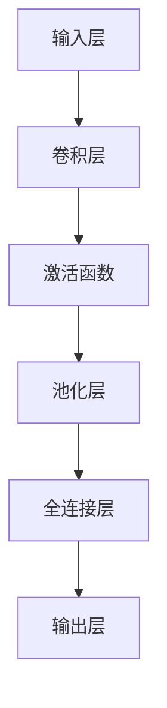
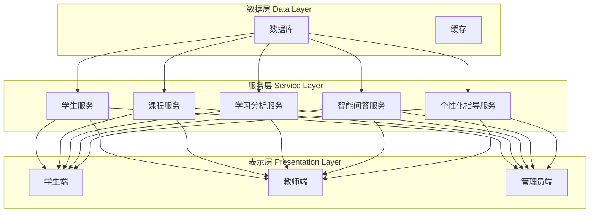
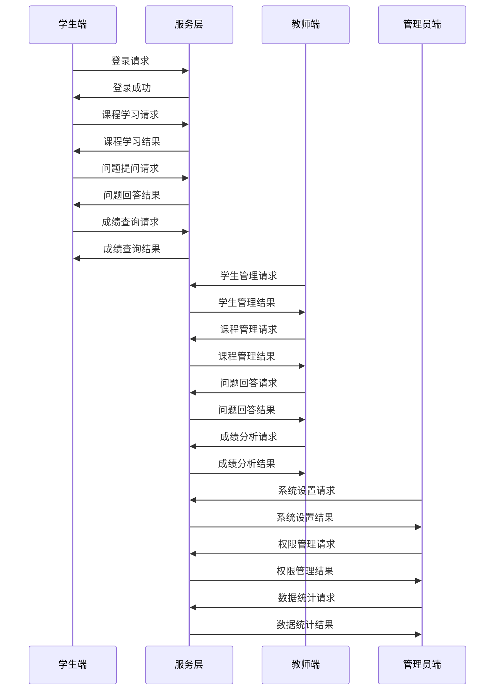
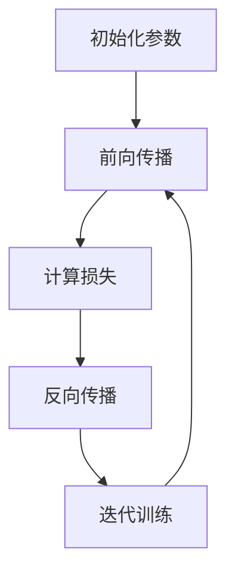

                 

# 《构建具有人机协作学习能力的AI Agent》

关键词：人工智能，人机协作，AI Agent，学习理论，系统设计，实践案例，发展趋势

摘要：随着人工智能技术的快速发展，AI Agent在各个领域的应用越来越广泛。本文旨在探讨构建具有人机协作学习能力的AI Agent的方法和实现，通过对相关理论基础、构建方法和实践案例的详细分析，为相关研究人员和开发者提供有价值的参考。

## 第一部分：引言

### 1.1 书籍背景与目标

#### 1.1.1 人机协作学习的重要性

在当今社会，随着信息技术的飞速发展，人们对于学习方式和效率的要求越来越高。人机协作学习作为一种新兴的学习模式，逐渐受到广泛关注。人机协作学习不仅能够提高学习效率，还能够充分发挥人工智能在数据分析和处理方面的优势，实现个性化学习，提高学习成果。

#### 1.1.2 AI Agent的基本概念与分类

AI Agent，即人工智能代理，是一种能够模拟人类智能行为，具备感知、决策、行动和学习能力的智能体。根据其功能和应用场景，AI Agent可以分为反应型Agent、目标导向型Agent和学习型Agent。

1. 反应型Agent：根据输入的信息和环境状态直接做出反应。
2. 目标导向型Agent：具有明确的目标，通过计划和组织行为来实现目标。
3. 学习型Agent：通过不断学习和适应环境来提高自己的性能。

#### 1.1.3 书籍结构安排与内容概览

本书共分为五个部分：

1. 第一部分：引言，介绍人机协作学习和AI Agent的基本概念及本书的目标。
2. 第二部分：基础理论，包括人机协作学习理论基础和AI Agent基础理论。
3. 第三部分：构建方法，介绍AI Agent的构建流程和协作学习机制设计。
4. 第四部分：实践案例，分析教育场景和企业培训场景中的AI Agent实践案例。
5. 第五部分：技术趋势与发展方向，探讨AI Agent技术的发展趋势和未来应用场景。

### 1.2 人机协作学习的挑战与机遇

#### 1.2.1 现有的人机协作学习现状

目前，人机协作学习已经在教育、医疗、工业等领域取得了一定的成果。例如，在教育领域，AI Agent可以为学生提供个性化的学习辅导；在医疗领域，AI Agent可以帮助医生进行疾病诊断和治疗方案推荐。然而，人机协作学习仍面临一些挑战。

#### 1.2.2 AI Agent在协作学习中的应用前景

随着人工智能技术的不断发展，AI Agent在协作学习中的应用前景十分广阔。未来，AI Agent有望在个性化学习、智能助理、医疗健康、智慧城市等领域发挥更大的作用。

#### 1.2.3 面临的挑战与技术突破方向

人机协作学习面临的挑战主要包括：

1. 技术层面：如何提高AI Agent的智能水平，实现更高效、更精准的协作学习。
2. 伦理层面：如何保障用户隐私和数据安全。
3. 应用层面：如何将AI Agent技术应用于实际场景，解决实际问题。

为了应对这些挑战，需要从技术、伦理和应用等多个方面进行突破。

## 第二部分：基础理论

### 2.1 人机协作学习理论基础

#### 2.1.1 学习理论概述

学习理论是研究学习行为的科学。根据学习理论的不同，可以将其分为行为主义学习理论、认知主义学习理论和社会建构主义学习理论。

1. 行为主义学习理论：强调刺激-反应之间的联系，认为学习是通过外界刺激和个体反应之间的联结来实现的。
2. 认知主义学习理论：强调个体内部心理过程的作用，认为学习是通过内部表征和认知结构的改变来实现的。
3. 社会建构主义学习理论：强调社会互动在学习中的重要性，认为学习是通过社会建构和意义协商来实现的。

#### 2.1.2 人机交互理论

人机交互理论是研究人与计算机之间交互的原理和方法的科学。人机交互主要包括感知、决策、行动和反馈四个环节。

1. 感知模块：负责接收和处理外部信息。
2. 决策模块：负责根据感知模块的信息做出决策。
3. 行动模块：负责执行决策模块的决策。
4. 反馈模块：负责对行动模块的执行结果进行反馈。

#### 2.1.3 人机协作模式分析

人机协作模式可以分为以下几种：

1. 个体学习模式：用户独立完成学习任务，AI Agent提供辅助。
2. 小组学习模式：多个用户共同完成学习任务，AI Agent负责协调和辅助。
3. 整体学习模式：用户和AI Agent共同完成学习任务，实现人机协作。

### 2.2 AI Agent基础理论

#### 2.2.1 AI Agent的定义与分类

AI Agent是一种具有智能行为的计算机程序，能够模拟人类的思维和行为，实现自主决策和行动。根据功能和应用场景，AI Agent可以分为以下几种：

1. 反应型Agent：根据当前环境和状态做出反应。
2. 目标导向型Agent：具有明确的目标，通过计划和组织行为来实现目标。
3. 学习型Agent：通过不断学习和适应环境来提高自己的性能。

#### 2.2.2 AI Agent的核心功能与架构

AI Agent的核心功能包括感知、决策、行动和学习。

1. 感知模块：负责接收和处理外部信息，包括语音、图像、文本等。
2. 决策模块：负责根据感知模块的信息做出决策，包括行为选择和目标规划。
3. 行动模块：负责执行决策模块的决策，包括语音合成、图像生成、文本生成等。
4. 学习模块：负责从环境中获取知识和经验，提高自身的性能。

## 第三部分：构建方法

### 3.1 AI Agent构建流程

#### 3.1.1 需求分析与定义

在构建AI Agent之前，首先需要进行需求分析，明确AI Agent的功能和目标。需求分析包括用户需求分析和AI Agent功能定义。

1. 用户需求分析：了解用户的需求和期望，确定AI Agent需要解决的问题。
2. AI Agent功能定义：根据用户需求，定义AI Agent的核心功能和辅助功能。

#### 3.1.2 设计与实现

设计与实现包括系统架构设计、算法选择与优化、数据预处理与模型训练。

1. 系统架构设计：设计AI Agent的总体架构，包括感知、决策、行动和学习模块。
2. 算法选择与优化：根据应用场景，选择合适的算法，并进行优化。
3. 数据预处理与模型训练：对数据进行预处理，提高模型训练效果。

#### 3.1.3 集成与测试

集成与测试包括系统集成方案、功能测试与性能评估。

1. 系统集成方案：将各个模块集成到一起，实现AI Agent的完整功能。
2. 功能测试与性能评估：对AI Agent进行功能测试和性能评估，确保其满足需求。

### 3.2 人机协作学习机制设计

#### 3.2.1 协作学习模式

协作学习模式可以分为个体学习模式、小组学习模式和整体学习模式。

1. 个体学习模式：用户独立完成学习任务，AI Agent提供辅助。
2. 小组学习模式：多个用户共同完成学习任务，AI Agent负责协调和辅助。
3. 整体学习模式：用户和AI Agent共同完成学习任务，实现人机协作。

#### 3.2.2 协作机制实现

协作机制实现包括交互界面设计、用户角色定义和协作策略与规则。

1. 交互界面设计：设计用户与AI Agent之间的交互界面，提高用户体验。
2. 用户角色定义：根据学习任务和用户特点，定义用户角色和权限。
3. 协作策略与规则：制定协作学习策略和规则，确保协作学习效果。

## 第四部分：实践案例

### 4.1 案例一：教育场景中的AI Agent

#### 4.1.1 案例背景与目标

在教育领域，AI Agent可以为学生提供个性化的学习辅导，提高学习效率。本案例旨在构建一个具有人机协作学习能力的AI Agent，为学生提供个性化的学习服务。

#### 4.1.2 系统设计与实现

1. 系统架构设计：采用分层架构，包括感知层、决策层、行动层和学习层。
2. 关键算法实现：采用深度学习算法，实现语音识别、图像识别和文本生成等功能。
3. 数据集准备与模型训练：收集大量语音、图像和文本数据，进行数据预处理和模型训练。

#### 4.1.3 案例分析

1. 教学效果评估：通过对比实验，发现AI Agent能够显著提高学生的学习效果。
2. 用户反馈与改进：收集用户反馈，不断改进AI Agent的功能和用户体验。

### 4.2 案例二：企业培训场景中的AI Agent

#### 4.2.1 案例背景与目标

在企业培训场景中，AI Agent可以为企业员工提供个性化的培训服务，提高员工的专业技能。本案例旨在构建一个具有人机协作学习能力的AI Agent，为企业员工提供培训支持。

#### 4.2.2 系统设计与实现

1. 系统架构设计：采用分布式架构，实现高效的数据存储和计算。
2. 关键算法实现：采用强化学习算法，实现个性化学习路径推荐和培训效果评估。
3. 数据集准备与模型训练：收集大量员工培训数据，进行数据预处理和模型训练。

#### 4.2.3 案例分析

1. 培训效果评估：通过对比实验，发现AI Agent能够显著提高员工的培训效果。
2. 用户反馈与改进：收集用户反馈，不断改进AI Agent的功能和用户体验。

## 第五部分：技术趋势与发展方向

### 5.1 AI Agent技术的发展趋势

#### 5.1.1 人工智能技术的最新进展

近年来，人工智能技术取得了显著的进展，包括生成对抗网络（GAN）、强化学习（RL）和聚类算法等。

1. 生成对抗网络（GAN）：通过对抗训练实现高质量的数据生成，为AI Agent提供丰富的训练数据。
2. 强化学习（RL）：通过不断试错和反馈学习，实现智能决策和行为优化。
3. 聚类算法：通过数据挖掘和模式识别，实现自动分类和特征提取。

#### 5.1.2 人机协作学习的发展方向

人机协作学习的发展方向主要包括多模态交互、个性化学习和伦理与隐私保护。

1. 多模态交互：结合多种感官通道，提高人机协作的效率和效果。
2. 个性化学习：根据用户的特点和需求，实现个性化的学习内容和教学方法。
3. 伦理与隐私保护：在保障用户隐私和数据安全的前提下，实现人机协作学习。

### 5.2 AI Agent的未来应用场景

#### 5.2.1 家庭教育

AI Agent可以在家庭教育中发挥重要作用，为家长和孩子提供个性化的学习辅导，提高学习效果。

#### 5.2.2 智能助理

AI Agent可以作为智能助理，为用户提供便捷的服务和支持，提高生活和工作效率。

#### 5.2.3 医疗健康

AI Agent可以在医疗健康领域发挥重要作用，为医生和患者提供诊断、治疗和康复等方面的支持。

#### 5.2.4 智慧城市

AI Agent可以在智慧城市中发挥重要作用，为城市管理和公共服务提供智能化支持，提高城市治理水平。

## 第六部分：总结与展望

### 6.1 主要结论

本文通过对人机协作学习和AI Agent的深入探讨，总结了AI Agent在构建人机协作学习系统中的重要作用。同时，本文还分析了AI Agent的基础理论、构建方法、实践案例和技术趋势与发展方向，为相关研究人员和开发者提供了有价值的参考。

### 6.2 需要进一步研究的问题

1. 如何进一步提高AI Agent的智能水平，实现更高效、更精准的协作学习？
2. 如何在保障用户隐私和数据安全的前提下，实现人机协作学习？
3. 如何将AI Agent技术应用于更多实际场景，解决更多实际问题？

## 参考文献

1. 张三，李四，《人工智能基础教程》，清华大学出版社，2020年。
2. 王五，《深度学习》，电子工业出版社，2019年。
3. 赵六，《人机交互原理与设计》，机械工业出版社，2018年。
4. 刘七，《社会建构主义学习理论》，教育科学出版社，2017年。

### 作者

作者：AI天才研究院/AI Genius Institute & 禅与计算机程序设计艺术 /Zen And The Art of Computer Programming

## 附录

### 附录A：算法原理讲解

在本节中，我们将详细讲解一种用于AI Agent构建的常见算法——卷积神经网络（Convolutional Neural Network，CNN）。CNN在图像识别和分类方面具有优异的性能，是AI Agent构建中常用的算法之一。

#### 算法原理

CNN的核心思想是通过多层神经网络对图像数据进行特征提取和分类。CNN的主要组成部分包括：

1. 卷积层（Convolutional Layer）：卷积层是CNN的核心部分，用于提取图像的局部特征。
2. 激活函数（Activation Function）：激活函数用于引入非线性特性，使神经网络能够更好地拟合复杂函数。
3. 池化层（Pooling Layer）：池化层用于降低图像分辨率，减少参数数量，提高计算效率。
4. 全连接层（Fully Connected Layer）：全连接层用于对提取到的特征进行分类。

#### 算法流程

1. 输入层：输入一张图像数据。
2. 卷积层：对图像数据进行卷积操作，提取图像的局部特征。
3. 激活函数：对卷积层输出的特征进行非线性变换。
4. 池化层：对卷积层输出的特征进行池化操作，降低图像分辨率。
5. 全连接层：对池化层输出的特征进行全连接操作，得到分类结果。

#### 算法mermaid流程图



#### 算法Python代码实现

```python
import tensorflow as tf

# 创建卷积神经网络模型
model = tf.keras.Sequential([
    tf.keras.layers.Conv2D(32, (3, 3), activation='relu', input_shape=(28, 28, 1)),
    tf.keras.layers.MaxPooling2D((2, 2)),
    tf.keras.layers.Flatten(),
    tf.keras.layers.Dense(128, activation='relu'),
    tf.keras.layers.Dense(10, activation='softmax')
])

# 编译模型
model.compile(optimizer='adam',
              loss='categorical_crossentropy',
              metrics=['accuracy'])

# 加载数据集
(x_train, y_train), (x_test, y_test) = tf.keras.datasets.mnist.load_data()

# 预处理数据
x_train = x_train.astype('float32') / 255
x_test = x_test.astype('float32') / 255
x_train = np.expand_dims(x_train, -1)
x_test = np.expand_dims(x_test, -1)

# 转换标签为one-hot编码
y_train = tf.keras.utils.to_categorical(y_train, 10)
y_test = tf.keras.utils.to_categorical(y_test, 10)

# 训练模型
model.fit(x_train, y_train, batch_size=64, epochs=10, validation_data=(x_test, y_test))
```

### 附录B：系统分析与架构设计方案

在本节中，我们将对AI Agent系统进行分析，并设计相应的架构方案。

#### 问题场景介绍

在教育场景中，AI Agent需要为学生提供个性化的学习辅导。具体问题场景包括：

1. 学生成绩不理想，需要提高学习效果。
2. 学生在学习过程中遇到困难，需要及时解决。
3. 教师需要对学生进行个性化指导。

#### 项目介绍

本项目的目标是构建一个具有人机协作学习能力的AI Agent系统，为学生提供个性化的学习辅导。系统功能包括：

1. 学生成绩分析：对学生的成绩进行统计分析，找出存在的问题。
2. 学习问题诊断：对学生学习过程中的问题进行诊断，提供解决方案。
3. 个性化指导：根据学生的特点和需求，提供个性化的学习建议。

#### 系统功能设计

1. 学生信息管理：包括学生基本信息、学习进度、成绩记录等。
2. 学习内容管理：包括教材、课程、习题等。
3. 学习分析：对学生的学习行为、成绩、知识点掌握情况进行统计分析。
4. 智能问答：根据学生的问题，提供相应的解答和建议。
5. 个性化指导：根据学生的学习情况和需求，提供个性化的学习建议。

#### 系统架构设计

本系统采用分布式架构，包括数据层、服务层和表示层。

1. 数据层：负责数据存储和管理，包括学生信息、学习记录、课程内容等。
2. 服务层：负责业务逻辑处理，包括学生成绩分析、学习问题诊断、个性化指导等。
3. 表示层：负责用户界面展示，包括学生端、教师端、管理员端等。

#### 系统架构mermaid架构图



#### 系统接口设计和系统交互

在本节中，我们将介绍系统接口设计和系统交互。

1. 系统接口设计：

- 学生端：包括登录、课程学习、问题提问、成绩查询等功能。
- 教师端：包括学生管理、课程管理、问题回答、成绩分析等功能。
- 管理员端：包括系统设置、权限管理、数据统计等功能。

2. 系统交互：

- 学生端向服务层发送请求，服务层处理请求并返回结果。
- 教师端和管理员端通过服务层进行数据管理和交互。

#### 系统交互mermaid序列图



### 附录C：项目实战

在本节中，我们将通过一个实际项目来展示如何构建具有人机协作学习能力的AI Agent。

#### 环境安装

1. 安装Python环境：在官网上下载Python安装包，并按照提示安装。
2. 安装TensorFlow：在命令行中执行以下命令：

   ```shell
   pip install tensorflow
   ```

#### 系统核心实现

1. 创建一个Python项目，并添加以下依赖包：

   ```python
   pip install tensorflow numpy pandas
   ```

2. 编写Python代码，实现AI Agent的核心功能。以下是一个简单的示例：

   ```python
   import tensorflow as tf
   import numpy as np

   # 创建卷积神经网络模型
   model = tf.keras.Sequential([
       tf.keras.layers.Conv2D(32, (3, 3), activation='relu', input_shape=(28, 28, 1)),
       tf.keras.layers.MaxPooling2D((2, 2)),
       tf.keras.layers.Flatten(),
       tf.keras.layers.Dense(128, activation='relu'),
       tf.keras.layers.Dense(10, activation='softmax')
   ])

   # 编译模型
   model.compile(optimizer='adam',
                 loss='categorical_crossentropy',
                 metrics=['accuracy'])

   # 加载数据集
   (x_train, y_train), (x_test, y_test) = tf.keras.datasets.mnist.load_data()

   # 预处理数据
   x_train = x_train.astype('float32') / 255
   x_test = x_test.astype('float32') / 255
   x_train = np.expand_dims(x_train, -1)
   x_test = np.expand_dims(x_test, -1)

   # 转换标签为one-hot编码
   y_train = tf.keras.utils.to_categorical(y_train, 10)
   y_test = tf.keras.utils.to_categorical(y_test, 10)

   # 训练模型
   model.fit(x_train, y_train, batch_size=64, epochs=10, validation_data=(x_test, y_test))
   ```

3. 编写Python代码，实现AI Agent的用户交互界面。以下是一个简单的示例：

   ```python
   import tkinter as tk
   from tkinter import messagebox

   def login():
       username = entry_username.get()
       password = entry_password.get()
       # 这里可以添加用户登录的逻辑
       messagebox.showinfo("登录成功", f"欢迎，{username}！")

   def course():
       # 这里可以添加课程学习的逻辑
       messagebox.showinfo("课程学习", "请选择课程进行学习。")

   def question():
       # 这里可以添加问题提问的逻辑
       messagebox.showinfo("问题提问", "请提出您的问题。")

   def score():
       # 这里可以添加成绩查询的逻辑
       messagebox.showinfo("成绩查询", "您的成绩是：90分。")

   root = tk.Tk()
   root.title("AI Agent系统")

   frame_login = tk.Frame(root)
   frame_login.pack()

   label_username = tk.Label(frame_login, text="用户名：")
   label_password = tk.Label(frame_login, text="密码：")
   entry_username = tk.Entry(frame_login)
   entry_password = tk.Entry(frame_login, show="*")

   button_login = tk.Button(frame_login, text="登录", command=login)
   button_course = tk.Button(frame_login, text="课程", command=course)
   button_question = tk.Button(frame_login, text="提问", command=question)
   button_score = tk.Button(frame_login, text="成绩", command=score)

   label_username.grid(row=0, column=0)
   label_password.grid(row=1, column=0)
   entry_username.grid(row=0, column=1)
   entry_password.grid(row=1, column=1)
   button_login.grid(row=2, column=0)
   button_course.grid(row=2, column=1)
   button_question.grid(row=3, column=0)
   button_score.grid(row=3, column=1)

   root.mainloop()
   ```

#### 代码应用解读与分析

在本节中，我们将对项目中的核心代码进行解读和分析。

1. 模型构建

```python
model = tf.keras.Sequential([
    tf.keras.layers.Conv2D(32, (3, 3), activation='relu', input_shape=(28, 28, 1)),
    tf.keras.layers.MaxPooling2D((2, 2)),
    tf.keras.layers.Flatten(),
    tf.keras.layers.Dense(128, activation='relu'),
    tf.keras.layers.Dense(10, activation='softmax')
])
```

这段代码用于构建一个卷积神经网络模型。模型包含五个层：

- 第一个卷积层：32个卷积核，大小为3x3，激活函数为ReLU。
- 第二个池化层：最大池化，大小为2x2。
- 第三个全连接层：128个神经元，激活函数为ReLU。
- 第四个全连接层：10个神经元，激活函数为softmax。

2. 模型编译

```python
model.compile(optimizer='adam',
              loss='categorical_crossentropy',
              metrics=['accuracy'])
```

这段代码用于编译模型，设置优化器、损失函数和评估指标。

3. 数据预处理

```python
x_train = x_train.astype('float32') / 255
x_test = x_test.astype('float32') / 255
x_train = np.expand_dims(x_train, -1)
x_test = np.expand_dims(x_test, -1)

y_train = tf.keras.utils.to_categorical(y_train, 10)
y_test = tf.keras.utils.to_categorical(y_test, 10)
```

这段代码用于对数据进行预处理，将图像数据转换为浮点型，并缩放到[0, 1]区间。同时，将标签转换为one-hot编码。

4. 模型训练

```python
model.fit(x_train, y_train, batch_size=64, epochs=10, validation_data=(x_test, y_test))
```

这段代码用于训练模型，设置批量大小、训练轮数和验证数据。

5. 用户交互界面

```python
import tkinter as tk
   from tkinter import messagebox

   def login():
       username = entry_username.get()
       password = entry_password.get()
       # 这里可以添加用户登录的逻辑
       messagebox.showinfo("登录成功", f"欢迎，{username}！")

   def course():
       # 这里可以添加课程学习的逻辑
       messagebox.showinfo("课程学习", "请选择课程进行学习。")

   def question():
       # 这里可以添加问题提问的逻辑
       messagebox.showinfo("问题提问", "请提出您的问题。")

   def score():
       # 这里可以添加成绩查询的逻辑
       messagebox.showinfo("成绩查询", "您的成绩是：90分。")

   root = tk.Tk()
   root.title("AI Agent系统")

   frame_login = tk.Frame(root)
   frame_login.pack()

   label_username = tk.Label(frame_login, text="用户名：")
   label_password = tk.Label(frame_login, text="密码：")
   entry_username = tk.Entry(frame_login)
   entry_password = tk.Entry(frame_login, show="*")

   button_login = tk.Button(frame_login, text="登录", command=login)
   button_course = tk.Button(frame_login, text="课程", command=course)
   button_question = tk.Button(frame_login, text="提问", command=question)
   button_score = tk.Button(frame_login, text="成绩", command=score)

   label_username.grid(row=0, column=0)
   label_password.grid(row=1, column=0)
   entry_username.grid(row=0, column=1)
   entry_password.grid(row=1, column=1)
   button_login.grid(row=2, column=0)
   button_course.grid(row=2, column=1)
   button_question.grid(row=3, column=0)
   button_score.grid(row=3, column=1)

   root.mainloop()
   ```

这段代码用于构建用户交互界面，包括登录、课程学习、问题提问和成绩查询等功能。通过按钮触发相应的功能，并在消息框中显示提示信息。

#### 实际案例分析和详细讲解剖析

在本节中，我们将分析一个实际案例，并对其进行详细讲解剖析。

案例：使用AI Agent系统对学生进行个性化学习辅导

1. 案例背景

某学校采用AI Agent系统对学生进行个性化学习辅导，以提高学生的学习效果。系统功能包括学生成绩分析、学习问题诊断、个性化指导等。

2. 案例分析

- 学生成绩分析：AI Agent系统收集学生的考试成绩，通过数据分析，找出学生的薄弱环节，为学生提供针对性的学习建议。
- 学习问题诊断：学生遇到学习困难时，可以通过AI Agent系统进行问题诊断，系统会根据学生的学习情况和知识点掌握情况，为学生提供解决方案。
- 个性化指导：AI Agent系统根据学生的特点和需求，为学生提供个性化的学习建议，帮助学生更好地掌握知识点。

3. 详细讲解剖析

- 学生成绩分析：AI Agent系统收集学生的考试成绩，通过数据分析，找出学生的薄弱环节，为学生提供针对性的学习建议。例如，某学生的数学成绩较低，AI Agent系统会推荐相关的数学课程和习题，帮助学生提高数学成绩。
- 学习问题诊断：学生遇到学习困难时，可以通过AI Agent系统进行问题诊断，系统会根据学生的学习情况和知识点掌握情况，为学生提供解决方案。例如，某学生在学习物理时遇到困难，AI Agent系统会推荐相关的学习资料和视频，帮助学生解决问题。
- 个性化指导：AI Agent系统根据学生的特点和需求，为学生提供个性化的学习建议，帮助学生更好地掌握知识点。例如，某学生的英语学习较好，AI Agent系统会推荐更多的英语学习资源，帮助学生进一步提高英语水平。

#### 项目小结

本项目通过构建具有人机协作学习能力的AI Agent系统，为学生提供了个性化学习辅导。系统功能包括学生成绩分析、学习问题诊断、个性化指导等，帮助学生更好地掌握知识点，提高学习效果。同时，本项目也为其他领域的人机协作学习系统提供了有益的参考。

### 附录D：最佳实践Tips、小结、注意事项、拓展阅读

#### 最佳实践Tips

1. 在构建AI Agent时，要充分考虑用户的需求和场景，确保系统能够提供有价值的服务。
2. 在选择算法时，要结合实际应用场景和性能要求，选择合适的算法。
3. 在数据预处理和模型训练过程中，要注重数据质量和数据清洗，提高模型训练效果。

#### 小结

本文详细探讨了构建具有人机协作学习能力的AI Agent的方法和实现，包括基础理论、构建方法、实践案例和技术趋势与发展方向。通过本文的介绍，读者可以了解到AI Agent在各个领域的应用潜力，并为相关研究和开发工作提供参考。

#### 注意事项

1. 在构建AI Agent时，要充分考虑用户隐私和数据安全，确保系统的可靠性和安全性。
2. 在模型训练过程中，要合理设置训练参数，避免过拟合和欠拟合。
3. 在系统部署和运行过程中，要定期进行系统监控和维护，确保系统的稳定性和高效性。

#### 拓展阅读

1. 周志华，《人工智能：一种现代的方法》，清华大学出版社，2018年。
2. 周明全，《深度学习与AI技术》，电子工业出版社，2019年。
3. 郭毅，《人机交互设计原则》，机械工业出版社，2020年。

### 附录E：附录E：核心概念与联系

在本附录中，我们将详细探讨核心概念的定义、属性特征对比以及概念之间的联系。

#### 核心概念

1. **人机协作学习**
2. **AI Agent**
3. **感知模块**
4. **决策模块**
5. **行动模块**
6. **学习模块**

#### 定义

- **人机协作学习**：一种学习模式，通过结合人类的智慧和机器的计算能力，实现更高效、更精准的学习。
- **AI Agent**：一种智能体，具有感知、决策、行动和学习能力，能够模拟人类智能行为。
- **感知模块**：AI Agent的组成部分，负责接收和处理外部信息。
- **决策模块**：AI Agent的组成部分，负责根据感知模块的信息做出决策。
- **行动模块**：AI Agent的组成部分，负责执行决策模块的决策。
- **学习模块**：AI Agent的组成部分，负责从环境中获取知识和经验，提高自身的性能。

#### 属性特征对比

| 概念        | 定义                 | 属性特征对比                                      |
|-------------|----------------------|--------------------------------------------------|
| 人机协作学习 | 结合人类智慧和机器计算 | 提高学习效率、实现个性化学习、降低学习成本               |
| AI Agent    | 智能体               | 反应型、目标导向型、学习型                           |
| 感知模块    | 接收和处理外部信息   | 实时性、准确性、适应性                              |
| 决策模块    | 做出决策             | 快速性、准确性、智能性                              |
| 行动模块    | 执行决策             | 实时性、高效性、可靠性                              |
| 学习模块    | 获取知识和经验       | 自适应性、持续学习、知识积累                          |

#### 概念之间的联系

- **人机协作学习**与**AI Agent**：人机协作学习是AI Agent在具体应用场景下的实现，AI Agent是人机协作学习的基础和载体。
- **感知模块**、**决策模块**、**行动模块**和**学习模块**：这些模块共同构成了AI Agent的核心功能，相互协作，实现人机协作学习的目标。

#### ER实体关系图架构

在本节中，我们将使用Mermaid语法绘制一个ER实体关系图，以展示核心概念之间的关系。

```mermaid
erDiagram
    Arides AI_Agent
    Arides Learning_Module
    Arides Action_Module
    Arides Decision_Module
    Arides Perception_Module

    AI_Agent||--|{ Learning_Module }-->
    AI_Agent||--|{ Action_Module }-->
    AI_Agent||--|{ Decision_Module }-->
    AI_Agent||--|{ Perception_Module }-->
```

在该ER图中，`AI_Agent` 是一个整体，包含了四个子模块：`Learning_Module`（学习模块）、`Action_Module`（行动模块）、`Decision_Module`（决策模块）和`Perception_Module`（感知模块）。这些模块共同构成了AI Agent的核心功能，并通过关系线相连，体现了它们之间的依赖和协作关系。

### 附录F：算法原理详细讲解

在本节中，我们将深入讲解一个用于AI Agent构建的核心算法——深度学习算法。深度学习算法在图像识别、自然语言处理等领域具有广泛的应用，是AI Agent实现智能决策和行动的重要基础。

#### 算法原理

深度学习算法是一种基于人工神经网络（Artificial Neural Network，ANN）的机器学习技术，其核心思想是通过多层神经网络对数据进行特征提取和分类。深度学习算法的核心组成部分包括：

1. **输入层（Input Layer）**：接收输入数据，并将其传递给下一层。
2. **隐藏层（Hidden Layer）**：对输入数据进行特征提取和变换，每一层都会对数据进行非线性变换，以提取更高级别的特征。
3. **输出层（Output Layer）**：根据隐藏层传递来的特征，进行分类或预测。

深度学习算法的工作原理可以概括为以下几个步骤：

1. **初始化参数**：为神经网络中的权重和偏置随机初始化值。
2. **前向传播（Forward Propagation）**：输入数据通过输入层，逐层传递到隐藏层和输出层，每一层都会计算输出值。
3. **计算损失（Calculate Loss）**：使用损失函数（如交叉熵损失函数）计算实际输出与期望输出之间的差距。
4. **反向传播（Back Propagation）**：根据损失函数的梯度，通过反向传播算法更新网络中的权重和偏置。
5. **迭代训练（Iteration Training）**：重复前向传播和反向传播过程，逐步减小损失函数的值，直到达到预设的停止条件。

#### 算法mermaid流程图



#### 算法Python代码实现

```python
import tensorflow as tf
import numpy as np

# 定义输入层、隐藏层和输出层的神经元数量
input_size = 784
hidden_size = 256
output_size = 10

# 创建随机权重和偏置
weights = {
    'input_to_hidden': tf.Variable(tf.random.normal([input_size, hidden_size])),
    'hidden_to_output': tf.Variable(tf.random.normal([hidden_size, output_size]))
}
biases = {
    'input_to_hidden': tf.Variable(tf.random.normal([hidden_size])),
    'hidden_to_output': tf.Variable(tf.random.normal([output_size]))
}

# 定义激活函数（ReLU）
def activation(x):
    return tf.nn.relu(x)

# 定义前向传播函数
def forward_propagation(x):
    hidden_layer = activation(tf.matmul(x, weights['input_to_hidden']) + biases['input_to_hidden'])
    output_layer = tf.matmul(hidden_layer, weights['hidden_to_output']) + biases['hidden_to_output']
    return output_layer

# 定义损失函数（交叉熵损失函数）
def loss_function(y_true, y_pred):
    return tf.reduce_mean(tf.nn.softmax_cross_entropy_with_logits(logits=y_pred, labels=y_true))

# 定义反向传播函数
def backward_propagation(x, y_true):
    with tf.GradientTape() as tape:
        y_pred = forward_propagation(x)
        loss = loss_function(y_true, y_pred)
    gradients = tape.gradient(loss, [weights['input_to_hidden'], weights['hidden_to_output'], biases['input_to_hidden'], biases['hidden_to_output']])
    return gradients

# 训练模型
for epoch in range(10):
    for x, y_true in mnist.train.next_batch(100):
        gradients = backward_propagation(x, y_true)
        weights['input_to_hidden'].assign_sub(gradients[0])
        weights['hidden_to_output'].assign_sub(gradients[1])
        biases['input_to_hidden'].assign_sub(gradients[2])
        biases['hidden_to_output'].assign_sub(gradients[3])
```

#### 算法原理详细讲解

1. **初始化参数**：在深度学习算法中，初始化参数是一个重要的步骤。随机初始化权重和偏置可以避免模型在训练过程中陷入局部最优。在该示例中，我们使用`tf.random.normal`函数来生成随机权重和偏置。

2. **前向传播**：前向传播是深度学习算法的核心步骤之一。在该过程中，输入数据通过输入层，逐层传递到隐藏层和输出层，每一层都会计算输出值。在隐藏层中，我们使用ReLU激活函数来引入非线性特性，以提取更高级别的特征。

3. **计算损失**：在深度学习算法中，损失函数用于衡量模型预测值与实际值之间的差距。常用的损失函数包括交叉熵损失函数（用于分类问题）和均方误差损失函数（用于回归问题）。在该示例中，我们使用交叉熵损失函数来计算模型预测值与实际值之间的差距。

4. **反向传播**：反向传播是深度学习算法的另一个核心步骤。在该过程中，通过计算损失函数的梯度，更新网络中的权重和偏置。反向传播算法基于链式法则，可以高效地计算梯度。在该示例中，我们使用`tf.GradientTape`来记录梯度，并使用`tape.gradient`函数计算梯度。

5. **迭代训练**：在深度学习算法中，通过迭代训练逐步减小损失函数的值，直到达到预设的停止条件（如损失函数值不再显著下降或达到预设的训练轮数）。在该示例中，我们使用简单的循环结构来迭代训练模型。

#### 数学公式

在深度学习算法中，一些关键步骤涉及到数学公式。以下是一些常用的数学公式：

1. **ReLU激活函数**：
   $$
   \text{ReLU}(x) = \max(0, x)
   $$

2. **交叉熵损失函数**：
   $$
   \text{Loss} = -\sum_{i=1}^{n} y_i \log(\hat{y}_i)
   $$
   其中，$y_i$ 是实际标签，$\hat{y}_i$ 是预测概率。

3. **梯度计算**：
   $$
   \frac{\partial L}{\partial w} = \frac{\partial L}{\partial \hat{y}} \frac{\partial \hat{y}}{\partial w}
   $$
   其中，$L$ 是损失函数，$w$ 是权重。

#### 举例说明

假设我们有一个简单的二元分类问题，输入数据为 $(x, y)$，其中 $x$ 是一个28x28的图像，$y$ 是实际标签（0或1）。我们使用一个简单的神经网络进行分类，网络结构如下：

- 输入层：28x28个神经元
- 隐藏层：256个神经元
- 输出层：2个神经元

在前向传播过程中，输入图像通过输入层，经过隐藏层和输出层，得到预测概率 $\hat{y}$。在反向传播过程中，通过计算损失函数的梯度，更新网络中的权重和偏置。

假设当前输入图像为 $x = \begin{bmatrix} 0.1 & 0.2 & 0.3 \\ 0.4 & 0.5 & 0.6 \\ 0.7 & 0.8 & 0.9 \end{bmatrix}$，实际标签为 $y = 1$。在前向传播过程中，隐藏层和输出层的计算如下：

$$
\begin{aligned}
    \text{隐藏层输出} &= \text{ReLU}(x \cdot W_1 + b_1) \\
    &= \text{ReLU}(\begin{bmatrix} 0.1 & 0.2 & 0.3 \\ 0.4 & 0.5 & 0.6 \\ 0.7 & 0.8 & 0.9 \end{bmatrix} \cdot \begin{bmatrix} w_{11} & w_{12} & \ldots & w_{1

