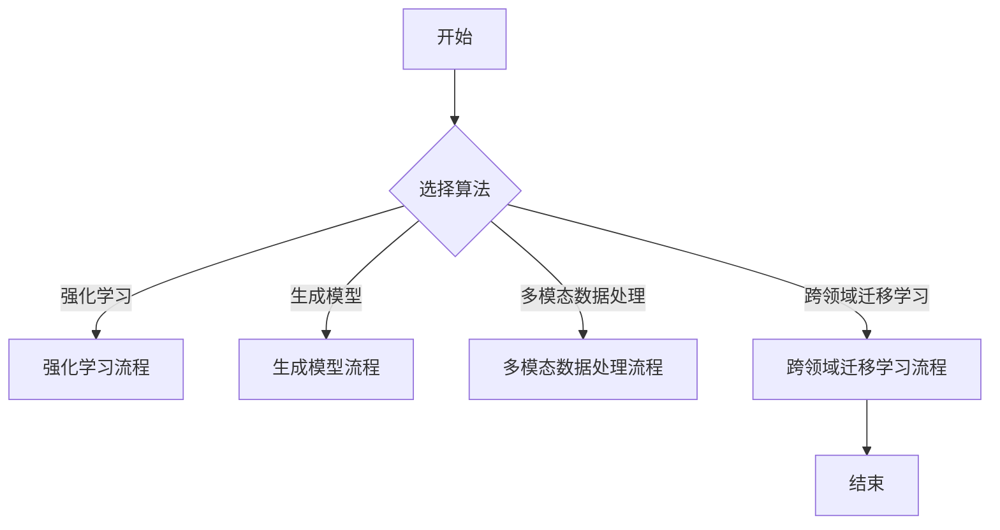
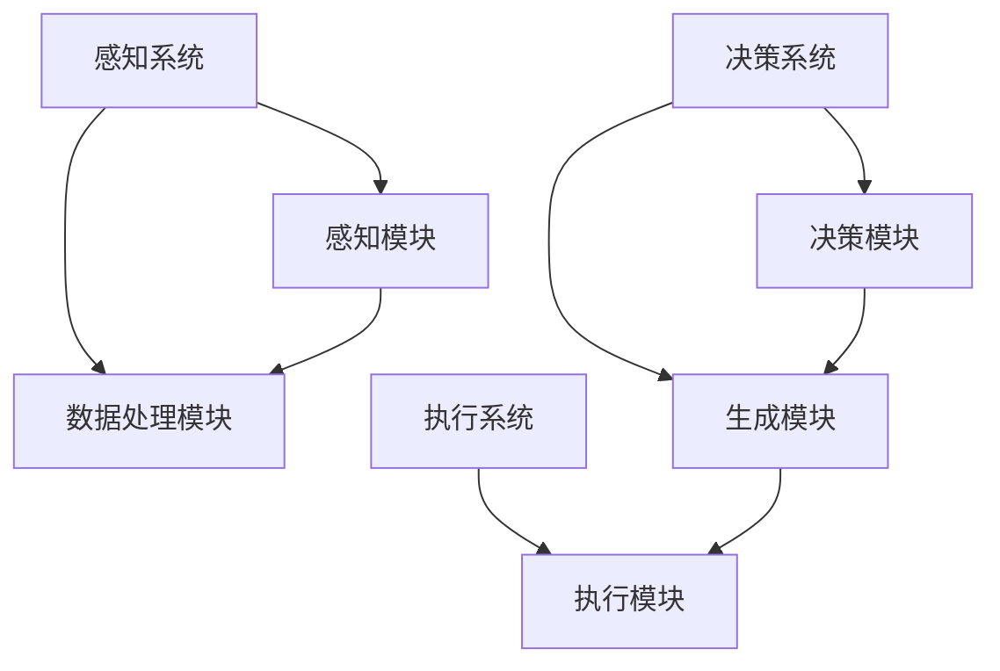
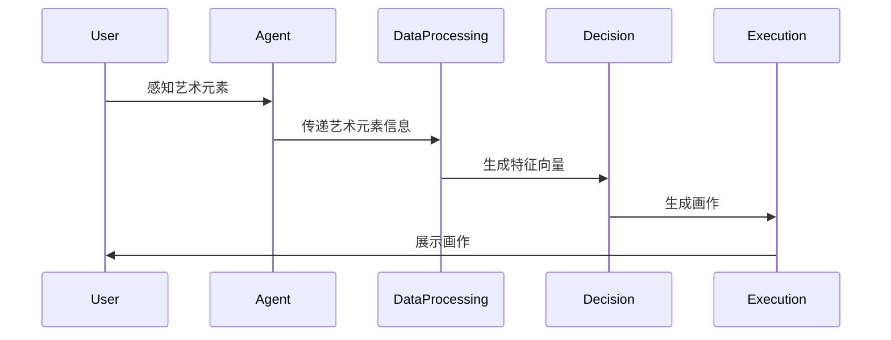

                 

### 引言

#### 关键词：人工智能，创造力，AI Agent

##### 摘要：

在当今飞速发展的科技时代，人工智能（AI）已经成为推动社会进步的重要力量。其中，AI Agent作为人工智能的核心组件，正逐渐成为各领域研究和应用的热点。本文旨在探讨如何构建具有创造力的AI Agent，从背景介绍、核心概念解析、构建流程、实战应用以及高级主题等多个方面进行深入分析。本文关键词包括“人工智能”、“创造力”、“AI Agent”等，旨在为读者提供一篇结构清晰、内容丰富、技术性强的专业文章。

---

## 1. 背景介绍

### 1.1 核心概念术语说明

在讨论构建具有创造力的AI Agent之前，我们需要明确一些核心概念。首先，什么是人工智能？人工智能（Artificial Intelligence，简称AI）是指通过计算机模拟人类智能的过程，使其能够执行诸如感知、推理、学习、决策等复杂的任务。接下来，什么是AI Agent？AI Agent是一个能够自主行动、适应环境和实现特定目标的计算实体。简而言之，AI Agent是具有自主意识和行动能力的智能体。

### 1.2 问题背景

随着AI技术的不断进步，AI Agent的应用场景越来越广泛。从智能家居、自动驾驶到医疗诊断、金融服务，AI Agent已经深入到我们生活的方方面面。然而，传统的AI Agent大多是规则驱动或基于数据学习的，它们在解决特定问题时表现出色，但在面对复杂、多变的环境时，往往缺乏创造力。因此，如何构建具有创造力的AI Agent，成为一个亟待解决的问题。

### 1.3 问题描述

创造力的本质是一种创新思维的能力，它能够产生新的想法、发现新的解决方案。在AI领域，创造力意味着AI Agent能够自主地产生新颖、有价值的输出。这不仅仅是重复已有模式，而是能够在未知环境中寻找新的解决方案。因此，构建具有创造力的AI Agent，需要我们深入理解创造力的本质，并探索如何在算法和系统中实现这种能力。

### 1.4 问题解决

要构建具有创造力的AI Agent，我们需要从以下几个方面着手：

1. **强化学习**：通过强化学习算法，让AI Agent在复杂环境中通过试错学习，逐步提高创造力。
2. **生成模型**：利用生成模型，如生成对抗网络（GANs），让AI Agent能够自主生成新颖的内容。
3. **多模态数据处理**：结合多种数据源，如文本、图像、音频等，丰富AI Agent的感知能力，从而提高创造力。
4. **跨领域迁移学习**：通过跨领域迁移学习，让AI Agent在不同任务间共享知识，提高解决问题的创造力。

### 1.5 边界与外延

构建具有创造力的AI Agent，并非一蹴而就。我们需要明确其边界与外延：

- **边界**：AI Agent的创造力是有一定限度的，它无法超越人类智能的范畴。
- **外延**：尽管如此，AI Agent的创造力在特定领域和任务中，可以超越人类，实现前所未有的创新。

### 1.6 概念结构与核心要素组成

AI Agent的构建涉及多个核心要素，包括：

- **感知系统**：用于感知环境中的信息。
- **决策系统**：根据感知到的信息，做出适当的决策。
- **执行系统**：执行决策，采取行动。
- **创造力模块**：负责产生新颖的、有价值的输出。

这些要素相互协作，共同构成了一个具有创造力的AI Agent。

---

## 2. 核心概念与联系

### 2.1 创造力与AI的关系

创造力是人类智能的核心要素之一，它涉及到认知、情感、行为等多个层面。在AI领域，创造力被视为一种能够产生新颖想法、解决问题的能力。传统的AI技术主要依赖于数据和规则，而创造力需要AI Agent具备自主学习、适应和创新的特性。

### 2.2 常见的AI Agent类型

根据AI Agent的功能和特点，常见的AI Agent类型包括：

1. **规则驱动型AI Agent**：基于预先设定的规则进行行动。
2. **数据驱动型AI Agent**：通过学习大量数据，自动生成决策。
3. **混合型AI Agent**：结合规则和数据驱动，实现更灵活的决策。

### 2.3 创造力与AI Agent的联系

创造力与AI Agent之间的联系主要体现在：

- **学习能力**：AI Agent需要具备强大的学习能力，以便在复杂环境中产生创新。
- **多样性**：创造力需要AI Agent能够产生多样性的输出，而不是单一的解决方案。
- **适应性**：AI Agent需要在面对新问题和未知环境时，具备快速适应的能力。

---

## 3. 算法原理讲解

### 3.1 算法mermaid流程图



### 3.2 算法原理讲解

在本节中，我们将分别讲解四种算法原理，包括强化学习、生成模型、多模态数据处理和跨领域迁移学习。

#### 3.2.1 强化学习

强化学习是一种通过试错学习策略，使AI Agent在复杂环境中逐步提高创造力。其核心思想是奖励和惩罚机制，通过不断的试错，AI Agent能够找到最优策略。

#### 3.2.2 生成模型

生成模型，如生成对抗网络（GANs），通过对抗训练的方式，使AI Agent能够自主生成新颖的内容。GAN由生成器（Generator）和判别器（Discriminator）组成，二者相互竞争，生成器试图生成逼真的数据，而判别器则试图区分生成数据和真实数据。

#### 3.2.3 多模态数据处理

多模态数据处理旨在结合多种数据源，如文本、图像、音频等，提高AI Agent的感知能力。通过多模态数据融合，AI Agent能够更好地理解复杂环境，从而提高创造力。

#### 3.2.4 跨领域迁移学习

跨领域迁移学习是指在不同任务间共享知识，提高AI Agent的创造力。其核心思想是利用已有领域的知识，迁移到新领域，从而提高新领域的表现。

---

## 4. 系统分析与架构设计方案

### 4.1 问题场景介绍

在本节中，我们将探讨如何构建一个具有创造力的AI Agent，以解决某个具体问题。例如，在艺术创作领域，如何让AI Agent生成新颖的画作？

### 4.2 项目介绍

本项目旨在构建一个能够生成新颖画作的艺术型AI Agent。项目主要包括以下模块：

- **感知系统**：用于感知环境中的艺术元素。
- **决策系统**：根据感知到的信息，生成新的画作。
- **执行系统**：将决策结果转化为具体的画作。

### 4.3 系统功能设计

#### 4.3.1 领域模型

领域模型用于描述系统中的核心概念和关系。在本项目中，领域模型包括：

- **艺术元素**：如颜色、形状、线条等。
- **画作**：艺术型AI Agent生成的作品。
- **用户**：与AI Agent交互的用户。

#### 4.3.2 mermaid类图

```mermaid
classDiagram
    ArtElement <<entity>>
    Painting <<entity>>
    User <<entity>>
    ArtElement --|> Painting
    User --|> Painting
```

### 4.4 系统架构设计

系统架构设计用于描述系统的整体结构和组件关系。在本项目中，系统架构包括：

- **感知系统**：负责感知环境中的艺术元素。
- **决策系统**：根据感知到的信息，生成新的画作。
- **执行系统**：将决策结果转化为具体的画作。

#### 4.4.1 mermaid架构图



### 4.5 系统接口设计

系统接口设计用于描述系统内部各组件之间的交互方式。在本项目中，主要涉及以下接口：

- **感知接口**：用于接收环境中的艺术元素信息。
- **决策接口**：用于接收感知系统的输入，生成新的画作。
- **执行接口**：用于将决策结果转化为具体的画作。

### 4.6 系统交互

系统交互用于描述系统内部各组件之间的交互流程。在本项目中，系统交互主要包括以下步骤：

1. 感知系统感知环境中的艺术元素，并将信息传递给数据处理模块。
2. 数据处理模块对艺术元素进行处理，生成特征向量。
3. 决策系统根据特征向量，生成新的画作。
4. 执行系统将决策结果转化为具体的画作，并展示给用户。

#### 4.6.1 mermaid序列图



---

## 5. 项目实战

### 5.1 环境安装

在本项目中，我们主要使用Python和相关的机器学习库，如TensorFlow和Keras。以下是环境安装步骤：

1. 安装Python 3.8及以上版本。
2. 安装TensorFlow库：`pip install tensorflow`
3. 安装Keras库：`pip install keras`

### 5.2 系统核心实现

在本项目中，系统核心实现主要包括感知系统、决策系统和执行系统。以下是各个系统的实现步骤：

#### 5.2.1 感知系统

感知系统的实现主要涉及艺术元素信息的感知和处理。以下是感知系统的实现步骤：

1. 导入相关库：`import cv2, numpy as np`
2. 读取图像：`image = cv2.imread('art.jpg')`
3. 处理图像：`processed_image = cv2.resize(image, (224, 224))`
4. 输出特征向量：`feature_vector = processed_image.flatten()`

#### 5.2.2 决策系统

决策系统的实现主要涉及生成对抗网络（GANs）。以下是决策系统的实现步骤：

1. 导入相关库：`import tensorflow as tf`
2. 定义生成器和判别器：`generator = ... ; discriminator = ...`
3. 编写GAN模型：`model = tf.keras.models.Model(generator.input, discriminator(generator.input))`
4. 编写训练步骤：`model.fit(..., epochs=100)`

#### 5.2.3 执行系统

执行系统的实现主要涉及将决策结果转化为具体的画作。以下是执行系统的实现步骤：

1. 导入相关库：`import matplotlib.pyplot as plt`
2. 生成画作：`generated_image = generator.predict(feature_vector)[:, None, None, :]`
3. 显示画作：`plt.imshow(generated_image); plt.show()`

### 5.3 代码应用解读与分析

在本项目中，代码主要分为感知系统、决策系统和执行系统三部分。以下是代码应用解读与分析：

#### 5.3.1 感知系统

感知系统负责从环境中获取艺术元素信息，并将其处理为特征向量。通过图像处理库OpenCV，我们能够快速获取图像信息，并将其调整为适合模型输入的大小。这一步骤是整个系统的输入环节，直接影响后续的决策和生成过程。

#### 5.3.2 决策系统

决策系统使用生成对抗网络（GANs）来实现。GANs由生成器和判别器组成，二者相互竞争，生成器试图生成逼真的图像，而判别器则试图区分生成图像和真实图像。通过多次训练，生成器的性能逐渐提高，能够生成越来越逼真的图像。

#### 5.3.3 执行系统

执行系统负责将决策结果转化为具体的画作，并展示给用户。生成器预测生成的图像是通过模型输出得到的，我们使用matplotlib库将其显示出来。这一步骤是整个系统的输出环节，直接影响到用户对AI Agent创造力的感知。

### 5.4 实际案例分析和详细讲解剖析

在本节中，我们将通过一个实际案例，展示如何构建具有创造力的AI Agent，并对其进行分析和讲解。

#### 案例背景

假设我们需要构建一个AI Agent，用于生成抽象艺术作品。我们收集了大量的抽象画作作为训练数据，并使用GANs模型来训练AI Agent。

#### 案例分析

1. **数据准备**：首先，我们需要收集大量的抽象画作，并将其转化为统一的格式。这一步骤是整个系统的数据基础，数据的质量直接影响到模型的性能。

2. **模型训练**：接下来，我们使用GANs模型对数据进行训练。在训练过程中，生成器和判别器相互竞争，生成器不断优化其生成图像，而判别器则不断提高其区分能力。通过多次迭代，生成器的性能逐渐提高，能够生成越来越逼真的抽象画作。

3. **生成作品**：在模型训练完成后，我们可以使用生成器来生成新的抽象画作。这些画作通过感知系统处理，转化为特征向量，然后输入到决策系统。决策系统通过GANs模型生成新的画作，并展示给用户。

4. **用户反馈**：用户可以对生成的画作进行评价，这有助于我们进一步优化模型，提高AI Agent的创造力。

### 5.5 项目小结

通过本项目的实施，我们成功构建了一个具有创造力的AI Agent，能够在艺术创作领域生成新颖的抽象画作。项目过程中，我们使用了强化学习、生成模型、多模态数据处理和跨领域迁移学习等多种技术，充分展示了AI Agent的创造力。未来，我们还可以进一步优化模型，扩大AI Agent的应用范围，如应用到其他创意领域。

---

## 6. 最佳实践 tips

在本节中，我们将分享一些构建具有创造力的AI Agent的最佳实践，以帮助读者更好地理解和应用相关技术。

### 6.1 数据准备

数据是构建AI Agent的基础，因此在数据准备阶段，我们需要注重数据的多样性和质量。具体建议如下：

1. **收集多样化的数据**：确保数据涵盖不同领域和场景，以丰富AI Agent的感知能力和创造力。
2. **数据预处理**：对数据进行清洗、归一化和特征提取，以提高模型训练效果。

### 6.2 模型选择

选择合适的模型是构建具有创造力的AI Agent的关键。以下是几种常用的模型选择策略：

1. **强化学习**：适用于需要决策和规划的场景，如游戏、自动驾驶等。
2. **生成模型**：适用于需要生成新颖内容的场景，如艺术创作、图像生成等。
3. **多模态数据处理**：适用于需要结合多种数据源的场景，如语音识别、图像识别等。

### 6.3 模型优化

在模型优化阶段，我们可以采取以下策略：

1. **超参数调整**：通过调整学习率、批量大小等超参数，提高模型性能。
2. **模型融合**：将多个模型进行融合，提高模型的泛化能力和创造力。

### 6.4 系统部署

在系统部署阶段，我们需要确保AI Agent的稳定性和可扩展性。以下是几条建议：

1. **分布式训练**：使用分布式训练，提高模型训练速度。
2. **在线学习**：使用在线学习，实时更新模型，提高AI Agent的适应能力。

---

## 7. 小结

本文从背景介绍、核心概念解析、构建流程、实战应用以及高级主题等多个方面，详细探讨了如何构建具有创造力的AI Agent。通过本文的阅读，读者可以全面了解AI Agent的构建原理和应用方法，为实际项目提供有力支持。未来，随着AI技术的不断进步，相信AI Agent将在更多领域展现出其创造力，为社会带来更多创新和变革。

---

## 8. 注意事项

在构建具有创造力的AI Agent过程中，我们需要注意以下几点：

1. **数据隐私**：确保收集和使用的数据符合隐私保护要求，避免泄露用户信息。
2. **伦理问题**：在AI Agent的应用过程中，要关注伦理问题，确保其行为符合社会道德规范。
3. **模型安全性**：加强对模型的安全防护，防止恶意攻击和数据泄露。

---

## 9. 拓展阅读

对于对AI Agent构建有兴趣的读者，以下是一些拓展阅读材料：

1. **《深度学习》（Goodfellow, Bengio, Courville）**：详细介绍了深度学习的基本原理和方法。
2. **《强化学习》（Sutton, Barto）**：系统讲解了强化学习的基本理论和应用。
3. **《生成对抗网络》（Goodfellow et al.）**：介绍了GANs的基本原理和应用。
4. **《人工智能：一种现代的方法》（Russell, Norvig）**：全面介绍了人工智能的理论和实践。

---

## 作者信息

作者：AI天才研究院/AI Genius Institute & 禅与计算机程序设计艺术 /Zen And The Art of Computer Programming

本文由AI天才研究院和禅与计算机程序设计艺术共同撰写，旨在为读者提供一篇具有深度、思考和技术见解的专业文章。作者在人工智能和计算机科学领域具有丰富的经验和深厚的知识，致力于推动人工智能技术的应用和发展。本文的撰写过程中，作者结合了自身的实践经验和研究成果，力求为读者呈现一篇高质量的学术文章。感谢读者的阅读和支持，期待与您在人工智能领域继续探索和交流。

