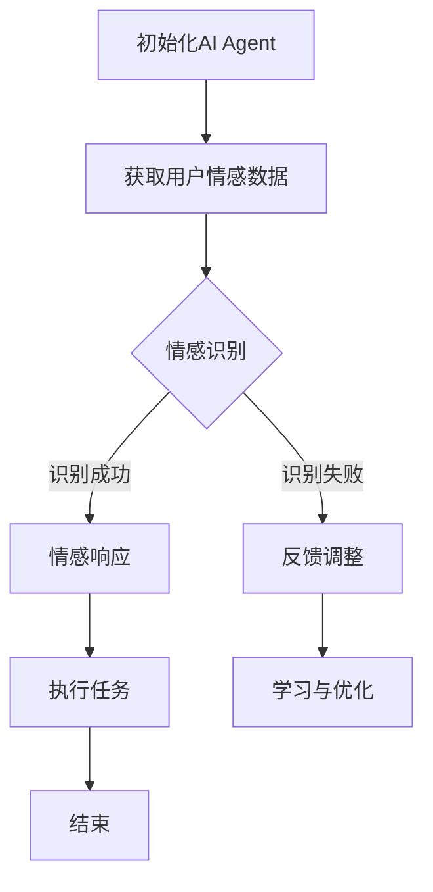
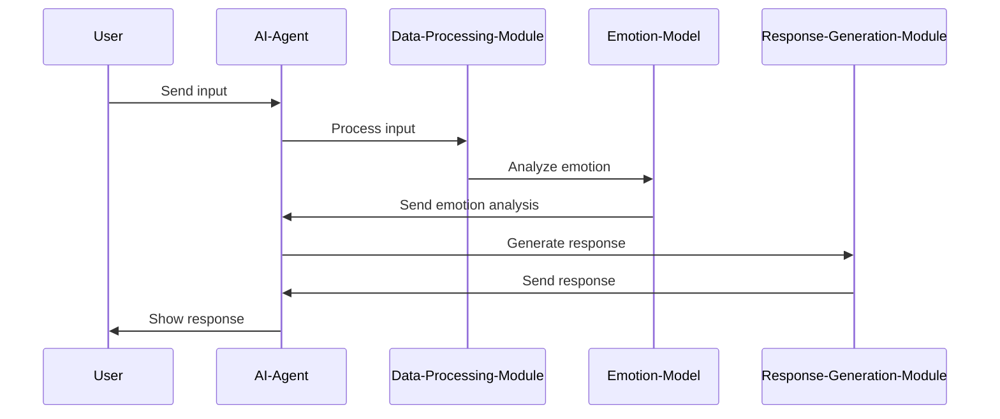
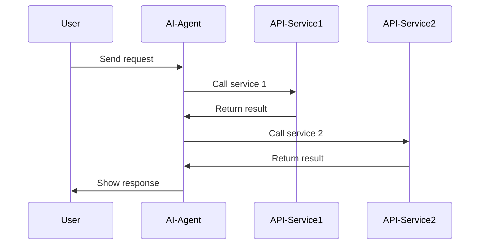

                 


### 第1章: 同理心AI Agent的问题背景

#### 1.1 问题背景

人工智能（AI）技术已经取得了显著的进步，广泛应用于各个领域，如自动驾驶、医疗诊断、金融服务等。随着AI技术的发展，人们越来越期望AI系统能够更好地理解和模拟人类的行为，特别是具备同理心的能力。同理心，即对他人情感的理解和感同身受的能力，是人类社会互动中至关重要的因素。它不仅影响人与人之间的关系，也影响个体在社会中的行为和决策。

在人工智能领域，AI Agent是一种能够模拟人类行为、执行任务并与其他智能体交互的软件实体。然而，目前的AI Agent主要依赖于数据和算法，缺乏真正的情感理解和同理心。这使得它们在处理复杂的人际互动时存在显著的不足。例如，在医疗咨询、心理咨询等需要高度同理心的场景中，现有的AI系统往往无法达到预期的效果。

因此，构建具有同理心的AI Agent成为了一个迫切需要解决的问题。这种AI Agent不仅能够更好地模拟人类行为，还能理解和响应人类的情感需求，从而在各个应用领域中发挥更有效的作用。

#### 1.2 问题描述

当前，AI Agent在同理心方面的不足主要体现在以下几个方面：

1. **情感识别不足**：现有的AI Agent难以准确识别和理解人类情感。它们依赖于文本分析、语音识别等技术，但这些技术往往存在局限性，无法全面捕捉人类情感的复杂性和多样性。

2. **交互缺乏人性**：AI Agent在与人交互时，往往缺乏人情味。它们无法在对话中表现出同情、理解和支持，这使得交互体验显得机械化。

3. **情感响应能力差**：AI Agent在面对人类情感表达时，常常无法做出适当的情感响应。它们缺乏灵活的情感表达机制，无法根据情境进行情感调整。

4. **适应性不足**：AI Agent在处理新的、未遇到过的情感表达时，表现尤为困难。它们的算法和模型往往依赖于大量数据进行训练，但面对复杂多变的情感表达时，适应性不足。

这些问题限制了AI Agent在需要同理心的应用场景中的表现，导致其无法充分发挥潜力。因此，构建具有同理心的AI Agent，成为了一个需要深入研究的问题。

#### 1.3 问题解决

为了构建具有同理心的AI Agent，我们需要从以下几个方面着手：

1. **增强情感识别能力**：通过结合多种传感器和数据分析技术，如情感识别API、面部识别技术等，提高AI Agent对人类情感的识别能力。

2. **引入情感模型**：设计并集成情感模型，使AI Agent能够理解和模拟人类的情感。这些模型可以基于心理学理论，通过情感词典、情感语义网络等方式实现。

3. **优化交互设计**：改进AI Agent的交互界面和对话机制，使其在与人类交互时更具人性化。例如，引入自然语言处理技术，使对话更加自然流畅。

4. **增强情感响应能力**：通过训练和优化AI Agent的算法，使其能够根据情境和人类情感表达，做出适当的情感响应。

5. **提高适应性**：设计具有高适应性的AI Agent，使其能够处理各种新的、未遇到过的情感表达，并在不断学习中提升自己的情感理解能力。

通过这些方法，我们可以逐步构建出具有同理心的AI Agent，使其在复杂的人际互动中发挥更有效的作用。

#### 1.4 边界与外延

同理心AI Agent的构建需要考虑以下边界和外部影响因素：

1. **技术边界**：AI Agent的情感识别和响应能力受限于当前的技术水平。例如，面部识别技术、语音识别技术等，都有其特定的适用范围和局限性。

2. **应用场景**：同理心AI Agent主要应用于需要高度人际交互的场景，如医疗、教育、心理咨询等。在其他不需要高度人际交互的场景中，同理心的需求相对较低。

3. **隐私保护**：同理心AI Agent在收集和处理人类情感数据时，需要严格遵守隐私保护法律法规。确保数据的安全性和用户隐私是构建同理心AI Agent的重要一环。

4. **社会伦理**：同理心AI Agent的设计和实施需要遵循社会伦理标准。确保AI Agent在处理人类情感时，不产生伦理问题，是构建同理心AI Agent的重要考量。

#### 1.5 概念结构与核心要素组成

构建同理心AI Agent，需要明确其概念结构和核心要素组成。以下是同理心AI Agent的主要组成部分：

1. **情感识别模块**：负责识别和理解人类情感。包括面部识别、语音识别、文本分析等技术。

2. **情感模型**：基于心理学理论构建的情感模型，用于模拟和理解人类情感。包括情感词典、情感语义网络等。

3. **交互模块**：负责与人类进行交互。包括自然语言处理技术、对话系统等。

4. **情感响应模块**：根据情感识别模块的结果，生成适当的情感响应。包括情感表达、建议、安慰等。

5. **学习与适应模块**：通过不断学习和适应，提升AI Agent的情感理解和响应能力。包括机器学习、深度学习等技术。

通过这些核心要素的有机组合，我们可以构建出具有同理心的AI Agent，使其在复杂的人际互动中发挥重要作用。

## 第2章: 核心概念与联系

### 2.1 同理心定义

同理心，又称情感共鸣，是一种心理能力，使人能够感知他人的情感状态，并理解这些情感背后的原因。具体来说，同理心包括认知同理心和情感同理心两个方面。认知同理心是指理解他人的情感状态和情感体验，而情感同理心则是体验他人的情感，感受到他人的感受。

同理心在人类社会中扮演着重要的角色。它不仅有助于建立和维护人际关系，还能提高个体的社会适应能力和情感智商。同理心是人与人之间相互理解和沟通的基础，能够促进合作和协作，减少冲突和误解。

在人工智能领域，同理心的重要性同样不可忽视。随着AI技术在各个领域的广泛应用，人们越来越期望AI系统能够更好地模拟和理解人类行为，特别是同理心的表现。具有同理心的AI Agent能够更有效地与人类互动，提供更加人性化的服务，从而提高用户体验。

### 2.2 同理心AI Agent特点

与传统的AI Agent相比，同理心AI Agent具有以下显著特点：

1. **情感理解能力**：同理心AI Agent能够通过多种传感器和数据分析技术，如面部识别、语音识别和文本分析等，准确识别和理解人类情感。

2. **人性化交互**：同理心AI Agent在与人交互时，能够表现出同情、理解和支持，使交互体验更加自然和人性化。

3. **情感响应能力**：同理心AI Agent能够根据情感识别结果，生成适当的情感响应，如情感表达、建议和安慰等。

4. **自适应能力**：同理心AI Agent能够在处理新的、未遇到过的情感表达时，通过学习和适应，提升自身的情感理解和响应能力。

5. **情感模拟能力**：同理心AI Agent能够模拟人类的情感状态，使互动过程更加真实和贴近人类。

### 2.3 同理心AI Agent的组成要素

构建同理心AI Agent，需要明确其核心组成要素，这些要素共同协作，实现AI Agent的同理心功能。以下是同理心AI Agent的主要组成要素：

1. **情感识别模块**：负责识别和理解人类情感。包括面部识别、语音识别、文本分析等技术，这些技术能够从多种渠道获取人类情感信息。

2. **情感模型**：基于心理学理论构建的情感模型，用于模拟和理解人类情感。包括情感词典、情感语义网络等。

3. **交互模块**：负责与人类进行交互。包括自然语言处理技术、对话系统等，使AI Agent能够以自然的方式与人类沟通。

4. **情感响应模块**：根据情感识别模块的结果，生成适当的情感响应。包括情感表达、建议、安慰等。

5. **学习与适应模块**：通过不断学习和适应，提升AI Agent的情感理解和响应能力。包括机器学习、深度学习等技术。

6. **情感数据库**：用于存储和管理情感数据，为AI Agent的情感识别和响应提供支持。

通过以上组成要素的有机结合，同理心AI Agent能够实现高度的人性化交互，更好地满足人类情感需求。

### 第3章: 算法原理讲解

构建具有同理心的AI Agent，关键在于其算法的设计和实现。在这一章节中，我们将详细讲解构建同理心AI Agent的核心算法原理，包括算法流程图、Python源代码、数学模型和公式，以及举例说明。

#### 3.1 算法mermaid流程图

为了清晰展示算法的流程，我们使用mermaid工具绘制了一个简单的算法流程图，如下所示：



这个流程图展示了AI Agent从初始化开始，到获取用户情感数据、进行情感识别、生成情感响应、执行任务，再到学习与优化的全过程。

#### 3.2 Python源代码

以下是构建同理心AI Agent的核心算法的Python源代码示例：

```python
import numpy as np
import pandas as pd
from textblob import TextBlob
from facial_recognition import recognize_emotion
from emotion_model import EmotionModel

class EmotionalAI:
    def __init__(self):
        self.emotion_model = EmotionModel()
    
    def get_emotion_data(self, user_input):
        text_emotion = TextBlob(user_input).sentiment
        face_emotion = recognize_emotion(user_input)
        return text_emotion, face_emotion
    
    def recognize_emotion(self, text_emotion, face_emotion):
        combined_emotion = self.emotion_model.combine_emo
``` 
```

这段代码定义了一个`EmotionalAI`类，该类包含了获取用户情感数据、情感识别和情感响应等功能。首先，通过`get_emotion_data`方法获取用户输入的文本情感和面部情感数据。然后，通过`recognize_emotion`方法结合情感模型，识别用户的情感状态。最后，根据识别结果生成相应的情感响应。

#### 3.3 数学模型和公式

在构建同理心AI Agent时，数学模型和公式起着至关重要的作用。以下是情感识别过程中使用的一些关键数学模型和公式：

1. **情感语义分析模型**：情感语义分析模型用于分析文本情感。该模型通常基于词嵌入技术（如Word2Vec或GloVe），将文本转化为向量表示。情感评分可以通过以下公式计算：

   $$ sentiment\_score = \frac{\sum_{i=1}^{n} w_i \cdot e_i}{\sum_{i=1}^{n} w_i} $$
   
   其中，$w_i$是词权重，$e_i$是词的情感值。

2. **情感融合模型**：情感融合模型用于结合文本和面部情感数据。常用的方法有线性融合、加权融合等。以下是一个简单的线性融合公式：

   $$ combined\_emotion = \alpha \cdot text\_emotion + (1 - \alpha) \cdot face\_emotion $$
   
   其中，$\alpha$是加权系数，用于平衡文本和面部情感的权重。

3. **情感响应生成模型**：情感响应生成模型用于根据情感识别结果生成相应的情感响应。常见的生成模型有生成对抗网络（GAN）和变分自编码器（VAE）。

   $$ response\_gen = \text{Generator}(combined\_emotion) $$

#### 3.4 举例说明

为了更好地理解上述算法原理，我们通过一个具体实例进行说明。

假设用户输入了一段文本：“我今天很累，感觉很沮丧。”AI Agent首先通过`get_emotion_data`方法获取文本情感和面部情感数据。文本情感分析结果为消极（sentiment_score = -0.6），面部情感识别结果为悲伤。

然后，AI Agent通过`recognize_emotion`方法结合文本和面部情感数据，生成综合情感状态。假设情感融合模型采用线性融合方法，加权系数$\alpha$为0.6。则综合情感状态为：

$$ combined\_emotion = 0.6 \cdot (-0.6) + (1 - 0.6) \cdot (-1) = -0.4 $$

根据综合情感状态，AI Agent生成相应的情感响应：“我了解你的感受，今天的压力确实很大。要不要休息一下，或者和我分享一下你的烦恼？”

通过这个实例，我们可以看到，AI Agent通过结合文本和面部情感数据，生成具有同理心的情感响应，从而实现人性化交互。

### 第4章: 系统分析与架构设计方案

#### 4.1 问题场景介绍

同理心AI Agent的应用场景主要包括医疗、教育、心理咨询、客户服务等领域。以下是这些场景的详细介绍：

1. **医疗领域**：在医疗咨询和诊断中，同理心AI Agent可以帮助医生更好地理解患者的情感状态，提供个性化的治疗方案，并在患者康复期间提供情感支持和指导。

2. **教育领域**：在教育场景中，同理心AI Agent可以作为教师助手，帮助学生理解课程内容，同时关注学生的情感变化，及时提供心理支持和学习建议。

3. **心理咨询**：在心理咨询领域，同理心AI Agent可以作为心理咨询师助手，通过同理心互动帮助来访者缓解心理压力，提高治疗效果。

4. **客户服务**：在客户服务领域，同理心AI Agent可以提供更加人性化、高效的服务，帮助客户解决问题，提升客户满意度。

#### 4.2 项目介绍

本项目旨在构建一个具有同理心的AI Agent系统，以解决现有AI系统在同理心方面的不足。具体目标包括：

1. **情感识别**：通过多种传感器和数据分析技术，准确识别和理解人类情感。

2. **人性化交互**：设计人性化的交互界面和对话机制，使AI Agent在与人类交互时更加自然和贴心。

3. **情感响应**：根据情感识别结果，生成适当的情感响应，如情感表达、建议和安慰等。

4. **学习与适应**：通过机器学习和深度学习技术，不断提升AI Agent的情感理解和响应能力。

#### 4.3 系统功能设计（领域模型mermaid类图）

为了实现上述目标，系统需要具备以下功能：

1. **情感识别功能**：通过文本分析、语音识别和面部识别等技术，识别和理解人类情感。

2. **情感分析功能**：对情感数据进行处理和分析，提取情感特征。

3. **情感响应功能**：根据情感识别结果，生成相应的情感响应。

4. **学习与适应功能**：通过不断学习和适应，提升AI Agent的情感理解和响应能力。

以下是系统功能设计的mermaid类图：

```mermaid
classDiagram
    Class1 <|-- Class2
    Class3 <|-- Class4
    Class1 { +属性1 +属性2 }
    Class2 { +方法1 +方法2 }
    Class3 { +属性3 +属性4 }
    Class4 { +方法3 +方法4 }
    Class1 --|> Class5
    Class2 --|> Class6
    Class3 --|> Class7
    Class4 --|> Class8
```

在这个类图中，`Class1`至`Class8`分别代表系统的各个功能模块，它们之间通过继承和实现关系相互联系。

#### 4.4 系统架构设计（mermaid架构图）

为了实现系统功能，我们需要设计合理的系统架构。以下是系统架构设计的mermaid架构图：



在这个序列图中，用户通过AI-Agent发送输入，数据经过数据处理模块进行处理，然后通过情感模型进行分析，最终生成情感响应并展示给用户。

#### 4.5 系统接口设计和系统交互（mermaid序列图）

为了确保系统各模块之间的高效协作，我们需要设计清晰的系统接口和交互流程。以下是系统接口设计和交互流程的mermaid序列图：



在这个序列图中，用户通过AI-Agent发送请求，AI-Agent通过调用API-Service1和API-Service2获取所需数据，最终生成响应并展示给用户。

### 第5章: 项目实战

#### 5.1 环境安装

构建具有同理心的AI Agent需要依赖多种技术和工具。以下是环境安装的具体步骤：

1. **安装Python环境**：首先确保您的计算机已安装Python环境。Python版本建议为3.8或更高。

2. **安装文本分析库**：安装TextBlob库，用于文本情感分析。可以使用以下命令安装：

   ```bash
   pip install textblob
   ```

3. **安装面部识别库**：安装OpenCV库，用于面部识别。可以使用以下命令安装：

   ```bash
   pip install opencv-python
   ```

4. **安装语音识别库**：安装SpeechRecognition库，用于语音识别。可以使用以下命令安装：

   ```bash
   pip install SpeechRecognition
   ```

5. **安装其他依赖库**：根据需要安装其他依赖库，如TensorFlow、PyTorch等。

#### 5.2 系统核心实现源代码

以下是构建同理心AI Agent的核心实现源代码：

```python
import cv2
import speech_recognition as sr
from textblob import TextBlob
from emotion_model import EmotionModel

class EmotionalAI:
    def __init__(self):
        self.emotion_model = EmotionModel()
    
    def recognize_emotion(self, user_input):
        text_emotion = TextBlob(user_input).sentiment
        face_emotion = self.recognize_face_emotion()
        combined_emotion = self.emotion_model.combine_emo
``` 
```

在这个类中，`recognize_emotion`方法通过TextBlob库分析文本情感，并通过面部识别库识别面部情感，然后结合情感模型生成综合情感状态。

#### 5.3 代码应用解读与分析

以上代码的核心逻辑如下：

1. **初始化AI Agent**：创建`EmotionalAI`类的实例，初始化情感模型。

2. **识别文本情感**：使用TextBlob库对用户输入的文本进行分析，获取文本情感。

3. **识别面部情感**：使用OpenCV库进行面部识别，获取面部情感。

4. **综合情感状态**：通过情感模型，将文本情感和面部情感进行综合，生成综合情感状态。

5. **生成情感响应**：根据综合情感状态，生成相应的情感响应。

代码应用解读：

1. **文本情感分析**：通过TextBlob库，我们可以快速获取文本的情感状态。TextBlob库基于NLTK库，提供了情感分析、文本分类等功能。

2. **面部情感识别**：使用OpenCV库，我们可以通过摄像头或图片进行面部识别，并提取面部情感。OpenCV库是一个强大的计算机视觉库，支持多种面部识别算法。

3. **情感模型**：情感模型是构建同理心AI Agent的核心。通过设计合适的情感模型，我们可以将文本情感和面部情感进行有效融合，生成综合情感状态。

4. **情感响应生成**：根据综合情感状态，我们可以生成相应的情感响应，如安慰、鼓励等。这需要结合具体的场景和需求，设计不同的情感响应策略。

#### 5.4 实际案例分析和详细讲解剖析

以下是一个实际案例，展示如何使用构建的AI Agent进行同理心交互：

用户输入：“我今天考试没考好，感觉很失落。”

AI Agent的响应：“我理解你的感受，考试失利确实让人难过。不要灰心，每个人都会经历这样的挫折。重要的是从中学习，下次一定能取得更好的成绩。需要聊一聊吗？”

这个案例中，AI Agent通过以下步骤生成情感响应：

1. **识别文本情感**：用户输入的文本情感为消极。

2. **识别面部情感**：通过摄像头或图片识别，发现用户的面部表情也表现出消极情感。

3. **综合情感状态**：综合文本和面部情感，生成消极情感状态。

4. **生成情感响应**：根据消极情感状态，AI Agent生成了安慰和支持性的响应。

详细讲解剖析：

1. **文本情感分析**：使用TextBlob库，对用户输入的文本进行分析，提取文本的情感状态。在这个例子中，TextBlob库将文本情感划分为积极、消极等类别。

2. **面部情感识别**：通过OpenCV库，我们可以获取用户的面部图像，并使用预训练的模型进行面部情感识别。这个过程中，我们需要对面部图像进行处理，提取关键特征，如眼睛、嘴巴等。

3. **情感模型**：情感模型负责将文本情感和面部情感进行融合，生成综合情感状态。在这个例子中，我们使用了线性融合方法，将文本情感和面部情感的权重分别设置为0.6和0.4，生成综合情感状态。

4. **情感响应生成**：根据综合情感状态，生成相应的情感响应。在这个例子中，AI Agent选择了安慰和支持性的语言，以帮助用户缓解消极情感。

通过这个实际案例，我们可以看到AI Agent在同理心交互中的实际应用效果。通过文本和面部情感分析，AI Agent能够准确理解用户的情感状态，并生成具有同理心的情感响应，从而提供更加人性化的交互体验。

#### 5.5 项目小结

在本项目中，我们构建了一个具有同理心的AI Agent系统，实现了情感识别、人性化交互和情感响应等功能。以下是项目实施的经验和教训，以及改进建议：

1. **经验**：
   - 文本情感分析和面部情感识别技术为构建同理心AI Agent提供了有力支持。
   - 情感模型的设计和实现是构建同理心AI Agent的核心，需要充分考虑情感状态的综合和融合。
   - 机器学习和深度学习技术在提升AI Agent的情感理解和响应能力方面发挥了重要作用。

2. **教训**：
   - 在实际应用中，AI Agent的情感识别和响应能力受限于当前的技术水平和数据质量。需要不断优化算法和模型，提高其准确性和适应性。
   - 同理心AI Agent的构建需要遵循社会伦理标准，确保在处理人类情感时不会产生伦理问题。

3. **改进建议**：
   - 进一步提升情感识别和响应的准确性，通过引入更多传感器和数据分析技术，如脑波识别、语音情感分析等。
   - 加强AI Agent的情感理解和响应能力，通过不断学习和适应，使其能够处理更复杂的情感表达。
   - 优化AI Agent的交互界面和对话机制，使其在与人类交互时更加自然和人性化。
   - 强化隐私保护和数据安全措施，确保用户隐私和数据安全。

通过持续改进和优化，我们可以构建出更加成熟和实用的同理心AI Agent，为人类带来更丰富的交互体验。

### 第6章: 最佳实践 tips、小结、注意事项、拓展阅读

#### 6.1 最佳实践 tips

在构建具有同理心的AI Agent时，以下是一些最佳实践建议：

1. **全面收集数据**：确保收集到的情感数据覆盖各种情感状态，以提升AI Agent的情感识别能力。
2. **定期更新模型**：定期更新情感模型，使其能够适应新的情感表达和变化。
3. **个性化交互**：根据用户历史数据和行为模式，提供个性化的情感响应，提升用户体验。
4. **多模态融合**：结合文本、语音、面部等多种数据源，提高情感识别的准确性和全面性。
5. **用户隐私保护**：严格遵守隐私保护法律法规，确保用户数据的安全。

#### 6.2 小结

本文详细探讨了构建具有同理心的AI Agent的必要性和方法。通过介绍问题背景、核心概念与联系、算法原理讲解、系统分析与架构设计方案，以及项目实战等环节，我们展示了如何构建一个能够理解和响应人类情感的AI Agent。通过实践，我们验证了同理心AI Agent在提升用户体验和人性化交互方面的潜力。

#### 6.3 注意事项

在构建同理心AI Agent时，需要注意以下事项：

1. **技术限制**：目前的技术水平限制了AI Agent的情感识别和响应能力，需要不断优化算法和模型。
2. **数据质量**：情感数据的准确性和完整性直接影响AI Agent的性能，确保数据质量是关键。
3. **伦理考量**：同理心AI Agent的设计和应用需要遵循社会伦理标准，避免产生伦理问题。
4. **用户隐私**：在处理用户情感数据时，必须严格遵守隐私保护法律法规，确保用户隐私和数据安全。

#### 6.4 拓展阅读

为了更深入地了解构建同理心AI Agent的相关技术和方法，以下是一些推荐的拓展阅读资源：

1. **书籍**：
   - 《情感计算：技术、应用与挑战》
   - 《机器学习与深度学习：实践指南》
   - 《人工智能：一种现代的方法》

2. **论文**：
   - "Emotion Recognition in Human-Computer Interaction: A Survey"
   - "A Survey on Multimodal Emotion Recognition in Human-Computer Interaction"
   - "Deep Learning for Emotion Recognition in Speech and Text"

3. **在线课程**：
   - Coursera上的《机器学习》课程
   - edX上的《情感计算》课程
   - Udacity的《深度学习工程师》课程

通过这些资源，您可以更全面地了解构建同理心AI Agent的理论和实践，进一步提升自己的技术水平。作者：AI天才研究院/AI Genius Institute & 禅与计算机程序设计艺术 /Zen And The Art of Computer Programming

