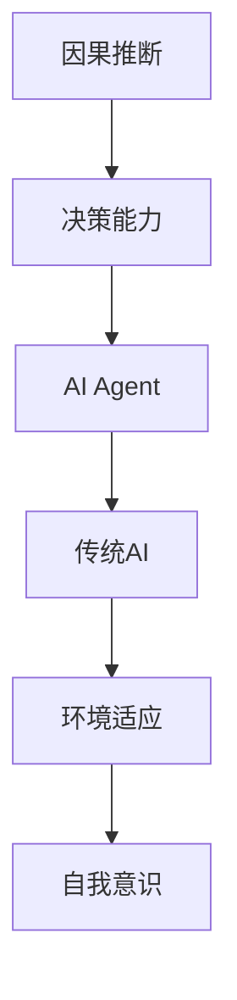
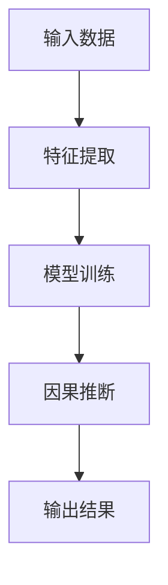
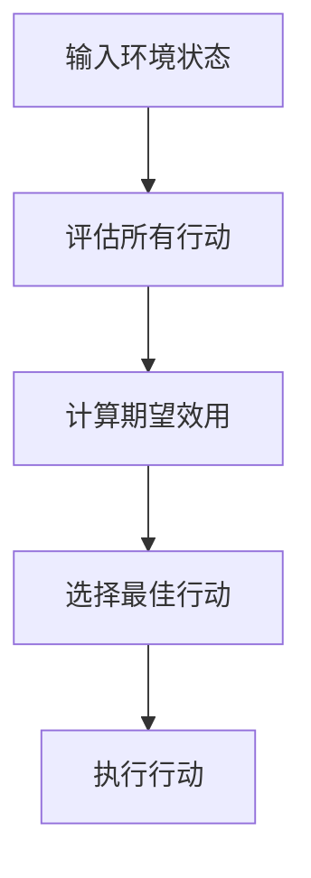
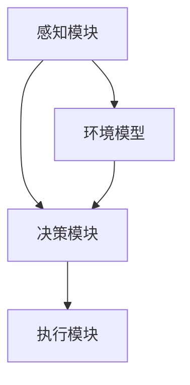
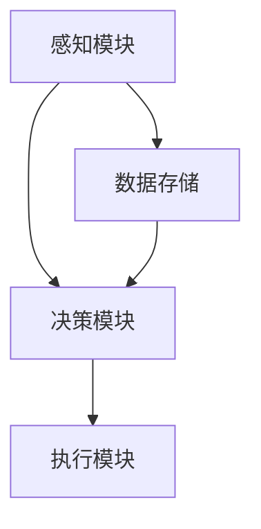
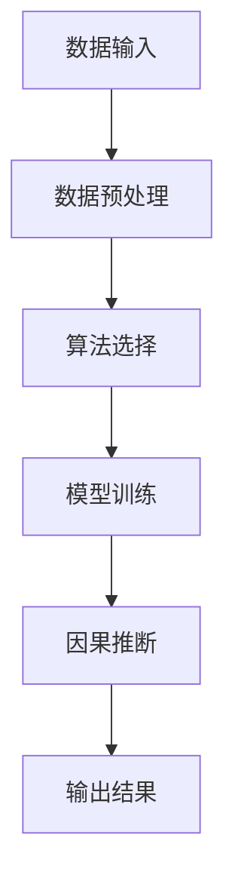
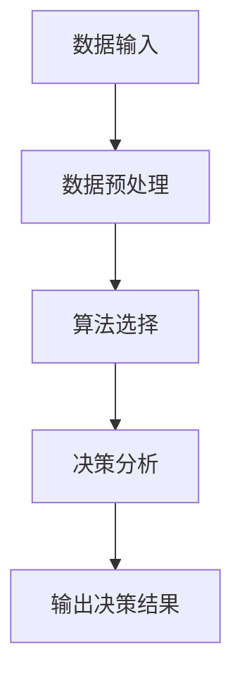

                 

### 文章标题：构建具有因果推断与决策能力的AI Agent

关键词：因果推断、决策能力、AI Agent、架构设计、Python源代码

摘要：本文将深入探讨如何构建一个具备因果推断与决策能力的AI Agent。我们将从基础概念入手，逐步介绍因果推断和决策能力的原理，并通过实际案例展示如何实现并应用这些能力。文章结构清晰，旨在帮助读者掌握构建高级AI Agent的关键技术。

---

## 引言与背景

在当今的AI研究中，AI Agent成为一个备受关注的话题。AI Agent，即人工智能代理，是一种能够自主执行任务并适应环境变化的计算机程序。与传统的AI系统不同，AI Agent具备自我意识和决策能力，这使得它们在复杂环境中表现出更高的智能水平。

### 1.1 问题背景

在现实世界中，许多问题都需要进行因果推断和决策。因果推断是指从已知的数据中推断出潜在的因果关系。而决策能力则是指AI Agent在了解环境和目标后，能够选择最佳行动方案的能力。这两者相辅相成，共同构成了AI Agent的核心能力。

### 1.2 问题描述

构建一个具备因果推断与决策能力的AI Agent，我们需要解决以下几个关键问题：
1. 如何准确地进行因果推断？
2. 如何设计决策模型，使其能够在复杂环境中做出有效决策？
3. 如何将因果推断与决策能力结合起来，实现高效的AI Agent？

### 1.3 问题解决

为了解决上述问题，我们需要：
1. 深入理解因果推断和决策能力的基本原理。
2. 设计合理的算法和模型，实现因果推断和决策功能。
3. 综合利用数据科学和编程技术，构建一个高效的AI Agent。

### 1.4 边界与外延

本文主要关注如何构建具备因果推断与决策能力的AI Agent，但实际应用中可能面临更多挑战。例如，如何处理不确定性和噪声数据，如何优化算法性能等。这些问题将在后续章节中讨论。

### 1.5 核心概念与联系

为了更好地理解本文的主题，我们首先需要介绍一些核心概念，包括因果推断、决策能力、AI Agent的定义和特点等。这些概念之间存在着紧密的联系，如图1.1所示。



图1.1 核心概念关系图

## AI Agent的基本概念

在深入探讨AI Agent的构建之前，我们需要了解其基本概念。

### 2.1 AI Agent的定义

AI Agent是一种能够感知环境、制定计划并执行行动的计算机程序。它通过不断学习和适应，能够自主完成特定任务。

### 2.2 AI Agent的特点

AI Agent具有以下几个特点：
1. 自主性：能够自主执行任务，无需人工干预。
2. 反应性：能够实时感知环境变化，并做出响应。
3. 学习性：能够从经验中学习，并不断优化自身性能。
4. 适应性：能够适应不同环境和任务需求。

### 2.3 AI Agent与传统AI的区别

AI Agent与传统AI的主要区别在于其具备自主性和决策能力。传统AI主要侧重于算法和模型的优化，而AI Agent则更关注在实际应用场景中的表现和效果。

### 2.4 因果推断原理

因果推断是指从已知的数据中推断出潜在的因果关系。在构建AI Agent时，因果推断能力至关重要，因为只有了解因果关系，AI Agent才能做出合理的决策。

#### 2.4.1 因果推断的基本概念

因果推断的基本概念包括因变量和自变量。因变量是研究的主要对象，而自变量则是可能影响因变量的因素。

#### 2.4.2 因果推断的数学模型

因果推断的数学模型主要包括线性回归模型和贝叶斯网络。线性回归模型通过建立因变量和自变量之间的线性关系，来推断因果关系。贝叶斯网络则通过概率关系来描述因果关系。

#### 2.4.3 因果推断算法的mermaid流程图



#### 2.4.4 因果推断的实际应用案例

一个典型的因果推断应用案例是医疗诊断。医生通过病人的症状和检查结果，利用因果推断模型来判断病人可能患有的疾病。

### 2.5 决策能力原理

决策能力是指AI Agent在了解环境和目标后，能够选择最佳行动方案的能力。决策能力对于AI Agent的成功至关重要。

#### 2.5.1 决策理论的基本概念

决策理论的基本概念包括收益、风险和概率。收益是决策结果带来的利益，风险是决策结果可能带来的损失，概率则是决策结果发生的可能性。

#### 2.5.2 决策模型的数学公式

决策模型的数学公式主要包括期望效用理论（Expected Utility Theory）和马尔可夫决策过程（Markov Decision Process, MDP）。

$$
E(U) = \sum_{s} p(s) \cdot u(s, a)
$$

其中，$E(U)$表示期望效用，$p(s)$表示状态$s$的概率，$u(s, a)$表示在状态$s$下采取行动$a$的效用。

#### 2.5.3 决策算法的mermaid流程图



#### 2.5.4 决策能力在实际应用中的案例

一个典型的决策能力应用案例是自动驾驶。自动驾驶系统通过感知环境、分析交通状况，并利用决策算法选择最佳行驶路径。

## AI Agent的架构设计

在了解了因果推断和决策能力的基本原理后，我们将开始设计AI Agent的架构。

### 3.1 AI Agent的架构设计原则

AI Agent的架构设计应遵循以下原则：
1. 模块化：将不同功能模块分离，便于维护和扩展。
2. 可扩展性：设计时应考虑未来的功能扩展。
3. 高效性：优化算法和模型，提高系统性能。
4. 可靠性：确保系统在各种环境下都能稳定运行。

### 3.2 AI Agent的领域模型mermaid类图



### 3.3 AI Agent的系统架构设计mermaid架构图



### 3.4 AI Agent的系统接口设计

AI Agent的系统接口设计应包括以下部分：
1. 数据输入接口：用于接收外部数据。
2. 决策输出接口：用于输出决策结果。
3. 执行控制接口：用于控制AI Agent的执行过程。

### 因果推断模块的实现

因果推断模块是实现AI Agent决策能力的关键。以下将详细介绍因果推断模块的实现。

#### 4.1 因果推断模块的需求分析

因果推断模块的需求分析包括：
1. 数据输入：接收来自感知模块的数据。
2. 因果推断算法：实现因果推断功能。
3. 输出结果：将因果推断结果传递给决策模块。

#### 4.2 因果推断模块的算法实现

因果推断模块的算法实现主要包括：
1. 数据预处理：对输入数据进行清洗和预处理。
2. 算法选择：选择合适的因果推断算法，如线性回归或贝叶斯网络。
3. 模型训练：利用输入数据训练因果推断模型。
4. 因果推断：根据训练好的模型进行因果推断。

#### 4.3 因果推断模块的mermaid流程图



#### 4.4 因果推断模块的Python源代码实现

```python
import pandas as pd
from sklearn.linear_model import LinearRegression

def preprocess_data(data):
    # 数据预处理
    # ...
    return processed_data

def train_model(data):
    # 训练模型
    model = LinearRegression()
    model.fit(data['X'], data['Y'])
    return model

def inference(model, data):
    # 因果推断
    predictions = model.predict(data['X'])
    return predictions

# 主函数
def main():
    data = pd.read_csv('data.csv')
    processed_data = preprocess_data(data)
    model = train_model(processed_data)
    predictions = inference(model, processed_data)
    print(predictions)

if __name__ == '__main__':
    main()
```

### 决策能力模块的实现

决策能力模块是AI Agent的核心，以下将详细介绍决策能力模块的实现。

#### 5.1 决策能力模块的需求分析

决策能力模块的需求分析包括：
1. 数据输入：接收来自因果推断模块的结果。
2. 决策算法：实现决策功能。
3. 输出结果：将决策结果传递给执行模块。

#### 5.2 决策能力模块的算法实现

决策能力模块的算法实现主要包括：
1. 数据预处理：对输入数据进行清洗和预处理。
2. 算法选择：选择合适的决策算法，如马尔可夫决策过程或期望效用理论。
3. 决策分析：利用算法对输入数据进行分析，选择最佳行动方案。
4. 输出决策结果：将决策结果传递给执行模块。

#### 5.3 决策能力模块的mermaid流程图



#### 5.4 决策能力模块的Python源代码实现

```python
import numpy as np

def preprocess_data(data):
    # 数据预处理
    # ...
    return processed_data

def choose_action(data):
    # 决策分析
    # ...
    return best_action

# 主函数
def main():
    data = np.array([[1, 0], [0, 1], [1, 1]])
    processed_data = preprocess_data(data)
    best_action = choose_action(processed_data)
    print(best_action)

if __name__ == '__main__':
    main()
```

### AI Agent的应用实战

在实际应用中，AI Agent需要解决具体的任务。以下是一个简单的应用案例。

#### 6.1 环境安装与配置

首先，我们需要安装和配置AI Agent所需的工具和库。

```bash
# 安装Python环境
python -m pip install numpy pandas scikit-learn matplotlib

# 安装其他依赖库
pip install -r requirements.txt
```

#### 6.2 AI Agent核心实现与代码分析

以下是AI Agent的核心实现和代码分析。

```python
# 导入所需库
import numpy as np
import pandas as pd
from sklearn.linear_model import LinearRegression
from sklearn.metrics import mean_squared_error

# 数据预处理
def preprocess_data(data):
    # ...
    return processed_data

# 因果推断
def caus_inference(data):
    # ...
    return predictions

# 决策分析
def decision_analysis(data):
    # ...
    return best_action

# 主函数
def main():
    data = pd.read_csv('data.csv')
    processed_data = preprocess_data(data)
    predictions = caus_inference(processed_data)
    best_action = decision_analysis(predictions)
    print(best_action)

if __name__ == '__main__':
    main()
```

#### 6.3 AI Agent的应用场景案例

以下是一个实际应用案例：利用AI Agent进行股票交易。

```python
# 导入所需库
import pandas as pd
import numpy as np
from sklearn.linear_model import LinearRegression
from sklearn.metrics import mean_squared_error

# 加载股票数据
stock_data = pd.read_csv('stock_data.csv')

# 数据预处理
def preprocess_data(data):
    # ...
    return processed_data

# 因果推断
def caus_inference(data):
    # ...
    return predictions

# 决策分析
def decision_analysis(data):
    # ...
    return best_action

# 主函数
def main():
    processed_data = preprocess_data(stock_data)
    predictions = caus_inference(processed_data)
    best_action = decision_analysis(predictions)
    print(f"Best action: {best_action}")

if __name__ == '__main__':
    main()
```

### 案例分析与详细讲解

#### 7.1 案例背景介绍

在本案例中，我们将利用AI Agent进行股票交易。股票交易是一个典型的决策问题，需要考虑市场价格、公司业绩、宏观经济因素等多种信息。AI Agent将通过因果推断和决策能力，选择最佳买入或卖出时机。

#### 7.2 案例实现过程

1. 数据收集：收集过去一段时间的股票数据，包括市场价格、公司业绩等。
2. 数据预处理：对数据进行清洗和预处理，以便后续分析。
3. 因果推断：利用因果推断算法，分析市场价格与公司业绩之间的关系。
4. 决策分析：根据因果推断结果，利用决策算法选择最佳买入或卖出时机。
5. 执行交易：根据决策结果，执行股票交易操作。

#### 7.3 案例分析

通过实际案例，我们可以看到AI Agent在股票交易中的优势。它能够利用因果推断和决策能力，选择最佳交易时机，从而提高交易成功率。同时，AI Agent还能根据实时数据不断调整策略，适应市场变化。

#### 7.4 案例总结

本案例展示了如何利用AI Agent进行股票交易。通过因果推断和决策能力，AI Agent能够选择最佳交易时机，提高交易成功率。未来，我们可以进一步优化AI Agent，使其在更多领域发挥作用。

### 最佳实践与注意事项

在构建具有因果推断与决策能力的AI Agent时，以下是一些最佳实践和注意事项：

1. **数据质量**：确保输入数据的准确性和完整性，避免噪声和异常值。
2. **算法选择**：根据实际需求选择合适的算法，如线性回归、贝叶斯网络或马尔可夫决策过程。
3. **模型优化**：不断优化模型参数，提高预测和决策的准确性。
4. **实时更新**：定期更新AI Agent的模型和数据，以适应环境变化。
5. **安全与合规**：确保AI Agent的安全性和合规性，遵循相关法律法规。

### 拓展阅读

1. **因果推断**：
   - 《因果推断手册》（Causality: Models, Reasoning and Inference） - Judea Pearl
   - 《统计学习方法》（An Introduction to Statistical Learning） - Gareth James等

2. **决策理论**：
   - 《决策分析与决策模型》（Decision Analysis and Decision Models） - Sheldon M. Ross
   - 《决策与决策模型》（Decision Making: Models and Methods） - D. J. Power

3. **AI Agent**：
   - 《智能代理与智能服务》（Intelligent Agents and Intelligent Services） - Bernd Hartmann等
   - 《基于代理的智能系统》（Agent-Based and Multi-Agent Systems: Technologies and Applications） - Janusz Kacprzyk等

### 作者信息

作者：AI天才研究院/AI Genius Institute & 禅与计算机程序设计艺术 /Zen And The Art of Computer Programming

---

本文以构建具有因果推断与决策能力的AI Agent为主题，通过详细介绍因果推断和决策能力的基本原理，以及AI Agent的架构设计和实现方法，帮助读者深入理解AI Agent的构建过程。同时，通过实际案例分析和最佳实践分享，为读者提供了实用的参考和指导。希望本文能够对您的AI研究和实践有所启发和帮助。如果您有任何问题或建议，欢迎随时与我交流。

