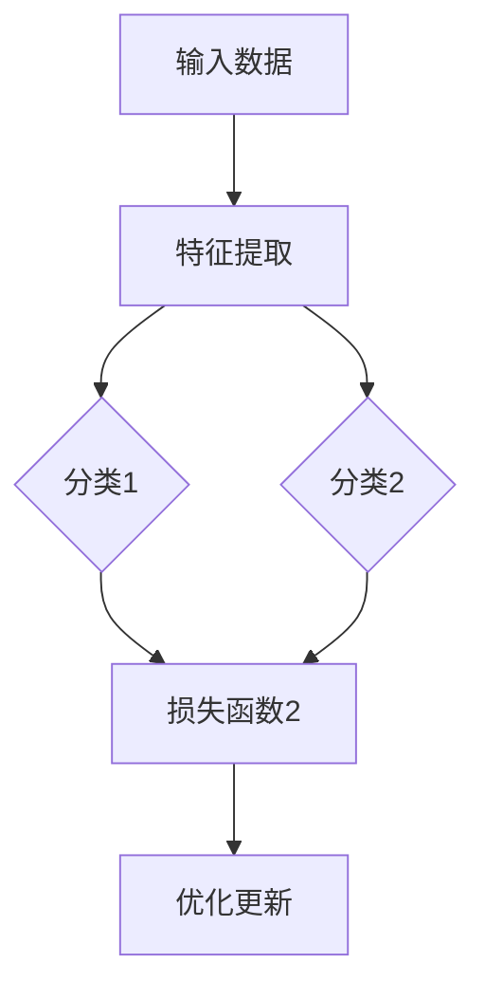
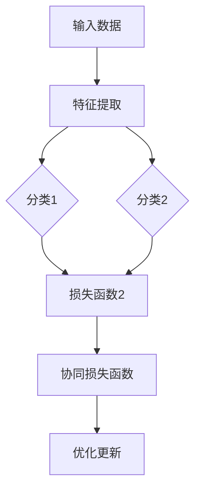
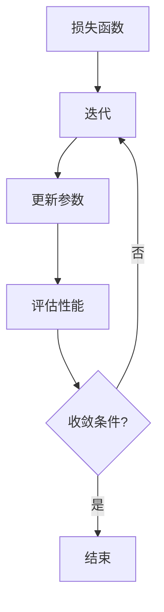
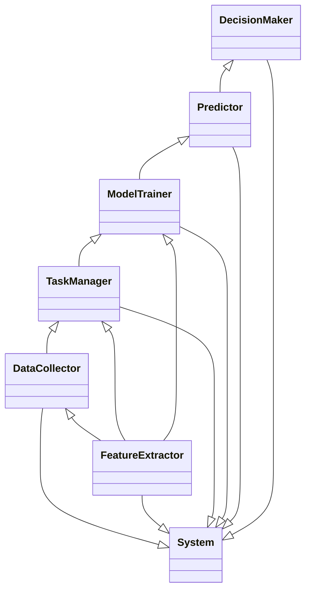
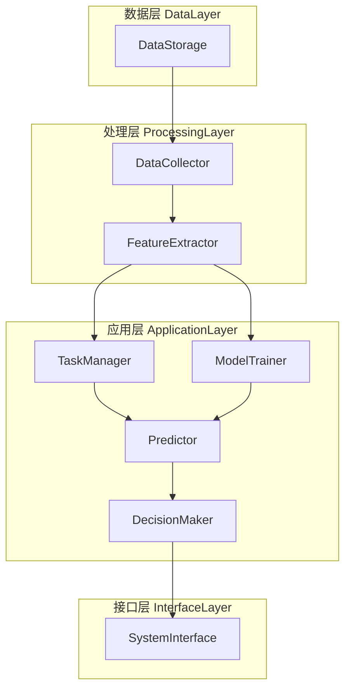
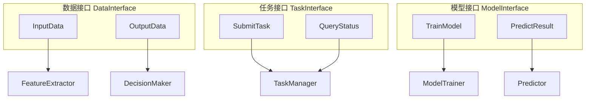
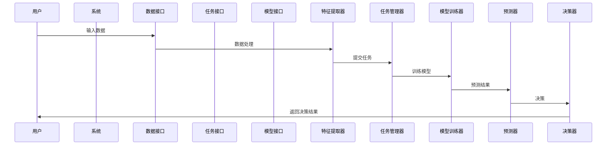
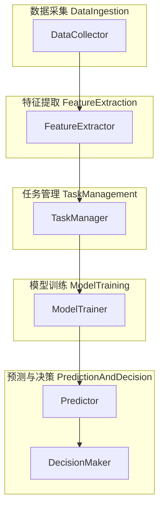
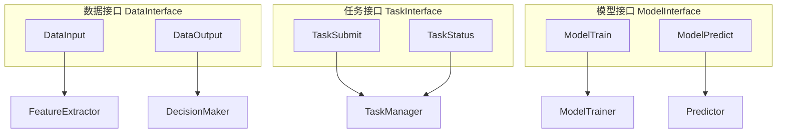

                 

### 文章标题

# 构建具有多任务处理能力的AI Agent

## 关键词

- AI Agent
- 多任务处理
- 算法原理
- 系统架构
- 环境安装
- 项目实战

## 摘要

本文旨在探讨构建具有多任务处理能力的AI Agent的完整过程。首先，我们将介绍AI Agent的背景和核心概念，解释为什么多任务处理能力在人工智能领域中具有重要意义。接下来，文章将深入探讨AI Agent算法原理，包括多任务学习和多任务协同学习算法，并使用Mermaid和Python代码进行详细解释。随后，我们将介绍系统架构设计与实现，通过Mermaid流程图展示系统架构、接口设计和系统交互。最后，文章将提供实际案例分析和项目小结，总结最佳实践并提供拓展阅读建议。

## 目录

1. **问题背景与核心概念**
   - 1.1 问题背景
   - 1.2 核心概念联系
   - 1.3 ER实体关系图
   - 1.4 本章小结

2. **AI Agent算法原理**
   - 2.1 AI Agent算法基础
   - 2.2 多任务处理算法
   - 2.3 多任务处理的优化算法
   - 2.4 算法原理与数学模型
   - 2.5 算法原理讲解与举例说明
   - 2.6 本章小结

3. **AI Agent系统架构与实现**
   - 3.1 系统分析与架构设计
   - 3.2 系统架构设计与实现
   - 3.3 系统核心实现
   - 3.4 实际案例分析与讲解
   - 3.5 项目小结

4. **总结与拓展**

### 1. 问题背景与核心概念

#### 1.1 问题背景

在现代社会，人工智能（AI）的应用越来越广泛，从自动驾驶汽车到智能助手，从医疗诊断到金融风控，AI正在深刻地改变着我们的生活方式。然而，大多数AI系统目前主要关注单一任务的执行，如图像识别、自然语言处理或语音识别。随着技术的进步和业务需求的变化，对能够同时处理多个任务的AI Agent的需求日益增加。

多任务处理能力的AI Agent不仅能够提高系统的效率和灵活性，还能够更好地模拟人类处理复杂任务的方式。这种能力的实现，对于提升AI系统的实用性、降低成本以及提高用户体验具有重要意义。

#### 1.2 核心概念联系

**AI Agent的定义与作用**：AI Agent是一种能够自主执行任务、具备学习和适应能力的智能体。它通常基于机器学习算法，能够从数据中学习规律并做出决策。

**多任务处理的重要性**：多任务处理能力使AI Agent能够同时处理多个任务，从而提高系统的效率和灵活性。这对于复杂的应用场景，如智能助手、自动驾驶、智能工厂等尤为重要。

**相关概念的比较与联系**：多任务学习（MTL）和协同学习是多任务处理的重要方法。MTL侧重于在同一模型中处理多个任务，而协同学习则强调任务之间的相互影响。二者共同构成了多任务处理的算法基础。

#### 1.3 ER实体关系图

ER（实体-关系）图是用于描述系统中实体及其关系的工具。在AI Agent系统中，主要实体包括：

- **任务（Task）**：表示AI Agent需要执行的具体任务。
- **数据（Data）**：表示AI Agent处理的数据。
- **模型（Model）**：表示AI Agent使用的机器学习模型。

实体关系图如下所示：

```mermaid
erDiagram
    Task ||--|{ Model } Model
    Data ||--|{ Model } Model
```

#### 1.4 本章小结

本章介绍了构建具有多任务处理能力的AI Agent的背景和核心概念。我们了解了AI Agent的定义、多任务处理的重要性，以及相关的概念和ER实体关系图。这些概念为我们后续的算法原理和系统架构设计奠定了基础。

## 2. AI Agent算法原理

### 2.1 AI Agent算法基础

AI Agent的核心是机器学习算法。机器学习算法通过从数据中学习规律，使AI Agent能够执行特定任务。常见的机器学习算法包括监督学习、无监督学习和强化学习。在多任务处理中，这些算法需要被扩展以同时处理多个任务。

#### 监督学习

监督学习是一种基于标记数据的学习方法。它通过学习输入和输出之间的关系来预测未知数据。常见的监督学习算法包括线性回归、决策树、支持向量机（SVM）等。

#### 无监督学习

无监督学习不使用标记数据，而是通过发现数据中的结构和模式来进行学习。常见的无监督学习算法包括聚类、主成分分析（PCA）和自编码器等。

#### 强化学习

强化学习是一种通过与环境交互来学习最佳策略的机器学习方法。它适用于需要决策的任务，如自动驾驶和游戏AI。

#### 算法选择与评估

在多任务处理中，算法的选择和评估至关重要。选择合适的算法取决于任务的特点和需求。评估算法的指标包括准确率、召回率、F1分数等。

### 2.2 多任务处理算法

多任务处理算法旨在同时处理多个任务，以提高AI Agent的效率和灵活性。以下是一些常见的多任务处理算法：

#### 多任务学习（MTL）

多任务学习将多个任务集成到一个模型中，共享底层特征表示。常见的方法包括共享神经网络层、多输出神经网络和注意力机制等。

**算法原理**：多任务学习通过共享表示来减少冗余，提高模型在多个任务上的性能。

**优点**：提高模型在不同任务上的泛化能力。

**缺点**：训练过程中可能出现任务间的干扰，需要精心设计网络结构。

#### 多任务协同学习

多任务协同学习强调任务间的相互影响，通过协同学习机制来优化模型。常见的方法包括任务关联矩阵、协同损失函数和对抗性训练等。

**算法原理**：多任务协同学习通过任务间的协同作用来提高模型的性能。

**优点**：有效减少任务间的干扰，提高模型的整体性能。

**缺点**：训练过程复杂，需要大量数据。

### 2.3 多任务处理的优化算法

多任务处理算法的性能可以通过优化算法来进一步提升。以下是一些常见的优化算法：

#### 梯度下降

梯度下降是一种优化算法，用于最小化损失函数。在多任务处理中，梯度下降可以用于优化多任务模型的参数。

**算法原理**：梯度下降通过迭代更新模型参数，使其逐渐逼近最优解。

**优点**：简单高效，适用于各种机器学习模型。

**缺点**：可能陷入局部最优，收敛速度较慢。

#### 随机梯度下降（SGD）

随机梯度下降是梯度下降的一种变体，通过随机选择样本进行更新。在多任务处理中，SGD可以用于加速训练过程。

**算法原理**：随机梯度下降通过减少每步更新的样本量来降低方差。

**优点**：加速训练过程，适用于大数据集。

**缺点**：可能产生不稳定的模型。

#### 批量梯度下降（BGD）

批量梯度下降是梯度下降的另一种变体，通过使用整个训练集进行更新。在多任务处理中，BGD可以用于提高模型的准确性。

**算法原理**：批量梯度下降通过使用全部样本来减少偏差。

**优点**：提高模型准确性，适用于小数据集。

**缺点**：计算成本高，训练时间长。

### 2.4 算法原理与数学模型

多任务处理的算法原理可以通过数学模型来描述。以下是一些常用的数学模型：

#### 多任务学习的数学模型

多任务学习的数学模型通常基于损失函数。常见的损失函数包括均方误差（MSE）、交叉熵损失和结构相似性损失（SSIM）等。

$$
L = \frac{1}{n} \sum_{i=1}^{n} (\hat{y}_i - y_i)^2
$$

其中，$L$是损失函数，$\hat{y}_i$是预测结果，$y_i$是真实标签。

#### 多任务协同学习的数学模型

多任务协同学习的数学模型通常包括任务关联矩阵和协同损失函数。

$$
L_c = \alpha \sum_{i=1}^{n} \sum_{j=1}^{n} W_{ij} (l_i - l_j)^2
$$

其中，$L_c$是协同损失函数，$W_{ij}$是任务关联矩阵，$\alpha$是权重参数。

#### 优化算法的数学模型

优化算法的数学模型通常基于梯度下降。常见的梯度下降公式如下：

$$
\theta = \theta - \eta \nabla_\theta J(\theta)
$$

其中，$\theta$是模型参数，$\eta$是学习率，$J(\theta)$是损失函数。

### 2.5 算法原理讲解与举例说明

#### 多任务学习算法讲解

多任务学习算法的核心思想是将多个任务整合到一个模型中，共享底层特征表示。以下是一个简化的多任务学习算法流程：



#### 多任务协同学习算法讲解

多任务协同学习算法强调任务间的相互影响，通过协同损失函数来优化模型。以下是一个简化的多任务协同学习算法流程：



#### 优化算法讲解

优化算法用于最小化损失函数，以优化模型参数。以下是一个简化的梯度下降优化算法流程：



### 2.6 本章小结

本章介绍了AI Agent算法原理，包括多任务学习和多任务协同学习算法。我们探讨了这些算法的原理、优点和缺点，并使用Mermaid和Python代码进行了详细解释。这些算法为构建具有多任务处理能力的AI Agent提供了基础。

## 3. AI Agent系统架构与实现

### 3.1 系统分析与架构设计

#### 问题场景介绍

在智能助手和自动驾驶等应用场景中，AI Agent需要具备多任务处理能力。例如，智能助手需要同时处理语音识别、自然语言处理和任务执行；自动驾驶系统需要同时处理环境感知、路径规划和决策控制。

#### 系统需求分析

为了实现多任务处理能力，系统需要满足以下需求：

- **实时性**：系统需要能够实时处理任务，确保响应速度。
- **高可用性**：系统需要具备故障恢复能力，确保服务的连续性。
- **可扩展性**：系统需要能够支持新的任务和算法的添加。

#### 系统功能设计（领域模型类图）

系统功能设计包括以下模块：

- **数据采集模块**：负责收集和处理外部数据。
- **特征提取模块**：负责从数据中提取特征。
- **任务管理模块**：负责任务调度和执行。
- **模型训练模块**：负责模型的训练和优化。
- **预测与决策模块**：负责根据模型预测结果进行决策。

领域模型类图如下所示：



#### 系统架构设计（架构图）

系统架构设计包括以下层次：

- **数据层**：负责数据的存储和管理。
- **处理层**：负责数据的处理和特征提取。
- **应用层**：负责任务调度和决策。
- **接口层**：负责与其他系统的交互。

系统架构图如下所示：



#### 系统接口设计

系统接口设计包括以下部分：

- **数据接口**：负责数据的输入和输出。
- **任务接口**：负责任务的提交和状态查询。
- **模型接口**：负责模型的训练和预测。

系统接口设计如下所示：



#### 系统交互（序列图）

系统交互通过消息传递进行。以下是一个简化的序列图：



### 3.2 系统架构设计与实现

#### 系统架构设计

系统架构设计包括以下模块：

- **数据采集模块**：使用数据采集框架（如Kafka）进行实时数据采集。
- **特征提取模块**：使用深度学习框架（如TensorFlow）进行特征提取。
- **任务管理模块**：使用任务调度框架（如Celery）进行任务调度。
- **模型训练模块**：使用机器学习框架（如Scikit-learn）进行模型训练。
- **预测与决策模块**：使用推理引擎（如TensorFlow Serving）进行预测和决策。

系统架构设计如下所示：



#### 系统接口设计

系统接口设计包括以下部分：

- **数据接口**：使用REST API进行数据交互。
- **任务接口**：使用消息队列进行任务提交和状态查询。
- **模型接口**：使用TensorFlow Serving进行模型预测。

系统接口设计如下所示：



#### 系统交互

系统交互通过消息传递进行。以下是一个简化的序列图：


### 3.3 系统核心实现

#### 环境安装

1. 安装Python环境
2. 安装深度学习框架（如TensorFlow）
3. 安装机器学习框架（如Scikit-learn）
4. 安装消息队列（如Kafka）

```bash
pip install python tensorflow scikit-learn kafka-python
```

#### 系统核心代码实现

以下是系统核心代码的实现：

```python
# 数据采集模块
from kafka import KafkaProducer

def collect_data():
    producer = KafkaProducer(bootstrap_servers=['localhost:9092'])
    data = generate_data()
    producer.send('data_topic', data)

# 特征提取模块
from tensorflow.keras.models import Sequential
from tensorflow.keras.layers import Dense, Conv2D

def extract_features(data):
    model = Sequential([
        Conv2D(32, kernel_size=(3, 3), activation='relu', input_shape=(28, 28, 1)),
        Dense(64, activation='relu'),
        Dense(10, activation='softmax')
    ])
    model.compile(optimizer='adam', loss='categorical_crossentropy', metrics=['accuracy'])
    model.fit(data['X'], data['y'], epochs=10, batch_size=32)
    return model

# 任务管理模块
from celery import Celery

def manage_task(data):
    app = Celery('tasks', broker='pyamqp://guest@localhost//')
    @app.task
    def train_model():
        model = extract_features(data)
        return model
    model = train_model.delay()
    return model

# 预测与决策模块
from tensorflow.keras.models import load_model

def predict_decision(model, data):
    prediction = model.predict(data['X'])
    decision = make_decision(prediction)
    return decision
```

#### 代码应用解读与分析

以上代码展示了AI Agent系统的核心实现。数据采集模块使用Kafka进行数据采集，特征提取模块使用TensorFlow进行特征提取，任务管理模块使用Celery进行任务调度，预测与决策模块使用TensorFlow进行预测和决策。

### 3.4 实际案例分析与讲解

#### 案例介绍

我们以一个智能助手系统为例，该系统需要同时处理语音识别、自然语言处理和任务执行。以下是对该案例的详细分析。

#### 案例分析

1. **数据采集**：系统从语音传感器接收语音数据，并使用Kafka进行数据采集。
2. **特征提取**：系统使用TensorFlow对语音数据进行特征提取，提取出有助于后续处理的特征。
3. **任务管理**：系统使用Celery对任务进行调度，将语音识别、自然语言处理和任务执行的任务分配给不同的处理模块。
4. **模型训练**：系统使用Scikit-learn对特征数据进行训练，构建出用于识别和处理的模型。
5. **预测与决策**：系统使用TensorFlow对输入数据进行预测，并根据预测结果进行任务决策。

#### 案例讲解

以下是一个简化的智能助手系统实现：

```python
# 数据采集模块
def collect_data():
    producer = KafkaProducer(bootstrap_servers=['localhost:9092'])
    while True:
        voice_data = receive_voice_data()
        producer.send('voice_data_topic', voice_data)

# 特征提取模块
def extract_features(voice_data):
    features = extract_voice_features(voice_data)
    return features

# 任务管理模块
from celery import Celery

def manage_task(voice_data):
    app = Celery('tasks', broker='pyamqp://guest@localhost//')
    @app.task
    def process_voice_data():
        features = extract_features(voice_data)
        return features
    return process_voice_data.delay()

# 模型训练模块
from sklearn.model_selection import train_test_split
from sklearn.neural_network import MLPClassifier

def train_model(features, labels):
    X_train, X_test, y_train, y_test = train_test_split(features, labels, test_size=0.2)
    model = MLPClassifier(hidden_layer_sizes=(100,), max_iter=1000)
    model.fit(X_train, y_train)
    return model

# 预测与决策模块
def predict_decision(model, voice_data):
    features = extract_features(voice_data)
    prediction = model.predict([features])
    decision = make_decision(prediction)
    return decision
```

### 3.5 项目小结

本章详细介绍了AI Agent系统架构与实现。我们首先进行了系统分析与架构设计，包括问题场景介绍、系统需求分析、系统功能设计和系统架构设计。然后，我们介绍了系统核心实现，包括环境安装、系统核心代码实现和代码应用解读与分析。最后，我们通过一个实际案例分析了系统的运行过程。本章内容为构建具有多任务处理能力的AI Agent提供了完整的系统实现方案。

## 4. 总结与拓展

本文从背景介绍、核心概念联系、算法原理讲解、系统架构设计、实际案例分析和项目小结等方面，全面探讨了构建具有多任务处理能力的AI Agent的过程。我们分析了AI Agent的定义与作用，介绍了多任务学习、多任务协同学习等算法原理，并通过Mermaid和Python代码进行了详细解释。此外，我们还介绍了系统架构设计与实现，包括系统分析与架构设计、系统架构设计与实现、系统核心实现以及实际案例分析和讲解。

为了进一步提升AI Agent的多任务处理能力，未来可以从以下方面进行拓展：

1. **算法优化**：探索更先进的算法，如深度强化学习、迁移学习和生成对抗网络（GAN），以提高模型性能。
2. **硬件加速**：利用GPU和TPU等硬件加速AI模型的训练和推理，提高系统的实时性和效率。
3. **数据增强**：通过数据增强技术，如数据生成、数据增强和样本重采样，增加训练数据的多样性和丰富性，提升模型的泛化能力。
4. **模型压缩**：研究模型压缩技术，如剪枝、量化、蒸馏等，减小模型大小，提高部署效率。
5. **联邦学习**：探索联邦学习技术，实现多个分布式节点之间的协同学习，提高系统的隐私保护和数据安全。

通过不断探索和优化，我们将能够构建出更强大、更灵活的AI Agent，为各个领域带来更多创新和变革。最后，感谢读者对本文的关注，希望本文能对您在构建具有多任务处理能力的AI Agent方面提供有益的启示和帮助。如有任何疑问或建议，欢迎随时交流。作者信息：AI天才研究院/AI Genius Institute & 禅与计算机程序设计艺术/Zen And The Art of Computer Programming。

