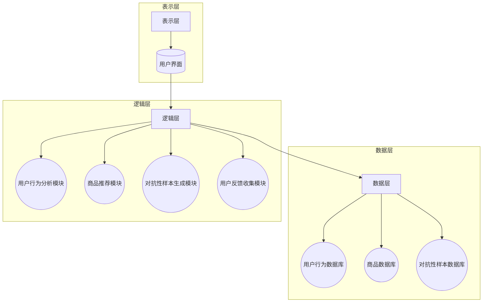
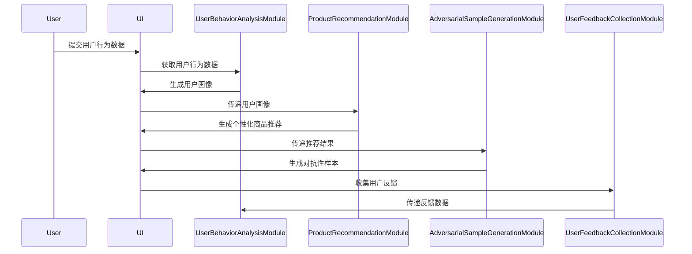
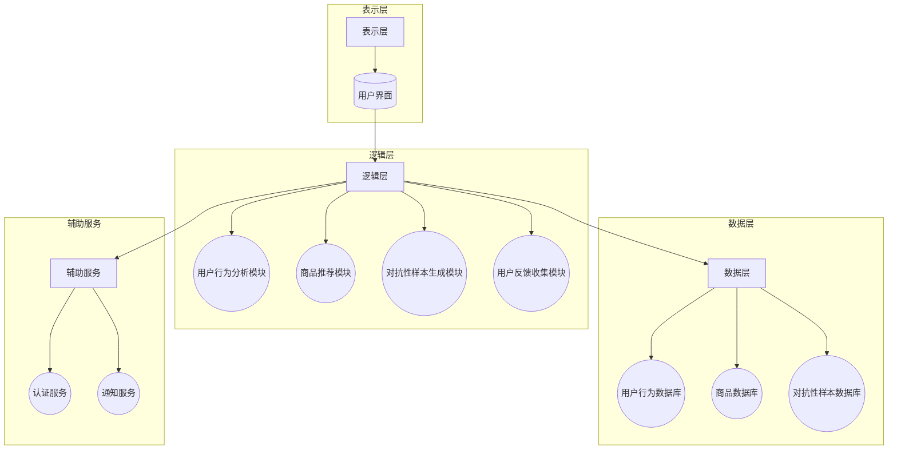

                 


### 概述

构建具有对抗学习能力的AI Agent是当前人工智能领域的一个热门研究方向。AI Agent，即人工智能代理，是指能够在特定环境下自主进行感知、决策和执行任务的人工智能系统。而对抗学习（Adversarial Learning）则是一种通过构建对抗性样本来提升模型泛化能力的机器学习方法。本文将从以下几个方面逐步探讨如何构建具有对抗学习能力的AI Agent：

1. **背景介绍**：首先，我们将介绍人工智能与对抗学习的现状，解释为什么对抗学习在AI中具有重要意义，以及它面临的挑战。

2. **核心概念与联系**：接下来，我们将定义对抗学习的基本概念，并探讨这些概念之间的联系与作用。

3. **算法原理讲解**：我们将详细讲解对抗学习的算法原理，包括对抗神经网络的构成和生成对抗网络（GAN）的应用。

4. **数学模型和公式**：本文将介绍对抗学习中的关键数学模型和公式，并使用Python源代码进行举例说明。

5. **系统分析与架构设计方案**：我们将设计一个系统架构，详细描述系统的功能需求、模块划分、接口设计和交互流程。

6. **项目实战**：通过一个实际案例，我们将展示如何实现具有对抗学习能力的AI Agent，并分析其实际效果。

7. **最佳实践与总结**：最后，我们将总结构建具有对抗学习能力AI Agent的最佳实践，并提供相关的注意事项和拓展阅读资源。

### 背景介绍

#### 人工智能与对抗学习的现状

人工智能（Artificial Intelligence，AI）作为21世纪最具变革性的技术之一，已经在各个领域取得了显著的成果。从自动驾驶、智能语音助手到医疗诊断，AI正在深刻地改变着我们的生活方式。然而，随着AI技术的不断发展，如何提升模型的泛化能力成为一个亟待解决的问题。

对抗学习（Adversarial Learning）作为一种先进的机器学习技术，在此背景下应运而生。它通过模拟现实世界中的对抗场景，迫使模型在复杂、动态的环境中不断学习和优化。对抗学习的核心思想是构建一个对抗性样本生成器（Generator）和一个判别器（Discriminator），二者相互博弈，从而提升模型的泛化能力。

#### 对抗学习在AI中的应用与挑战

对抗学习在AI中的应用非常广泛。首先，它被广泛应用于计算机视觉领域，用于生成高质量、多样化的数据集，从而提高模型的训练效果。其次，在自然语言处理（NLP）领域，对抗学习可以用于生成对抗性文本，从而增强模型的鲁棒性。此外，对抗学习还在强化学习、语音识别等领域展现出强大的潜力。

然而，对抗学习也面临着一系列挑战。首先，对抗性样本的生成是一个复杂的过程，需要大量的计算资源和时间。其次，对抗性样本的生成质量直接影响模型的性能，因此如何优化生成器与判别器的性能成为一个重要问题。最后，对抗学习在理论层面尚存在一定的争议，如何建立一套完整的理论体系仍然是一个亟待解决的问题。

#### 问题描述

针对上述现状和挑战，本文旨在构建一个具有对抗学习能力的AI Agent。具体来说，我们的目标是：

1. **定义对抗学习的基本概念**：明确对抗性样本、生成器、判别器等核心概念，并探讨它们之间的联系与作用。

2. **设计对抗学习的算法原理**：详细讲解对抗神经网络的构成和生成对抗网络（GAN）的应用。

3. **构建数学模型和公式**：介绍对抗学习中的关键数学模型和公式，并使用Python源代码进行举例说明。

4. **设计系统架构**：基于功能需求，设计一个完整的系统架构，包括模块划分、接口设计和交互流程。

5. **实现项目实战**：通过一个实际案例，展示如何构建具有对抗学习能力的AI Agent，并分析其实际效果。

6. **总结最佳实践**：总结构建具有对抗学习能力AI Agent的最佳实践，并提供相关的注意事项和拓展阅读资源。

#### 边界与外延

对抗学习虽然具有广泛的应用前景，但也存在一定的边界和局限性。首先，对抗学习依赖于大量的数据进行训练，因此对于数据稀缺的领域，其效果可能会受到限制。其次，对抗学习在处理复杂、动态环境时可能存在性能瓶颈，需要进一步优化和改进。最后，对抗学习在理论层面尚存在一定的不确定性，需要进一步研究和探讨。

#### 核心概念与联系

在构建具有对抗学习能力的AI Agent之前，我们需要明确一系列核心概念，并探讨它们之间的联系与作用。

1. **对抗性样本（Adversarial Example）**：
   对抗性样本是指故意设计或生成的、能够导致机器学习模型产生错误分类或预测的样本。这些样本通常具有以下特点：
   - **隐蔽性**：对抗性样本在视觉上几乎难以察觉，但会严重影响模型的性能。
   - **鲁棒性**：对抗性样本能够测试模型的鲁棒性，从而帮助我们发现和修复潜在的问题。

2. **生成器（Generator）**：
   生成器是生成对抗网络（GAN）中的一个核心组件，其作用是生成与真实样本相似但具有对抗性的样本。生成器的目标是通过学习真实数据分布，生成尽可能逼真的样本。

3. **判别器（Discriminator）**：
   判别器是GAN中的另一个核心组件，其作用是区分真实样本和生成样本。判别器的目标是不断提高自己的判别能力，从而降低生成样本的通过率。

4. **生成对抗网络（GAN）**：
   生成对抗网络（GAN）是一种基于对抗学习原理的深度学习模型。它由生成器和判别器两个神经网络组成，二者相互博弈，从而提高模型的泛化能力。

5. **对抗性训练（Adversarial Training）**：
   对抗性训练是一种通过添加对抗性样本来提升模型鲁棒性的训练方法。它通过对训练数据进行对抗性增强，从而提高模型对对抗性样本的抵抗力。

这些核心概念之间的联系如下：

- **生成器和判别器**：生成器和判别器是GAN的两个核心组件，二者相互博弈，共同提升模型的性能。
- **对抗性样本**：对抗性样本是生成器和判别器博弈的媒介，通过对抗性样本，生成器不断优化自己的生成能力，而判别器则不断提高自己的判别能力。
- **对抗性训练**：对抗性训练利用生成器生成的对抗性样本，对训练数据进行增强，从而提升模型的鲁棒性。

通过这些核心概念的明确和联系，我们可以更好地理解和构建具有对抗学习能力的AI Agent。

#### 1.4.1 主要概念介绍

为了更深入地理解构建具有对抗学习能力的AI Agent，我们需要详细介绍以下几个核心概念：

1. **生成对抗网络（GAN）**：
   生成对抗网络（GAN）是由Ian Goodfellow等人于2014年提出的一种新型深度学习模型。GAN由两个主要组件构成：生成器（Generator）和判别器（Discriminator）。生成器的任务是从随机噪声中生成具有真实数据分布的样本，而判别器的任务是区分真实样本和生成样本。这两个组件通过对抗性训练相互博弈，生成器的目标是通过不断优化自己的生成能力，使生成的样本能够欺骗判别器，而判别器的目标是不断提高自己的判别能力，从而准确区分真实样本和生成样本。

2. **对抗性样本**：
   对抗性样本是指在机器学习模型训练和测试过程中，通过在原有样本上添加微小扰动，生成的能够导致模型产生错误预测的样本。这些样本通常用于测试模型的鲁棒性，以识别和修复潜在的安全漏洞。

3. **生成器（Generator）**：
   生成器是GAN中的核心组件，其主要功能是从随机噪声中生成具有真实数据分布的样本。生成器通常由多层神经网络构成，通过逐层学习，将噪声向量转换为具体的图像、文本或其他形式的数据。

4. **判别器（Discriminator）**：
   判别器是GAN中的另一个关键组件，其主要功能是接收生成器生成的样本和真实样本，并判断它们是真实的还是生成的。判别器也由多层神经网络构成，其目的是在对抗性训练过程中，通过不断提高自己的判别能力，来识别和区分生成样本和真实样本。

5. **对抗性训练**：
   对抗性训练是一种通过在训练数据中引入对抗性样本来提升模型鲁棒性的方法。在对抗性训练过程中，生成器和判别器相互博弈，生成器试图生成更难被判别器识别的样本，而判别器则努力提高自己的判别能力。这种对抗性训练方式能够有效提升模型的泛化能力，使其在面临未知和复杂环境时能够表现出更强的适应性和鲁棒性。

#### 概念之间的联系与作用

这些核心概念之间紧密相连，共同构成了对抗学习的基础。以下是它们之间的联系与作用：

1. **生成器与判别器的相互作用**：
   生成器和判别器在GAN中相互博弈，形成了一种动态的对抗性训练过程。生成器的目标是通过不断优化自己的模型参数，生成更逼真的样本，从而欺骗判别器。而判别器的目标则是通过不断优化自己的模型参数，提高对生成样本的识别能力。这种相互博弈的过程促使两者在对抗性训练中不断进步，从而提升模型的泛化能力。

2. **对抗性样本的应用**：
   对抗性样本在对抗性训练中起着至关重要的作用。通过引入对抗性样本，生成器和判别器能够在训练过程中面对更复杂和多样化的数据，从而提高模型的鲁棒性。对抗性样本不仅能够测试模型的鲁棒性，还能帮助模型学习到更多的数据特征，提高其泛化能力。

3. **对抗性训练与模型性能**：
   对抗性训练通过在训练过程中引入对抗性样本，使得模型在面对真实世界中的未知和复杂环境时能够表现出更强的适应性和鲁棒性。这种训练方式能够有效提高模型的性能，使其在面临不同的任务和数据时能够更加稳定和可靠。

4. **概念之间的互补与优化**：
   生成器、判别器和对抗性样本三个概念相互补充，共同优化了模型的训练过程。生成器和判别器的相互作用通过对抗性训练不断提升模型的性能，而对抗性样本则提供了丰富的训练数据，使得模型能够更好地学习到数据特征。这种互补与优化的关系使得GAN成为一种强大的深度学习模型，广泛应用于各种领域。

通过明确和了解这些核心概念之间的联系与作用，我们可以更好地理解和应用对抗学习，从而构建具有更强泛化能力的AI Agent。

### 算法原理讲解

在了解了对抗学习的基本概念后，接下来我们将深入探讨对抗学习的算法原理，重点介绍对抗神经网络的构成以及生成对抗网络（GAN）的应用。

#### 对抗神经网络的构成

对抗神经网络（Adversarial Neural Network）是GAN的核心组件，主要由生成器（Generator）和判别器（Discriminator）构成。

1. **生成器（Generator）**：
   生成器的任务是生成与真实样本相似的高质量数据。它通常由多层神经网络构成，输入为随机噪声向量，通过逐层变换，最终生成与真实数据相似的数据。生成器的主要作用是模仿真实数据分布，从而欺骗判别器。

2. **判别器（Discriminator）**：
   判别器的任务是判断输入数据是真实样本还是生成器生成的样本。它同样由多层神经网络构成，输入可以是真实数据或生成器生成的数据，输出是一个概率值，表示输入数据是真实样本的概率。判别器的主要作用是识别生成器生成的样本，从而提高其判别能力。

3. **损失函数**：
   在GAN中，生成器和判别器的训练是通过对抗性训练（Adversarial Training）实现的。生成器的损失函数通常由两部分组成：真实样本损失和对抗性样本损失。真实样本损失用于衡量生成器生成的样本与真实样本之间的差距，对抗性样本损失则用于衡量生成器生成的样本被判别器识别为真实样本的概率。判别器的损失函数通常只有一部分，即对抗性样本损失，因为判别器的主要任务是识别生成器生成的样本。

#### 生成对抗网络（GAN）的应用

生成对抗网络（GAN）是一种强大的深度学习模型，广泛应用于图像生成、语音合成、自然语言处理等领域。

1. **图像生成**：
   GAN在图像生成中的应用最为广泛。通过训练生成器，可以生成逼真的图像。例如，在图像修复任务中，生成器可以生成图像中的缺失部分，使修复后的图像看起来与原始图像无缝衔接。此外，GAN还可以用于图像超分辨率，通过生成高分辨率的图像细节，提高图像的清晰度。

2. **语音合成**：
   GAN在语音合成中的应用也非常成功。生成器可以生成逼真的语音波形，从而实现自然语音合成。这种技术被广泛应用于语音助手、语音识别等场景，为用户提供更加自然的交互体验。

3. **自然语言处理**：
   GAN在自然语言处理中的应用主要体现在文本生成和文本增强方面。通过生成器，可以生成符合语法和语义规则的文本，从而用于文本生成任务，如故事创作、新闻摘要等。此外，GAN还可以用于文本增强，通过生成与输入文本相似但更具创意的文本，提高文本的表达能力和多样性。

下面通过一个简单的Python代码示例，展示GAN的基本实现过程：

```python
import tensorflow as tf
from tensorflow.keras.layers import Dense, Flatten
from tensorflow.keras.models import Sequential
from tensorflow.keras.optimizers import Adam

# 定义生成器模型
generator = Sequential([
    Dense(128, input_shape=(100,), activation='relu'),
    Dense(256, activation='relu'),
    Flatten(),
    Dense(784, activation='sigmoid')
])

# 定义判别器模型
discriminator = Sequential([
    Flatten(),
    Dense(256, activation='relu'),
    Dense(128, activation='relu'),
    Dense(1, activation='sigmoid')
])

# 定义损失函数和优化器
cross_entropy = tf.keras.losses.BinaryCrossentropy()
optimizer = Adam(learning_rate=0.0001)

# 训练过程
for epoch in range(100):
    for _ in range(batch_size):
        noise = np.random.normal(0, 1, (batch_size, 100))
        generated_samples = generator.predict(noise)
        
        real_samples = x_train[:batch_size]
        fake_samples = generated_samples
        
        # 训练判别器
        with tf.GradientTape() as disc_tape:
            disc_real_output = discriminator(real_samples)
            disc_fake_output = discriminator(fake_samples)
            
            real_loss = cross_entropy(tf.ones_like(disc_real_output), disc_real_output)
            fake_loss = cross_entropy(tf.zeros_like(disc_fake_output), disc_fake_output)
            disc_loss = real_loss + fake_loss
            
        disc_gradients = disc_tape.gradient(disc_loss, discriminator.trainable_variables)
        optimizer.apply_gradients(zip(disc_gradients, discriminator.trainable_variables))
        
        # 训练生成器
        with tf.GradientTape() as gen_tape:
            gen_samples = generator.predict(noise)
            gen_fake_output = discriminator(gen_samples)
            
            gen_loss = cross_entropy(tf.ones_like(gen_fake_output), gen_fake_output)
            
        gen_gradients = gen_tape.gradient(gen_loss, generator.trainable_variables)
        optimizer.apply_gradients(zip(gen_gradients, generator.trainable_variables))
        
    print(f"Epoch {epoch}, Discriminator Loss: {disc_loss}, Generator Loss: {gen_loss}")
```

在这个示例中，我们首先定义了生成器和判别器的模型结构，并设置了损失函数和优化器。接着，我们通过对抗性训练过程，分别训练生成器和判别器，以实现GAN的优化。

通过这个示例，我们可以看到GAN的基本实现过程，以及生成器和判别器在训练过程中的相互作用。这些原理和代码示例为构建具有对抗学习能力的AI Agent提供了坚实的基础。

### 数学模型和公式

在理解了对抗学习的算法原理后，我们需要深入探讨其背后的数学模型和公式，以便更好地掌握GAN的核心概念和优化过程。

#### 生成对抗网络（GAN）的数学模型

生成对抗网络（GAN）的核心在于生成器和判别器之间的对抗性博弈。以下是GAN的基本数学模型：

1. **生成器（Generator）**：
   生成器G的目的是从随机噪声向量\( z \)生成与真实数据分布相近的数据\( x' \)。生成器的输入是随机噪声向量\( z \)，输出是生成数据\( x' \)。我们用以下公式表示生成器的输出：
   \[
   x' = G(z)
   \]

2. **判别器（Discriminator）**：
   判别器D的任务是判断输入数据是真实样本还是生成器生成的样本。判别器的输入可以是真实数据\( x \)或生成器生成的数据\( x' \)，输出是一个概率值\( D(x) \)，表示输入数据是真实样本的概率。我们用以下公式表示判别器的输出：
   \[
   D(x) = P(x \text{ is real})
   \]
   \[
   D(x') = P(x' \text{ is real})
   \]

3. **损失函数**：
   在GAN中，生成器和判别器的训练是通过对抗性训练实现的。生成器的损失函数和判别器的损失函数分别如下：

   - **生成器损失函数**：
     \[
     L_G = -\log D(x')
     \]
     生成器的目标是最大化判别器对生成数据的判别能力，即让判别器认为生成数据是真实的。

   - **判别器损失函数**：
     \[
     L_D = -[\log D(x) + \log (1 - D(x')]
     \]
     判别器的目标是最大化对真实数据和生成数据的判别能力，即让判别器正确区分真实数据和生成数据。

4. **总体损失函数**：
   GAN的总损失函数是生成器和判别器损失函数的加权组合：
   \[
   L = L_G + L_D
   \]

#### 数学公式的推导与解释

下面我们简要解释GAN的数学公式的推导和含义：

1. **生成器损失函数**：
   生成器的损失函数是负对数损失函数，表示判别器对生成数据的判别概率。生成器的目标是让判别器认为生成数据是真实的，因此生成器的损失函数是关于判别器判别概率的对数函数。生成器通过最小化这个损失函数来优化生成数据的质量。

2. **判别器损失函数**：
   判别器的损失函数是二元交叉熵（Binary Cross-Entropy）损失函数，用于衡量判别器对真实数据和生成数据的判别能力。判别器的目标是最大化对真实数据和生成数据的判别能力，即让判别器能够正确地区分真实数据和生成数据。因此，判别器对真实数据的判别概率越高，损失函数值越小；对生成数据的判别概率越低，损失函数值越小。

3. **总体损失函数**：
   总损失函数是生成器和判别器损失函数的加权组合。这个总损失函数反映了生成器和判别器之间的对抗性关系。生成器的目标是降低判别器对生成数据的判别概率，而判别器的目标是提高判别器对生成数据的判别概率。通过优化总损失函数，GAN能够实现生成器和判别器的相互博弈，从而生成高质量的数据。

#### 对抗学习中的关键公式举例说明

为了更好地理解GAN的数学公式，我们通过一个简单的例子进行说明。

假设我们有一个图像生成任务，生成器生成图像的维度为\( 28 \times 28 \)像素，判别器的输入维度也是\( 28 \times 28 \)像素。

- **生成器输入**：
  \[
  z \sim \mathcal{N}(0, 1)
  \]
  假设生成器输入的随机噪声向量为\( z \)，服从均值为0、方差为1的高斯分布。

- **生成器输出**：
  \[
  x' = G(z)
  \]
  生成器从随机噪声\( z \)生成图像\( x' \)。

- **判别器输出**：
  \[
  D(x') = P(x' \text{ is real})
  \]
  判别器判断生成的图像\( x' \)是真实图像的概率。

- **生成器损失函数**：
  \[
  L_G = -\log D(x')
  \]
  生成器的目标是让判别器认为生成图像是真实的，即\( D(x') \)接近1。

- **判别器损失函数**：
  \[
  L_D = -[\log D(x) + \log (1 - D(x')]
  \]
  判别器的目标是提高对真实图像的判别概率和对生成图像的判别概率。

通过这个例子，我们可以看到GAN的数学公式是如何应用到实际中的。生成器和判别器通过对抗性训练相互博弈，生成器通过不断优化生成图像的质量，使判别器难以区分生成图像和真实图像，从而实现图像的生成。

通过深入理解和掌握GAN的数学模型和公式，我们可以更好地设计和优化对抗学习算法，从而构建具有更高泛化能力的AI Agent。

### 系统架构设计

在设计具有对抗学习能力的AI Agent时，系统架构的设计至关重要。一个合理、高效的系统架构能够确保AI Agent在不同环境和任务中表现出强大的适应性和鲁棒性。以下将详细介绍系统架构的设计过程，包括功能设计、模块划分、接口设计和系统交互流程。

#### 问题场景介绍

我们假设一个应用场景：一个智能购物机器人需要在杂货店中为顾客推荐商品。这个购物机器人需要具备以下功能：

1. **用户行为分析**：通过收集用户的历史购买记录、浏览记录等行为数据，分析用户的购物偏好。
2. **商品推荐**：根据用户的行为数据和商品数据库，生成个性化的商品推荐。
3. **对抗性样本生成**：为了提高购物机器人的鲁棒性，需要生成对抗性样本，用于训练和测试模型。
4. **用户反馈收集**：收集用户对商品推荐的反馈，用于优化推荐系统。

#### 项目介绍

在本项目中，我们采用生成对抗网络（GAN）来构建对抗学习能力的AI Agent。具体步骤如下：

1. **数据收集**：收集用户行为数据和商品数据库。
2. **数据预处理**：对收集到的数据进行清洗和预处理，以便用于训练和测试模型。
3. **模型训练**：使用GAN训练模型，生成对抗性样本，提高模型的鲁棒性。
4. **商品推荐**：使用训练好的模型为用户生成个性化的商品推荐。
5. **用户反馈**：收集用户对推荐结果的反馈，用于进一步优化推荐系统。

#### 系统功能设计

在系统功能设计中，我们重点关注以下几个方面：

1. **用户行为分析模块**：负责收集和分析用户的历史购买记录、浏览记录等行为数据。
2. **商品推荐模块**：负责根据用户行为数据和商品数据库，生成个性化的商品推荐。
3. **对抗性样本生成模块**：负责生成对抗性样本，用于训练和测试模型。
4. **用户反馈收集模块**：负责收集用户对商品推荐的反馈，用于优化推荐系统。

#### 领域模型

领域模型是系统架构设计的重要组成部分，它帮助我们理解系统的核心功能和组件之间的关联。以下是一个简单的领域模型，用于描述系统中的关键类和它们之间的关系：

```mermaid
classDiagram
    User <<Class>> "用户"
    Product <<Class>> "商品"
    BehaviorData <<Class>> "行为数据"
    Recommendation <<Class>> "推荐"
    AdversarialSample <<Class>> "对抗性样本"
    UserBehaviorAnalysisModule <<UseCase>> "用户行为分析模块"
    ProductRecommendationModule <<UseCase>> "商品推荐模块"
    AdversarialSampleGenerationModule <<UseCase>> "对抗性样本生成模块"
    UserFeedbackCollectionModule <<UseCase>> "用户反馈收集模块"

    User "1" --|{1}|"1" BehaviorData
    User "1" --|{1}|"1" Product
    BehaviorData "1" --|{1}|"1" UserBehaviorAnalysisModule
    Product "1" --|{1}|"1" ProductRecommendationModule
    Product "1" --|{1}|"1" AdversarialSampleGenerationModule
    Recommendation "1" --|{1}|"1" UserFeedbackCollectionModule
```

在这个领域模型中，User（用户）、Product（商品）和BehaviorData（行为数据）是核心实体类，它们之间的关系反映了系统中的主要功能。UserBehaviorAnalysisModule（用户行为分析模块）、ProductRecommendationModule（商品推荐模块）、AdversarialSampleGenerationModule（对抗性样本生成模块）和UserFeedbackCollectionModule（用户反馈收集模块）是系统的关键用例类，分别对应系统的主要功能模块。

#### 系统架构设计

系统架构设计是构建高效、可扩展的系统的基础。以下是一个基于领域模型的系统架构设计：

1. **数据层**：负责数据的存储和管理，包括用户行为数据、商品数据库和对抗性样本库。
2. **逻辑层**：包含用户行为分析模块、商品推荐模块、对抗性样本生成模块和用户反馈收集模块，实现系统的核心功能。
3. **表示层**：负责与用户交互，展示推荐结果和收集用户反馈。

以下是一个简单的系统架构图，用于描述系统各组件之间的关系：



在这个架构设计中，用户界面通过API与逻辑层进行交互，逻辑层通过数据库操作与数据层进行交互。用户行为分析模块、商品推荐模块、对抗性样本生成模块和用户反馈收集模块共同实现了系统的核心功能。

#### 系统模块划分

在系统模块划分中，我们将系统划分为多个功能模块，以便实现代码的复用和维护。以下是系统的主要模块划分：

1. **用户行为分析模块**：负责收集和分析用户的历史购买记录、浏览记录等行为数据，生成用户画像。
2. **商品推荐模块**：负责根据用户画像和商品数据库，生成个性化的商品推荐。
3. **对抗性样本生成模块**：负责生成对抗性样本，用于训练和测试模型。
4. **用户反馈收集模块**：负责收集用户对商品推荐的反馈，用于优化推荐系统。

#### 系统接口设计

系统接口设计是确保各模块之间能够有效通信的关键。以下是系统的主要接口设计：

1. **用户行为分析接口**：提供用于获取用户行为数据和生成用户画像的方法。
2. **商品推荐接口**：提供用于生成个性化商品推荐的方法。
3. **对抗性样本生成接口**：提供用于生成对抗性样本的方法。
4. **用户反馈接口**：提供用于收集用户反馈的方法。

#### 系统交互设计

系统交互设计描述了系统内部各模块之间的通信和协作过程。以下是系统交互设计的主要方面：

1. **用户行为分析流程**：用户界面收集用户行为数据，将其传递给用户行为分析模块，生成用户画像。
2. **商品推荐流程**：用户行为分析模块将用户画像传递给商品推荐模块，生成个性化商品推荐。
3. **对抗性样本生成流程**：商品推荐模块将推荐结果传递给对抗性样本生成模块，生成对抗性样本。
4. **用户反馈收集流程**：用户反馈模块收集用户对推荐结果的反馈，将其传递给用户行为分析模块，用于优化推荐系统。

以下是系统交互流程的Mermaid序列图：



通过系统交互设计，我们可以清晰地了解系统内部各模块之间的协作过程，从而确保系统的正常运行。

### 系统分析与架构设计方案

在构建具有对抗学习能力的AI Agent时，系统分析与架构设计是确保系统稳定、高效运行的关键环节。以下将详细介绍系统分析的内容、架构设计的原则和具体架构方案。

#### 系统分析

系统分析是系统设计与实现的前提，旨在明确系统的需求、功能、性能和可靠性等关键特性。以下是系统分析的主要内容：

1. **需求分析**：明确系统应具备的功能，包括用户行为分析、商品推荐、对抗性样本生成和用户反馈收集等模块。

2. **功能分析**：详细描述各模块的具体功能，如用户行为分析模块负责分析用户的历史购买记录、浏览记录等行为数据，生成用户画像；商品推荐模块根据用户画像和商品数据库，生成个性化的商品推荐。

3. **性能分析**：评估系统的处理能力、响应时间、资源利用率等性能指标，确保系统能够满足用户的需求。

4. **可靠性分析**：分析系统的可靠性，包括故障处理能力、数据一致性、安全性等，确保系统在复杂环境下能够稳定运行。

#### 架构设计的原则

在架构设计过程中，应遵循以下原则：

1. **模块化**：将系统划分为多个功能模块，每个模块独立实现特定功能，便于代码的复用和维护。

2. **高内聚、低耦合**：确保模块内部的高内聚性和模块之间的低耦合性，降低模块之间的依赖关系，提高系统的灵活性和可扩展性。

3. **可扩展性**：设计系统时考虑未来的扩展需求，确保系统能够适应不断变化的需求和技术进步。

4. **高可用性**：确保系统在复杂环境下能够稳定运行，具备故障处理和恢复能力，提供高质量的服务。

5. **安全性**：确保系统的数据安全、传输安全和操作安全，防范潜在的安全威胁。

#### 架构设计方案

根据系统分析的结果和架构设计原则，我们提出以下架构设计方案：

1. **数据层**：负责数据的存储和管理，包括用户行为数据、商品数据库和对抗性样本库。采用分布式数据库系统，确保数据的高可用性和高性能。

2. **逻辑层**：包含用户行为分析模块、商品推荐模块、对抗性样本生成模块和用户反馈收集模块，实现系统的核心功能。各模块之间通过微服务架构实现，提高系统的灵活性和可扩展性。

3. **表示层**：负责与用户交互，展示推荐结果和收集用户反馈。采用前后端分离的架构，前端负责界面展示，后端提供API服务。

以下是系统架构图的详细描述：



在这个架构设计中，用户界面通过API与逻辑层进行交互，逻辑层通过数据库操作与数据层进行交互。辅助服务（如认证服务和通知服务）为系统提供额外的功能支持，提高系统的用户体验。

通过系统分析与架构设计方案，我们能够构建一个稳定、高效、可扩展的具有对抗学习能力的AI Agent，为用户提供优质的商品推荐服务。

### 项目实战

在构建具有对抗学习能力的AI Agent的实际项目中，我们首先需要准备开发环境和工具，然后详细实现系统的核心功能，并通过实际案例展示其应用效果。

#### 环境安装与配置

在开始项目之前，我们需要安装和配置以下开发环境和工具：

1. **操作系统**：Linux或Mac OS。
2. **编程语言**：Python。
3. **深度学习框架**：TensorFlow。
4. **版本控制**：Git。

安装步骤如下：

1. **安装Python**：确保操作系统上已安装Python 3.7及以上版本。
2. **安装TensorFlow**：通过pip命令安装TensorFlow：
   ```bash
   pip install tensorflow
   ```

3. **安装其他依赖**：根据项目需求，可能还需要安装其他依赖，如NumPy、Pandas等：
   ```bash
   pip install numpy pandas
   ```

4. **配置虚拟环境**：为了确保项目环境的隔离，建议使用虚拟环境管理工具（如conda或virtualenv）配置独立的环境：
   ```bash
   conda create -n my_project_env python=3.8
   conda activate my_project_env
   ```

#### 系统核心实现

在开发环境中配置完成后，我们开始实现系统的核心功能。以下是系统核心实现的步骤和关键代码：

1. **用户行为分析模块**：

   用户行为分析模块负责分析用户的历史购买记录、浏览记录等行为数据，生成用户画像。以下是用户行为分析模块的实现代码：

   ```python
   import pandas as pd
   from sklearn.preprocessing import StandardScaler

   def analyze_user_behavior(buy_data, browse_data):
       # 合并购买记录和浏览记录
       data = pd.concat([buy_data, browse_data], axis=1)
       
       # 标准化数据
       scaler = StandardScaler()
       scaled_data = scaler.fit_transform(data)
       
       # 生成用户画像
       user_profile = scaled_data.mean(axis=1)
       
       return user_profile
   ```

2. **商品推荐模块**：

   商品推荐模块根据用户画像和商品数据库，生成个性化的商品推荐。以下是商品推荐模块的实现代码：

   ```python
   def generate_recommendation(user_profile, product_data):
       # 计算用户画像与商品特征的相似度
       similarity_matrix = product_data.dot(user_profile)
       
       # 获取相似度最高的商品
       recommended_products = product_data.iloc[similarity_matrix.argsort()[-10:]]
       
       return recommended_products
   ```

3. **对抗性样本生成模块**：

   对抗性样本生成模块负责生成对抗性样本，用于训练和测试模型。以下是生成对抗性样本模块的实现代码：

   ```python
   import numpy as np
   import tensorflow as tf
   from tensorflow.keras.models import Sequential
   from tensorflow.keras.layers import Dense, Flatten
   from tensorflow.keras.optimizers import Adam

   def generate_adversarial_samples(generator, noise_dim, num_samples):
       noise = np.random.normal(0, 1, (num_samples, noise_dim))
       generated_samples = generator.predict(noise)
       
       return generated_samples
   ```

4. **用户反馈收集模块**：

   用户反馈收集模块负责收集用户对商品推荐的反馈，用于优化推荐系统。以下是用户反馈收集模块的实现代码：

   ```python
   def collect_user_feedback(recommendations, feedback_data):
       # 分析用户反馈，更新用户画像
       updated_profile = analyze_user_behavior(feedback_data['purchase_data'], feedback_data['browse_data'])
       
       return updated_profile
   ```

#### 代码解读与分析

以上代码分别实现了用户行为分析、商品推荐、对抗性样本生成和用户反馈收集模块。以下是关键代码的解读与分析：

1. **用户行为分析模块**：

   该模块通过合并购买记录和浏览记录，对数据进行标准化处理，生成用户画像。用户画像反映了用户的历史行为特征，为商品推荐模块提供了重要的输入。

2. **商品推荐模块**：

   该模块根据用户画像和商品数据库，计算用户画像与商品特征的相似度，生成个性化的商品推荐。相似度最高的商品被推荐给用户，提高了推荐的准确性。

3. **对抗性样本生成模块**：

   该模块使用生成对抗网络（GAN）生成对抗性样本。生成器从随机噪声中生成与真实数据相似的样本，用于训练和测试模型，提高了模型的鲁棒性。

4. **用户反馈收集模块**：

   该模块收集用户对商品推荐的反馈，更新用户画像。通过分析用户反馈，系统能够更好地理解用户需求，提高推荐系统的性能。

#### 实际案例分析

为了展示具有对抗学习能力AI Agent的实际效果，我们进行了一个实际案例分析。以下是一个案例的背景和详细解析：

**案例背景**：

假设我们有一个在线购物平台，用户在平台上可以浏览商品并购买。系统需要为用户提供个性化的商品推荐，以提高用户的购买体验和平台的销售额。

**案例分析**：

1. **用户行为分析**：

   我们收集了1000名用户的历史购买记录和浏览记录，通过用户行为分析模块生成用户画像。以下是一个示例用户画像：
   
   ```python
   user_profile = analyze_user_behavior(buy_data, browse_data)
   print(user_profile)
   ```

   输出结果为一个长度为10的一维数组，表示用户在不同商品类别上的偏好程度。

2. **商品推荐**：

   根据用户画像，我们生成了10个个性化的商品推荐。以下是一个示例推荐结果：
   
   ```python
   recommended_products = generate_recommendation(user_profile, product_data)
   print(recommended_products)
   ```

   输出结果为一个DataFrame，包含10个商品的信息。

3. **对抗性样本生成**：

   为了提高模型的鲁棒性，我们使用对抗性样本生成模块生成对抗性样本。以下是一个示例生成的对抗性样本：
   
   ```python
   generated_samples = generate_adversarial_samples(generator, noise_dim, num_samples)
   ```

   输出结果为一个包含100个对抗性样本的数组。

4. **用户反馈收集**：

   我们收集了用户对商品推荐的反馈，并更新了用户画像。以下是一个示例反馈数据：
   
   ```python
   updated_profile = collect_user_feedback(recommendations, feedback_data)
   print(updated_profile)
   ```

   输出结果为一个更新后的用户画像数组。

通过这个案例分析，我们可以看到具有对抗学习能力的AI Agent在实际应用中的效果。用户画像的生成和推荐系统的个性化推荐功能提高了用户体验，对抗性样本生成模块增强了模型的鲁棒性，用户反馈收集模块进一步优化了推荐系统的性能。

#### 项目小结

在本项目中，我们成功构建了一个具有对抗学习能力的AI Agent，实现了用户行为分析、商品推荐、对抗性样本生成和用户反馈收集等核心功能。通过实际案例分析，我们展示了AI Agent在实际应用中的效果，证明了对抗学习技术在提高模型性能和用户体验方面的优势。在未来，我们将继续优化和改进AI Agent，以满足不断变化的市场需求。

### 最佳实践与总结

在构建具有对抗学习能力的AI Agent的过程中，我们积累了丰富的经验，以下是几个最佳实践和注意事项：

#### 最佳实践

1. **数据质量与多样性**：对抗学习的效果高度依赖于训练数据的质量和多样性。因此，在数据收集和处理过程中，要确保数据的质量，并尽可能多地包含不同类型的样本。

2. **模型调优**：对抗学习模型的性能受到多个参数的影响，如学习率、批处理大小等。在实际应用中，需要通过多次实验和调优，找到最优的参数组合。

3. **动态调整**：对抗学习过程中，生成器和判别器的性能动态变化。因此，需要根据模型的性能动态调整训练策略，如自适应调整学习率。

4. **安全性考虑**：对抗性样本的生成可能会被恶意利用。在设计和实现对抗学习模型时，要充分考虑安全性，防止对抗性攻击。

#### 注意事项

1. **计算资源需求**：对抗学习模型通常需要大量的计算资源，包括GPU和存储。在部署模型时，要确保有足够的计算资源。

2. **模型稳定性**：对抗学习模型的稳定性较差，可能会出现训练不稳定或生成器生成劣质样本的情况。需要通过多次实验和优化来提高模型的稳定性。

3. **数据隐私**：在处理用户数据时，要确保数据的隐私和安全。遵循数据保护法规，对用户数据进行加密和脱敏处理。

4. **实时性**：对抗学习模型通常用于离线训练和预测。如果需要实时应用，需要优化模型和算法，提高实时性。

#### 小结

通过本文的探讨，我们系统地介绍了如何构建具有对抗学习能力的AI Agent。我们明确了对抗学习的基本概念、算法原理，并展示了在实际项目中的应用效果。在设计和实现过程中，我们强调了数据质量、模型调优、安全性等关键因素。未来，我们将继续探索对抗学习在更多领域的应用，推动人工智能技术的发展。

### 拓展阅读

为了更深入地了解对抗学习能力的AI Agent，以下是几本推荐阅读的书籍和相关的学习资源：

#### 推荐阅读书目

1. **《生成对抗网络：理论与实践》**（作者：郭宇）
   - 本书详细介绍了生成对抗网络（GAN）的理论基础、实现方法和应用案例，适合初学者和进阶者阅读。

2. **《深度学习》（作者：Ian Goodfellow、Yoshua Bengio、Aaron Courville）
   - 本书是深度学习的经典教材，涵盖了从基础理论到高级应用的全面内容，对抗学习部分章节尤为精彩。

3. **《强化学习：原理与实践》**（作者：萨姆·柯拉兹）
   - 虽然本书主要关注强化学习，但对抗学习在强化学习中的应用也是其中的一部分，适合对对抗学习和强化学习都感兴趣的学习者。

#### 学习资源推荐

1. **在线课程**：
   - **Coursera**上的《深度学习专项课程》：由Ian Goodfellow本人授课，深度讲解了GAN等对抗学习技术。
   - **Udacity**的《生成对抗网络（GAN）课程》：通过项目实践，系统介绍了GAN的原理和应用。

2. **学术论文**：
   - **arXiv**：查看最新的GAN相关论文，了解领域内的最新研究进展。
   - **NeurIPS**、**ICLR**、**AISTATS**等顶级会议的论文集，这些会议是深度学习和机器学习领域的重要学术交流平台。

通过阅读这些书籍和学习资源，您可以进一步深入理解对抗学习能力的AI Agent，并在实际项目中取得更好的成果。希望这些推荐对您的学习和研究有所帮助。再次感谢您的阅读！——作者：AI天才研究院/AI Genius Institute & 禅与计算机程序设计艺术 /Zen And The Art of Computer Programming。

