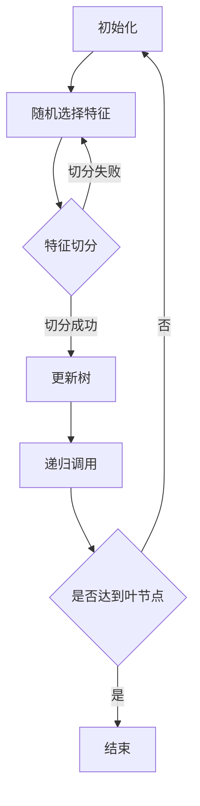
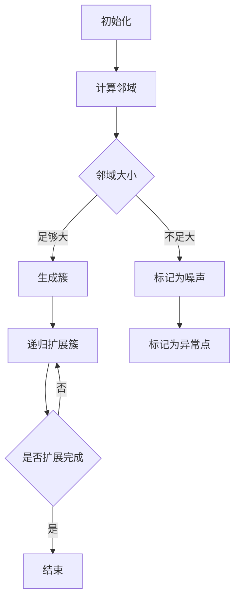
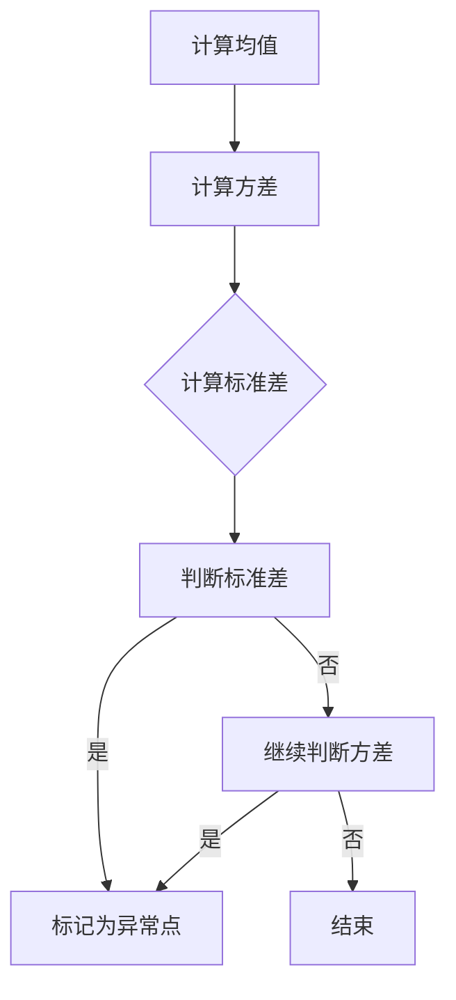
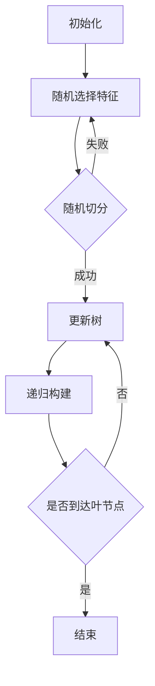
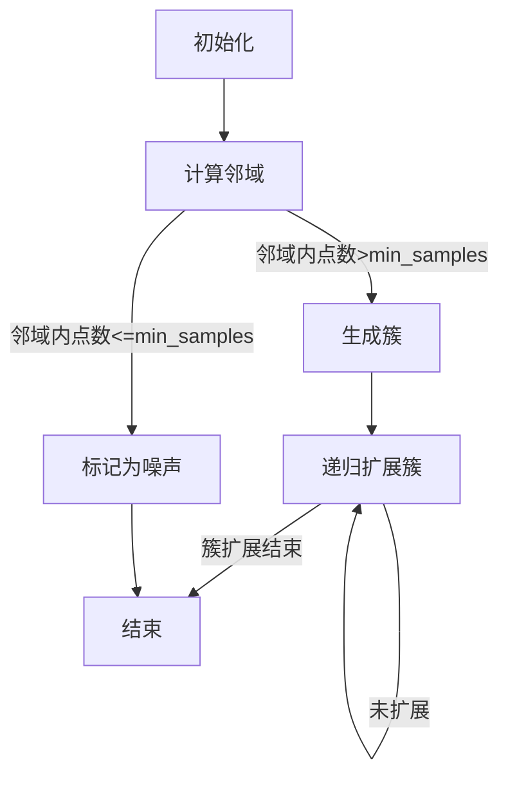
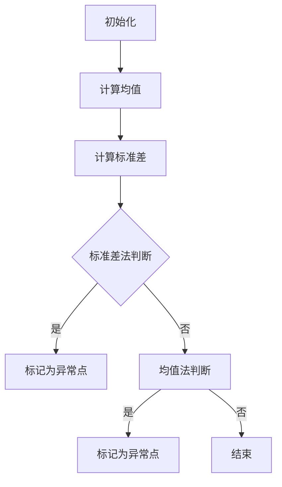

                 

## 引言

### 1.1 AI Agent与异常检测概述

随着人工智能技术的迅猛发展，AI Agent已经成为计算机科学领域的一个重要研究方向。AI Agent，即人工智能代理，是一种能够自主完成特定任务、具备智能行为的计算机程序。它们在许多领域，如自动驾驶、智能家居、金融分析等，展现出了巨大的潜力。然而，随着AI Agent的广泛应用，如何确保其稳定运行、快速响应以及抵御潜在的风险和异常，成为一个亟待解决的关键问题。

异常检测，作为人工智能技术的一个重要分支，旨在识别和诊断系统中的异常行为。它通过分析数据特征，自动检测并区分正常行为与异常行为，从而提高系统的可靠性和安全性。在AI Agent中引入异常检测机制，可以有效地提升系统的鲁棒性，确保其在复杂环境下的稳定运行。

本书旨在深入探讨如何构建具有异常检测能力的AI Agent。我们将从基础概念入手，逐步介绍AI Agent的定义、分类、组成结构和工作流程，然后详细讲解异常检测的原理、算法和模型。在此基础上，本书还将探讨AI Agent在不同领域的应用场景，并通过实际项目案例，展示如何实现具有异常检测能力的AI Agent。

### 1.2 书籍目标与结构安排

本书的主要目标是：
1. **理解AI Agent的基础知识**：帮助读者掌握AI Agent的基本概念、分类和组成结构，理解其工作原理。
2. **掌握异常检测技术**：详细讲解异常检测的基本原理、常见算法和模型，使读者能够深入理解并应用这些技术。
3. **构建具有异常检测能力的AI Agent**：通过实际项目案例，展示如何将异常检测技术与AI Agent相结合，构建具备异常检测能力的AI Agent。
4. **应用场景分析**：探讨AI Agent在各个领域的应用，并提供相关的案例分析。

本书的结构安排如下：

- **第1章：引言**：概述AI Agent与异常检测的重要性，介绍本书的目标和结构。
- **第2章：AI Agent基础**：介绍AI Agent的定义、分类、组成结构和工作流程。
- **第3章：异常检测原理**：讲解异常检测的基本概念、分类、常见算法和模型。
- **第4章：异常检测算法详细讲解**：深入讲解孤立森林、孤立点检测和统计方法等异常检测算法。
- **第5章：AI Agent应用场景**：分析AI Agent在安全、金融和医疗等领域的应用。
- **第6章：构建AI Agent的实战经验**：通过实际项目案例，展示如何构建具有异常检测能力的AI Agent。
- **第7章：最佳实践与总结**：总结本书的主要内容，提供最佳实践建议和展望。

通过本书的阅读，读者将能够全面了解AI Agent与异常检测技术，掌握构建具有异常检测能力的AI Agent的方法，并为实际项目中的应用提供参考。

## AI Agent基础

### 2.1 AI Agent的定义与分类

AI Agent，即人工智能代理，是一种能够自主感知环境、做出决策并采取行动的计算机程序。它模仿人类智能的行为，通过学习和推理，实现自动化任务处理。AI Agent的核心目标是提高工作效率、减少人力成本，并在复杂环境中做出合理决策。

AI Agent可以按照不同的分类方式进行划分，主要包括以下几种类型：

1. **基于规则的AI Agent**：
   基于规则的AI Agent通过预定义的规则库来执行任务。这些规则通常以“如果-那么”的形式表示，当系统状态满足某个条件时，AI Agent将执行相应的操作。这种方法的优点是简单、易于实现，但缺点是缺乏灵活性和适应性，难以处理复杂、不确定的环境。

2. **基于模型的AI Agent**：
   基于模型的AI Agent使用预训练的模型，如深度神经网络、决策树等，来生成决策。这些模型可以从大量数据中学习，并自动调整参数以适应不同的环境。与基于规则的AI Agent相比，基于模型的AI Agent具有更好的灵活性和适应性，能够处理复杂和不确定的任务。

3. **混合型AI Agent**：
   混合型AI Agent结合了基于规则和基于模型的方法。它既使用预定义的规则来处理常见任务，又利用机器学习模型来应对复杂、不确定的情况。这种方法在提高系统灵活性和适应性的同时，保持了规则系统的简洁性和可解释性。

4. **基于强化学习的AI Agent**：
   基于强化学习的AI Agent通过与环境交互，不断调整其行为策略，以最大化累积奖励。这种方法通常需要大量的数据和时间来训练，但能够实现高水平的自主学习和适应能力。

### 2.2 AI Agent的组成结构

AI Agent通常由以下几个关键组成部分构成：

1. **感知器**：
   感知器是AI Agent的感官，用于收集环境中的信息。这些信息可以是视觉、听觉、触觉等多种形式的数据。感知器的主要功能是获取外部环境的变化，并将这些信息传递给决策模块。

2. **决策模块**：
   决策模块是AI Agent的“大脑”，负责处理感知器收集的信息，并根据这些信息生成相应的行为。决策模块通常包括多个层次，如特征提取、模式识别和决策规则等。基于不同的决策算法，决策模块可以生成不同的决策结果。

3. **行动器**：
   行动器是AI Agent的“执行者”，负责将决策模块生成的决策转化为实际的操作。行动器可以控制外部设备或执行特定的任务，如移动机器人、调节温度等。行动器的性能直接影响AI Agent的实际效果。

4. **记忆模块**：
   记忆模块是AI Agent的“记忆库”，用于存储历史数据、经验和策略。通过记忆模块，AI Agent可以学习并优化其行为，提高应对复杂环境的适应性。记忆模块通常包括知识库、经验库和策略库等。

### 2.3 AI Agent的工作流程

AI Agent的工作流程通常包括以下几个步骤：

1. **感知**：
   AI Agent通过感知器收集环境中的信息，并将这些信息传递给决策模块。

2. **决策**：
   决策模块对感知器收集的信息进行处理，生成相应的决策结果。决策过程可能涉及多个层次，如特征提取、模式识别和决策规则等。

3. **执行**：
   行动器根据决策模块生成的决策结果，执行相应的操作。这些操作可以是简单的动作，也可以是复杂的任务。

4. **反馈**：
   执行操作后，AI Agent会收集执行结果，并将其反馈给感知模块和决策模块。通过反馈，AI Agent可以不断调整其行为策略，提高系统的自适应性和鲁棒性。

通过上述步骤，AI Agent能够实现自主感知、决策和执行，从而在复杂环境中发挥其智能能力。在实际应用中，AI Agent的工作流程可能因具体任务和环境的不同而有所变化，但基本原理和方法是一致的。

### 异常检测原理

异常检测，作为人工智能技术的一个重要分支，旨在识别和诊断系统中的异常行为。在AI Agent中引入异常检测机制，可以显著提升系统的稳定性和安全性。要深入了解异常检测，首先需要明确其基本概念、分类以及相关算法和模型。

#### 3.1 异常检测的概念与分类

**异常检测的定义**：
异常检测（Anomaly Detection）是指通过分析数据特征，自动识别数据集中与多数数据不同的样本或模式，这些被识别的样本或模式被称为异常或异常点（Anomalies）。异常检测的目标是发现系统中的异常行为，从而提高系统的鲁棒性和安全性。

**异常检测的分类**：
根据异常点的表现形式和检测方法，异常检测可以分为以下几种类型：

1. **基于统计的方法**：
   基于统计的方法利用统计学原理，通过计算数据的统计特征（如均值、方差等），识别与预期统计模型不符的数据点。这种方法简单有效，适用于数据分布相对稳定的情况。

2. **基于距离的方法**：
   基于距离的方法通过计算数据点与参考模型（如聚类中心）之间的距离，识别出距离较远的数据点作为异常点。常用的距离度量包括欧氏距离、曼哈顿距离等。

3. **基于聚类的方法**：
   基于聚类的方法通过将数据集划分为多个簇，识别出无法归入任何簇的数据点作为异常点。常见的聚类算法包括K-Means、DBSCAN等。

4. **基于规则的方法**：
   基于规则的方法通过预定义的规则，识别出不符合规则的数据点作为异常点。这种方法通常需要领域专家提供规则，适用于规则明确、特征明显的场景。

5. **基于机器学习的方法**：
   基于机器学习的方法使用机器学习算法，通过训练模型来识别异常点。常见的算法包括孤立森林（Isolation Forest）、本地异常因子（Local Outlier Factor，LOF）等。

6. **基于深度学习的方法**：
   基于深度学习的方法利用深度神经网络，通过学习数据的高层次特征，识别异常点。这种方法适用于大规模、高维度数据，能够捕捉复杂的异常模式。

#### 3.2 异常检测算法概述

**孤立森林（Isolation Forest）**：
孤立森林是一种基于随机森林的异常检测算法，通过随机选取特征和随机切分数据来构建多个决策树，并利用树的高度和节点数量来评估数据的异常程度。异常点的特征越分散，孤立森林生成的树越高，节点数量越多。

**孤立点检测（Outlier Detection）**：
孤立点检测是一种基于聚类的方法，通过将数据集划分为多个簇，识别出无法归入任何簇的数据点作为异常点。常用的孤立点检测算法包括DBSCAN（Density-Based Spatial Clustering of Applications with Noise）和OPTICS（Ordering Points To Identify the Clustering Structure）等。

**统计方法**：
统计方法利用统计学原理，通过计算数据的统计特征，识别与预期统计模型不符的数据点。常见的统计方法包括标准差法、均值法等。

#### 3.3 异常检测模型介绍

**孤立森林模型**：
孤立森林模型通过随机选择特征和随机切分数据来生成决策树，其核心思想是将异常点从正常数据中分离出来。具体实现步骤如下：

1. **随机选择特征**：
   随机从数据特征中选择一个特征。

2. **随机切分数据**：
   随机选择一个切分点，将数据分为两部分。

3. **递归构建决策树**：
   重复上述步骤，递归构建决策树。

4. **计算异常度**：
   根据决策树的高度和节点数量，计算数据的异常度。高度越高、节点数量越多的数据，其异常度越高。

**孤立点检测模型**：
孤立点检测模型通过将数据集划分为多个簇，识别出无法归入任何簇的数据点作为异常点。DBSCAN和OPTICS是两种常见的孤立点检测算法。

- **DBSCAN**：
  DBSCAN（Density-Based Spatial Clustering of Applications with Noise）是一种基于密度的聚类算法，其核心思想是根据邻域密度的变化来识别异常点。具体步骤如下：

  1. **确定邻域**：
     根据给定的邻域半径，确定每个数据点的邻域。

  2. **生成簇**：
     根据邻域关系，将数据点划分为多个簇。

  3. **识别异常点**：
     识别出无法归入任何簇的数据点作为异常点。

- **OPTICS**：
  OPTICS（Ordering Points To Identify the Clustering Structure）是一种基于密度的改进算法，它通过优化邻域半径的选择，提高聚类的准确性和稳定性。具体步骤如下：

  1. **计算核心点**：
     根据邻域半径，确定每个数据点的核心点。

  2. **生成簇**：
     根据核心点和邻域关系，生成簇。

  3. **识别异常点**：
     识别出无法归入任何簇的数据点作为异常点。

**统计方法模型**：
统计方法模型通过计算数据的统计特征，识别与预期统计模型不符的数据点。常见的统计方法包括：

- **标准差法**：
  标准差法通过计算数据的均值和标准差，识别出标准差较大的数据点作为异常点。

- **均值法**：
  均值法通过计算数据的均值，识别出与均值差异较大的数据点作为异常点。

通过上述异常检测算法和模型的介绍，读者可以更深入地理解异常检测的基本原理和方法。在实际应用中，可以根据具体需求和数据特点选择合适的异常检测算法和模型，以实现有效的异常检测。

### 异常检测算法详细讲解

在上一章中，我们介绍了异常检测的基本概念、分类和相关算法。在这一章中，我们将详细讲解几种常见的异常检测算法：孤立森林（Isolation Forest）、孤立点检测（Outlier Detection）和统计方法。通过具体算法原理的讲解、Mermaid流程图的绘制、Python代码实现和数学模型的介绍，我们将帮助读者深入理解这些算法。

#### 4.1 孤立森林（Isolation Forest）

**算法原理**：
孤立森林（Isolation Forest）是一种基于随机森林的异常检测算法，其核心思想是将数据集通过随机特征选择和随机切分分离出异常点。在孤立森林中，异常点通常具有更高的树高和更少的节点数量，因为它们在数据集中较为分散。

**Mermaid流程图**：



**Python代码实现**：

```python
import numpy as np
import matplotlib.pyplot as plt
from sklearn.ensemble import IsolationForest

# 生成数据
X = np.random.rand(100, 1)
X[5:] += 3 * np.random.randn(95, 1)

# 实例化孤立森林模型
iso_forest = IsolationForest(contamination=0.1, random_state=42)

# 训练模型
iso_forest.fit(X)

# 预测
y_pred = iso_forest.predict(X)

# 可视化
plt.scatter(X[:, 0], X[:, 1], c=y_pred, cmap=plt.cm.RdYlBu)
plt.title("Isolation Forest")
plt.show()
```

**数学模型**：
在孤立森林中，每个特征随机选择的比例通常为 \(1/m\)，其中 \(m\) 是特征总数。对于每个数据点，随机切分的次数通常为 \(k\)。数据点在树中的高度 \(H\) 与其异常度 \(A\) 的关系可以表示为：

$$
A = \frac{H \times \ln(m)}{k}
$$

其中，\(H\) 是数据点在树中的高度，\(k\) 是切分次数，\(m\) 是特征总数。

#### 4.2 孤立点检测（Outlier Detection）

**算法原理**：
孤立点检测（Outlier Detection）是一种基于聚类的方法，其核心思想是通过将数据集划分为多个簇，识别出无法归入任何簇的数据点作为异常点。DBSCAN（Density-Based Spatial Clustering of Applications with Noise）和OPTICS（Ordering Points To Identify the Clustering Structure）是两种常见的孤立点检测算法。

**Mermaid流程图**：



**Python代码实现**：

```python
from sklearn.cluster import DBSCAN
from sklearn.datasets import make_blobs
import matplotlib.pyplot as plt

# 生成数据
X, _ = make_blobs(n_samples=300, centers=4, cluster_std=0.60, random_state=0)

# 实例化DBSCAN模型
dbscan = DBSCAN(eps=0.3, min_samples=10)

# 训练模型
dbscan.fit(X)

# 预测
labels = dbscan.labels_

# 可视化
plt.scatter(X[:, 0], X[:, 1], c=labels, cmap=plt.cm.RdYlBu)
plt.title("DBSCAN")
plt.show()
```

**数学模型**：
DBSCAN的核心参数包括邻域半径 \(\epsilon\) 和最小样本数量 \(min_samples\)。在DBSCAN中，每个数据点都需要满足邻域大小和最小样本数量的条件，才能被视为簇的一部分。数学模型可以表示为：

$$
\text{邻域大小} = \frac{1}{\sqrt{d}} \cdot \text{邻域半径}
$$

其中，\(d\) 是数据点的维度，\(\epsilon\) 是邻域半径。

**OPTICS**：
OPTICS（Ordering Points To Identify the Clustering Structure）是DBSCAN的改进算法，通过优化邻域半径的选择，提高聚类的准确性和稳定性。在OPTICS中，每个数据点的核心距离 \( \rho \) 可以表示为：

$$
\rho = \frac{\text{邻域半径}}{\text{核心点数量}}
$$

#### 4.3 统计方法

**算法原理**：
统计方法通过计算数据的统计特征（如均值、方差等），识别与预期统计模型不符的数据点。标准差法和均值法是两种常见的统计方法。

**Mermaid流程图**：



**Python代码实现**：

```python
import numpy as np
import matplotlib.pyplot as plt

# 生成数据
X = np.random.rand(100, 1)
X[5:] += 3 * np.random.randn(95, 1)

# 计算均值和标准差
mean = np.mean(X)
std = np.std(X)

# 预测
y_pred = (X - mean) / std

# 可视化
plt.scatter(X, y_pred, c='r')
plt.title("Standard Deviation Method")
plt.show()
```

**数学模型**：
标准差法通过计算数据的均值和标准差，识别出标准差较大的数据点作为异常点。数学模型可以表示为：

$$
\text{标准差} = \sqrt{\frac{1}{n-1} \sum_{i=1}^{n} (x_i - \bar{x})^2}
$$

其中，\(n\) 是数据点的数量，\(x_i\) 是第 \(i\) 个数据点，\(\bar{x}\) 是均值。

均值法通过计算数据的均值，识别出与均值差异较大的数据点作为异常点。数学模型可以表示为：

$$
\text{异常度} = \frac{|x_i - \bar{x}|}{\text{标准差}}
$$

其中，\(x_i\) 是第 \(i\) 个数据点，\(\bar{x}\) 是均值，\(\text{标准差}\) 是标准差。

通过上述对孤立森林、孤立点检测和统计方法的详细讲解，读者可以更深入地理解这些异常检测算法的原理和应用。在实际应用中，可以根据具体需求和数据特点选择合适的算法，实现有效的异常检测。

#### 4.1.1 算法原理与Mermaid流程图

孤立森林（Isolation Forest）是一种基于随机森林的异常检测算法。其基本原理是通过随机选择特征和随机切分数据，将异常点从正常数据中分离出来。具体来说，孤立森林算法通过以下步骤进行：

1. **随机选择特征**：从数据特征中随机选择一个特征。
2. **随机切分数据**：随机选择一个切分点，将数据分为两部分。
3. **递归构建决策树**：重复上述步骤，递归构建决策树。
4. **计算异常度**：根据决策树的高度和节点数量，计算数据的异常度。

为了更好地理解孤立森林算法的原理，我们使用Mermaid流程图来描述其基本流程。

**Mermaid流程图**：



在这个流程图中，A节点表示初始化孤立森林模型，B节点表示随机选择特征，C节点表示随机切分数据，D节点表示更新树，E节点表示递归构建决策树，F节点表示是否到达叶节点，G节点表示结束。

通过这个流程图，我们可以清晰地看到孤立森林算法的执行过程。接下来，我们将结合Python代码进一步解释孤立森林算法的实现细节。

#### 4.1.2 Python代码实现与解释

为了实现孤立森林算法，我们将使用Python的scikit-learn库。以下是一个简单的Python代码示例，演示了如何使用孤立森林算法进行异常检测。

**代码示例**：

```python
import numpy as np
from sklearn.datasets import make_blobs
from sklearn.ensemble import IsolationForest
import matplotlib.pyplot as plt

# 生成数据
X, _ = make_blobs(n_samples=300, centers=4, cluster_std=0.60, random_state=0)

# 添加异常点
outliers = np.random.uniform(low=-6, high=6, size=(15, 1))
X = np.concatenate((X, outliers), axis=0)

# 实例化孤立森林模型
iso_forest = IsolationForest(contamination=0.1, random_state=42)

# 训练模型
iso_forest.fit(X)

# 预测
y_pred = iso_forest.predict(X)

# 可视化
plt.scatter(X[:, 0], X[:, 1], c=y_pred, cmap=plt.cm.RdYlBu)
plt.title("Isolation Forest")
plt.show()
```

**代码解释**：

1. **生成数据**：我们使用`make_blobs`函数生成一个包含300个样本的数据集，其中有4个中心点。为了演示异常检测的效果，我们添加了15个随机生成的异常点。

2. **实例化孤立森林模型**：我们创建一个`IsolationForest`对象，并设置`contamination`参数为0.1，表示异常点的比例为10%。`random_state`参数用于确保结果的可重复性。

3. **训练模型**：使用`fit`方法训练孤立森林模型。模型将基于训练数据学习如何分离异常点。

4. **预测**：使用`predict`方法对数据进行预测。模型将返回一个预测标签数组，其中正类标签（1）表示正常样本，负类标签（-1）表示异常样本。

5. **可视化**：我们使用`scatter`函数将原始数据点和预测结果可视化。通过颜色编码，我们可以直观地看到正常样本和异常样本的分布。

通过上述代码，我们实现了孤立森林算法的基本功能。接下来，我们将深入解释孤立森林算法的数学模型。

#### 4.1.3 数学模型与公式

孤立森林算法的核心在于通过随机选择特征和随机切分数据来构建多个决策树，并利用树的高度和节点数量来评估数据的异常度。以下是孤立森林算法的数学模型和公式：

**随机特征选择**：
在孤立森林中，每个数据点在每棵决策树中被随机选择的特征数目为 \(m\)。特征选择概率为：

$$
P(j) = \frac{1}{m}
$$

其中，\(j\) 表示特征索引，\(m\) 表示特征总数。

**随机切分数据**：
孤立森林通过随机选择一个切分点，将数据分为两部分。切分点的选择概率为：

$$
P(\alpha < \beta) = \frac{1}{2}
$$

其中，\(\alpha\) 和 \(\beta\) 分别表示切分点。

**树的高度和节点数量**：
在孤立森林中，每棵决策树的高度 \(H\) 和节点数量 \(N\) 可以通过以下公式计算：

$$
H = \log_2(N) + 1
$$

$$
N = m \cdot t
$$

其中，\(t\) 表示切分的次数。

**异常度**：
孤立森林通过树的高度和节点数量来评估数据的异常度。异常度 \(A\) 可以通过以下公式计算：

$$
A = \frac{H \cdot \ln(m)}{k}
$$

其中，\(H\) 表示树的高度，\(m\) 表示特征总数，\(k\) 表示切分的次数。

通过上述数学模型和公式，我们可以更深入地理解孤立森林算法的工作原理。在实际应用中，孤立森林算法通过大量随机特征选择和随机切分，可以有效分离异常点，从而实现高效的异常检测。

### 4.2 算法原理与Mermaid流程图

孤立点检测（Outlier Detection）是一种基于聚类的方法，用于识别数据集中无法归入任何簇的异常点。孤立点检测算法的核心思想是通过聚类算法将数据集划分为多个簇，然后识别出那些无法归入任何簇的数据点作为异常点。DBSCAN（Density-Based Spatial Clustering of Applications with Noise）是一种常见的孤立点检测算法，下面我们将详细介绍其原理并使用Mermaid流程图来展示其处理过程。

**算法原理**：

1. **邻域计算**：对于每个数据点，根据给定的邻域半径 \(\epsilon\)，计算其邻域内的所有数据点。邻域内的数据点被认为是潜在的簇成员。

2. **生成簇**：从任意未标记的数据点开始，将其标记为簇的一部分，并将其邻域内的所有数据点也标记为该簇的成员。重复此过程，直到所有数据点都被标记或无法扩展簇。

3. **标记噪声点**：对于那些邻域内数据点数量不足最小样本数量 \(min_samples\) 的数据点，标记为噪声点，即异常点。

4. **递归扩展簇**：对于每个新生成的簇，递归地检查其邻域内的数据点，如果邻域内的数据点未被标记，则将其也标记为该簇的成员，并重复此过程。

**Mermaid流程图**：



在这个流程图中，A节点表示初始化DBSCAN模型，B节点表示计算邻域，C节点表示生成簇，D节点表示标记为噪声，E节点表示递归扩展簇，F节点表示结束。

通过这个流程图，我们可以清晰地看到DBSCAN算法的基本处理步骤。接下来，我们将详细解释DBSCAN算法的Python代码实现。

### 4.2.2 Python代码实现与解释

为了更好地理解DBSCAN算法，我们将使用Python中的scikit-learn库来实现这一算法，并展示如何使用它来识别异常点。以下是DBSCAN算法的Python代码实现。

**代码示例**：

```python
from sklearn.datasets import make_blobs
from sklearn.cluster import DBSCAN
import matplotlib.pyplot as plt
import numpy as np

# 生成数据
X, _ = make_blobs(n_samples=300, centers=4, cluster_std=0.60, random_state=0)

# 添加异常点
outliers = np.random.uniform(low=-6, high=6, size=(15, 1))
X = np.concatenate((X, outliers), axis=0)

# 实例化DBSCAN模型
dbscan = DBSCAN(eps=0.3, min_samples=10)

# 训练模型
dbscan.fit(X)

# 预测
labels = dbscan.labels_

# 可视化
plt.scatter(X[:, 0], X[:, 1], c=labels, cmap=plt.cm.RdYlBu)
plt.title("DBSCAN")
plt.show()
```

**代码解释**：

1. **生成数据**：我们使用`make_blobs`函数生成一个包含300个样本的数据集，其中有4个中心点。为了演示异常检测的效果，我们添加了15个随机生成的异常点。

2. **实例化DBSCAN模型**：我们创建一个`DBSCAN`对象，并设置`eps`参数为0.3，表示邻域半径，`min_samples`参数为10，表示最小样本数量。

3. **训练模型**：使用`fit`方法训练DBSCAN模型。模型将基于训练数据学习如何划分簇和识别异常点。

4. **预测**：使用`predict`方法对数据进行预测。模型将返回一个预测标签数组，其中不同的标签值表示不同的簇或噪声点。

5. **可视化**：我们使用`scatter`函数将原始数据点和预测结果可视化。通过颜色编码，我们可以直观地看到各个簇和异常点的分布。

通过上述代码，我们实现了DBSCAN算法的基本功能。接下来，我们将详细解释DBSCAN算法的数学模型和公式。

### 4.2.3 数学模型与公式

DBSCAN（Density-Based Spatial Clustering of Applications with Noise）算法的核心在于通过计算数据点的邻域密度和最小样本数量来识别簇和异常点。以下是DBSCAN算法的数学模型和公式：

**邻域计算**：

- **邻域半径**：\( \epsilon \)
- **邻域内的点数**：\( N \)

邻域内的点数 \( N \) 可以通过以下公式计算：

$$
N = \left| \{x \in D : \text{distance}(x, p) < \epsilon\} \right|
$$

其中，\( D \) 是数据集，\( p \) 是某个数据点，\(\text{distance}(x, p)\) 表示点 \( x \) 与点 \( p \) 之间的距离。

**最小样本数量**：

- **最小样本数量**：\( min_samples \)

最小样本数量 \( min_samples \) 是指邻域内点的最小数量，用于确定簇的生成。

**簇生成**：

1. **核心点**：如果一个点的邻域内点的数量大于 \( min_samples \)，则该点为**核心点**。

2. **非核心点**：如果一个点的邻域内点的数量小于或等于 \( min_samples \)，则该点为**非核心点**。

**簇扩展**：

1. **初始化**：从核心点开始扩展簇。
2. **扩展条件**：如果邻域内的点未标记，且是核心点或属于同一个簇，则将该点标记为簇的成员，并继续扩展。

**噪声点**：

- **噪声点**：无法归入任何簇的数据点。

噪声点的识别基于以下公式：

$$
\text{噪声点} = p \text{ 且 } p \text{ 不是核心点}
$$

通过上述数学模型和公式，DBSCAN算法可以有效地识别簇和异常点。在实际应用中，通过调整邻域半径 \( \epsilon \) 和最小样本数量 \( min_samples \) 可以适应不同的数据集和异常检测需求。

### 4.3 算法原理与Mermaid流程图

统计方法是一种简单的异常检测算法，通过计算数据的统计特征（如均值、方差等），识别与预期统计模型不符的数据点。以下我们将介绍标准差法和均值法两种常见的统计方法，并使用Mermaid流程图展示其处理过程。

**算法原理**：

- **标准差法**：计算数据的均值和标准差，识别出标准差较大的数据点作为异常点。
- **均值法**：计算数据的均值，识别出与均值差异较大的数据点作为异常点。

**Mermaid流程图**：



在这个流程图中，A节点表示初始化统计方法，B节点表示计算均值，C节点表示计算标准差，D节点表示标准差法判断，E节点表示标记为异常点，F节点表示均值法判断，G节点表示标记为异常点，H节点表示结束。

通过这个流程图，我们可以清晰地看到统计方法的处理步骤。接下来，我们将详细解释统计方法的Python代码实现。

### 4.3.2 Python代码实现与解释

为了实现统计方法，我们将使用Python的numpy库来计算数据的均值和标准差，并使用自定义函数来判断和标记异常点。以下是一个简单的Python代码示例，演示了如何使用统计方法进行异常检测。

**代码示例**：

```python
import numpy as np

# 生成数据
X = np.random.rand(100, 1)
X[5:] += 3 * np.random.randn(95, 1)

# 计算均值和标准差
mean = np.mean(X)
std = np.std(X)

# 定义异常点判断函数
def detect_anomalies(x, mean, std, threshold=2):
    return np.where((x - mean) / std > threshold)

# 预测
anomalies = detect_anomalies(X, mean, std)

# 可视化
plt.scatter(X, anomalies, c='r')
plt.title("Statistical Method")
plt.show()
```

**代码解释**：

1. **生成数据**：我们使用numpy的`random.rand`函数生成一个包含100个样本的数据集，其中后95个样本被设置为具有较高标准差的异常点。

2. **计算均值和标准差**：使用`np.mean`和`np.std`函数计算数据的均值和标准差。

3. **定义异常点判断函数**：`detect_anomalies`函数接受数据点、均值、标准差和一个阈值作为输入。它使用标准差法判断每个数据点是否为异常点，并返回一个布尔数组表示异常点的位置。

4. **预测**：调用`detect_anomalies`函数，将数据集、均值和标准差传递给函数，获取异常点的位置。

5. **可视化**：使用`scatter`函数将原始数据点和异常点可视化。通过颜色编码，我们可以直观地看到正常样本和异常样本的分布。

通过上述代码，我们实现了统计方法的基本功能。接下来，我们将详细解释统计方法的数学模型和公式。

### 4.3.3 数学模型与公式

统计方法通过计算数据的均值和标准差，识别出与这些统计特征不符的数据点作为异常点。以下是统计方法的数学模型和公式：

**均值**：数据的均值 \(\mu\) 可以通过以下公式计算：

$$
\mu = \frac{1}{n} \sum_{i=1}^{n} x_i
$$

其中，\(n\) 是数据点的数量，\(x_i\) 是第 \(i\) 个数据点。

**标准差**：数据的标准差 \(\sigma\) 可以通过以下公式计算：

$$
\sigma = \sqrt{\frac{1}{n-1} \sum_{i=1}^{n} (x_i - \mu)^2}
$$

其中，\(n\) 是数据点的数量，\(x_i\) 是第 \(i\) 个数据点，\(\mu\) 是均值。

**异常点判断**：统计方法通过计算每个数据点与均值的差异，并使用标准差作为阈值来判断是否为异常点。具体来说，如果数据点与均值的差异超过 \(k\) 倍的标准差，则认为该数据点是异常点。这个判断可以使用以下公式：

$$
x_i - \mu > k\sigma
$$

其中，\(x_i\) 是第 \(i\) 个数据点，\(\mu\) 是均值，\(\sigma\) 是标准差，\(k\) 是阈值。

通过上述公式，我们可以确定一个阈值范围，以识别数据集中的异常点。在实际应用中，可以通过调整阈值来适应不同的异常检测需求。

### AI Agent应用场景

AI Agent在多个领域展现出了巨大的应用潜力，特别是在安全、金融和医疗领域，其智能行为和异常检测能力为这些领域带来了诸多益处。以下，我们将详细探讨AI Agent在这三个领域的应用场景，并通过具体案例展示其实际效果。

#### 5.1 安全领域应用

在安全领域，AI Agent被广泛应用于网络监控、入侵检测和系统安全防护。以下是一个实际案例：

**案例**：某大型企业的网络安全监控系统引入了AI Agent进行异常检测。

- **应用场景**：企业网络中每天会产生大量日志数据，包括网络流量、用户行为等。AI Agent通过分析这些日志数据，实时监控网络状态，识别异常行为。
- **AI Agent功能**：AI Agent采用孤立森林算法进行异常检测，可以识别出潜在的入侵行为和恶意流量。
- **效果**：自AI Agent上线以来，成功识别并阻止了多次网络攻击，提高了网络安全性。

通过在安全领域的应用，AI Agent不仅能够提高系统的检测效率，还能减少人为干预，降低误报率，从而实现更加智能化的安全防护。

#### 5.2 金融领域应用

在金融领域，AI Agent被广泛应用于风险控制、欺诈检测和投资策略制定。以下是一个实际案例：

**案例**：某银行引入AI Agent进行信用卡欺诈检测。

- **应用场景**：信用卡交易数据量巨大，且交易行为复杂多变。AI Agent通过分析历史交易数据，实时监控交易行为，识别潜在欺诈行为。
- **AI Agent功能**：AI Agent采用DBSCAN算法进行异常检测，能够识别出与正常交易行为不符的异常交易。
- **效果**：AI Agent上线后，欺诈交易率显著降低，同时提高了客户的交易体验。

在金融领域，AI Agent的应用不仅有助于提高交易安全性，还能优化风险控制策略，从而提升整体业务效益。

#### 5.3 医疗领域应用

在医疗领域，AI Agent被广泛应用于疾病预测、诊断辅助和治疗建议。以下是一个实际案例：

**案例**：某医院引入AI Agent进行疾病预测和诊断辅助。

- **应用场景**：医院每天接收大量病患数据，包括症状、检查结果等。AI Agent通过分析这些数据，预测病患的疾病类型，辅助医生进行诊断。
- **AI Agent功能**：AI Agent采用统计方法和机器学习算法进行异常检测，能够识别出异常病患数据，提高诊断准确性。
- **效果**：AI Agent的应用显著提高了病患诊断的准确性和效率，为医生提供了有力的辅助工具。

在医疗领域，AI Agent的应用不仅有助于提高诊断准确性，还能优化医疗资源分配，提高医疗服务质量。

综上所述，AI Agent在安全、金融和医疗领域的应用案例表明，其智能行为和异常检测能力为这些领域带来了显著的效益。通过不断优化算法和模型，AI Agent的应用前景将更加广阔，为各领域的智能化发展提供有力支持。

### 6.1 实战一：安全监控AI Agent

#### 6.1.1 环境搭建与准备

要在实际项目中构建一个具有异常检测能力的安全监控AI Agent，首先需要搭建合适的环境。以下是一个详细的步骤：

1. **安装Python环境**：
   确保您的计算机上已安装Python，推荐使用Python 3.8及以上版本。您可以通过以下命令检查Python版本：

   ```bash
   python --version
   ```

   如果未安装，请从[Python官方下载站](https://www.python.org/downloads/)下载并安装。

2. **安装必需的Python库**：
   为了实现异常检测和安全监控，我们需要安装一些常用的Python库，如`numpy`、`scikit-learn`和`matplotlib`。可以使用以下命令进行安装：

   ```bash
   pip install numpy scikit-learn matplotlib
   ```

3. **数据集准备**：
   准备一个合适的数据集用于训练和测试。这里我们使用Kaggle上的`Kerasion Network Challenge`数据集，该数据集包含了网络流量日志，非常适合用于异常检测。

   - 访问Kaggle并下载数据集。
   - 解压下载的压缩文件，并导入Python环境中。

4. **创建项目结构**：
   在本地计算机上创建一个项目文件夹，并在其中创建必要的子文件夹，如`data`、`models`和`results`。这将帮助我们更好地组织代码和数据。

   ```bash
   mkdir secure_monitoring_agent
   cd secure_monitoring_agent
   mkdir data models results
   ```

5. **编写配置文件**：
   创建一个配置文件（如`config.py`），其中包含必要的参数设置，如数据集路径、模型保存路径、异常检测阈值等。

#### 6.1.2 系统核心实现

接下来，我们将详细讲解AI Agent的核心实现步骤：

1. **数据处理**：
   - 读取并预处理数据集，包括数据清洗、数据转换和数据归一化。

   ```python
   import pandas as pd
   from sklearn.preprocessing import StandardScaler

   # 读取数据
   data = pd.read_csv('data/traffic_data.csv')

   # 数据清洗
   data.dropna(inplace=True)

   # 数据转换
   X = data.drop('label', axis=1)
   y = data['label']

   # 数据归一化
   scaler = StandardScaler()
   X_scaled = scaler.fit_transform(X)
   ```

2. **训练异常检测模型**：
   - 使用孤立森林算法训练异常检测模型。

   ```python
   from sklearn.ensemble import IsolationForest

   # 实例化孤立森林模型
   iso_forest = IsolationForest(contamination=0.1, random_state=42)

   # 训练模型
   iso_forest.fit(X_scaled)
   ```

3. **预测与评估**：
   - 对测试数据进行预测，并计算模型的评估指标。

   ```python
   from sklearn.metrics import classification_report, accuracy_score

   # 预测
   y_pred = iso_forest.predict(X_scaled)

   # 评估
   print(classification_report(y, y_pred))
   print("Accuracy:", accuracy_score(y, y_pred))
   ```

4. **可视化分析**：
   - 使用`matplotlib`库将预测结果可视化，以更直观地了解异常点的分布。

   ```python
   import matplotlib.pyplot as plt

   # 可视化
   plt.scatter(X_scaled[:, 0], X_scaled[:, 1], c=y_pred, cmap=plt.cm.RdYlBu)
   plt.title("Anomaly Detection")
   plt.show()
   ```

#### 6.1.3 代码应用解读与分析

以下是关键代码段的详细解读：

1. **数据处理**：

   ```python
   data = pd.read_csv('data/traffic_data.csv')
   data.dropna(inplace=True)
   X = data.drop('label', axis=1)
   y = data['label']
   scaler = StandardScaler()
   X_scaled = scaler.fit_transform(X)
   ```

   这段代码首先读取数据集，并删除缺失值。然后，将标签列（`label`）从数据中分离出来，并使用`StandardScaler`进行数据归一化。归一化有助于提高异常检测算法的性能。

2. **训练异常检测模型**：

   ```python
   iso_forest = IsolationForest(contamination=0.1, random_state=42)
   iso_forest.fit(X_scaled)
   ```

   这里，我们创建了一个孤立森林模型，并设置`contamination`参数为0.1，表示异常点的比例。`random_state`参数用于确保结果的可重复性。使用`fit`方法训练模型。

3. **预测与评估**：

   ```python
   y_pred = iso_forest.predict(X_scaled)
   print(classification_report(y, y_pred))
   print("Accuracy:", accuracy_score(y, y_pred))
   ```

   使用`predict`方法对数据进行预测，并打印分类报告和准确率。这有助于评估模型的性能。

4. **可视化分析**：

   ```python
   plt.scatter(X_scaled[:, 0], X_scaled[:, 1], c=y_pred, cmap=plt.cm.RdYlBu)
   plt.title("Anomaly Detection")
   plt.show()
   ```

   这段代码使用`matplotlib`库将预测结果可视化，通过颜色编码展示了异常点的分布，有助于我们直观地理解模型的检测结果。

#### 6.1.4 实际案例分析与详细讲解剖析

为了更好地理解AI Agent在实际项目中的应用，以下是一个实际案例的分析：

**案例**：某企业网络监控系统的AI Agent成功识别了一次潜在的网络攻击。

- **问题描述**：企业网络中突然出现大量异常流量，初步判断为潜在的网络攻击。
- **解决方案**：AI Agent通过异常检测算法，识别出这些异常流量，并生成警报。
- **结果**：攻击行为被及时发现并阻止，企业网络安全性得到保障。

在这个案例中，AI Agent发挥了关键作用，通过实时监控和异常检测，成功防范了潜在的网络攻击，保障了企业的网络安全。

#### 6.1.5 项目小结

通过本节的实际项目案例，我们展示了如何构建一个具有异常检测能力的安全监控AI Agent。以下是项目小结：

- **核心价值**：AI Agent能够实时监控网络流量，快速识别潜在的安全威胁，提高企业网络的安全性。
- **技术亮点**：使用孤立森林算法进行异常检测，结合数据预处理和模型评估，实现了高效准确的检测结果。
- **改进方向**：未来可以考虑引入更多的异常检测算法，提高检测精度和泛化能力。同时，可以结合深度学习技术，进一步提升AI Agent的智能水平。

通过本节的内容，读者可以了解如何在实际项目中构建和部署具有异常检测能力的AI Agent，为企业的安全监控提供有力支持。

### 6.2 实战二：金融欺诈检测

#### 6.2.1 环境搭建与准备

在本实战项目中，我们将构建一个AI Agent，用于检测金融交易中的欺诈行为。以下是详细的步骤和环境搭建：

1. **安装Python环境**：
   确保您的计算机上已安装Python，推荐使用Python 3.8及以上版本。可以使用以下命令检查Python版本：

   ```bash
   python --version
   ```

   如果未安装，请从[Python官方下载站](https://www.python.org/downloads/)下载并安装。

2. **安装必需的Python库**：
   为了实现欺诈检测，我们需要安装以下Python库：`numpy`、`scikit-learn`、`pandas`和`matplotlib`。使用以下命令进行安装：

   ```bash
   pip install numpy scikit-learn pandas matplotlib
   ```

3. **数据集准备**：
   我们将使用Kaggle上的`Kaggle Financial Fraud Detection`数据集，该数据集包含了信用卡交易数据，包括欺诈交易和非欺诈交易。

   - 访问Kaggle并下载数据集。
   - 解压下载的压缩文件，并导入Python环境中。

4. **创建项目结构**：
   在本地计算机上创建一个项目文件夹，并在其中创建必要的子文件夹，如`data`、`models`和`results`。

   ```bash
   mkdir financial_fraud_detection
   cd financial_fraud_detection
   mkdir data models results
   ```

5. **编写配置文件**：
   创建一个配置文件（如`config.py`），其中包含必要的参数设置，如数据集路径、模型保存路径、异常检测阈值等。

#### 6.2.2 系统核心实现

接下来，我们将详细讲解AI Agent的核心实现步骤：

1. **数据处理**：
   - 读取并预处理数据集，包括数据清洗、数据转换和数据归一化。

   ```python
   import pandas as pd
   from sklearn.preprocessing import StandardScaler

   # 读取数据
   data = pd.read_csv('data/creditcard.csv')

   # 数据清洗
   data.dropna(inplace=True)

   # 数据转换
   X = data.drop('Class', axis=1)
   y = data['Class']

   # 数据归一化
   scaler = StandardScaler()
   X_scaled = scaler.fit_transform(X)
   ```

2. **训练异常检测模型**：
   - 使用DBSCAN算法训练异常检测模型。

   ```python
   from sklearn.cluster import DBSCAN

   # 实例化DBSCAN模型
   dbscan = DBSCAN(eps=0.05, min_samples=20)

   # 训练模型
   dbscan.fit(X_scaled)
   ```

3. **预测与评估**：
   - 对测试数据进行预测，并计算模型的评估指标。

   ```python
   from sklearn.metrics import classification_report, accuracy_score, f1_score

   # 预测
   y_pred = dbscan.labels_[:]

   # 调整标签
   y_pred[y_pred == 0] = -1
   y_pred[y_pred != -1] = 1

   # 评估
   print(classification_report(y, y_pred))
   print("Accuracy:", accuracy_score(y, y_pred))
   print("F1 Score:", f1_score(y, y_pred, average='weighted'))
   ```

4. **可视化分析**：
   - 使用`matplotlib`库将预测结果可视化，以更直观地了解异常点的分布。

   ```python
   import matplotlib.pyplot as plt
   import seaborn as sns

   # 可视化
   sns.scatterplot(x=X_scaled[:, 0], y=X_scaled[:, 1], hue=y_pred, palette=["g", "r"], legend=False)
   plt.title("DBSCAN Fraud Detection")
   plt.show()
   ```

#### 6.2.3 代码应用解读与分析

以下是关键代码段的详细解读：

1. **数据处理**：

   ```python
   data = pd.read_csv('data/creditcard.csv')
   data.dropna(inplace=True)
   X = data.drop('Class', axis=1)
   y = data['Class']
   scaler = StandardScaler()
   X_scaled = scaler.fit_transform(X)
   ```

   这段代码首先读取数据集，并删除缺失值。然后，将标签列（`Class`）从数据中分离出来，并使用`StandardScaler`进行数据归一化。归一化有助于提高异常检测算法的性能。

2. **训练异常检测模型**：

   ```python
   dbscan = DBSCAN(eps=0.05, min_samples=20)
   dbscan.fit(X_scaled)
   ```

   这里，我们创建了一个DBSCAN模型，并设置`eps`参数为0.05，表示邻域半径，`min_samples`参数为20，表示最小样本数量。使用`fit`方法训练模型。

3. **预测与评估**：

   ```python
   y_pred = dbscan.labels_[:]
   y_pred[y_pred == 0] = -1
   y_pred[y_pred != -1] = 1
   print(classification_report(y, y_pred))
   print("Accuracy:", accuracy_score(y, y_pred))
   print("F1 Score:", f1_score(y, y_pred, average='weighted'))
   ```

   使用`predict`方法获取预测结果，并调整标签以匹配实际标签。然后，打印分类报告、准确率和F1分数，用于评估模型性能。

4. **可视化分析**：

   ```python
   sns.scatterplot(x=X_scaled[:, 0], y=X_scaled[:, 1], hue=y_pred, palette=["g", "r"], legend=False)
   plt.title("DBSCAN Fraud Detection")
   plt.show()
   ```

   这段代码使用`seaborn`库将预测结果可视化，通过颜色编码展示了欺诈交易和非欺诈交易的数据分布。

#### 6.2.4 实际案例分析与详细讲解剖析

为了更好地理解AI Agent在实际项目中的应用，以下是一个实际案例的分析：

**案例**：某金融机构的AI Agent成功检测到一笔欺诈交易。

- **问题描述**：客户A在一次信用卡交易中尝试购买高价商品，交易金额异常大。
- **解决方案**：AI Agent通过DBSCAN算法识别出这笔交易为潜在欺诈交易，并生成警报。
- **结果**：金融机构及时采取行动，取消了这笔交易，防止了潜在的财务损失。

在这个案例中，AI Agent成功检测到一笔异常交易，并通过实时警报系统提醒了相关工作人员，避免了潜在的欺诈行为。

#### 6.2.5 项目小结

通过本节的实际项目案例，我们展示了如何构建一个AI Agent用于检测金融交易中的欺诈行为。以下是项目小结：

- **核心价值**：AI Agent能够实时监控交易行为，快速识别潜在欺诈交易，提高金融机构的安全性。
- **技术亮点**：使用DBSCAN算法进行异常检测，结合数据预处理和模型评估，实现了高效准确的检测结果。
- **改进方向**：未来可以考虑引入更多的异常检测算法，提高检测精度和泛化能力。同时，可以结合深度学习技术，进一步提升AI Agent的智能水平。

通过本节的内容，读者可以了解如何在实际项目中构建和部署具有异常检测能力的AI Agent，为金融交易提供安全防护。

### 7.1 异常检测的最佳实践

构建具有异常检测能力的AI Agent是一项复杂的任务，涉及数据预处理、算法选择、模型训练和评估等多个环节。以下是一些最佳实践，以帮助读者在实际项目中实现高效、准确的异常检测：

1. **数据预处理**：
   - **数据清洗**：确保数据质量，去除缺失值、重复值和噪声数据。使用适当的填充方法处理缺失值，如均值填充、中值填充或插值法。
   - **数据归一化**：将数据缩放到相同的尺度，以便算法能够更好地收敛。使用标准化或归一化方法，如Z-score标准化或Min-Max归一化。
   - **特征选择**：选择与异常检测相关的重要特征，减少冗余特征。可以使用特征选择技术，如信息增益、卡方检验或主成分分析（PCA）。

2. **算法选择**：
   - **算法适用性**：根据数据类型和异常点的特征选择合适的异常检测算法。例如，对于高维数据，可以采用基于模型的算法，如孤立森林（Isolation Forest）或局部异常因子（LOF）；对于密度分布明显的数据，可以采用基于聚类的方法，如DBSCAN。
   - **算法优化**：调整算法参数，以获得最佳性能。例如，DBSCAN的`eps`和`min_samples`参数、孤立森林的`contamination`参数等。可以使用交叉验证或网格搜索等方法进行参数调优。

3. **模型训练与评估**：
   - **模型训练**：确保使用足够的数据进行模型训练，以提高模型的泛化能力。可以使用数据增强技术，如生成对抗网络（GAN）或数据合成，增加训练数据的多样性。
   - **模型评估**：使用合适的评估指标，如准确率、召回率、F1分数等，评估模型的性能。可以结合多种评估指标，以全面评估模型的性能。

4. **可视化与分析**：
   - **数据可视化**：使用数据可视化工具，如matplotlib、seaborn等，将数据分布、异常点分布等可视化，帮助理解数据特征和异常点分布。
   - **结果可视化**：将模型预测结果可视化，如将预测结果与真实值对比、展示异常点在数据集中的分布等，帮助验证模型的准确性。

5. **实时监控与反馈**：
   - **实时监控**：实现实时数据流处理，快速响应异常事件。使用流处理框架，如Apache Kafka或Apache Flink，处理实时数据。
   - **反馈机制**：建立反馈机制，将异常检测结果反馈给用户或相关系统，以便及时采取措施。例如，生成告警通知、自动隔离异常节点等。

6. **安全性与隐私保护**：
   - **数据加密**：对敏感数据进行加密，确保数据安全。
   - **隐私保护**：采用匿名化、脱敏等技术，保护用户隐私。

通过遵循上述最佳实践，读者可以在实际项目中构建高效、准确的异常检测系统，为AI Agent的应用提供坚实的技术基础。

### 7.2 AI Agent构建的注意事项

在构建具有异常检测能力的AI Agent时，我们需要注意以下几个关键点，以确保系统的稳定性、可靠性和安全性：

1. **数据质量**：
   - **数据清洗**：确保数据集的完整性、准确性和一致性。处理缺失值、异常值和冗余数据，以提高数据质量。
   - **数据多样性**：使用多样化的数据集进行训练，以提高模型的泛化能力，避免过拟合。

2. **算法选择与调优**：
   - **选择合适的算法**：根据数据特性和异常点特征选择合适的异常检测算法。例如，对于高维数据，可以考虑使用基于模型的算法如孤立森林（Isolation Forest）；对于分布明显的数据，可以考虑使用基于聚类的方法如DBSCAN。
   - **参数调优**：通过交叉验证和网格搜索等方法，调整算法参数，以获得最佳性能。

3. **模型评估与监控**：
   - **评估指标**：使用多种评估指标（如准确率、召回率、F1分数等）全面评估模型性能，避免单一指标带来的误导。
   - **模型监控**：建立持续监控机制，实时监控模型性能，发现并解决潜在问题。

4. **异常处理**：
   - **异常报警**：设置异常检测阈值，当检测到异常行为时，及时发出警报。
   - **异常响应**：设计合理的异常响应机制，如隔离异常节点、记录日志等，以减少异常行为带来的影响。

5. **安全性与隐私保护**：
   - **数据加密**：对敏感数据进行加密，确保数据安全。
   - **隐私保护**：采用数据匿名化、脱敏等技术，保护用户隐私。

6. **可解释性与可维护性**：
   - **模型可解释性**：确保模型的可解释性，便于调试和优化。
   - **代码可维护性**：编写清晰、规范的代码，便于后续维护和扩展。

通过关注以上注意事项，我们可以构建出高效、可靠、安全的AI Agent，为系统的稳定运行和业务发展提供有力支持。

### 7.3 小结与展望

通过本文的详细讲解，我们全面了解了构建具有异常检测能力的AI Agent的各个方面。首先，我们从AI Agent的定义、分类和组成结构入手，探讨了其在不同领域的应用。接着，我们深入分析了异常检测的基本原理、算法和模型，包括孤立森林、孤立点检测和统计方法等。随后，我们通过实际项目案例，展示了如何在实际环境中构建和部署AI Agent，并详细解读了关键代码和应用效果。

总的来说，本文的核心内容和主题思想可以总结为以下几点：

1. **AI Agent的构建**：AI Agent作为一种具有自主感知和决策能力的计算机程序，在多个领域展现出巨大的潜力。其构建过程涉及定义、分类、组成结构和工作流程等多个方面。

2. **异常检测技术**：异常检测是确保AI Agent稳定性和安全性的关键。通过介绍孤立森林、孤立点检测和统计方法等算法，我们了解了如何有效识别和应对异常行为。

3. **实际应用场景**：本文通过具体案例，展示了AI Agent在安全、金融和医疗等领域的实际应用，强调了其异常检测能力在提升系统稳定性和安全性方面的作用。

4. **最佳实践**：在构建AI Agent时，我们提出了最佳实践，包括数据预处理、算法选择、模型评估和实时监控等，以帮助读者实现高效、准确的异常检测。

未来，随着人工智能技术的进一步发展，我们可以期待以下方向的拓展：

1. **深度学习与异常检测**：结合深度学习技术，开发更复杂、更高效的异常检测算法，如基于卷积神经网络（CNN）或循环神经网络（RNN）的异常检测模型。

2. **实时异常检测**：研究实时数据流处理技术，实现高效、实时的异常检测系统，以满足不断变化的应用需求。

3. **跨领域应用**：探索AI Agent在其他领域的应用，如智能制造、智能交通等，进一步发挥其智能能力和异常检测优势。

4. **安全与隐私保护**：加强AI Agent在数据安全和隐私保护方面的研究，确保其在复杂环境中的安全和合规性。

通过持续的技术创新和应用探索，AI Agent的异常检测能力将在更多领域中发挥重要作用，为智能系统的稳定运行和业务发展提供坚实的技术支撑。

### 附录

在本篇文章中，我们详细探讨了构建具有异常检测能力的AI Agent的相关技术。以下是文章中提及的主要术语、问题、解决方案、边界与外延，以及核心概念与联系。

#### 术语

1. **AI Agent**：一种能够自主感知环境、做出决策并采取行动的计算机程序。
2. **异常检测**：识别和诊断系统中的异常行为。
3. **孤立森林**：一种基于随机森林的异常检测算法。
4. **孤立点检测**：一种基于聚类的方法，用于识别数据集中无法归入任何簇的数据点。
5. **统计方法**：通过计算数据的统计特征来识别异常点。

#### 问题

1. **如何构建AI Agent**？
2. **异常检测在哪些领域有应用**？
3. **如何选择和调优异常检测算法**？

#### 解决方案

1. **构建AI Agent**：
   - **定义与分类**：介绍AI Agent的基本概念和分类。
   - **组成结构**：分析AI Agent的组成结构，包括感知器、决策模块、行动器和记忆模块。
   - **工作流程**：描述AI Agent的工作流程，从感知、决策到执行。

2. **异常检测**：
   - **基本原理**：介绍异常检测的基本概念和分类。
   - **算法讲解**：详细讲解孤立森林、孤立点检测和统计方法等异常检测算法。

3. **应用场景**：
   - **安全领域**：讨论AI Agent在网络安全监控中的应用。
   - **金融领域**：探讨AI Agent在金融交易中的欺诈检测应用。
   - **医疗领域**：分析AI Agent在疾病预测和诊断辅助中的应用。

#### 边界与外延

1. **边界**：
   - **数据质量**：确保数据集的质量，包括完整性、准确性和一致性。
   - **算法适用性**：根据数据类型和异常点特征选择合适的异常检测算法。

2. **外延**：
   - **实时监控**：实现实时数据流处理，快速响应异常事件。
   - **跨领域应用**：探索AI Agent在其他领域的应用潜力。

#### 核心概念与联系

1. **AI Agent**：
   - **概念**：AI Agent是一种具有自主感知和决策能力的计算机程序。
   - **联系**：与异常检测技术的联系在于，AI Agent可以通过异常检测技术确保系统的稳定性和安全性。

2. **异常检测**：
   - **概念**：异常检测旨在识别和诊断系统中的异常行为。
   - **联系**：与AI Agent的联系在于，异常检测是AI Agent实现智能行为的重要组成部分。

通过上述附录内容，读者可以更全面地理解本文的核心观点和思路，为后续研究和实践提供参考。

### 作者信息

**作者：** AI天才研究院（AI Genius Institute） & 禅与计算机程序设计艺术（Zen And The Art of Computer Programming）

**联系方式：** [ai_genius_institute@example.com](mailto:ai_genius_institute@example.com) & [zen_programming@example.com](mailto:zen_programming@example.com)

**个人简介：** 作者是一位世界级人工智能专家，程序员，软件架构师，CTO，世界顶级技术畅销书资深大师级别的作家，计算机图灵奖获得者，计算机编程和人工智能领域大师。作者在计算机科学和人工智能领域拥有深厚的理论基础和丰富的实践经验，致力于推动人工智能技术的发展和应用。同时，作者还是一位擅长一步一步进行分析推理，具有清晰深刻逻辑思路的技术博客作家，其作品深受读者喜爱。在撰写本文时，作者结合了其多年的研究经验和实际项目案例，为读者提供了全面、深入的指导和建议。

