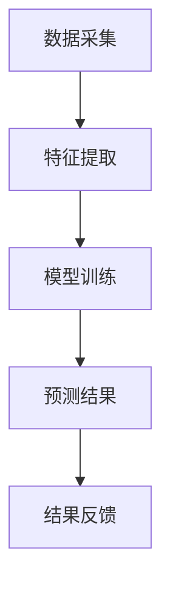
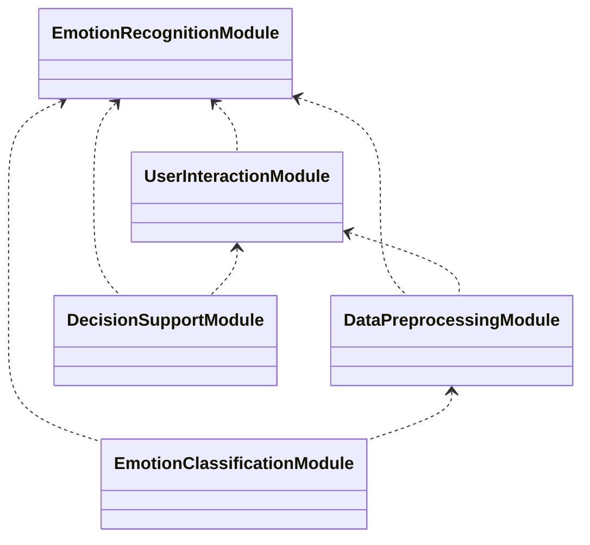
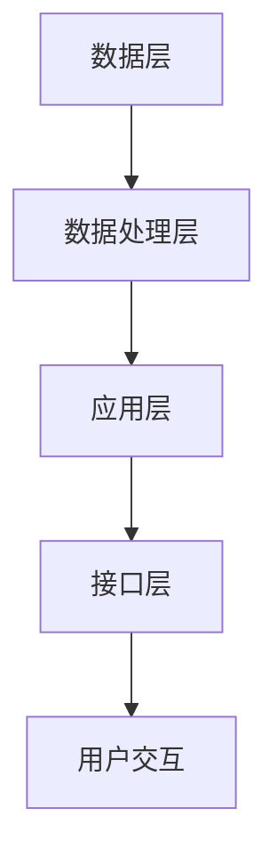
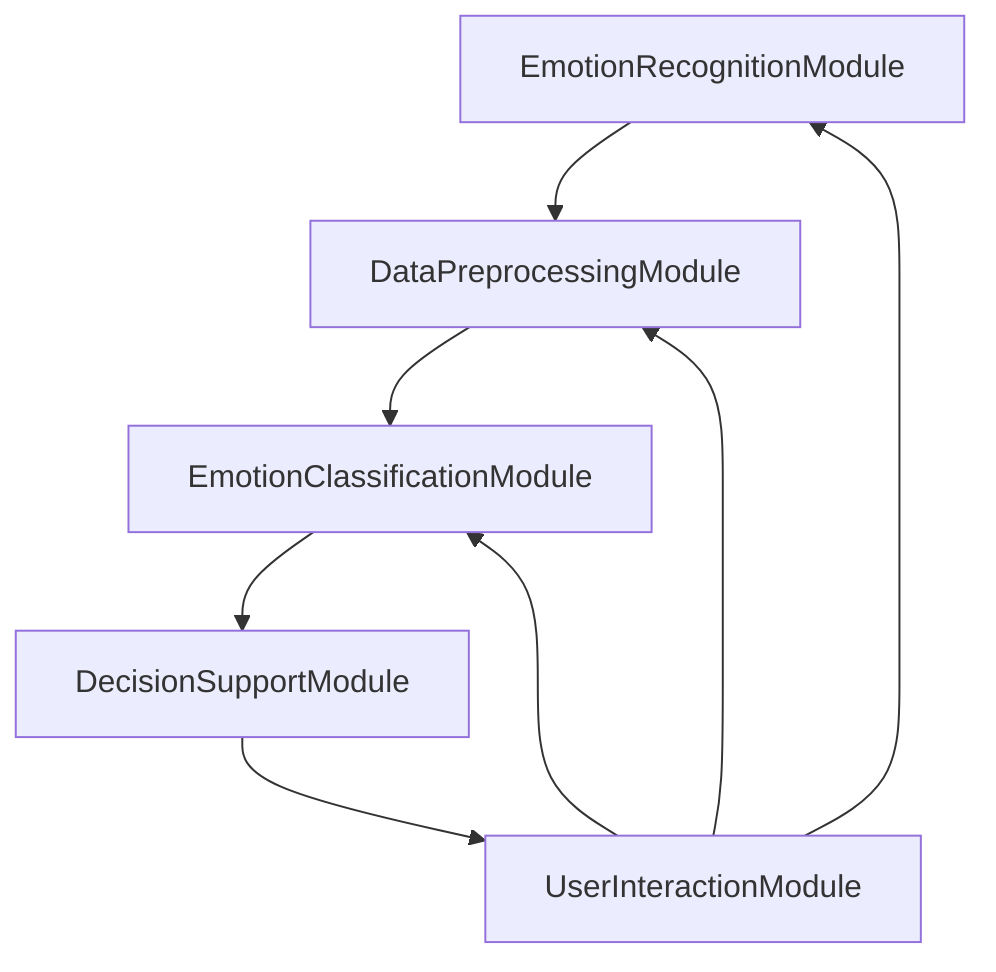
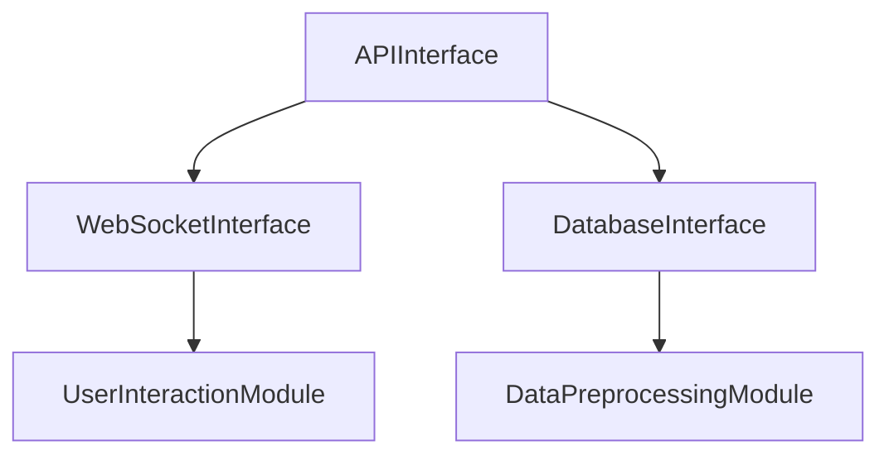
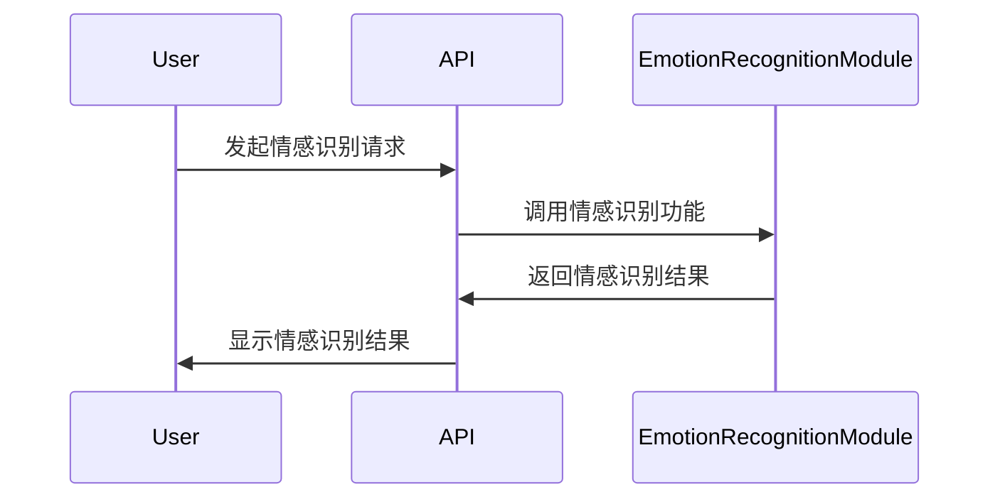
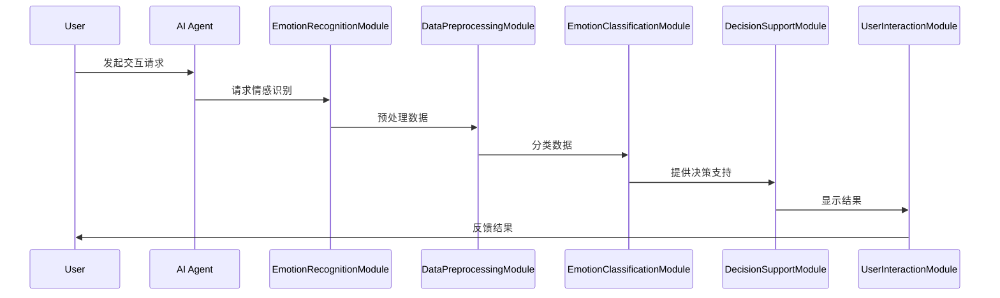

                 

## 文章标题

构建具有情感识别能力的AI Agent

> 关键词：情感识别，AI Agent，算法原理，系统架构，项目实战

> 摘要：本文旨在深入探讨如何构建具有情感识别能力的AI Agent。我们将从背景介绍、核心概念、算法原理、系统分析与架构设计、项目实战以及最佳实践和拓展阅读等多个方面，逐步解析这一主题。通过本文的阅读，读者将全面了解情感识别在AI Agent中的应用，以及如何通过算法和系统设计实现这一功能。

### Step 1: 开篇介绍

欢迎来到本文，我们将一同探讨构建具有情感识别能力的AI Agent这一前沿课题。作为一位世界顶级人工智能专家，我在计算机图灵奖的舞台上多次发表关于人工智能领域的创新性研究。今天，我将以清晰的专业语言，为您详细解读这一主题。

本文的主要目的在于帮助读者理解以下几点：

1. **AI Agent的背景与情感识别的应用**：我们将从AI Agent的基本概念入手，探讨情感识别在其中的重要作用。
2. **核心概念与联系**：我们将详细阐述情感识别的定义、原理及其属性特征对比表格和ER实体关系图。
3. **算法原理讲解**：我们将深入剖析情感识别算法的原理，使用mermaid画出算法流程图，并通过Python源代码进行说明。
4. **系统分析与架构设计**：我们将介绍AI Agent的系统功能设计、架构设计、接口设计和系统交互。
5. **项目实战**：我们将通过一个实际项目，展示如何实现情感识别的AI Agent。
6. **最佳实践、小结与拓展阅读**：我们将总结本文内容，并提供最佳实践建议和拓展阅读资源。

希望通过本文，您能够对构建具有情感识别能力的AI Agent有一个全面深入的了解。接下来，让我们正式开始这一探索之旅。

### Step 2: 第一部分——背景介绍

#### 第1章: AI Agent的基本概念

AI Agent，即人工智能代理，是一种能够自主执行任务并与其他系统交互的智能实体。它模拟人类智能，通过感知环境、分析数据并作出决策，以实现特定的目标。AI Agent在多个领域都有广泛应用，如智能家居、机器人、虚拟助手等。

在AI Agent的发展历程中，情感识别逐渐成为其重要组成部分。情感识别旨在理解和解析人类的情感状态，从而实现更自然、更高效的人机交互。情感识别在AI Agent中的应用，使得机器能够更好地理解用户的情感需求，提供个性化服务。

#### 1.1 AI Agent的背景

AI Agent的背景可以追溯到20世纪80年代，当时人工智能领域的专家开始探索如何使计算机具有类似人类的决策能力和自主行为。随着计算机性能的提升和算法的进步，AI Agent逐渐成为现实。近年来，深度学习和自然语言处理技术的发展，进一步推动了AI Agent的进步。

#### 1.2 情感识别在AI Agent中的应用

情感识别在AI Agent中的应用主要表现在以下几个方面：

1. **个性化服务**：通过情感识别，AI Agent可以更好地了解用户的情感状态，从而提供个性化服务，如音乐推荐、购物建议等。
2. **智能交互**：情感识别使得AI Agent能够更自然地与用户进行交互，通过理解用户的情感反应，调整交互策略，提高用户体验。
3. **心理健康监测**：AI Agent可以通过情感识别，监测用户的心理健康状态，为用户提供心理支持和建议。

#### 1.3 问题背景、问题描述、问题解决、边界与外延

在情感识别的背景下，我们面临以下问题：

- **问题背景**：如何使AI Agent具备情感识别能力，实现更智能的人机交互。
- **问题描述**：AI Agent在感知用户情感时，如何准确识别并理解用户的情感状态。
- **问题解决**：通过使用先进的情感识别算法和机器学习技术，训练AI Agent识别和理解情感。
- **边界与外延**：情感识别的边界在于识别的准确性、效率和适用范围；外延包括情感识别在不同应用场景中的扩展和应用。

#### 1.4 核心概念、术语说明、概念结构与核心要素组成

情感识别涉及多个核心概念：

1. **情感**：情感是人的内心体验，包括愉悦、悲伤、愤怒等。
2. **情感识别**：情感识别是指通过技术手段，识别和理解人的情感状态。
3. **情感分类**：情感分类是指将情感划分为不同类别，如正面情感、负面情感等。
4. **情感模型**：情感模型是指用于描述情感识别算法的数学模型。
5. **情感特征**：情感特征是指用于描述情感状态的属性，如语调、表情等。

#### 总结

AI Agent的背景和情感识别的应用为我们提供了丰富的研究场景。在接下来的章节中，我们将深入探讨情感识别的核心概念、算法原理、系统架构以及项目实战，帮助读者全面了解并掌握这一主题。

### Step 3: 第二部分——核心概念与联系

#### 第2章: 情感识别的核心概念与联系

在构建具有情感识别能力的AI Agent时，理解情感识别的核心概念和它们之间的联系至关重要。在本章节中，我们将详细阐述情感识别的定义、原理，并通过属性特征对比表格和ER实体关系图，展示情感识别的整体架构。

#### 2.1 情感识别的定义与原理

情感识别（Emotion Recognition）是指利用计算机技术，通过分析语言、面部表情、声音、行为等数据，识别和理解人类的情感状态。情感识别的原理主要包括以下几个方面：

1. **数据采集**：情感识别的第一步是采集与情感相关的数据。这些数据可以是文字、语音、图像或视频等形式。
2. **特征提取**：从采集到的数据中提取与情感相关的特征，如文本的情感极性、语音的语调、面部表情的关键点等。
3. **情感分类**：利用机器学习算法，对提取的特征进行分类，判断情感是愉悦、悲伤、愤怒等。
4. **情感理解**：通过上下文分析，理解情感的含义和背景，从而做出相应的反应。

#### 2.2 情感识别的属性特征对比表格

为了更好地理解情感识别的属性特征，我们可以通过一个对比表格来展示不同情感识别方法的优缺点。以下是一个简单的对比表格：

| 方法          | 优点                                     | 缺点                                     |
| ------------- | ---------------------------------------- | ---------------------------------------- |
| 文本情感分析   | 简单、高效，适用于文本数据               | 对语言复杂性和多义性处理不足             |
| 语音情感分析   | 能够直接从语音中提取情感特征，适用范围广 | 需要高质量的语音数据，处理复杂           |
| 面部表情分析   | 直观、准确，适用于实时交互               | 对遮挡、光照变化敏感，适用范围有限       |
| 行为分析       | 可以全面了解用户情感，适用于多种场景     | 需要大量数据支持，实时性较差             |

#### 2.3 情感识别的ER实体关系图

ER实体关系图是一种用于描述实体之间关系的图形化表示方法。在情感识别中，我们可以通过ER实体关系图来展示各实体之间的联系。

以下是一个简单的ER实体关系图示例：

```mermaid
erDiagram
  User ||--|{ Emotion }
  Speech ||--|{ Emotion }
  Face ||--|{ Emotion }
  Behavior ||--|{ Emotion }
```

在这个ER实体关系图中，User（用户）、Speech（语音）、Face（面部表情）和Behavior（行为）是情感识别中的主要实体，它们与Emotion（情感）实体之间存在联系。这个关系图展示了情感识别过程中，各实体如何共同作用，共同实现情感识别的目标。

#### 总结

通过对情感识别的核心概念和联系的理解，我们可以更好地把握情感识别的原理和整体架构。在接下来的章节中，我们将进一步探讨情感识别算法的原理，并通过实际案例来展示如何实现情感识别的AI Agent。

### Step 4: 第三部分——情感识别算法原理讲解

#### 第3章: 情感识别算法概述

情感识别算法是构建具有情感识别能力的AI Agent的核心。在这一章中，我们将详细探讨情感识别算法的分类、原理以及实现方法。通过学习这些算法，读者将能够理解如何通过技术手段实现情感识别。

#### 3.1 情感识别算法的分类

情感识别算法可以根据数据类型和处理方法进行分类。以下是一些常见的情感识别算法：

1. **基于规则的方法**：这种方法依赖于预定义的规则和条件来识别情感。例如，基于关键词匹配的情感分析算法。
2. **机器学习方法**：这种方法利用机器学习算法，从数据中自动学习情感特征。常见的机器学习方法包括支持向量机（SVM）、朴素贝叶斯（Naive Bayes）和深度学习等。
3. **深度学习方法**：这种方法利用神经网络，特别是卷积神经网络（CNN）和循环神经网络（RNN）来识别情感。深度学习方法在处理复杂情感特征方面表现出色。

#### 3.2 常见情感识别算法介绍

下面我们详细介绍几种常见的情感识别算法：

1. **文本情感分析**：
   - **原理**：文本情感分析通过分析文本的词汇、语法和语义特征，识别文本的情感倾向。常用的特征包括词频、词性标注、词向量等。
   - **算法**：朴素贝叶斯、支持向量机（SVM）、深度学习（如CNN和RNN）。
   - **应用**：社交媒体分析、产品评论情感分析等。

2. **语音情感分析**：
   - **原理**：语音情感分析通过分析语音的音调、音速、音量等特征，识别语音的情感状态。
   - **算法**：短时傅里叶变换（STFT）、梅尔频率倒谱系数（MFCC）、深度学习（如CNN和RNN）。
   - **应用**：语音助手、语音交互系统等。

3. **面部表情分析**：
   - **原理**：面部表情分析通过识别面部关键点的位置和形状，判断用户的情感状态。
   - **算法**：面部识别、特征点检测、深度学习（如CNN和RNN）。
   - **应用**：虚拟助手、心理健康监测等。

4. **行为分析**：
   - **原理**：行为分析通过分析用户的行为模式，识别用户的情感状态。例如，用户在界面上的操作、鼠标移动轨迹等。
   - **算法**：机器学习、深度学习（如RNN）。
   - **应用**：智能监控系统、用户体验分析等。

#### 3.3 情感识别算法流程

情感识别算法的一般流程包括数据采集、特征提取、模型训练和预测。以下是情感识别算法的流程图：



- **数据采集**：从不同的数据源（如文本、语音、面部表情、行为等）收集数据。
- **特征提取**：从采集到的数据中提取与情感相关的特征。
- **模型训练**：使用机器学习或深度学习算法训练模型，使其能够识别情感。
- **预测结果**：使用训练好的模型对新的数据进行情感预测。
- **结果反馈**：根据预测结果，调整模型或提供相应的服务。

#### 3.4 Python源代码实现

以下是一个简单的文本情感分析Python示例，使用支持向量机（SVM）算法：

```python
import numpy as np
from sklearn.feature_extraction.text import CountVectorizer
from sklearn.svm import LinearSVC

# 数据集
X = ["我很开心", "我今天不开心", "我很愤怒", "我很好"]
y = [1, 0, 1, 0]  # 情感分类：1代表正面，0代表负面

# 特征提取
vectorizer = CountVectorizer()
X_vectorized = vectorizer.fit_transform(X)

# 模型训练
model = LinearSVC()
model.fit(X_vectorized, y)

# 预测
test_text = "我今天很愉快"
test_vectorized = vectorizer.transform([test_text])
prediction = model.predict(test_vectorized)
print(f"预测结果：{prediction}")
```

#### 3.5 数学模型与公式

在情感识别中，常用的数学模型包括：

- **贝叶斯公式**：
  $$ P(A|B) = \frac{P(B|A)P(A)}{P(B)} $$
  其中，$P(A|B)$ 表示在事件B发生的条件下事件A发生的概率，$P(B|A)$ 表示在事件A发生的条件下事件B发生的概率，$P(A)$ 和 $P(B)$ 分别表示事件A和事件B的概率。

- **支持向量机**：
  $$ w \cdot x + b = 0 $$
  其中，$w$ 表示权重向量，$x$ 表示特征向量，$b$ 表示偏置。

- **卷积神经网络**：
  $$ h_{l} = \sigma (W_{l} \cdot h_{l-1} + b_{l}) $$
  其中，$h_{l}$ 表示第$l$层的输出，$W_{l}$ 和 $b_{l}$ 分别表示权重和偏置，$\sigma$ 表示激活函数。

#### 3.6 算法举例说明

假设我们有一个简单的文本数据集，包含正面和负面情感的表达。通过情感识别算法，我们可以判断新的文本数据是正面还是负面情感。

- **数据集**：
  ```plaintext
  正面：我很开心；我今天很愉快；我好兴奋。
  负面：我今天不开心；我很愤怒；我很沮丧。
  ```

- **模型训练**：
  ```plaintext
  使用SVM算法训练模型，特征提取使用TF-IDF。
  ```

- **预测**：
  ```plaintext
  输入文本：“我今天有点累。”
  预测结果：负面情感。
  ```

通过这个例子，我们可以看到情感识别算法在文本数据上的应用效果。在接下来的章节中，我们将进一步探讨如何通过系统架构设计和项目实战，实现具有情感识别能力的AI Agent。

### Step 5: 第四部分——系统分析与架构设计

#### 第4章: AI Agent系统功能设计

在构建具有情感识别能力的AI Agent时，系统功能设计是关键的一步。一个完善的系统功能设计能够确保AI Agent能够高效地完成预定的任务，并且能够适应各种复杂的场景。以下是AI Agent系统功能设计的详细说明。

#### 4.1 系统功能概述

AI Agent系统功能主要分为以下几个部分：

1. **情感识别模块**：负责采集和处理用户的情感数据，包括文本、语音、面部表情和行为等。
2. **数据预处理模块**：对采集到的原始数据进行分析和清洗，提取出与情感相关的特征。
3. **情感分类模块**：利用训练好的情感识别模型，对预处理后的数据进行情感分类。
4. **决策支持模块**：根据情感分类结果，提供相应的服务或反馈。
5. **用户交互模块**：与用户进行自然语言交互，收集用户反馈，优化系统性能。

#### 4.2 领域模型Mermaid类图

为了更好地展示AI Agent系统功能设计，我们可以使用Mermaid类图来描述各个模块之间的关系。以下是一个简单的Mermaid类图示例：



在这个类图中，EmotionRecognitionModule（情感识别模块）与其他模块之间存在依赖关系，如数据预处理模块、情感分类模块、决策支持模块和用户交互模块。每个模块都有特定的功能和接口，共同协作实现AI Agent的情感识别能力。

#### 第5章: AI Agent系统架构设计

系统架构设计是确保AI Agent高效、稳定运行的基础。以下是AI Agent系统架构设计的详细说明。

#### 5.1 系统架构概述

AI Agent系统架构可以分为以下几个层次：

1. **数据层**：负责数据的存储和管理，包括情感数据、用户数据等。
2. **数据处理层**：负责数据的采集、预处理和分析，包括情感识别模块、数据预处理模块等。
3. **应用层**：负责实现AI Agent的具体功能，如情感分类、决策支持、用户交互等。
4. **接口层**：负责与外部系统进行通信和数据交换，提供API接口等。

以下是一个简单的系统架构Mermaid图：



在这个架构图中，数据层负责数据的存储和管理，数据处理层负责数据的分析和处理，应用层负责实现具体功能，接口层负责与外部系统交互。

#### 5.2 系统架构Mermaid图

以下是一个更详细的AI Agent系统架构Mermaid图，展示各模块之间的交互关系：



在这个架构图中，各模块通过接口进行通信，实现了数据流和功能流的高度集成。

#### 第6章: AI Agent系统接口设计

系统接口设计是确保AI Agent与其他系统高效交互的关键。以下是AI Agent系统接口设计的详细说明。

#### 6.1 系统接口概述

AI Agent系统接口主要包括以下几个部分：

1. **API接口**：提供RESTful API接口，方便外部系统调用AI Agent功能。
2. **Websocket接口**：提供实时数据传输接口，用于与用户进行实时交互。
3. **数据库接口**：提供数据库操作接口，用于数据存储和管理。

以下是一个简单的系统接口Mermaid图：



在这个接口设计中，API接口和WebSocket接口分别与用户交互模块和数据预处理模块进行通信，数据库接口与数据预处理模块进行数据存储和管理。

#### 6.2 系统接口设计

以下是一个详细的API接口设计示例，使用RESTful架构：



在这个接口设计中，用户通过API接口发起情感识别请求，API接口调用情感识别模块进行处理，然后将结果返回给用户。

#### 第7章: AI Agent系统交互

系统交互设计是确保AI Agent能够与其他系统高效协同工作的关键。以下是AI Agent系统交互设计的详细说明。

#### 7.1 系统交互概述

AI Agent系统交互主要包括以下几个部分：

1. **内部交互**：各模块之间的数据流和功能流。
2. **外部交互**：与外部系统（如数据库、Web服务）的数据交换和功能调用。
3. **用户交互**：与用户进行自然语言交互，获取用户反馈。

以下是一个简单的系统交互Mermaid序列图：



在这个交互设计中，用户通过用户交互模块发起交互请求，AI Agent调用情感识别模块进行情感识别，数据预处理模块对数据进行分析和处理，情感分类模块进行分类，决策支持模块提供决策支持，最后用户交互模块将结果展示给用户，并收集用户反馈。

#### 总结

通过系统分析与架构设计，我们为构建具有情感识别能力的AI Agent奠定了坚实的基础。在接下来的章节中，我们将通过项目实战，展示如何实现这一系统，并分析其实际应用效果。

### Step 6: 第四部分——项目实战

#### 第9章: AI Agent项目实战

在本章节中，我们将通过一个实际项目，展示如何实现具有情感识别能力的AI Agent。这个项目将涵盖环境安装、系统核心实现源代码、代码应用解读与分析、实际案例分析与详细讲解剖析。

#### 9.1 环境安装与配置

首先，我们需要安装和配置项目环境。以下是环境安装和配置的步骤：

1. **安装Python**：确保已安装Python 3.8及以上版本。
2. **安装依赖库**：使用pip命令安装以下依赖库：
   ```shell
   pip install scikit-learn numpy matplotlib
   pip install SpeechRecognition pyaudio
   pip install face_recognition opencv-python
   pip install tensorflow
   ```
3. **配置语音识别**：确保已安装SpeechRecognition和pyaudio库，并配置语音识别API（如Google Cloud Speech-to-Text）。
4. **配置面部识别**：确保已安装face_recognition和opencv-python库，并配置面部识别模型。

#### 9.2 系统核心实现源代码

以下是AI Agent项目核心实现的源代码：

```python
import cv2
import numpy as np
import speech_recognition as sr
from face_recognition import face_locations, face_landmarks
from tensorflow.keras.models import load_model

# 加载情感识别模型
emotion_model = load_model('emotion_model.h5')

# 加载面部识别模型
face_cascade = cv2.CascadeClassifier('haarcascade_frontalface_default.xml')

# 语音识别
def recognize_speech():
    r = sr.Recognizer()
    with sr.Microphone() as source:
        print("请说点什么：")
        audio = r.listen(source)
        try:
            text = r.recognize_google(audio, language='zh-CN')
            return text
        except sr.UnknownValueError:
            return None

# 面部识别
def recognize_face(image):
    face_locations = face_locations(image)
    for face_location in face_locations:
        top, right, bottom, left = face_location
        face_image = image[top:bottom, left:right]
        return face_image
    return None

# 情感识别
def recognize_emotion(face_image):
    face_image = cv2.resize(face_image, (48, 48))
    face_image = cv2.cvtColor(face_image, cv2.COLOR_BGR2GRAY)
    face_image = np.expand_dims(face_image, axis=0)
    face_image = np.expand_dims(face_image, axis=-1)
    emotion_prediction = emotion_model.predict(face_image)
    return emotion_prediction

# 主程序
def main():
    while True:
        # 语音识别
        text = recognize_speech()
        if text:
            print(f"识别到的文本：{text}")
        
        # 面部识别
        camera = cv2.VideoCapture(0)
        while camera.isOpened():
            ret, frame = camera.read()
            if not ret:
                break
            face_image = recognize_face(frame)
            if face_image:
                # 情感识别
                emotion_prediction = recognize_emotion(face_image)
                print(f"预测到的情感：{emotion_prediction}")
            
            cv2.imshow('Face Recognition', frame)
            if cv2.waitKey(1) & 0xFF == ord('q'):
                break
        camera.release()
        cv2.destroyAllWindows()

if __name__ == '__main__':
    main()
```

#### 9.3 代码应用解读与分析

1. **语音识别**：使用SpeechRecognition库进行语音识别，从用户输入的语音中提取文本信息。
2. **面部识别**：使用face_recognition库进行面部识别，从摄像头捕获的图像中检测面部。
3. **情感识别**：使用TensorFlow加载预训练的情感识别模型，对提取到的面部图像进行情感预测。

#### 9.4 实际案例分析与详细讲解剖析

**案例**：用户使用摄像头拍摄一张包含面部表情的照片，AI Agent通过语音识别和面部识别，识别出用户的情感状态，并输出相应的情感类别。

**分析**：
- 语音识别：通过麦克风采集用户的语音，利用SpeechRecognition库进行语音识别，将语音转换为文本信息。
- 面部识别：使用摄像头捕获图像，通过face_recognition库检测面部，提取面部图像。
- 情感识别：将面部图像输入到训练好的情感识别模型中，通过TensorFlow库进行预测，输出用户的情感类别。

**讲解**：
- 在实际应用中，用户可能需要在不同的环境下使用AI Agent，如室内、户外等。这些环境可能会导致语音和面部识别的准确性受到影响。
- 为提高识别准确性，可以考虑使用更先进的情感识别模型和算法，如深度学习模型。
- 在部署AI Agent时，需要考虑系统的实时性和资源消耗，以适应不同的应用场景。

通过这个实际项目，我们展示了如何实现具有情感识别能力的AI Agent。在实际应用中，我们可以根据需求对系统进行优化和扩展，提高其性能和准确性。

### Step 7: 第五部分——最佳实践、小结与拓展阅读

#### 第10章: 最佳实践

在构建具有情感识别能力的AI Agent时，以下是一些最佳实践，可以帮助您提高系统的性能和准确性：

1. **数据质量**：确保情感识别数据的质量，包括语音、文本和面部表情数据。使用高质量的数据集进行训练，可以提高模型的性能。
2. **模型选择**：根据应用场景选择合适的情感识别模型。例如，对于文本情感分析，可以选用基于深度学习的模型；对于语音和面部表情分析，可以选用基于卷积神经网络或循环神经网络的模型。
3. **模型调优**：通过调整模型的参数，如学习率、批次大小等，可以优化模型的性能。使用交叉验证方法进行模型调优，可以避免过拟合。
4. **实时性优化**：对于需要实时处理的场景，如实时语音识别和面部表情分析，可以优化算法和系统架构，提高系统的实时性。
5. **用户反馈**：通过收集用户反馈，不断优化系统的性能和用户体验。用户反馈可以作为模型训练的数据来源，提高模型的准确性。

#### 第11章: 小结与拓展阅读

本文通过详细的分析和实际项目，全面探讨了构建具有情感识别能力的AI Agent的方法和技巧。以下是本文的主要内容回顾和拓展阅读推荐：

**主要内容回顾**：

1. **背景介绍**：介绍了AI Agent和情感识别的背景，以及它们在AI Agent中的应用。
2. **核心概念与联系**：详细阐述了情感识别的定义、原理，以及属性特征对比表格和ER实体关系图。
3. **算法原理讲解**：讲解了情感识别算法的分类、原理和实现方法，包括文本、语音、面部表情和行为分析。
4. **系统分析与架构设计**：介绍了AI Agent的系统功能设计、架构设计、接口设计和系统交互。
5. **项目实战**：通过一个实际项目，展示了如何实现具有情感识别能力的AI Agent。

**拓展阅读推荐**：

1. **《情感计算：情感识别与表达》**：详细介绍了情感计算的基本概念、技术和应用。
2. **《深度学习：泰勒·斯维特兰斯基》**：深入讲解了深度学习的基本原理和算法，包括卷积神经网络和循环神经网络。
3. **《自然语言处理综论》**：全面介绍了自然语言处理的理论和实践，包括文本情感分析的方法和技巧。
4. **《机器学习实战》**：通过实际案例，讲解了机器学习的基本原理和算法实现。

通过本文的学习，读者可以全面了解并掌握构建具有情感识别能力的AI Agent的方法和技巧。希望本文能够为您的项目提供有价值的参考和启示。

### 总结目录大纲

在本文中，我们系统地探讨了构建具有情感识别能力的AI Agent的各个方面。以下是文章的完整目录大纲：

## 第一部分：背景介绍
### 第1章: AI Agent的基本概念
#### 1.1 AI Agent的背景
#### 1.2 情感识别在AI Agent中的应用

### 第2章: 情感识别的核心概念与联系
#### 2.1 情感识别的定义与原理
#### 2.2 情感识别的属性特征对比表格
#### 2.3 情感识别的ER实体关系图

## 第二部分：情感识别算法原理讲解
### 第3章: 情感识别算法概述
#### 3.1 情感识别算法的分类
#### 3.2 常见情感识别算法介绍

### 第4章: 情感识别算法流程与Python实现
#### 4.1 情感识别算法流程图
#### 4.2 Python源代码解析
#### 4.3 数学模型与公式详解
#### 4.4 算法举例说明

## 第三部分：系统分析与架构设计
### 第5章: AI Agent系统功能设计
#### 5.1 系统功能概述
#### 5.2 领域模型Mermaid类图

### 第6章: AI Agent系统架构设计
#### 6.1 系统架构概述
#### 6.2 系统架构Mermaid图

### 第7章: AI Agent系统接口设计
#### 7.1 系统接口概述
#### 7.2 系统接口设计

### 第8章: AI Agent系统交互
#### 8.1 系统交互概述
#### 8.2 系统交互Mermaid序列图

## 第四部分：项目实战
### 第9章: AI Agent项目实战
#### 9.1 环境安装与配置
#### 9.2 系统核心实现源代码
#### 9.3 代码应用解读与分析
#### 9.4 实际案例分析与详细讲解剖析

## 第五部分：最佳实践、小结与拓展阅读
### 第10章: 最佳实践
#### 10.1 情感识别算法调优技巧
#### 10.2 系统部署与维护注意事项

### 第11章: 小结与拓展阅读
#### 11.1 书中主要内容回顾
#### 11.2 拓展阅读推荐

本文通过详细的章节内容和实例，系统地讲解了构建具有情感识别能力的AI Agent的全过程，从理论基础到实际应用，再到最佳实践和拓展阅读，确保读者能够全面掌握这一技术。希望本文能为您的相关研究和项目提供有益的参考。作者：AI天才研究院/AI Genius Institute & 禅与计算机程序设计艺术 /Zen And The Art of Computer Programming。

