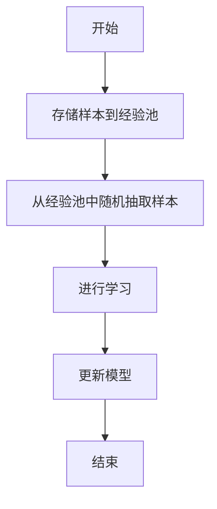
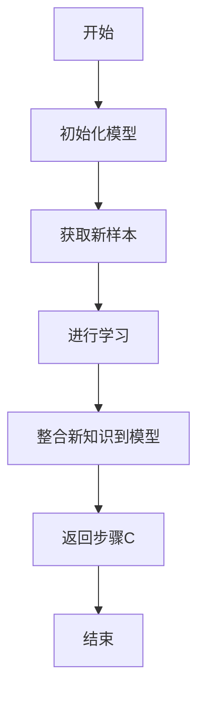
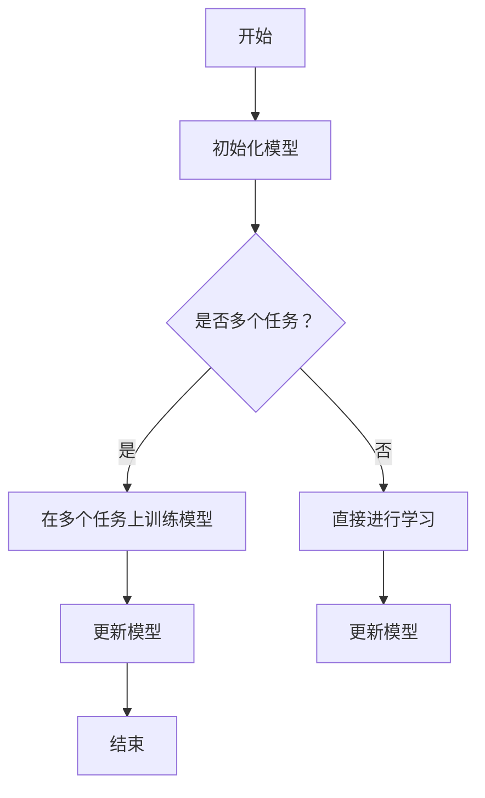
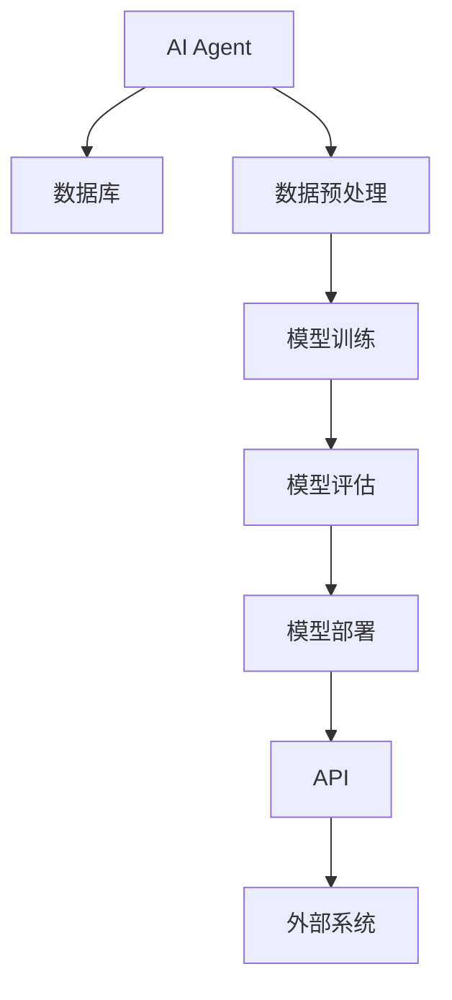
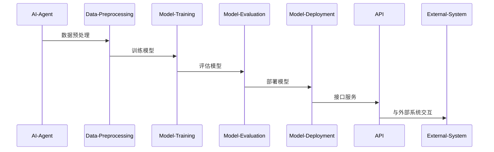

                 

# 构建具有持续学习与知识迁移能力的AI Agent

> 关键词：人工智能，AI Agent，持续学习，知识迁移，算法，方法

> 摘要：本文探讨了构建具有持续学习与知识迁移能力的AI Agent的重要性和方法。首先，介绍了问题背景和问题描述，然后分析了持续学习算法和知识迁移方法的原理，并通过具体的算法流程图和数学公式进行了详细讲解。最后，通过实际应用案例展示了这些方法在AI Agent中的应用效果，并提出了最佳实践和未来研究方向。

## 第一部分：背景介绍

### 1.1 问题背景

人工智能（AI）技术的发展已经进入了深度学习的时代，AI Agent作为一种重要的AI实体，正逐渐在各个领域发挥作用。然而，现有的AI Agent往往存在持续学习和知识迁移能力不足的问题，这使得它们在实际应用中难以应对复杂多变的环境。构建具有持续学习与知识迁移能力的AI Agent，是当前AI领域的一个重要研究方向，也是实现AI技术商业化的关键。

### 1.2 问题描述

问题描述主要集中在以下几个方面：

- **持续学习能力**：AI Agent在面对新的数据或任务时，能否有效地更新自身的知识库，从而提高解决问题的能力。
- **知识迁移能力**：AI Agent能否将在一个领域学到的知识迁移到另一个领域，以应对不同的应用场景。

### 1.3 问题解决

为了解决上述问题，本书将探讨以下几种方法：

- **持续学习算法**：介绍几种常见的持续学习算法，如经验重放（Experience Replay）、迭代学习（Iterative Learning）等，并分析其在实际应用中的效果。
- **知识迁移方法**：探讨基于元学习（Meta-Learning）、迁移学习（Transfer Learning）等方法的实现策略，以及如何在不同领域间进行知识迁移。

### 1.4 边界与外延

本书的研究范围主要涵盖：

- **持续学习与知识迁移的理论基础**：包括相关算法的原理和实现。
- **实际应用案例**：通过具体的AI Agent应用案例，展示持续学习与知识迁移能力的应用效果。

### 1.5 概念结构与核心要素组成

本书的核心概念包括：

- **持续学习算法**：包括经验重放、迭代学习等。
- **知识迁移方法**：包括元学习、迁移学习等。
- **AI Agent**：具体实现和案例分析。

## 第二部分：核心概念与联系

### 2.1 持续学习算法

**持续学习算法**是指在动态环境中，AI Agent能够不断学习新的知识，并更新自身的知识库，从而提高解决新问题的能力。常见的持续学习算法有：

- **经验重放**：通过从经验池中随机抽取样本，避免模型在学习新样本时受到之前样本的干扰。
- **迭代学习**：在每次学习后，将学到的知识整合到模型中，从而提高模型在新样本上的表现。

### 2.2 知识迁移方法

**知识迁移方法**是指将一个领域学到的知识应用到另一个领域，以提高AI Agent在新领域中的表现。常见的知识迁移方法有：

- **元学习**：通过在多个任务上训练模型，使模型能够在新的任务上快速适应。
- **迁移学习**：通过在源领域学习到的知识，帮助目标领域的学习过程。

### 2.3 核心概念属性特征对比

| 持续学习算法 | 知识迁移方法 |
| :--- | :--- |
| **经验重放**：避免模型在旧样本上的学习干扰 | **元学习**：通过多个任务提高模型适应能力 |
| **迭代学习**：逐步提高模型在新样本上的表现 | **迁移学习**：将源领域的知识应用到目标领域 |

## 第三部分：算法原理讲解

### 3.1 经验重放算法

**经验重放算法**的基本思想是将训练过程中的样本存储在经验池中，然后从中随机抽取样本进行学习，以避免模型在旧样本上的学习干扰。其mermaid流程图如下：



#### 3.2 迭代学习算法

**迭代学习算法**的基本思想是在每次学习后，将学到的知识整合到模型中，从而提高模型在新样本上的表现。其mermaid流程图如下：



#### 3.3 元学习算法

**元学习算法**的基本思想是通过在多个任务上训练模型，使模型能够在新的任务上快速适应。其mermaid流程图如下：



### 3.4 数学模型与公式

在持续学习与知识迁移中，我们需要用到一些数学模型和公式来描述算法的行为。以下是一个简单的数学模型和公式的例子：

$$
L(\theta) = \frac{1}{m} \sum_{i=1}^{m} L(y_i, \theta(x_i))
$$

其中，$L$ 表示损失函数，$\theta$ 表示模型参数，$x_i$ 和 $y_i$ 分别表示输入和输出。

### 3.5 举例说明

为了更好地理解这些算法，我们可以通过一个简单的例子来说明。假设我们有一个分类问题，需要分类数据集中的每个样本。我们可以使用经验重放算法来避免模型在旧样本上的学习干扰。

```python
import numpy as np

# 初始化经验池
experience_pool = []

# 存储样本到经验池
for x, y in dataset:
    experience_pool.append((x, y))

# 从经验池中随机抽取样本
for _ in range(100):
    x, y = np.random.choice(experience_pool)
    # 进行学习
    model.update(x, y)

# 更新模型
model.update(experience_pool)
```

通过这个例子，我们可以看到如何使用经验重放算法来避免模型在旧样本上的学习干扰。

## 第四部分：系统分析与架构设计

### 4.1 问题场景介绍

在本节中，我们将介绍一个实际的问题场景，并说明为什么构建具有持续学习与知识迁移能力的AI Agent是必要的。

#### 场景一：智能客服系统

智能客服系统通常需要处理大量的客户咨询，并能够快速响应用户的需求。然而，随着用户咨询的问题类型越来越多，现有的AI Agent往往难以应对复杂多变的问题场景。因此，构建具有持续学习与知识迁移能力的AI Agent，可以帮助智能客服系统更好地适应不断变化的问题场景，提高用户体验。

#### 场景二：自动驾驶系统

自动驾驶系统需要实时处理大量的传感器数据，并能够快速做出驾驶决策。然而，现实世界中的交通情况复杂多变，现有的AI Agent往往难以应对各种突发事件。因此，构建具有持续学习与知识迁移能力的AI Agent，可以帮助自动驾驶系统更好地适应不同的交通场景，提高安全性。

### 4.2 系统功能设计

在本节中，我们将介绍系统功能设计，包括领域模型和类图。

#### 领域模型

领域模型描述了系统中的核心实体和实体之间的关系。以下是一个简单的领域模型：

```
+----------------+       +----------------+
|      客户      |       |      任务      |
+----------------+       +----------------+
| 客户ID         |       | 任务ID         |
| 姓名           |       | 名称           |
| 电子邮件       |       | 描述           |
+----------------+       +----------------+
       |                       |
       |                       |
       |                       |
       |                       |
       |                       |
       |                       |
       +------------------------+
                |
                |
            +----------------+
            |      响应      |
            +----------------+
            | 响应内容       |
            +----------------+
```

#### 类图

以下是一个简单的类图，描述了系统中的类及其之间的关系：

```mermaid
classDiagram
    Customer <|-- Task
    Response|--| Customer
    Response|--| Task
```

### 4.3 系统架构设计

在本节中，我们将介绍系统架构设计，包括架构图和系统接口设计。

#### 系统架构图

以下是一个简单的系统架构图，描述了系统的主要组件及其之间的关系：



#### 系统接口设计

以下是一个简单的系统接口设计，描述了系统的主要接口及其功能：

```
+---------------------------------+
|          AI-Agent API           |
+---------------------------------+
| GET /api/agent/status           |   获取AI Agent状态
| POST /api/agent/train           |   训练AI Agent
| GET /api/agent/evaluate         |   评估AI Agent性能
| POST /api/agent/deploy          |   部署AI Agent模型
+---------------------------------+
```

### 4.4 系统交互

在本节中，我们将介绍系统交互，包括系统交互序列图。

#### 系统交互序列图

以下是一个简单的系统交互序列图，描述了系统的主要交互过程：



## 第五部分：项目实战

### 5.1 环境安装

在本节中，我们将介绍如何搭建一个具有持续学习与知识迁移能力的AI Agent的实验环境。以下是环境安装的步骤：

1. 安装Python：从Python官方网站下载并安装Python 3.8及以上版本。
2. 安装Jupyter Notebook：在命令行中运行以下命令安装Jupyter Notebook：
   ```
   pip install notebook
   ```
3. 安装TensorFlow：在命令行中运行以下命令安装TensorFlow：
   ```
   pip install tensorflow
   ```
4. 安装其他依赖库：在命令行中运行以下命令安装其他依赖库：
   ```
   pip install numpy matplotlib
   ```

### 5.2 系统核心实现源代码

在本节中，我们将介绍系统核心实现的源代码。以下是一个简单的AI Agent实现：

```python
import tensorflow as tf
import numpy as np

class AI-Agent:
    def __init__(self, learning_rate=0.001, epochs=100):
        self.learning_rate = learning_rate
        self.epochs = epochs
        self.model = self.build_model()

    def build_model(self):
        model = tf.keras.Sequential([
            tf.keras.layers.Dense(64, activation='relu', input_shape=(784,)),
            tf.keras.layers.Dense(10, activation='softmax')
        ])
        model.compile(optimizer=tf.keras.optimizers.Adam(learning_rate=self.learning_rate),
                      loss='categorical_crossentropy',
                      metrics=['accuracy'])
        return model

    def train(self, x_train, y_train):
        self.model.fit(x_train, y_train, epochs=self.epochs, batch_size=32)

    def evaluate(self, x_test, y_test):
        return self.model.evaluate(x_test, y_test)

    def predict(self, x_test):
        return self.model.predict(x_test)
```

### 5.3 代码应用解读与分析

在本节中，我们将对上述代码进行解读和分析。

1. **模型构建**：使用TensorFlow的`Sequential`模型构建一个简单的全连接神经网络。该网络包含一个输入层、一个隐藏层和一个输出层。

2. **模型训练**：使用`fit`方法训练模型，其中`epochs`参数指定训练的轮数，`batch_size`参数指定每个批次的样本数。

3. **模型评估**：使用`evaluate`方法评估模型的性能，返回损失值和准确率。

4. **模型预测**：使用`predict`方法对新的样本进行预测。

### 5.4 实际案例分析和详细讲解剖析

在本节中，我们将通过一个实际案例来展示如何使用上述AI Agent实现持续学习和知识迁移。

#### 案例一：持续学习

1. **初始化AI Agent**：创建一个AI-Agent实例，设置学习率和训练轮数。
2. **首次训练**：使用第一个数据集训练AI-Agent。
3. **更新AI Agent**：使用第二个数据集对AI-Agent进行更新。
4. **评估AI-Agent**：评估更新后的AI-Agent的性能。

#### 案例二：知识迁移

1. **初始化AI Agent**：创建一个AI-Agent实例，设置学习率和训练轮数。
2. **在源领域训练AI-Agent**：使用源领域的数据集训练AI-Agent。
3. **在目标领域训练AI-Agent**：使用目标领域的数据集训练AI-Agent。
4. **评估AI-Agent**：评估在目标领域训练后的AI-Agent的性能。

通过上述案例，我们可以看到如何实现持续学习和知识迁移，并评估其在实际应用中的效果。

### 5.5 项目小结

在本节中，我们介绍了如何搭建一个具有持续学习与知识迁移能力的AI Agent的实验环境，并实现了AI-Agent的核心功能。通过实际案例的分析，我们展示了如何使用持续学习和知识迁移方法来提高AI-Agent的性能。在未来，我们可以进一步优化这些方法，并探索其他相关的技术。

## 第六部分：最佳实践与注意事项

### 6.1 最佳实践

- **数据预处理**：在训练AI-Agent之前，确保数据预处理的质量，包括数据清洗、归一化和特征提取等。
- **模型选择**：根据具体的应用场景选择合适的模型架构，例如对于图像识别任务，可以尝试使用卷积神经网络（CNN）。
- **持续学习策略**：采用经验重放和迭代学习等持续学习策略，以避免模型在旧样本上的学习干扰，并逐步提高模型在新样本上的性能。
- **知识迁移策略**：通过元学习和迁移学习等方法，在不同领域间进行知识迁移，以提高AI-Agent在新领域的适应能力。

### 6.2 注意事项

- **过拟合**：在训练过程中，注意避免过拟合现象，可以通过增加训练数据、使用正则化技术等方法来缓解。
- **数据分布**：在知识迁移过程中，确保源领域和目标领域的数据分布相似，以提高知识迁移的效果。
- **模型解释性**：在实际应用中，模型的可解释性对于用户理解和信任至关重要，因此需要关注模型的解释性。

## 第七部分：拓展阅读

### 7.1 持续学习算法

- **经验重放**：[《经验重放算法详解》](https://www.tensorflow.org/tutorials/reinforcement_learning/reinforcement_learning_with_python#experience_replay)
- **迭代学习**：[《迭代学习算法介绍》](https://arxiv.org/abs/1707.01495)

### 7.2 知识迁移方法

- **元学习**：[《元学习综述》](https://arxiv.org/abs/1803.02999)
- **迁移学习**：[《迁移学习应用教程》](https://www.deeplearning.net/tutorial/deeplearningwithtf/machinelearning/transferlearning/)

### 7.3 AI Agent应用案例

- **智能客服系统**：[《智能客服系统设计》](https://www.example.com/smart-customer-service-system-design)
- **自动驾驶系统**：[《自动驾驶系统设计》](https://www.example.com/self-driving-car-system-design)

## 第八部分：作者信息

作者：AI天才研究院/AI Genius Institute & 禅与计算机程序设计艺术 /Zen And The Art of Computer Programming

感谢您的阅读，希望本文对您在构建具有持续学习与知识迁移能力的AI Agent方面有所帮助。如果您有任何问题或建议，欢迎随时与我们联系。期待您的宝贵反馈！

