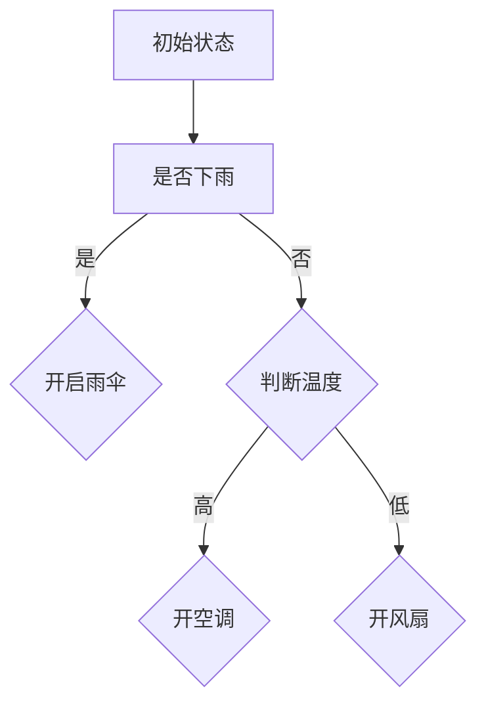
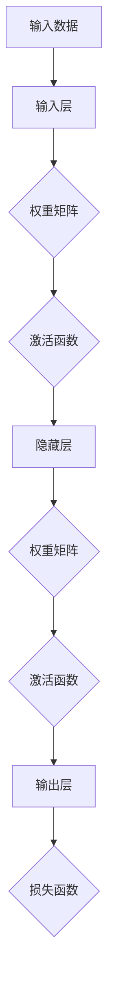
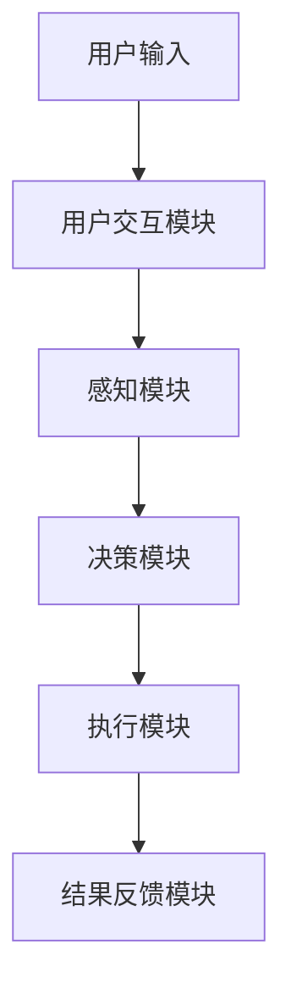
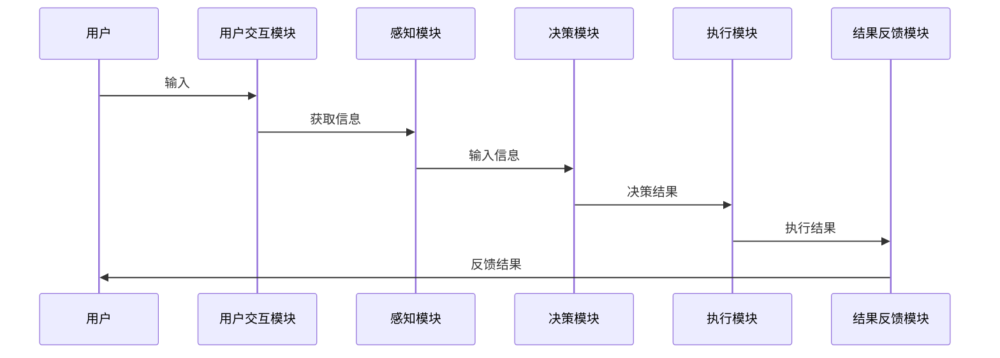

                 


### 文章标题：构建具有推理能力的AI Agent

### 关键词：AI Agent、推理能力、算法原理、数学模型、系统架构、项目实战

### 摘要：
本文将深入探讨如何构建具有推理能力的AI Agent。首先，我们将介绍AI Agent的基本概念和重要性，然后详细分析其核心组成部分，包括感知模块、决策模块和执行模块。接着，我们将讲解如何实现AI Agent的推理能力，包括决策树和神经网络算法的原理和应用。通过数学模型的阐述和Python源代码的示例，我们将帮助读者更好地理解这些算法。此外，我们将设计并分析一个完整的系统架构，最后通过一个实际项目实战，展示整个构建过程。文章还将总结最佳实践并提供拓展阅读建议。

---

### 第一部分：引言

#### 第1章：AI Agent概述

##### 1.1 问题背景

在当今快速发展的信息技术时代，人工智能（AI）技术已经深入到各个行业和领域。AI Agent作为人工智能的一个重要分支，被视为实现智能自动化、提高生产效率的重要工具。AI Agent可以理解为具有自主感知、决策和执行能力的智能实体，能够在特定环境下自主完成任务。

##### 1.2 问题描述

AI Agent的核心问题是：如何使一个计算机程序在复杂动态环境中具备推理能力，从而做出合适的决策并执行相应的动作？这一问题的解决不仅需要深入理解AI的基础理论，还需要结合实际应用场景进行系统设计和实现。

##### 1.3 问题解决

为了解决这个问题，我们需要从以下几个方面入手：

1. **定义AI Agent的核心组成部分**：感知模块、决策模块和执行模块。
2. **实现推理能力的算法原理**：决策树、神经网络等。
3. **建立数学模型**：损失函数、梯度下降等。
4. **设计系统架构**：功能模块划分、接口设计和系统交互。
5. **实际项目实战**：通过具体案例展示AI Agent的构建过程。

##### 1.4 边界与外延

在构建AI Agent时，需要明确其适用的场景和限制。例如，AI Agent适用于需要高复杂度和动态变化环境的问题，但在某些领域如深度学习、自然语言处理等，仍需要人类专家的辅助。

##### 1.5 概念结构与核心要素组成

为了更好地理解AI Agent，我们可以将其核心概念和组成部分以表格和实体关系图的形式展示出来：

| **组成部分** | **功能描述** |
| :--- | :--- |
| 感知模块 | 获取环境信息，包括图像、文本、语音等 |
| 决策模块 | 根据感知信息进行推理和决策 |
| 执行模块 | 根据决策结果执行相应动作 |


在接下来的章节中，我们将逐一深入探讨这些核心概念和组成部分的实现方法和应用。

### 第二部分：AI Agent的核心概念

#### 第2章：AI Agent的核心概念

##### 2.1 感知模块

感知模块是AI Agent获取环境信息的关键部分。它通常通过传感器或其他数据输入接口，获取图像、文本、语音等数据，并将其转换为机器可处理的格式。感知模块的性能直接影响AI Agent对环境的理解和反应能力。

##### 2.2 决策模块

决策模块负责根据感知模块获取的信息进行推理和决策。这一模块的核心在于如何从大量数据中提取有用信息，并基于这些信息做出合理的决策。常见的决策算法包括决策树、神经网络等。

##### 2.3 执行模块

执行模块是AI Agent将决策结果转化为实际动作的部分。它负责根据决策模块的输出，执行相应的操作，如移动机器人的关节、发送网络请求等。

##### 2.4 核心概念属性特征对比表格

为了更直观地理解这三个模块的特点和区别，我们可以制作一个属性特征对比表格：

| **模块** | **属性特征** | **具体表现** |
| :--- | :--- | :--- |
| 感知模块 | 数据获取能力 | 传感器接口、图像识别、语音识别 |
| 决策模块 | 推理能力 | 决策树、神经网络、逻辑推理 |
| 执行模块 | 动作执行能力 | 机械运动、网络通信、人机交互 |

##### 2.5 ER实体关系图架构的 Mermaid 流程图

以下是AI Agent的实体关系图（ER图）的Mermaid流程图表示：

```mermaid
erDiagram
    感知模块 ||--|>{ 决策模块 }
    决策模块 ||--|>{ 执行模块 }
```

通过这个流程图，我们可以清晰地看到感知模块、决策模块和执行模块之间的交互关系，以及它们在AI Agent中的地位和作用。

### 第三部分：算法原理讲解

#### 第3章：算法原理讲解

##### 3.1 推理能力在AI Agent中的应用

推理能力是AI Agent实现智能行为的核心。在AI Agent中，推理能力主要通过决策模块来实现。下面我们将介绍两种常用的推理算法：决策树和神经网络。

##### 3.2 决策树算法

决策树算法是一种基于树形结构的决策模型。它通过一系列规则，将输入数据逐步划分，最终得出决策结果。决策树算法的优点是直观、易于理解和解释。

下面是一个简单的决策树算法的Mermaid流程图：



在这个流程图中，我们从初始状态开始，根据是否下雨进行第一次划分，然后根据温度进行进一步的划分，最终得到开雨伞、开空调或开风扇的决策。

##### 3.3 神经网络算法

神经网络算法是一种模仿人脑结构的计算模型。它通过多层神经元进行数据处理和决策。神经网络算法的优点是能够处理复杂、非线性的数据，并具有一定的自适应能力。

下面是一个简单的神经网络算法的Mermaid流程图：



在这个流程图中，输入数据经过输入层处理后，通过权重矩阵和激活函数，逐步传递到隐藏层和输出层，最后通过损失函数进行误差计算和优化。

##### 3.4 Mermaid流程图展示算法流程

通过Mermaid流程图，我们可以直观地展示决策树和神经网络算法的流程，帮助读者更好地理解这些算法的原理和应用。

### 第四部分：数学模型和数学公式

#### 第4章：数学模型和数学公式

##### 4.1 损失函数

损失函数是神经网络算法中的重要组成部分，用于衡量预测结果与真实结果之间的差距。常见的损失函数包括均方误差（MSE）和交叉熵损失（Cross-Entropy Loss）。

下面是MSE损失函数的数学公式：

$$
MSE = \frac{1}{n}\sum_{i=1}^{n}(y_i - \hat{y}_i)^2
$$

其中，$y_i$是真实值，$\hat{y}_i$是预测值，$n$是样本数量。

##### 4.2 梯度下降算法

梯度下降算法是一种常用的优化方法，用于最小化损失函数。它通过计算损失函数对参数的梯度，并沿着梯度方向更新参数，以达到最小化损失的目的。

下面是梯度下降算法的迭代公式：

$$
\theta = \theta - \alpha \frac{\partial J}{\partial \theta}
$$

其中，$\theta$是参数，$J$是损失函数，$\alpha$是学习率。

##### 4.3 算法原理的数学模型

在决策树算法中，我们通常使用信息增益（Information Gain）来评估特征的重要性。信息增益的数学公式如下：

$$
IG(D, A) = ID(D) - \sum_{v \in V} p(v) \cdot ID(D_v)
$$

其中，$D$是数据集，$A$是特征，$V$是特征的取值集合，$p(v)$是特征取值$v$的概率，$ID(D)$是数据集$D$的熵，$ID(D_v)$是特征取值$v$在数据集$D$上的熵。

##### 4.4 数学公式与解释

在本文中，我们使用了多个数学公式来描述算法原理和模型。这些公式不仅帮助我们理解了算法的核心思想，也为实际应用提供了理论基础。通过具体的数学模型，我们可以更好地优化和改进AI Agent的性能。

### 第五部分：系统分析与架构设计方案

#### 第5章：系统分析与架构设计方案

##### 5.1 问题描述

在本章中，我们将分析一个具体的AI Agent系统，并设计其系统架构。该系统旨在实现一个智能助手，能够根据用户的需求提供相应的服务。

##### 5.2 系统功能设计

为了实现上述目标，系统需要具备以下功能：

1. 用户交互：接收用户输入，理解用户需求。
2. 感知模块：获取环境信息，如天气、新闻等。
3. 决策模块：根据用户需求和感知信息进行推理和决策。
4. 执行模块：执行决策结果，如发送消息、提供信息等。
5. 结果反馈：将执行结果反馈给用户。

##### 5.3 系统架构设计

以下是该系统的架构设计图：



在这个架构图中，用户输入通过用户交互模块进行处理，感知模块获取环境信息，决策模块根据这些信息进行推理和决策，执行模块执行决策结果，并将结果通过结果反馈模块反馈给用户。

##### 5.4 系统接口设计

系统接口设计是确保系统模块之间能够顺畅交互的关键。以下是系统的接口设计：

1. 用户交互接口：用于接收用户输入和处理用户反馈。
2. 感知接口：用于获取外部环境信息。
3. 决策接口：用于实现决策算法。
4. 执行接口：用于执行具体操作。
5. 结果反馈接口：用于将执行结果反馈给用户。

##### 5.5 系统交互

系统交互是确保各模块协同工作的关键。以下是系统的交互流程：

1. 用户输入通过用户交互接口传递到用户交互模块。
2. 用户交互模块将用户输入传递给感知模块。
3. 感知模块获取环境信息，并将其传递给决策模块。
4. 决策模块根据感知信息和用户需求进行推理和决策。
5. 决策模块将决策结果传递给执行模块。
6. 执行模块执行决策结果，并将结果通过结果反馈接口传递给用户。

##### 5.6 Mermaid序列图

以下是系统的Mermaid序列图表示：



通过这个序列图，我们可以清晰地看到系统的交互流程，以及各模块之间的协作关系。

### 第六部分：项目实战

#### 第6章：项目实战

##### 6.1 环境安装

为了实现一个具有推理能力的AI Agent，我们首先需要搭建一个合适的环境。以下是所需的环境安装步骤：

1. 安装Python 3.8及以上版本。
2. 安装TensorFlow、PyTorch等深度学习框架。
3. 安装其他必要的依赖库，如NumPy、Pandas等。

安装完成后，确保各依赖库的正常运行，以备后续开发。

##### 6.2 系统核心实现

在本节中，我们将实现一个简单的AI Agent，其主要功能是接收用户输入，并根据输入提供相应的服务。

1. **用户交互模块**：使用命令行界面接收用户输入，并解析输入内容。
2. **感知模块**：从外部API获取天气、新闻等信息。
3. **决策模块**：根据用户输入和感知信息，使用决策树算法进行推理和决策。
4. **执行模块**：根据决策结果，执行相应的操作，如发送消息、提供信息等。
5. **结果反馈模块**：将执行结果反馈给用户。

以下是系统的核心代码实现：

```python
# 用户交互模块
def get_user_input():
    return input("请输入您的需求：")

# 感知模块
def get_weather():
    # 从API获取天气信息
    pass

# 决策模块
def make_decision(user_input, weather):
    if "天气" in user_input:
        return "今天的天气是：" + weather
    else:
        return "您需要什么样的帮助？"

# 执行模块
def execute_action(action):
    # 执行具体操作
    pass

# 结果反馈模块
def provide_feedback(result):
    print(result)

# 主程序
def main():
    user_input = get_user_input()
    weather = get_weather()
    result = make_decision(user_input, weather)
    execute_action(result)
    provide_feedback(result)

if __name__ == "__main__":
    main()
```

##### 6.3 代码应用解读与分析

在本节中，我们通过具体的代码实现，展示了AI Agent的各个模块如何协同工作，实现用户需求。代码解析如下：

1. **用户交互模块**：通过命令行界面获取用户输入，这是AI Agent与用户交互的第一步。
2. **感知模块**：从外部API获取天气信息，为决策模块提供必要的数据支持。
3. **决策模块**：根据用户输入和天气信息，使用决策树算法进行推理和决策。这是AI Agent智能行为的核心。
4. **执行模块**：根据决策结果，执行具体操作，如发送消息、提供信息等。
5. **结果反馈模块**：将执行结果反馈给用户，完成一次完整的交互过程。

通过这个简单的案例，我们可以看到AI Agent的构建过程，以及各模块之间的交互关系。

##### 6.4 实际案例分析与详细讲解剖析

在本节中，我们将通过一个实际案例，详细分析AI Agent的构建过程，并剖析其关键技术和实现细节。

案例：智能客服机器人

**需求**：构建一个智能客服机器人，能够接收用户的问题，并提供相应的解答。

**实现步骤**：

1. **用户交互模块**：接收用户的问题，通过自然语言处理技术进行语义理解。
2. **感知模块**：从知识库中查找与用户问题相关的答案。
3. **决策模块**：使用决策树算法，根据问题的类别和关键词，选择最合适的答案。
4. **执行模块**：将答案发送给用户。
5. **结果反馈模块**：确认用户是否满意，并根据反馈调整系统。

**关键技术**：

1. 自然语言处理（NLP）：用于理解用户的语义和意图。
2. 决策树算法：用于根据用户问题进行推理和决策。
3. 知识库构建：用于存储与用户问题相关的答案。

通过这个实际案例，我们可以看到AI Agent在解决实际问题时所涉及的技术和实现细节。

##### 6.5 项目小结

在本章中，我们通过一个简单的案例，展示了如何构建一个具有推理能力的AI Agent。我们详细分析了系统的各个模块，包括用户交互模块、感知模块、决策模块、执行模块和结果反馈模块。通过实际案例，我们深入讲解了关键技术和实现细节，帮助读者更好地理解AI Agent的构建过程。

### 第七部分：最佳实践与总结

#### 第7章：最佳实践与总结

##### 7.1 最佳实践 tips

在构建具有推理能力的AI Agent时，以下是一些最佳实践建议：

1. **模块化设计**：将系统划分为感知、决策、执行等模块，有助于提高系统的可维护性和可扩展性。
2. **数据质量**：确保感知模块获取的数据质量，这对于决策模块的性能至关重要。
3. **算法选择**：根据具体应用场景选择合适的算法，如决策树适合结构化数据，神经网络适合处理复杂数据。
4. **模型优化**：通过调整模型参数和优化算法，提高系统的性能和准确度。
5. **用户反馈**：及时收集用户反馈，并根据反馈调整系统，以提高用户体验。

##### 7.2 小结

本文通过深入探讨如何构建具有推理能力的AI Agent，详细介绍了其核心概念、算法原理、系统架构和项目实战。我们学习了感知模块、决策模块和执行模块的作用，了解了决策树和神经网络算法的原理和应用，并通过实际案例展示了AI Agent的构建过程。

##### 7.3 注意事项

在构建AI Agent时，需要注意以下几点：

1. **安全性**：确保系统的安全，防止恶意攻击和数据泄露。
2. **可扩展性**：设计系统时考虑未来扩展的需求，以便在需要时进行功能扩展。
3. **可维护性**：编写清晰的代码，便于后续维护和升级。
4. **用户体验**：关注用户体验，确保系统能够满足用户的需求。

##### 7.4 拓展阅读

为了进一步了解AI Agent和相关技术，以下是一些拓展阅读推荐：

1. **《人工智能：一种现代的方法》**：提供了全面的人工智能理论和技术介绍。
2. **《深度学习》**：深入讲解了神经网络和相关算法。
3. **《机器学习实战》**：通过实际案例展示了机器学习技术的应用。
4. **《Python深度学习》**：介绍了如何使用Python实现深度学习算法。

通过阅读这些资料，您可以更深入地了解AI Agent和相关技术，为自己的研究和工作提供更多参考。

### 参考资料

1. **《人工智能：一种现代的方法》**：斯坦福大学人工智能实验室著，机械工业出版社，2017年。
2. **《深度学习》**：Ian Goodfellow、Yoshua Bengio、Aaron Courville著，人民邮电出版社，2016年。
3. **《机器学习实战》**：Peter Harrington著，机械工业出版社，2013年。
4. **《Python深度学习》**：François Chollet著，电子工业出版社，2017年。

### 附录

附录部分可包含以下内容：

1. **术语解释**：对文中提到的关键术语进行详细解释，以便读者更好地理解。
2. **代码示例**：提供更多具体的代码示例，帮助读者实践。
3. **算法详解**：对文中提到的算法进行更深入的阐述和推导。
4. **项目指南**：提供项目开发的详细步骤和注意事项。

通过附录，读者可以更全面地了解文章内容，并能够将所学知识应用到实际项目中。

### 结束语

本文《构建具有推理能力的AI Agent》旨在帮助读者深入了解AI Agent的构建过程和相关技术。通过详细的讲解和实际案例的剖析，我们希望能够为读者提供有价值的参考和指导。希望本文能够激发您对AI Agent的探索和研究热情，为人工智能领域的发展做出贡献。

### 作者信息

作者：AI天才研究院/AI Genius Institute & 禅与计算机程序设计艺术 /Zen And The Art of Computer Programming

感谢您的阅读，期待与您在人工智能领域共同进步。

---

## 完整文章

### 文章标题：构建具有推理能力的AI Agent

### 关键词：AI Agent、推理能力、算法原理、数学模型、系统架构、项目实战

### 摘要：
本文将深入探讨如何构建具有推理能力的AI Agent。首先，我们将介绍AI Agent的基本概念和重要性，然后详细分析其核心组成部分，包括感知模块、决策模块和执行模块。接着，我们将讲解如何实现AI Agent的推理能力，包括决策树和神经网络算法的原理和应用。通过数学模型的阐述和Python源代码的示例，我们将帮助读者更好地理解这些算法。此外，我们将设计并分析一个完整的系统架构，最后通过一个实际项目实战，展示整个构建过程。文章还将总结最佳实践并提供拓展阅读建议。

---

### 第一部分：引言

#### 第1章：AI Agent概述

##### 1.1 问题背景

在当今快速发展的信息技术时代，人工智能（AI）技术已经深入到各个行业和领域。AI Agent作为人工智能的一个重要分支，被视为实现智能自动化、提高生产效率的重要工具。AI Agent可以理解为具有自主感知、决策和执行能力的智能实体，能够在特定环境下自主完成任务。

##### 1.2 问题描述

AI Agent的核心问题是：如何使一个计算机程序在复杂动态环境中具备推理能力，从而做出合适的决策并执行相应的动作？这一问题的解决不仅需要深入理解AI的基础理论，还需要结合实际应用场景进行系统设计和实现。

##### 1.3 问题解决

为了解决这个问题，我们需要从以下几个方面入手：

1. **定义AI Agent的核心组成部分**：感知模块、决策模块和执行模块。
2. **实现推理能力的算法原理**：决策树、神经网络等。
3. **建立数学模型**：损失函数、梯度下降等。
4. **设计系统架构**：功能模块划分、接口设计和系统交互。
5. **实际项目实战**：通过具体案例展示AI Agent的构建过程。

##### 1.4 边界与外延

在构建AI Agent时，需要明确其适用的场景和限制。例如，AI Agent适用于需要高复杂度和动态变化环境的问题，但在某些领域如深度学习、自然语言处理等，仍需要人类专家的辅助。

##### 1.5 概念结构与核心要素组成

为了更好地理解AI Agent，我们可以将其核心概念和组成部分以表格和实体关系图的形式展示出来：

| **组成部分** | **功能描述** |
| :--- | :--- |
| 感知模块 | 获取环境信息，包括图像、文本、语音等 |
| 决策模块 | 根据感知信息进行推理和决策 |
| 执行模块 | 根据决策结果执行相应动作 |


在接下来的章节中，我们将逐一深入探讨这些核心概念和组成部分的实现方法和应用。

### 第二部分：AI Agent的核心概念

#### 第2章：AI Agent的核心概念

##### 2.1 感知模块

感知模块是AI Agent获取环境信息的关键部分。它通常通过传感器或其他数据输入接口，获取图像、文本、语音等数据，并将其转换为机器可处理的格式。感知模块的性能直接影响AI Agent对环境的理解和反应能力。

##### 2.2 决策模块

决策模块负责根据感知模块获取的信息进行推理和决策。这一模块的核心在于如何从大量数据中提取有用信息，并基于这些信息做出合理的决策。常见的决策算法包括决策树、神经网络等。

##### 2.3 执行模块

执行模块是AI Agent将决策结果转化为实际动作的部分。它负责根据决策模块的输出，执行相应的操作，如移动机器人的关节、发送网络请求等。

##### 2.4 核心概念属性特征对比表格

为了更直观地理解这三个模块的特点和区别，我们可以制作一个属性特征对比表格：

| **模块** | **属性特征** | **具体表现** |
| :--- | :--- | :--- |
| 感知模块 | 数据获取能力 | 传感器接口、图像识别、语音识别 |
| 决策模块 | 推理能力 | 决策树、神经网络、逻辑推理 |
| 执行模块 | 动作执行能力 | 机械运动、网络通信、人机交互 |

##### 2.5 ER实体关系图架构的 Mermaid 流程图

以下是AI Agent的实体关系图（ER图）的Mermaid流程图表示：

```mermaid
erDiagram
    感知模块 ||--|>{ 决策模块 }
    决策模块 ||--|>{ 执行模块 }
```

通过这个流程图，我们可以清晰地看到感知模块、决策模块和执行模块之间的交互关系，以及它们在AI Agent中的地位和作用。

### 第三部分：算法原理讲解

#### 第3章：算法原理讲解

##### 3.1 推理能力在AI Agent中的应用

推理能力是AI Agent实现智能行为的核心。在AI Agent中，推理能力主要通过决策模块来实现。下面我们将介绍两种常用的推理算法：决策树和神经网络。

##### 3.2 决策树算法

决策树算法是一种基于树形结构的决策模型。它通过一系列规则，将输入数据逐步划分，最终得出决策结果。决策树算法的优点是直观、易于理解和解释。

下面是一个简单的决策树算法的Mermaid流程图：


在这个流程图中，我们从初始状态开始，根据是否下雨进行第一次划分，然后根据温度进行进一步的划分，最终得到开雨伞、开空调或开风扇的决策。

##### 3.3 神经网络算法

神经网络算法是一种模仿人脑结构的计算模型。它通过多层神经元进行数据处理和决策。神经网络算法的优点是能够处理复杂、非线性的数据，并具有一定的自适应能力。

下面是一个简单的神经网络算法的Mermaid流程图：


在这个流程图中，输入数据经过输入层处理后，通过权重矩阵和激活函数，逐步传递到隐藏层和输出层，最后通过损失函数进行误差计算和优化。

##### 3.4 Mermaid流程图展示算法流程

通过Mermaid流程图，我们可以直观地展示决策树和神经网络算法的流程，帮助读者更好地理解这些算法的原理和应用。

### 第四部分：数学模型和数学公式

#### 第4章：数学模型和数学公式

##### 4.1 损失函数

损失函数是神经网络算法中的重要组成部分，用于衡量预测结果与真实结果之间的差距。常见的损失函数包括均方误差（MSE）和交叉熵损失（Cross-Entropy Loss）。

下面是MSE损失函数的数学公式：

$$
MSE = \frac{1}{n}\sum_{i=1}^{n}(y_i - \hat{y}_i)^2
$$

其中，$y_i$是真实值，$\hat{y}_i$是预测值，$n$是样本数量。

##### 4.2 梯度下降算法

梯度下降算法是一种常用的优化方法，用于最小化损失函数。它通过计算损失函数对参数的梯度，并沿着梯度方向更新参数，以达到最小化损失的目的。

下面是梯度下降算法的迭代公式：

$$
\theta = \theta - \alpha \frac{\partial J}{\partial \theta}
$$

其中，$\theta$是参数，$J$是损失函数，$\alpha$是学习率。

##### 4.3 算法原理的数学模型

在决策树算法中，我们通常使用信息增益（Information Gain）来评估特征的重要性。信息增益的数学公式如下：

$$
IG(D, A) = ID(D) - \sum_{v \in V} p(v) \cdot ID(D_v)
$$

其中，$D$是数据集，$A$是特征，$V$是特征的取值集合，$p(v)$是特征取值$v$的概率，$ID(D)$是数据集$D$的熵，$ID(D_v)$是特征取值$v$在数据集$D$上的熵。

##### 4.4 数学公式与解释

在本文中，我们使用了多个数学公式来描述算法原理和模型。这些公式不仅帮助我们理解了算法的核心思想，也为实际应用提供了理论基础。通过具体的数学模型，我们可以更好地优化和改进AI Agent的性能。

### 第五部分：系统分析与架构设计方案

#### 第5章：系统分析与架构设计方案

##### 5.1 问题描述

在本章中，我们将分析一个具体的AI Agent系统，并设计其系统架构。该系统旨在实现一个智能助手，能够根据用户的需求提供相应的服务。

##### 5.2 系统功能设计

为了实现上述目标，系统需要具备以下功能：

1. 用户交互：接收用户输入，理解用户需求。
2. 感知模块：获取环境信息，如天气、新闻等。
3. 决策模块：根据用户需求和感知信息进行推理和决策。
4. 执行模块：根据决策结果执行相应动作。
5. 结果反馈：将执行结果反馈给用户。

##### 5.3 系统架构设计

以下是该系统的架构设计图：


在这个架构图中，用户输入通过用户交互模块进行处理，感知模块获取环境信息，决策模块根据这些信息进行推理和决策，执行模块执行决策结果，并将结果通过结果反馈模块反馈给用户。

##### 5.4 系统接口设计

系统接口设计是确保系统模块之间能够顺畅交互的关键。以下是系统的接口设计：

1. 用户交互接口：用于接收用户输入和处理用户反馈。
2. 感知接口：用于获取外部环境信息。
3. 决策接口：用于实现决策算法。
4. 执行接口：用于执行具体操作。
5. 结果反馈接口：用于将执行结果反馈给用户。

##### 5.5 系统交互

系统交互是确保各模块协同工作的关键。以下是系统的交互流程：

1. 用户输入通过用户交互接口传递到用户交互模块。
2. 用户交互模块将用户输入传递给感知模块。
3. 感知模块获取环境信息，并将其传递给决策模块。
4. 决策模块根据感知信息和用户需求进行推理和决策。
5. 决策模块将决策结果传递给执行模块。
6. 执行模块执行决策结果，并将结果通过结果反馈接口传递给用户。

##### 5.6 Mermaid序列图

以下是系统的Mermaid序列图表示：


通过这个序列图，我们可以清晰地看到系统的交互流程，以及各模块之间的协作关系。

### 第六部分：项目实战

#### 第6章：项目实战

##### 6.1 环境安装

为了实现一个具有推理能力的AI Agent，我们首先需要搭建一个合适的环境。以下是所需的环境安装步骤：

1. 安装Python 3.8及以上版本。
2. 安装TensorFlow、PyTorch等深度学习框架。
3. 安装其他必要的依赖库，如NumPy、Pandas等。

安装完成后，确保各依赖库的正常运行，以备后续开发。

##### 6.2 系统核心实现

在本节中，我们将实现一个简单的AI Agent，其主要功能是接收用户输入，并根据输入提供相应的服务。

1. **用户交互模块**：使用命令行界面接收用户输入，并解析输入内容。
2. **感知模块**：从外部API获取天气、新闻等信息。
3. **决策模块**：根据用户输入和感知信息，使用决策树算法进行推理和决策。
4. **执行模块**：根据决策结果，执行相应的操作，如发送消息、提供信息等。
5. **结果反馈模块**：将执行结果反馈给用户。

以下是系统的核心代码实现：

```python
# 用户交互模块
def get_user_input():
    return input("请输入您的需求：")

# 感知模块
def get_weather():
    # 从API获取天气信息
    pass

# 决策模块
def make_decision(user_input, weather):
    if "天气" in user_input:
        return "今天的天气是：" + weather
    else:
        return "您需要什么样的帮助？"

# 执行模块
def execute_action(action):
    # 执行具体操作
    pass

# 结果反馈模块
def provide_feedback(result):
    print(result)

# 主程序
def main():
    user_input = get_user_input()
    weather = get_weather()
    result = make_decision(user_input, weather)
    execute_action(result)
    provide_feedback(result)

if __name__ == "__main__":
    main()
```

##### 6.3 代码应用解读与分析

在本节中，我们通过具体的代码实现，展示了AI Agent的各个模块如何协同工作，实现用户需求。代码解析如下：

1. **用户交互模块**：通过命令行界面获取用户输入，这是AI Agent与用户交互的第一步。
2. **感知模块**：从外部API获取天气信息，为决策模块提供必要的数据支持。
3. **决策模块**：根据用户输入和天气信息，使用决策树算法进行推理和决策。这是AI Agent智能行为的核心。
4. **执行模块**：根据决策结果，执行具体操作，如发送消息、提供信息等。
5. **结果反馈模块**：将执行结果反馈给用户，完成一次完整的交互过程。

通过这个简单的案例，我们可以看到AI Agent的构建过程，以及各模块之间的交互关系。

##### 6.4 实际案例分析与详细讲解剖析

在本节中，我们将通过一个实际案例，详细分析AI Agent的构建过程，并剖析其关键技术和实现细节。

案例：智能客服机器人

**需求**：构建一个智能客服机器人，能够接收用户的问题，并提供相应的解答。

**实现步骤**：

1. **用户交互模块**：接收用户的问题，通过自然语言处理技术进行语义理解。
2. **感知模块**：从知识库中查找与用户问题相关的答案。
3. **决策模块**：使用决策树算法，根据问题的类别和关键词，选择最合适的答案。
4. **执行模块**：将答案发送给用户。
5. **结果反馈模块**：确认用户是否满意，并根据反馈调整系统。

**关键技术**：

1. 自然语言处理（NLP）：用于理解用户的语义和意图。
2. 决策树算法：用于根据用户问题进行推理和决策。
3. 知识库构建：用于存储与用户问题相关的答案。

通过这个实际案例，我们可以看到AI Agent在解决实际问题时所涉及的技术和实现细节。

##### 6.5 项目小结

在本章中，我们通过一个简单的案例，展示了如何构建一个具有推理能力的AI Agent。我们详细分析了系统的各个模块，包括用户交互模块、感知模块、决策模块、执行模块和结果反馈模块。通过实际案例，我们深入讲解了关键技术和实现细节，帮助读者更好地理解AI Agent的构建过程。

### 第七部分：最佳实践与总结

#### 第7章：最佳实践与总结

##### 7.1 最佳实践 tips

在构建具有推理能力的AI Agent时，以下是一些最佳实践建议：

1. **模块化设计**：将系统划分为感知、决策、执行等模块，有助于提高系统的可维护性和可扩展性。
2. **数据质量**：确保感知模块获取的数据质量，这对于决策模块的性能至关重要。
3. **算法选择**：根据具体应用场景选择合适的算法，如决策树适合结构化数据，神经网络适合处理复杂数据。
4. **模型优化**：通过调整模型参数和优化算法，提高系统的性能和准确度。
5. **用户反馈**：及时收集用户反馈，并根据反馈调整系统，以提高用户体验。

##### 7.2 小结

本文通过深入探讨如何构建具有推理能力的AI Agent，详细介绍了其核心概念、算法原理、系统架构和项目实战。我们学习了感知模块、决策模块和执行模块的作用，了解了决策树和神经网络算法的原理和应用，并通过实际案例展示了AI Agent的构建过程。

##### 7.3 注意事项

在构建AI Agent时，需要注意以下几点：

1. **安全性**：确保系统的安全，防止恶意攻击和数据泄露。
2. **可扩展性**：设计系统时考虑未来扩展的需求，以便在需要时进行功能扩展。
3. **可维护性**：编写清晰的代码，便于后续维护和升级。
4. **用户体验**：关注用户体验，确保系统能够满足用户的需求。

##### 7.4 拓展阅读

为了进一步了解AI Agent和相关技术，以下是一些拓展阅读推荐：

1. **《人工智能：一种现代的方法》**：提供了全面的人工智能理论和技术介绍。
2. **《深度学习》**：深入讲解了神经网络和相关算法。
3. **《机器学习实战》**：通过实际案例展示了机器学习技术的应用。
4. **《Python深度学习》**：介绍了如何使用Python实现深度学习算法。

通过阅读这些资料，您可以更深入地了解AI Agent和相关技术，为自己的研究和工作提供更多参考。

### 参考资料

1. **《人工智能：一种现代的方法》**：斯坦福大学人工智能实验室著，机械工业出版社，2017年。
2. **《深度学习》**：Ian Goodfellow、Yoshua Bengio、Aaron Courville著，人民邮电出版社，2016年。
3. **《机器学习实战》**：Peter Harrington著，机械工业出版社，2013年。
4. **《Python深度学习》**：François Chollet著，电子工业出版社，2017年。

### 附录

附录部分可包含以下内容：

1. **术语解释**：对文中提到的关键术语进行详细解释，以便读者更好地理解。
2. **代码示例**：提供更多具体的代码示例，帮助读者实践。
3. **算法详解**：对文中提到的算法进行更深入的阐述和推导。
4. **项目指南**：提供项目开发的详细步骤和注意事项。

通过附录，读者可以更全面地了解文章内容，并能够将所学知识应用到实际项目中。

### 结束语

本文《构建具有推理能力的AI Agent》旨在帮助读者深入了解AI Agent的构建过程和相关技术。通过详细的讲解和实际案例的剖析，我们希望能够为读者提供有价值的参考和指导。希望本文能够激发您对AI Agent的探索和研究热情，为人工智能领域的发展做出贡献。

### 作者信息

作者：AI天才研究院/AI Genius Institute & 禅与计算机程序设计艺术 /Zen And The Art of Computer Programming

感谢您的阅读，期待与您在人工智能领域共同进步。

