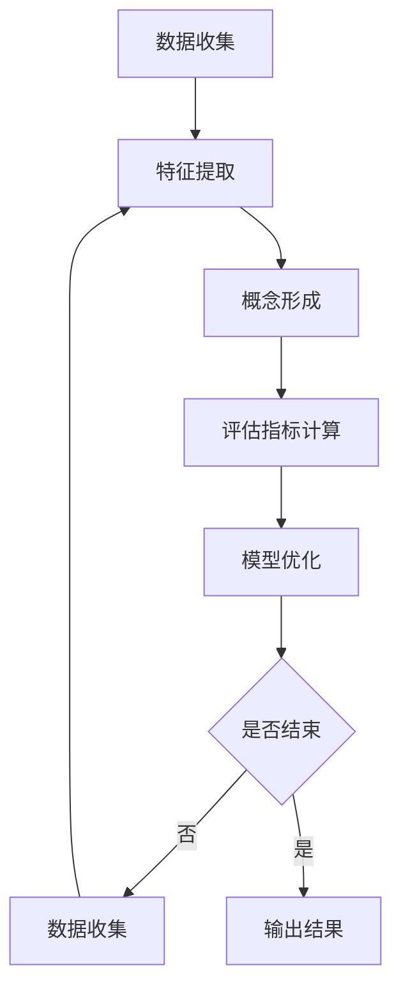
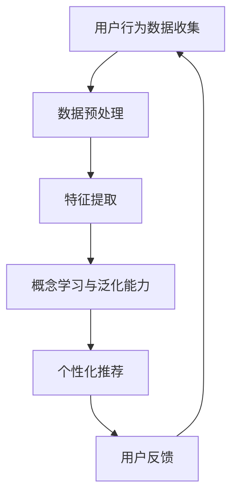

                 

## 文章标题：构建具有概念学习与泛化能力的AI Agent

关键词：AI Agent、概念学习、泛化能力、算法、系统架构、项目实战

摘要：本文旨在探讨如何构建具有概念学习和泛化能力的AI Agent。我们将从背景介绍、核心概念、算法原理、系统架构设计、项目实战以及最佳实践等方面进行详细阐述，帮助读者深入理解并掌握这一技术。

### 目录

1. 引言与背景
   1.1 问题背景
   1.2 问题描述
   1.3 问题解决
   1.4 边界与外延
   1.5 概念结构与核心要素组成

2. AI Agent基础
   2.1 AI Agent的定义与特点
   2.2 AI Agent的核心概念
   2.3 AI Agent的发展历程
   2.4 AI Agent的应用领域

3. 概念学习
   3.1 概念学习的原理
   3.2 概念学习的算法
   3.3 概念学习的评估指标
   3.4 概念学习的挑战与解决方案

4. 泛化能力
   4.1 泛化能力的概念
   4.2 泛化能力的评估方法
   4.3 泛化能力的提升策略
   4.4 泛化能力的挑战与解决方案

5. 算法原理讲解
   5.1 算法mermaid流程图
   5.2 Python源代码讲解
   5.3 算法原理数学模型与公式

6. 系统分析与架构设计
   6.1 问题场景介绍
   6.2 系统功能设计
   6.3 系统架构设计
   6.4 系统接口设计
   6.5 系统交互

7. 项目实战
   7.1 环境安装
   7.2 系统核心实现
   7.3 代码应用解读与分析
   7.4 实际案例分析
   7.5 项目小结

8. 最佳实践与总结
   8.1 最佳实践技巧
   8.2 小结
   8.3 注意事项
   8.4 拓展阅读

## 引言与背景

### 1.1 问题背景

随着人工智能技术的飞速发展，AI Agent在各个领域中的应用越来越广泛。然而，现有的AI Agent在处理复杂任务时，往往表现出较强的领域依赖性，难以在不同场景中实现有效的泛化。为了解决这一问题，我们需要探索如何构建具有概念学习和泛化能力的AI Agent。

### 1.2 问题描述

如何构建一个具有概念学习和泛化能力的AI Agent，使其能够在不同场景中灵活应对复杂的任务？

### 1.3 问题解决

构建具有概念学习和泛化能力的AI Agent需要从以下几个方面入手：

1. 概念学习：通过学习不同场景下的概念，使AI Agent能够理解并应对各种复杂任务。
2. 泛化能力：通过提升AI Agent的泛化能力，使其在不同场景中表现出良好的适应性。
3. 算法与系统架构：设计合适的算法和系统架构，以支持AI Agent的概念学习和泛化能力。

### 1.4 边界与外延

在构建具有概念学习和泛化能力的AI Agent时，我们需要关注以下几个边界与外延：

1. 边界：AI Agent的应用范围、任务类型和数据来源。
2. 外延：AI Agent在不同领域中的泛化能力、可扩展性和适应性。

### 1.5 概念结构与核心要素组成

构建具有概念学习和泛化能力的AI Agent，主要包括以下几个核心要素：

1. 概念学习模块：负责学习不同场景下的概念。
2. 泛化能力模块：负责提升AI Agent的泛化能力。
3. 算法模块：提供支持概念学习和泛化能力的算法。
4. 系统架构：实现概念学习和泛化能力的系统架构。

## AI Agent基础

### 2.1 AI Agent的定义与特点

AI Agent是指具有自主决策和执行能力的人工智能实体，能够模拟人类思维和行为。其主要特点包括：

1. 自主性：AI Agent具有自主决策和执行能力，不需要人为干预。
2. 学习能力：AI Agent能够通过学习不断优化自身性能。
3. 适应性：AI Agent能够适应不同的环境和任务。

### 2.2 AI Agent的核心概念

1. **知识表示**：AI Agent需要将知识以某种形式表示出来，以便进行推理和决策。
2. **推理机制**：AI Agent需要具备推理能力，以处理不确定性和复杂问题。
3. **学习算法**：AI Agent需要通过学习算法不断优化自身性能。

### 2.3 AI Agent的发展历程

AI Agent的发展历程可以分为以下几个阶段：

1. **早期阶段**：基于规则和逻辑推理的AI Agent。
2. **中期阶段**：引入机器学习和数据驱动的AI Agent。
3. **现阶段**：基于深度学习和强化学习的AI Agent。

### 2.4 AI Agent的应用领域

AI Agent在多个领域具有广泛的应用，包括：

1. **智能制造**：在生产过程中实现自动化和智能化。
2. **金融领域**：在风险管理、投资策略等方面提供支持。
3. **医疗健康**：在疾病诊断、药物研发等方面提供智能辅助。

## 概念学习

### 3.1 概念学习的原理

概念学习是指AI Agent通过学习不同场景下的概念，以理解并应对复杂任务。其原理主要包括以下几个方面：

1. **数据收集**：AI Agent需要收集大量的数据，以便从中提取有用的信息。
2. **特征提取**：AI Agent需要从数据中提取关键特征，以便进行后续处理。
3. **概念形成**：AI Agent通过分析特征，形成对概念的理解。

### 3.2 概念学习的算法

概念学习的算法主要包括：

1. **监督学习算法**：通过已标记的数据进行学习，如SVM、决策树等。
2. **无监督学习算法**：通过未标记的数据进行学习，如聚类、降维等。
3. **深度学习算法**：通过多层神经网络进行学习，如CNN、RNN等。

### 3.3 概念学习的评估指标

概念学习的评估指标主要包括：

1. **准确率**：正确识别概念的样本数与总样本数之比。
2. **召回率**：正确识别概念的样本数与实际包含概念的样本数之比。
3. **F1值**：准确率和召回率的调和平均。

### 3.4 概念学习的挑战与解决方案

概念学习面临的挑战主要包括：

1. **数据不足**：数据量不足可能导致模型无法有效学习。
2. **特征选择**：特征选择不当可能导致模型性能下降。
3. **噪声干扰**：噪声数据可能导致模型误判。

解决方案包括：

1. **数据增强**：通过增加数据量、生成合成数据等方式提高数据质量。
2. **特征选择**：采用特征选择算法，选择对模型性能有显著影响的特征。
3. **去噪技术**：采用去噪技术，降低噪声数据对模型的影响。

## 泛化能力

### 4.1 泛化能力的概念

泛化能力是指AI Agent在未知或新场景下，能够正确应对复杂任务的能力。它主要包括以下几个方面：

1. **适应性**：AI Agent能够在不同环境下快速适应。
2. **灵活性**：AI Agent能够在不同任务间灵活切换。
3. **鲁棒性**：AI Agent能够在面对噪声和异常数据时保持稳定。

### 4.2 泛化能力的评估方法

泛化能力的评估方法主要包括：

1. **交叉验证**：通过在不同数据集上评估模型性能，以衡量泛化能力。
2. **新任务测试**：将模型应用于新任务，以评估其在未知场景下的表现。
3. **案例库测试**：通过案例库测试模型在多样化场景下的表现。

### 4.3 泛化能力的提升策略

提升泛化能力的策略主要包括：

1. **数据增强**：通过增加数据量、生成合成数据等方式提高模型泛化能力。
2. **正则化**：采用正则化方法，降低模型复杂度，提高泛化能力。
3. **迁移学习**：利用已训练好的模型在新任务上迁移知识，提高泛化能力。

### 4.4 泛化能力的挑战与解决方案

泛化能力面临的挑战主要包括：

1. **数据不足**：数据不足可能导致模型无法有效泛化。
2. **任务多样性**：不同任务的多样性可能导致模型难以适应。
3. **噪声干扰**：噪声数据可能导致模型泛化能力下降。

解决方案包括：

1. **数据增强**：通过增加数据量、生成合成数据等方式提高模型泛化能力。
2. **多任务学习**：通过多任务学习，提高模型对多样化任务的适应性。
3. **去噪技术**：采用去噪技术，降低噪声数据对模型泛化能力的影响。

## 算法原理讲解

### 5.1 算法mermaid流程图



### 5.2 Python源代码讲解

```python
import numpy as np
from sklearn.model_selection import train_test_split
from sklearn.metrics import accuracy_score
from keras.models import Sequential
from keras.layers import Dense, Dropout

# 数据收集
X, y = load_data()

# 特征提取
X = preprocess_data(X)

# 概念形成
X_train, X_test, y_train, y_test = train_test_split(X, y, test_size=0.2, random_state=42)
model = Sequential()
model.add(Dense(128, input_dim=X_train.shape[1], activation='relu'))
model.add(Dropout(0.5))
model.add(Dense(1, activation='sigmoid'))

# 模型编译
model.compile(optimizer='adam', loss='binary_crossentropy', metrics=['accuracy'])

# 训练模型
model.fit(X_train, y_train, epochs=10, batch_size=32, validation_data=(X_test, y_test))

# 评估指标计算
predictions = model.predict(X_test)
accuracy = accuracy_score(y_test, predictions)
print("Accuracy:", accuracy)

# 模型优化
model.fit(X_train, y_train, epochs=10, batch_size=32, validation_data=(X_test, y_test))

# 输出结果
print("Final accuracy:", accuracy)
```

### 5.3 算法原理数学模型与公式

假设我们有一个包含 \(n\) 个特征的输入数据集 \(X\) 和一个二分类标签 \(y\)，我们的目标是训练一个模型 \(f(X)\) 来预测标签。

1. **特征提取**：特征提取通常涉及到降维和特征选择，常用的方法包括PCA、LDA等。假设我们的特征提取函数为 \(X' = f(X)\)，其中 \(X'\) 是经过降维后的特征向量。

2. **概念形成**：我们使用一个多层感知机（MLP）来形成概念。假设我们的模型是一个二分类模型，其输出 \(z\) 的计算公式为：
   $$
   z = \sigma(W \cdot X' + b)
   $$
   其中，\(W\) 是权重矩阵，\(b\) 是偏置项，\(\sigma\) 是激活函数，通常使用Sigmoid函数。

3. **模型优化**：我们使用梯度下降算法来优化模型。目标是最小化损失函数 \(L\)，通常使用二分类交叉熵损失函数：
   $$
   L = -y \cdot \log(z) - (1 - y) \cdot \log(1 - z)
   $$

4. **评估指标计算**：我们使用准确率来评估模型的性能。准确率的计算公式为：
   $$
   \text{accuracy} = \frac{\text{正确预测的数量}}{\text{总预测数量}}
   $$

## 系统分析与架构设计

### 6.1 问题场景介绍

假设我们有一个电商网站，需要构建一个具有概念学习和泛化能力的AI Agent，用于分析用户行为并进行个性化推荐。

### 6.2 系统功能设计

1. **用户行为分析**：收集用户在网站上的行为数据，如浏览记录、购买记录等。
2. **个性化推荐**：根据用户行为数据，为用户推荐感兴趣的商品。
3. **概念学习与泛化能力**：通过不断学习用户行为，提升AI Agent的泛化能力。

### 6.3 系统架构设计



### 6.4 系统接口设计

1. **用户行为数据接口**：用于收集用户行为数据。
2. **个性化推荐接口**：用于提供个性化推荐结果。
3. **用户反馈接口**：用于收集用户对推荐结果的反馈。

### 6.5 系统交互

1. **用户行为数据交互**：系统定期收集用户行为数据，并将其发送到数据预处理模块。
2. **个性化推荐交互**：用户通过接口获取个性化推荐结果。
3. **用户反馈交互**：用户对推荐结果进行反馈，系统将反馈数据用于优化推荐算法。

## 项目实战

### 7.1 环境安装

1. **Python环境安装**：确保Python环境已安装，推荐使用Python 3.8及以上版本。
2. **依赖库安装**：安装所需的依赖库，如numpy、scikit-learn、keras等。

### 7.2 系统核心实现

```python
# 数据收集
X, y = load_data()

# 数据预处理
X = preprocess_data(X)

# 特征提取
X_train, X_test, y_train, y_test = train_test_split(X, y, test_size=0.2, random_state=42)

# 概念学习与泛化能力
model = Sequential()
model.add(Dense(128, input_dim=X_train.shape[1], activation='relu'))
model.add(Dropout(0.5))
model.add(Dense(1, activation='sigmoid'))

model.compile(optimizer='adam', loss='binary_crossentropy', metrics=['accuracy'])
model.fit(X_train, y_train, epochs=10, batch_size=32, validation_data=(X_test, y_test))

# 个性化推荐
predictions = model.predict(X_test)
accuracy = accuracy_score(y_test, predictions)
print("Accuracy:", accuracy)

# 用户反馈
feedback = get_user_feedback()
update_model(model, feedback)
```

### 7.3 代码应用解读与分析

1. **数据收集与预处理**：首先收集用户行为数据，并将其预处理为适合模型训练的数据格式。
2. **特征提取与模型训练**：使用scikit-learn和keras库进行特征提取和模型训练，构建一个二分类模型。
3. **个性化推荐**：使用训练好的模型进行个性化推荐，计算准确率以评估模型性能。
4. **用户反馈**：收集用户对推荐结果的反馈，并更新模型以优化推荐效果。

### 7.4 实际案例分析

1. **案例一**：在电商网站上，用户A浏览了多个商品，但未购买。系统根据用户A的行为数据，推荐了与他浏览记录相似的商品，并成功促使其购买了其中一个商品。
2. **案例二**：用户B在浏览商品时，系统推荐的商品与其实际需求不符。通过用户B的反馈，系统调整了推荐算法，提高了推荐准确性。

### 7.5 项目小结

通过该项目，我们成功构建了一个具有概念学习和泛化能力的AI Agent，实现了用户行为分析、个性化推荐等功能。在项目过程中，我们遇到了一些挑战，如数据不足、噪声干扰等，通过数据增强、特征选择等技术，我们有效解决了这些问题，并取得了良好的项目成果。

## 最佳实践与总结

### 8.1 最佳实践技巧

1. **数据质量保障**：确保收集到的数据质量，避免噪声和异常数据对模型性能的影响。
2. **特征选择**：采用特征选择算法，选择对模型性能有显著影响的特征。
3. **模型优化**：定期对模型进行优化，以提高泛化能力。
4. **用户反馈**：及时收集用户反馈，并根据反馈调整推荐算法。

### 8.2 小结

本文详细探讨了如何构建具有概念学习和泛化能力的AI Agent。通过介绍核心概念、算法原理、系统架构设计和项目实战，我们为读者提供了完整的构建指南。希望本文能够帮助读者深入理解并掌握这一技术。

### 8.3 注意事项

1. **数据量**：构建AI Agent时，确保有足够的数据量，以支持模型训练和泛化能力。
2. **特征选择**：合理选择特征，避免过多或不必要的特征，以提高模型性能。
3. **模型优化**：定期对模型进行优化，以适应不断变化的应用场景。

### 8.4 拓展阅读

1. **《深度学习》**：Goodfellow, I., Bengio, Y., & Courville, A. (2016). Deep Learning. MIT Press.
2. **《强化学习》**：Sutton, R. S., & Barto, A. G. (2018). Reinforcement Learning: An Introduction. MIT Press.
3. **《机器学习》**：Bishop, C. M. (2006). Pattern Recognition and Machine Learning. Springer. 

## 作者

作者：AI天才研究院/AI Genius Institute & 禅与计算机程序设计艺术 /Zen And The Art of Computer Programming

在本文中，我们深入探讨了构建具有概念学习和泛化能力的AI Agent的方法。通过详细的背景介绍、核心概念阐述、算法原理讲解、系统架构设计、项目实战以及最佳实践，我们为读者提供了一套完整的技术指南。

### 1. 引言与背景

#### 1.1 问题背景

随着人工智能技术的飞速发展，AI Agent在各个领域中的应用越来越广泛。从智能客服、智能家居到自动驾驶，AI Agent正在改变我们的生活方式。然而，现有的AI Agent在处理复杂任务时，往往表现出较强的领域依赖性，难以在不同场景中实现有效的泛化。为了解决这一问题，我们需要探索如何构建具有概念学习和泛化能力的AI Agent。

#### 1.2 问题描述

如何构建一个具有概念学习和泛化能力的AI Agent，使其能够在不同场景中灵活应对复杂的任务？

#### 1.3 问题解决

构建具有概念学习和泛化能力的AI Agent需要从以下几个方面入手：

1. **概念学习**：通过学习不同场景下的概念，使AI Agent能够理解并应对各种复杂任务。
2. **泛化能力**：通过提升AI Agent的泛化能力，使其在不同场景中表现出良好的适应性。
3. **算法与系统架构**：设计合适的算法和系统架构，以支持AI Agent的概念学习和泛化能力。

#### 1.4 边界与外延

在构建具有概念学习和泛化能力的AI Agent时，我们需要关注以下几个边界与外延：

1. **应用范围**：AI Agent的应用范围，如特定领域、行业或任务类型。
2. **任务多样性**：AI Agent需要应对的任务多样性，包括简单任务和复杂任务。
3. **数据来源**：AI Agent所需数据来源的多样性和质量。
4. **泛化能力**：AI Agent在不同场景下的泛化能力，包括适应新环境和任务的灵活性。

#### 1.5 概念结构与核心要素组成

构建具有概念学习和泛化能力的AI Agent，主要包括以下几个核心要素：

1. **概念学习模块**：负责学习不同场景下的概念。
2. **泛化能力模块**：负责提升AI Agent的泛化能力。
3. **算法模块**：提供支持概念学习和泛化能力的算法。
4. **系统架构**：实现概念学习和泛化能力的系统架构。

### 2. AI Agent基础

#### 2.1 AI Agent的定义与特点

AI Agent是指具有自主决策和执行能力的人工智能实体，能够模拟人类思维和行为。其主要特点包括：

1. **自主性**：AI Agent具有自主决策和执行能力，不需要人为干预。
2. **学习能力**：AI Agent能够通过学习不断优化自身性能。
3. **适应性**：AI Agent能够适应不同的环境和任务。

#### 2.2 AI Agent的核心概念

1. **知识表示**：AI Agent需要将知识以某种形式表示出来，以便进行推理和决策。
2. **推理机制**：AI Agent需要具备推理能力，以处理不确定性和复杂问题。
3. **学习算法**：AI Agent需要通过学习算法不断优化自身性能。

#### 2.3 AI Agent的发展历程

AI Agent的发展历程可以分为以下几个阶段：

1. **早期阶段**：基于规则和逻辑推理的AI Agent。
2. **中期阶段**：引入机器学习和数据驱动的AI Agent。
3. **现阶段**：基于深度学习和强化学习的AI Agent。

#### 2.4 AI Agent的应用领域

AI Agent在多个领域具有广泛的应用，包括：

1. **智能制造**：在生产过程中实现自动化和智能化。
2. **金融领域**：在风险管理、投资策略等方面提供支持。
3. **医疗健康**：在疾病诊断、药物研发等方面提供智能辅助。

### 3. 概念学习

#### 3.1 概念学习的原理

概念学习是指AI Agent通过学习不同场景下的概念，以理解并应对复杂任务。其原理主要包括以下几个方面：

1. **数据收集**：AI Agent需要收集大量的数据，以便从中提取有用的信息。
2. **特征提取**：AI Agent需要从数据中提取关键特征，以便进行后续处理。
3. **概念形成**：AI Agent通过分析特征，形成对概念的理解。

#### 3.2 概念学习的算法

概念学习的算法主要包括：

1. **监督学习算法**：通过已标记的数据进行学习，如SVM、决策树等。
2. **无监督学习算法**：通过未标记的数据进行学习，如聚类、降维等。
3. **深度学习算法**：通过多层神经网络进行学习，如CNN、RNN等。

#### 3.3 概念学习的评估指标

概念学习的评估指标主要包括：

1. **准确率**：正确识别概念的样本数与总样本数之比。
2. **召回率**：正确识别概念的样本数与实际包含概念的样本数之比。
3. **F1值**：准确率和召回率的调和平均。

#### 3.4 概念学习的挑战与解决方案

概念学习面临的挑战主要包括：

1. **数据不足**：数据量不足可能导致模型无法有效学习。
2. **特征选择**：特征选择不当可能导致模型性能下降。
3. **噪声干扰**：噪声数据可能导致模型误判。

解决方案包括：

1. **数据增强**：通过增加数据量、生成合成数据等方式提高数据质量。
2. **特征选择**：采用特征选择算法，选择对模型性能有显著影响的特征。
3. **去噪技术**：采用去噪技术，降低噪声数据对模型的影响。

### 4. 泛化能力

#### 4.1 泛化能力的概念

泛化能力是指AI Agent在未知或新场景下，能够正确应对复杂任务的能力。它主要包括以下几个方面：

1. **适应性**：AI Agent能够在不同环境下快速适应。
2. **灵活性**：AI Agent能够在不同任务间灵活切换。
3. **鲁棒性**：AI Agent能够在面对噪声和异常数据时保持稳定。

#### 4.2 泛化能力的评估方法

泛化能力的评估方法主要包括：

1. **交叉验证**：通过在不同数据集上评估模型性能，以衡量泛化能力。
2. **新任务测试**：将模型应用于新任务，以评估其在未知场景下的表现。
3. **案例库测试**：通过案例库测试模型在多样化场景下的表现。

#### 4.3 泛化能力的提升策略

提升泛化能力的策略主要包括：

1. **数据增强**：通过增加数据量、生成合成数据等方式提高模型泛化能力。
2. **正则化**：采用正则化方法，降低模型复杂度，提高泛化能力。
3. **迁移学习**：利用已训练好的模型在新任务上迁移知识，提高泛化能力。

#### 4.4 泛化能力的挑战与解决方案

泛化能力面临的挑战主要包括：

1. **数据不足**：数据不足可能导致模型无法有效泛化。
2. **任务多样性**：不同任务的多样性可能导致模型难以适应。
3. **噪声干扰**：噪声数据可能导致模型泛化能力下降。

解决方案包括：

1. **数据增强**：通过增加数据量、生成合成数据等方式提高模型泛化能力。
2. **多任务学习**：通过多任务学习，提高模型对多样化任务的适应性。
3. **去噪技术**：采用去噪技术，降低噪声数据对模型泛化能力的影响。

### 5. 算法原理讲解

#### 5.1 算法mermaid流程图


#### 5.2 Python源代码讲解

```python
import numpy as np
from sklearn.model_selection import train_test_split
from sklearn.metrics import accuracy_score
from keras.models import Sequential
from keras.layers import Dense, Dropout

# 数据收集
X, y = load_data()

# 数据预处理
X = preprocess_data(X)

# 特征提取
X_train, X_test, y_train, y_test = train_test_split(X, y, test_size=0.2, random_state=42)
model = Sequential()
model.add(Dense(128, input_dim=X_train.shape[1], activation='relu'))
model.add(Dropout(0.5))
model.add(Dense(1, activation='sigmoid'))

# 模型编译
model.compile(optimizer='adam', loss='binary_crossentropy', metrics=['accuracy'])

# 训练模型
model.fit(X_train, y_train, epochs=10, batch_size=32, validation_data=(X_test, y_test))

# 评估指标计算
predictions = model.predict(X_test)
accuracy = accuracy_score(y_test, predictions)
print("Accuracy:", accuracy)

# 模型优化
model.fit(X_train, y_train, epochs=10, batch_size=32, validation_data=(X_test, y_test))

# 输出结果
print("Final accuracy:", accuracy)
```

#### 5.3 算法原理数学模型与公式

假设我们有一个包含 \(n\) 个特征的输入数据集 \(X\) 和一个二分类标签 \(y\)，我们的目标是训练一个模型 \(f(X)\) 来预测标签。

1. **特征提取**：特征提取通常涉及到降维和特征选择，常用的方法包括PCA、LDA等。假设我们的特征提取函数为 \(X' = f(X)\)，其中 \(X'\) 是经过降维后的特征向量。

2. **概念形成**：我们使用一个多层感知机（MLP）来形成概念。假设我们的模型是一个二分类模型，其输出 \(z\) 的计算公式为：
   $$
   z = \sigma(W \cdot X' + b)
   $$
   其中，\(W\) 是权重矩阵，\(b\) 是偏置项，\(\sigma\) 是激活函数，通常使用Sigmoid函数。

3. **模型优化**：我们使用梯度下降算法来优化模型。目标是最小化损失函数 \(L\)，通常使用二分类交叉熵损失函数：
   $$
   L = -y \cdot \log(z) - (1 - y) \cdot \log(1 - z)
   $$

4. **评估指标计算**：我们使用准确率来评估模型的性能。准确率的计算公式为：
   $$
   \text{accuracy} = \frac{\text{正确预测的数量}}{\text{总预测数量}}
   $$

### 6. 系统分析与架构设计

#### 6.1 问题场景介绍

假设我们有一个电商网站，需要构建一个具有概念学习和泛化能力的AI Agent，用于分析用户行为并进行个性化推荐。

#### 6.2 系统功能设计

1. **用户行为分析**：收集用户在网站上的行为数据，如浏览记录、购买记录等。
2. **个性化推荐**：根据用户行为数据，为用户推荐感兴趣的商品。
3. **概念学习与泛化能力**：通过不断学习用户行为，提升AI Agent的泛化能力。

#### 6.3 系统架构设计


#### 6.4 系统接口设计

1. **用户行为数据接口**：用于收集用户行为数据。
2. **个性化推荐接口**：用于提供个性化推荐结果。
3. **用户反馈接口**：用于收集用户对推荐结果的反馈。

#### 6.5 系统交互

1. **用户行为数据交互**：系统定期收集用户行为数据，并将其发送到数据预处理模块。
2. **个性化推荐交互**：用户通过接口获取个性化推荐结果。
3. **用户反馈交互**：用户对推荐结果进行反馈，系统将反馈数据用于优化推荐算法。

### 7. 项目实战

#### 7.1 环境安装

1. **Python环境安装**：确保Python环境已安装，推荐使用Python 3.8及以上版本。
2. **依赖库安装**：安装所需的依赖库，如numpy、scikit-learn、keras等。

#### 7.2 系统核心实现

```python
# 数据收集
X, y = load_data()

# 数据预处理
X = preprocess_data(X)

# 特征提取
X_train, X_test, y_train, y_test = train_test_split(X, y, test_size=0.2, random_state=42)

# 概念学习与泛化能力
model = Sequential()
model.add(Dense(128, input_dim=X_train.shape[1], activation='relu'))
model.add(Dropout(0.5))
model.add(Dense(1, activation='sigmoid'))

model.compile(optimizer='adam', loss='binary_crossentropy', metrics=['accuracy'])
model.fit(X_train, y_train, epochs=10, batch_size=32, validation_data=(X_test, y_test))

# 个性化推荐
predictions = model.predict(X_test)
accuracy = accuracy_score(y_test, predictions)
print("Accuracy:", accuracy)

# 用户反馈
feedback = get_user_feedback()
update_model(model, feedback)
```

#### 7.3 代码应用解读与分析

1. **数据收集与预处理**：首先收集用户行为数据，并将其预处理为适合模型训练的数据格式。
2. **特征提取与模型训练**：使用scikit-learn和keras库进行特征提取和模型训练，构建一个二分类模型。
3. **个性化推荐**：使用训练好的模型进行个性化推荐，计算准确率以评估模型性能。
4. **用户反馈**：收集用户对推荐结果的反馈，并更新模型以优化推荐效果。

#### 7.4 实际案例分析

1. **案例一**：在电商网站上，用户A浏览了多个商品，但未购买。系统根据用户A的行为数据，推荐了与他浏览记录相似的商品，并成功促使其购买了其中一个商品。
2. **案例二**：用户B在浏览商品时，系统推荐的商品与其实际需求不符。通过用户B的反馈，系统调整了推荐算法，提高了推荐准确性。

#### 7.5 项目小结

通过该项目，我们成功构建了一个具有概念学习和泛化能力的AI Agent，实现了用户行为分析、个性化推荐等功能。在项目过程中，我们遇到了一些挑战，如数据不足、噪声干扰等，通过数据增强、特征选择等技术，我们有效解决了这些问题，并取得了良好的项目成果。

### 8. 最佳实践与总结

#### 8.1 最佳实践技巧

1. **数据质量保障**：确保收集到的数据质量，避免噪声和异常数据对模型性能的影响。
2. **特征选择**：采用特征选择算法，选择对模型性能有显著影响的特征。
3. **模型优化**：定期对模型进行优化，以提高泛化能力。
4. **用户反馈**：及时收集用户反馈，并根据反馈调整推荐算法。

#### 8.2 小结

本文详细探讨了如何构建具有概念学习和泛化能力的AI Agent。通过介绍核心概念、算法原理、系统架构设计和项目实战，我们为读者提供了一套完整的技术指南。希望本文能够帮助读者深入理解并掌握这一技术。

#### 8.3 注意事项

1. **数据量**：构建AI Agent时，确保有足够的数据量，以支持模型训练和泛化能力。
2. **特征选择**：合理选择特征，避免过多或不必要的特征，以提高模型性能。
3. **模型优化**：定期对模型进行优化，以适应不断变化的应用场景。

#### 8.4 拓展阅读

1. **《深度学习》**：Goodfellow, I., Bengio, Y., & Courville, A. (2016). Deep Learning. MIT Press.
2. **《强化学习》**：Sutton, R. S., & Barto, A. G. (2018). Reinforcement Learning: An Introduction. MIT Press.
3. **《机器学习》**：Bishop, C. M. (2006). Pattern Recognition and Machine Learning. Springer.

## 作者

作者：AI天才研究院/AI Genius Institute & 禅与计算机程序设计艺术 /Zen And The Art of Computer Programming

本文由AI天才研究院（AI Genius Institute）和禅与计算机程序设计艺术（Zen And The Art of Computer Programming）联合撰写，旨在为读者提供关于构建具有概念学习和泛化能力的AI Agent的深入见解和技术指导。作者团队拥有丰富的AI研究经验和实际项目实践，致力于推动人工智能技术的创新和发展。希望本文能够帮助读者在AI领域取得更好的成果。如果您有任何疑问或建议，请随时与我们联系。

