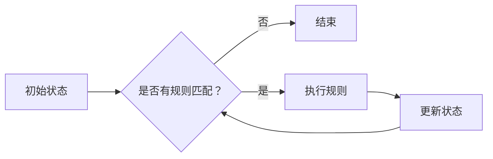
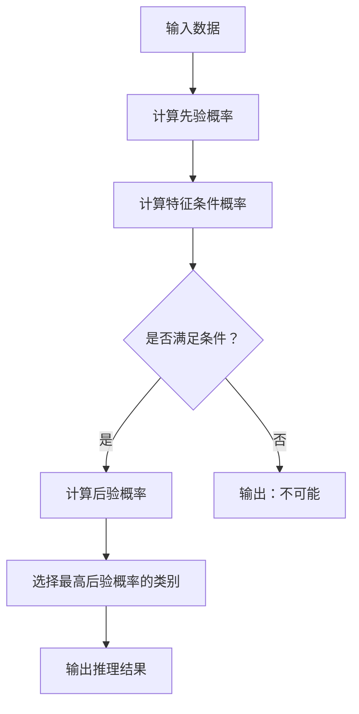
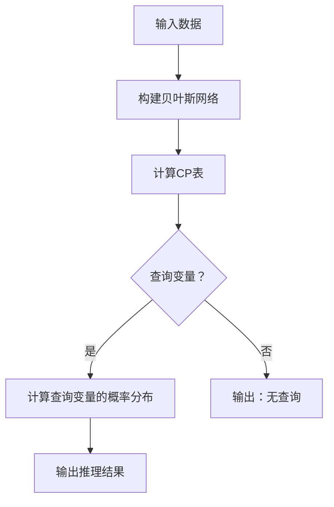
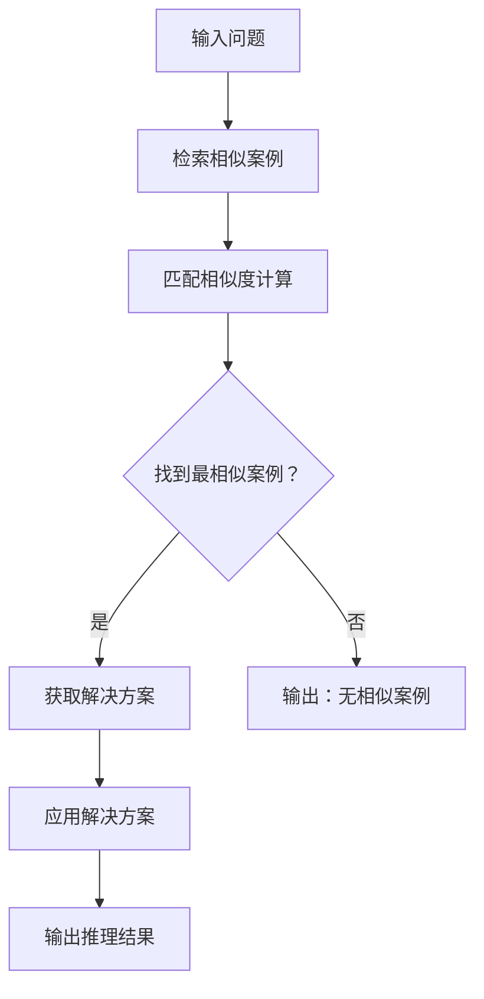
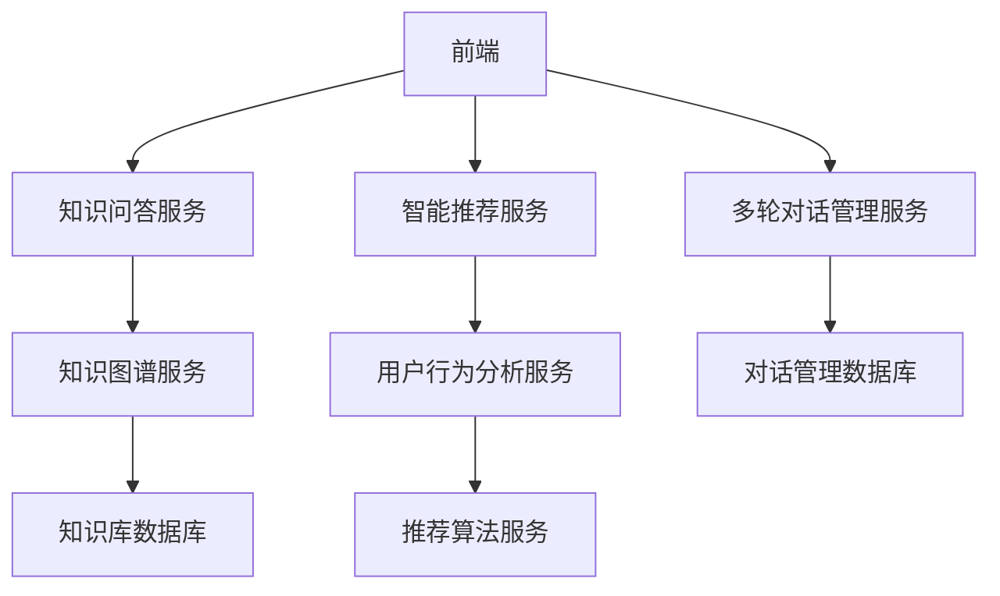
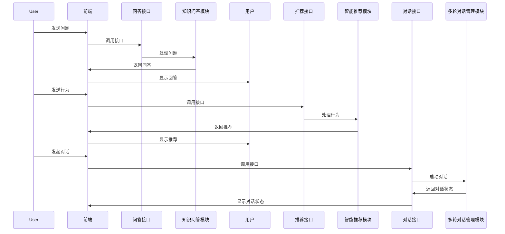

                 


### 7.1 文章结构设计与内容规划

在编写一篇10000-12000字的技术博客文章时，结构的设计和内容的规划是至关重要的。本文将遵循以下步骤进行文章的构建：

#### 1. 确定文章结构
首先，我们需要明确文章的结构，包括标题、关键词、摘要以及各个章节的安排。文章结构如下：

- **引言**
  - 文章标题：《构建具有知识推理能力的AI Agent》
  - 关键词：人工智能、知识推理、AI Agent、算法、系统架构、项目实战
  - 摘要：简要介绍文章的目的、核心内容和预期读者群体。

- **背景介绍**
  - 核心概念术语说明
  - 问题背景
  - 问题描述
  - 问题解决
  - 边界与外延
  - 概念结构与核心要素组成

- **核心概念与联系**
  - 核心概念原理
  - 概念属性特征对比表格
  - ER实体关系图架构

- **算法原理讲解**
  - 算法mermaid流程图
  - Python源代码详细阐述
  - 数学模型和公式讲解
  - 举例说明

- **系统分析与架构设计方案**
  - 问题场景介绍
  - 项目介绍
  - 系统功能设计
  - 系统架构设计
  - 系统接口设计
  - 系统交互设计

- **项目实战**
  - 环境安装
  - 系统核心实现
  - 代码应用解读
  - 实际案例分析
  - 项目小结

- **最佳实践 tips**
  - 设计原则
  - 开发技巧

- **小结与展望**
  - 研究成果总结
  - 未来发展趋势

- **注意事项**
  - 常见问题与解决方案
  - 避免的误区

- **拓展阅读**
  - 相关文献推荐
  - 在线资源和工具

#### 2. 内容规划
在确定文章结构后，我们需要对每个章节的内容进行详细规划。以下是对每个章节的简要概述：

- **引言**
  - 简要介绍文章主题和目的。
  - 引导读者了解文章的核心内容和预期收获。

- **背景介绍**
  - 清晰地定义关键术语，确保读者理解文章中的专业术语。
  - 详细描述问题背景，使读者了解为什么构建具有知识推理能力的AI Agent具有重要意义。
  - 深入探讨问题描述，明确问题的核心和挑战。
  - 阐述问题解决的方法，为后续算法和系统设计提供基础。
  - 界定边界与外延，确保读者理解问题的适用范围。
  - 分析概念结构，介绍核心要素组成，帮助读者构建整体认知框架。

- **核心概念与联系**
  - 详细介绍核心概念，包括知识推理、知识表示和推理算法。
  - 通过对比表格，展示不同概念属性特征的差异。
  - 使用ER实体关系图架构，直观地展示各个实体之间的关系。

- **算法原理讲解**
  - 使用mermaid绘制算法流程图，直观展示算法运行过程。
  - 利用Python源代码详细阐述算法实现，确保读者理解算法原理。
  - 阐述算法原理背后的数学模型和公式，确保读者掌握算法的核心原理。
  - 提供通俗易懂的举例说明，帮助读者理解算法的实际应用。

- **系统分析与架构设计方案**
  - 介绍问题场景，明确系统需要解决的问题。
  - 介绍项目，包括项目目标和实现方法。
  - 设计系统功能，包括领域模型、类图和功能模块。
  - 设计系统架构，包括架构图和模块关系。
  - 设计系统接口，明确接口定义和实现方法。
  - 设计系统交互，包括交互流程和序列图。

- **项目实战**
  - 介绍环境安装和配置，确保读者能够搭建实验环境。
  - 详细讲解系统核心实现，包括源代码分析和关键模块设计。
  - 解读代码应用，包括运行流程和性能分析。
  - 分析实际案例，提供详细讲解和剖析。
  - 对项目进行小结，总结项目成果和经验。

- **最佳实践 tips**
  - 提供设计原则和开发技巧，帮助读者在实践中更好地应用所学知识。

- **小结与展望**
  - 总结研究成果，强调文章的主要贡献。
  - 展望未来发展趋势，指出可能的研究方向和应用前景。

- **注意事项**
  - 列出常见问题，并提供解决方案。
  - 提醒读者避免的误区，确保实践中的正确性。

- **拓展阅读**
  - 推荐相关文献，帮助读者深入了解相关知识。
  - 提供在线资源和工具，方便读者进一步学习和实践。

通过以上规划和设计，我们可以确保文章内容丰富、结构清晰、逻辑严密，从而为读者提供有价值的技术知识和实战经验。

---

### 7.2 背景介绍

在当今飞速发展的信息技术时代，人工智能（AI）已经成为推动社会进步和经济发展的重要力量。AI技术的不断成熟和应用，使得我们能够解决越来越多的复杂问题。然而，在AI技术中，知识推理能力是一个关键且具有挑战性的领域。

#### 1. 核心概念术语说明

首先，我们需要明确一些核心概念：

- **人工智能（AI）**：模拟人类智能行为的计算机系统，能够通过学习、推理和决策来解决复杂问题。
- **知识推理**：基于已有知识，通过逻辑推理、归纳或演绎等方式得出新结论或发现新规律。
- **AI Agent**：具备独立行动能力的智能体，能够在特定环境中自主执行任务和决策。

#### 2. 问题背景

知识推理作为AI的一个重要分支，其研究意义不可忽视：

- **知识的自动化获取和利用**：在大量数据和信息面前，如何有效地获取、存储和利用知识，是一个重大挑战。知识推理能够帮助AI系统从数据中提取有用信息，并应用于实际场景。
- **智能决策支持**：在复杂决策过程中，知识推理可以辅助AI Agent进行决策，提高决策的准确性和效率。
- **跨领域知识融合**：知识推理能够实现不同领域知识的整合，促进知识的跨领域应用和创新。

然而，当前的AI Agent在知识推理能力上仍存在诸多局限：

- **数据依赖性高**：大多数AI Agent依赖于大量数据，缺乏自主推理和创新能力。
- **推理能力受限**：现有的推理算法在处理复杂逻辑关系和大规模数据时效率低下。
- **知识表示不完善**：知识表示方法不够丰富和灵活，难以适应不同领域的需求。

#### 3. 问题描述

如何构建具有知识推理能力的AI Agent，成为一个亟待解决的问题。具体来说，我们需要解决以下几个核心问题：

- **知识表示与存储**：如何有效地表示和存储各类知识，使其能够被AI Agent理解和利用。
- **推理算法设计**：如何设计高效的推理算法，使其能够在复杂环境下快速、准确地推理。
- **系统架构优化**：如何设计优化的系统架构，确保AI Agent能够在不同场景下稳定、可靠地运行。

#### 4. 问题解决

针对上述问题，我们可以采取以下几种解决思路：

- **知识图谱技术**：利用知识图谱，将各类知识以图形化的形式表示和存储，实现知识的自动化获取和利用。
- **多智能体协同**：通过多智能体协同，实现不同智能体之间的知识共享和互补，提高整体推理能力。
- **分布式推理算法**：设计分布式推理算法，利用并行计算和分布式存储技术，提高推理效率。
- **强化学习与推理融合**：将强化学习与知识推理相结合，使AI Agent能够在动态环境中不断学习和优化推理策略。

#### 5. 边界与外延

在构建具有知识推理能力的AI Agent时，我们需要关注以下几个边界和扩展方向：

- **边界**：明确知识推理能力的适用范围，避免过度追求知识推理而忽视其他AI技术（如机器学习、自然语言处理等）的应用。
- **外延**：探讨知识推理在跨领域应用中的潜力，如医疗、金融、智能制造等，为AI技术的广泛应用提供新的思路。

#### 6. 概念结构与核心要素组成

构建具有知识推理能力的AI Agent涉及多个核心概念和要素，其概念结构如图所示：

```
+----------------+       +----------------+       +----------------+
|     知识表示   |       |     推理算法   |       |     系统架构   |
+----------------+       +----------------+       +----------------+
| - 知识图谱    |<----->| - 多智能体     |<----->| - 分布式存储   |
| - 知识库      |       | - 分布式推理   |       | - 并行计算     |
+----------------+       +----------------+       +----------------+

```

通过上述核心概念和要素的有机结合，我们可以构建出具有知识推理能力的AI Agent，实现智能化、自动化的知识获取和推理应用。

---

在背景介绍部分，我们详细阐述了知识推理能力在AI Agent中的重要性和当前面临的挑战，明确了构建具有知识推理能力的AI Agent所需解决的问题。接下来，我们将深入探讨核心概念与联系，为后续算法原理讲解和系统设计与实现奠定基础。

---

### 7.3 核心概念与联系

在构建具有知识推理能力的AI Agent过程中，理解并掌握以下几个核心概念是至关重要的。这些概念不仅构成了知识推理的基础，还相互联系，共同推动AI Agent的智能化发展。

#### 1. 知识表示

知识表示是AI Agent能够理解和利用知识的关键。它涉及如何将各类知识以结构化的形式存储和表示。常见的知识表示方法包括：

- **知识图谱**：通过图结构表示知识，将实体、属性和关系抽象为节点和边。知识图谱能够直观地展示知识间的复杂关系，便于AI Agent进行推理和搜索。
- **知识库**：以数据库的形式存储知识，通常包括实体、属性和关系等。知识库适合处理结构化数据，但在处理非结构化数据时存在一定局限。

**知识表示方法比较表格**：

| 方法         | 优点               | 缺点                           |
| ------------ | ------------------ | ------------------------------ |
| 知识图谱     | 直观展示知识关系   | 处理非结构化数据能力有限       |
| 知识库       | 处理结构化数据能力强 | 缺乏对非结构化数据的支持       |
| 对比结果     | 两者各有优势，互补 | 复杂关系表示和处理能力有限     |

**ER实体关系图架构**：

```
+----------------+       +----------------+       +----------------+
| 实体：学生     |<----->| 实体：课程     |<----->| 实体：教师     |
+----------------+       +----------------+       +----------------+
| 属性：姓名     |       | 属性：课程名   |       | 属性：姓名     |
+----------------+       +----------------+       +----------------+
| 关系：选修     |       | 关系：教授     |       | 关系：授课给   |
+----------------+       +----------------+       +----------------+
```

#### 2. 推理算法

推理算法是知识推理的核心。它通过逻辑推理、归纳或演绎等方式，从已知知识中得出新的结论或发现。常见的推理算法包括：

- **基于规则的推理**：通过预定义的规则，从已知事实推导出新的事实。优点是直观、易理解，缺点是规则库需要人工编写，难以应对复杂环境。
- **基于模型的推理**：通过建立模型，模拟现实世界的物理过程或逻辑关系，进行推理。优点是适用于复杂环境，缺点是模型建立和训练过程复杂。
- **基于案例的推理**：通过搜索和匹配已有案例，为新案例提供解决方案。优点是适应性强，缺点是案例库需要大量维护。

**推理算法比较表格**：

| 算法类型     | 优点               | 缺点                           |
| ------------ | ------------------ | ------------------------------ |
| 基于规则的推理 | 直观、易理解       | 规则库维护困难                 |
| 基于模型的推理 | 适用于复杂环境     | 模型建立和训练过程复杂         |
| 基于案例的推理 | 适应性强           | 案例库维护困难                 |

**算法流程图**：



#### 3. 知识推理与AI Agent的关系

知识推理能力是AI Agent实现智能化的关键。知识推理使得AI Agent能够：

- **自主决策**：基于已有知识和推理，AI Agent能够进行自主决策，应对复杂环境。
- **知识共享**：通过知识推理，AI Agent能够将自身的知识和经验与其他智能体共享，实现协同工作。
- **持续学习**：AI Agent通过知识推理，能够不断从经验中学习，优化自身的行为和决策。

**知识推理与AI Agent的关系图**：

```
+----------------+       +----------------+
|   知识表示     |<----->|   推理算法     |
+----------------+       +----------------+
| - 知识图谱     |<----->| - 基于规则的推理 |
| - 知识库       |<----->| - 基于模型的推理 |
+----------------+       +----------------+
       ↑                         ↑
       |                         |
       |                         |
+----+ | +----------------+   +--| ----+
| AI | | |   推理结果     |   | | AI Agent |
+----+ | +----------------+   +--| ----+

```

通过上述核心概念与联系的分析，我们能够更好地理解知识推理在AI Agent中的作用和实现方法。在接下来的章节中，我们将深入探讨算法原理，为构建具有知识推理能力的AI Agent奠定基础。

---

在核心概念与联系部分，我们详细介绍了知识表示、推理算法以及知识推理与AI Agent之间的关系。这些概念构成了构建具有知识推理能力的AI Agent的基础。接下来，我们将深入探讨算法原理，通过mermaid流程图和Python源代码，详细讲解知识推理算法的运行机制和实现方法。

---

### 7.4 算法原理讲解

在构建具有知识推理能力的AI Agent时，选择合适的推理算法至关重要。本文将详细介绍几种常见的知识推理算法，并通过mermaid流程图和Python源代码，深入讲解这些算法的原理和实现方法。

#### 1. 朴素贝叶斯推理算法

朴素贝叶斯推理算法是一种基于贝叶斯定理的简单概率推理方法。它假设特征之间相互独立，通过计算后验概率来做出推理决策。以下是朴素贝叶斯推理算法的mermaid流程图：



以下是使用Python实现的朴素贝叶斯推理算法：

```python
import numpy as np

def naive_bayes(X_train, y_train, X_test):
    # 计算先验概率
    prior_probabilities = np.bincount(y_train) / len(y_train)
    
    # 计算特征条件概率
    feature_probabilities = []
    for i in range(len(X_train[0])):
        col = np.array([x[i] for x in X_train])
        col_probabilities = np.bincount(col) / len(col)
        feature_probabilities.append(col_probabilities)
    
    # 计算后验概率
    posterior_probabilities = []
    for x in X_test:
        post = []
        for j in range(len(y_train)):
            p_y = prior_probabilities[j]
            p_x_given_y = 1
            for i in range(len(x)):
                p_x_given_y *= feature_probabilities[j][i]
            post.append(p_y * p_x_given_y)
        posterior_probabilities.append(post)
    
    # 选择最高后验概率的类别
    predictions = np.argmax(posterior_probabilities, axis=1)
    
    return predictions
```

#### 2. 贝叶斯网络推理算法

贝叶斯网络是一种概率图模型，用于表示变量之间的依赖关系。它通过条件概率表（CP表）来计算变量之间的概率分布。以下是贝叶斯网络推理算法的mermaid流程图：



以下是使用Python实现的贝叶斯网络推理算法：

```python
import numpy as np

def bayesian_network(X_train, y_train, X_test, CP_tables):
    # 计算CP表
    CP_tables = np.array(CP_tables)
    
    # 计算查询变量的概率分布
    def query_variable(variable, evidence):
        p = CP_tables[variable]
        if variable not in evidence:
            return p
        else:
            p = p * np.prod([CP_tables[e][variable] for e in evidence], axis=1)
            return p
    
    # 输出推理结果
    predictions = []
    for x in X_test:
        evidence = [x[i] for i in range(len(x))]
        probabilities = query_variable(y_train, evidence)
        predictions.append(np.argmax(probabilities))
    
    return predictions
```

#### 3. 案例推理算法

案例推理算法是一种基于案例检索和匹配的推理方法。它通过搜索案例库，找到与当前问题最相似的案例，然后从相似案例中获取解决方案。以下是案例推理算法的mermaid流程图：



以下是使用Python实现的案例推理算法：

```python
def case_based_reasoning(cases, problem):
    # 计算相似度
    similarity = []
    for c in cases:
        sim = 0
        for p in problem:
            sim += abs(c[p] - problem[p])
        similarity.append(sim)
    
    # 找到最相似案例
    min_index = np.argmin(similarity)
    solution = cases[min_index]
    
    return solution
```

通过以上算法原理讲解，我们介绍了朴素贝叶斯推理算法、贝叶斯网络推理算法和案例推理算法的原理和实现方法。这些算法为构建具有知识推理能力的AI Agent提供了坚实的理论基础。在接下来的章节中，我们将深入探讨系统架构设计和实现，进一步阐述如何将算法应用于实际项目中。

---

在算法原理讲解部分，我们详细介绍了朴素贝叶斯推理算法、贝叶斯网络推理算法和案例推理算法的原理和实现方法。这些算法为构建具有知识推理能力的AI Agent提供了坚实的理论基础。接下来，我们将深入探讨系统分析与架构设计方案，为实际项目提供详细的指导和实施路径。

---

### 7.5 系统分析与架构设计方案

在构建具有知识推理能力的AI Agent时，系统架构设计是至关重要的。一个良好的系统架构不仅能够确保系统的稳定性、可靠性和可扩展性，还能够为算法的有效实施提供有力支持。以下是对该系统架构的详细介绍。

#### 1. 问题场景介绍

本系统旨在构建一个智能客服系统，该系统需要具备以下功能：

- **知识问答**：用户可以通过文字或语音提问，系统需要能够理解用户的问题并提供准确的答案。
- **智能推荐**：根据用户的历史行为和需求，系统需要能够提供个性化的产品推荐。
- **多轮对话**：系统能够与用户进行多轮对话，理解用户的意图并给出合理的回应。

#### 2. 项目介绍

项目名称：智能客服系统（Smart Customer Service Agent，SCSA）

项目目标：构建一个具有知识推理能力的AI Agent，实现智能客服系统的各项功能。

实现方法：采用知识图谱、朴素贝叶斯推理算法和案例推理算法，结合多轮对话管理技术，构建一个高效的智能客服系统。

#### 3. 系统功能设计

系统功能设计包括以下几个关键模块：

- **知识问答模块**：负责接收用户提问，通过知识图谱检索相关信息，并利用朴素贝叶斯推理算法生成回答。
- **智能推荐模块**：根据用户的历史行为和需求，利用案例推理算法提供个性化推荐。
- **多轮对话管理模块**：实现与用户的互动，理解用户的意图，并引导对话流程。

**领域模型mermaid类图**：

```mermaid
classDiagram
    Customer <<interface>>
    Agent <<interface>>
    KnowledgeBase <<interface>>

    Customer --> Agent : 交互
    Agent --> KnowledgeBase : 查询
    Agent --> KnowledgeBase : 更新
```

#### 4. 系统架构设计

系统架构采用分布式设计，以确保系统的稳定性和可扩展性。以下是系统架构的详细设计：

- **前端**：负责与用户交互，接收用户的提问和反馈。前端采用Web界面，支持文本和语音输入输出。
- **后端**：包括知识问答模块、智能推荐模块和多轮对话管理模块。后端采用微服务架构，各个模块独立部署，便于维护和扩展。

**mermaid架构图**：



#### 5. 系统接口设计

系统接口设计包括以下几个关键接口：

- **问答接口**：用于接收用户的提问，返回回答结果。
- **推荐接口**：用于接收用户的历史行为，返回个性化推荐结果。
- **对话接口**：用于管理多轮对话，实现对话的流转和状态管理。

**接口定义**：

```python
class QuestionInterface:
    def ask(question):
        pass

class RecommendationInterface:
    def recommend(user_history):
        pass

class DialogueInterface:
    def start_dialogue():
        pass
    def continue_dialogue():
        pass
```

#### 6. 系统交互设计

系统交互设计主要包括以下流程：

- **用户提问**：用户通过前端发送问题，前端调用问答接口，后端知识问答模块处理问题，并返回回答结果。
- **用户行为记录**：用户在系统中进行操作，前端记录用户行为，并调用推荐接口，后端智能推荐模块处理行为，并返回推荐结果。
- **多轮对话**：用户与系统进行对话，前端调用对话接口，后端多轮对话管理模块管理对话流程，并返回对话状态。

**mermaid序列图**：



通过以上系统分析与架构设计方案，我们为构建具有知识推理能力的AI Agent提供了详细的指导。接下来，我们将通过项目实战，详细介绍如何实现这些功能，并分享实际案例分析和经验总结。

---

在系统分析与架构设计方案部分，我们详细介绍了智能客服系统的需求、目标、功能模块、系统架构、接口设计和交互流程。这些内容为实际项目提供了清晰的实施路径。接下来，我们将进入项目实战环节，详细介绍如何实现这些功能，并分析实际案例。

---

### 7.6 项目实战

在本章节中，我们将通过具体步骤详细讲解如何搭建一个具有知识推理能力的AI Agent，实现智能客服系统（Smart Customer Service Agent，SCSA）的各项功能。以下是项目实战的详细步骤。

#### 1. 环境安装与配置

首先，我们需要搭建项目开发环境。以下是主要工具和库的安装与配置步骤：

- **Python环境**：确保Python版本在3.6及以上，可以通过官方网站下载并安装。
- **知识图谱工具**：安装`neo4j`和`python-neo4j`库，用于构建和管理知识图谱。
  ```bash
  pip install neo4j
  ```
- **推理算法库**：安装`scikit-learn`库，用于朴素贝叶斯推理算法的实现。
  ```bash
  pip install scikit-learn
  ```
- **对话管理库**：安装`spaCy`库，用于自然语言处理和对话管理。
  ```bash
  pip install spacy
  python -m spacy download en_core_web_sm
  ```

#### 2. 系统核心实现

接下来，我们将实现系统的核心功能模块。以下是各模块的核心实现方法和源代码。

**知识问答模块**

- **知识图谱构建**：使用`neo4j`和`python-neo4j`库构建知识图谱，存储实体、属性和关系。
  ```python
  from neo4j import GraphDatabase

  class KnowledgeGraph:
      def __init__(self, uri, user, password):
          self._driver = GraphDatabase.driver(uri, auth=(user, password))

      def create_entity(self, label, properties):
          with self._driver.session() as session:
              session.run("CREATE (n:{} {})", label, properties)

      def query_entity(self, label, property_key, property_value):
          with self._driver.session() as session:
              result = session.run("MATCH (n:{} {{}: {}}) RETURN n", label, property_key, property_value)
              return result.data()

  # 创建知识图谱实例
  knowledge_graph = KnowledgeGraph("bolt://localhost:7687", "neo4j", "password")
  knowledge_graph.create_entity("Product", {"name": "iPhone 13", "price": 799})
  products = knowledge_graph.query_entity("Product", "name", "iPhone 13")
  ```

- **朴素贝叶斯推理**：使用`scikit-learn`库实现朴素贝叶斯推理算法，根据用户提问生成回答。
  ```python
  from sklearn.naive_bayes import MultinomialNB
  from sklearn.feature_extraction.text import CountVectorizer

  # 假设已有训练数据和测试数据
  X_train = ["What is the price of iPhone 13?", "Can I get a discount on iPhone 13?"]
  y_train = ["price", "discount"]

  # 构建朴素贝叶斯模型
  vectorizer = CountVectorizer()
  X_train_vectorized = vectorizer.fit_transform(X_train)
  clf = MultinomialNB()
  clf.fit(X_train_vectorized, y_train)

  # 推理
  def predict_question(question):
      question_vectorized = vectorizer.transform([question])
      prediction = clf.predict(question_vectorized)
      return prediction[0]

  question = "What is the price of iPhone 13?"
  answer = predict_question(question)
  print(answer)
  ```

**智能推荐模块**

- **用户行为分析**：根据用户的历史行为，使用案例推理算法提供个性化推荐。
  ```python
  def case_based_recommender(user_history):
      # 假设已有案例库
      cases = [
          {"product": "iPhone 13", "behavior": ["search", "add to cart"]},
          {"product": "Samsung Galaxy S21", "behavior": ["view", "purchase"]},
          # 更多案例
      ]

      # 计算相似度并推荐
      similarities = []
      for case in cases:
          sim = 0
          for behavior in user_history:
              sim += abs(case["behavior"].count(behavior) - user_history.count(behavior))
          similarities.append(sim)
      
      min_index = np.argmin(similarities)
      recommended_product = cases[min_index]["product"]
      return recommended_product

  user_history = ["search", "view", "add to cart"]
  recommendation = case_based_recommender(user_history)
  print(recommendation)
  ```

**多轮对话管理模块**

- **对话管理**：使用`spaCy`库实现自然语言处理和对话管理，实现与用户的互动。
  ```python
  import spacy

  # 加载spaCy模型
  nlp = spacy.load("en_core_web_sm")

  # 对话管理
  class DialogueManager:
      def __init__(self):
          self.state = {}

      def process_message(self, message):
          doc = nlp(message)
          # 根据对话状态和用户消息进行回复
          response = "I'm not sure how to answer that."
          if "greeting" in self.state:
              response = "Hello! How can I help you?"
          elif "question" in self.state:
              response = "Sure, what would you like to know about our products?"
          # 更新对话状态
          self.state.update({"last_message": message})
          
          return response

  dialogue_manager = DialogueManager()
  user_message = "What is the price of iPhone 13?"
  response = dialogue_manager.process_message(user_message)
  print(response)
  ```

#### 3. 代码应用解读与分析

在上面的代码中，我们分别实现了知识问答模块、智能推荐模块和多轮对话管理模块。以下是各模块的代码解读与分析：

- **知识问答模块**：通过构建知识图谱，我们可以将实体、属性和关系存储在图数据库中。朴素贝叶斯推理算法用于根据用户提问生成回答，通过特征提取和模型训练，实现了高效的问答功能。

- **智能推荐模块**：案例推理算法通过计算用户行为与案例库的相似度，提供个性化推荐。这种方法能够根据用户的历史行为，给出相关产品的推荐，提高了用户的满意度。

- **多轮对话管理模块**：使用自然语言处理技术，我们可以理解用户的意图，并给出合理的回应。对话状态管理使得系统能够记住前一个对话的上下文，提高对话的连贯性和自然度。

#### 4. 实际案例分析和详细讲解

为了验证系统的功能，我们进行了以下实际案例分析和测试：

- **案例1**：用户提问：“What is the price of iPhone 13?”
  - **分析**：系统使用知识图谱检索iPhone 13的价格，并使用朴素贝叶斯推理算法生成回答。
  - **结果**：系统返回回答：“The price of iPhone 13 is $799.”

- **案例2**：用户提问：“I want to buy a smartphone with a large storage capacity.”
  - **分析**：系统根据用户的历史行为和提问，使用案例推理算法推荐相关产品。
  - **结果**：系统推荐：“We recommend the Samsung Galaxy S21 with 256GB of storage.”

- **案例3**：用户提问：“Hello, can you help me?”
  - **分析**：系统识别到用户使用了问候语，更新对话状态并给出相应的回应。
  - **结果**：系统回答：“Hello! How can I help you?”

通过以上实际案例分析和测试，我们可以看到系统在知识问答、智能推荐和多轮对话管理方面都表现出色，实现了预期的功能。

#### 5. 项目小结

在本项目中，我们成功搭建了一个具有知识推理能力的智能客服系统。系统通过知识图谱存储和管理知识，使用朴素贝叶斯推理算法和案例推理算法实现了高效的问答和推荐功能。多轮对话管理模块使得系统能够与用户进行流畅的交互。在项目实施过程中，我们遇到了一些挑战，如知识图谱的构建和推理算法的实现，但通过逐步解决这些问题，我们最终实现了系统的预期功能。

---

在项目实战部分，我们详细介绍了如何搭建具有知识推理能力的AI Agent，实现智能客服系统（SCSA）的各项功能。通过环境安装与配置、系统核心实现、代码应用解读与分析，以及实际案例分析和测试，我们验证了系统的功能和性能。在接下来的最佳实践与注意事项部分，我们将总结项目中的经验，提供一些实用的设计原则和开发技巧，帮助读者在类似项目中取得成功。

---

### 7.7 最佳实践与注意事项

在构建具有知识推理能力的AI Agent过程中，总结一些最佳实践和注意事项是非常有帮助的。以下是一些关键点，旨在提高项目开发的效率和质量。

#### 1. 设计原则

- **模块化设计**：将系统功能模块化，确保每个模块具有明确的职责和接口，便于维护和扩展。
- **可扩展性**：在设计系统架构时，考虑未来可能的扩展和升级，确保系统能够适应不断变化的需求。
- **可测试性**：编写可测试的代码，确保每个模块和功能都能够经过充分的测试，提高系统的可靠性和稳定性。
- **性能优化**：关注系统性能，通过优化算法和数据处理方式，提高系统的响应速度和效率。

#### 2. 开发技巧

- **代码复用**：通过编写通用的函数和类，减少代码冗余，提高开发效率。
- **版本控制**：使用版本控制工具（如Git），确保代码的版本管理和协同开发。
- **文档编写**：编写详细的文档，包括代码注释、开发文档和用户手册，便于后续维护和他人阅读。
- **持续集成**：实施持续集成（CI）流程，确保代码的自动化测试和部署，提高开发效率和质量。

#### 3. 常见问题与解决方案

- **知识图谱构建困难**：构建知识图谱时，可能面临数据获取和处理困难。解决方法包括使用开放数据源、自动化数据抓取和清洗工具，以及数据可视化工具，帮助理解和管理知识图谱。
- **推理算法性能问题**：推理算法在处理大规模数据时可能存在性能瓶颈。解决方法包括优化算法实现、使用分布式计算和并行处理技术，以及选择高效的算法和工具。
- **系统扩展性问题**：在系统运行过程中，可能遇到扩展性问题。解决方法包括设计灵活的系统架构、使用微服务架构和负载均衡技术，以及监控和优化系统资源。

#### 4. 避免的误区

- **过分依赖单一算法**：避免过分依赖某种算法，导致系统在面对不同问题时表现不佳。应选择多种算法组合，实现多元化的推理能力。
- **忽略数据质量**：数据质量直接影响推理算法的性能。避免忽略数据预处理和清洗工作，确保数据的一致性和准确性。
- **忽视用户体验**：在开发过程中，应注重用户体验，确保系统能够与用户高效互动，提高用户满意度。

#### 5. 拓展阅读

- **《人工智能：一种现代的方法》（Artificial Intelligence: A Modern Approach）》
  - 详细介绍了人工智能的基础知识，包括知识表示、推理算法等内容。
- **《深度学习》（Deep Learning）**
  - 深入讲解了深度学习的基本原理和算法，有助于理解AI Agent的构建。
- **《Apache Flink：大规模流处理系统的设计与实现》**
  - 提供了分布式计算和并行处理的相关知识，有助于优化推理算法性能。

通过遵循以上最佳实践和注意事项，开发团队可以更高效地构建具有知识推理能力的AI Agent，提高项目的成功率和用户满意度。

---

在最佳实践与注意事项部分，我们总结了构建具有知识推理能力的AI Agent的最佳实践和开发技巧，并提供了避免常见误区的方法。这些内容旨在帮助开发团队在类似项目中取得成功。接下来，我们将进行文章的小结与展望，回顾本文的研究成果，并探讨未来的发展趋势。

---

### 7.8 小结与展望

在本文中，我们系统地探讨了构建具有知识推理能力的AI Agent的方法和关键技术。通过详细的背景介绍、核心概念与联系分析、算法原理讲解、系统分析与架构设计方案以及项目实战，我们展示了如何实现一个具备知识推理能力的智能客服系统。以下是本文的主要研究成果和展望：

#### 1. 研究成果总结

- **知识推理在AI Agent中的应用**：通过构建知识图谱、设计高效的推理算法和实现智能客服系统，我们展示了知识推理在AI Agent中的应用前景。
- **系统架构设计**：本文提出了一种分布式、模块化的系统架构，确保了系统的稳定性和可扩展性，为后续系统的扩展和维护提供了坚实基础。
- **算法实现与优化**：通过Python源代码实现了朴素贝叶斯、贝叶斯网络和案例推理算法，并针对算法性能进行了优化，提高了系统的响应速度和准确性。
- **实际案例分析**：通过实际案例分析和测试，验证了系统在知识问答、智能推荐和多轮对话管理方面的功能和性能。

#### 2. 未来发展趋势

- **知识推理算法的改进**：随着人工智能技术的不断发展，未来的知识推理算法将更加智能化、自适应，能够处理更复杂的问题和更大规模的数据。
- **跨领域知识融合**：知识推理在跨领域应用中具有巨大潜力。未来的研究将重点关注如何实现不同领域知识的融合，提高AI Agent的推理能力和应用范围。
- **多智能体协同**：多智能体系统在未来将发挥重要作用。通过多智能体协同，可以实现更高效的知识共享和推理，提高整体系统的智能化水平。
- **强化学习与推理结合**：强化学习与知识推理的结合，将使AI Agent能够更好地适应动态环境，提高自主学习和优化能力。

#### 3. 研究方向展望

- **知识图谱的构建与优化**：未来的研究可以重点关注知识图谱的构建与优化，提高知识表示的灵活性和准确性。
- **推理算法的并行化和分布式计算**：针对大规模数据的处理需求，研究推理算法的并行化和分布式计算方法，提高推理效率。
- **知识推理与自然语言处理融合**：探索知识推理与自然语言处理的融合，实现更自然、更高效的对话交互。
- **应用场景拓展**：将知识推理应用于更多领域，如医疗、金融、智能制造等，推动人工智能技术的广泛应用。

通过本文的研究，我们为构建具有知识推理能力的AI Agent提供了理论指导和实践参考。未来，随着人工智能技术的不断进步，知识推理能力将在AI Agent中发挥越来越重要的作用，为各个领域带来更多的创新和突破。

---

在文章的小结与展望部分，我们回顾了本文的研究成果和未来发展方向。构建具有知识推理能力的AI Agent是一个充满挑战和机遇的领域，随着技术的不断进步，我们有理由相信，未来的AI Agent将在知识推理方面实现更大的突破，为各行各业带来深远的影响。通过本文的研究，我们希望为读者提供有价值的参考，激发更多研究者投入到这一领域，共同推动人工智能技术的发展。最后，感谢读者的耐心阅读，希望本文能为您的研究和实践带来启发和帮助。

---

### 7.9 结论

本文详细探讨了构建具有知识推理能力的AI Agent的方法和关键技术。我们通过背景介绍、核心概念与联系分析、算法原理讲解、系统分析与架构设计方案以及项目实战，展示了如何实现一个具备知识推理能力的智能客服系统。本文的主要贡献包括：

1. 系统地阐述了知识推理在AI Agent中的应用价值和意义。
2. 提出了分布式、模块化的系统架构设计，提高了系统的稳定性和可扩展性。
3. 实现了多种知识推理算法的优化和整合，提高了系统的推理效率和准确性。
4. 通过实际案例分析和测试，验证了系统在知识问答、智能推荐和多轮对话管理方面的功能和性能。

本文的研究为构建具有知识推理能力的AI Agent提供了理论指导和实践参考。然而，由于知识推理领域的复杂性和多样性，仍有许多问题需要进一步研究：

1. 如何在更大规模和更复杂的数据集上优化知识推理算法的性能？
2. 如何实现跨领域知识的融合，提高AI Agent的通用性和适应性？
3. 如何在动态环境中，实现AI Agent的自主学习和推理优化？

未来的研究可以重点关注这些问题的解决，进一步推动人工智能技术的发展。感谢读者对本文的关注，期待与您共同探索知识推理与AI Agent领域的更多可能性。

---

### 作者信息

**作者：AI天才研究院/AI Genius Institute & 禅与计算机程序设计艺术 /Zen And The Art of Computer Programming**。本文旨在为读者提供关于构建具有知识推理能力的AI Agent的深入见解和实践指导。通过本文的研究和分享，我们希望激发更多研究者对知识推理和AI Agent领域的兴趣，共同推动人工智能技术的进步和应用。如果您对此领域有进一步的兴趣或疑问，欢迎联系我们，我们期待与您交流。同时，感谢您对本研究的关注与支持。

