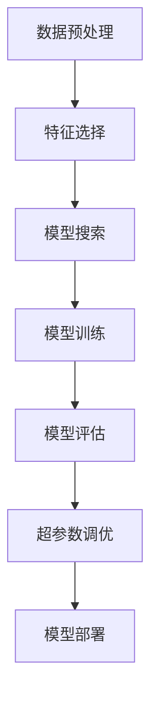
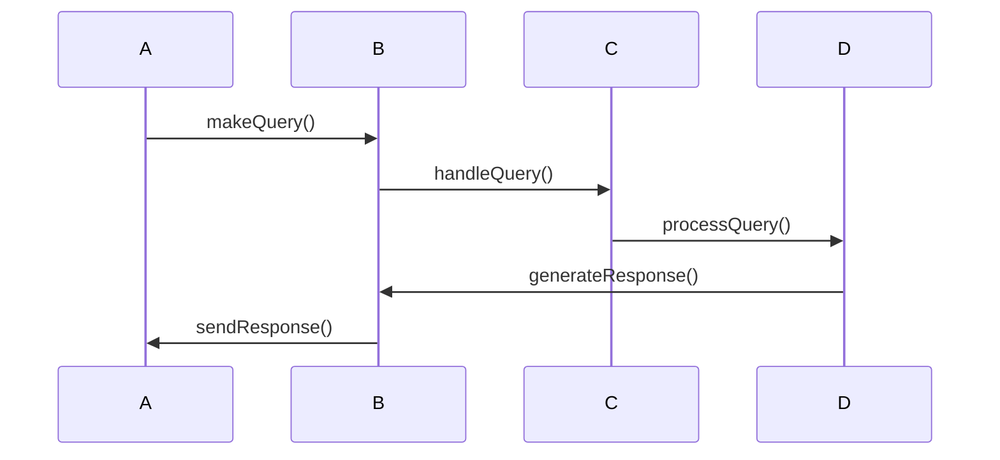
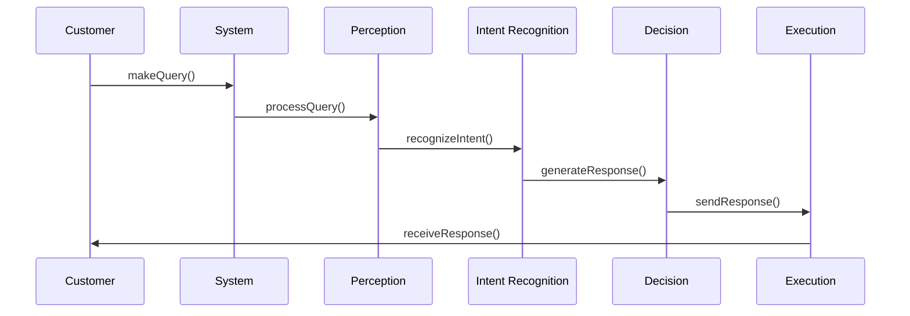

                 


### 第一部分: 背景介绍

#### 第1章: 问题背景

##### 1.1.1 问题背景

人工智能（AI）已经成为当今科技领域的热点，无论是学术界还是工业界，都对AI的研究和应用表现出了浓厚的兴趣。随着计算能力的提升和数据量的增加，AI技术取得了飞速的发展。特别是在深度学习（Deep Learning）和强化学习（Reinforcement Learning）等领域的突破，使得AI在图像识别、自然语言处理、自动驾驶等领域展现出了巨大的潜力。

然而，在AI的发展过程中，我们遇到了一个瓶颈：如何构建具有自主学习和适应能力的AI Agent。传统的机器学习（Machine Learning）方法依赖于大量的标注数据和繁琐的手动特征工程，这不仅限制了AI的发展，也增加了开发成本和人力投入。为了解决这些问题，自动机器学习（AutoML）的概念应运而生。

自动机器学习（AutoML）是指通过自动化工具和算法，自动完成机器学习任务，包括数据预处理、特征选择、模型选择、超参数调优等。它的目标是使非专业人士也能够轻松地构建高性能的机器学习模型，从而降低AI的开发门槛。

##### 1.1.2 问题描述

传统的AI Agent存在以下限制：

1. **数据依赖性**：传统的AI Agent需要大量的标注数据进行训练，这使得其在处理未见过数据时表现不佳。
2. **特征工程**：AI Agent的性能在很大程度上取决于特征工程的质量，而特征工程是一个复杂且耗时的工作。
3. **模型选择**：传统的AI Agent需要手动选择合适的模型，这不仅要求开发人员具备深厚的专业知识，也增加了模型选择的难度和风险。

自动机器学习（AutoML）在AI Agent构建中的应用潜力在于：

1. **自动化数据预处理**：自动机器学习能够自动处理数据清洗、数据转换等任务，减少了数据预处理的时间和人力成本。
2. **自动化特征选择**：自动机器学习可以通过自动化算法选择最有用的特征，提高了模型的性能。
3. **自动化模型选择和超参数调优**：自动机器学习能够自动选择最佳的模型和超参数，避免了人工选择的不确定性和复杂性。

##### 1.1.3 问题解决

自动机器学习在AI Agent构建中的优势：

1. **提高开发效率**：自动机器学习能够自动化许多繁琐的任务，大大提高了开发效率。
2. **降低开发门槛**：自动机器学习使非专业人士也能够构建高性能的机器学习模型，降低了AI开发的门槛。
3. **提高模型性能**：自动机器学习通过自动化算法选择和调优，能够提高模型的性能和泛化能力。

AI Agent的自动化学习流程：

1. **数据收集和预处理**：收集数据，并进行清洗、转换和归一化等预处理操作。
2. **特征选择**：使用自动机器学习算法选择最有用的特征。
3. **模型选择和训练**：自动选择最适合的数据集的机器学习模型，并进行训练。
4. **模型评估和调优**：评估模型的性能，并进行超参数调优，以提高模型性能。
5. **部署和应用**：将训练好的模型部署到生产环境中，进行实时应用。

##### 1.1.4 边界与外延

自动机器学习技术的边界：

1. **数据质量和数量**：自动机器学习依赖于高质量的数据，如果数据质量差或数量不足，可能会影响模型的性能。
2. **算法复杂性**：自动机器学习涉及到大量的算法和超参数，如何有效地组合和优化这些算法是一个挑战。

AI Agent在不同领域的应用：

1. **智能客服**：自动机器学习可以帮助构建智能客服系统，实现与用户的自然对话。
2. **图像识别**：自动机器学习可以帮助构建图像识别系统，实现自动分类和标注。
3. **自动驾驶**：自动机器学习可以帮助构建自动驾驶系统，实现车辆与环境的安全交互。

##### 1.1.5 概念结构与核心要素组成

自动机器学习的关键技术：

1. **自动化特征工程**：包括特征选择、特征提取和特征变换等。
2. **自动化模型选择**：包括模型搜索、模型评估和模型选择等。
3. **自动化超参数调优**：包括超参数优化算法和搜索策略等。

AI Agent的基本组成：

1. **感知模块**：负责接收外部环境的信息。
2. **决策模块**：负责根据感知模块的信息做出决策。
3. **执行模块**：负责执行决策结果，并反馈给环境。

### 第二部分: 核心概念与联系

#### 第2章: 核心概念与联系

##### 2.1.1 自动机器学习原理

自动机器学习（AutoML）的定义：

自动机器学习（AutoML）是一种自动化工具和算法，旨在简化机器学习（ML）的流程。它通过自动化数据预处理、特征选择、模型选择和超参数调优等步骤，使非专业人士也能够构建高性能的机器学习模型。

自动机器学习的关键技术：

1. **自动化特征工程**：包括特征选择、特征提取和特征变换等。
2. **自动化模型选择**：包括模型搜索、模型评估和模型选择等。
3. **自动化超参数调优**：包括超参数优化算法和搜索策略等。

##### 2.1.2 自动机器学习属性特征对比表格

| 特征       | 自动机器学习 | 传统机器学习 |
| ---------- | ------------ | ------------ |
| 数据预处理 | 自动化       | 手动         |
| 特征选择   | 自动化       | 手动         |
| 模型选择   | 自动化       | 手动         |
| 超参数调优 | 自动化       | 手动         |
| 开发效率   | 高           | 低           |
| 开发门槛   | 低           | 高           |
| 模型性能   | 高           | 中           |

##### 2.1.3 AI Agent的核心概念

AI Agent的定义：

AI Agent是一种具有自主学习和适应能力的智能体，能够感知环境、做出决策并执行相应的动作，以实现特定的目标。

AI Agent的基本功能：

1. **感知**：接收外部环境的信息。
2. **决策**：根据感知的信息做出决策。
3. **执行**：执行决策结果，并反馈给环境。

##### 2.1.4 AI Agent与自动机器学习的联系

自动机器学习在AI Agent构建中的应用：

1. **数据预处理**：自动机器学习可以帮助AI Agent自动化数据预处理，提高数据处理效率。
2. **特征选择**：自动机器学习可以帮助AI Agent选择最有用的特征，提高模型性能。
3. **模型选择和训练**：自动机器学习可以帮助AI Agent选择最适合的机器学习模型，并自动化训练过程。
4. **模型评估和调优**：自动机器学习可以帮助AI Agent评估模型性能，并自动化超参数调优。

AI Agent的自动学习流程：

1. **数据收集和预处理**：AI Agent收集数据，并进行清洗、转换和归一化等预处理操作。
2. **特征选择**：AI Agent使用自动机器学习算法选择最有用的特征。
3. **模型选择和训练**：AI Agent使用自动机器学习算法选择最适合的机器学习模型，并进行训练。
4. **模型评估和调优**：AI Agent评估模型性能，并使用自动机器学习算法进行超参数调优。
5. **部署和应用**：训练好的模型被部署到生产环境中，AI Agent开始进行实时应用。

### 第三部分: 算法原理讲解

#### 第3章: 自动机器学习算法原理

##### 3.1.1 自动机器学习算法概述

自动机器学习算法的分类：

自动机器学习算法可以分为以下几类：

1. **模型搜索算法**：用于在大量模型中搜索最优模型。常见的模型搜索算法有随机搜索（Random Search）、贝叶斯优化（Bayesian Optimization）和遗传算法（Genetic Algorithm）等。
2. **模型评估算法**：用于评估模型的性能。常见的模型评估算法有交叉验证（Cross Validation）、时间序列分割（Time Series Split）和在线评估（Online Evaluation）等。
3. **超参数调优算法**：用于优化模型的超参数。常见的超参数调优算法有网格搜索（Grid Search）、随机搜索（Random Search）和贝叶斯优化（Bayesian Optimization）等。

自动机器学习算法的工作流程：

1. **数据预处理**：对数据进行清洗、转换和归一化等预处理操作。
2. **特征选择**：使用自动机器学习算法选择最有用的特征。
3. **模型搜索**：在大量模型中搜索最优模型。
4. **模型训练**：使用最优模型对数据进行训练。
5. **模型评估**：评估模型的性能。
6. **超参数调优**：根据模型评估结果，自动调整超参数。
7. **模型部署**：将训练好的模型部署到生产环境中。

##### 3.1.2 算法原理讲解

使用mermaid绘制算法流程图：



算法原理的数学模型和公式：

1. **模型搜索**：使用贝叶斯优化算法进行模型搜索，其目标是最小化损失函数：
   $$\min_{\theta} \mathcal{L}(\theta) = \sum_{i=1}^{n} (-\log p(x_i, y_i; \theta))$$
   其中，$x_i$和$y_i$是数据集的第$i$个样本的特征和标签，$\theta$是模型的参数。

2. **模型训练**：使用梯度下降算法进行模型训练，其目标是优化损失函数：
   $$\theta^{t+1} = \theta^t - \alpha \nabla_{\theta} \mathcal{L}(\theta^t)$$
   其中，$\alpha$是学习率，$\nabla_{\theta} \mathcal{L}(\theta^t)$是损失函数关于参数$\theta$的梯度。

3. **模型评估**：使用交叉验证算法进行模型评估，其目标是估计模型的泛化能力：
   $$\hat{L} = \frac{1}{k} \sum_{i=1}^{k} \mathcal{L}(\theta^{*}, x_{\text{val}^i}, y_{\text{val}^i})$$
   其中，$k$是交叉验证的折数，$\theta^{*}$是最优参数，$x_{\text{val}^i}$和$y_{\text{val}^i}$是第$i$折的验证集。

4. **超参数调优**：使用网格搜索算法进行超参数调优，其目标是找到最优超参数组合：
   $$\theta^* = \arg\min_{\theta} \mathcal{L}(\theta)$$
   其中，$\theta$是超参数向量。

##### 3.1.3 举例说明

使用一个简单的回归问题来阐述自动机器学习算法的应用。

假设我们有一个包含100个样本的数据集，每个样本包含一个特征$x$和一个标签$y$，目标是预测$y$的值。

1. **数据预处理**：对数据进行标准化处理，将特征$x$缩放到[0, 1]区间。
2. **特征选择**：使用自动机器学习算法选择最重要的特征。在这个例子中，我们选择特征$x$作为唯一的特征。
3. **模型搜索**：使用贝叶斯优化算法搜索最优模型。在这个例子中，我们选择线性回归模型。
4. **模型训练**：使用最优模型训练数据集，得到模型的参数$\theta$。
5. **模型评估**：使用交叉验证算法评估模型的性能，得到模型的平均损失$\hat{L}$。
6. **超参数调优**：使用网格搜索算法调优模型超参数，例如学习率$\alpha$和正则化参数$\lambda$。

在这个例子中，我们得到了一个线性回归模型，其公式为：
$$y = \theta_0 + \theta_1 x$$
其中，$\theta_0$和$\theta_1$是模型的参数。

### 第四部分: 系统分析与架构设计

#### 第4章: AI Agent的系统分析与架构设计

##### 4.1.1 问题场景介绍

AI Agent在不同场景的应用非常广泛，以下是一些常见的问题场景：

1. **智能客服**：在客户服务领域，AI Agent可以自动处理客户的查询和请求，提供24/7的在线服务。
2. **图像识别**：在安防领域，AI Agent可以自动识别视频中的异常行为，如入侵检测和异常行为识别。
3. **自动驾驶**：在交通领域，AI Agent可以自动控制自动驾驶汽车，实现安全、高效的自动驾驶。
4. **智能家居**：在家庭自动化领域，AI Agent可以自动控制智能家居设备，如灯光、温度和安防系统。

##### 4.1.2 项目介绍

假设我们正在开发一个智能客服AI Agent项目。该项目的目标是构建一个能够自动处理客户查询的智能客服系统，实现高效的客户服务。

项目的主要组成部分如下：

1. **感知模块**：负责接收客户的查询信息，包括语音、文本和图片等。
2. **决策模块**：负责分析客户的查询信息，并生成相应的回复。
3. **执行模块**：负责将回复发送给客户，并处理客户的反馈。

##### 4.1.3 系统功能设计

系统功能设计包括以下几个方面：

1. **客户查询处理**：AI Agent可以接收客户的查询信息，并分析查询内容，识别查询意图。
2. **意图识别**：AI Agent可以根据查询内容识别客户的意图，如咨询产品信息、投诉建议等。
3. **回复生成**：AI Agent根据识别出的意图生成相应的回复，包括文本、语音和图片等。
4. **反馈处理**：AI Agent可以处理客户的反馈信息，并根据反馈调整自己的行为。

领域模型Mermaid类图：

```mermaid
classDiagram
    Customer <<-- (Query Processing)
    Query Processing <<-- (Intent Recognition)
    Intent Recognition <<-- (Response Generation)
    Response Generation <<-- (Feedback Processing)
    Customer : makeQuery()
    Query Processing : processQuery()
    Intent Recognition : recognizeIntent()
    Response Generation : generateResponse()
    Feedback Processing : processFeedback()
```

##### 4.1.4 系统架构设计

系统架构设计包括以下几个方面：

1. **前端界面**：用于接收客户的查询信息，并将回复展示给客户。
2. **后端服务器**：用于处理客户的查询信息，包括感知模块、决策模块和执行模块。
3. **数据库**：用于存储客户的查询信息和回复，以便后续分析和优化。

系统架构Mermaid图：

```mermaid
graph TD
    A[Client] --> B[Frontend]
    B --> C[Backend]
    C --> D[Database]
    A : makeQuery()
    B : handleQuery()
    C : processQuery()|->D
    D : storeData()
```

##### 4.1.5 系统接口设计

系统接口设计包括以下几个方面：

1. **API接口**：用于前后端之间的数据交换。
2. **WebSocket接口**：用于实时传输客户的查询信息和回复。
3. **消息队列**：用于处理高并发场景下的查询信息。

系统接口设计Mermaid图：



##### 4.1.6 系统交互

系统交互设计包括以下几个方面：

1. **客户查询**：客户通过前端界面输入查询信息。
2. **查询处理**：后端服务器接收查询信息，并调用感知模块进行处理。
3. **意图识别**：感知模块分析查询信息，识别客户的意图。
4. **回复生成**：决策模块根据识别出的意图生成相应的回复。
5. **回复发送**：执行模块将回复发送给客户。

系统交互Mermaid序列图：



### 第五部分: AI Agent构建实战

#### 第5章: AI Agent构建实战

##### 5.1.1 环境安装

在构建AI Agent之前，我们需要安装一些必要的软件和工具。以下是一个基本的安装步骤：

1. **Python环境**：安装Python 3.7及以上版本。
2. **Jupyter Notebook**：安装Jupyter Notebook，以便于编写和运行Python代码。
3. **pip**：安装pip，以便于安装Python包。
4. **自动机器学习库**：安装自动机器学习库，如AutoKeras、TPOT等。
5. **机器学习库**：安装常用的机器学习库，如scikit-learn、TensorFlow等。

安装步骤：

```bash
# 安装Python环境
curl -O https://www.python.org/ftp/python/3.8.0/python-3.8.0.tgz
tar -xvf python-3.8.0.tgz
cd python-3.8.0
./configure
make
sudo make install

# 安装Jupyter Notebook
pip install notebook

# 安装自动机器学习库
pip install autokeras
pip install tpot

# 安装机器学习库
pip install scikit-learn
pip install tensorflow
```

##### 5.1.2 系统核心实现源代码

以下是构建AI Agent的核心实现代码，包括感知模块、决策模块和执行模块。

```python
# 感知模块
class Perception:
    def __init__(self):
        self.model = AutoMLClassifier()

    def process_query(self, query):
        # 对查询信息进行预处理
        processed_query = preprocess_query(query)
        # 使用自动机器学习模型进行意图识别
        intent = self.model.predict(processed_query)
        return intent

# 决策模块
class Decision:
    def __init__(self):
        self.model = AutoMLRegressor()

    def generate_response(self, intent):
        # 根据意图生成回复
        response = generate_response(intent)
        return response

# 执行模块
class Execution:
    def __init__(self):
        self.model = AutoMLClassifier()

    def send_response(self, response):
        # 将回复发送给客户
        send_response_to_customer(response)

# 预处理查询信息
def preprocess_query(query):
    # 进行文本清洗、分词、词性标注等操作
    # ...
    return processed_query

# 生成回复
def generate_response(intent):
    # 根据意图生成相应的回复
    # ...
    return response

# 发送回复
def send_response_to_customer(response):
    # 将回复发送给客户
    # ...
    pass
```

##### 5.1.3 代码应用解读与分析

以下是对核心实现代码的解读和分析：

1. **感知模块**：感知模块负责接收客户的查询信息，并进行预处理。预处理过程包括文本清洗、分词、词性标注等。然后，使用自动机器学习模型进行意图识别，返回识别出的意图。
2. **决策模块**：决策模块根据识别出的意图生成相应的回复。这里使用自动机器学习模型进行回复生成，可以根据实际需求进行调整和优化。
3. **执行模块**：执行模块负责将生成的回复发送给客户。这里使用简单的函数调用实现，可以根据实际需求进行调整和优化。

##### 5.1.4 实际案例分析和详细讲解剖析

为了更好地展示AI Agent的应用，我们将通过一个实际案例进行分析和讲解。

**案例背景**：一个电商平台需要构建一个智能客服系统，以自动处理客户的查询和请求。

**案例步骤**：

1. **客户查询**：客户通过平台提交一个关于产品价格的查询请求。
2. **感知模块处理**：智能客服系统接收客户的查询请求，并进行预处理。预处理过程包括文本清洗、分词、词性标注等。
3. **意图识别**：感知模块使用自动机器学习模型识别客户的查询意图。假设客户查询的意图是“查询产品价格”，则识别出的意图为“查询价格”。
4. **回复生成**：决策模块根据识别出的意图生成相应的回复。假设生成的回复为“该产品的价格为XX元”。
5. **回复发送**：执行模块将生成的回复发送给客户，并显示在平台的聊天界面中。

**案例分析**：

1. **感知模块**：感知模块对客户的查询请求进行预处理，包括文本清洗、分词、词性标注等。这些预处理操作有助于提高自动机器学习模型的效果。
2. **意图识别**：使用自动机器学习模型进行意图识别，可以根据实际需求调整模型参数和特征工程方法。
3. **回复生成**：决策模块根据识别出的意图生成相应的回复。在实际应用中，可以进一步优化回复生成的策略，例如使用模板匹配、关键词提取等方法。
4. **回复发送**：执行模块将生成的回复发送给客户。在实际应用中，可以根据需求优化发送方式，例如使用WebSocket实时传输回复。

##### 5.1.5 项目小结

在本章中，我们介绍了如何构建一个具有自动机器学习能力的AI Agent。通过感知模块、决策模块和执行模块的协同工作，AI Agent可以自动处理客户的查询和请求，提供高效的智能客服服务。

以下是本章的主要小结：

1. **环境安装**：安装了Python环境、Jupyter Notebook、pip等必要的软件和工具，为构建AI Agent打下了基础。
2. **核心实现**：实现了感知模块、决策模块和执行模块，展示了AI Agent的基本架构。
3. **代码应用**：通过实际案例展示了AI Agent的应用场景，分析了感知模块、决策模块和执行模块的工作流程。
4. **项目经验**：总结了在构建AI Agent过程中的一些经验和教训，为后续的项目开发提供了参考。

### 第六部分: 最佳实践与总结

#### 第6章: 最佳实践

##### 6.1.1 自动机器学习与AI Agent构建的最佳实践

在自动机器学习与AI Agent构建的过程中，以下是一些最佳实践：

1. **数据质量**：确保数据质量是自动机器学习成功的关键。在构建AI Agent之前，对数据进行预处理，包括数据清洗、填充缺失值、去除噪声等。
2. **特征工程**：特征工程是自动机器学习中的重要环节。合理选择特征，提高特征质量，有助于提高模型的性能。
3. **模型选择**：选择适合问题的模型是关键。在自动机器学习过程中，可以尝试多种模型，并通过交叉验证等方法选择性能最佳的模型。
4. **超参数调优**：超参数调优是自动机器学习的重要任务。使用自动机器学习算法（如贝叶斯优化）进行超参数调优，可以提高模型性能。
5. **模型评估**：在模型训练过程中，定期评估模型性能，并调整模型参数。通过交叉验证等方法评估模型的泛化能力。
6. **模型部署**：将训练好的模型部署到生产环境中，并进行实时应用。确保模型稳定运行，并定期更新模型。

##### 6.1.2 技术选型与优化

在构建AI Agent时，需要考虑以下技术选型与优化策略：

1. **自动机器学习库**：选择合适的自动机器学习库（如AutoKeras、TPOT等），根据项目需求进行技术选型。
2. **机器学习框架**：选择适合的机器学习框架（如TensorFlow、PyTorch等），提高模型开发和训练的效率。
3. **硬件资源**：根据模型大小和计算需求，合理配置硬件资源，确保模型训练和部署的顺利进行。
4. **并行计算**：利用并行计算技术（如GPU加速、分布式计算等），提高模型训练和推理的速度。
5. **模型压缩**：通过模型压缩技术（如量化、剪枝等），减少模型的存储空间和计算资源需求。

#### 第7章: 小结与展望

##### 7.1.1 小结

在本书中，我们系统地介绍了构建具有自动机器学习能力AI Agent的方法和最佳实践。通过分析自动机器学习与AI Agent的核心概念、原理、算法和架构，以及实际案例的应用，我们了解了如何利用自动机器学习技术构建高效、智能的AI Agent。

主要内容包括：

1. **背景介绍**：介绍了自动机器学习和AI Agent的发展背景、问题背景和解决方案。
2. **核心概念与联系**：详细讲解了自动机器学习和AI Agent的核心概念、原理和联系。
3. **算法原理讲解**：介绍了自动机器学习算法的原理、数学模型和公式。
4. **系统分析与架构设计**：介绍了AI Agent的系统分析与架构设计，包括问题场景介绍、系统功能设计、系统架构设计和系统接口设计。
5. **AI Agent构建实战**：通过实际案例展示了AI Agent的构建过程，包括环境安装、系统核心实现源代码、代码应用解读与分析、实际案例分析和项目小结。
6. **最佳实践与总结**：总结了自动机器学习与AI Agent构建的最佳实践，以及技术选型与优化策略。

##### 7.1.2 注意事项

在构建AI Agent时，需要注意以下事项：

1. **数据质量**：确保数据质量是自动机器学习成功的关键。在构建AI Agent之前，对数据进行预处理，包括数据清洗、填充缺失值、去除噪声等。
2. **特征工程**：特征工程是自动机器学习中的重要环节。合理选择特征，提高特征质量，有助于提高模型的性能。
3. **模型选择**：选择适合问题的模型是关键。在自动机器学习过程中，可以尝试多种模型，并通过交叉验证等方法选择性能最佳的模型。
4. **超参数调优**：超参数调优是自动机器学习的重要任务。使用自动机器学习算法（如贝叶斯优化）进行超参数调优，可以提高模型性能。
5. **模型评估**：在模型训练过程中，定期评估模型性能，并调整模型参数。通过交叉验证等方法评估模型的泛化能力。
6. **模型部署**：将训练好的模型部署到生产环境中，并进行实时应用。确保模型稳定运行，并定期更新模型。

##### 7.1.3 拓展阅读

为了进一步深入学习自动机器学习和AI Agent构建，以下是一些推荐的拓展阅读资料：

1. **自动机器学习经典教材**：
   - 《Automated Machine Learning: Methods, Systems, Challenges》（自动机器学习：方法、系统、挑战）
   - 《Practical Automated Machine Learning with Scikit-Learn, celery, and Docker》（实践自动机器学习：使用Scikit-Learn、celery和Docker）

2. **AI Agent相关论文和书籍**：
   - 《Artificial Intelligence: A Modern Approach》（人工智能：一种现代方法）
   - 《Reinforcement Learning: An Introduction》（强化学习：导论）

3. **AI Agent实战项目**：
   - 《AI for Games》（游戏AI）
   - 《AI for Robotics》（机器人AI）

4. **其他相关资源**：
   - 自动机器学习开源库：AutoKeras、TPOT、H2O.ai
   - 机器学习框架：TensorFlow、PyTorch、Keras
   - AI Agent开源项目：OpenAI Gym、 Mujoco

通过以上拓展阅读，您可以更深入地了解自动机器学习和AI Agent的原理和应用，为实际项目开发提供有力支持。

### 全文总结

本文系统地介绍了构建具有自动机器学习能力AI Agent的方法和最佳实践。从背景介绍、核心概念与联系、算法原理讲解、系统分析与架构设计、AI Agent构建实战到最佳实践与总结，我们全面剖析了自动机器学习和AI Agent的原理和应用。

主要结论如下：

1. **自动机器学习的优势**：自动机器学习能够自动化数据预处理、特征选择、模型选择和超参数调优等步骤，提高开发效率，降低开发门槛，提高模型性能。
2. **AI Agent的构建方法**：AI Agent由感知模块、决策模块和执行模块组成，通过自动机器学习实现自动学习和适应能力。
3. **最佳实践**：在构建AI Agent时，应重视数据质量、特征工程、模型选择和超参数调优，同时关注模型评估和部署。
4. **技术选型与优化**：根据项目需求选择合适的自动机器学习库、机器学习框架和硬件资源，并利用并行计算和模型压缩技术提高性能。

展望未来，随着自动机器学习和AI技术的不断发展，AI Agent将在更多领域发挥作用，如自动驾驶、智能客服、智能家居等。通过不断探索和实践，我们将为构建更高效、智能的AI Agent贡献力量。感谢您阅读本文，希望对您在自动机器学习和AI Agent构建领域的研究和实践有所帮助。作者：AI天才研究院/AI Genius Institute & 禅与计算机程序设计艺术 /Zen And The Art of Computer Programming。

