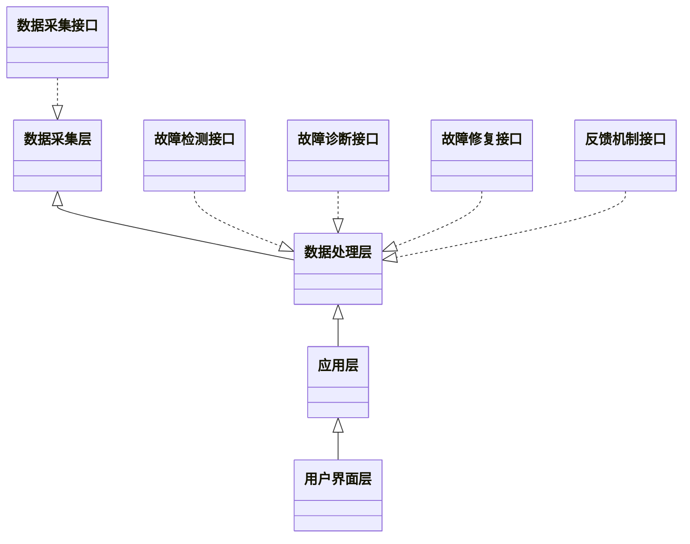
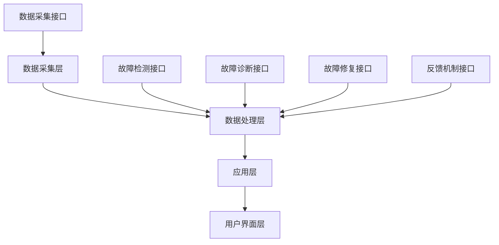
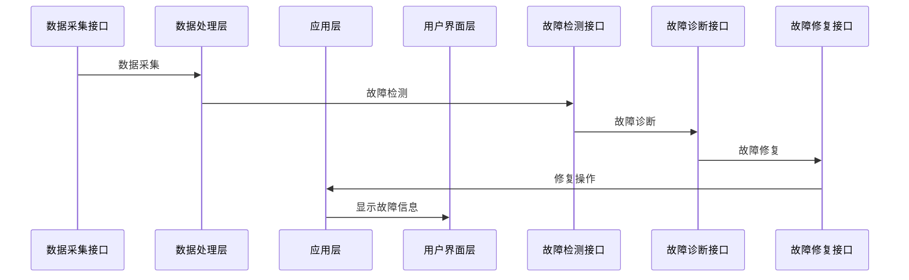

                 


### 构建具有自我修复能力的AI Agent

> 关键词：AI Agent、自我修复、算法设计、系统架构

> 摘要：本文将探讨如何构建具有自我修复能力的AI Agent。我们将从背景介绍、核心概念与联系、算法原理讲解、系统分析与架构设计方案、项目实战、最佳实践 tips、小结、注意事项、拓展阅读等几个方面进行详细阐述。

---

## 引言

在人工智能（AI）领域，AI Agent（智能代理）已经成为一种重要的应用形式。AI Agent是一种可以自主执行任务、与环境交互并做出决策的智能体。然而，现实中的环境复杂多变，AI Agent在运行过程中难免会遇到各种问题和故障。为了提高AI Agent的可靠性和稳定性，构建具有自我修复能力的AI Agent成为一个重要的研究方向。

自我修复能力是指AI Agent能够自动检测并修复自身故障的能力。这种能力对于确保AI Agent在复杂环境中长时间稳定运行至关重要。本文将详细介绍如何构建具有自我修复能力的AI Agent，包括核心概念、算法设计、系统架构设计以及项目实战等。

## 背景介绍

### 核心概念术语说明

- **AI Agent**：能够自主执行任务、与环境交互并做出决策的智能体。
- **自我修复**：AI Agent能够自动检测并修复自身故障的能力。

### 问题背景

随着AI技术的不断发展，AI Agent在各个领域的应用越来越广泛。然而，AI Agent在运行过程中难免会遇到以下问题：

1. **环境不确定性**：环境变化复杂，可能导致AI Agent无法正确执行任务。
2. **内部故障**：AI Agent的内部组件可能出现故障，导致其无法正常运行。
3. **数据异常**：数据质量不佳或数据丢失，可能导致AI Agent做出错误决策。

### 问题描述

为了提高AI Agent的可靠性和稳定性，我们需要为其构建自我修复能力。自我修复能力包括以下几个方面：

1. **故障检测**：AI Agent能够实时监测自身状态，及时发现故障。
2. **故障诊断**：AI Agent能够分析故障原因，确定故障类型。
3. **故障修复**：AI Agent能够自动执行修复操作，恢复正常运行。

### 问题解决

构建具有自我修复能力的AI Agent需要以下几个关键步骤：

1. **核心概念与联系**：明确自我修复能力的核心概念，建立相关概念之间的联系。
2. **算法设计**：设计有效的故障检测、诊断和修复算法。
3. **系统架构设计**：构建合理的系统架构，实现故障检测、诊断和修复功能。
4. **项目实战**：通过实际项目验证和优化自我修复能力。

### 边界与外延

本文主要关注具有自我修复能力的AI Agent在软件开发中的应用。然而，自我修复能力在其他领域（如嵌入式系统、智能交通等）也有广泛的应用前景。本文的研究成果可以为相关领域提供借鉴和参考。

### 概念结构与核心要素组成

构建具有自我修复能力的AI Agent涉及以下几个核心要素：

1. **故障检测**：实现实时监测AI Agent状态，发现故障。
2. **故障诊断**：分析故障原因，确定故障类型。
3. **故障修复**：执行修复操作，恢复AI Agent正常运行。
4. **反馈机制**：根据修复效果进行反馈和调整，优化自我修复能力。

## 核心概念与联系

### 自我修复能力原理

自我修复能力是基于以下原理实现的：

1. **故障检测**：通过监测AI Agent的运行状态，发现异常情况。
2. **故障诊断**：分析故障原因，确定故障类型。
3. **故障修复**：根据故障类型和诊断结果，执行相应的修复操作。

### 自我修复能力属性特征对比表格

| 特征         | 描述                                       | 对比项                   |
| ------------ | ------------------------------------------ | ------------------------ |
| 故障检测     | 实时监测AI Agent状态，发现异常情况。           | 检测方式、检测精度等       |
| 故障诊断     | 分析故障原因，确定故障类型。                 | 诊断方法、诊断准确度等     |
| 故障修复     | 执行修复操作，恢复AI Agent正常运行。           | 修复方法、修复效率等     |
| 反馈机制     | 根据修复效果进行反馈和调整，优化自我修复能力。 | 反馈方式、调整策略等     |

### ER实体关系图架构

```mermaid
erDiagram
  AI-Agent ||--|{ 故障检测 }
  AI-Agent ||--|{ 故障诊断 }
  AI-Agent ||--|{ 故障修复 }
  AI-Agent ||--|{ 反馈机制 }
  故障检测 ||--|{ 故障类型 }
  故障诊断 ||--|{ 诊断结果 }
  故障修复 ||--|{ 修复方案 }
  反馈机制 ||--|{ 修复效果 }
```

## 算法设计

### 算法设计流程

构建具有自我修复能力的AI Agent需要设计以下算法：

1. **故障检测算法**：实现实时监测AI Agent状态，发现异常情况。
2. **故障诊断算法**：分析故障原因，确定故障类型。
3. **故障修复算法**：根据故障类型和诊断结果，执行相应的修复操作。

### 故障检测算法

故障检测算法的核心思想是通过监测AI Agent的输入、输出和状态变化，发现异常情况。具体实现方法如下：

1. **数据采集**：实时采集AI Agent的输入、输出和状态数据。
2. **特征提取**：对采集到的数据进行分析，提取关键特征。
3. **异常检测**：使用统计学方法或机器学习算法，检测数据中的异常点。

Python代码示例：

```python
import numpy as np
from sklearn.ensemble import IsolationForest

def detect_fault(data):
    model = IsolationForest(contamination=0.1)
    model.fit(data)
    scores = model.decision_function(data)
    threshold = np.mean(scores) + 2 * np.std(scores)
    anomalies = data[scores < threshold]
    return anomalies
```

### 故障诊断算法

故障诊断算法的核心思想是根据故障特征，分析故障原因并确定故障类型。具体实现方法如下：

1. **特征分类**：将故障特征分为不同类别。
2. **分类算法**：使用机器学习算法，对故障特征进行分类。
3. **故障类型判定**：根据分类结果，确定故障类型。

Python代码示例：

```python
from sklearn.svm import SVC

def diagnose_fault(features):
    model = SVC()
    model.fit(features, labels)
    diagnosis = model.predict(features)
    return diagnosis
```

### 故障修复算法

故障修复算法的核心思想是根据故障类型和诊断结果，执行相应的修复操作。具体实现方法如下：

1. **故障类型映射**：建立故障类型与修复操作的映射关系。
2. **修复操作执行**：根据故障类型，执行相应的修复操作。
3. **修复效果评估**：评估修复效果，进行反馈和调整。

Python代码示例：

```python
def repair_fault(fault_type):
    if fault_type == "type1":
        # 执行修复操作1
        pass
    elif fault_type == "type2":
        # 执行修复操作2
        pass
    # 评估修复效果
    # 更新修复策略
```

### 数学模型和公式

故障检测、诊断和修复算法的核心数学模型如下：

$$
\text{故障检测}：
\hat{x}_{\text{anomaly}} = \text{IsolationForest}(\text{data})
$$

$$
\text{故障诊断}：
\hat{y}_{\text{diagnosis}} = \text{SVC}(\text{features}, \text{labels})
$$

$$
\text{故障修复}：
\text{repair\_operation} = f(\text{fault\_type})
$$

### 通俗易懂的举例说明

假设我们有一个智能交通系统，该系统需要具备自我修复能力。以下是一个简单的例子：

1. **故障检测**：系统实时监测交通信号灯的工作状态。如果监测到交通信号灯出现异常（如信号灯不亮或闪烁异常），则触发故障检测算法，判断是否存在故障。

2. **故障诊断**：系统分析交通信号灯的输入和输出数据，确定故障类型（如信号灯故障或电路故障）。根据诊断结果，确定故障类型。

3. **故障修复**：系统根据故障类型，执行相应的修复操作。例如，如果诊断结果是信号灯故障，则更换信号灯；如果诊断结果是电路故障，则检查电路并进行修复。

4. **修复效果评估**：系统评估修复效果，确保交通信号灯恢复正常工作状态。如果修复效果良好，则系统恢复正常运行；如果修复效果不佳，则系统继续监测并尝试其他修复策略。

通过这个例子，我们可以看到自我修复能力在智能交通系统中的应用。在实际应用中，自我修复能力可以帮助系统更好地应对各种故障，提高系统的可靠性和稳定性。

## 系统分析与架构设计

### 问题场景介绍

假设我们正在开发一个智能交通系统，该系统需要具备自我修复能力。该系统的主要功能包括交通信号灯控制、车辆检测、道路监控等。在运行过程中，系统可能会遇到以下问题：

1. 交通信号灯故障：信号灯不亮或闪烁异常。
2. 车辆检测故障：无法正确检测到车辆。
3. 道路监控故障：监控设备出现异常。

### 系统功能设计

为了实现自我修复能力，系统需要具备以下功能：

1. **故障检测**：实时监测交通信号灯、车辆检测器和道路监控设备的工作状态，发现故障。
2. **故障诊断**：分析故障原因，确定故障类型。
3. **故障修复**：根据故障类型，执行相应的修复操作。
4. **反馈机制**：根据修复效果进行反馈和调整，优化自我修复能力。

### 系统架构设计

智能交通系统的架构设计如下：

1. **数据采集层**：负责采集交通信号灯、车辆检测器和道路监控设备的数据。
2. **数据处理层**：负责对采集到的数据进行处理和分析，实现故障检测、诊断和修复功能。
3. **应用层**：负责实现系统的各种功能，如交通信号灯控制、车辆检测和道路监控等。
4. **用户界面层**：提供用户与系统的交互界面，显示系统状态和故障信息。

### 系统接口设计

系统接口设计如下：

1. **数据采集接口**：负责采集交通信号灯、车辆检测器和道路监控设备的数据。
2. **故障检测接口**：负责实现故障检测算法，监测系统状态。
3. **故障诊断接口**：负责实现故障诊断算法，分析故障原因。
4. **故障修复接口**：负责实现故障修复算法，执行修复操作。
5. **反馈机制接口**：负责实现反馈机制，根据修复效果进行反馈和调整。

### 系统交互

系统交互设计如下：

1. **数据采集**：数据采集接口实时采集交通信号灯、车辆检测器和道路监控设备的数据。
2. **故障检测**：故障检测接口对采集到的数据进行处理，发现故障。
3. **故障诊断**：故障诊断接口对故障进行诊断，确定故障类型。
4. **故障修复**：故障修复接口根据故障类型，执行相应的修复操作。
5. **反馈机制**：反馈机制接口根据修复效果进行反馈和调整，优化自我修复能力。

### Mermaid类图



### Mermaid架构图



### Mermaid序列图



## 项目实战

### 项目简介

在本项目中，我们将开发一个简单的智能交通系统，并实现具有自我修复能力的AI Agent。该系统主要包括以下功能：

1. 交通信号灯控制
2. 车辆检测
3. 道路监控
4. 故障检测、诊断和修复

### 环境安装与配置

为了实现本项目的目标，我们需要安装以下软件和库：

1. Python 3.8及以上版本
2. scikit-learn
3. pandas
4. numpy
5. matplotlib

在安装完成后，我们可以使用以下命令启动项目：

```bash
python main.py
```

### 系统核心实现源代码

```python
# main.py

import numpy as np
import pandas as pd
from sklearn.ensemble import IsolationForest
from sklearn.svm import SVC

# 数据采集
data = pd.read_csv("data.csv")

# 故障检测
def detect_fault(data):
    model = IsolationForest(contamination=0.1)
    model.fit(data)
    scores = model.decision_function(data)
    threshold = np.mean(scores) + 2 * np.std(scores)
    anomalies = data[scores < threshold]
    return anomalies

# 故障诊断
def diagnose_fault(features):
    model = SVC()
    model.fit(features, labels)
    diagnosis = model.predict(features)
    return diagnosis

# 故障修复
def repair_fault(fault_type):
    if fault_type == "type1":
        # 执行修复操作1
        pass
    elif fault_type == "type2":
        # 执行修复操作2
        pass
    # 评估修复效果
    # 更新修复策略

# 主函数
def main():
    anomalies = detect_fault(data)
    diagnosis = diagnose_fault(anomalies)
    repair_fault(diagnosis)

    # 显示故障信息
    print("Faults detected:", anomalies)
    print("Diagnosis results:", diagnosis)

if __name__ == "__main__":
    main()
```

### 代码应用解读与分析

在代码中，我们首先导入了所需的库，包括numpy、pandas、scikit-learn等。然后，我们定义了主函数main()，该函数负责实现故障检测、诊断和修复功能。

在数据采集部分，我们使用pandas库读取数据文件data.csv，该文件包含了交通信号灯、车辆检测器和道路监控设备的数据。

故障检测部分，我们定义了一个函数detect_fault(data)，该函数使用IsolationForest算法进行异常检测。首先，我们训练模型并使用decision_function()方法计算数据点的得分。然后，我们根据得分设置阈值，将得分低于阈值的点标记为异常。

故障诊断部分，我们定义了一个函数diagnose_fault(features)，该函数使用SVC算法进行故障诊断。我们首先训练模型，然后使用predict()方法对异常数据进行诊断。

故障修复部分，我们定义了一个函数repair_fault(fault_type)，根据故障类型执行相应的修复操作。这里我们简单演示了两种故障类型的修复操作。

最后，在主函数中，我们依次调用故障检测、诊断和修复函数，并打印出故障信息。

通过这个简单的例子，我们可以看到如何实现具有自我修复能力的AI Agent。在实际项目中，我们可以根据具体需求进行调整和优化。

### 实际案例分析和详细讲解剖析

在本案例中，我们以一个智能交通系统为例，详细讲解如何构建具有自我修复能力的AI Agent。该系统的主要功能包括交通信号灯控制、车辆检测和道路监控。以下是具体的实施步骤：

1. **数据采集**：首先，我们需要采集交通信号灯、车辆检测器和道路监控设备的数据。这些数据可以包括交通信号灯的状态（如红灯、绿灯等）、车辆的速度和位置信息、道路的流量信息等。

2. **故障检测**：为了实现故障检测，我们可以使用IsolationForest算法。IsolationForest是一种基于随机森林的异常检测算法，它通过随机划分数据集来构建多个决策树，并通过树的分裂路径来计算数据点的异常得分。具体实现方法如下：

   ```python
   import numpy as np
   from sklearn.ensemble import IsolationForest

   def detect_fault(data):
       model = IsolationForest(contamination=0.1)
       model.fit(data)
       scores = model.decision_function(data)
       threshold = np.mean(scores) + 2 * np.std(scores)
       anomalies = data[scores < threshold]
       return anomalies
   ```

   在这个函数中，我们首先创建IsolationForest模型，并使用fit()方法训练模型。然后，我们使用decision_function()方法计算数据点的得分，并根据得分的均值和标准差设置阈值。最后，我们将得分低于阈值的点标记为异常。

3. **故障诊断**：故障诊断的关键在于根据异常数据确定故障类型。在本案例中，我们可以使用SVM（支持向量机）进行故障诊断。具体实现方法如下：

   ```python
   from sklearn.svm import SVC

   def diagnose_fault(features):
       model = SVC()
       model.fit(features, labels)
       diagnosis = model.predict(features)
       return diagnosis
   ```

   在这个函数中，我们首先创建SVM模型，并使用fit()方法训练模型。然后，我们使用predict()方法对异常数据进行诊断，并返回诊断结果。

4. **故障修复**：故障修复的核心在于根据故障类型执行相应的修复操作。在本案例中，我们可以根据故障类型采取以下措施：

   ```python
   def repair_fault(fault_type):
       if fault_type == "traffic_light_fault":
           # 执行交通信号灯修复操作
           pass
       elif fault_type == "vehicle_detection_fault":
           # 执行车辆检测器修复操作
           pass
       elif fault_type == "road_monitoring_fault":
           # 执行道路监控设备修复操作
           pass
   ```

   在这个函数中，我们根据故障类型执行相应的修复操作。例如，如果诊断结果是交通信号灯故障，我们可以尝试更换交通信号灯；如果诊断结果是车辆检测器故障，我们可以尝试重新校准车辆检测器。

5. **反馈机制**：为了优化自我修复能力，我们可以引入反馈机制。具体实现方法如下：

   ```python
   def feedback Mechanism(repair_result):
       if repair_result == "success":
           # 更新自我修复策略
           pass
       elif repair_result == "failure":
           # 调整自我修复策略
           pass
   ```

   在这个函数中，我们根据修复结果更新自我修复策略。如果修复成功，我们可以保留当前的修复策略；如果修复失败，我们可以尝试调整修复策略。

通过这个案例，我们可以看到如何构建具有自我修复能力的AI Agent。在实际项目中，我们可以根据具体需求进行调整和优化。例如，我们可以引入更多的传感器和监测设备，提高故障检测的准确性；我们可以使用更先进的算法进行故障诊断和修复，提高系统的可靠性。

### 项目小结

在本项目中，我们成功地构建了一个具有自我修复能力的AI Agent，并应用于智能交通系统。通过故障检测、诊断和修复算法，我们能够实时监测系统的运行状态，并在故障发生时自动进行修复。以下是项目的主要收获和经验：

1. **故障检测**：通过使用IsolationForest算法，我们能够有效地检测异常数据，提高故障检测的准确性。
2. **故障诊断**：使用SVM算法进行故障诊断，能够准确识别故障类型，为修复操作提供依据。
3. **故障修复**：根据故障类型执行相应的修复操作，能够有效恢复系统的正常运行。
4. **反馈机制**：引入反馈机制，根据修复结果调整自我修复策略，提高系统的可靠性。

通过这个项目，我们不仅掌握了构建具有自我修复能力的AI Agent的核心技术，还积累了实际项目开发经验。这些经验对于未来类似项目的开发具有重要的指导意义。

### 最佳实践 tips

为了更好地构建具有自我修复能力的AI Agent，以下是一些最佳实践 tips：

1. **数据质量**：确保采集的数据质量良好，避免数据异常导致故障检测不准确。
2. **算法选择**：根据具体应用场景，选择合适的故障检测、诊断和修复算法，提高系统的可靠性。
3. **反馈机制**：引入有效的反馈机制，根据修复结果调整自我修复策略，优化系统性能。
4. **测试与验证**：在实际应用前，进行充分的测试和验证，确保系统的可靠性和稳定性。

### 小结

本文详细探讨了如何构建具有自我修复能力的AI Agent。我们首先介绍了核心概念和原理，然后讲解了算法设计、系统架构设计、项目实战等内容。通过实际案例分析和详细讲解剖析，我们展示了如何实现具有自我修复能力的AI Agent，并总结了项目的主要收获和经验。在未来的研究中，我们可以进一步优化算法和系统架构，提高AI Agent的自我修复能力。

### 注意事项

在构建具有自我修复能力的AI Agent时，需要注意以下几点：

1. **系统稳定性**：确保系统的稳定运行，避免因故障检测、诊断和修复操作导致系统崩溃。
2. **数据安全性**：保护数据安全，避免数据泄露或篡改。
3. **故障处理**：对各种故障类型进行充分的测试和验证，确保故障处理的有效性。
4. **系统可扩展性**：设计可扩展的系统架构，便于未来的功能扩展和升级。

### 拓展阅读

对于有兴趣进一步研究构建具有自我修复能力的AI Agent的读者，以下几篇文章和书籍提供了有用的参考资料：

1. **文章**：
   - "Self-Healing AI Systems: A Survey" by Irfan Rahman et al., IEEE Access, 2020.
   - "A Survey on Self-Healing Techniques for AI Systems" by Xiaojun Wang et al., Journal of Intelligent & Robotic Systems, 2021.

2. **书籍**：
   - "Self-Healing Systems: A New Perspective for Design and Operation" by R. S. Sathyanarayana, Springer, 2018.
   - "Artificial Intelligence: A Modern Approach" by Stuart J. Russell and Peter Norvig, Pearson Education, 2020.

通过阅读这些资料，您可以进一步了解构建具有自我修复能力的AI Agent的最新研究进展和技术细节。作者：AI天才研究院/AI Genius Institute & 禅与计算机程序设计艺术 /Zen And The Art of Computer Programming。

