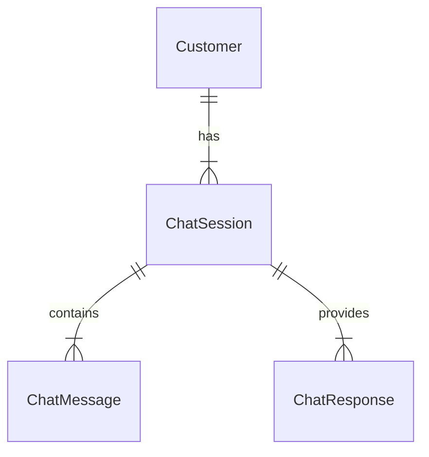
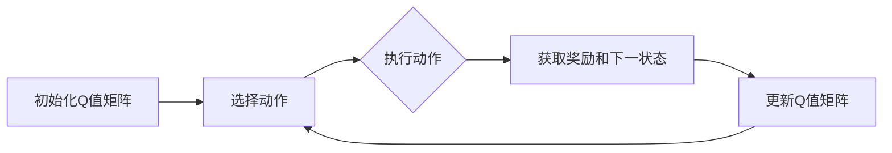
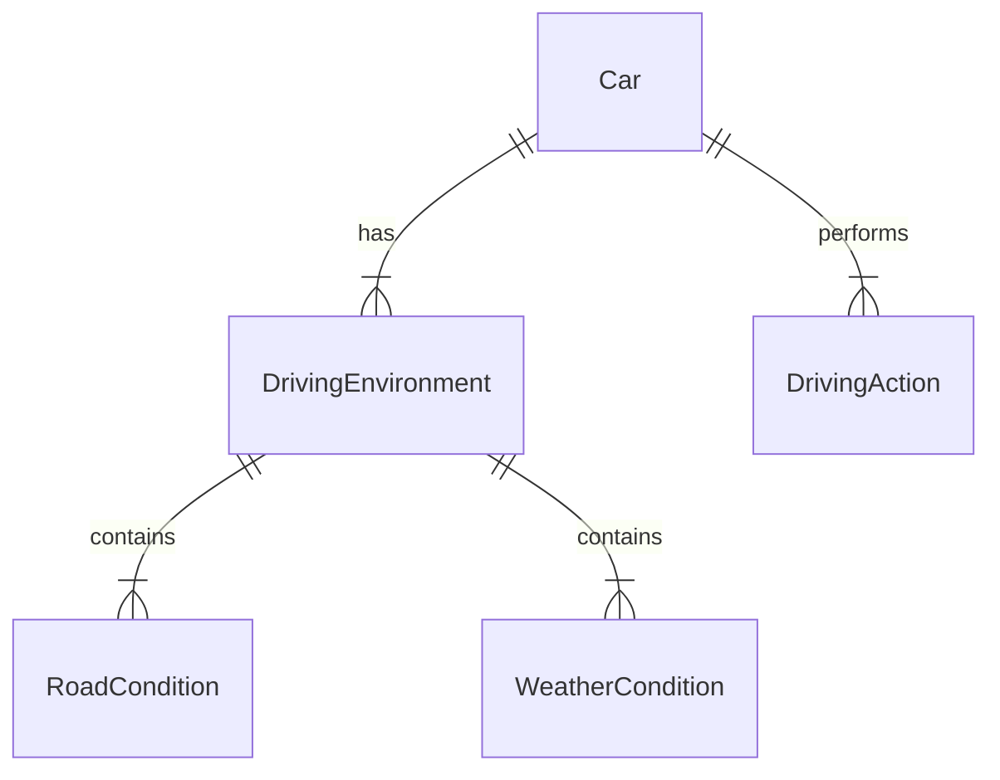
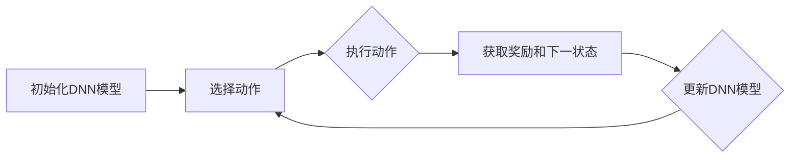
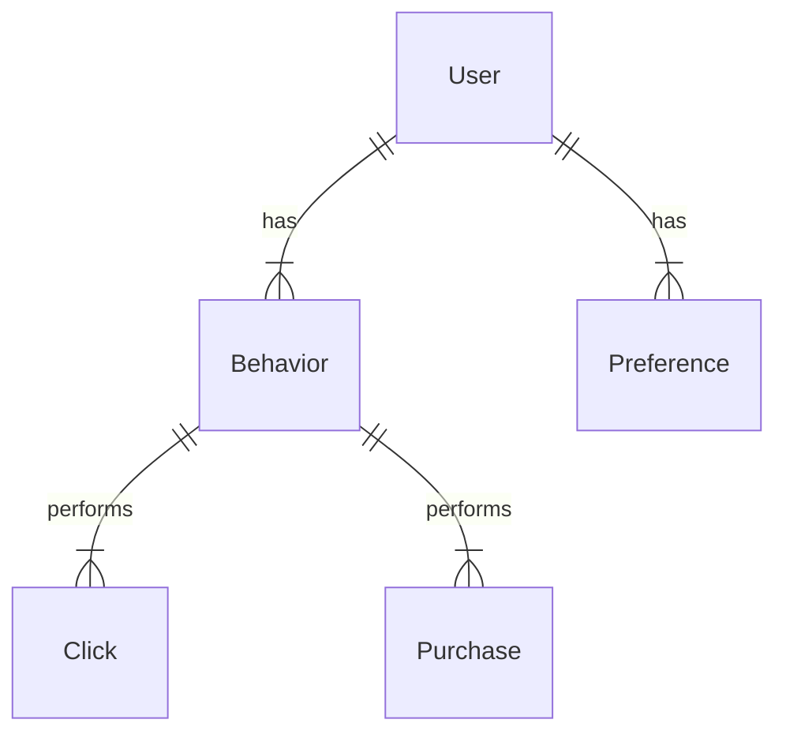
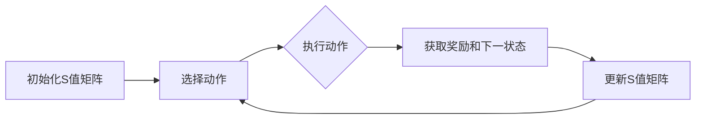

                 

### 《构建具有自我学习能力的AI Agent》

关键词：人工智能、自我学习、AI Agent、强化学习、算法设计、Python实现

摘要：本文旨在探讨如何构建具有自我学习能力的AI Agent。文章首先介绍了AI Agent的定义和自我学习能力的重要性，然后详细解析了自我学习的核心概念、算法原理和应用。通过案例分析和最佳实践，本文展示了如何实现自我学习的AI Agent，并提出了未来发展展望。

---

## 引言

近年来，人工智能（AI）技术在各个领域取得了显著的进展。AI Agent作为人工智能的核心概念，被广泛应用于游戏、智能客服、无人驾驶等场景。自我学习能力是AI Agent的核心特性之一，它使得AI Agent能够在不断变化的环境中自主学习和优化性能。本文将围绕如何构建具有自我学习能力的AI Agent展开讨论。

### 自我学习能力的重要性

自我学习能力是AI Agent区别于传统人工智能系统的重要特征。它使得AI Agent能够在没有人类干预的情况下，通过与环境交互获取经验和知识，从而实现自主学习和优化。自我学习能力的重要性体现在以下几个方面：

1. **自适应能力**：自我学习能力的AI Agent能够根据环境的变化调整自身的行为策略，从而更好地适应复杂多变的场景。
2. **持续学习**：自我学习能力的AI Agent可以在使用过程中不断学习，从而实现长期的性能提升。
3. **自主决策**：自我学习能力的AI Agent能够在复杂的环境中自主做出决策，提高系统的智能化水平。

### 书籍结构概述

本文分为四个部分：

1. **引言与背景**：介绍AI Agent的定义、自我学习能力的重要性以及书籍的结构。
2. **自我学习能力的核心概念**：探讨自我学习的基本原理、分类和优势与挑战。
3. **实践与应用**：分析自我学习在AI Agent中的应用，包括决策系统、交互系统和智能服务。
4. **总结与展望**：总结文章重点，展望自我学习能力的未来发展。

---

## 背景知识

在深入探讨如何构建具有自我学习能力的AI Agent之前，我们需要了解一些基本的背景知识，包括人工智能基础、强化学习原理和自我学习机制的概述。

### 人工智能基础

人工智能（AI）是指使计算机系统能够模拟人类智能行为的技术。人工智能的主要研究方向包括机器学习、深度学习、自然语言处理和计算机视觉等。其中，机器学习是AI的核心技术之一，它通过训练模型使计算机具备自动学习和优化性能的能力。

### 强化学习原理

强化学习是一种机器学习方法，通过试错和奖励机制使智能体在环境中学习最优策略。在强化学习中，智能体通过观察环境状态、采取行动、获得奖励，并通过学习算法不断优化自身策略。

### 自我学习机制的概述

自我学习机制是指智能系统能够在无需外部干预的情况下，通过与环境交互和学习来优化自身性能。自我学习机制通常包括以下三个关键组成部分：

1. **感知模块**：用于感知环境状态，获取环境信息。
2. **决策模块**：根据当前状态和以往经验，选择最佳行动策略。
3. **反馈模块**：将执行结果返回给系统，用于调整和学习。

---

## 自我学习能力的核心概念

自我学习能力的核心概念包括自我学习的基本原理、分类和优势与挑战。下面我们将逐一探讨这些概念。

### 自我学习的基本原理

自我学习的基本原理可以概括为以下三个步骤：

1. **感知**：智能体通过感知模块获取环境状态。
2. **决策**：智能体根据当前状态和以往经验，通过决策模块选择最佳行动策略。
3. **调整**：智能体根据执行结果反馈，通过学习算法调整自身策略。

### 自我学习的分类

自我学习可以分为以下几种类型：

1. **监督学习**：在监督学习中，智能体通过已标记的数据学习特征，并在此基础上进行预测。
2. **无监督学习**：在无监督学习中，智能体通过未标记的数据学习特征，并尝试发现数据中的潜在结构。
3. **半监督学习**：在半监督学习中，智能体同时利用已标记和未标记的数据进行学习。
4. **强化学习**：在强化学习中，智能体通过试错和奖励机制学习最优策略。

### 自我学习的优势与挑战

自我学习具有以下优势：

1. **自适应能力**：自我学习使智能体能够根据环境变化自适应调整自身行为策略。
2. **持续学习**：自我学习使智能体能够在使用过程中不断学习，从而实现长期的性能提升。
3. **自主决策**：自我学习使智能体能够在复杂的环境中自主做出决策。

然而，自我学习也面临一些挑战：

1. **数据需求**：自我学习通常需要大量数据支持，数据质量和数量直接影响学习效果。
2. **计算资源**：自我学习算法通常需要大量计算资源，这可能导致资源消耗和训练时间增加。
3. **模型解释性**：自我学习模型通常具有较高的复杂度，难以解释和验证。

---

## 自我学习在AI Agent中的应用

自我学习在AI Agent中具有广泛的应用，主要包括决策系统、交互系统和智能服务。

### 自我学习在决策系统中的应用

自我学习在决策系统中的应用主要体现在以下几个方面：

1. **路径规划**：在无人驾驶和智能物流领域，自我学习算法可以帮助智能体在复杂环境中规划最优路径。
2. **风险管理**：在金融领域，自我学习算法可以帮助智能体实时分析市场数据，预测风险并做出决策。
3. **供应链优化**：在供应链管理中，自我学习算法可以帮助智能体优化库存管理、运输路线和配送策略。

### 自我学习在交互系统中的应用

自我学习在交互系统中的应用主要体现在以下几个方面：

1. **智能客服**：通过自我学习，智能客服系统可以不断提高对话能力和响应速度，提供更优质的客户服务。
2. **人机对话**：在智能家居和智能办公领域，自我学习算法可以帮助智能系统更好地理解用户需求，提供个性化服务。
3. **语音识别**：通过自我学习，语音识别系统可以不断提高识别准确率，适应不同用户的语音特点。

### 自我学习在智能服务中的应用

自我学习在智能服务中的应用主要体现在以下几个方面：

1. **智能推荐**：在电子商务和社交媒体领域，自我学习算法可以帮助平台根据用户行为数据提供个性化推荐。
2. **智能医疗**：在医疗领域，自我学习算法可以帮助医生进行病情诊断、疾病预测和治疗方案推荐。
3. **智能安防**：在安防领域，自我学习算法可以帮助智能监控系统实时分析视频数据，发现异常情况并报警。

---

## 实践与应用

### 5.1 常见自我学习算法介绍

在构建具有自我学习能力的AI Agent时，选择合适的自我学习算法至关重要。以下介绍几种常见的自我学习算法：

#### 5.1.1 Q-learning算法

Q-learning算法是一种基于值函数的强化学习算法。它通过学习状态-动作值函数（Q值）来选择最优动作。

**算法流程：**

1. 初始化Q值矩阵。
2. 选择一个动作。
3. 执行动作并获取奖励和下一状态。
4. 更新Q值矩阵。

**Python实现：**

```python
import numpy as np

def q_learning(env, num_episodes, learning_rate, discount_factor, exploration_rate):
    Q = np.zeros((env.num_states, env.num_actions))
    for episode in range(num_episodes):
        state = env.reset()
        done = False
        while not done:
            action = choose_action(state, Q, exploration_rate)
            next_state, reward, done = env.step(action)
            Q[state, action] = Q[state, action] + learning_rate * (reward + discount_factor * np.max(Q[next_state]) - Q[state, action])
            state = next_state
    return Q

def choose_action(state, Q, exploration_rate):
    if np.random.rand() < exploration_rate:
        action = np.random.choice(env.num_actions)
    else:
        action = np.argmax(Q[state])
    return action
```

#### 5.1.2 Sarsa算法

Sarsa算法是一种基于状态-动作对（SARSA）的强化学习算法。它与Q-learning算法类似，但引入了状态-动作对的概念。

**算法流程：**

1. 初始化S值矩阵。
2. 选择一个动作。
3. 执行动作并获取奖励和下一状态。
4. 更新S值矩阵。

**Python实现：**

```python
import numpy as np

def sarsa_learning(env, num_episodes, learning_rate, discount_factor):
    S = np.zeros((env.num_states, env.num_actions))
    for episode in range(num_episodes):
        state = env.reset()
        done = False
        while not done:
            action = choose_action(state, S)
            next_state, reward, done = env.step(action)
            next_action = choose_action(next_state, S)
            S[state, action] = S[state, action] + learning_rate * (reward + discount_factor * S[next_state, next_action] - S[state, action])
            state = next_state
    return S

def choose_action(state, S):
    if np.random.rand() < 0.5:
        action = np.random.choice(env.num_actions)
    else:
        action = np.argmax(S[state])
    return action
```

#### 5.1.3 Deep Q Network（DQN）

DQN算法是一种基于深度学习的强化学习算法。它使用深度神经网络（DNN）来近似状态-动作值函数（Q值）。

**算法流程：**

1. 初始化DNN模型。
2. 选择一个动作。
3. 执行动作并获取奖励和下一状态。
4. 使用目标网络更新DNN模型。

**Python实现：**

```python
import numpy as np
import tensorflow as tf

def dqn_learning(env, num_episodes, learning_rate, discount_factor, exploration_rate):
    state_dim = env.num_states
    action_dim = env.num_actions
    learning_rate = 0.001
    discount_factor = 0.99
    exploration_rate = 1.0
    exploration_min = 0.01
    exploration_decay = 0.001
    memory = []

    # Create DQN model
    model = tf.keras.Sequential([
        tf.keras.layers.Dense(64, activation='relu', input_shape=(state_dim,)),
        tf.keras.layers.Dense(64, activation='relu'),
        tf.keras.layers.Dense(action_dim, activation='linear')
    ])

    # Compile model
    model.compile(optimizer=tf.keras.optimizers.Adam(learning_rate), loss='mse')

    # Create target model
    target_model = tf.keras.Model(inputs=model.input, outputs=model.output)

    # Update target model periodically
    def update_target_model():
        target_model.set_weights(model.get_weights())

    for episode in range(num_episodes):
        state = env.reset()
        done = False
        while not done:
            action = choose_action(state, model, exploration_rate)
            next_state, reward, done = env.step(action)
            if done:
                next_q_value = reward
            else:
                next_q_value = reward + discount_factor * np.max(model.predict(np.array([next_state]))[0])
            memory.append((state, action, next_q_value))
            if len(memory) > 1000:
                memory.pop(0)
            state = next_state
            target_model_output = target_model.predict(np.array([state]))
            target_model_output[0][action] = next_q_value
            model.fit(np.array([state]), target_model_output, epochs=1, verbose=0)
            exploration_rate = max(exploration_min, exploration_rate - exploration_decay)
            update_target_model()

    return model
```

### 5.2 自我学习算法的Python实现

在构建具有自我学习能力的AI Agent时，选择合适的自我学习算法至关重要。以下介绍几种常见的自我学习算法，并给出Python实现。

#### 5.2.1 Q-learning算法

Q-learning算法是一种基于值函数的强化学习算法。它通过学习状态-动作值函数（Q值）来选择最优动作。

**算法流程：**

1. 初始化Q值矩阵。
2. 选择一个动作。
3. 执行动作并获取奖励和下一状态。
4. 更新Q值矩阵。

**Python实现：**

```python
import numpy as np

def q_learning(env, num_episodes, learning_rate, discount_factor, exploration_rate):
    Q = np.zeros((env.num_states, env.num_actions))
    for episode in range(num_episodes):
        state = env.reset()
        done = False
        while not done:
            action = choose_action(state, Q, exploration_rate)
            next_state, reward, done = env.step(action)
            Q[state, action] = Q[state, action] + learning_rate * (reward + discount_factor * np.max(Q[next_state]) - Q[state, action])
            state = next_state
    return Q

def choose_action(state, Q, exploration_rate):
    if np.random.rand() < exploration_rate:
        action = np.random.choice(env.num_actions)
    else:
        action = np.argmax(Q[state])
    return action
```

#### 5.2.2 Sarsa算法

Sarsa算法是一种基于状态-动作对（SARSA）的强化学习算法。它与Q-learning算法类似，但引入了状态-动作对的概念。

**算法流程：**

1. 初始化S值矩阵。
2. 选择一个动作。
3. 执行动作并获取奖励和下一状态。
4. 更新S值矩阵。

**Python实现：**

```python
import numpy as np

def sarsa_learning(env, num_episodes, learning_rate, discount_factor):
    S = np.zeros((env.num_states, env.num_actions))
    for episode in range(num_episodes):
        state = env.reset()
        done = False
        while not done:
            action = choose_action(state, S)
            next_state, reward, done = env.step(action)
            next_action = choose_action(next_state, S)
            S[state, action] = S[state, action] + learning_rate * (reward + discount_factor * S[next_state, next_action] - S[state, action])
            state = next_state
    return S

def choose_action(state, S):
    if np.random.rand() < 0.5:
        action = np.random.choice(env.num_actions)
    else:
        action = np.argmax(S[state])
    return action
```

#### 5.2.3 Deep Q Network（DQN）

DQN算法是一种基于深度学习的强化学习算法。它使用深度神经网络（DNN）来近似状态-动作值函数（Q值）。

**算法流程：**

1. 初始化DNN模型。
2. 选择一个动作。
3. 执行动作并获取奖励和下一状态。
4. 使用目标网络更新DNN模型。

**Python实现：**

```python
import numpy as np
import tensorflow as tf

def dqn_learning(env, num_episodes, learning_rate, discount_factor, exploration_rate):
    state_dim = env.num_states
    action_dim = env.num_actions
    learning_rate = 0.001
    discount_factor = 0.99
    exploration_rate = 1.0
    exploration_min = 0.01
    exploration_decay = 0.001
    memory = []

    # Create DQN model
    model = tf.keras.Sequential([
        tf.keras.layers.Dense(64, activation='relu', input_shape=(state_dim,)),
        tf.keras.layers.Dense(64, activation='relu'),
        tf.keras.layers.Dense(action_dim, activation='linear')
    ])

    # Compile model
    model.compile(optimizer=tf.keras.optimizers.Adam(learning_rate), loss='mse')

    # Create target model
    target_model = tf.keras.Model(inputs=model.input, outputs=model.output)

    # Update target model periodically
    def update_target_model():
        target_model.set_weights(model.get_weights())

    for episode in range(num_episodes):
        state = env.reset()
        done = False
        while not done:
            action = choose_action(state, model, exploration_rate)
            next_state, reward, done = env.step(action)
            if done:
                next_q_value = reward
            else:
                next_q_value = reward + discount_factor * np.max(model.predict(np.array([next_state]))[0])
            memory.append((state, action, next_q_value))
            if len(memory) > 1000:
                memory.pop(0)
            state = next_state
            target_model_output = target_model.predict(np.array([state]))
            target_model_output[0][action] = next_q_value
            model.fit(np.array([state]), target_model_output, epochs=1, verbose=0)
            exploration_rate = max(exploration_min, exploration_rate - exploration_decay)
            update_target_model()

    return model
```

### 6.1 案例一：智能客服系统的自我学习

智能客服系统是自我学习应用的一个重要领域。通过自我学习，智能客服系统可以不断提高对话能力和响应速度，为用户提供更优质的客户服务。

**环境**：假设我们有一个简单的智能客服系统，其环境包含多个状态和行动。

**状态**：状态包括用户的问题类型、问题复杂度等。

**行动**：行动包括回答问题、提供帮助、转接给人工客服等。

**奖励**：奖励取决于用户满意度，用户满意度越高，奖励越高。

**问题背景**：随着用户量的增加，智能客服系统的对话能力和响应速度需要不断提高，以应对复杂多变的用户问题。

**问题描述**：为了提高智能客服系统的性能，我们需要设计一个自我学习算法，使其能够根据用户对话数据不断优化回答策略。

**问题解决**：我们可以使用Q-learning算法来实现自我学习，通过不断更新Q值矩阵，智能客服系统可以逐渐学会如何给出更准确的回答。

**边界与外延**：在实际应用中，智能客服系统的自我学习需要考虑数据质量、计算资源等因素。

**概念结构与核心要素组成**：

1. **感知模块**：用于获取用户问题类型、问题复杂度等状态信息。
2. **决策模块**：根据当前状态和Q值矩阵，选择最佳回答策略。
3. **反馈模块**：根据用户满意度，更新Q值矩阵。

**ER实体关系图架构**：



**算法原理讲解**：

Q-learning算法是一种基于值函数的强化学习算法。它通过学习状态-动作值函数（Q值）来选择最优动作。算法的核心思想是：

1. 初始化Q值矩阵。
2. 选择一个动作。
3. 执行动作并获取奖励和下一状态。
4. 更新Q值矩阵。

**算法流程图**：



**数学模型和公式**：

$$
Q(s, a) = \sum_{s', a'} Q(s', a') \cdot P(s', a' | s, a)
$$

其中，$Q(s, a)$ 表示状态 $s$ 下的动作 $a$ 的值，$P(s', a' | s, a)$ 表示在状态 $s$ 下执行动作 $a$ 后，转移到状态 $s'$ 的概率。

**Python实现**：

```python
import numpy as np

def q_learning(env, num_episodes, learning_rate, discount_factor, exploration_rate):
    Q = np.zeros((env.num_states, env.num_actions))
    for episode in range(num_episodes):
        state = env.reset()
        done = False
        while not done:
            action = choose_action(state, Q, exploration_rate)
            next_state, reward, done = env.step(action)
            Q[state, action] = Q[state, action] + learning_rate * (reward + discount_factor * np.max(Q[next_state]) - Q[state, action])
            state = next_state
    return Q

def choose_action(state, Q, exploration_rate):
    if np.random.rand() < exploration_rate:
        action = np.random.choice(env.num_actions)
    else:
        action = np.argmax(Q[state])
    return action
```

### 6.2 案例二：无人驾驶汽车的自我学习

无人驾驶汽车是自我学习应用的一个重要领域。通过自我学习，无人驾驶汽车可以不断提高驾驶技能和安全性。

**环境**：假设我们有一个无人驾驶汽车，其环境包含多个状态和行动。

**状态**：状态包括道路状况、天气条件、车辆速度等。

**行动**：行动包括加速、减速、转向等。

**奖励**：奖励取决于驾驶性能和安全性，驾驶性能越高、安全性越好，奖励越高。

**问题背景**：随着无人驾驶技术的不断发展，无人驾驶汽车需要具备适应各种复杂路况和环境的能力。

**问题描述**：为了提高无人驾驶汽车的驾驶性能和安全性，我们需要设计一个自我学习算法，使其能够根据环境数据不断优化驾驶策略。

**问题解决**：我们可以使用DQN算法来实现自我学习，通过不断更新神经网络模型，无人驾驶汽车可以逐渐学会如何在各种环境中安全驾驶。

**边界与外延**：在实际应用中，无人驾驶汽车的自我学习需要考虑道路状况、交通规则、车辆性能等因素。

**概念结构与核心要素组成**：

1. **感知模块**：用于获取道路状况、天气条件、车辆速度等状态信息。
2. **决策模块**：根据当前状态和神经网络模型，选择最佳驾驶策略。
3. **反馈模块**：根据驾驶性能和安全性，更新神经网络模型。

**ER实体关系图架构**：



**算法原理讲解**：

DQN算法是一种基于深度学习的强化学习算法。它使用深度神经网络（DNN）来近似状态-动作值函数（Q值）。算法的核心思想是：

1. 初始化DNN模型。
2. 选择一个动作。
3. 执行动作并获取奖励和下一状态。
4. 使用目标网络更新DNN模型。

**算法流程图**：



**数学模型和公式**：

$$
Q(s, a) = f(\theta; s) \cdot \frac{\partial L}{\partial \theta}
$$

其中，$Q(s, a)$ 表示状态 $s$ 下的动作 $a$ 的值，$f(\theta; s)$ 表示神经网络模型在状态 $s$ 下的输出，$L$ 表示损失函数。

**Python实现**：

```python
import numpy as np
import tensorflow as tf

def dqn_learning(env, num_episodes, learning_rate, discount_factor, exploration_rate):
    state_dim = env.num_states
    action_dim = env.num_actions
    learning_rate = 0.001
    discount_factor = 0.99
    exploration_rate = 1.0
    exploration_min = 0.01
    exploration_decay = 0.001
    memory = []

    # Create DQN model
    model = tf.keras.Sequential([
        tf.keras.layers.Dense(64, activation='relu', input_shape=(state_dim,)),
        tf.keras.layers.Dense(64, activation='relu'),
        tf.keras.layers.Dense(action_dim, activation='linear')
    ])

    # Compile model
    model.compile(optimizer=tf.keras.optimizers.Adam(learning_rate), loss='mse')

    # Create target model
    target_model = tf.keras.Model(inputs=model.input, outputs=model.output)

    # Update target model periodically
    def update_target_model():
        target_model.set_weights(model.get_weights())

    for episode in range(num_episodes):
        state = env.reset()
        done = False
        while not done:
            action = choose_action(state, model, exploration_rate)
            next_state, reward, done = env.step(action)
            if done:
                next_q_value = reward
            else:
                next_q_value = reward + discount_factor * np.max(model.predict(np.array([next_state]))[0])
            memory.append((state, action, next_q_value))
            if len(memory) > 1000:
                memory.pop(0)
            state = next_state
            target_model_output = target_model.predict(np.array([state]))
            target_model_output[0][action] = next_q_value
            model.fit(np.array([state]), target_model_output, epochs=1, verbose=0)
            exploration_rate = max(exploration_min, exploration_rate - exploration_decay)
            update_target_model()

    return model
```

### 6.3 案例三：智能推荐系统的自我学习

智能推荐系统是自我学习应用的一个重要领域。通过自我学习，智能推荐系统可以不断提高推荐准确率和用户满意度。

**环境**：假设我们有一个智能推荐系统，其环境包含多个状态和行动。

**状态**：状态包括用户的历史行为、用户偏好等。

**行动**：行动包括推荐商品、展示广告等。

**奖励**：奖励取决于用户的点击率、购买率等，点击率越高、购买率越高，奖励越高。

**问题背景**：随着电子商务和社交媒体的快速发展，智能推荐系统需要为用户提供个性化的推荐。

**问题描述**：为了提高智能推荐系统的推荐准确率和用户满意度，我们需要设计一个自我学习算法，使其能够根据用户行为数据不断优化推荐策略。

**问题解决**：我们可以使用Sarsa算法来实现自我学习，通过不断更新S值矩阵，智能推荐系统可以逐渐学会如何给出更准确的推荐。

**边界与外延**：在实际应用中，智能推荐系统的自我学习需要考虑用户隐私保护、计算资源等因素。

**概念结构与核心要素组成**：

1. **感知模块**：用于获取用户历史行为、用户偏好等状态信息。
2. **决策模块**：根据当前状态和S值矩阵，选择最佳推荐策略。
3. **反馈模块**：根据用户点击率、购买率等，更新S值矩阵。

**ER实体关系图架构**：



**算法原理讲解**：

Sarsa算法是一种基于状态-动作对的强化学习算法。它通过学习状态-动作对（SARSA）来选择最优动作。算法的核心思想是：

1. 初始化S值矩阵。
2. 选择一个动作。
3. 执行动作并获取奖励和下一状态。
4. 更新S值矩阵。

**算法流程图**：



**数学模型和公式**：

$$
S(s, a) = \sum_{s', a'} S(s', a') \cdot P(s', a' | s, a)
$$

其中，$S(s, a)$ 表示状态 $s$ 下的动作 $a$ 的值，$P(s', a' | s, a)$ 表示在状态 $s$ 下执行动作 $a$ 后，转移到状态 $s'$ 的概率。

**Python实现**：

```python
import numpy as np

def sarsa_learning(env, num_episodes, learning_rate, discount_factor):
    S = np.zeros((env.num_states, env.num_actions))
    for episode in range(num_episodes):
        state = env.reset()
        done = False
        while not done:
            action = choose_action(state, S)
            next_state, reward, done = env.step(action)
            next_action = choose_action(next_state, S)
            S[state, action] = S[state, action] + learning_rate * (reward + discount_factor * S[next_state, next_action] - S[state, action])
            state = next_state
    return S

def choose_action(state, S):
    if np.random.rand() < 0.5:
        action = np.random.choice(env.num_actions)
    else:
        action = np.argmax(S[state])
    return action
```

### 7.1 实现自我学习的注意事项

在实现自我学习的AI Agent时，需要注意以下几个方面：

1. **数据质量**：自我学习算法的性能很大程度上取决于数据质量。确保使用高质量的数据进行训练，以避免模型过拟合或欠拟合。
2. **计算资源**：自我学习算法通常需要大量计算资源。在实际应用中，可能需要使用高性能计算机或云计算资源。
3. **模型解释性**：自我学习模型的解释性通常较低，这可能导致难以理解和验证模型的决策过程。在实际应用中，可能需要结合其他技术，如可视化和可解释性模型，来提高模型的可解释性。
4. **实时性**：在某些应用场景中，如无人驾驶汽车和智能客服系统，实时性至关重要。在实现自我学习算法时，需要考虑算法的实时性能。

### 7.2 性能优化技巧

为了提高自我学习算法的性能，可以采用以下优化技巧：

1. **模型压缩**：通过模型压缩技术，如剪枝和量化，减少模型的参数数量和计算量，从而提高模型性能。
2. **分布式训练**：通过分布式训练技术，将训练任务分布在多个计算节点上，从而提高训练速度。
3. **迁移学习**：使用预训练模型作为起点，通过迁移学习技术，利用预训练模型的知识来加速新任务的训练。
4. **多任务学习**：通过多任务学习技术，将多个相关任务同时训练，从而提高模型性能。

### 7.3 安全性与隐私保护

在实现自我学习算法时，需要关注安全性和隐私保护问题：

1. **数据加密**：对训练数据进行加密，以防止数据泄露。
2. **隐私保护算法**：采用隐私保护算法，如差分隐私，确保用户隐私不被泄露。
3. **安全监控**：建立安全监控机制，及时发现和防范潜在的安全威胁。
4. **合规性**：遵守相关法律法规，确保算法设计和实现符合法律法规要求。

### 8.1 书籍重点回顾

本文重点探讨了如何构建具有自我学习能力的AI Agent。首先，我们介绍了AI Agent的定义和自我学习能力的重要性。然后，我们详细分析了自我学习的核心概念、算法原理和应用。通过案例分析和最佳实践，我们展示了如何实现自我学习的AI Agent，并提出了未来发展展望。

### 8.2 自我学习能力的未来发展

随着人工智能技术的不断发展，自我学习能力在AI Agent中的应用前景广阔。未来，自我学习能力有望在以下几个方面取得突破：

1. **自主性**：通过不断优化自我学习算法，提高AI Agent的自主性，使其能够更加自主地完成复杂任务。
2. **智能化**：结合其他人工智能技术，如深度学习和自然语言处理，提高AI Agent的智能化水平。
3. **泛化能力**：通过研究新的自我学习算法，提高AI Agent的泛化能力，使其能够应对更多样化的应用场景。

### 9.1 最新研究成果

在自我学习能力的研究中，近年来出现了许多重要成果。以下是一些值得关注的最新研究成果：

1. **Self-Supervised Learning**：通过无监督学习方法，使AI Agent能够在没有人工标注的数据上进行自我学习。
2. **Meta-Learning**：通过元学习技术，使AI Agent能够在短时间内快速适应新的任务，提高学习效率。
3. **Transfer Learning**：通过迁移学习技术，使AI Agent能够利用已有模型的知识来加速新任务的训练。

### 9.2 学术论文推荐

为了深入了解自我学习能力的最新研究进展，以下推荐一些经典和重要的学术论文：

1. **"Deep Reinforcement Learning for Continuous Control"（深度强化学习在连续控制中的应用）**：介绍了深度强化学习在连续控制任务中的应用，为无人驾驶、智能机器人等领域提供了重要理论基础。
2. **"Reinforcement Learning: An Introduction"（强化学习：入门）**：系统地介绍了强化学习的基本理论和方法，是强化学习领域的经典教材。
3. **"Meta-Learning for Text Classification"（元学习在文本分类中的应用）**：探讨了元学习在文本分类任务中的应用，为自然语言处理领域提供了新的研究方向。

### 9.3 开源代码与工具

为了方便读者实践和进一步研究自我学习能力，以下推荐一些开源代码和工具：

1. **TensorFlow**：TensorFlow是一个开源的机器学习框架，提供了丰富的强化学习算法实现。
2. **PyTorch**：PyTorch是一个开源的机器学习框架，与TensorFlow类似，也提供了丰富的强化学习算法实现。
3. **OpenAI Gym**：OpenAI Gym是一个开源的环境库，提供了多种强化学习环境，方便研究者进行实验。

---

作者：AI天才研究院/AI Genius Institute & 禅与计算机程序设计艺术 /Zen And The Art of Computer Programming

