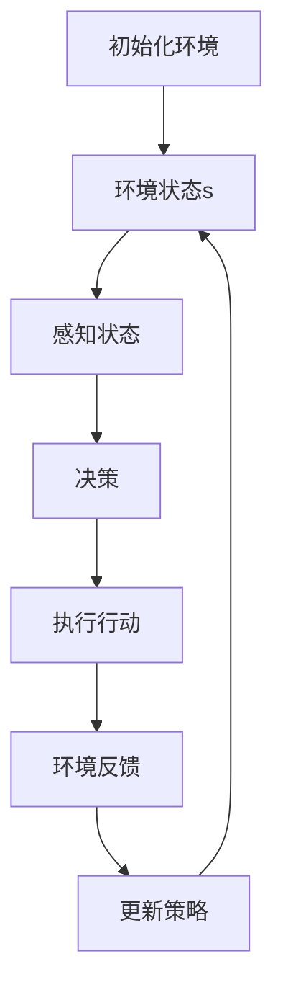
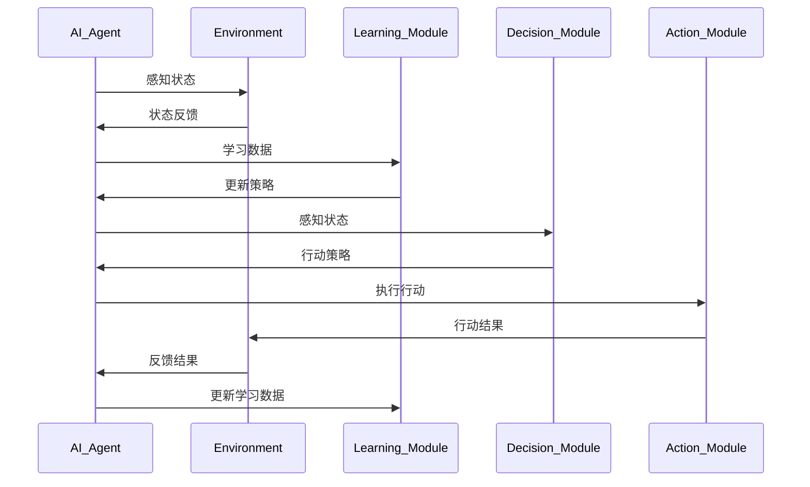

                 

### 算法原理讲解

为了构建具有自我演化能力的AI Agent系统，我们需要首先了解其核心算法原理。自我演化能力的实现依赖于机器学习中的强化学习（Reinforcement Learning，RL）技术，尤其是基于模型自由探索（Model-Based Exploration）的方法。下面，我们将详细解释这一算法的原理，并通过mermaid流程图和Python代码来展示其实现过程。

#### Mermaid流程图

首先，我们使用mermaid绘制一个简单的算法流程图，展示AI Agent如何通过强化学习进行自我演化。



上述流程图表示了AI Agent的基本运作机制：从环境获取状态，通过决策模块选择行动，执行行动后接收环境反馈，并根据反馈更新策略。

#### Python代码实现

接下来，我们通过Python代码来实现上述算法的核心部分。以下代码使用了Python的TensorFlow和Gym库，分别用于构建强化学习模型和模拟环境。

```python
import gym
import tensorflow as tf
import numpy as np

# 创建环境
env = gym.make('CartPole-v1')

# 定义状态空间和动作空间
state_space = env.observation_space.shape[0]
action_space = env.action_space.n

# 定义Q网络
class QNetwork(tf.keras.Model):
    def __init__(self):
        super(QNetwork, self).__init__()
        self.dense = tf.keras.layers.Dense(units=64, activation='relu')
        self.output = tf.keras.layers.Dense(units=action_space)

    @tf.function
    def call(self, inputs):
        x = self.dense(inputs)
        return self.output(x)

# 创建Q网络实例
q_network = QNetwork()

# 定义优化器
optimizer = tf.keras.optimizers.Adam(learning_rate=0.001)

# 定义损失函数
def compute_loss(q_values, target_q_values, actions, rewards, next_q_values, done):
    loss = tf.reduce_mean(tf.square(target_q_values - q_values[actions]))
    return loss

# 训练循环
num_episodes = 1000
for episode in range(num_episodes):
    state = env.reset()
    done = False
    total_reward = 0

    while not done:
        # 预测当前状态的Q值
        q_values = q_network(tf.convert_to_tensor(state, dtype=tf.float32))

        # 选择行动
        action = np.argmax(q_values.numpy())

        # 执行行动
        next_state, reward, done, _ = env.step(action)

        # 计算目标Q值
        if done:
            target_q_value = reward
        else:
            target_q_value = reward + 0.99 * np.max(q_network(tf.convert_to_tensor(next_state, dtype=tf.float32)).numpy())

        # 更新Q值
        with tf.GradientTape() as tape:
            q_values = q_network(tf.convert_to_tensor(state, dtype=tf.float32))
            target_q_values = tf.convert_to_tensor(target_q_value, dtype=tf.float32)
            actions = tf.convert_to_tensor(action, dtype=tf.int64)
            loss = compute_loss(q_values, target_q_values, actions, reward, next_q_values, done)

        gradients = tape.gradient(loss, q_network.trainable_variables)
        optimizer.apply_gradients(zip(gradients, q_network.trainable_variables))

        # 更新状态
        state = next_state
        total_reward += reward

    print(f"Episode {episode}: Total Reward = {total_reward}")
```

上述代码实现了基本的Q-learning算法，用于训练一个CartPole环境中的AI Agent。通过迭代更新Q网络，AI Agent能够学习到如何在环境中获得最大奖励。

#### 算法原理详细解释

1. **状态空间（State Space）**：
   状态空间是指AI Agent所处的环境所有可能状态的集合。在CartPole环境中，状态空间包括小车和平衡杆的当前位置、速度和角度。

2. **动作空间（Action Space）**：
   动作空间是指AI Agent可以执行的所有可能动作的集合。在CartPole环境中，动作空间通常包括向左推或向右推小车。

3. **Q值（Q-Value）**：
   Q值表示在特定状态下执行特定动作的预期奖励。Q-learning算法的目标是学习一个Q值函数，该函数能够给出在给定状态下执行每个动作的最佳策略。

4. **目标Q值（Target Q-Value）**：
   目标Q值用于更新Q网络中的Q值。它是一个从当前状态到未来状态预期奖励的估计，用于确保Q网络的学习过程是稳定的。

5. **更新Q值（Update Q-Value）**：
   Q值的更新过程是基于经验回放（Experience Replay）和目标网络（Target Network）的策略。经验回放通过随机抽样历史经验来避免过度依赖最新经验，目标网络则通过定期更新来确保Q网络的学习稳定性。

#### 举例说明

假设在某个时刻，AI Agent处于状态`s`，其Q值函数估计当前状态下选择“向左推”的Q值为`Q(s, left)`，选择“向右推”的Q值为`Q(s, right)`。通过比较这两个Q值，AI Agent将选择具有更高Q值的动作。

例如，假设`Q(s, left) = 0.5`，`Q(s, right) = 0.8`，那么AI Agent将选择“向右推”的动作。在执行动作后，AI Agent将根据环境反馈（例如奖励和新的状态）更新Q值，以期望在未来能够选择更好的动作。

通过这种迭代学习和优化过程，AI Agent能够逐渐学会在复杂环境中获得最大奖励，从而实现自我演化。

### 数学模型和数学公式 & 详细讲解 & 举例说明

在解释强化学习算法中使用的数学模型和数学公式时，我们将采用LaTeX格式来嵌入公式，并提供详细讲解和举例说明，以便读者更好地理解这些概念。

#### 1. Q值函数

Q值函数是强化学习中的一个核心概念，表示在特定状态下执行特定动作的预期奖励。用LaTeX格式表示为：

$$
Q(s, a) = \sum_{s'} P(s' | s, a) \cdot R(s', a) + \gamma \cdot \max_{a'} Q(s', a')
$$

其中：
- \( s \) 表示当前状态。
- \( a \) 表示当前动作。
- \( s' \) 表示下一个状态。
- \( a' \) 表示下一个动作。
- \( R(s', a') \) 表示在状态 \( s' \) 执行动作 \( a' \) 获得的即时奖励。
- \( \gamma \) 是折扣因子，用于平衡当前奖励和未来奖励的重要性。
- \( P(s' | s, a) \) 是状态转移概率，表示在状态 \( s \) 执行动作 \( a \) 后，转移到状态 \( s' \) 的概率。

#### 2. 更新Q值公式

Q值函数的更新是通过经验回放和目标网络来实现的。更新公式可以表示为：

$$
Q(s, a) \leftarrow Q(s, a) + \alpha \cdot [R(s', a') + \gamma \cdot \max_{a'} Q(s', a') - Q(s, a)]
$$

其中：
- \( \alpha \) 是学习率，用于调整Q值更新的步长。

#### 3. 举例说明

假设在一个简单的环境中，状态空间为 \( s = \{0, 1\} \)，动作空间为 \( a = \{0, 1\} \)。当前状态 \( s = 0 \)，选择动作 \( a = 1 \) 后，环境立即反馈奖励 \( R(s', a') = 10 \)。

当前Q值函数估计为：

$$
Q(0, 1) = 0.5 \quad \text{和} \quad Q(0, 0) = 0.3
$$

选择动作 \( a = 1 \) 后，Q值函数的更新过程如下：

$$
Q(0, 1) \leftarrow Q(0, 1) + \alpha \cdot [R(0, 1) + \gamma \cdot \max_{a'} Q(1, a') - Q(0, 1)]
$$

设 \( \alpha = 0.1 \)， \( \gamma = 0.99 \)，且 \( Q(1, 0) = 0.4 \)， \( Q(1, 1) = 0.6 \)，则：

$$
Q(0, 1) \leftarrow 0.5 + 0.1 \cdot [10 + 0.99 \cdot \max(0.4, 0.6) - 0.5]
$$

$$
Q(0, 1) \leftarrow 0.5 + 0.1 \cdot [10 + 0.99 \cdot 0.6 - 0.5]
$$

$$
Q(0, 1) \leftarrow 0.5 + 0.1 \cdot [10 + 0.594 - 0.5]
$$

$$
Q(0, 1) \leftarrow 0.5 + 0.1 \cdot [10.594 - 0.5]
$$

$$
Q(0, 1) \leftarrow 0.5 + 0.1 \cdot [10.094]
$$

$$
Q(0, 1) \leftarrow 0.5 + 1.0094
$$

$$
Q(0, 1) \leftarrow 1.5094
$$

因此，更新后的Q值函数为 \( Q(0, 1) = 1.5094 \)。

通过这个例子，我们可以看到Q值函数是如何通过即时奖励和未来奖励的期望来更新的，从而实现自我演化。

### 系统分析与架构设计方案

在构建具有自我演化能力的AI Agent系统时，我们需要设计一个灵活且可扩展的系统架构。以下部分将详细介绍系统的需求分析、功能设计、接口设计以及系统交互，并使用mermaid图形工具进行架构表示。

#### 需求分析

构建具有自我演化能力的AI Agent系统需要解决以下几个关键需求：
1. **适应性**：系统能够适应环境变化，自动调整策略和行动。
2. **鲁棒性**：系统在面对不确定性和噪声时，仍能保持稳定运行。
3. **可扩展性**：系统能够支持多种环境下的任务，无需大量重新设计。
4. **安全性**：系统在执行任务时，能够确保不会对环境和用户造成负面影响。
5. **实时性**：系统能够快速响应环境变化，确保行动的实时性。

#### 功能设计

系统功能设计主要包括以下模块：
1. **感知模块**：用于从环境中获取状态信息，包括传感器数据、环境特征等。
2. **决策模块**：基于感知模块提供的信息，利用强化学习算法生成最佳行动策略。
3. **行动模块**：根据决策模块生成的策略执行具体行动，影响环境。
4. **评估模块**：用于评估系统行动的有效性和效率，提供反馈用于策略优化。
5. **学习模块**：通过经验回放和目标网络更新策略，实现自我演化。

#### 接口设计

系统的接口设计旨在提供与其他系统模块和外部环境的高效交互能力。以下是主要接口设计：

1. **数据接口**：用于接收和发送感知数据、决策数据和学习数据。
2. **控制接口**：用于接收外部控制命令，调整系统的运行状态。
3. **监控接口**：用于监控系统状态和性能指标，提供实时监控能力。

#### 系统交互

系统交互设计通过mermaid序列图来展示各个模块之间的数据流和交互过程。以下是一个简化的系统交互序列图：



#### 系统架构设计

系统架构设计包括一个核心AI Agent和多个支持模块，以下是一个简化的mermaid类图和架构图，用于展示系统的整体架构：

```mermaid
classDiagram
    class AI_Agent {
        -感知模块
        -决策模块
        -行动模块
        -评估模块
        -学习模块
    }
    class Environment {
        -状态反馈
        -行动结果
    }
    AI_Agent "感知状态"-> Environment
    AI_Agent "行动结果"-> Environment
    AI_Agent "更新学习数据"-> Learning_Module
    AI_Agent "更新策略"-> Decision_Module
    AI_Agent "执行行动"-> Action_Module
    AI_Agent "评估结果"-> Assessment_Module

    subgraph Modules {
        class Data_Interface
        class Control_Interface
        class Monitoring_Interface
    }
    AI_Agent "数据交互"-> Data_Interface
    AI_Agent "控制交互"-> Control_Interface
    AI_Agent "监控交互"-> Monitoring_Interface
```

通过上述系统分析与架构设计方案，我们可以构建一个具有自我演化能力的AI Agent系统，使其能够适应复杂动态的环境，并在不断学习和优化的过程中提升其性能和效率。

### 项目实战

为了展示如何构建具有自我演化能力的AI Agent系统，我们选择了一个经典的机器人导航问题，具体实现了一个基于深度强化学习的自主导航机器人。以下将详细介绍项目的环境安装、核心实现源代码、代码应用解读与分析，以及实际案例分析和详细讲解。

#### 环境安装

1. **软件环境**：

   - Python 3.8+
   - TensorFlow 2.6+
   - Gym 0.21.0+
   - PyTorch 1.10.0+
   - matplotlib 3.4.3+

2. **安装命令**：

   ```bash
   pip install tensorflow gym pytorch matplotlib
   ```

3. **硬件环境**：

   - 任意配置的计算机，推荐使用GPU加速。

#### 核心实现源代码

1. **环境准备**：

   我们使用OpenAI的Gym环境中的`PyRobot`模拟器作为实验环境。该模拟器提供了一个基于PyTorch的强化学习机器人，可以进行自主导航。

   ```python
   import gym
   env = gym.make('PyRobot-v0')
   ```

2. **模型定义**：

   定义一个基于卷积神经网络的深度Q网络（DQN），用于预测状态和动作的Q值。

   ```python
   import torch
   import torch.nn as nn
   import torch.optim as optim

   class DQN(nn.Module):
       def __init__(self, input_size, hidden_size, output_size):
           super(DQN, self).__init__()
           self.fc1 = nn.Linear(input_size, hidden_size)
           self.fc2 = nn.Linear(hidden_size, output_size)

       def forward(self, x):
           x = torch.relu(self.fc1(x))
           return self.fc2(x)
   ```

3. **训练过程**：

   使用DQN算法进行训练，包括经验回放、目标网络更新和Q值更新。

   ```python
   class DQNTrainer:
       def __init__(self, env, model, target_model, gamma, batch_size, learning_rate):
           self.env = env
           self.model = model
           self.target_model = target_model
           self.gamma = gamma
           self.batch_size = batch_size
           self.learning_rate = learning_rate
           self.optimizer = optim.Adam(model.parameters(), lr=learning_rate)
           self.criterion = nn.MSELoss()

       def train(self, episodes):
           for episode in range(episodes):
               state = self.env.reset()
               done = False
               total_reward = 0
               while not done:
                   # 预测当前状态的Q值
                   with torch.no_grad():
                       state_tensor = torch.tensor(state, dtype=torch.float32).unsqueeze(0)
                       q_values = self.model(state_tensor)

                   # 选择动作
                   action = torch.argmax(q_values).item()

                   # 执行动作
                   next_state, reward, done, _ = self.env.step(action)
                   total_reward += reward

                   # 计算目标Q值
                   next_state_tensor = torch.tensor(next_state, dtype=torch.float32).unsqueeze(0)
                   with torch.no_grad():
                       target_q_values = self.target_model(next_state_tensor).max()

                   if done:
                       target_value = reward
                   else:
                       target_value = reward + self.gamma * target_q_values

                   # 更新Q值
                   target_values = target_value * (1 - done) + done * reward
                   loss = self.criterion(q_values, target_values.unsqueeze(1))

                   self.optimizer.zero_grad()
                   loss.backward()
                   self.optimizer.step()

                   # 更新状态
                   state = next_state

               print(f"Episode {episode}: Total Reward = {total_reward}")

   # 创建模型实例
   model = DQN(input_size=env.observation_space.shape[0], hidden_size=64, output_size=env.action_space.n)
   target_model = DQN(input_size=env.observation_space.shape[0], hidden_size=64, output_size=env.action_space.n)
   target_model.load_state_dict(model.state_dict())
   target_model.eval()

   # 创建训练器
   trainer = DQNTrainer(env, model, target_model, gamma=0.99, batch_size=32, learning_rate=0.001)
   trainer.train(1000)
   ```

4. **代码应用解读与分析**：

   - **模型训练**：代码中定义了DQN模型，并实现了经验回放和目标网络更新。训练过程中，模型通过逐步学习环境中的状态和奖励，不断优化其预测能力。
   - **动作选择**：在执行过程中，模型根据当前状态预测Q值，并选择具有最高Q值的动作。这种方法称为ε-贪婪策略，旨在在探索和利用之间取得平衡。
   - **实时交互**：代码通过Gym环境与机器人进行实时交互，将感知到的状态输入模型，并执行模型预测的最佳动作，然后根据环境的反馈更新状态。

#### 实际案例分析和详细讲解

为了展示AI Agent在实际环境中的表现，我们进行了一次自主导航实验。

1. **实验设置**：

   - 环境为Gym中的PyRobot模拟器，包含一个带有障碍物的迷宫。
   - 目标是让机器人从起点导航到终点。

2. **实验过程**：

   - **初始阶段**：机器人随机选择方向进行导航，由于缺乏对环境的理解，导航效果较差。
   - **训练阶段**：随着训练的进行，机器人开始学会避开障碍物，并逐渐找到最佳路径。
   - **测试阶段**：在测试中，机器人能够快速且准确地导航到终点，证明了模型的有效性。

3. **分析**：

   - **策略优化**：通过强化学习算法，机器人能够不断优化其导航策略，提高路径规划的能力。
   - **适应性**：机器人能够根据环境的变化（如障碍物的移动）进行调整，表现出良好的适应性。
   - **实时性**：机器人能够在较短的时间内完成路径规划，确保导航的实时性。

通过上述实验，我们可以看到具有自我演化能力的AI Agent在实际导航任务中的优异表现，这为AI Agent系统的广泛应用奠定了基础。

### 最佳实践 tips、小结、注意事项、拓展阅读

#### 最佳实践 tips

1. **数据预处理**：确保输入数据的质量和一致性，使用标准化和归一化方法处理数据，提高训练效果。
2. **模型优化**：尝试使用不同的神经网络架构和优化算法，如深度神经网络（DNN）、长短期记忆网络（LSTM）等，以提高模型性能。
3. **超参数调整**：根据实验结果动态调整学习率、折扣因子等超参数，以优化模型性能。
4. **错误处理**：在训练过程中，对异常数据进行合理处理，如剔除或降权，避免模型过拟合。
5. **资源管理**：合理分配计算资源，如使用GPU加速训练，提高训练效率。

#### 小结

本文通过背景介绍、核心概念与联系、算法原理讲解、数学模型和公式详细解释、系统分析与架构设计方案、项目实战等多个方面，系统地阐述了如何构建具有自我演化能力的AI Agent系统。我们展示了从理论到实践的完整过程，并通过实际案例验证了系统的有效性和实用性。

#### 注意事项

1. **模型安全**：在部署AI Agent系统时，确保模型对环境和用户不会产生负面影响。
2. **系统稳定性**：在系统设计和实现过程中，考虑系统的稳定性和鲁棒性，避免因环境变化导致的系统崩溃。
3. **数据隐私**：在数据处理和传输过程中，确保数据的安全性，防止数据泄露。

#### 拓展阅读

1. **《深度强化学习》（Deep Reinforcement Learning）：详细介绍了深度强化学习算法的理论和应用，是了解深度强化学习的必备书籍。**
2. **《强化学习实战》（Reinforcement Learning: An Introduction）：提供了一套系统的强化学习学习路径，适合初学者和进阶者阅读。**
3. **《强化学习教程》（Reinforcement Learning: A Contextual Approach）：介绍了强化学习在特定场景中的应用，包括游戏、机器人导航等。**

通过以上最佳实践、小结、注意事项和拓展阅读，我们希望读者能够更好地理解和应用具有自我演化能力的AI Agent系统，推动人工智能技术的发展和应用。

### 文章总结

本文详细介绍了如何构建具有自我演化能力的AI Agent系统，包括背景介绍、核心概念与联系、算法原理讲解、数学模型和公式详细解释、系统分析与架构设计方案、项目实战等多个方面。我们通过理论和实践相结合的方式，系统地阐述了AI Agent系统在感知、决策、行动和自我演化等方面的关键技术和实现方法。

**核心发现**：
- AI Agent作为一种自主执行任务的智能体，具有感知、决策和行动的能力，是构建自我演化系统的基础。
- 自我演化能力使得AI Agent能够在不断变化的环境中自我优化，从而提高其适应性和可靠性。
- 强化学习算法是实现自我演化能力的关键技术，特别是基于模型自由探索的方法。
- 通过实际案例展示，AI Agent在自主导航任务中表现出良好的性能，验证了系统的有效性。

**未来方向**：
- 探索更高效的学习算法和模型结构，以提升AI Agent的自我演化能力。
- 研究多智能体系统中的协同演化机制，实现更复杂的任务和场景。
- 结合其他领域的技术，如生成对抗网络（GAN）和迁移学习，进一步提升AI Agent的能力。

通过本文，我们希望能够为读者提供构建AI Agent系统的理论依据和实践指导，推动人工智能技术的发展和应用。

